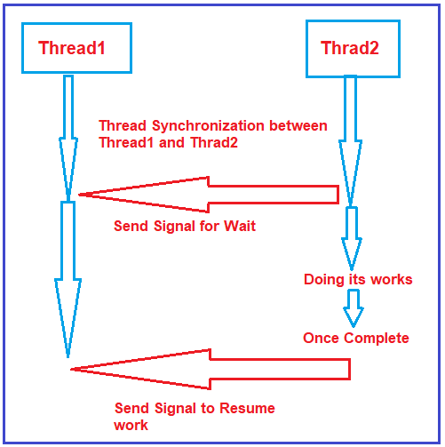
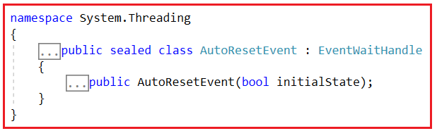
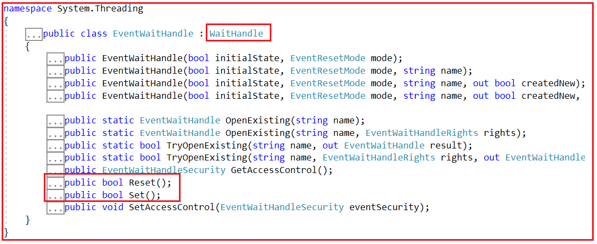
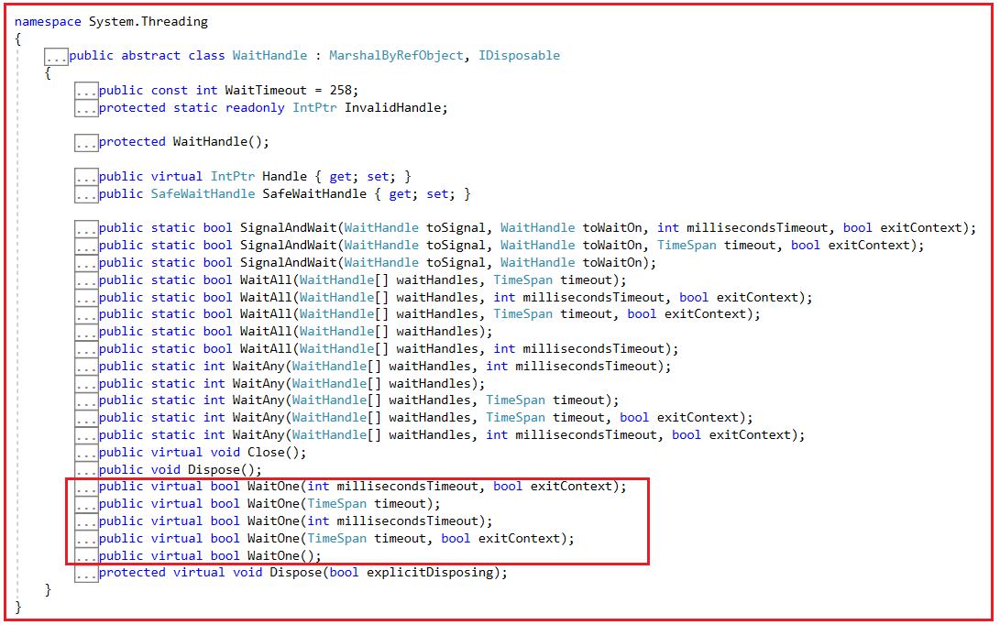
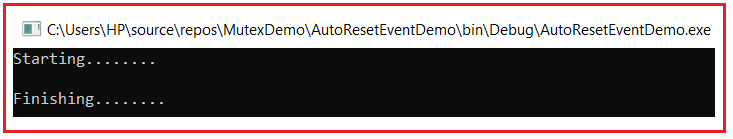
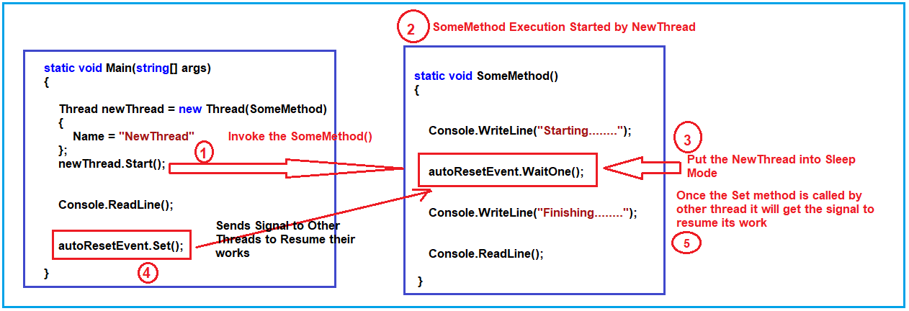
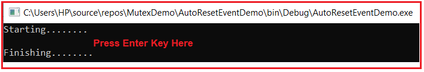
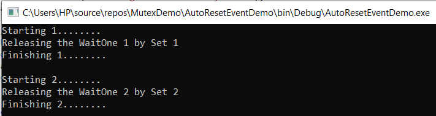
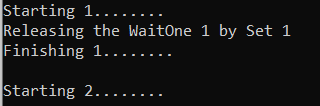

## **AutoResetEvent و ManualResetEvent در سی شارپ به همراه مثال**

در این مقاله، قصد دارم دو مفهوم مهم threading یعنی **AutoResetEvent و ManualResetEvent را در C#** با مثال‌هایی مورد بحث قرار دهم. در مقالات قبلی، نحوه پیاده‌سازی همگام‌سازی thread با استفاده از Lock، Monitor، Mutex، Semaphore و غیره را دیدیم. روش دیگری برای انجام همگام‌سازی thread وجود دارد که استفاده از متدولوژی signaling است. و هر دو AutoResetEvent و ManualResetEvent در C# به ما کمک می‌کنند تا همگام‌سازی thread را با استفاده از متدولوژی signaling پیاده‌سازی کنیم.

##### **روش سیگنالینگ چیست؟**

بیایید ابتدا بفهمیم که روش سیگنالینگ چیست و سپس نحوه پیاده‌سازی روش سیگنالینگ با استفاده از AutoResetEvent و ManualResetEvent در سی‌شارپ را درک خواهیم کرد. بیایید این موضوع را با یک مثال درک کنیم. لطفاً به تصویر زیر نگاهی بیندازید. فرض کنید دو نخ Thread1 و Thread2 داریم. و باید همگام‌سازی نخ را بین این دو نخ پیاده‌سازی کنیم. برای همگام‌سازی نخ، در اینجا thread2 سیگنالی به thread1 ارسال می‌کند و می‌گوید که لطفاً به حالت انتظار بروید. و سپس thread2 به کار خود ادامه می‌دهد. و هنگامی که thread2 کار خود را تمام کرد، دوباره سیگنالی به thread1 ارسال می‌کند و می‌گوید که می‌توانید کار خود را از جایی که متوقف شده‌اید از سر بگیرید.



بنابراین، به این ترتیب، با استفاده از روش سیگنالینگ می‌توانیم همگام‌سازی نخ را بین چندین نخ در C# پیاده‌سازی کنیم. و هر دو AutoResetEvent و ManualResetEvent در C# به ما در دستیابی به این هدف کمک می‌کنند. بنابراین، در اینجا، ابتدا مثالی با استفاده از AutoResetEvent، سپس مثالی با استفاده از ManualResetEvent و در نهایت، تفاوت‌های بین آنها را خواهیم دید.

##### **کلاس AutoResetEvent در سی شارپ:**

AutoResetEvent برای ارسال سیگنال بین دو thread استفاده می‌شود. این کلاس به thread در حال انتظار اطلاع می‌دهد که یک رویداد رخ داده است. اگر به تعریف کلاس AutoResetEvent بروید، موارد زیر را مشاهده خواهید کرد. این یک کلاس sealed است و از این رو نمی‌توان آن را به ارث برد. و از کلاس EventWaitHandle به ارث رسیده است.



این کلاس سازنده‌ی زیر را ارائه می‌دهد که می‌توانیم از آن برای ایجاد یک نمونه از کلاس AutoResetEvent در سی‌شارپ استفاده کنیم.

1. **AutoResetEvent(bool initialState) :** این تابع یک نمونه جدید از کلاس AutoResetEvent را با یک مقدار بولی که نشان می‌دهد آیا وضعیت اولیه روی signaled تنظیم شود یا خیر، مقداردهی اولیه می‌کند. در اینجا، اگر پارامتر initialState برابر با true باشد، وضعیت اولیه روی signaled تنظیم می‌شود؛ و اگر false باشد، وضعیت اولیه روی non-signal تنظیم می‌شود.

کلاس AutoResetEvent از کلاس EventWaitHandle ارث‌بری شده است و اگر به تعریف کلاس EventWaitHandle بروید، خواهید دید که این کلاس EventWaitHandle، کلاس WaitHandle را همانطور که در تصویر زیر نشان داده شده است، پیاده‌سازی می‌کند و کلاس EventWaitHandle همچنین دارای متد Set و Reset است که قرار است با شیء AutoResetEvent از آن استفاده کنیم.



دو متد زیر از این کلاس، در مثال خود استفاده خواهیم کرد.

1. **Set() :** این متد برای تنظیم وضعیت رویداد به حالت signaled استفاده می‌شود و به یک یا چند thread در حال انتظار اجازه می‌دهد تا به کار خود ادامه دهند. در صورت موفقیت‌آمیز بودن عملیات، مقدار true و در غیر این صورت، مقدار false را برمی‌گرداند.
2. **Reset() :** این متد برای تنظیم وضعیت رویداد روی حالت بدون علامت استفاده می‌شود و باعث مسدود شدن نخ‌ها می‌شود. در صورت موفقیت‌آمیز بودن عملیات، مقدار true و در غیر این صورت، مقدار false را برمی‌گرداند.

باز هم، کلاس EventWaitHandle از WaitHandle به ارث رسیده است و اگر به تعریف کلاس WaitHandle بروید، خواهید دید که این یک کلاس انتزاعی است و این کلاس دارای نسخه‌های overload شده‌ای از متد WaitOne است، همانطور که در تصویر زیر نشان داده شده است. متد WaitOne را قرار است با شیء AutoResetEvent استفاده کنیم.



ما در مثال خود از روش زیر استفاده خواهیم کرد.

1. **WaitOne() :** متد WaitOne() نخ فعلی را تا زمانی که WaitHandle فعلی سیگنالی دریافت نکند، مسدود می‌کند. اگر نمونه فعلی سیگنالی دریافت کند، مقدار true را برمی‌گرداند. اگر نمونه فعلی هرگز سیگنالی دریافت نکند، WaitHandle.WaitOne(System.Int32, System.Boolean) هرگز مقدار را برنمی‌گرداند.

##### **رویداد AutoReset در سی شارپ چگونه کار می‌کند؟**

رویداد AutoResetEvent در سی شارپ یک متغیر بولی را در حافظه نگهداری می‌کند. اگر متغیر بولی برابر با false باشد، thread را مسدود می‌کند و اگر متغیر بولی برابر با true باشد، thread را از حالت مسدود خارج می‌کند. بنابراین، وقتی نمونه‌ای از کلاس AutoResetEvent ایجاد می‌کنیم، باید مقدار پیش‌فرض مقدار بولی را به سازنده کلاس AutoResetEvent ارسال کنیم. در ادامه، سینتکس نمونه‌سازی یک شیء AutoResetEvent آمده است.  
**رویداد بازنشانی خودکار autoResetEvent = رویداد بازنشانی خودکار جدید (نادرست)؛**

##### **روش WaitOne**

متد WaitOne نخ فعلی را مسدود می‌کند و منتظر سیگنال از نخ دیگری می‌ماند. این بدان معناست که متد WaitOne نخ فعلی را در حالت Sleep نخ قرار می‌دهد. متد WaitOne در صورت دریافت سیگنال مقدار true را برمی‌گرداند و در غیر این صورت مقدار false را برمی‌گرداند. ما باید متد WaitOne را روی شیء AutoResetEvent به صورت زیر فراخوانی کنیم.  
**رویداد خودکار را دوباره تنظیم کنید. منتظر بمانید();**

نسخه دیگری از متد WaitOne که overload شده است، مقدار ثانیه را به عنوان پارامتر دریافت می‌کند و به مدت زمان مشخص شده منتظر می‌ماند. اگر هیچ سیگنالی دریافت نکند، نخ به کار خود ادامه می‌دهد. سینتکس آن به شرح زیر است.  
**autoResetEvent.WaitOne(TimeSpan.FromSeconds(2)**

##### **روش تنظیم**

متد Set سیگنالی را به نخ منتظر ارسال کرد تا کار خود را ادامه دهد. در ادامه، سینتکس فراخوانی متد Set آمده است.  
**تنظیم رویداد خودکار (autoResetEvent).**

**نکته:** مهمترین نکته‌ای که باید به خاطر داشته باشید این است که هر دو نخ، شیء AutoResetEvent یکسانی را به اشتراک می‌گذارند. هر نخ می‌تواند با فراخوانی متد WaitOne() از شیء AutoResetEvent وارد حالت انتظار شود. وقتی نخ دیگر متد Set() را فراخوانی می‌کند، نخ منتظر از حالت انسداد خارج می‌شود.

##### **مثال برای درک AutoResetEvent در سی شارپ:**

بیایید یک مثال برای درک AutoResetEvent در C# بزنیم. در مثال زیر، دو thread داریم. thread اصلی متد main و NewThread را فراخوانی می‌کند که متد SomeMethod را فراخوانی می‌کند. متد اصلی، thread جدید را فراخوانی می‌کند و thread جدید در واقع SomeMethod را اجرا می‌کند. و SomeMethod ابتدا اولین عبارت یعنی Starting….. را چاپ می‌کند و سپس متد WaitOne() را فراخوانی می‌کند که thread فعلی یعنی NewThread را در حالت انتظار قرار می‌دهد تا زمانی که سیگنال را دریافت کند. سپس در داخل متد static void Main، وقتی کلید enter را فشار می‌دهیم، متد Set را فراخوانی می‌کند که سیگنالی را به threadهای دیگر ارسال می‌کند تا کار خود را از سر بگیرند، یعنی سیگنال را به NewThread ارسال می‌کند تا کار خود را از سر بگیرد و thread جدید سپس Finishing…….. را در پنجره کنسول چاپ می‌کند.

```csharp
using System;
using System.Threading;

namespace SemaphoreDemo
{
    class Program
    {
        static AutoResetEvent autoResetEvent = new AutoResetEvent(false);
        
        static void Main(string[] args)
        {
            Thread newThread = new Thread(SomeMethod)
            {
                Name = "NewThread"
            };
            newThread.Start(); //It will invoke the SomeMethod in a different thread

            //To See how the SomeMethod goes in halt mode
            //Once we enter any key it will call set method and the SomeMethod will Resume its work
            Console.ReadLine();

            //It will send a signal to other threads to resume their work
            autoResetEvent.Set();
        }

        static void SomeMethod()
        {
            Console.WriteLine("Starting........");
            //Put the current thread into waiting state until it receives the signal
            autoResetEvent.WaitOne(); //It will make the thread in halt mode

            Console.WriteLine("Finishing........");
      Console.ReadLine(); //To see the output in the console
        }
    }
}
```

حالا برنامه را اجرا کنید، با پیغام زیر مواجه خواهید شد.


در این مرحله، نخ اصلی، نخ جدید (New Thread) نامیده می‌شود و نخ جدید اولین دستور یعنی چاپ اولین پیام در کنسول و سپس فراخوانی متد WaitOne را اجرا می‌کند. پس از فراخوانی متد WaitOne، نخ جدید به حالت خواب (sleep) می‌رود. سپس، وقتی کلید enter را فشار می‌دهیم، متد اصلی متد Set را فراخوانی می‌کند که سیگنالی به نخ‌های دیگر برای از سرگیری کارشان ارسال می‌کند. در این مرحله، SomeMethod کار خود را از سر می‌گیرد و ادامه می‌دهد و همانطور که در زیر نشان داده شده است، پیام Finishing را در پنجره کنسول مشاهده خواهید کرد.



برای درک بهتر روند کار برنامه فوق، لطفاً به تصویر زیر نگاهی بیندازید.



**نکته:** هیچ تضمینی وجود ندارد که هر فراخوانی متد Set، یک نخ را آزاد کند. اگر دو فراخوانی خیلی به هم نزدیک باشند، به طوری که فراخوانی دوم قبل از آزادسازی یک نخ رخ دهد، فقط یک نخ آزاد می‌شود. انگار فراخوانی دوم اتفاق نیفتاده است. همچنین، اگر Set زمانی فراخوانی شود که هیچ نخی در انتظار نباشد و AutoResetEvent از قبل سیگنال داده شده باشد، فراخوانی هیچ تاثیری نخواهد داشت.

##### **کلاس ManualResetEvent در سی شارپ:**

کلاس ManualResetEvent در سی شارپ دقیقاً مشابه کلاس AutoResetEvent در سی شارپ عمل می‌کند. بیایید همان مثال را با استفاده از ManualResetEvent بازنویسی کنیم و سپس تفاوت‌های بین آنها را مورد بحث قرار دهیم. به سادگی، کلاس AutoResetEvent را با کلاس ManualResetEvent در مثال زیر جایگزین کنید.

```csharp
using System;
using System.Threading;

namespace SemaphoreDemo
{
    class Program
    {
        static ManualResetEvent manualResetEvent = new ManualResetEvent(false);

        static void Main(string[] args)
        {
            Thread newThread = new Thread(SomeMethod)
            {
                Name = "NewThread"
            };
            newThread.Start(); //It will invoke the SomeMethod in a different thread

            //To See how the SomeMethod goes in halt mode
            //Once we enter any key it will call set method and the SomeMethod will Resume its work
            Console.ReadLine();

            //It will send a signal to other threads to resume their work
            manualResetEvent.Set();
        }

        static void SomeMethod()
        {
            Console.WriteLine("Starting........");
            //Put the current thread into waiting state until it receives the signal
            manualResetEvent.WaitOne(); //It will make the thread in halt mode

            Console.WriteLine("Finishing........");
            Console.ReadLine(); //To see the output in the console
        }
    }
}
```

###### **خروجی:**



##### **تفاوت‌های AutoResetEvent و ManualResetEvent در سی شارپ چیست؟**

بیایید با چند مثال تفاوت‌ها را درک کنیم. در AutoResetEvent، برای هر متد WaitOne، باید یک متد Set وجود داشته باشد. این بدان معناست که اگر ما دو بار از متد WaitOne استفاده کنیم، باید دو بار از متد Set نیز استفاده کنیم. اگر یک بار از متد Set استفاده کنیم، متد WaitOne دوم در حالت انتظار معلق می‌ماند و آزاد نمی‌شود. برای درک بهتر این موضوع، لطفاً به مثال زیر نگاهی بیندازید.

```csharp
using System;
using System.Threading;

namespace SemaphoreDemo
{
    class Program
    {
        static AutoResetEvent manualResetEvent = new AutoResetEvent(false);

        static void Main(string[] args)
        {
            Thread newThread = new Thread(SomeMethod)
            {
                Name = "NewThread"
            };
            newThread.Start(); //It will invoke the SomeMethod in a different thread

            //To See how the SomeMethod goes in halt state let sleep the main thread for 3 secs
            Thread.Sleep(3000);
            Console.WriteLine("Releasing the WaitOne 1 by Set 1");
            manualResetEvent.Set(); //Set 1 will relase the Wait 1

            //To See how the SomeMethod goes in halt state let sleep the main thread for 3 secs
            Thread.Sleep(5000);
            Console.WriteLine("Releasing the WaitOne 2 by Set 2");
            manualResetEvent.Set(); //Set 2 will relase the Wait 2
            Console.ReadKey();
        }

        static void SomeMethod()
        {
            Console.WriteLine("Starting 1........");
            manualResetEvent.WaitOne(); //Wait 1
            Console.WriteLine("Finishing 1........");
            Console.WriteLine();
            Console.WriteLine("Starting 2........");
            manualResetEvent.WaitOne(); //Wait 2
            Console.WriteLine("Finishing 2........");
        }
    }
}
```

###### **خروجی:**



اگر از AutoResetEvent در سی شارپ استفاده می‌کنیم، برای هر متد WaitOne باید و حتماً یک متد Set داشته باشیم. اگر دو متد WaitOne و یک متد Set داشته باشیم، متد WaitOne دوم در حالت خواب (sleep mode) هنگ می‌کند و آزاد نمی‌شود. برای درک بهتر، لطفاً به مثال زیر نگاهی بیندازید.

```csharp
using System;
using System.Threading;

namespace SemaphoreDemo
{
    class Program
    {
        static AutoResetEvent manualResetEvent = new AutoResetEvent(false);

        static void Main(string[] args)
        {
            Thread newThread = new Thread(SomeMethod)
            {
                Name = "NewThread"
            };
            newThread.Start(); //It will invoke the SomeMethod in a different thread

            //To See how the SomeMethod goes in halt state let sleep the main thread for 3 secs
            Thread.Sleep(3000);
            Console.WriteLine("Releasing the WaitOne 1 by Set 1");
            manualResetEvent.Set(); //Set 1 will relase the Wait 1
            
            Console.ReadKey();
        }

        static void SomeMethod()
        {
            Console.WriteLine("Starting 1........");
            manualResetEvent.WaitOne(); //Wait 1
            Console.WriteLine("Finishing 1........");
            Console.WriteLine();
            Console.WriteLine("Starting 2........");
            manualResetEvent.WaitOne(); //Wait 2
            Console.WriteLine("Finishing 2........");
        }
    }
}
```

**خروجی:** با اتمام دستور 2……. دیگر اجرا نخواهد شد؛ خروجی زیر را دریافت خواهید کرد.



اما اگر مثال قبلی را با استفاده از ManualResetEvent بنویسیم، کار خواهد کرد. یعنی یک متد Set در ManualResetEvent می‌تواند تمام متدهای WaitOne را آزاد کند. برای درک بهتر، لطفاً به مثال زیر نگاهی بیندازید.

```csharp
using System;
using System.Threading;

namespace SemaphoreDemo
{
    class Program
    {
        static ManualResetEvent manualResetEvent = new ManualResetEvent(false);

        static void Main(string[] args)
        {
            Thread newThread = new Thread(SomeMethod)
            {
                Name = "NewThread"
            };
            newThread.Start(); //It will invoke the SomeMethod in a different thread

            //To See how the SomeMethod goes in halt state let sleep the main thread for 3 secs
            Thread.Sleep(3000);
            Console.WriteLine("Releasing the WaitOne 1 by Set 1");
            manualResetEvent.Set(); //Set will release all the WaitOne
            
            Console.ReadKey();
        }

        static void SomeMethod()
        {
            Console.WriteLine("Starting 1........");
            manualResetEvent.WaitOne(); //Wait 1
            Console.WriteLine("Finishing 1........");
            Console.WriteLine();
            Console.WriteLine("Starting 2........");
            manualResetEvent.WaitOne(); //Wait 2
            Console.WriteLine("Finishing 2........");
        }
    }
}
```

###### **خروجی:**

 در سی شارپ به همراه مثال")

بنابراین، تنها و تنها تفاوت بین AutoResetEvent و ManualResetEvent در C# این است که برای هر متد WaitOne باید یک متد Set متناظر در AutoResetEvent وجود داشته باشد، در حالی که برای همه متدهای WaitOne، در مورد ManualResetEvent، یک متد Set برای انتشار کافی است.
