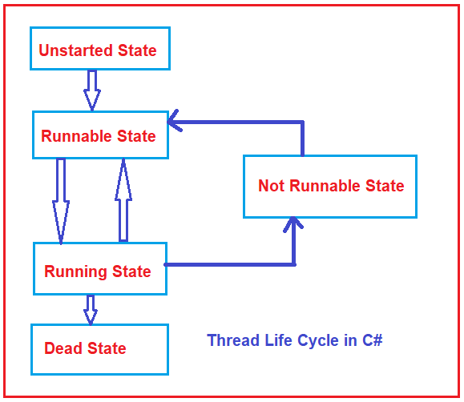
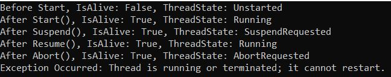

## **چرخه حیات نخ در سی شارپ به همراه مثال**

در این مقاله، قصد دارم **چرخه حیات نخ (Thread Life Cycle) در سی شارپ را** با مثال بررسی کنم. لطفاً مقاله قبلی ما را که در آن به بررسی AutoResetEvent و ManualResetEvent در سی شارپ با مثال پرداختیم، مطالعه کنید.

##### **چرخه حیات نخ (Thread Life Cycle) در سی شارپ**

یک نخ در سی شارپ دارای یک چرخه حیات است که با ایجاد یک نمونه از کلاس Thread شروع می‌شود و چرخه حیات نخ زمانی پایان می‌یابد که اجرای وظیفه نخ تکمیل شود یا نخ خاتمه یابد. یک نخ در سی شارپ در هر نقطه از زمان در یکی از حالت‌های زیر وجود دارد.

1. **حالت شروع نشده (جدید)**
2. **وضعیت قابل اجرا (آماده اجرا)**
3. **دویدن**
4. **حالت غیرقابل اجرا**
5. **حالت مرده**

برای درک بهتر، لطفاً به نمودار زیر که حالت‌های مختلف نخ را در سی‌شارپ نشان می‌دهد، نگاهی بیندازید.



حالا، بیایید هر حالت را با جزئیات درک کنیم.

##### **حالت شروع نشده یا حالت جدید:**

وقتی ما یک نمونه از کلاس Thread ایجاد می‌کنیم، در حالت unstarted قرار دارد. این بدان معناست که Thread به تازگی ایجاد شده اما هنوز شروع نشده است. این بدان معناست که ما شیء Thread را ایجاد کرده‌ایم اما متد Start() را فراخوانی نکرده‌ایم. در ادامه مثالی برای ایجاد یک نمونه Thread در C# آمده است.  
**موضوع thread = موضوع جدید (SomeMethod)؛**  
پس از اجرای دستور بالا، نخ ایجاد می‌شود اما در حالت شروع نشده قرار دارد. در حالت شروع نشده، یک نخ زنده در نظر گرفته نمی‌شود. به محض اینکه متد Start() روی نمونه نخ فراخوانی شود، از حالت شروع نشده خارج شده و وارد حالت بعدی می‌شود، اما پس از خروج از حالت شروع نشده، بازگشت نخ به این حالت شروع نشده در طول عمر خود غیرممکن نیست. حالت شروع نشده را می‌توان حالت جدید نیز نامید.

##### **وضعیت قابل اجرا (آماده اجرا):**

وقتی متد start() را فراخوانی می‌کنیم، نخ از حالت شروع نشده به حالت قابل اجرا یا آماده اجرا منتقل می‌شود. این بدان معناست که اکنون نخ واجد شرایط اجرا است، اما هنوز اجرا نمی‌شود، زیرا زمان‌بند نخ آن را برای اجرا انتخاب نکرده است. ممکن است چندین نخ در حالت قابل اجرا وجود داشته باشد. اگر چندین نخ در حالت قابل اجرا وجود داشته باشد، زمان‌بند نخ تصمیم می‌گیرد که کدام نخ از حالت قابل اجرا باید به حالت بعدی یعنی حالت در حال اجرا منتقل شود. نخی که در حالت قابل اجرا است، زنده در نظر گرفته می‌شود. یک نخ می‌تواند پس از بازگشت از حالت خواب، انتظار/مسدود یا در حال اجرا به حالت قابل اجرا بازگردد.

##### **حالت اجرا:**

یک نخ زمانی وارد حالت اجرا می‌شود که زمان‌بند نخ، آن را برای اجرا انتخاب کند (از بین تمام نخ‌هایی که آماده اجرا یا در حالت قابل اجرا هستند)، فقط یک نخ در یک فرآیند می‌تواند در یک زمان اجرا شود. در زمان اجرا، نخ در حالت اجرا است. نخی که در حالت در حال اجرا است، زنده است. از حالت اجرا، یک نخ می‌تواند وارد حالت‌های غیر قابل اجرا، قابل اجرا یا مرده شود.

##### **حالت غیرقابل اجرا:**

یک نخ در سی شارپ در سناریوهای زیر وارد حالت غیر قابل اجرا می‌شود. وقتی یک نخ در هر یک از موقعیت‌های زیر قرار می‌گیرد، به حالت غیر قابل اجرا منتقل می‌شود و دیگر واجد شرایط اجرا نیست، اما حتی در این حالت، نخ هنوز زنده در نظر گرفته می‌شود. برخی افراد به این حالت، حالت WaitSleepJoin نیز می‌گویند.

1. وقتی متد Wait() را روی شیء thread فراخوانی می‌کنیم و منتظر است تا threadهای دیگر آن را مطلع کنند یا بیدارش کنند.
2. وقتی متد Sleep() را روی شیء thread فراخوانی کردیم و از آن خواستیم برای مدت زمانی به حالت خواب برود.
3. وقتی یک نخ، متد ()Join را در نخ دیگری فراخوانی کرده باشد، باعث می‌شود نخ اول منتظر بماند تا اجرای نخ دیگر تمام شود.
4. وقتی یک نخ منتظر آزاد شدن ورودی/خروجی یا سایر منابع است.

**نکته:** وقتی نخ از حالت «غیرقابل اجرا» خارج می‌شود، دوباره به حالت «قابل اجرا» وارد می‌شود.

##### **حالت مرده:**

وقتی نخ وظیفه خود را به پایان رساند، وارد حالت مرده، خاتمه یا لغو می‌شود. این به این معنی است که اجرای نخ به پایان رسیده است. این آخرین حالت در چرخه حیات یک نخ است. یک نخ پس از اتمام موفقیت‌آمیز اجرای متد ورودی خود یعنی Start() یا زمانی که متد Abort() برای لغو اجرای آن فراخوانی شده باشد، وارد حالت مرده می‌شود. در این حالت، یک نخ زنده تلقی نمی‌شود و از این رو اگر سعی کنید متد Start() را روی یک نخ مرده فراخوانی کنید، خطای ThreadStateException رخ می‌دهد.

##### **ویژگی‌ها و متدهای مهم کلاس Thread در سی شارپ:**

کلاس Thread در سی شارپ ویژگی‌های مختلفی را ارائه می‌دهد که به ما امکان انجام وظایف مختلفی مانند دریافت وضعیت یک thread و تعیین نام برای thread را می‌دهد. در ادامه ویژگی‌های کلاس Thread در سی شارپ آمده است.

1. **CurrentThread** **:** نمونه‌ای از رشته‌ی در حال اجرای فعلی را دریافت می‌کند. این بدان معناست که یک نمونه از رشته‌ای که رشته‌ی در حال اجرای فعلی است را برمی‌گرداند.
2. **IsAlive** : مقداری را دریافت می‌کند که وضعیت اجرای نخ فعلی را نشان می‌دهد. اگر این نخ شروع شده باشد و به طور معمول خاتمه نیافته یا لغو نشده باشد، مقدار true را برمی‌گرداند؛ در غیر این صورت، false را برمی‌گرداند.
3. **Name** : برای دریافت یا تنظیم نام thread استفاده می‌شود. رشته‌ای حاوی نام thread را برمی‌گرداند، یا اگر نامی تنظیم نشده باشد، null را برمی‌گرداند.
4. **ThreadState** : مقداری شامل وضعیت‌های نخ فعلی را دریافت می‌کند. یکی از مقادیر System.Threading.ThreadState را برمی‌گرداند که نشان‌دهنده وضعیت نخ فعلی است. مقدار اولیه آن Unstarted است.

کلاس Thread در سی شارپ متدهای زیر را برای پیاده‌سازی وضعیت نخ‌ها ارائه می‌دهد.

1. **Sleep() :** این متد نخ فعلی را برای مدت زمان مشخص شده به حالت تعلیق در می‌آورد.
2. **Join():** این متد، نخ فراخوانی‌کننده را تا زمانی که نخ نمایش داده شده توسط این نمونه خاتمه یابد، مسدود می‌کند و در عین حال به انجام پمپاژ استاندارد COM و SendMessage ادامه می‌دهد.
3. **Abort():** این متد در نخی که روی آن فراخوانی شده است، خطای System.Threading.ThreadAbortException را ایجاد می‌کند تا فرآیند خاتمه دادن به نخ را آغاز کند. فراخوانی این متد معمولاً نخ را خاتمه می‌دهد.
4. **Suspend()** : این متد یا نخ را به حالت تعلیق در می‌آورد یا اگر نخ از قبل به حالت تعلیق درآمده باشد، هیچ تاثیری ندارد.
5. **Resume():** این متد، نخی را که به حالت تعلیق درآمده است، از سر می‌گیرد.
6. **Start():** این متد باعث می‌شود سیستم عامل وضعیت نمونه فعلی را به حالت در حال اجرا تغییر دهد.

##### **مثال برای درک وضعیت چرخه حیات نخ در سی شارپ:**

مثال زیر حالت‌های مختلف نخ را نشان می‌دهد. این حالت‌های نخ با استفاده از ویژگی ThreadState از کلاس Thread تعیین می‌شوند. همچنین، ما از متدهای Suspend() و Resume() برای تعلیق اجرای فعلی نخ و از سرگیری نخ معلق با استفاده از متد Resume() استفاده می‌کنیم. ما همچنین متد Abort را برای خاتمه دادن به نخ فراخوانی کرده‌ایم و پس از خاتمه دادن به نخ، دوباره متد Start را روی نمونه نخ فراخوانی می‌کنیم که یک استثنا ایجاد می‌کند.

```csharp
using System;
using System.Threading;

namespace ThreadStateDemo
{
    class Program
    {
        static void Main(string[] args)
        {
            try
            {
                // Creating and initializing threads Unstarted state
                Thread thread1 = new Thread(SomeMethod);
                Console.WriteLine($"Before Start, IsAlive: {thread1.IsAlive}, ThreadState: {thread1.ThreadState}");

                // Running State
                thread1.Start();
                Console.WriteLine($"After Start(), IsAlive: {thread1.IsAlive}, ThreadState: {thread1.ThreadState}");

                // thread1 is in suspended state
                thread1.Suspend();
                Console.WriteLine($"After Suspend(), IsAlive: {thread1.IsAlive}, ThreadState: {thread1.ThreadState}");

                // thread1 is resume to running state
                thread1.Resume();
                Console.WriteLine($"After Resume(), IsAlive: {thread1.IsAlive}, ThreadState: {thread1.ThreadState}");

                // thread1 is in Abort state
                //In this case, it will start the termination, IsAlive still gives you as true
                thread1.Abort();
                Console.WriteLine($"After Abort(), IsAlive: {thread1.IsAlive}, ThreadState: {thread1.ThreadState}");

                //Calling the Start Method on a dead thread will result an Exception
                thread1.Start();
            }
            catch (Exception ex)
            {
                Console.WriteLine($"Exception Occurred: {ex.Message}");
            }
            
            Console.ReadKey();
        }

        public static void SomeMethod()
        {
            for (int x = 0; x < 3; x++)
            {
                Thread.Sleep(1000);
            }
            Console.WriteLine("SomeMethod Completed...");
        }
    }
}
```

###### **خروجی:**

