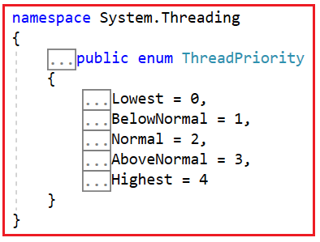
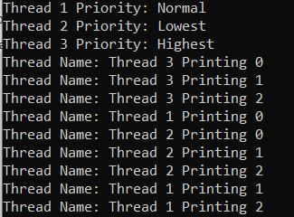

## **اولویت‌های نخ‌ها در سی‌شارپ به همراه مثال**

در این مقاله، قصد دارم **اولویت‌های نخ‌ها در سی‌شارپ را** با مثال‌هایی مورد بحث قرار دهم. لطفاً مقاله قبلی ما را که در آن چرخه حیات نخ در سی‌شارپ را با مثال‌هایی مورد بحث قرار دادیم، مطالعه کنید.

##### **اولویت‌های نخ‌ها در سی‌شارپ**

در زبان برنامه‌نویسی سی‌شارپ، هر رشته اولویتی دارد که تعیین می‌کند هر رشته چند وقت یکبار به پردازنده مرکزی دسترسی پیدا می‌کند. به طور کلی، یک رشته با اولویت پایین، زمان پردازنده کمتری نسبت به یک رشته با اولویت بالا دریافت می‌کند. نکته مهمی که باید بدانیم این است که یک رشته چقدر زمان پردازنده مرکزی دریافت می‌کند، این موضوع نه تنها به اولویت آن بستگی دارد، بلکه به نوع عملیاتی که انجام می‌دهد نیز بستگی دارد.

برای مثال، اگر یک نخ با اولویت بالا منتظر منابع ورودی/خروجی مشترک برای تکمیل وظیفه خود باشد، توسط CPU مسدود و حذف می‌شود. و در همان زمان، یک نخ با اولویت پایین‌تر ممکن است زمان CPU را دریافت کرده و اجرای خود را به پایان برساند، اگر به چنین منابع ورودی/خروجی مشترکی نیاز نداشته باشد. در سناریوهایی مانند این، یک نخ با اولویت بالا ممکن است در یک دوره زمانی خاص، زمان CPU کمتری نسبت به یک نخ با اولویت پایین دریافت کند.

عامل دیگری که تعیین می‌کند چه مقدار از زمان CPU به یک نخ اختصاص داده شود، نحوه پیاده‌سازی زمان‌بندی وظایف توسط سیستم عامل است.

##### **چگونه اولویت یک نخ را در سی شارپ تنظیم کنیم؟**

وقتی یک نمونه از کلاس Thread ایجاد می‌کنیم، شیء thread یک تنظیم اولویت پیش‌فرض دریافت می‌کند. می‌توانیم اولویت یک thread را با استفاده از ویژگی Priority زیر از کلاس Thread دریافت یا تنظیم کنیم.

1. **اولویت نخ (ThreadPriority Priority) {get; set;}:** این ویژگی برای دریافت یا تنظیم مقداری که اولویت زمان‌بندی یک نخ را نشان می‌دهد، استفاده می‌شود. این ویژگی یکی از مقادیر ThreadPriority را برمی‌گرداند. مقدار پیش‌فرض ThreadPriority.Normal است.

این یعنی می‌توانیم ویژگی Priority را با یکی از فیلدهای ThreadPriority Enum تنظیم کنیم. اگر به تعریف ThreadPriority enum بروید، امضای زیر را خواهید دید.



Enum مربوط به ThreadPriority، پنج ویژگی زیر را ارائه می‌دهد:

1. **کمترین \= ۰:** این رشته می‌تواند بعد از رشته‌هایی با هر اولویت دیگری زمان‌بندی شود. این یعنی رشته‌هایی با کمترین اولویت می‌توانند بعد از رشته‌هایی با هر اولویت بالاتر دیگری زمان‌بندی شوند.
2. **BelowNormal \= 1:** این Thread می‌تواند بعد از Threadهایی با اولویت Normal و قبل از Threadهایی با کمترین اولویت برنامه‌ریزی شود. این یعنی Threadهایی با اولویت BelowNormal می‌توانند بعد از Threadهایی با اولویت Normal و قبل از Threadهایی با کمترین اولویت برنامه‌ریزی شوند.
3. **Normal \= 2:** این Thread می‌تواند بعد از Threadهایی با اولویت AboveNormal و قبل از Threadهایی با اولویت BelowNormal زمان‌بندی شود. Threadها به طور پیش‌فرض اولویت Normal دارند. این بدان معناست که Threadهایی با اولویت Normal می‌توانند بعد از Threadهایی با اولویت AboveNormal و قبل از Threadهایی با اولویت BelowNormal و Lowest زمان‌بندی شوند.
4. **AboveNormal \= 3:** این Thread می‌تواند بعد از Threadهایی با بالاترین اولویت و قبل از Threadهایی با اولویت Normal برنامه‌ریزی شود. این بدان معناست که Threadهایی با اولویت AboveNormal می‌توانند بعد از Thread با بالاترین اولویت و قبل از Threadهایی با اولویت Normal، BelowNormal و Lowest برنامه‌ریزی شوند.
5. **بالاترین \= ۴:** این رشته می‌تواند قبل از رشته‌هایی با هر اولویت دیگری زمان‌بندی شود. این بدان معناست که رشته‌هایی با بالاترین اولویت می‌توانند قبل از رشته‌هایی با هر اولویت دیگری زمان‌بندی شوند.

**نکته:** به طور پیش‌فرض، وقتی یک نخ ایجاد می‌کنیم، اولویت پیش‌فرض آن ۲ می‌شود، یعنی ThreadPriority.Normal

##### **چگونه می‌توانیم اولویت یک نخ را در سی شارپ تنظیم و دریافت کنیم؟**

بیایید مثالی بزنیم تا نحوه تنظیم و دریافت اولویت‌های یک Thread در C# را با استفاده از ویژگی Priority از کلاس Thread درک کنیم. برای درک بهتر، لطفاً به مثال زیر نگاهی بیندازید.

```csharp
using System;
using System.Threading;

namespace ThreadStateDemo
{
    class Program
    {
        static void Main(string[] args)
        {
            Thread thread1 = new Thread(SomeMethod)
            {
                Name = "Thread 1"
            };
            //Setting the thread Priority as Normal
            thread1.Priority = ThreadPriority.Normal;

            Thread thread2 = new Thread(SomeMethod)
            {
                Name = "Thread 2"
            };
            //Setting the thread Priority as Lowest
            thread2.Priority = ThreadPriority.Lowest;

            Thread thread3 = new Thread(SomeMethod)
            {
                Name = "Thread 3"
            };
            //Setting the thread Priority as Highest
            thread3.Priority = ThreadPriority.Highest;

            //Getting the thread Prioroty
            Console.WriteLine($"Thread 1 Priority: {thread1.Priority}");
            Console.WriteLine($"Thread 2 Priority: {thread2.Priority}");
            Console.WriteLine($"Thread 3 Priority: {thread3.Priority}");

            thread1.Start();
            thread2.Start();
            thread3.Start();

            Console.ReadKey();
        }

        public static void SomeMethod()
        {
            for (int i = 0; i < 3; i++)
            {
                Console.WriteLine($"Thread Name: {Thread.CurrentThread.Name} Printing {i}");
            }
        }
    }
}
```

###### **خروجی:**



**نکته:** خروجی غیرقابل پیش‌بینی است زیرا نخ‌ها به شدت به سیستم وابسته هستند. زمان‌بند نخ سیستم عامل، نخ‌ها را بدون هیچ تضمینی زمان‌بندی می‌کند، اما سعی می‌کند آنها را در نظر بگیرد. برای وظایف طولانی مدت، نخ‌ها از مزیت تنظیم اولویت بهره‌مند می‌شوند.

##### **چرا در سی شارپ به اولویت نخ‌ها نیاز داریم؟**

خب، این در موارد معمول لازم نیست. با این حال، در برخی موارد که ممکن است بخواهید اولویت برخی از نخ‌ها را افزایش دهید. یک مثال از این دست می‌تواند زمانی باشد که می‌خواهید وظایف خاصی زودتر از بقیه انجام شوند.

##### **نکاتی که باید به خاطر داشت:**

1. یک برنامه‌نویس می‌تواند به طور صریح اولویت را به یک نخ اختصاص دهد.
2. مقدار پیش‌فرض ThreadPriority.Normal است.
3. سیستم عامل به نخ‌ها اولویت نمی‌دهد.
4. اگر نخ به وضعیت نهایی، مانند لغو شده، رسیده باشد، خطای ThreadStateException رخ می‌دهد.
5. اگر مقدار مشخص شده برای یک عملیات تنظیم شده، یک مقدار ThreadPriority معتبر نباشد، خطای ArgumentException رخ می‌دهد.
6. تضمینی وجود ندارد که نخی که اولویت بالایی دارد اول و نخی که اولویت پایینی دارد بعد از آن اجرا شود. به دلیل تغییر زمینه، نخی که بالاترین اولویت را دارد ممکن است بعد از نخی که کمترین اولویت را دارد اجرا شود.