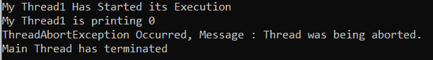

## **چگونه یک نخ را در سی شارپ با مثال خاتمه دهیم؟**

در این مقاله، قصد دارم **نحوه‌ی خاتمه دادن به یک نخ در سی‌شارپ را** با مثال‌هایی بررسی کنم. لطفاً مقاله‌ی قبلی ما را که در آن به اولویت‌بندی نخ‌ها در سی‌شارپ با مثال‌هایی پرداخته‌ایم، مطالعه کنید.

##### **چگونه یک نخ (Thread) را در سی شارپ (C#) خاتمه دهیم؟**

در سی شارپ، یک نخ می‌تواند با فراخوانی متد Abort() از نمونه نخ خاتمه یابد. متد Abort() خطای ThreadAbortException را به نخی که در آن فراخوانی شده است، ارسال می‌کند. به دلیل این استثنا، نخ خاتمه می‌یابد.

اگر متد ()Abort قبل از فراخوانی متد ()Start روی یک نخ فراخوانی شود، فراخوانی متد ()Start روی چنین نخی، بعداً، آن را شروع نمی‌کند، بلکه خطای ThreadStartException را در نخی که متد ()Abort را فراخوانی کرده است، ایجاد می‌کند و هر دو نخ را لغو می‌کند.

اگر متد ()Abort روی نخی که شروع شده و در یکی از حالت‌های مسدود شده یعنی حالت انتظار، حالت خواب یا حالت پیوستن قرار دارد، فراخوانی شود، ابتدا نخ را قطع کرده و سپس آن را لغو می‌کند.

دو نسخه سربارگذاری شده از متد Abort() در کلاس Thread موجود است. آنها به شرح زیر هستند:

1. **Abort():** این متد در نخی که روی آن فراخوانی شده است، خطای System.Threading.ThreadAbortException را ایجاد می‌کند تا فرآیند خاتمه دادن به نخ را آغاز کند. فراخوانی این متد معمولاً نخ را خاتمه می‌دهد. اگر نخی که قرار است لغو شود در حال حاضر به حالت تعلیق درآمده باشد، خطای ThreadStateException را صادر می‌کند. اگر فراخواننده مجوز لازم را نداشته باشد، خطای SecurityException را صادر می‌کند.
2. **Abort(object stateInfo):** این متد یک خطای System.Threading.ThreadAbortException در نخی که روی آن فراخوانی شده است، ایجاد می‌کند تا فرآیند خاتمه دادن به نخ را آغاز کند و در عین حال اطلاعات استثنا در مورد خاتمه نخ را نیز ارائه دهد. فراخوانی این متد معمولاً نخ را خاتمه می‌دهد. در اینجا، پارامتر stateInfo یک شیء را مشخص می‌کند که حاوی اطلاعات خاص برنامه، مانند وضعیت، است که می‌تواند توسط نخی که لغو می‌شود استفاده شود. اگر نخی که لغو می‌شود در حال حاضر به حالت تعلیق درآمده باشد، خطای ThreadStateException را ایجاد می‌کند. اگر فراخواننده مجوز لازم را نداشته باشد، خطای SecurityException را ایجاد می‌کند.

##### **مثال برای درک متد ()Abort از کلاس Thread در سی شارپ:**

بیایید مثالی برای درک **متد Abort()** از کلاس Thread در C# برای خاتمه دادن به یک thread ببینیم. این متد یک ThreadAbortException در thread ای که روی آن فراخوانی شده است، ایجاد می‌کند تا فرآیند خاتمه دادن به thread آغاز شود. به طور کلی، این متد برای خاتمه دادن به thread استفاده می‌شود. برای درک بهتر، لطفاً به مثال زیر نگاهی بیندازید.

```csharp
using System;
using System.Threading;

namespace ThreadStateDemo
{
    class Program
    {
        static void Main(string[] args)
        {
            // Creating and initializing threads
            Thread thread = new Thread(SomeMethod);
            thread.Start();

            Console.WriteLine("Thread is Abort");
            // Abort thread Using Abort() method
            thread.Abort();

            Console.ReadKey();
        }

        public static void SomeMethod()
        {
            for (int x = 0; x < 3; x++)
            {
                Console.WriteLine(x);
            }
        }
    }
}
```

**خروجی: نخ متوقف می‌شود**

مثال بالا نحوه‌ی استفاده از متد ()Abort را که توسط کلاس Thread ارائه شده است، نشان می‌دهد. با استفاده از دستور thread.Abort(); می‌توانیم اجرای thread را خاتمه دهیم.

##### **مثالی برای درک متد Abort(object stateInfo) از کلاس Thread در سی شارپ:**

بیایید مثالی برای درک **متد Abort(object stateInfo)** از کلاس Thread در C# برای خاتمه دادن به یک نخ ببینیم. این متد یک ThreadAbortException در نخی که روی آن فراخوانی شده است، ایجاد می‌کند تا فرآیند خاتمه دادن به نخ را آغاز کند و در عین حال اطلاعات استثنا در مورد خاتمه نخ را نیز ارائه دهد. به طور کلی، این متد برای خاتمه دادن به نخ استفاده می‌شود. برای درک بهتر، لطفاً به مثال زیر نگاهی بیندازید.

```csharp
using System;
using System.Threading;

namespace ThreadStateDemo
{
    class Program
    {
        static void Main(string[] args)
        {
            Thread thread = new Thread(SomeMethod)
            {
                Name = "Thread 1"
            };
            thread.Start();
            Thread.Sleep(1000);
            Console.WriteLine("Abort Thread Thread 1");
            thread.Abort(100);

            // Waiting for the thread to terminate.
            thread.Join();
            Console.WriteLine("Main thread is terminating");

            Console.ReadKey();
        }

        public static void SomeMethod()
        {
            try
            {
                Console.WriteLine($"{Thread.CurrentThread.Name} is Starting");

                for (int j = 1; j <= 100; j++)
                {
                    Console.Write(j + " ");
                    if ((j % 10) == 0)
                    {
                        Console.WriteLine();
                        Thread.Sleep(200);
                    }
                }
                Console.WriteLine($"{Thread.CurrentThread.Name} Exiting Normally");
            }
            catch (ThreadAbortException ex)
            {
                Console.WriteLine($"{Thread.CurrentThread.Name} is aborted and the code is {ex.ExceptionState}");
            }
        }
    }
}
```

###### **خروجی:**

 از کلاس Thread در سی شارپ")

##### **فراخوانی متد ()Abort روی یک نخ در حال اجرا در سی شارپ:**

در مثال زیر، ما متد ()Abort را روی نخ در حال اجرا فراخوانی می‌کنیم. این کار باعث ایجاد خطای ThreadAbortException می‌شود و نخی را که متد ()Abort روی آن فراخوانی شده است، لغو می‌کند. فراخوانی متد ()Abort یک خطای ThreadAbortException ایجاد می‌کند، بنابراین دستورات آن را درون یک بلوک try-catch قرار می‌دهیم تا خطا را دریافت کند.

```csharp
using System;
using System.Threading;

namespace ThreadStateDemo
{
    class Program
    {
        static void Main(string[] args)
        {
            //Creating an object Thread class
            Thread thread = new Thread(SomeMethod)
            {
                Name = "My Thread1"
            };
            thread.Start();

            //Making the main Thread sleep for 1 second
            //Giving the child thread enough time to start its execution
            Thread.Sleep(1000);

            //Calling the Abort() on thread object
            //This will abort the new thread and throw ThreadAbortException in it
            thread.Abort();

            Console.ReadKey();
        }

        public static void SomeMethod()
        {
            try
            {
                Console.WriteLine($"{Thread.CurrentThread.Name} Has Started its Execution");
                for (int i = 0; i < 3; i++)
                {
                    Console.WriteLine($"{Thread.CurrentThread.Name} is printing {i}");

                    //Calling the Sleep() method to make it sleep and 
                    //suspend for 2 seconds after printing a number
                    Thread.Sleep(1000);
                }
                Console.WriteLine($"{Thread.CurrentThread.Name} Has Finished its Execution");
            }
            catch (ThreadAbortException e)
            {
                Console.WriteLine($"ThreadAbortException Occurred, Message : { e.Message}");
            }
        }
    }
}
```

###### **خروجی:**

Abort روی یک نخ در حال اجرا در سی شارپ")

##### **فراخوانی متد ()Abort روی نخی که هنوز شروع نشده است.**

در مثال زیر، ما قبل از فراخوانی متد Start() در یک نخ، متد Abort() را روی آن فراخوانی می‌کنیم. فراخوانی متد Start() در چنین نخی، بعداً، آن را شروع نمی‌کند، بلکه خطای ThreadStartException را ایجاد می‌کند. برای درک بهتر، لطفاً به مثال زیر نگاهی بیندازید.

```csharp
using System;
using System.Threading;

namespace ThreadStateDemo
{
    class Program
    {
        static void Main(string[] args)
        {
            try
            {
                //Creating an object Thread class
                Thread MyThread = new Thread(SomeMethod)
                {
                    Name = "My Thread1"
                };

                //Calling the Abort() method on MyThread which hasn't started yet
                //This will leads to the ThreadStartException
                //And calling the Start() method on the same thread later on will abort it and throw ThreadStartException
                MyThread.Abort();

                //Calling the Start() method will not start the thread
                //but throw ThreadStartException and abort it.
                //Because the Abort() method was called on it before it could start
                MyThread.Start();

                Console.WriteLine("Main Thread has terminated");
            }
            catch (ThreadStartException e)
            {
                Console.WriteLine($"ThreadStartException Occurred, Message : { e.Message}");
            }
            
            Console.ReadKey();
        }

        public static void SomeMethod()
        {
            try
            {
                Console.WriteLine($"{Thread.CurrentThread.Name} Has Started its Execution");
                for (int i = 0; i < 3; i++)
                {
                    Console.WriteLine($"{Thread.CurrentThread.Name} is printing {i}");

                    //Calling the Sleep() method to make it sleep and 
                    //suspend for 2 seconds after printing a number
                    Thread.Sleep(1000);
                }
                Console.WriteLine($"{Thread.CurrentThread.Name} Has Finished its Execution");
            }
            catch (ThreadAbortException e)
            {
                Console.WriteLine($"ThreadAbortException Occurred, Message : { e.Message}");
            }
        }
    }
}
```

###### **خروجی:**

 روی نخی که هنوز شروع نشده است")

##### **فراخوانی متد ()Abort روی نخی که در حالت Blocked در سی شارپ قرار دارد:**

وقتی متد ()Abort را روی یک نخ فراخوانی می‌کنیم که اجرای آن آغاز شده است، اما در حال حاضر در یکی از حالت‌های مسدود شده یعنی وضعیت انتظار، وضعیت خواب یا وضعیت پیوستن قرار دارد، ابتدا نخ را قطع کرده و سپس با صدور خطای ThreadAbortException آن را لغو می‌کند. برای درک بهتر، لطفاً به مثال زیر نگاهی بیندازید.

```csharp
using System;
using System.Threading;

namespace ThreadStateDemo
{
    class Program
    {
        static void Main(string[] args)
        {
            //Creating an object Thread class
            Thread MyThread = new Thread(SomeMethod)
            {
                Name = "My Thread1"
            };

            MyThread.Start();

            //Making the Main thread sleep for 500 milliseconds
            //Which gives enough time for its child start to start its execution
            Thread.Sleep(500);

            //Main thread calling Abort() on the child Thread which is in a blocked state
            //will throw ThreadAbortException 
            MyThread.Abort();
            
            //Main thread has called Join() method on the new thread
            //To wait until its execution is complete
            MyThread.Join();
            
            Console.WriteLine("Main Thread has terminated");

            Console.ReadKey();
        }

        public static void SomeMethod()
        {
            try
            {
                Console.WriteLine($"{Thread.CurrentThread.Name} Has Started its Execution");
                for (int i = 0; i < 3; i++)
                {
                    Console.WriteLine($"{Thread.CurrentThread.Name} is printing {i}");
                    //Calling the Sleep() method on newly created thread
                    //To make it sleep and suspend for 3 seconds after printing a number
                    Thread.Sleep(3000);
                }
                Console.WriteLine($"{Thread.CurrentThread.Name} Has Finished its Execution");
            }
            catch (ThreadAbortException e)
            {
                Console.WriteLine($"ThreadAbortException Occurred, Message : { e.Message}");
            }
        }
    }
}
```

###### **خروجی:**

