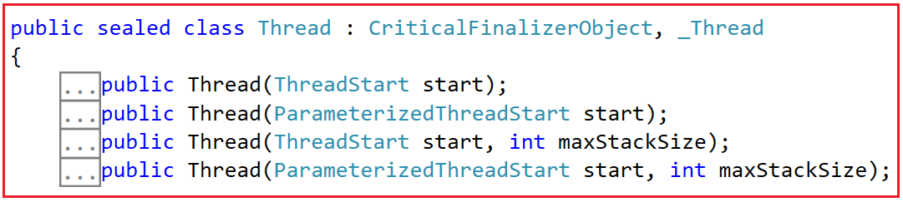
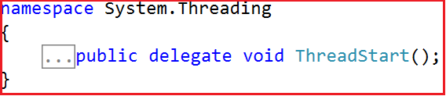
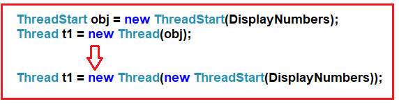
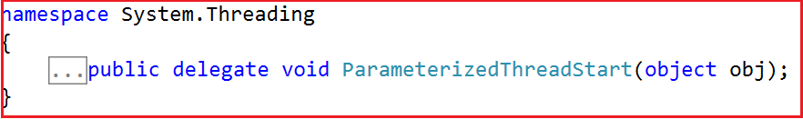
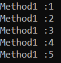
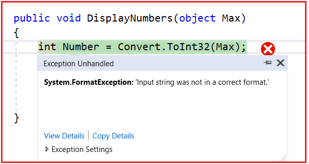

## **کلاس نخ (Thread) در سی شارپ به همراه مثال**

در این مقاله، قصد دارم **کلاس Thread را در C#** با مثال‌هایی مورد بحث قرار دهم. لطفاً قبل از ادامه این مقاله، مقاله قبلی ما را که در آن مفاهیم اساسی Multithreading در C# را با مثال‌هایی مورد بحث قرار دادیم، مطالعه کنید. به عنوان بخشی از این مقاله، قصد داریم نکات زیر را با جزئیات و با مثال‌هایی مورد بحث قرار دهیم.

1. **کلاس Thread در سی شارپ چیست؟**
2. **ویژگی‌ها، متدها و سازنده‌های کلاس Thread.**
3. **آشنایی با سازنده‌های مختلف کلاس Thread به طور مفصل.**
4. **چرا سازنده کلاس Thread پارامتری از نوع Delegate می‌گیرد؟**
5. **آشنایی با delegate مربوط به ThreadStart در سی شارپ.**
6. **تابع نخ با پارامتر.**
7. **درک نماینده ParameterizedThreadStart در سی شارپ.**
8. **چه زمانی باید از ParameterizedThreadStart به جای ThreadStart delegate استفاده کنیم؟**
9. **مشکلات مربوط به نماینده ParameterizedThreadStart در C# چیست؟**
10. **چگونه بر مشکلات نماینده ParameterizedThreadStart در C# غلبه کنیم؟**

##### **کلاس Thread در سی شارپ چیست؟**

کلاس Thread در سی شارپ مسئول ایجاد نخ‌های سفارشی است. با کمک کلاس Thread می‌توانیم نخ‌های پیش‌زمینه و پس‌زمینه ایجاد کنیم. نخ‌های پیش‌زمینه و پس‌زمینه که در مقالات بعدی در مورد آنها صحبت خواهیم کرد، چه هستند؟ کلاس Thread همچنین به ما امکان تعیین اولویت یک نخ را می‌دهد. در جلسه بعدی، نحوه تعیین اولویت یک نخ را مورد بحث قرار خواهیم داد.

اگر به تعریف کلاس Thread مراجعه کنید، خواهید دید که یک کلاس sealed است و از آنجایی که یک کلاس sealed است، نمی‌توان از این کلاس ارث‌بری کرد، یعنی ارث‌بری بیشتر امکان‌پذیر نیست. کلاس Thread در C# تعداد زیادی ویژگی، متد و سازنده‌ی مفید ارائه می‌دهد که در این مقاله به آنها خواهیم پرداخت.

##### **ویژگی‌های کلاس نخ در سی شارپ:**

کلاس Thread در سی شارپ ویژگی‌های زیادی ارائه می‌دهد. برخی از ویژگی‌های مهم به شرح زیر است:

1. **CurrentThread** : این ویژگی برای دریافت نخ در حال اجرا استفاده می‌شود. این ویژگی یک نخ برمی‌گرداند که نمایانگر نخ در حال اجرا است.
2. **IsAlive** : این ویژگی برای دریافت مقداری که وضعیت اجرای نخ فعلی را نشان می‌دهد، استفاده می‌شود. اگر این نخ شروع شده باشد و به طور معمول خاتمه نیافته یا لغو نشده باشد، مقدار true را برمی‌گرداند؛ در غیر این صورت، false را برمی‌گرداند.
3. **IsBackground** : این ویژگی برای دریافت یا تنظیم مقداری استفاده می‌شود که نشان می‌دهد آیا یک نخ، نخ پس‌زمینه است یا خیر. اگر این نخ، نخ پس‌زمینه باشد یا قرار باشد بشود، مقدار true را برمی‌گرداند؛ در غیر این صورت، مقدار false را برمی‌گرداند.
4. **ManagedThreadId** : این ویژگی برای دریافت یک شناسه منحصر به فرد برای نخ مدیریت‌شده فعلی استفاده می‌شود. این ویژگی یک عدد صحیح را برمی‌گرداند که نشان‌دهنده یک شناسه منحصر به فرد برای این نخ مدیریت‌شده است.
5. **Name** : این ویژگی برای دریافت یا تنظیم نام thread استفاده می‌شود. این ویژگی یک رشته حاوی نام thread را برمی‌گرداند، یا اگر نامی تنظیم نشده باشد، null را برمی‌گرداند.
6. **Priority** : این ویژگی برای دریافت یا تنظیم مقداری که اولویت زمان‌بندی یک نخ را نشان می‌دهد، استفاده می‌شود. این ویژگی یکی از مقادیر System.Threading.ThreadPriority را برمی‌گرداند. مقدار پیش‌فرض System.Threading.ThreadPriority.Normal است.
7. **ThreadState** : این ویژگی برای دریافت مقداری شامل وضعیت‌های نخ فعلی استفاده می‌شود. این ویژگی یکی از مقادیر System.Threading.ThreadState را برمی‌گرداند که نشان‌دهنده وضعیت نخ فعلی است. مقدار اولیه آن Unstarted است.
8. **IsThreadPoolThread** : این ویژگی برای دریافت مقداری استفاده می‌شود که نشان می‌دهد آیا یک نخ به مجموعه نخ‌های مدیریت‌شده تعلق دارد یا خیر. اگر این نخ به مجموعه نخ‌های مدیریت‌شده تعلق داشته باشد، مقدار true و در غیر این صورت، مقدار false را برمی‌گرداند.

##### **متدهای کلاس Thread در سی شارپ:**

کلاس Thread در سی شارپ متدهای زیادی ارائه می‌دهد. برخی از متدهای مهم به شرح زیر هستند:

1. **Abort():** این متد برای خاتمه دادن به نخ استفاده می‌شود. در نخی که روی آن فراخوانی شده است، یک ThreadAbortException ایجاد می‌کند تا فرآیند خاتمه دادن به نخ آغاز شود. فراخوانی این متد معمولاً نخ را خاتمه می‌دهد.
2. **وقفه():** این متد برای ایجاد وقفه در نخی که در حالت نخ WaitSleepJoin است، استفاده می‌شود.
3. **Join():** این متد برای مسدود کردن نخ فراخوانی‌کننده تا زمانی که نخ نمایش داده شده توسط این نمونه خاتمه یابد، استفاده می‌شود و در عین حال به انجام پمپاژ استاندارد COM و SendMessage ادامه می‌دهد.
4. **ResetAbort():** این متد برای درخواست System.Threading.Thread.Abort(System.Object) برای نخ فعلی استفاده می‌شود.
5. **Resume():** این متد برای از سرگیری یک thread که به حالت تعلیق درآمده است، استفاده می‌شود.
6. **Sleep(Int32):** این متد برای تعلیق نخ فعلی به مدت زمان مشخص شده بر حسب میلی‌ثانیه استفاده می‌شود.
7. **Start():** این متد باعث می‌شود سیستم عامل وضعیت نمونه فعلی را به System.Threading.ThreadState.Running تغییر دهد.
8. **Suspend():** این متد برای تعلیق نخ استفاده می‌شود یا اگر نخ از قبل معلق شده باشد، هیچ تاثیری ندارد.
9. **Yield():** این متد باعث می‌شود که نخ فراخوانی‌کننده، اجرا را به نخ دیگری که آماده اجرا روی پردازنده فعلی است، واگذار کند. سیستم عامل نخی را که باید به آن واگذار شود، انتخاب می‌کند. اگر سیستم عامل اجرا را به نخ دیگری تغییر داده باشد، مقدار true و در غیر این صورت، مقدار false را برمی‌گرداند.

##### **سازنده‌های کلاس نخ در سی شارپ:**

کلاس Thread در سی شارپ 4 سازنده زیر را ارائه می‌دهد.

1. **Thread(ThreadStart start):** این تابع یک نمونه جدید از کلاس Thread را مقداردهی اولیه می‌کند. در اینجا، پارامتر start یک نماینده ThreadStart را مشخص می‌کند که نشان‌دهنده متدهایی است که هنگام شروع اجرای این thread فراخوانی می‌شوند. در صورت null بودن پارامتر start، خطای ArgumentNullException رخ می‌دهد.
2. **Thread(ParameterizedThreadStart start):** این متد یک نمونه جدید از کلاس Thread را مقداردهی اولیه می‌کند و یک delegate را مشخص می‌کند که اجازه می‌دهد یک شیء هنگام شروع thread به thread منتقل شود. در اینجا، پارامتر start یک delegate را مشخص می‌کند که نشان‌دهنده متدهایی است که هنگام شروع اجرای این thread فراخوانی می‌شوند. این متد ArgumentNullException را صادر می‌کند، زیرا پارامتر start برابر با null است.
3. **Thread(ThreadStart start, int maxStackSize):**   این تابع یک نمونه جدید از کلاس Thread را مقداردهی اولیه می‌کند و حداکثر اندازه پشته برای نخ را مشخص می‌کند. در اینجا، پارامتر start یک نماینده ThreadStart را مشخص می‌کند که نشان‌دهنده متدهایی است که هنگام شروع اجرای این نخ فراخوانی می‌شوند. و پارامتر maxStackSize حداکثر اندازه پشته (بر حسب بایت) را که توسط نخ استفاده می‌شود، یا 0 را برای استفاده از حداکثر اندازه پشته پیش‌فرض مشخص شده در هدر برای فایل اجرایی، مشخص می‌کند. نکته مهم: برای کدی که تا حدی قابل اعتماد است، maxStackSize اگر بزرگتر از اندازه پشته پیش‌فرض باشد، نادیده گرفته می‌شود. هیچ استثنایی رخ نمی‌دهد.
4. **Thread(ParameterizedThreadStart start, int maxStackSize):** این متد یک نمونه جدید از کلاس Thread را مقداردهی اولیه می‌کند، یک delegate را مشخص می‌کند که اجازه می‌دهد یک شیء هنگام شروع thread به thread منتقل شود و حداکثر اندازه پشته برای thread را مشخص می‌کند.

**نکته:** در این مقاله، قصد دارم به تفصیل در مورد سازنده‌های کلاس Thread با مثال صحبت کنم و متدها و ویژگی‌های کلاس Thread در مقالات بعدی مورد بحث قرار خواهند گرفت.

##### **مثالی برای درک سازنده‌های کلاس Thread در سی شارپ.**

بیایید با یک مثال، سازنده‌های کلاس thread در سی‌شارپ را درک کنیم. لطفاً به کد زیر نگاهی بیندازید. این یک برنامه بسیار ساده است و در اینجا ما تابع DisplayNumbers را با استفاده از یک thread متفاوت اجرا می‌کنیم.

```csharp
using System.Threading;
using System;

namespace ThreadingDemo
{
    class Program
    {
        static void Main(string[] args)
        {
            Thread t1 = new Thread(DisplayNumbers);
            t1.Start();
            Console.Read();
        }

        static void DisplayNumbers()
        {
            for (int i = 1; i <= 5; i++)
            {
                Console.WriteLine("Method1 :" + i);
            }
        }
    }
}
```

همانطور که در کد بالا می‌بینید، در اینجا، ما یک نمونه از کلاس Thread ایجاد کردیم و به سازنده کلاس Thread، نام متدی را که می‌خواهیم thread آن را اجرا کند، ارسال کردیم. خط کد زیر دقیقاً همین کار را انجام می‌دهد.

**نخ t1 = نخ جدید (شماره‌های نمایش)؛**

##### **سازنده‌های کلاس Thread در سی شارپ:**

همانطور که قبلاً بحث شد، در سی شارپ، کلاس Thread شامل چهار سازنده است. اگر به تعریف کلاس Thread بروید، سازنده‌ها را مانند شکل زیر خواهید دید.



حالا ممکن است یک سوال داشته باشید، سازنده کلاس Thread که یک پارامتر می‌گیرد، یا از نوع ThreadStart است یا ParameterizedThreadStart، اما در مثال ما، ما نام متد را به عنوان پارامتر به سازنده کلاس Thread ارسال می‌کنیم و این چگونه کار می‌کند؟ برای درک این موضوع، به تعریف ThreadStart مراجعه کنید و خواهید دید که ThreadStart در واقع یک delegate است، همانطور که در تصویر زیر نشان داده شده است.



##### **چرا سازنده کلاس Thread پارامتری از نوع Delegate می‌گیرد؟**

همانطور که قبلاً بحث کردیم، هدف اصلی ایجاد یک Thread در C# اجرای یک تابع است. delegate یک اشاره‌گر تابع از نوع امن است. به این معنی که delegate به یک تابع اشاره می‌کند و وقتی ما delegate را فراخوانی می‌کنیم، تابعی که توسط delegate به آن اشاره شده است، اجرا خواهد شد.

به عبارت ساده، می‌توان گفت که تمام نخ‌هایی که ایجاد می‌کنیم به یک نقطه ورود (یعنی یک اشاره‌گر به تابع) نیاز دارند که از آنجا باید اجرا شود. به همین دلیل است که نخ‌ها همیشه به یک نماینده نیاز دارند. اگر می‌خواهید نماینده‌ها را در سی‌شارپ با مثال‌ها یاد بگیرید، اکیداً توصیه می‌کنم مقاله نماینده‌ها در سی‌شارپ را بخوانید.

**نکته:** ما قبلاً در مقاله Delegates خود بحث کردیم که امضای delegate باید و حتماً باید با امضای متدی که به آن اشاره می‌کند، یکسان باشد.

همانطور که می‌بینید، نماینده ThreadStart هیچ پارامتری نمی‌گیرد و نوع بازگشتی آن void است. در مثال ما، امضای تابع DisplayNumbers() همان امضای نماینده ThreadStart است، زیرا نوع بازگشتی تابع DisplayNumbers() هم void است و هم هیچ پارامتری نمی‌گیرد.

**نخ t1 = نخ جدید (شماره‌های نمایش)؛**

بنابراین، دستور ایجاد نمونه نخ فوق به طور ضمنی به نمونه نماینده ThreadStart تبدیل می‌شود. بنابراین، می‌توانید دستور فوق را همانطور که در تصویر زیر نشان داده شده است بنویسید و کار خواهد کرد.

 در سی شارپ")

همانطور که در تصویر بالا مشاهده می‌کنید، این یک فرآیند دو مرحله‌ای است. ابتدا، باید نمونه‌ی نماینده‌ی ThreadStart را ایجاد کنیم و هنگام ایجاد نمونه، به سازنده‌ی آن باید نام متدی را که می‌خواهیم اجرا شود، ارسال کنیم. در مرحله‌ی دوم، به سازنده‌ی کلاس Thread، باید نمونه‌ی ThreadStart را به عنوان پارامتر ارسال کنیم. و هنگامی که اجرای Thread را با فراخوانی متد Start روی نمونه‌ی thread آغاز می‌کنیم، به صورت داخلی، نمونه‌ی نماینده‌ی ThreadStart را فراخوانی می‌کند که به صورت داخلی اجرای متد DisplayNumbers را آغاز می‌کند.

##### **مثالی برای درک ThreadStart Delegate در سی شارپ:**

در مثال زیر، ابتدا یک نمونه از نماینده ThreadStart ایجاد می‌کنیم و به سازنده نماینده ThreadStart، تابع DisplayNumbers را به عنوان پارامتر ارسال می‌کنیم. سپس یک نمونه از کلاس Thread ایجاد می‌کنیم و به سازنده کلاس Thread، نمونه نماینده ThreadStart را به عنوان پارامتری که به تابع DisplayNumbers اشاره می‌کند، ارسال می‌کنیم. در نهایت، وقتی متد Start را روی نمونه Thread فراخوانی می‌کنیم، نمونه نماینده ThreadStart فراخوانی می‌شود و نمونه نماینده، متدی را که به آن اشاره می‌کند، فراخوانی می‌کند، یعنی تابع DisplayNumbers اجرای خود را آغاز می‌کند.

```csharp
using System.Threading;
using System;

namespace ThreadingDemo
{
    class Program
    {
        static void Main(string[] args)
        {
            //Creating the ThreadStart Delegate instance by passing the
            //method name as a parameter to its constructor
            ThreadStart obj = new ThreadStart(DisplayNumbers);

            //Passing the ThreadStart Delegate instance as a parameter to its constructor
            Thread t1 = new Thread(obj);

            t1.Start();
            Console.Read();
        }

        static void DisplayNumbers()
        {
            for (int i = 1; i <= 5; i++)
            {
                Console.WriteLine("Method1 :" + i);
            }
        }
    }
}
```

همچنین می‌توانید دو عبارت بالا را مانند شکل زیر در یک عبارت واحد ترکیب کنید.



##### **ایجاد نمونه کلاس Thread با استفاده از متد ناشناس در سی شارپ:**

همچنین می‌توان با استفاده از متد ناشناس، همانطور که در مثال زیر نشان داده شده است، یک نمونه از کلاس Thread ایجاد کرد. می‌دانیم که متدهای ناشناس با استفاده از کلمه کلیدی delegate ایجاد می‌شوند و به یک نوع delegate اختصاص داده می‌شوند.

```csharp
using System.Threading;
using System;

namespace ThreadingDemo
{
    class Program
    {
        static void Main(string[] args)
        {
            //Creating Thread Class Instance using Lambda Expression
            Thread t1 = new Thread(delegate ()
            {
                for (int i = 1; i <= 5; i++)
                {
                    Console.WriteLine("Method1 :" + i);
                }
            });
            t1.Start();
            Console.Read();
        }
    }
}
```

##### **ایجاد نمونه کلاس Thread با استفاده از عبارات Lambda در سی شارپ:**

همچنین می‌توان با استفاده از عبارت لامبدا، همانطور که در مثال زیر نشان داده شده است، نمونه‌ای از کلاس thread ایجاد کرد. می‌دانیم که عبارات لامبدا با استفاده از عملگر => Lambda ایجاد می‌شوند.

```csharp
using System.Threading;
using System;

namespace ThreadingDemo
{
    class Program
    {
        static void Main(string[] args)
        {
            //Creating Thread Class Instance using Lambda Expression
            Thread t1 = new Thread(() =>
            {
                for (int i = 1; i <= 5; i++)
                {
                    Console.WriteLine("Method1 :" + i);
                }
            });
            t1.Start();
            Console.Read();
        }
    }
}
```

##### **تابع نخ با پارامتر در سی شارپ:**

مثال‌هایی که تاکنون روی آنها کار کرده‌ایم هیچ پارامتری نمی‌گیرند. این متدی است که می‌خواهیم توسط نخ سفارشی که هیچ پارامتری نمی‌گیرد، اجرا شود. حال، بیایید ادامه دهیم و سعی کنیم نحوه کار با تابع نخ که پارامتر ورودی می‌گیرد را درک کنیم.

بیایید پیاده‌سازی متد DisplayNumbers() را طوری تغییر دهیم که یک پارامتر بگیرد. حال، این متد یک پارامتر ورودی از نوع شیء می‌گیرد. و سپس آن نوع شیء را به یک مقدار صحیح تبدیل می‌کند و سپس اعداد را تا آن مقدار با شروع از ۱ چاپ می‌کند. برای درک بهتر، لطفاً به مثال زیر نگاهی بیندازید.

```csharp
using System.Threading;
using System;

namespace ThreadingDemo
{
    class Program
    {
        static void Main(string[] args)
        {
            //DisplayNumbers is now a non-static method, so we need to
            //refer it by using the instannce
            Program obj = new Program();
            Thread t1 = new Thread(obj.DisplayNumbers);
            t1.Start(5);
            Console.Read();
        }

        public void DisplayNumbers(object Max)
        {
            int Number = Convert.ToInt32(Max);
            for (int i = 1; i <= Number; i++)
            {
                Console.WriteLine("Method1 :" + i);
            }
        }
    }
}
```

وقتی متد thread یا تابع thread (تابعی که قرار است توسط thread سفارشی اجرا شود) یک پارامتر می‌گیرد، کلاس Thread به صورت داخلی از نماینده ParameterizedThreadStart استفاده می‌کند. تعریف نماینده ParameterizedThreadStart در C# در تصویر زیر نشان داده شده است.



همانطور که می‌بینید، نماینده ParameterizedThreadStart یک پارامتر از نوع شیء می‌گیرد و مانند نماینده ThreadStart هیچ مقداری را برنمی‌گرداند. اکنون امضای متد DisplayNumbers() با امضای این نماینده ParameterizedThreadStart یکسان است. بنابراین، چارچوب .NET به صورت داخلی عبارات را همانطور که در تصویر زیر نشان داده شده است، تبدیل می‌کند.

 در سی شارپ")

##### **ایجاد نمونه ParameterizedThreadStart به صورت دستی در سی شارپ:**

بیایید ببینیم چگونه می‌توان نمونه نماینده ParameterizedThreadStart را به صورت دستی ایجاد کرد و آن نمونه را به سازنده کلاس Thread منتقل کرد. برای درک بهتر، لطفاً به مثال زیر نگاهی بیندازید. در مثال زیر، ابتدا، ما یک نمونه از نماینده ParameterizedThreadStart ایجاد می‌کنیم و به سازنده نماینده ParameterizedThreadStart، تابع DisplayNumbers را به عنوان یک پارامتر ارسال می‌کنیم. سپس یک نمونه از کلاس Thread ایجاد می‌کنیم و به سازنده کلاس Thread، نمونه نماینده ParameterizedThreadStart را به عنوان پارامتری که به تابع DisplayNumbers اشاره می‌کند، ارسال می‌کنیم. در نهایت، هنگامی که متد Start را با ارسال مقدار ۵ به نمونه Thread فراخوانی می‌کنیم، نمونه نماینده را با ارسال همان مقدار ۵ فراخوانی می‌کند و آن نمونه نماینده هنگام فراخوانی، تابع DisplayNumbers را با ارسال مقدار ۵ اجرا می‌کند.

```csharp
using System.Threading;
using System;

namespace ThreadingDemo
{
    class Program
    {
        static void Main(string[] args)
        {
            Program obj = new Program();
            ParameterizedThreadStart PTSD = new ParameterizedThreadStart(obj.DisplayNumbers);
            Thread t1 = new Thread(PTSD);
            t1.Start(5);

            Console.Read();
        }

        public void DisplayNumbers(object Max)
        {
            int Number = Convert.ToInt32(Max);
            for (int i = 1; i <= Number; i++)
            {
                Console.WriteLine("Method1 :" + i);
            }
        }
    }
}
```

حالا کد بالا را اجرا کنید و خروجی مورد انتظار را همانطور که در تصویر زیر نشان داده شده است، دریافت خواهید کرد.



##### **چه زمانی باید از ParameterizedThreadStart Delegate به جای ThreadStart Delegate در سی شارپ استفاده کنیم؟**

اگر متد شما مقادیر دیگری می‌گیرد، باید از نماینده ParameterizedThreadStart استفاده کنید. فقط کافی است از نماینده ThreadStart استفاده کنید که هیچ پارامتری نمی‌گیرد.

##### **مشکلات مربوط به نماینده ParameterizedThreadStart در C# چیست؟**

همانطور که می‌بینید، نوع پارامتر نماینده ParameterizedThreadStart یک نوع شیء است. بنابراین، پارامتر تابع thread نیز نوع داده شیء خواهد بود. و شما نمی‌توانید نوع داده را از شیء به هر نوع دیگری تغییر دهید و اگر این کار را انجام دهید، خطای زمان کامپایل به شما می‌دهد. از آنجایی که تابع thread روی نوع داده شیء عمل می‌کند، می‌توانیم هر نوع مقداری را ارسال کنیم و تابع آن را می‌پذیرد. در نتیجه، این تابع از نظر نوع ایمن نخواهد بود زیرا می‌توانیم هر نوع مقداری را ارسال کنیم. باز هم، از آنجایی که روی نوع داده شیء عمل می‌کند، boxing و unboxing مطرح می‌شوند و ما قبلاً در مقاله Boxing و Unboxing خود در مورد چگونگی کاهش عملکرد برنامه بحث کرده‌ایم. بنابراین، باید از انواع شیء اجتناب کنیم.

##### **مثال ارسال مقدار رشته‌ای به یک تابع thread در سی شارپ:**

بیایید سعی کنیم یک مقدار رشته‌ای را به تابع thread ارسال کنیم و ببینیم چه اتفاقی می‌افتد، همانطور که در مثال زیر نشان داده شده است.

```csharp
using System.Threading;
using System;

namespace ThreadingDemo
{
    class Program
    {
        static void Main(string[] args)
        {
            Program obj = new Program();
            ParameterizedThreadStart PTSD = new ParameterizedThreadStart(obj.DisplayNumbers);
            Thread t1 = new Thread(PTSD);

            t1.Start("Hi");
            Console.Read();
        }

        public void DisplayNumbers(object Max)
        {
            int Number = Convert.ToInt32(Max);
            for (int i = 1; i <= Number; i++)
            {
                Console.WriteLine("Method1 :" + i);
            }
        }
    }
}
```

اکنون هیچ خطایی در زمان کامپایل دریافت نخواهید کرد، اما به محض اجرای برنامه، همانطور که در تصویر زیر نشان داده شده است، با خطای زمان اجرا مواجه خواهید شد.


```