## **نحوه اشکال زدایی یک برنامه چند رشته ای در سی شارپ**

در این مقاله، قصد دارم در مورد **نحوه اشکال‌زدایی یک برنامه چند رشته‌ای در سی‌شارپ** با مثال‌ها صحبت کنم. لطفاً مقاله قبلی ما را که در آن در مورد ارتباط بین رشته‌ای در سی‌شارپ با مثال‌ها صحبت کردیم، مطالعه کنید.

##### **چگونه یک برنامه چند رشته‌ای را در سی شارپ اشکال‌زدایی کنیم؟**

بیایید نحوه اشکال‌زدایی نخ‌ها در سی‌شارپ با استفاده از ویژوال استودیو را درک کنیم. لطفاً به مثال زیر نگاهی بیندازید. در مثال زیر، ما متدی به نام SomeMethod داریم و این SomeMethod شامل یک حلقه for است که 10 بار اجرا می‌شود. به عنوان بخشی از بدنه متد، فقط متغیر i را دستکاری می‌کند و سپس به مدت 5 ثانیه به حالت خواب می‌رود. سپس SomeMethod را از متد Main با ایجاد دو نخ مختلف یعنی thread1 و thread2 فراخوانی می‌کنیم و سپس متد Start را فراخوانی می‌کنیم.

```csharp
using System;
using System.Threading;

namespace DebugThreadsDemo
{
    public class Program
    {
        static void Main(string[] args)
        {
            Thread thread1 = new Thread(SomeMethod);
            Thread thread2 = new Thread(SomeMethod);

            thread1.Start();
            thread2.Start();

            Console.ReadKey();
        }

        public static void SomeMethod()
        {
            for (int i = 0; i < 10; i++)
            {
                i++;
                Thread.Sleep(5000);
            }
        }
    }
}
```

حالا می‌خواهیم حلقه for مربوط به SomeMethod برنامه Console بالا را اشکال‌زدایی کنیم. بنابراین، معمولاً کاری که قرار است انجام دهیم این است که باید نقطه توقف را همانطور که در تصویر زیر نشان داده شده است، درون حلقه for قرار دهیم.

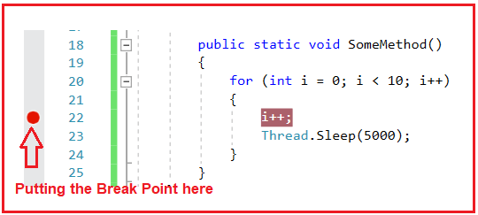

پس از قرار دادن نقطه اشکال‌زدایی، برنامه را اجرا کنید. پس از اجرای برنامه، همانطور که در تصویر زیر نشان داده شده است، به نقطه اشکال‌زدایی خواهید رسید.

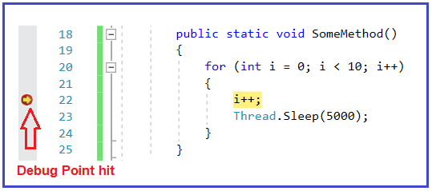

اما این اشکال‌زدایی مشکلاتی دارد. اولین مشکل این رویکرد اشکال‌زدایی این است که من نمی‌توانم تشخیص دهم که در حال حاضر اشکال‌زدایی‌کننده من برای کدام نخ اشکال‌زدایی می‌کند، اینکه آیا در حال اشکال‌زدایی نخ ۱ است یا نخ ۲، من نمی‌توانم تشخیص دهم.

برای اینکه تشخیص دهید دیباگر در حال اشکال‌زدایی کدام رشته است، کافیست **Debug => Windows => Threads را انتخاب کنید.** همانطور که در تصویر زیر نشان داده شده است، از منوی زمینه، گزینه‌های

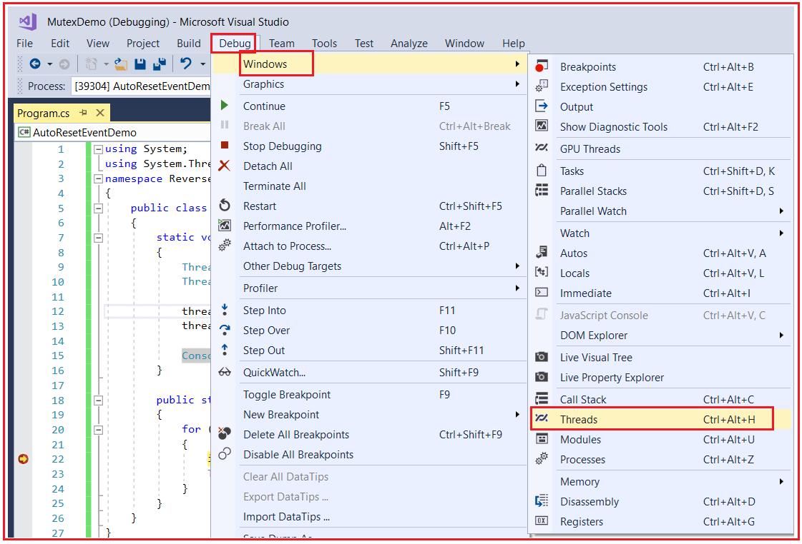

را انتخاب کنید **بنابراین، وقتی گزینه‌های Debug => Windows => Threads** ، پنجره زیر باز می‌شود. نماد زرد نشان می‌دهد که اشکال‌زدای فعلی کجا در حال اشکال‌زدایی است. در سربرگ Location می‌توانید نام متد را ببینید و از آنجا می‌توانید threadها را شناسایی کنید. در اینجا، می‌توانید در سربرگ Location ببینید که سه نام متد یعنی Main و دو بار SomeMethod را نشان می‌دهد. thread اصلی، متد Main را اجرا می‌کند و worker Threadها، SomeMethod را اجرا می‌کنند.

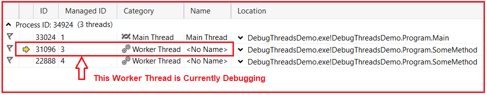

در تصویر بالا می‌توانید ببینید که نام threadهای کارگر **\<No Name>** است . برای درک بهتر، بیایید چند نام معنادار به threadهای خود بدهیم. بنابراین، کد مثال را به صورت زیر تغییر دهید. در اینجا، نام thread1 را به عنوان Thread One و نام thread2 را به عنوان Thread Two ارائه کرده‌ایم.

```csharp
using System;
using System.Threading;

namespace DebugThreadsDemo
{
    public class Program
    {
        static void Main(string[] args)
        {
            Thread thread1 = new Thread(SomeMethod)
            {
                Name = "Thread One"
            };
            Thread thread2 = new Thread(SomeMethod)
            {
                Name = "Thread Two"
            };

            thread1.Start();
            thread2.Start();

            Console.ReadKey();
        }

        public static void SomeMethod()
        {
            for (int i = 0; i < 10; i++)
            {
                i++;
                Thread.Sleep(5000);
            }
        }
    }
}
```

حالا تغییرات را ذخیره کنید. نقطه اشکال‌زدایی را قرار دهید و برنامه را اجرا کنید. پس از اجرای برنامه و رسیدن به نقطه اشکال‌زدایی، **Debug => Windows => Threads را باز کنید،** و این بار نام نخ کارگر را همانطور که در تصویر زیر نشان داده شده است، به شما نشان می‌دهد. اکنون، نماد زرد روی نخ دو است که به این معنی است که در حال حاضر نخ دو در حال اشکال‌زدایی است. در مورد شما، ممکن است به نخ یک اشاره داشته باشد. اگر فقط یک نخ می‌بینید، کافیست روی F5 کلیک کنید، و سپس هر دو نخ را خواهید دید.

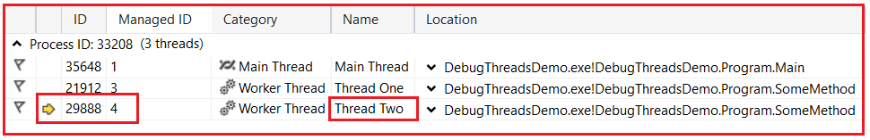

وقتی دیباگر ما در حال اشکال‌زدایی یک نخ است، تمام نخ‌های دیگر از جمله نخ اصلی به حالت توقف یا می‌توان گفت حالت مکث می‌روند. فرض کنید، دیباگر ما در حال اشکال‌زدایی نخ اول است، پس فکر نکنید که نخ دوم به صورت موازی در حال اجرا است. از آنجایی که دیباگر در SomeMethod، یعنی کد برنامه ما، متوقف می‌شود، تمام نخ‌های دیگر از جمله نخ اصلی نیز متوقف خواهند شد. برای درک بهتر، لطفاً به نمودار زیر نگاهی بیندازید.

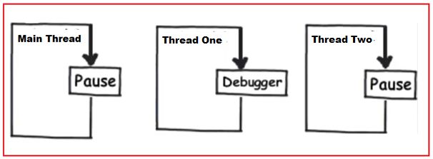

مشاهده می‌کنید **همانطور که در پنجره Debug => Windows => Threads** ، در حال حاضر thread دوم در حال اشکال‌زدایی است. اگر می‌خواهید تغییر دهید، مثلاً می‌خواهید thread اول را اشکال‌زدایی کنید، کافیست Thread اول را انتخاب کرده و همانطور که در تصویر زیر نشان داده شده است، روی آن دوبار کلیک کنید.

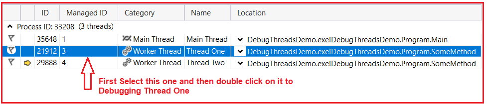

پس از انتخاب و دوبار کلیک روی Thread One، همانطور که در تصویر زیر نشان داده شده است، خواهید دید که نماد زرد به Thread One تغییر می‌کند، به این معنی که در حال حاضر در حال اشکال‌زدایی Thread One است.

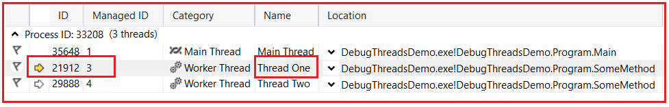

##### **چگونه یک نخ خاص را در سی شارپ اشکال زدایی کنیم؟**

فرض کنید می‌خواهید فقط Thread اول را اشکال‌زدایی کنید. نمی‌خواهید Thread دوم را اشکال‌زدایی کنید. این هم امکان‌پذیر است. ویژوال استودیو دو گزینه ارائه می‌دهد: **Freeze** و **Thaw** . بنابراین، وقتی گزینه Freeze یک Thread را انتخاب می‌کنید، آن Thread توسط اشکال‌زدا اشکال‌زدایی نمی‌شود. به طور مشابه، اگر گزینه Thaw یک Thread را انتخاب کنید، دوباره توسط اشکال‌زدا اشکال‌زدایی می‌شود. وقتی یک Thread در C# ایجاد می‌شود، به طور پیش‌فرض با گزینه Thaw ایجاد می‌شود.

حالا، بیایید ببینیم چگونه می‌توان ترد دوم را متوقف کرد تا دیباگر ما فقط ترد اول را دیباگ کند. برای انجام این کار، روی ترد اول کلیک راست کرده و سپس همانطور که در تصویر زیر نشان داده شده است، گزینه Freeze را از منوی زمینه انتخاب کنید.

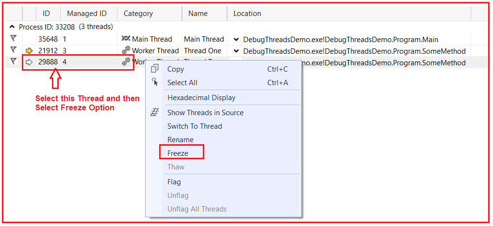

وقتی رشته مورد نظر را انتخاب کردید و روی دکمه‌ی «قطع کردن» کلیک کردید، رشته‌ی مورد نظر قفل می‌شود و می‌توانید دکمه‌ی «توقف» (Pause) را همانطور که در تصویر زیر نشان داده شده است، مشاهده کنید.

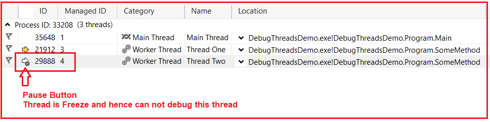

با اعمال تغییرات فوق، اکنون اگر اشکال‌زدایی خود را ادامه دهید، خواهید دید که فقط نخ اول اشکال‌زدایی می‌شود و نخ دوم اشکال‌زدایی نمی‌شود.

حالا، دوباره اگر می‌خواهید Thread Two را اشکال‌زدایی کنید، کافیست Thread two را انتخاب کنید و این بار همانطور که در تصویر زیر نشان داده شده است، گزینه Thaw را از منوی زمینه انتخاب کنید.

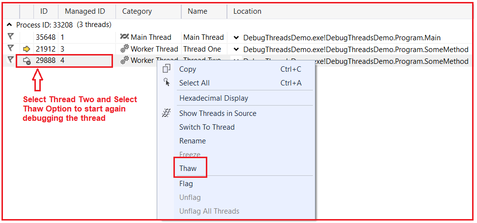

**نکته:** می‌توانید از گزینه‌ی Freeze برای توقف اشکال‌زدایی و از گزینه‌ی Thaw برای فعال کردن اشکال‌زدایی استفاده کنید.

##### **نقطه اشکال زدایی با شرط در سی شارپ چیست؟**

گاهی اوقات می‌خواهید جزئیات را اشکال‌زدایی کنید. بیایید این را با جزئیات درک کنیم. در مثال ما، وقتی برنامه را در حالت اشکال‌زدایی اجرا می‌کنیم، گاهی اوقات اگر نخ اول در حال اشکال‌زدایی باشد، نخ دوم را متوقف می‌کند یا اگر نخ دوم در حال اشکال‌زدایی باشد، نخ اول را متوقف می‌کند. اما اگر می‌خواهید اشکال‌زدایی را فقط روی نخ اول متوقف کنید، من علاقه‌ای به متوقف کردن اشکال‌زدایی روی نخ دوم ندارم. اگر می‌خواهید این کار را انجام دهید، باید نقطه اشکال‌زدایی را با یک شرط ایجاد کنید. بیایید روش ایجاد یک نقطه اشکال‌زدایی را با شرط بررسی کنیم.

ابتدا، روی نقطه اشکال‌زدایی کلیک راست کرده و سپس همانطور که در تصویر زیر نشان داده شده است، گزینه Conditions را از منوی زمینه انتخاب کنید.

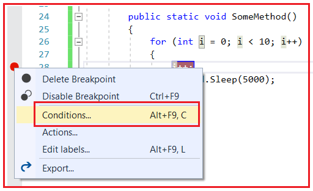

وقتی روی گزینه Conditions کلیک کنید، پنجره زیر باز می‌شود. در قسمت Conditions، ما عبارت **System.Threading.Thread.CurrentThread.Name == “Thread One”** را می‌نویسیم ، به این معنی که فقط در صورتی که thread، Thread One باشد، به نقطه اشکال‌زدایی می‌رسد.

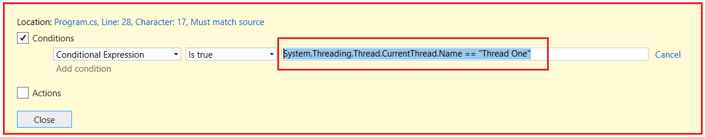

با اعمال تغییرات فوق، اکنون اگر برنامه را اجرا کنید، نقطه اشکال‌زدایی فقط برای نخ اول متوقف می‌شود. بنابراین، با دادن نام به نخ خود، اشکال‌زدایی یک برنامه چند نخی در سی‌شارپ برای ما چقدر آسان‌تر خواهد بود.