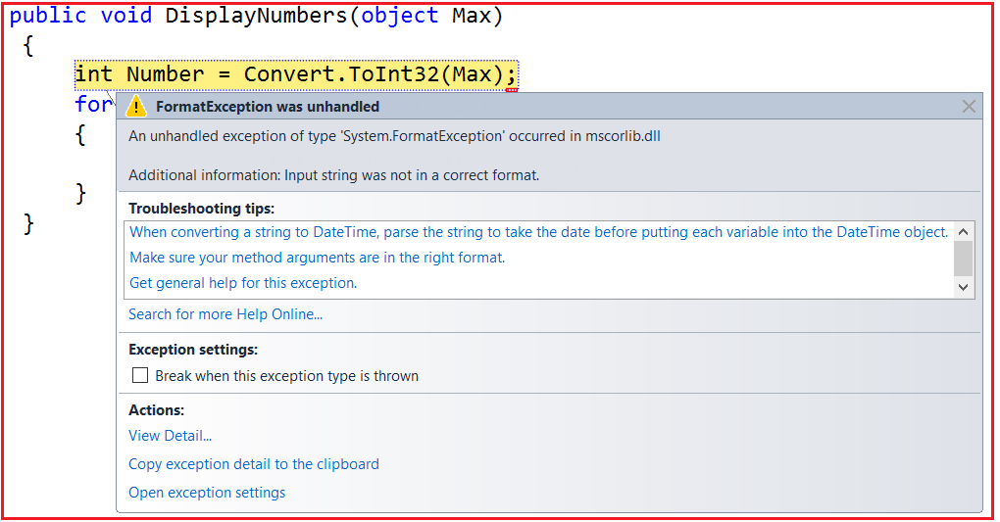
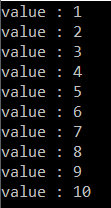

## **نحوه ارسال داده به تابع Thread به روش Type-Safe در سی شارپ**

در این مقاله، قصد دارم **نحوه ارسال داده به تابع Thread را به روش Type-Safe در C#** را به همراه مثال بررسی کنم. لطفاً مقاله قبلی ما را که در آن کلاس Thread در C# را بررسی کردیم، مطالعه کنید. به عنوان بخشی از این مقاله، قصد داریم در مورد اشاره‌گرهای زیر بحث کنیم.

1. **چگونه در سی شارپ داده ها را به تابع Thread ارسال کنیم؟**
2. **چگونه تابع thread را در سی شارپ از نوع ایمن کنیم؟**

##### **نحوه ارسال داده به تابع Thread در سی شارپ**

بگذارید این موضوع را با یک مثال درک کنیم. در مثال زیر، تابع DisplayNumbers یک آرگومان از نوع شیء می‌گیرد. سپس در متد main، یک نمونه از نماینده ParameterizedThreadStart ایجاد کردیم و به سازنده نماینده ParameterizedThreadStart، تابع DisplayNumbers را ارسال کردیم. در مرحله بعد، یک نمونه از کلاس Thread ایجاد کردیم و به سازنده کلاس Thread، نمونه نماینده ParameterizedThreadStart را به عنوان پارامتری که به تابع DisplayNumbers اشاره می‌کند، ارسال کردیم. در نهایت، متد Start را فراخوانی کرده و یک مقدار رشته‌ای "Hi" را ارسال می‌کنیم و در اینجا هیچ خطایی در زمان کامپایل نخواهیم داشت.

```csharp
using System.Threading;
using System;

namespace ThreadingDemo
{
    class Program
    {
        static void Main(string[] args)
        {
            Program obj = new Program();
            ParameterizedThreadStart PTSD = new ParameterizedThreadStart(obj.DisplayNumbers);
            Thread t1 = new Thread(PTSD);
           
            t1.Start("Hi"); 
            Console.Read();
        }

       public void DisplayNumbers(object Max)
        {
            int Number = Convert.ToInt32(Max);
            for (int i = 1; i <= Number; i++)
            {
                Console.WriteLine("Method1 :" + i); 
            }  
        }
    }
}
```

در زمان کامپایل، هیچ خطایی در زمان کامپایل دریافت نخواهیم کرد. اما وقتی برنامه را اجرا می‌کنیم، خطای زمان اجرا زیر را دریافت خواهیم کرد.



دلیل این امر این است که تابع thread از نوع داده ایمن نیست زیرا روی نوع داده شیء عمل می‌کند. بیایید ببینیم چگونه تابع thread را از نوع ایمن کنیم تا بتوانیم داده‌ها را به شیوه‌ای ایمن از نوع ارسال کنیم. بنابراین، هر زمان که می‌گوییم ایمن از نوع، به این معنی است که باید نوعی boxing و unboxing وجود داشته باشد.

##### **چگونه تابع thread را در سی شارپ از نوع ایمن کنیم؟**

وقتی می‌گوییم type-safe، به این معنی است که نباید از نوع داده object استفاده کنیم. در مثال ما، باید از نوع داده integer استفاده کنیم. بنابراین در زمان کامپایل، اگر داده‌ای غیر از integer ارسال کنیم، باید خطای زمان کامپایل به ما بدهد. بیایید ببینیم چگونه می‌توان این کار را گام به گام انجام داد.

###### **مرحله ۱:**

برای اینکه داده‌ها را به شیوه‌ای ایمن از نظر نوع داده (type-safe) به یک تابع Thread در C# ارسال کنید، ابتدا باید تابع thread و داده‌های مورد نیاز آن را در یک کلاس کمکی کپسوله‌سازی کنید. بنابراین، یک فایل کلاس با NumberHelper.cs ایجاد کنید و سپس کد زیر را در آن کپی و جایگذاری کنید.

```csharp
using System;

namespace ThreadingDemo
{
    public class NumberHelper
    {
        int _Number;
        
        public NumberHelper(int Number)
        {
            _Number = Number;
        }
        
        public void DisplayNumbers()
        {
            for (int i = 1; i <= _Number; i++)
            {
                Console.WriteLine("value : " + i);
            }
        }
    }
}
```

همانطور که می‌بینید، ما کلاس NumberHelper فوق را با یک متغیر خصوصی یعنی \_Number، یک سازنده پارامتردار و یک متد یعنی DisplayNumbers ایجاد کرده‌ایم. متغیر خصوصی \_Number قرار است عدد هدف را در خود نگه دارد. سازنده یک پارامتر ورودی از نوع عدد صحیح می‌گیرد و سپس آن مقدار را به متغیر خصوصی اختصاص می‌دهد. بنابراین، در حالی که ما در حال ایجاد نمونه‌ای از کلاس NumberHelper هستیم، باید مقدار Number را نیز ارائه دهیم. در نهایت، تابع DisplayNumbers برای نمایش مقادیر از ۱ تا مقداری که در متغیر \_Number وجود دارد، استفاده می‌شود.

###### **مرحله ۲:**

در متد اصلی (main method)، باید یک نمونه از کلاس NumberHelper ایجاد کنیم و به سازنده (constructor) آن، مقدار صحیح (integer) را ارسال کنیم. سپس نمونه نماینده ThreadStart را ایجاد کرده و تابع DisplayNumbers را به عنوان پارامتر به سازنده آن ارسال کنیم. بنابراین، لطفاً فایل کلاس Program.cs را مطابق شکل زیر تغییر دهید.

```csharp
using System.Threading;
using System;

namespace ThreadingDemo
{
    class Program
    {
        static void Main(string[] args)
        {
            int Max = 10;
            NumberHelper obj = new NumberHelper(Max);
            
            Thread T1 = new Thread(new ThreadStart(obj.DisplayNumbers));
            
            T1.Start();
            Console.Read();
        }
    }
}
```

حالا برنامه را اجرا کنید و باید خروجی مورد انتظار را مانند تصویر زیر نمایش دهد.


```