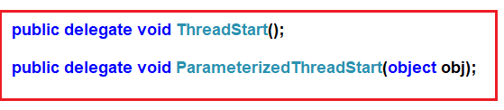

## **نحوه بازیابی داده‌ها از یک تابع thread در سی شارپ**

در این مقاله، قصد دارم **نحوه بازیابی داده‌ها از یک تابع نخ در سی‌شارپ با استفاده از روش فراخوانی (Callback) را** با مثال‌هایی بررسی کنم. لطفاً قبل از ادامه این مقاله، مقاله قبلی ما را که در آن **نحوه انتقال داده‌ها به تابع نخ به شیوه‌ای ایمن از نوع در سی‌شارپ** با مثال‌هایی را بررسی کردیم، مطالعه کنید. در اینجا، نحوه استفاده از یک روش فراخوانی در سی‌شارپ برای بازگرداندن داده‌ها از یک تابع نخ را خواهیم دید. به عنوان بخشی از این مقاله، به نکات زیر خواهیم پرداخت.

1. **متد فراخوانی (Callback Method) در سی شارپ چیست؟**
2. **متد callback در سی شارپ چگونه کار می‌کند؟**
3. **چگونه می‌توان داده‌ها را از یک تابع thread با استفاده از یک متد callback در C# بازیابی کرد؟**

##### **چگونه می‌توان داده‌ها را از یک تابع thread در سی شارپ بازیابی کرد؟**

تا اینجا، ما در مورد کاربردهای delegate های ThreadStart و ParameterizedThreadStart بحث کردیم. اگر توجه کرده باشید، نوع بازگشتی این دو delegate همانطور که در تصویر زیر نشان داده شده است، void است.



بنابراین، با استفاده از دو delegate بالا، نمی‌توانیم هیچ داده‌ای را از یک متد برگردانیم زیرا نوع بازگشتی void است. سپس سوالی که به ذهنمان می‌رسد این است که چگونه داده‌ها را از یک تابع thread در C# بازیابی کنیم؟ پاسخ با استفاده از یک متد callback است.

##### **نحوه بازیابی داده‌ها از یک تابع Thread با استفاده از متد Callback در سی شارپ:**

بیایید یک مثال با روش گام به گام را بررسی کنیم تا بفهمیم چگونه می‌توانیم از یک متد فراخوانی برای بازیابی داده‌ها از یک تابع نخ در سی‌شارپ استفاده کنیم. لطفاً مراحل زیر را دنبال کنید.

##### **مرحله ۱:**

برای بازیابی داده‌ها از یک تابع thread، ابتدا باید تابع thread و داده‌های مورد نیاز آن را در یک کلاس کمکی کپسوله‌سازی کنید. به سازنده کلاس Helper، باید داده‌های مورد نیاز (در صورت وجود) و همچنین یک delegate که نشان‌دهنده متد callback است را ارسال کنید.

از بدنه تابع thread، باید نماینده callback را درست قبل از پایان تابع thread فراخوانی کنید. و یک نکته دیگر اینکه باید مراقب باشید که نماینده callback و امضای متد callback واقعی یکسان باشند.

بنابراین، یک فایل کلاس با **NumberHelper.cs** ایجاد کنید و سپس کد زیر را در آن کپی و جایگذاری کنید. کد از طریق کامنت‌ها توضیح داده شده است، بنابراین لطفاً خطوط کامنت را مطالعه کنید.

```csharp
using System;

namespace ThreadingDemo
{
    // First Create the callback delegate with the same signature of the callback method.
    public delegate void ResultCallbackDelegate(int Results);

    //Creating the Helper class
    public class NumberHelper
    {
        //Creating two private variables to hold the Number and ResultCallback instance
        private int _Number;
        private ResultCallbackDelegate _resultCallbackDelegate;

        //Initializing the private variables through constructor
        //So while creating the instance you need to pass the value for Number and callback delegate
        public NumberHelper(int Number, ResultCallbackDelegate resultCallbackDelagate)
        {
            _Number = Number;
            _resultCallbackDelegate = resultCallbackDelagate;
        }

        //This is the Thread function which will calculate the sum of the numbers
        public void CalculateSum()
        {
            int Result = 0;
            for (int i = 1; i <= _Number; i++)
            {
                Result = Result + i;
            }

            //Before the end of the thread function call the callback method
            if (_resultCallbackDelegate != null)
            {
                _resultCallbackDelegate(Result);
            }
        }
    }
}
```

##### **مرحله ۲:**

در مرحله دوم، باید متد فراخوانی (callback method) را ایجاد کنیم که امضای آن باید با امضای نماینده CallBack یکسان باشد. در مثال ما، ResultCallBackMethod متد فراخوانی است و امضای آن با امضای نماینده ResultCallbackDelegate یکسان است. در متد Main، باید یک نمونه از نماینده ResultCallbackDelegate ایجاد کنیم و هنگام ایجاد نمونه، ResultCallBackMethod را به عنوان پارامتر به سازنده آن ارسال کنیم. بنابراین وقتی نماینده را فراخوانی می‌کنیم، متد ResultCallBackMethod را فراخوانی می‌کند.

لطفاً کد کلاس Program را مطابق شکل زیر تغییر دهید. کد مثال گویای همه چیز است. بنابراین، لطفاً برای درک بهتر، خطوط توضیحات را مطالعه کنید.

```csharp
using System.Threading;
using System;

namespace ThreadingDemo
{
    class Program
    {
        static void Main(string[] args)
        {
            //Create the ResultCallbackDelegate instance and to its constructor 
            //pass the callback method name
            ResultCallbackDelegate resultCallbackDelegate = new ResultCallbackDelegate(ResultCallBackMethod);

            int Number = 10;

            //Creating the instance of NumberHelper class by passing the Number
            //the callback delegate instance
            NumberHelper obj = new NumberHelper(Number, resultCallbackDelegate);

            //Creating the Thread using ThreadStart delegate
            Thread T1 = new Thread(new ThreadStart(obj.CalculateSum));
            
            T1.Start();
            Console.Read();
        }

        //Callback method and the signature should be the same as the callback delegate signature
        public static void ResultCallBackMethod(int Result)
        {
            Console.WriteLine("The Result is " + Result);
        }
    }
}
```

حالا برنامه را اجرا کنید و باید خروجی مورد انتظار را ببینید.

**خروجی: نتیجه ۵۵ است**

##### **تابع فراخوانی (Callback function) در سی شارپ چیست؟**

می‌توانیم یک تابع فراخوانی را به عنوان یک اشاره‌گر تابع تعریف کنیم که به عنوان آرگومان به تابع دیگری ارسال می‌شود. و سپس انتظار می‌رود که در مقطعی از زمان، آن تابع را فراخوانی کند.

در مثال ما، تابع thread کلاس NumberHelper را از متد Main کلاس Program فراخوانی می‌کنیم. هنگام ایجاد نمونه از کلاس NumberHelper، تابع callback را به عنوان یک آرگومان به سازنده آن کلاس ارسال می‌کنیم. و سپس انتظار داریم که آن متد callback در مقطعی از زمان توسط متد NumberHelper فراخوانی شود.