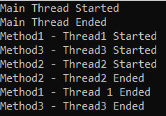
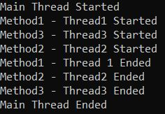
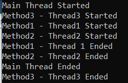
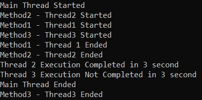
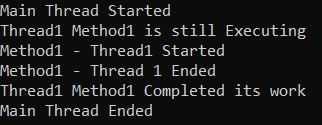

## **متد Join و** **ویژگی IsAlive** **کلاس Thread در سی شارپ به همراه مثال**

در این مقاله، قصد دارم استفاده از **متد Join و** **ویژگی IsAlive** **کلاس Thread در C# را** با یک مثال مورد بحث قرار دادیم، مطالعه کنید **با مثال‌هایی مورد بحث قرار دهم. لطفاً مقاله قبلی ما را که در آن نحوه بازگشت داده از یک تابع Thread در C# با استفاده از متد Callback را** . به عنوان بخشی از این مقاله، قصد داریم نکات زیر را مورد بحث قرار دهیم.

1. **درک نیاز به متد Join از کلاس Thread در سی شارپ.**
2. **مثال‌هایی با استفاده از نسخه‌های مختلف overload شده‌ی متد Join.**
3. **مثال‌هایی برای درک کاربرد ویژگی IsAlive از کلاس Thread در سی‌شارپ.**

##### **متد join کلاس Thread در سی شارپ**

بیایید کاربرد متد Join کلاس Thread در سی‌شارپ را با مثال‌هایی درک کنیم. برای درک بهتر، لطفاً به مثال زیر نگاهی بیندازید. در مثال زیر ما سه متد ایجاد کرده‌ایم و سپس این سه متد را با استفاده از سه thread مختلف اجرا می‌کنیم. نکته‌ای که باید به خاطر داشته باشید این است که threadهای thread1، thread2 و thread3، threadهای فرزند thread اصلی نامیده می‌شوند. دلیل این امر این است که این سه thread فقط توسط thread اصلی ایجاد می‌شوند. در اینجا، thread1 متد1، thread2 متد2 و thread3 متد3 را اجرا می‌کند. علاوه بر این، اگر توجه کرده باشید، ما با استفاده از متد Sleep استاتیک کلاس Thread که زمان را بر حسب میلی‌ثانیه می‌گیرد و thread فعلی را به مدت آن میلی‌ثانیه به خواب می‌برد، اجرای Method1 را 3 ثانیه، اجرای Method2 را 2 ثانیه و اجرای Method3 را 5 ثانیه به تأخیر انداخته‌ایم. در اینجا، ما از نسخه overload شده سازنده کلاس Thread استفاده می‌کنیم که نماینده ThreadStart را به عنوان پارامتر می‌گیرد.

```csharp
using System.Threading;
using System;

namespace ThreadingDemo
{
    class Program
    {
        static void Main(string[] args)
        {
            Console.WriteLine("Main Thread Started");

            //Main Thread creating three child threads
            Thread thread1 = new Thread(Method1);
            Thread thread2 = new Thread(Method2);
            Thread thread3 = new Thread(Method3);

            thread1.Start();
            thread2.Start();
            thread3.Start();

            Console.WriteLine("Main Thread Ended");
            Console.Read();
        }

        static void Method1()
        {
            Console.WriteLine("Method1 - Thread1 Started");
            Thread.Sleep(3000);
            Console.WriteLine("Method1 - Thread 1 Ended");
        }

        static void Method2()
        {
            Console.WriteLine("Method2 - Thread2 Started");
            Thread.Sleep(2000);
            Console.WriteLine("Method2 - Thread2 Ended");
        }

        static void Method3()
        {
            Console.WriteLine("Method3 - Thread3 Started");
            Thread.Sleep(5000);
            Console.WriteLine("Method3 - Thread3 Ended");
        }
    }
}
```

حالا برنامه را اجرا کنید و خروجی را ببینید. خروجی ممکن است در دستگاه شما هنگام اجرای برنامه متفاوت باشد.



همانطور که از خروجی بالا مشاهده می‌کنید، نخ اصلی منتظر تمام نخ‌های فرزند برای تکمیل اجرا یا وظیفه خود نیست. اگر می‌خواهید نخ اصلی تا زمانی که تمام نخ‌های فرزند یا هر یک از نخ‌های فرزند وظیفه خود را تکمیل نکرده‌اند، خارج نشود، باید از متد Join از کلاس Thread در C# استفاده کنید.

##### **متد Join کلاس Thread در سی شارپ:**

متد Join از کلاس Thread در سی شارپ، thread فعلی را مسدود می‌کند و آن را منتظر می‌گذارد تا thread فرزندی که متد Join در آن فراخوانی شده است، اجرای خود را کامل کند. سه نسخه overload شده برای متد Join در کلاس Thread وجود دارد که در زیر نشان داده شده است.


تعاریف سه نسخه سربارگذاری شده فوق از متد Join کلاس Thread در C# که توسط مایکروسافت ارائه شده است، در زیر آمده است:

1. **Join():** این متد، نخ فراخوانی‌کننده را تا زمانی که نخ نمایش داده شده توسط این نمونه خاتمه یابد، مسدود می‌کند و در عین حال به انجام پمپاژ استاندارد COM و SendMessage ادامه می‌دهد. اگر فراخواننده سعی کند به نخی که در حالت System.Threading.ThreadState.Unstarted است، ملحق شود، خطای ThreadStateException رخ می‌دهد.
2. **Join(int millisecondsTimeout):** این متد، نخ فراخوانی‌کننده را تا زمانی که نخ نمایش داده شده توسط این نمونه خاتمه یابد یا زمان مشخص شده در حین انجام پمپاژ استاندارد COM و SendMessage سپری شود، مسدود می‌کند. پارامتر millisecondsTimeout تعداد میلی‌ثانیه‌هایی را که باید برای خاتمه نخ منتظر بماند، مشخص می‌کند. اگر نخ خاتمه یافته باشد، مقدار true را برمی‌گرداند؛ اگر نخ پس از گذشت مدت زمان مشخص شده توسط پارامتر millisecondsTimeout خاتمه نیافته باشد، مقدار false را برمی‌گرداند. اگر مقدار millisecondsTimeout منفی باشد و برابر با System.Threading.Timeout.Infinite بر حسب میلی‌ثانیه نباشد، خطای ArgumentOutOfRangeException رخ می‌دهد. اگر نخ شروع نشده باشد، خطای ThreadStateException رخ می‌دهد.
3. **Join(TimeSpan timeout):** این متد، نخ فراخوانی‌کننده را تا زمانی که نخ نمایش داده شده توسط این نمونه خاتمه یابد یا زمان مشخص شده در حین انجام پمپاژ استاندارد COM و SendMessage سپری شود، مسدود می‌کند. در اینجا، پارامتر timeout مقدار System.TimeSpan را برای مدت زمانی که باید برای خاتمه نخ منتظر بماند، تعیین می‌کند. اگر نخ خاتمه یابد، مقدار true را برمی‌گرداند؛ اگر نخ پس از گذشت مدت زمانی که توسط پارامتر timeout مشخص شده است، خاتمه نیافته باشد، مقدار false را برمی‌گرداند. اگر مقدار timeout منفی باشد و برابر با System.Threading.Timeout.Infinite بر حسب میلی‌ثانیه یا بزرگتر از System.Int32.MaxValue بر حسب میلی‌ثانیه نباشد، خطای ArgumentOutOfRangeException رخ می‌دهد. اگر فراخواننده سعی کند به نخی که در حالت System.Threading.ThreadState.Unstarted است، ملحق شود، خطای ThreadStateException رخ می‌دهد.

**می‌توانیم تعاریف فوق را به صورت زیر ساده کنیم:**

**Join():** اولین نسخه از متد Join که هیچ پارامتری نمی‌گیرد، نخ فراخوانی‌کننده (یعنی نخ والد) را تا زمانی که نخ (نخ فرزند) اجرای خود را کامل کند، مسدود می‌کند. در این حالت، نخ فراخوانی‌کننده برای مدت نامحدودی منتظر می‌ماند تا نخی که متد Join روی آن فراخوانی شده است، تکمیل شود.

**Join(int millisecondsTimeout):** نسخه دوم متد Join به ما امکان می‌دهد تا زمان پایان را مشخص کنیم. به این معنی که نخ فراخوانی شده را تا زمان خاتمه یافتن نخ فرزند یا گذشت زمان مشخص شده مسدود می‌کند. این بارگذاری بیش از حد، زمانی بر حسب میلی ثانیه طول می‌کشد. اگر نخ خاتمه یافته باشد، این متد مقدار true را برمی‌گرداند و اگر نخ پس از گذشت زمان مشخص شده توسط پارامتر millisecondsTimeout خاتمه نیافته باشد، مقدار false را برمی‌گرداند.

**Join(TimeSpan timeout):** سومین نسخه بارگذاری‌شده این متد مشابه نسخه دوم بارگذاری‌شده است. تنها تفاوت این است که در اینجا باید از TimeSpan برای تنظیم مدت زمان انتظار برای خاتمه نخ استفاده کنیم.

##### **مثالی برای درک متد Join کلاس Thread در سی شارپ**

برای درک بهتر نحوه استفاده از متد Join کلاس Thread در سی شارپ، لطفاً به مثال زیر نگاهی بیندازید. در مثال زیر، متد Join را روی هر سه thread فراخوانی کرده‌ایم، به این معنی که thread اصلی را تا زمانی که همه threadهای فرزند وظایف خود را انجام دهند، مسدود می‌کند.

```csharp
using System.Threading;
using System;

namespace ThreadingDemo
{
    class Program
    {
        static void Main(string[] args)
        {
            Console.WriteLine("Main Thread Started");

            //Main Thread creating three child threads
            Thread thread1 = new Thread(Method1);
            Thread thread2 = new Thread(Method2);
            Thread thread3 = new Thread(Method3);

            thread1.Start();
            thread2.Start();
            thread3.Start();

            thread1.Join(); //Block Main Thread until thread1 completes its execution
            thread2.Join(); //Block Main Thread until thread2 completes its execution
            thread3.Join(); //Block Main Thread until thread3 completes its execution

            Console.WriteLine("Main Thread Ended");
            Console.Read();
        }

        static void Method1()
        {
            Console.WriteLine("Method1 - Thread1 Started");
            Thread.Sleep(1000);
            Console.WriteLine("Method1 - Thread 1 Ended");
        }

        static void Method2()
        {
            Console.WriteLine("Method2 - Thread2 Started");
            Thread.Sleep(2000);
            Console.WriteLine("Method2 - Thread2 Ended");
        }

        static void Method3()
        {
            Console.WriteLine("Method3 - Thread3 Started");
            Thread.Sleep(5000);
            Console.WriteLine("Method3 - Thread3 Ended");
        }
    }
}
```

حالا کد بالا را اجرا کنید و خواهید دید که نخ اصلی ابتدا شروع می‌شود و منتظر می‌ماند تا تمام نخ‌های فرزند اجرای خود را کامل کنند، همانطور که در خروجی زیر نشان داده شده است.



حال، برای مثال، اگر نمی‌خواهید نخ اصلی تا پایان اجرای thread3 منتظر بماند، کافیست متد Join را روی thread1 و thread2 فراخوانی کنید، همانطور که در مثال زیر نشان داده شده است.

```csharp
using System.Threading;
using System;

namespace ThreadingDemo
{
    class Program
    {
        static void Main(string[] args)
        {
            Console.WriteLine("Main Thread Started");

            //Main Thread creating three child threads
            Thread thread1 = new Thread(Method1);
            Thread thread2 = new Thread(Method2);
            Thread thread3 = new Thread(Method3);

            thread1.Start();
            thread2.Start();
            thread3.Start();

            thread1.Join(); //Block Main Thread until thread1 completes its execution
            thread2.Join(); //Block Main Thread until thread2 completes its execution
            //Now, Main Thread will not wait for thread3 to complete its execution

            Console.WriteLine("Main Thread Ended");
            Console.Read();
        }

        static void Method1()
        {
            Console.WriteLine("Method1 - Thread1 Started");
            Thread.Sleep(1000);
            Console.WriteLine("Method1 - Thread 1 Ended");
        }

        static void Method2()
        {
            Console.WriteLine("Method2 - Thread2 Started");
            Thread.Sleep(2000);
            Console.WriteLine("Method2 - Thread2 Ended");
        }

        static void Method3()
        {
            Console.WriteLine("Method3 - Thread3 Started");
            Thread.Sleep(5000);
            Console.WriteLine("Method3 - Thread3 Ended");
        }
    }
}
```

###### **خروجی:**



##### **سایر نسخه‌های سربارگذاری‌شده‌ی متد Join کلاس Thread در سی‌شارپ:**

وقتی می‌خواهید نخ اصلی برای مدت زمان مشخصی منتظر بماند، باید از نسخه دوم و سوم سربارگذاری شده متد Join کلاس نخ در سی‌شارپ استفاده کنید. برای مثال، می‌خواهید نخ اصلی ۳ ثانیه منتظر بماند تا نخ ۲ و نخ ۳ وظیفه خود را انجام دهند. سپس باید از متد Join همانطور که در مثال زیر نشان داده شده است استفاده کنید. نسخه‌های سربارگذاری شده را به خاطر داشته باشید که بر حسب میلی‌ثانیه زمان می‌برند و TimeSpan یک مقدار بولی برمی‌گرداند که نشان می‌دهد آیا نخ اجرای خود را کامل کرده است یا خیر. مقدار بولی true به معنی اجرای کامل متد و مقدار false به معنی عدم اجرای کامل متد است.

```csharp
using System.Threading;
using System;

namespace ThreadingDemo
{
    class Program
    {
        static void Main(string[] args)
        {
            Console.WriteLine("Main Thread Started");

            //Main Thread creating three child threads
            Thread thread1 = new Thread(Method1);
            Thread thread2 = new Thread(Method2);
            Thread thread3 = new Thread(Method3);

            thread1.Start();
            thread2.Start();
            thread3.Start();
            
            //Now, Main Thread will block for 3 seconds and wait thread2 to complete its execution
            if (thread2.Join(TimeSpan.FromSeconds(3)))
            {
                Console.WriteLine("Thread 2 Execution Completed in 3 second");
            }
            else
            {
                Console.WriteLine("Thread 2 Execution Not Completed in 3 second");
            }

            //Now, Main Thread will block for 3 seconds and wait thread3 to complete its execution
            if (thread3.Join(3000))
            {
                Console.WriteLine("Thread 3 Execution Completed in 3 second");
            }
            else
            {
                Console.WriteLine("Thread 3 Execution Not Completed in 3 second");
            }

            Console.WriteLine("Main Thread Ended");
            Console.Read();
        }

        static void Method1()
        {
            Console.WriteLine("Method1 - Thread1 Started");
            Thread.Sleep(1000);
            Console.WriteLine("Method1 - Thread 1 Ended");
        }

        static void Method2()
        {
            Console.WriteLine("Method2 - Thread2 Started");
            Thread.Sleep(2000);
            Console.WriteLine("Method2 - Thread2 Ended");
        }

        static void Method3()
        {
            Console.WriteLine("Method3 - Thread3 Started");
            Thread.Sleep(5000);
            Console.WriteLine("Method3 - Thread3 Ended");
        }
    }
}
```

حالا، برنامه را اجرا کنید و خروجی را مشاهده کنید. خواهید دید که اجرای Method2 در عرض ۳ ثانیه تکمیل می‌شود در حالی که اجرای Method3 کامل نمی‌شود. توجه داشته باشید که پس از اجرای متد Main، Method3 قرار است اجرای خود را تکمیل کند. بنابراین، رشته اصلی به مدت ۳ ثانیه مسدود می‌شود و پس از ۳ ثانیه، رشته اصلی به اجرای خود ادامه می‌دهد.



##### **ویژگی IsAlive از کلاس Thread در سی شارپ:**

ویژگی IsAlive مقداری می‌گیرد که وضعیت اجرای نخ فعلی را نشان می‌دهد. اگر نخ شروع شده باشد و به طور معمول خاتمه نیافته یا لغو نشده باشد، مقدار true را برمی‌گرداند؛ در غیر این صورت، مقدار false را برمی‌گرداند. این بدان معناست که ویژگی IsAlive از کلاس Thread اگر نخ هنوز در حال اجرا باشد، مقدار true را برمی‌گرداند، در غیر این صورت مقدار false را برمی‌گرداند. بیایید این موضوع را با یک مثال درک کنیم.

```csharp
using System.Threading;
using System;

namespace ThreadingDemo
{
    class Program
    {
        static void Main(string[] args)
        {
            Console.WriteLine("Main Thread Started");

            Thread thread1 = new Thread(Method1);
            thread1.Start();

            if (thread1.IsAlive)
            {
                Console.WriteLine("Thread1 Method1 is still Executing");
            }
            else
            {
                Console.WriteLine("Thread1 Method1 Completed its work");
            }
            //Wait Till thread1 to complete its execution
            thread1.Join();
            if (thread1.IsAlive)
            {
                Console.WriteLine("Thread1 Method1 is still Executing");
            }
            else
            {
                Console.WriteLine("Thread1 Method1 Completed its work");
            }

            Console.WriteLine("Main Thread Ended");
            Console.Read();
        }

        static void Method1()
        {
            Console.WriteLine("Method1 - Thread1 Started");
            //Making thread to sleep for 2 seconds
            Thread.Sleep(TimeSpan.FromSeconds(2));
            Console.WriteLine("Method1 - Thread 1 Ended");
        }
    }
}
```

###### **خروجی:**

