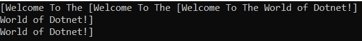
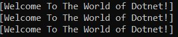
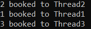
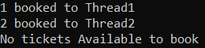

## **همگام‌سازی نخ‌ها در سی‌شارپ به همراه مثال**

در این مقاله، قصد دارم **همگام‌سازی نخ‌ها (Thread Synchronization) در سی‌شارپ را** با مثال‌هایی مورد بحث قرار دهم. لطفاً مقاله قبلی ما را که در آن به اهمیت ویژگی IsAlive و متد Join کلاس نخ در سی‌شارپ پرداختیم، مطالعه کنید. در پایان این مقاله، شما خواهید فهمید که همگام‌سازی نخ چیست و چگونه می‌توانید همگام‌سازی نخ‌ها را برای محافظت از منابع مشترک در برنامه‌های چندنخی (multithread applications) با مثال‌های بلادرنگ پیاده‌سازی کنید.

##### **همگام‌سازی نخ‌ها در سی‌شارپ چیست؟**

ناسازگاری داده‌ها زمانی رخ می‌دهد که بیش از یک نخ به طور همزمان به یک منبع مشترک مانند داده‌های درون حافظه (متغیرهای نمونه یا کلاس) و اشیاء خارجی مانند فایل‌ها دسترسی داشته باشند. بیایید این موضوع را با یک مثال درک کنیم. در نظر بگیرید که ما دو نخ Thread1 و Thread2 داریم و هر دو نخ به طور همزمان به یک منبع مشترک، مثلاً Resource1، دسترسی دارند. اگر Thread1 سعی کند داده‌ها را از منبع مشترک Resource1 بخواند در حالی که Thread2 سعی در نوشتن داده‌ها روی منبع مشترک Resource1 دارد، در این صورت ناسازگاری داده‌ها وجود خواهد داشت. از این رو، در موقعیت‌هایی مانند این، همگام‌سازی نخ‌ها مطرح می‌شود.

همگام‌سازی در زبان سی‌شارپ فرآیندی است که امکان دسترسی روان به منابع مشترک را فراهم می‌کند. همگام‌سازی در سی‌شارپ تضمین می‌کند که در هر نقطه از زمان، فقط یک نخ به منبع مشترک دسترسی دارد و از انجام همزمان این کار توسط سایر نخ‌ها جلوگیری می‌کند.

همگام‌سازی نخ‌ها در سی‌شارپ مکانیزمی است که برای محدود کردن دسترسی همزمان چندین نخ به یک منبع مشترک استفاده می‌شود. به عبارت ساده، می‌توان گفت که همگام‌سازی نخ‌ها می‌تواند به ما کمک کند تا از دسترسی همزمان چندین نخ به یک منبع مشترک جلوگیری کنیم. در نتیجه، می‌توانیم یک و فقط یک نخ داشته باشیم که در هر نقطه زمانی مشخص وارد یک بخش بحرانی برای دسترسی به منبع مشترک شود.

##### **همگام‌سازی نخ‌ها در سی‌شارپ چگونه انجام می‌شود؟**

همگام‌سازی در سی‌شارپ می‌تواند به روش‌های مختلفی انجام شود. یکی از راه‌های دستیابی به همگام‌سازی در سی‌شارپ استفاده از ویژگی قفل است که دسترسی به یک بلوک کد درون شیء قفل‌شده را قفل می‌کند. وقتی یک نخ یک شیء را قفل می‌کند، هیچ نخ دیگری نمی‌تواند به بلوک کد درون شیء قفل‌شده دسترسی پیدا کند. تنها زمانی که یک نخ قفل را آزاد می‌کند، آن بلوک کد برای سایر نخ‌ها قابل دسترسی است.

در زبان سی شارپ، هر شیء یک قفل داخلی دارد. با استفاده از ویژگی همگام‌سازی (Synchronization)، می‌توانیم یک شیء را قفل کنیم. قفل کردن یک شیء می‌تواند با استفاده از کلمه کلیدی lock انجام شود و نحوه استفاده از قفل به صورت زیر است.

**قفل (شیء)**  
**{**  
**// بیانیه ۱**  
**// بیانیه ۲**  
**// و دستورات بیشتری برای همگام‌سازی**  
**}**

بنابراین، وقتی یک نخ روی یک شیء قفل می‌شود، آن نخ خاص فقط می‌تواند به بلوک دستورات درون شیء قفل‌شده دسترسی پیدا کند. اکنون، تمام نخ‌های دیگری که مایل به دسترسی به همان بلوک دستورات درون همان شیء قفل‌شده هستند، باید منتظر بمانند تا نخی که قفل روی شیء را دارد، با خروج از بلوک دستورات، قفل را آزاد کند.

##### **مثال بدون همگام‌سازی نخ در سی‌شارپ:**

قبل از اینکه مثالی از نحوه استفاده از همگام‌سازی بین نخ‌ها با قفل کردن یک شیء و کاربرد عملی آن را به شما نشان دهیم، ابتدا اجازه دهید ببینیم بدون استفاده از همگام‌سازی در اجرای چندین نخ که سعی در دسترسی به یک منبع یکسان دارند، واقعاً چه اتفاقی می‌افتد.

در مثال زیر، ما سه نخ مختلف ایجاد می‌کنیم که قرار است به یک منبع مشترک دسترسی پیدا کنند، یعنی در این مورد منبع مشترک SomeMethod است. همانطور که می‌بینید، ما اجرای SomeMethod را ۱ ثانیه به تأخیر انداخته‌ایم و هر سه نخ سعی می‌کنند یک متد را اجرا کنند و آن را اجرا خواهند کرد. نخ اول که متد را اجرا می‌کند، دسترسی انحصاری خود را دریافت نمی‌کند، این نخ مدتی متد را اجرا می‌کند و پس از مدتی، نخ‌های دیگر می‌آیند و همان متد را اجرا می‌کنند. بنابراین، در اینجا، خروجی مورد انتظار را دریافت نخواهیم کرد.

```csharp
using System;
using System.Threading;

namespace ThreadStateDemo
{
    class Program
    {
        static void Main(string[] args)
        {
            Thread thread1 = new Thread(SomeMethod)
            {
                Name = "Thread 1"
            };

            Thread thread2 = new Thread(SomeMethod)
            {
                Name = "Thread 2"
            };

            Thread thread3 = new Thread(SomeMethod)
            {
                Name = "Thread 2"
            };

            thread1.Start();
            thread2.Start();
            thread3.Start();

            Console.ReadKey();
        }

        public static void SomeMethod()
        {
            Console.Write("[Welcome To The ");
            Thread.Sleep(1000);
            Console.WriteLine("World of Dotnet!]");
        }
    }
}
```

وقتی کد بالا را اجرا می‌کنم، خروجی زیر را دریافت می‌کنم. خروجی ممکن است در دستگاه شما متفاوت باشد.



همانطور که در خروجی بالا می‌بینید، در اینجا خروجی مورد انتظار را دریافت نمی‌کنیم. بنابراین، نکته‌ای که باید در نظر داشته باشید این است که اگر منبع مشترک در یک محیط چند رشته‌ای از دسترسی همزمان محافظت نشود، خروجی یا رفتار برنامه ناسازگار می‌شود.

##### **مثال استفاده از همگام‌سازی نخ‌ها در سی‌شارپ**

در مثال زیر، ما سه نخ ایجاد می‌کنیم که قرار است به SomeMethod دسترسی داشته باشند، اما این بار دسترسی به SomeMethod همگام‌سازی خواهد شد زیرا قرار است از قفل استفاده کنیم تا شیء‌ای را که قرار است متد درون آن توسط چندین نخ قابل دسترسی باشد، قفل کنیم. اولین نخی که وارد متد می‌شود، تا زمانی که از متد خارج شود، دسترسی انحصاری خود را دریافت می‌کند و از این طریق از برخورد بین چندین نخ که سعی در دسترسی به یک متد دارند، جلوگیری می‌شود.

```csharp
using System;
using System.Threading;

namespace ThreadStateDemo
{
    class Program
    {
        static object lockObject = new object();
        static void Main(string[] args)
        {
            Thread thread1 = new Thread(SomeMethod)
            {
                Name = "Thread 1"
            };

            Thread thread2 = new Thread(SomeMethod)
            {
                Name = "Thread 2"
            };

            Thread thread3 = new Thread(SomeMethod)
            {
                Name = "Thread 2"
            };

            thread1.Start();
            thread2.Start();
            thread3.Start();

            Console.ReadKey();
        }

        public static void SomeMethod()
        {
            // Locking the Shared Resource for Thread Synchronization
            lock (lockObject)
            {
                Console.Write("[Welcome To The ");
                Thread.Sleep(1000);
                Console.WriteLine("World of Dotnet!]");
            }
        }
    }
}
```

###### **خروجی:**



نخ اول وارد SomeMethod می‌شود و متد (کد نوشته شده درون قفل (شیء)) را قفل می‌کند و دسترسی انحصاری خود را دریافت می‌کند و پس از اینکه این نخ اجرای متد را به پایان رساند، تنها نخ دیگری می‌آید و قفلی روی بخش بحرانی یعنی کد نوشته شده درون شیء قفل به دست می‌آورد. به این ترتیب، شیء قفل مطمئن می‌شود که در هر نقطه زمانی مشخص، فقط یک نخ می‌تواند به منبع مشترک دسترسی داشته باشد که این امر همچنین ثبات داده‌ها را تضمین می‌کند.

##### **مثال بلادرنگ برای درک همگام‌سازی نخ‌ها در سی‌شارپ:**

بیایید یک مثال بلادرنگ را بررسی کنیم تا همگام‌سازی نخ‌ها و اهمیت محافظت از منابع مشترک در برنامه‌مان را درک کنیم. در مثال زیر، به شما نشان می‌دهم که چگونه می‌توانید از یک متغیر مشترک در برابر دسترسی همزمان در یک محیط چندنخی محافظت کنید.

در مثال زیر، ما در حال پیاده‌سازی قابلیت رزرو بلیط برای یک فیلم هستیم. فرض کنید تعداد بلیط‌های موجود ۳ عدد است و سه thread مختلف سعی در رزرو بلیط دارند. Thread1 سعی می‌کند ۱ بلیط، thread2 سعی در رزرو ۲ بلیط و thread3 سعی در رزرو ۳ بلیط دارد. ابتدا مشکل را بدون همگام‌سازی thread بررسی می‌کنیم. در کد زیر، ما همگام‌سازی thread را پیاده‌سازی نکرده‌ایم و از این رو گاهی اوقات خواهید دید که هر سه thread قادر به رزرو بلیط هستند. ببینید، بلیط‌های موجود ۳ عدد هستند و ما می‌توانیم ۶ بلیط رزرو کنیم و این مشکل بدون همگام‌سازی thread است.

```csharp
using System;
using System.Threading;

namespace ThreadStateDemo
{
    class Program
    {
        static void Main(string[] args)
        {
            BookMyShow bookMyShow = new BookMyShow();
            Thread t1 = new Thread(bookMyShow.TicketBookig)
            {
                Name = "Thread1"
            };
            Thread t2 = new Thread(bookMyShow.TicketBookig)
            {
                Name = "Thread2"
            };
            Thread t3 = new Thread(bookMyShow.TicketBookig)
            {
                Name = "Thread3"
            };
            
            t1.Start();
            t2.Start();
            t3.Start();
            Console.ReadKey();
        }
    }

    public class BookMyShow
    {
        int AvailableTickets = 3;
        static int i = 1, j = 2, k = 3;
        public void BookTicket(string name, int wantedtickets)
        {
            if (wantedtickets <= AvailableTickets)
            {
                Console.WriteLine(wantedtickets + " booked to " + name);
                AvailableTickets = AvailableTickets - wantedtickets;
            }
            else
            {
                Console.WriteLine("No tickets Available to book");
            }
        }
        public void TicketBookig()
        {
            string name = Thread.CurrentThread.Name;
            if (name.Equals("Thread1"))
            {
                BookTicket(name, i);
            }
            else if (name.Equals("Thread2"))
            {
                BookTicket(name, j);
            }
            else
            {
                BookTicket(name, k);
            }
        }
    }
}
```

###### **خروجی:**



همانطور که در خروجی بالا مشاهده می‌کنید، همه نخ‌ها می‌توانند بلیط‌ها را رزرو کنند. این امر به این دلیل امکان‌پذیر است که همه نخ‌ها می‌توانند به طور همزمان به کد بخش بحرانی برنامه دسترسی داشته باشند. حال، بیایید ادامه دهیم و ببینیم چگونه می‌توانیم این را محدود کنیم، یعنی چگونه می‌توانیم فقط به یک نخ اجازه دهیم کد بخش بحرانی را اجرا کند.

##### **مثال بلادرنگ با استفاده از همگام‌سازی نخ‌ها در سی‌شارپ**

در مثال زیر، ما از مکانیزم همگام‌سازی نخ برای قفل کردن کد بخش بحرانی با استفاده از شیء قفل استفاده کرده‌ایم. اکنون، شیء قفل اطمینان حاصل می‌کند که فقط یک نخ می‌تواند کد بخش بحرانی را اجرا کند و به محض اینکه نخ اجرای کد بخش بحرانی را تکمیل کرد، نخ دیگری می‌تواند کد بخش بحرانی را وارد و اجرا کند. با این کار، اکنون خروجی مورد انتظار را دریافت خواهید کرد و خواهید دید که نمی‌توانید بیش از ۳ بلیط رزرو کنید.

```csharp
using System;
using System.Threading;

namespace ThreadStateDemo
{
    class Program
    {
        static void Main(string[] args)
        {
            BookMyShow bookMyShow = new BookMyShow();
            Thread t1 = new Thread(bookMyShow.TicketBookig)
            {
                Name = "Thread1"
            };
            Thread t2 = new Thread(bookMyShow.TicketBookig)
            {
                Name = "Thread2"
            };
            Thread t3 = new Thread(bookMyShow.TicketBookig)
            {
                Name = "Thread3"
            };
            
            t1.Start();
            t2.Start();
            t3.Start();
            Console.ReadKey();
        }
    }

    public class BookMyShow
    {
        private object lockObject = new object();

        int AvailableTickets = 3;
        static int i = 1, j = 2, k = 3;
        public void BookTicket(string name, int wantedtickets)
        {
            lock(lockObject)
            {
                if (wantedtickets <= AvailableTickets)
                {
                    Console.WriteLine(wantedtickets + " booked to " + name);
                    AvailableTickets = AvailableTickets - wantedtickets;
                }
                else
                {
                    Console.WriteLine("No tickets Available to book");
                }
            }
        }
        public void TicketBookig()
        {
            string name = Thread.CurrentThread.Name;
            if (name.Equals("Thread1"))
            {
                BookTicket(name, i);
            }
            else if (name.Equals("Thread2"))
            {
                BookTicket(name, j);
            }
            else
            {
                BookTicket(name, k);
            }
        }
    }
}
```

###### **خروجی:**



بنابراین، با استفاده از ویژگی همگام‌سازی (قفل)، می‌توانیم از تداخل بین نخ‌هایی که سعی در دسترسی همزمان به یک منبع دارند، جلوگیری کنیم. ما می‌توانیم با استفاده از موارد زیر، همگام‌سازی نخ‌ها را در C# انجام دهیم. از مقاله بعدی به بعد، موارد زیر را به تفصیل مورد بحث قرار خواهیم داد.

1. قفل
2. مانیتور
3. موتکس
4. سمافور
5. سمافور اسلیم

**نکته:** همگام‌سازی نخ‌ها در سی‌شارپ مکانیزمی است که تضمین می‌کند دو یا چند فرآیند یا نخ همزمان، بخش خاصی از برنامه، به ویژه بخش بحرانی را اجرا نکنند. در این تکنیک، یک نخ بخش بحرانی برنامه را اجرا می‌کند و نخ دیگر منتظر می‌ماند تا نخ اجرای خود را تمام کند. اگر مکانیزم همگام‌سازی مناسبی اعمال نشود، شرایط رقابتی رخ می‌دهد.

##### **چرا در چندنخی به همگام‌سازی نخ‌ها نیاز داریم؟**

ما به دلایل زیر به همگام‌سازی نخ‌ها در چندنخی نیاز داریم:

1. **اتمیک بودن:** همگام‌سازی نخ‌ها از اتمیک بودن پشتیبانی می‌کند، که تضمین می‌کند چندین نخ در برنامه اجازه دسترسی همزمان به یک منبع مشترک را ندارند تا از ناسازگاری داده‌ها جلوگیری شود. بخش کد برنامه ما که باعث ناسازگاری داده‌ها می‌شود، به عنوان بخش بحرانی شناخته می‌شود. بخش بحرانی برنامه ما به صورت اتمیک توسط یک و فقط یک نخ اجرا می‌شود که اتمیک بودن را تضمین می‌کند. مثال رزرو بلیط نمونه‌ای از اتمیک بودن است.
2. **ترتیب‌بندی:** ما معمولاً می‌خواهیم دو یا چند نخ یک وظیفه را با ترتیب خاصی انجام دهند یا می‌خواهیم دسترسی به منابع مشترک را فقط به تعداد خاصی از نخ‌ها محدود کنیم. معمولاً ما کنترل زیادی روی همه این موارد نداریم، که یکی از دلایل وجود شرایط رقابتی است. همگام‌سازی نخ‌ها از ترتیب‌بندی پشتیبانی می‌کند تا بتوانید روی نخ‌های خود کنترل داشته باشید تا وظایف را طبق نیاز خود انجام دهید. اولین مثالی که در این مقاله مورد بحث قرار دادیم، مثال ترتیب‌بندی است.

##### **قفل انحصاری و قفل غیر انحصاری در سی شارپ چیست؟**

وقتی یک فرآیند یا یک نخ می‌خواهد به یک شیء دسترسی پیدا کند، درخواست قفل روی آن شیء را می‌دهد. دو نوع قفل وجود دارد که دسترسی به منابع مشترک را تعیین می‌کنند - قفل انحصاری و قفل غیر انحصاری.

1. **قفل انحصاری:** یک قفل انحصاری تضمین می‌کند که فقط یک نخ می‌تواند در هر نقطه زمانی مشخص به یک بخش بحرانی دسترسی پیدا کند یا وارد آن شود. در سی شارپ، می‌توانیم قفل انحصاری را با استفاده از کلمه کلیدی lock، کلاس Monitor، کلاس Mutex و کلاس SpinLock پیاده‌سازی کنیم.
2. **قفل غیر انحصاری:** قفل‌های غیر انحصاری دسترسی فقط خواندنی به یک منبع مشترک را فراهم می‌کنند و همزمانی را محدود می‌کنند، یعنی تعداد دسترسی‌های همزمان به یک منبع مشترک را محدود می‌کنند. در سی شارپ، می‌توانیم قفل غیر انحصاری را با استفاده از کلاس‌های Semaphore، SemaphoreSlim و ReaderWriterLockSlim پیاده‌سازی کنیم.