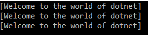
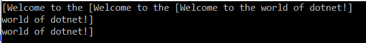
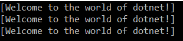
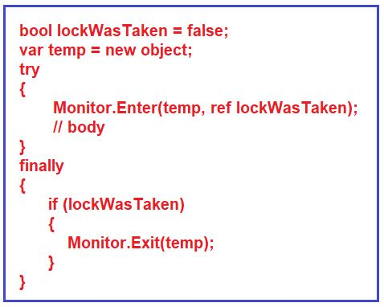
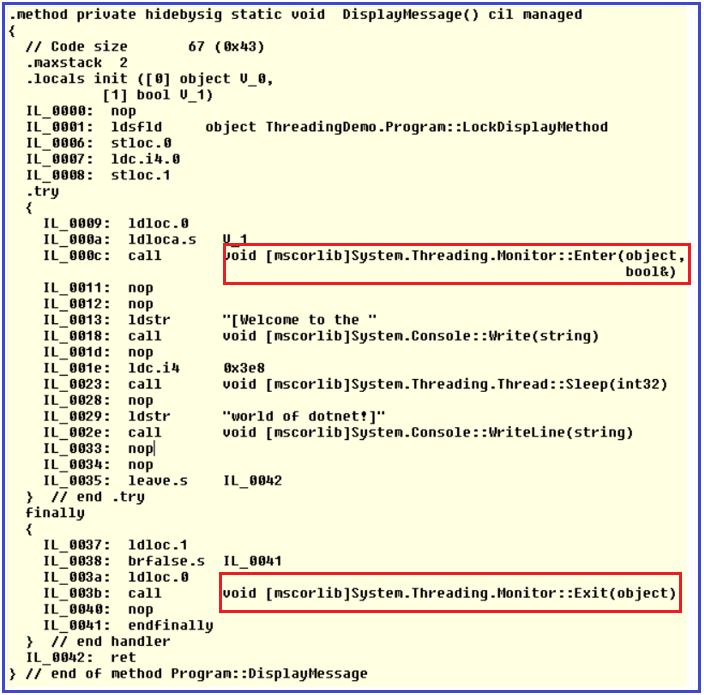

## **همگام‌سازی نخ‌ها** **با استفاده از قفل در سی‌شارپ**

در این مقاله، قصد دارم در مورد **همگام‌سازی نخ‌ها** **با استفاده از Lock در سی‌شارپ** به همراه مثال صحبت کنم. لطفاً مقاله قبلی ما را که در آن در مورد همگام‌سازی نخ‌ها در سی‌شارپ به همراه مثال صحبت کردیم، مطالعه کنید.

1. **چرا باید از منابع مشترک در چندنخی (Multithreading) در سی شارپ محافظت کنیم؟**
2. **دسترسی به یک منبع مشترک در یک محیط تک رشته‌ای در سی شارپ**
3. **دسترسی به یک منبع مشترک در یک محیط چند رشته‌ای در سی شارپ**
4. **چگونه می‌توان از یک منبع مشترک در یک محیط چندنخی در C# در برابر دسترسی همزمان محافظت کرد؟**
5. **دستور Lock در سی شارپ چیست؟**
6. **دستور Lock به صورت داخلی در سی شارپ چگونه کار می‌کند؟**
7. **محافظت از متغیر مشترک با استفاده از دستور Lock در سی شارپ به همراه مثال**

##### **چرا باید از منابع مشترک در چندنخی (Multithreading) در سی شارپ محافظت کنیم؟**

در یک برنامه چندنخی، برای ما بسیار مهم است که چندین نخ را برای اجرای کد بخش بحرانی یا می‌توان گفت منابع مشترک، مدیریت کنیم. به عنوان مثال، اگر یک منبع مشترک داریم و چندین نخ می‌خواهند به منبع مشترک دسترسی داشته باشند، باید از منبع مشترک در برابر دسترسی همزمان محافظت کنیم، در غیر این صورت رفتار یا خروجی متناقضی خواهیم داشت.

در سی شارپ، می‌توانیم از قفل و مانیتور برای تأمین امنیت نخ در یک برنامه چندنخی استفاده کنیم. قفل و مانیتور هر دو مکانیزمی را ارائه می‌دهند که تضمین می‌کند فقط یک نخ در هر نقطه از زمان، کد بخش بحرانی را اجرا می‌کند تا از هرگونه خرابی عملکردی کد یا رفتار یا خروجی متناقض جلوگیری شود.

در این مقاله، قصد دارم در مورد نحوه محافظت از منابع مشترک در یک محیط چند رشته‌ای با استفاده از قفل بحث کنم و در مقاله بعدی، قصد دارم در مورد نحوه انجام همین کار با استفاده از Monitor در C# صحبت کنم.

##### **دسترسی به یک منبع مشترک در یک محیط تک رشته‌ای در سی شارپ:**

قبل از درک نحوه استفاده از قفل برای محافظت از منبع مشترک در یک محیط چند رشته‌ای در سی‌شارپ، ابتدا اجازه دهید مشکل عدم محافظت از منبع مشترک در یک محیط چند رشته‌ای را درک کنیم. در مثال زیر، ما یک منبع مشترک یعنی متد DisplayMessage() داریم و آن متد را سه بار از متد Main فراخوانی می‌کنیم، همانطور که در زیر نشان داده شده است.

```csharp
using System.Threading;
using System;

namespace ThreadingDemo
{
    class Program
    {
        static void Main(string[] args)
        {
            DisplayMessage();
            DisplayMessage();
            DisplayMessage();

            Console.Read();
        }

        static void DisplayMessage()
        {
            Console.Write("[Welcome to the ");
            Thread.Sleep(1000);
            Console.WriteLine("world of dotnet!]");
        }
    }
}
```

###### **خروجی:**



از آنجایی که برنامه فوق یک برنامه تک‌رشته‌ای است، بنابراین خروجی مورد انتظار را دریافت کردیم. در اینجا، منبع مشترک، متد DisplayMessage است که قرار است سه بار به صورت متوالی اجرا شود و از این رو خروجی صحیح را دریافت کردیم. حال، بیایید ادامه دهیم و ببینیم اگر به منابع مشترک در یک محیط چندرشته‌ای دسترسی پیدا کنیم، چه اتفاقی می‌افتد.

##### **دسترسی به یک منبع مشترک در یک محیط چند رشته‌ای در سی شارپ:**

در مثال زیر، ما سه نخ مختلف ایجاد کرده‌ایم و سپس متد DisplayMessage() یکسانی را با استفاده از هر سه نخ مختلف فراخوانی کرده‌ایم. در اینجا، متد DisplayMessage() منبع مشترک است و این منبع مشترک به طور همزمان یا همزمان توسط سه نخ مختلف فراخوانی می‌شود. در اینجا، ما از منبع مشترک محافظت نمی‌کنیم و هر سه نخ به منبع مشترک دسترسی دارند که منجر به خروجی متناقض می‌شود.

```csharp
using System.Threading;
using System;

namespace ThreadingDemo
{
    class Program
    {
        static void Main(string[] args)
        {
            Thread t1 = new Thread(DisplayMessage);
            Thread t2 = new Thread(DisplayMessage);
            Thread t3 = new Thread(DisplayMessage);

            t1.Start();
            t2.Start();
            t3.Start();

            Console.Read();
        }

        static void DisplayMessage()
        {
            Console.Write("[Welcome to the ");
            Thread.Sleep(1000);
            Console.WriteLine("world of dotnet!]");
        }
    }
}
```

###### **خروجی:**



همانطور که می‌بینید، در اینجا خروجی مورد انتظار را دریافت نمی‌کنیم. بنابراین، نکته‌ای که باید در نظر داشته باشید این است که اگر منبع مشترک در یک محیط چند رشته‌ای از دسترسی همزمان محافظت نشود، خروجی یا رفتار برنامه ناسازگار می‌شود.

##### **چگونه می‌توان از یک منبع مشترک در یک محیط چندنخی در C# در برابر دسترسی همزمان محافظت کرد؟**

ما می‌توانیم با استفاده از مفهوم Monitor و Locking در سی‌شارپ، منابع مشترک را در یک محیط چندنخی از دسترسی همزمان محافظت کنیم. بیایید ببینیم چگونه می‌توان با استفاده از دستور lock در سی‌شارپ از منابع مشترک محافظت کرد و خروجی را ببینیم. در مثال زیر، یک شیء فقط خواندنی یعنی LockDisplayMethod ایجاد کرده‌ایم و سپس با استفاده از کلمه کلیدی lock یک بلوک ایجاد کرده‌ایم. به کلمه کلیدی lock، شیء LockDisplayMethod را ارسال می‌کنیم و بخش یا بلوک یا منبع خاصی که می‌خواهیم محافظت کنیم باید درون بلوک قفل قرار گیرد که در مثال زیر نشان داده شده است.

```csharp
using System.Threading;
using System;

namespace ThreadingDemo
{
    class Program
    {
        static void Main(string[] args)
        {
            Thread t1 = new Thread(DisplayMessage);
            Thread t2 = new Thread(DisplayMessage);
            Thread t3 = new Thread(DisplayMessage);

            t1.Start();
            t2.Start();
            t3.Start();

            Console.Read();
        }

        private static readonly object LockDisplayMethod = new object();
        static void DisplayMessage()
        {
            lock(LockDisplayMethod)
            {
                Console.Write("[Welcome to the ");
                Thread.Sleep(1000);
                Console.WriteLine("world of dotnet!]");
            }
        }
    }
}
```

حالا برنامه را اجرا کنید و خروجی را همانطور که در زیر نشان داده شده است، مشاهده کنید. همانطور که در خروجی زیر مشاهده می‌کنید، نتیجه همانطور که انتظار می‌رفت، حاصل شده است و این به این دلیل است که اکنون با استفاده از دستور lock از منبع مشترک محافظت می‌کنیم که تضمین می‌کند فقط یک نخ در هر نقطه زمانی مشخص قادر به دسترسی به بخش بحرانی خواهد بود.



##### **دستور lock در سی شارپ چیست؟**

طبق گفته [**مایکروسافت**](https://learn.microsoft.com/en-us/dotnet/csharp/language-reference/statements/lock) ، دستور قفل، قفل انحصار متقابل را برای یک شیء مشخص به دست می‌آورد، یک بلوک دستور را اجرا می‌کند و سپس قفل را آزاد می‌کند. در حالی که قفل نگه داشته می‌شود، نخی که قفل را نگه داشته است می‌تواند دوباره قفل را به دست آورد و آزاد کند. هر نخ دیگری از به دست آوردن قفل مسدود می‌شود و منتظر می‌ماند تا قفل آزاد شود.

**نکته:** وقتی می‌خواهید دسترسی نخ به یک منبع مشترک را همگام‌سازی کنید، باید منبع مشترک را روی یک نمونه شیء اختصاصی قفل کنید (برای مثال، **private readonly object \_lockObject = new object(); یا private static readonly object \_lockObject = new object();** ). از استفاده از یک نمونه شیء قفل یکسان برای منابع مشترک مختلف خودداری کنید، زیرا ممکن است منجر به بن‌بست شود.

##### **دستور lock به صورت داخلی در سی شارپ چگونه کار می‌کند؟**

دستور lock در سی شارپ هنگام کامپایل کد، به صورت داخلی به یک بلوک try-finally تبدیل شد. کد کامپایل شده دستور lock به شکل زیر خواهد بود. همانطور که می‌بینید، این دستور به صورت داخلی از متد Enter و Exit کلاس Monitor استفاده می‌کند. در مقاله بعدی، متدهای Enter و Exit کلاس Monitor را به طور مفصل مورد بحث قرار خواهیم داد. فعلاً برای درک بهتر، می‌توانیم بگوییم که این دستور با فراخوانی متد Enter کلاس Monitor، یک قفل انحصاری در بلوک try ایجاد می‌کند و با فراخوانی متد Exit کلاس Monitor، قفل انحصاری را در بلوک finally آزاد می‌کند.



همچنین می‌توانید کد IL را با استفاده از ابزار ILDASM تأیید کنید. حال، اگر برنامه را با استفاده از ابزار ILDASAM باز کنید و اگر کد IL مربوط به متد DisplayMessage را تأیید کنید، می‌توانید بلوک‌های try و finally را به همراه متدهای Enter و Exit کلاس Monitor، همانطور که در تصویر زیر نشان داده شده است، مشاهده کنید.



##### **محافظت از متغیر مشترک با استفاده از دستور Lock در سی شارپ به همراه مثال:**

بخش یا بلوک یا منبع خاصی که می‌خواهید محافظت کنید باید درون بلوک قفل قرار گیرد. بگذارید این موضوع را با یک مثال درک کنیم. در مثال زیر، ما فقط متغیر Count مشترک را از دسترسی همزمان محافظت می‌کنیم.

```csharp
using System.Threading;
using System;

namespace ThreadingDemo
{
    class Program
    {
        static int Count = 0;

        static void Main(string[] args)
        {
            Thread t1 = new Thread(IncrementCount);
            Thread t2 = new Thread(IncrementCount);
            Thread t3 = new Thread(IncrementCount);

            t1.Start();
            t2.Start();
            t3.Start();

            //Wait for all three threads to complete their execution
            t1.Join();
            t2.Join();
            t3.Join();

            Console.WriteLine(Count);
            Console.Read();
        }

        private static readonly object LockCount = new object();
        static void IncrementCount()
        {
            for (int i = 1; i <= 1000000; i++)
            {
                //Only protecting the shared Count variable
                lock (LockCount)
                {
                    Count++;
                }
            }
        }
    }
}
```

وقتی برنامه‌ی بالا را اجرا می‌کنید، خروجی مورد انتظار ۳۰۰۰۰۰۰ را به شما می‌دهد. حال، بیایید ببینیم اگر از متغیر مشترک Count محافظت نکنیم چه اتفاقی می‌افتد. در مثال زیر، ما از متغیر مشترک Count محافظت نمی‌کنیم و از این رو هر سه نخ به طور همزمان به متغیر دسترسی پیدا می‌کنند و سعی می‌کنند مقدار آن را افزایش دهند و از این رو خروجی غیرمنتظره‌ای دریافت خواهیم کرد.

```csharp
using System.Threading;
using System;

namespace ThreadingDemo
{
    class Program
    {
        static int Count = 0;

        static void Main(string[] args)
        {
            Thread t1 = new Thread(IncrementCount);
            Thread t2 = new Thread(IncrementCount);
            Thread t3 = new Thread(IncrementCount);

            t1.Start();
            t2.Start();
            t3.Start();

            //Wait for all three threads to complete their execution
            t1.Join();
            t2.Join();
            t3.Join();

            Console.WriteLine(Count);
            Console.Read();
        }
        
        static void IncrementCount()
        {
            for (int i = 1; i <= 1000000; i++)
            {
                Count++;
            }
        }
    }
}
```

هر بار که برنامه را اجرا می‌کنید، خروجی متفاوتی دریافت خواهید کرد. بنابراین، محافظت از منابع مشترک در یک برنامه چند رشته‌ای برای ما مهم است، در غیر این صورت خروجی مورد انتظار را دریافت نخواهیم کرد.