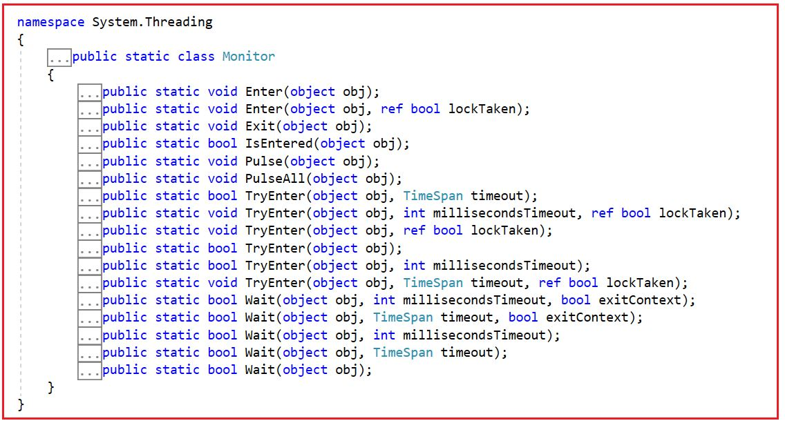
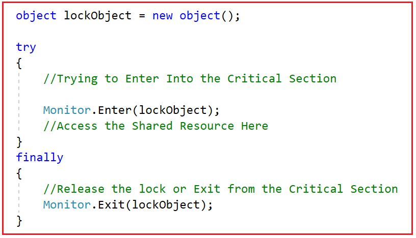
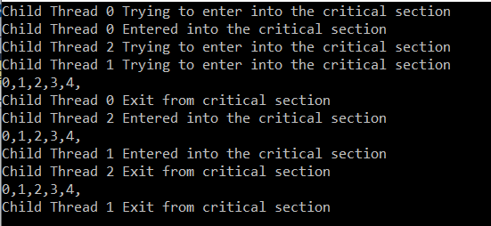
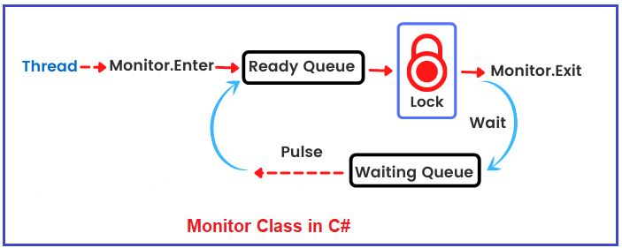
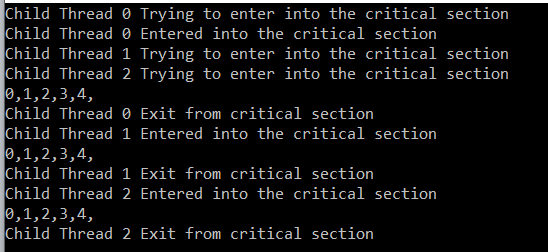
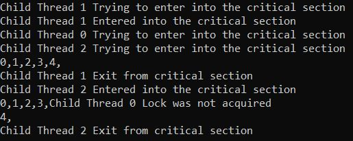
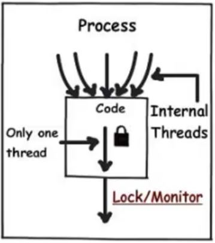

## **کلاس مانیتور در سی شارپ به همراه مثال**

به همراه مثال خواهم پرداخت **در این مقاله، به بررسی نحوه محافظت** **از منابع مشترک در چندنخی با استفاده از** **کلاس Monitor** **در سی شارپ** از دسترسی همزمان به همراه مثال را مطالعه کنید. لطفاً مقاله قبلی ما در مورد نحوه محافظت از منابع مشترک با استفاده از Lock در سی شارپ را مطالعه کنید. به عنوان بخشی از این مقاله، قصد داریم نکات زیر را مورد بحث قرار دهیم.

1. **آشنایی با کلاس Monitor در سی شارپ**
2. **مثالی برای درک کلاس Monitor در سی شارپ برای محافظت از منابع مشترک در برابر دسترسی همزمان**
3. **کلاس Monitor در سی شارپ چگونه کار می‌کند؟**
4. **مثالی برای درک متد Monitor.Enter(lockObject, ref IslockTaken) در سی شارپ**
5. **مثالی برای درک متد TryEnter(Object, TimeSpan, Boolean) از کلاس Monitor در سی شارپ**
6. **مثالی برای درک متدهای wait() و Pulse() کلاس Monitor در سی شارپ**
7. **تفاوت بین مانیتور و قفل در سی شارپ**
8. **محدودیت‌های قفل‌ها و مانیتورها در سی‌شارپ**

قبلاً بحث کردیم که هم Monitor و هم Lock برای فراهم کردن امنیت نخ برای یک منبع مشترک در یک برنامه چند نخی در C# استفاده می‌شوند. در مقاله قبلی، نحوه استفاده از مکانیزم قفل برای دستیابی به امنیت نخ در یک محیط چند نخی را دیدیم. حال، بیایید ادامه دهیم و سعی کنیم کلاس Monitor و متدهای آن را به طور مفصل درک کنیم تا نحوه محافظت از منبع مشترک با استفاده از کلاس Monitor در C# را با مثال‌هایی درک کنیم.

##### **آشنایی با کلاس Monitor در سی شارپ:**

طبق گفته [**مایکروسافت**](https://learn.microsoft.com/en-us/dotnet/api/system.threading.monitor?view=net-6.0) ، کلاس Monitor در C# مکانیزمی را فراهم می‌کند که دسترسی به اشیاء را همگام‌سازی می‌کند. بیایید تعریف بالا را ساده کنیم. به عبارت ساده، می‌توانیم بگوییم که مانند قفل، می‌توانیم از این کلاس Monitor برای محافظت از منابع مشترک در یک محیط چند رشته‌ای در برابر دسترسی همزمان نیز استفاده کنیم. این کار را می‌توان با ایجاد یک قفل انحصاری روی شیء انجام داد، به طوری که فقط یک رشته بتواند در هر نقطه زمانی مشخص وارد بخش بحرانی شود.

کلاس Monitor یک کلاس استاتیک متعلق به فضای نام System.Threading است. به عنوان یک کلاس استاتیک، همانطور که در تصویر زیر نشان داده شده است، مجموعه‌ای از متدهای استاتیک را ارائه می‌دهد. با استفاده از این متدهای استاتیک، می‌توانیم دسترسی هماهنگ به بخش بحرانی مرتبط با یک شیء خاص را فراهم کنیم.



بیایید نقش‌ها و مسئولیت‌های هر متد در کلاس Monitor را درک کنیم. در زیر لیستی از متدهای مهم در کلاس Monitor آمده است.

1. **Enter():** وقتی متد Enter از کلاس Monitor را فراخوانی می‌کنیم، یک قفل انحصاری روی شیء مشخص شده ایجاد می‌شود. این همچنین نشان‌دهنده‌ی شروع یک بخش بحرانی یا شروع یک منبع مشترک است.
2. **Exit():** وقتی متد Exit کلاس Monitor فراخوانی می‌شود، قفل روی شیء مشخص شده را آزاد می‌کند. این نشان‌دهنده‌ی پایان یک بخش بحرانی یا پایان منبع مشترک محافظت شده توسط شیء قفل شده است.
3. **Pulse():** وقتی متد Pulse از کلاس Monitor فراخوانی می‌شود، سیگنالی را به نخی که در صف انتظار است ارسال می‌کند که نشان‌دهنده‌ی تغییر در وضعیت شیء قفل‌شده است.
4. **Wait():** وقتی متد Wait کلاس Monitor فراخوانی می‌شود، قفل روی یک شیء را آزاد می‌کند و نخ فعلی را تا زمانی که دوباره قفل را دریافت کند، مسدود می‌کند.
5. **PulseAll():** وقتی متد PulseAll کلاس Monitor فراخوانی می‌شود، سیگنال‌هایی را به تمام نخ‌های منتظر در مورد تغییر در وضعیت شیء قفل‌شده ارسال می‌کند.
6. **TryEnter():** وقتی متد TryEnter کلاس Monitor را فراخوانی می‌کنیم، تلاش می‌کند تا یک قفل انحصاری روی شیء مشخص شده ایجاد کند.

**توجه:** اگر در حال حاضر این موضوع برایتان واضح نیست، نگران نباشید. ما سعی خواهیم کرد تمام روش‌های فوق را با مثال‌هایی درک کنیم و همچنین خواهید دید که نسخه‌های بارگذاری‌شده‌ی زیادی از روش‌های فوق در دسترس هستند.

##### **مثالی برای درک کلاس Monitor در سی شارپ جهت محافظت از منابع مشترک در برابر دسترسی همزمان:**

در ادامه، سینتکس استفاده از متدهای Enter و Exit کلاس Monitor برای محافظت از یک منبع مشترک در یک محیط چندنخی از دسترسی همزمان در سی شارپ آمده است. تمام متدهای کلاس Monitor استاتیک هستند. بنابراین، می‌توانید در اینجا ببینید که ما با استفاده از نام کلاس، یعنی Monitor، به متدهای Enter و Exit دسترسی پیدا می‌کنیم.



بیایید مثالی بزنیم تا نحوه استفاده از متد Enter and Exit کلاس Monitor را برای محافظت از یک منبع مشترک در یک محیط چند رشته‌ای در C# از دسترسی همزمان بررسی کنیم. در مثال زیر، ما یک منبع مشترک داریم و به طور همزمان با استفاده از سه رشته مختلف به آن منبع دسترسی داریم. سپس، ما از متدهای Enter and Exit کلاس Monitor برای محافظت از کد بخش بحرانی استفاده کردیم. در این حالت، هر سه رشته سعی می‌کنند یک قفل انحصاری به دست آورند، اما در هر نقطه زمانی مشخص، فقط یک رشته قفل انحصاری دریافت می‌کند و وارد بخش بحرانی می‌شود و همه رشته‌های دیگر منتظر می‌مانند تا رشته قفل را آزاد کند.

```csharp
using System;
using System.Threading;

namespace MonitorDemo
{
    class Program
    {
        private static readonly object lockPrintNumbers = new object();

        public static void PrintNumbers()
        {
            Console.WriteLine(Thread.CurrentThread.Name + " Trying to enter into the critical section");
            
            try
            {
                Monitor.Enter(lockPrintNumbers);
                Console.WriteLine(Thread.CurrentThread.Name + " Entered into the critical section");
                for (int i = 0; i < 5; i++)
                {
                    Thread.Sleep(100);
                    Console.Write(i + ",");
                }
                Console.WriteLine();
            }
            finally
            {
                Monitor.Exit(lockPrintNumbers);
                Console.WriteLine(Thread.CurrentThread.Name + " Exit from critical section");
            }
        }

        static void Main(string[] args)
        {
            Thread[] Threads = new Thread[3];
            for (int i = 0; i < 3; i++)
            {
                Threads[i] = new Thread(PrintNumbers)
                {
                    Name = "Child Thread " + i
                };
            }

            foreach (Thread t in Threads)
            {
                t.Start();
            }

            Console.ReadLine();
        }
    }
}
```

###### **خروجی:**



##### **کلاس Monitor در سی شارپ چگونه کار می‌کند؟**

کلاس Monitor در C# یک مکانیزم همگام‌سازی مبتنی بر انتظار ارائه می‌دهد که به منظور جلوگیری از شرایط رقابتی، فقط به یک نخ اجازه می‌دهد در یک زمان به کد بخش بحرانی دسترسی داشته باشد. سایر نخ‌ها باید منتظر بمانند و اجرا را تا زمان آزاد شدن شیء قفل‌شده متوقف کنند.

برای درک نحوه عملکرد کلاس Monitor در C#، لطفاً به نمودار زیر نگاهی بیندازید. همانطور که در تصویر زیر نشان داده شده است، به محض اینکه یک thread متد Enter از کلاس Thread را اجرا کند، در صف Ready قرار می‌گیرد و به همین ترتیب، بسیاری از threadها می‌توانند در صف Ready باشند. سپس، یکی از threadهای صف Ready یک قفل انحصاری روی شیء به دست می‌آورد و وارد بخش Critical می‌شود و کد را اجرا می‌کند و در آن زمان، هیچ thread دیگری نمی‌تواند شانس ورود به بخش Critical را داشته باشد. وقتی متد Exit از کلاس thread را اجرا می‌کنیم، thread در حال اجرا به صف انتظار منتقل می‌شود و یک سیگنال به threadهای صف Ready ارسال می‌کند. یکی از Threadهای صف Ready قفل را به دست می‌آورد و وارد بخش Critical می‌شود و شروع به اجرای کد بخش Critical می‌کند. اینگونه است که کلاس Monitor در C# کار می‌کند.



##### **متد Monitor.Enter(lockObject, ref IslockTaken) در سی شارپ:**

بیایید نسخه دیگرِ سربارگذاری‌شده‌ی متد Enter را درک کنیم. **Monitor.Enter(lockObject, ref IslockTaken)** یک قفل انحصاری روی شیء مشخص‌شده ایجاد می‌کند. سپس به‌طور خودکار مقداری را تنظیم می‌کند که نشان می‌دهد قفل اعمال شده است یا خیر. پارامتر دوم، که یک پارامتر بولی است، در صورت اعمال قفل، مقدار true و در غیر این صورت مقدار false را برمی‌گرداند. سینتکس استفاده از این نسخه سربارگذاری‌شده در زیر آمده است.

 در سی شارپ")

مثال زیر نحوه استفاده از **متد Enter(lockObject, ref IslockTaken)** از کلاس Monitor در C# را نشان می‌دهد. مثال زیر مشابه مثال قبلی است، با این تفاوت که در اینجا، ما از نسخه overload شده متد Enter استفاده می‌کنیم که دو پارامتر می‌گیرد. پارامتر بولی دوم مشخص می‌کند که آیا نخ قفلی را دریافت می‌کند یا خیر، true نشان می‌دهد که قفلی روی شیء دریافت می‌کند و false نشان می‌دهد که قفلی روی شیء دریافت نمی‌کند و دوباره در بلوک finally مقدار بولی را بررسی می‌کنیم و بر این اساس قفل را آزاد می‌کنیم.

```csharp
using System;
using System.Threading;

namespace MonitorDemo
{
    class Program
    {
        private static readonly object lockPrintNumberst = new object();

        public static void PrintNumbers()
        {
            Console.WriteLine(Thread.CurrentThread.Name + " Trying to enter into the critical section");
            bool IsLockTaken = false;
            
            try
            {
                Monitor.Enter(lockPrintNumberst, ref IsLockTaken);
                if(IsLockTaken)
                {
                    Console.WriteLine(Thread.CurrentThread.Name + " Entered into the critical section");
                    for (int i = 0; i < 5; i++)
                    {
                        Thread.Sleep(100);
                        Console.Write(i + ",");
                    }
                    Console.WriteLine();
                }
            }
            finally
            {
                if (IsLockTaken)
                {
                    Monitor.Exit(lockPrintNumberst);
                    Console.WriteLine(Thread.CurrentThread.Name + " Exit from critical section");
                }
            }
        }

        static void Main(string[] args)
        {
            Thread[] Threads = new Thread[3];
            for (int i = 0; i < 3; i++)
            {
                Threads[i] = new Thread(PrintNumbers)
                {
                    Name = "Child Thread " + i
                };
            }

            foreach (Thread t in Threads)
            {
                t.Start();
            }

            Console.ReadLine();
        }
    }
}
```

###### **خروجی:**



##### **مثالی برای درک متد TryEnter(Object, TimeSpan, Boolean) از کلاس Monitor در سی شارپ:**

این متد تلاش می‌کند تا یک قفل انحصاری روی شیء مشخص شده برای مدت زمان مشخصی ایجاد کند. این متد به طور خودکار مقداری را تنظیم می‌کند که نشان می‌دهد آیا قفل اعمال شده است یا خیر. سینتکس استفاده از **متد TryEnter(Object, TimeSpan, Boolean)** از کلاس Monitor در C# در زیر آمده است.

 از کلاس Monitor در سی شارپ")

برای درک بهتر، لطفاً به مثال زیر نگاهی بیندازید که نحوه استفاده از متد TryEnter(Object, TimeSpan, Boolean) از کلاس Monitor در C# را نشان می‌دهد. در مثال زیر، ما زمان انقضا را ۱۰۰۰ میلی‌ثانیه یا به عبارت دیگر ۱ ثانیه تعیین کرده‌ایم. اگر نخ قفل را ظرف ۱ ثانیه دریافت نکند، وارد بخش بحرانی نخواهد شد.

```csharp
using System;
using System.Threading;

namespace MonitorDemo
{
    class Program
    {
        private static readonly object lockPrintNumbers = new object();

        public static void PrintNumbers()
        {
            TimeSpan timeout = TimeSpan.FromMilliseconds(1000);
            bool lockTaken = false;

            try
            {
                Console.WriteLine(Thread.CurrentThread.Name + " Trying to enter into the critical section");
                Monitor.TryEnter(lockPrintNumbers, timeout, ref lockTaken);
                if (lockTaken)
                {
                    Console.WriteLine(Thread.CurrentThread.Name + " Entered into the critical section");
                    for (int i = 0; i < 5; i++)
                    {
                        Thread.Sleep(100);
                        Console.Write(i + ",");
                    }
                    Console.WriteLine();
                }
                else
                {
                    // The lock was not acquired.
                    Console.WriteLine(Thread.CurrentThread.Name + " Lock was not acquired");
                }
            }
            finally
            {
                // To Ensure that the lock is released.
                if (lockTaken)
                {
                    Monitor.Exit(lockPrintNumbers);
                    Console.WriteLine(Thread.CurrentThread.Name + " Exit from critical section");
                }
            }
        }

        static void Main(string[] args)
        {
            Thread[] Threads = new Thread[3];
            for (int i = 0; i < 3; i++)
            {
                Threads[i] = new Thread(PrintNumbers)
                {
                    Name = "Child Thread " + i
                };
            }

            foreach (Thread t in Threads)
            {
                t.Start();
            }

            Console.ReadLine();
        }
    }
}
```

وقتی کد بالا را اجرا می‌کنید، خروجی زیر را دریافت خواهید کرد. خروجی ممکن است در دستگاه شما متفاوت باشد. همانطور که می‌بینید، هر سه نخ سعی می‌کنند ظرف ۱ ثانیه قفلی روی شیء ایجاد کنند. دو نخ از سه نخ، قفل انحصاری روی شیء ایجاد می‌کنند، در حالی که یکی از آنها قادر به ایجاد قفل انحصاری نیست و از این رو، آن نخ وارد بخش بحرانی نخواهد شد.



##### **مثال برای درک متدهای wait() و Pulse() از کلاس Monitor در سی شارپ:**

متد Wait() از کلاس Monitor برای آزاد کردن قفل یک شیء استفاده می‌شود تا به نخ‌های دیگر اجازه قفل کردن و دسترسی به شیء را بدهد. نخ فراخواننده منتظر می‌ماند تا نخ دیگری به شیء دسترسی پیدا کند. سیگنال‌های Pulse برای اطلاع‌رسانی به نخ‌های منتظر در مورد تغییرات در وضعیت شیء قفل‌شده استفاده می‌شوند.

بگذارید این موضوع را با یک مثال بلادرنگ درک کنیم. نیاز کاری ما چاپ دنباله اعداد زوج و فرد با استفاده از دو نخ مختلف است. یک نخ اعداد زوج و نخ دیگر اعداد فرد را چاپ خواهد کرد.  
**رزوه T1: 0،2،4،6،8…**  
**رزوه T2: ۱،۳،۵،۷،۹…**  
**خروجی: ۰،۱،۲،۳،۴،۵،۶،۷،۸،۹…**

برای حل مشکل فوق، اجازه دهید از مکانیزم سیگنال‌دهی با استفاده از متدهای Wait() و Pulse() کلاس Monitor در C# استفاده کنیم. در مثال زیر، از متد Monitor.Wait() برای منتظر نگه داشتن نخ و از متد Monitor.Pulse() برای سیگنال دادن به نخ‌های دیگر استفاده می‌کنیم. فرآیند به شرح زیر است:

1. ابتدا، رشته‌ی Even شروع به چاپ عدد روی کنسول می‌کند.
2. سپس، نخ زوج با استفاده از متد Monitor.Pulse() به نخ فرد علامت می‌دهد که آماده چاپ عدد باشد.
3. سپس، نخ رویداد (Event thread) متد Monitor.Wait() را فراخوانی می‌کند که به نخ فعلی اجازه می‌دهد مسدود شود و نخ فرد (Odd thread) اجرا را آغاز کند.
4. تاپیک عجیب و غریب هم همین کار را انجام خواهد داد.
5. رشته‌ی Odd شروع به چاپ عدد روی کنسول خواهد کرد.
6. سپس، نخ فرد با استفاده از متد Monitor.Pulse() به نخ زوج علامت می‌دهد که آماده چاپ عدد باشد.
7. سپس نخ Odd متد Monitor.Wait() را فراخوانی می‌کند که به نخ فعلی اجازه می‌دهد مسدود شود و به نخ Even اجازه می‌دهد اجرا را شروع کند.
8. همین روند در حال طی شدن است.

از آنجایی که هر دو رشته‌ی فرد و زوج از یک پنجره‌ی کنسول برای چاپ عدد استفاده می‌کنند، باید یک قفل روی ورودی/خروجی کنسول قرار دهیم. ما می‌خواهیم دنباله با عدد زوج شروع شود، بنابراین رشته‌ی زوج باید ابتدا اجرا شود. پس از شروع رشته‌ی زوج، باید قبل از شروع رشته‌ی فرد، با استفاده از متد Sleep() از کلاس Thread در C#، لحظه‌ای مکث کنیم تا از هرگونه احتمال شروع رشته‌ی فرد در ابتدا جلوگیری شود.

```csharp
using System;
using System.Threading;

namespace odd_even_sequence
{
    class Program
    {
        //Upto the limit numbers will be printed on the Console
        const int numberLimit = 20;

        static readonly object _lockMonitor = new object();

        static void Main(string[] args)
        {
            Thread EvenThread = new Thread(PrintEvenNumbers);
            Thread OddThread = new Thread(PrintOddNumbers);

            //First Start the Even thread.
            EvenThread.Start();

            //Puase for 10 ms, to make sure Even thread has started 
            //or else Odd thread may start first resulting different sequence.
            Thread.Sleep(100);

            //Next, Start the Odd thread.
            OddThread.Start();

            //Wait for all the childs threads to complete
            OddThread.Join();
            EvenThread.Join();

            Console.WriteLine("\\nMain method completed");
            Console.ReadKey();
        }

        //Printing of Even Numbers Function
        static void PrintEvenNumbers()
        {
            try
            {
                //Implement lock as the Console is shared between two threads
                Monitor.Enter(_lockMonitor);
                for (int i = 0; i <= numberLimit; i = i + 2)
                {
                    //Printing Even Number on Console)
                    Console.Write($"{i} ");

                    //Notify Odd thread that I'm done, you do your job
                    //It notifies a thread in the waiting queue of a change in the 
                    //locked object's state.
                    Monitor.Pulse(_lockMonitor);

                    //I will wait here till Odd thread notify me 
                    //Monitor.Wait(monitor);
                    //Without this logic application will wait forever

                    bool isLast = false;
                    if (i == numberLimit)
                    {
                        isLast = true;
                    }

                    if (!isLast)
                    {
                        //I will wait here till Odd thread notify me
                        //Releases the lock on an object and blocks the current thread 
                        //until it reacquires the lock.
                        Monitor.Wait(_lockMonitor);
                    }
                }
            }
            finally
            {
                //Release the lock
                Monitor.Exit(_lockMonitor);
            }

        }

        //Printing of Odd Numbers Function
        static void PrintOddNumbers()
        {
            try
            {
                //Hold lock as the Console is shared between two threads
                Monitor.Enter(_lockMonitor);
                for (int i = 1; i <= numberLimit; i = i + 2)
                {
                    //Printing the odd numbers on the console
                    Console.Write($"{i} ");

                    //Notify Even thread that I'm done, you do your job
                    Monitor.Pulse(_lockMonitor);

                    // I will wait here till even thread notify me
                    // Monitor.Wait(monitor);
                    // without this logic application will wait forever

                    bool isLast = false;
                    if (i == numberLimit - 1)
                    {
                        isLast = true;
                    }

                    if (!isLast)
                    {
                        //I will wait here till Even thread notify me
                        Monitor.Wait(_lockMonitor);
                    }
                }
            }
            finally
            {
                //Release lock
                Monitor.Exit(_lockMonitor);
            }
        }
    }
}
```

###### **خروجی:**

 و Pulse() کلاس Monitor در سی شارپ")

##### **تفاوت بین مانیتور و قفل در سی شارپ**

تفاوت بین monitor و lock در سی شارپ این است که lock به صورت داخلی متدهای Enter و Exit را در یک بلوک try…finally با قابلیت مدیریت خطا قرار می‌دهد. برای کلاس Monitor در سی شارپ، باید به طور صریح از بلوک try و finally برای آزاد کردن صحیح قفل استفاده کنیم. بنابراین، Lock = Monitor + try-finally.

قفل، قابلیت اولیه برای ایجاد قفل انحصاری روی یک شیء همگام‌سازی شده را فراهم می‌کند. اما اگر می‌خواهید کنترل بیشتری برای پیاده‌سازی راه‌حل‌های چندنخی پیشرفته با استفاده از متدهای TryEnter()، Wait()، Pulse() و PulseAll() داشته باشید، کلاس Monitor گزینه مناسبی است.

##### **محدودیت‌های قفل‌ها و مانیتورها در سی‌شارپ:**

قفل‌ها و مانیتورها به ما کمک می‌کنند تا از ایمن بودن کدمان در برابر نخ‌ها اطمینان حاصل کنیم. این بدان معناست که وقتی کد خود را در یک محیط چند نخی اجرا می‌کنیم، با نتایج متناقضی مواجه نمی‌شویم. برای درک بهتر، لطفاً به تصویر زیر نگاهی بیندازید.



با این حال، محدودیت‌هایی برای قفل‌ها و مانیتورها وجود دارد. قفل‌ها و مانیتورها، ایمنی نخ‌ها را برای نخ‌هایی که در حال پردازش هستند، یعنی نخ‌هایی که توسط خود برنامه تولید می‌شوند، یعنی نخ‌های داخلی، تضمین می‌کنند. اما اگر نخ‌ها از برنامه‌های خارجی (Out-Process) یا نخ‌های خارجی بیایند، قفل‌ها و مانیتورها هیچ کنترلی بر آنها ندارند. بنابراین، در چنین شرایطی، باید از Mutex استفاده کنیم. در مقاله بعدی، در مورد Mutex صحبت خواهیم کرد.

##### **متدهای کلاس Monitor با جزئیات:**

بیایید نقش‌ها و مسئولیت‌های هر متد از کلاس Monitor را طبق تعریف مایکروسافت بررسی کنیم.

1. **Enter(object obj):** این متد یک قفل انحصاری روی شیء مشخص شده ایجاد می‌کند. برای ایجاد قفل مانیتور، یک پارامتر شیء دریافت می‌کند. اگر پارامتر obj تهی (null) باشد، خطای ArgumentNullException رخ می‌دهد.
2. **Enter(object obj, ref bool lockTaken):** این متد همچنین یک قفل انحصاری روی شیء مشخص شده ایجاد می‌کند و به صورت خودکار مقداری را تعیین می‌کند که نشان می‌دهد آیا قفل ایجاد شده است یا خیر. در اینجا، پارامتر obj شیء مورد نظر را برای انتظار مشخص می‌کند. پارامتر lockTaken نتیجه تلاش برای ایجاد قفل ارسالی با ارجاع را مشخص می‌کند. ورودی باید false باشد. اگر قفل ایجاد شود، خروجی true است؛ در غیر این صورت، خروجی false است. حتی اگر در حین تلاش برای ایجاد قفل، استثنایی رخ دهد، خروجی تنظیم می‌شود. اگر هیچ استثنایی رخ ندهد، خروجی این متد همیشه true خواهد بود. اگر ورودی lockTaken درست باشد، ArgumentException را ایجاد می‌کند. اگر پارامتر obj تهی باشد، ArgumentNullException را ایجاد می‌کند.

##### **متدهای TryEnter:**

شش نسخه overload شده از متد TryEnter در کلاس Monitor موجود است که به شرح زیر می‌باشند:

1. **تابع ()public static bool TryEnter(object obj, TimeSpan timeout):** برای مدت زمان مشخص شده، تلاش می‌کند تا یک قفل انحصاری روی شیء مشخص شده ایجاد کند.
2. **تابع `public static void TryEnter(object obj, int millisecondsTimeout, ref bool lockTaken):** به مدت زمان مشخص شده بر حسب میلی ثانیه، تلاش می‌کند تا یک قفل انحصاری روی شیء مشخص شده ایجاد کند و به صورت خودکار مقداری را تعیین می‌کند که نشان می‌دهد آیا قفل اعمال شده است یا خیر.
3. **تابع ()public static void TryEnter(object obj, ref bool lockTaken):** تلاش می‌کند تا یک قفل انحصاری روی شیء مشخص شده ایجاد کند و به صورت خودکار مقداری را تعیین می‌کند که نشان می‌دهد آیا قفل اعمال شده است یا خیر.
4. **تابع public static bool** سعی می‌کند قفل انحصاری روی شیء مشخص‌شده ایجاد کند.
5. **تابع ()public static bool TryEnter(object obj, int millisecondsTimeout):** به مدت زمان مشخص شده بر حسب میلی ثانیه، تلاش می‌کند تا یک قفل انحصاری (exclusive lock) روی شیء مشخص شده اعمال کند.
6. **تابع ()public static void TryEnter(object obj, TimeSpan timeout, ref bool lockTaken):** برای مدت زمان مشخص شده، تلاش می‌کند تا یک قفل انحصاری روی شیء مشخص شده ایجاد کند و به صورت خودکار مقداری را تعیین می‌کند که نشان می‌دهد آیا قفل اعمال شده است یا خیر.

همه این متدها همچنین برای بدست آوردن یک قفل انحصاری روی شیء مشخص شده استفاده می‌شوند. علاوه بر این، اگر توجه کرده باشید، همه این متدها نوع bool را برمی‌گردانند. بنابراین، متد TryEnter() در صورتی که نخ فعلی قفل را بدست آورد، مقدار true و در غیر این صورت، مقدار false را برمی‌گرداند. پارامترهای زیر در متد TryEnter استفاده می‌شوند.

1. **شیء obj:** هر شش نسخه بارگذاری شده یک پارامتر نوع شیء می‌گیرند که شیء مورد نظر برای دریافت قفل را مشخص می‌کند. اگر پارامتر شیء که این متد می‌گیرد تهی باشد، آنگاه خطای ArgumentNullException رخ می‌دهد.
2. **TimeSpan timeout:** برخی از متدهای TryEnter() زمان TimeSpan timeout را به عنوان پارامتر دریافت می‌کنند و این پارامتر یک System.TimeSpan را مشخص می‌کند که نشان دهنده مدت زمان انتظار برای قفل شدن است. مقدار -1 میلی ثانیه، انتظار بی‌نهایت را مشخص می‌کند. اگر مقدار timeout بر حسب میلی ثانیه منفی باشد و برابر با System.Threading.Timeout.Infinite (-1 میلی ثانیه) نباشد، یا بزرگتر از System.Int32.MaxValue باشد، خطای ArgumentOutOfRangeException رخ خواهد داد.
3. **int millisecondsTimeout:** باز هم، دو نسخه overload شده، int millisecondsTimeout را به عنوان پارامتر دریافت می‌کنند و این پارامتر تعداد میلی‌ثانیه‌هایی را که باید برای قفل شدن منتظر بمانند، مشخص می‌کند. اگر millisecondsTimeout منفی باشد و با System.Threading.Timeout.Infinite برابر نباشد، خطای ArgumentOutOfRangeException رخ می‌دهد.
4. **ref bool lockTaken:** همچنین سه نسخه سربارگذاری شده، ref bool lockTaken را به عنوان پارامتر می‌گیرند و این پارامتر نتیجه تلاش برای به دست آوردن قفل را که به صورت ارجاعی ارسال می‌شود، مشخص می‌کند. ورودی باید false باشد. اگر قفل به دست آید، خروجی true است؛ در غیر این صورت، خروجی false است. خروجی حتی اگر در طول تلاش برای به دست آوردن قفل، استثنایی رخ دهد، تنظیم می‌شود. اگر ورودی lockTaken true باشد، ArgumentException خواهد بود.

**نکته:** هر دو متد Enter و TryEnter برای بدست آوردن قفل انحصاری برای یک شیء استفاده می‌شوند. این عمل، آغاز یک بخش بحرانی را نشان می‌دهد. هیچ رشته‌ی دیگری نمی‌تواند وارد بخش بحرانی شود، مگر اینکه دستورالعمل‌های بخش بحرانی را با استفاده از یک شیء قفل‌شده‌ی متفاوت اجرا کند.

##### **متدهای انتظار کلاس Monitor در سی شارپ:**

پنج نسخه سربارگذاری شده از متد Wait در کلاس Monitor موجود است. آنها به شرح زیر هستند:

1. **public static bool Wait(object obj):** قفل روی یک شیء را آزاد می‌کند و نخ فعلی را تا زمانی که دوباره قفل را به دست آورد، مسدود می‌کند.
2. **public static bool Wait(object obj, TimeSpan timeout):** قفل روی یک شیء را آزاد می‌کند و نخ فعلی را تا زمانی که دوباره قفل را دریافت کند، مسدود می‌کند. اگر فاصله زمانی مشخص شده برای وقفه سپری شود، نخ وارد صف آماده می‌شود.
3. **public static bool Wait(object obj, int millisecondsTimeout):** قفل روی یک شیء را آزاد می‌کند و نخ فعلی را تا زمانی که دوباره قفل را دریافت کند، مسدود می‌کند. اگر فاصله زمانی مشخص شده برای وقفه سپری شود، نخ وارد صف آماده می‌شود.
4. **public static bool Wait(object obj, TimeSpan timeout, bool exitContext):** قفل روی یک شیء را آزاد می‌کند و نخ فعلی را تا زمانی که دوباره قفل را دریافت کند، مسدود می‌کند. اگر فاصله زمانی مشخص شده برای پایان یافتن قفل سپری شود، نخ وارد صف آماده می‌شود. به صورت اختیاری قبل از انتظار از دامنه همگام‌سازی برای زمینه همگام‌سازی شده خارج می‌شود و پس از آن دامنه را دوباره دریافت می‌کند.
5. **public static bool Wait(object obj, int millisecondsTimeout, bool exitContext):** این متد قفل روی یک شیء را آزاد می‌کند و نخ فعلی را تا زمانی که دوباره قفل را دریافت کند، مسدود می‌کند. اگر فاصله زمانی مشخص شده برای پایان یافتن قفل سپری شود، نخ وارد صف آماده می‌شود. این متد همچنین مشخص می‌کند که آیا دامنه همگام‌سازی برای زمینه (اگر در یک زمینه همگام‌سازی شده باشد) قبل از انتظار خارج شده و پس از آن دوباره دریافت شده است یا خیر.

تمام این متدهای Wait برای آزاد کردن قفل روی یک شیء و مسدود کردن نخ فعلی تا زمانی که دوباره قفل را به دست آورد، استفاده می‌شوند. نوع بازگشتی همه این متدها boolean است. بنابراین، اگر فراخوانی به این دلیل که فراخواننده قفل را برای شیء مشخص شده دوباره به دست آورده است، برگردانده شود، این متدها مقدار true را برمی‌گردانند. اگر قفل دوباره به دست نیاید، این متد بازگشتی ندارد. پارامترهای مورد استفاده در متد Wait در ادامه آمده است.

1. **شیء obj:** شیء‌ای که باید روی آن منتظر ماند. اگر پارامتر obj تهی باشد، خطای ArgumentNullException رخ می‌دهد.
2. **TimeSpan timeout:** یک System.TimeSpan نشان دهنده مدت زمانی است که باید قبل از ورود نخ به صف آماده منتظر بماند. اگر مقدار پارامتر timeout بر حسب میلی ثانیه منفی باشد و نشان دهنده System.Threading.Timeout.Infinite (-1 میلی ثانیه) نباشد، یا بزرگتر از System.Int32.MaxValue باشد، خطای ArgumentOutOfRangeException رخ خواهد داد.
3. **int millisecondsTimeout:** تعداد میلی‌ثانیه‌هایی که باید قبل از ورود نخ به صف آماده منتظر بمانند. اگر مقدار پارامتر millisecondsTimeout منفی باشد و برابر با System.Threading.Timeout.Infinite نباشد، خطای ArgumentOutOfRangeException رخ خواهد داد.
4. **bool exitContext:** برای خروج و دریافت مجدد دامنه همگام‌سازی برای زمینه (اگر در یک زمینه همگام‌سازی شده باشد) قبل از انتظار، مقدار true را وارد کنید؛ در غیر این صورت، مقدار false خواهد بود.
5. **ref bool lockTaken:** نتیجه تلاش برای دریافت قفل، که به صورت ارجاع ارسال می‌شود. ورودی باید نادرست باشد. اگر قفل دریافت شود، خروجی درست است؛ در غیر این صورت، خروجی نادرست است. خروجی حتی اگر در حین تلاش برای دریافت قفل، استثنایی رخ دهد، تنظیم می‌شود.

**نکته:** متدهای Wait برای آزاد کردن قفل روی یک شیء استفاده می‌شوند و به نخ‌های دیگر اجازه می‌دهند تا با مسدود کردن نخ فعلی تا زمانی که دوباره قفل را به دست آورد، شیء را قفل کرده و به آن دسترسی پیدا کنند. نخ فراخوانی‌کننده منتظر می‌ماند تا نخ دیگری به شیء دسترسی پیدا کند. سیگنال‌های پالس برای اطلاع‌رسانی به نخ‌های منتظر در مورد تغییرات در وضعیت یک شیء استفاده می‌شوند.

##### **متدهای Pulse و PulseAll از کلاس Monitor در سی شارپ:**

دو روش زیر برای ارسال سیگنال به یک یا چند نخ در حال انتظار استفاده می‌شوند. سیگنال به نخ در حال انتظار اطلاع می‌دهد که وضعیت شیء قفل شده تغییر کرده است و صاحب قفل آماده است تا قفل را آزاد کند.

1. **Pulse(object obj):** این متد، یک نخ در صف انتظار را از تغییر در وضعیت شیء قفل‌شده مطلع می‌کند. پارامتر obj، شیء‌ای را که نخ منتظر آن است، مشخص می‌کند. اگر پارامتر obj تهی (null) باشد، خطای ArgumentNullException رخ می‌دهد.
2. **PulseAll(object obj):** این متد به تمام نخ‌های در حال انتظار، تغییر در وضعیت شیء را اطلاع می‌دهد. پارامتر obj، شیء ارسال‌کننده پالس را مشخص می‌کند. اگر پارامتر obj تهی (null) باشد، خطای ArgumentNullException رخ می‌دهد.

###### **خروج():**

متد Exit برای آزاد کردن قفل انحصاری از شیء مشخص شده استفاده می‌شود. این عمل، پایان یک بخش بحرانی محافظت شده توسط شیء قفل شده را نشان می‌دهد.

1. **خروج(object obj):** این متد یک قفل انحصاری روی شیء مشخص شده ایجاد می‌کند. پارامتر obj شیء‌ای را که قفل روی آن آزاد می‌شود، مشخص می‌کند. اگر پارامتر obj تهی (null) باشد، خطای ArgumentNullException رخ می‌دهد.

##### **متد IsEntered()‎:**

1. **IsEntered(object obj):** این تابع تعیین می‌کند که آیا نخ فعلی قفل روی شیء مشخص شده را نگه داشته است یا خیر. پارامتر obj شیء مورد آزمایش را مشخص می‌کند. اگر نخ فعلی قفل روی obj را نگه داشته باشد، مقدار true را برمی‌گرداند؛ در غیر این صورت، مقدار false را برمی‌گرداند. اگر obj تهی باشد، یک ArgumentNullException ایجاد می‌کند.