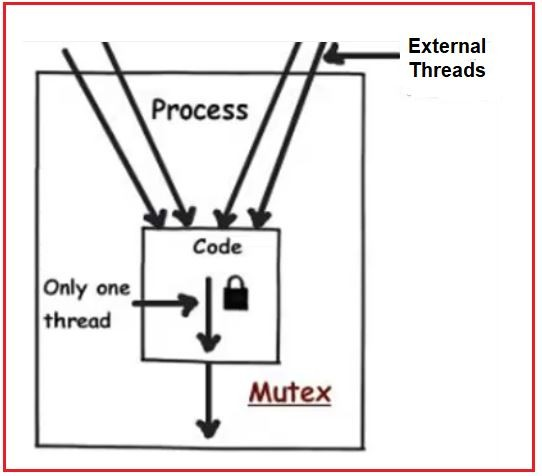
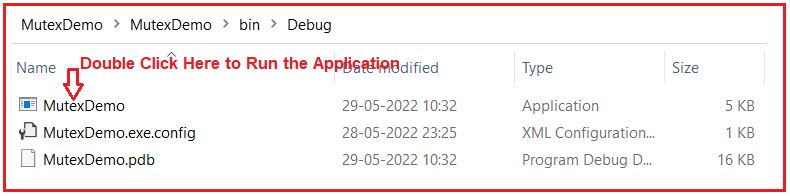
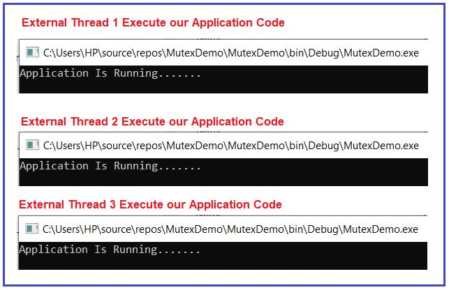
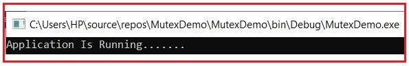
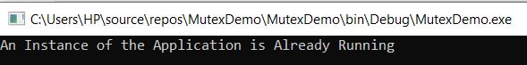
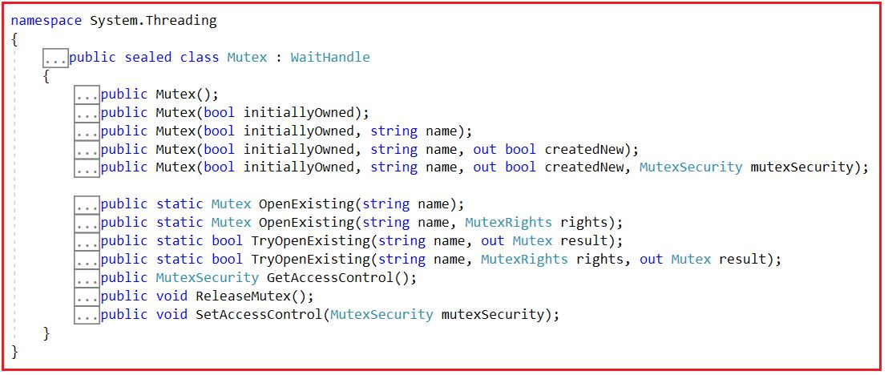
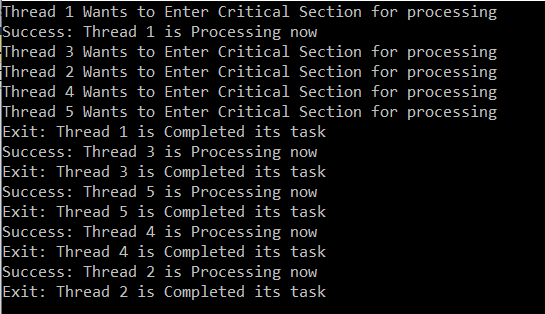
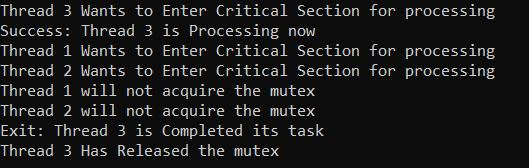
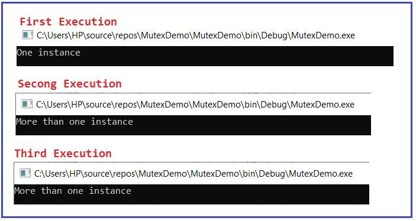

## **کلاس Mutex در سی شارپ به همراه مثال**

در این مقاله، قصد دارم در مورد **کلاس Mutex در سی شارپ** صحبت کنم ، یعنی نحوه استفاده از Mutex در سی شارپ برای محافظت از منابع مشترک در چندنخی به همراه مثال. لطفاً مقاله قبلی ما را که در آن نحوه محافظت از منابع مشترک در چندنخی با استفاده از کلاس Monitor در سی شارپ به همراه مثال را بررسی کردیم، مطالعه کنید.

##### **چرا Mutex؟ چون ما از قبل قفل و مانیتور را برای امنیت نخ‌ها داریم؟**

Mutex همچنین به ما کمک می‌کند تا از thread-safe بودن کد خود اطمینان حاصل کنیم. این بدان معناست که وقتی کد خود را در یک محیط چند رشته‌ای اجرا می‌کنیم، در نهایت با نتایج متناقضی مواجه نمی‌شویم. قفل‌ها و مانیتورها، ایمنی thread را برای threadهایی که InProcess هستند، یعنی threadهایی که توسط خود برنامه تولید می‌شوند، یعنی Internal Threads، تضمین می‌کنند. اما اگر threadها از OutProcess، یعنی از برنامه‌های خارجی، می‌آیند، قفل‌ها و مانیتورها هیچ کنترلی بر آنها ندارند. در حالی که Mutex ایمنی thread را برای threadهایی که Out-Process هستند، یعنی threadهایی که توسط برنامه‌های خارجی تولید می‌شوند، یعنی External Threads، تضمین می‌کند.



ابتدا بیایید بفهمیم فرآیند خارجی یا نخ‌های خارجی چیست و سپس Mutex را در C# درک خواهیم کرد. ابتدا یک برنامه کنسول ایجاد می‌کنیم و سپس کد زیر را در آن کپی و جایگذاری می‌کنیم.

```csharp
using System;

namespace MutexDemo
{
    class Program
    {
        static void Main(string[] args)
        {
            Console.WriteLine("Application Is Running.......");
            Console.ReadKey();
        }
    }
}
```

حالا پروژه را build کنید و به دایرکتوری bin\\Debug پروژه بروید. در آنجا فایل EXE برنامه را همانطور که در تصویر زیر نشان داده شده است، پیدا خواهید کرد.



وقتی روی فایل EXE برنامه دوبار کلیک می‌کنید، یک thread خارجی کد برنامه را اجرا می‌کند. و حالا اگر چندین بار دوبار کلیک کنید، هر بار یک thread خارجی جدید ایجاد می‌شود و کد برنامه ما را همانطور که در تصویر زیر نشان داده شده است، اجرا می‌کند. من سه بار روی EXE دوبار کلیک می‌کنم، بنابراین سه thread خارجی همزمان به برنامه ما دسترسی دارند.



اما اگر می‌خواهید دسترسی فقط نخ خارجی به کد برنامه خود را در هر نقطه زمانی مشخص محدود کنید، باید از Mutex در C# استفاده کنیم. حال، مثال قبلی را با استفاده از کلاس Mutex در C# بازنویسی می‌کنیم و می‌بینیم وقتی چندین بار سعی می‌کنیم با استفاده از External Threads از خارج به کد برنامه دسترسی پیدا کنیم، چه اتفاقی می‌افتد و سپس کلاس Mutex در C# را به تفصیل مورد بحث قرار خواهیم داد.

کد فایل کلاس Program.cs را به صورت زیر تغییر دهید. بنابراین، وقتی یک thread خارجی به کد ما دسترسی پیدا می‌کند، هیچ thread خارجی دیگری نمی‌تواند به کد دسترسی پیدا کند. مثال زیر دقیقاً همین کار را با استفاده از کلاس Mutex در C# انجام می‌دهد. این یکی از موارد استفاده Mutex در C# است. با کد ادامه ندهید، کد را بعداً در بخش بعدی این مقاله توضیح خواهم داد.

```csharp
using System;
using System.Threading;

namespace MutexDemo
{
    class Program
    {
        static void Main(string[] args)
        {
            using(Mutex mutex = new Mutex(false, "MutexDemo"))
            {
                //Checking if Other External Thread is Running
                if(!mutex.WaitOne(5000, false))
                {
                    Console.WriteLine("An Instance of the Application is Already Running");
                    Console.ReadKey();
                    return;
                }
                Console.WriteLine("Application Is Running.......");
                Console.ReadKey();
            }
        }
    }
}
```

حالا تمام نمونه‌های در حال اجرا را ببندید. سپس پروژه را build کنید و دوباره به دایرکتوری projects bin\\Debug بروید و دوباره برای اولین بار روی فایل Exe کلیک کنید. نتیجه زیر را خواهید گرفت.



حالا دوباره روی فایل EXE کلیک کنید. این بار ۵ ثانیه صبر می‌کند و سپس پیام زیر را به شما می‌دهد. این تضمین می‌کند که فقط یک thread خارجی می‌تواند در هر نقطه از زمان به کد برنامه ما دسترسی داشته باشد.



حالا، امیدوارم که نیاز به کلاس Mutex در سی شارپ را درک کرده باشید. بیایید بیشتر پیش برویم و سعی کنیم کلاس Mutex را در سی شارپ با مثال‌های متعدد درک کنیم.

##### **کلاس Mutex در سی شارپ چیست؟**

Mutex مانند یک قفل عمل می‌کند، یعنی یک قفل انحصاری روی یک منبع مشترک از دسترسی همزمان به دست می‌آورد، اما در چندین فرآیند کار می‌کند. همانطور که قبلاً بحث کردیم، قفل انحصاری اساساً برای اطمینان از این استفاده می‌شود که در هر نقطه زمانی معین، فقط یک نخ می‌تواند وارد بخش بحرانی شود.

وقتی دو یا چند نخ نیاز دارند که همزمان به یک منبع مشترک دسترسی داشته باشند، سیستم به یک مکانیزم همگام‌سازی نیاز دارد تا اطمینان حاصل شود که فقط یک نخ در یک زمان از آن منبع استفاده می‌کند. Mutex یک مکانیزم همگام‌سازی است که دسترسی انحصاری به منبع مشترک را فقط به یک نخ خارجی می‌دهد. اگر یک نخ mutex را به دست آورد، نخ دوم که می‌خواهد آن mutex را به دست آورد تا زمانی که نخ اول mutex را آزاد کند، به حالت تعلیق در می‌آید. اگر در حال حاضر این موضوع واضح نیست، نگران نباشید، ما سعی می‌کنیم این موضوع را با چند مثال درک کنیم.

##### **سازنده‌ها و متدهای کلاس Mutex در سی شارپ:**

بیایید با سازنده‌ها و متدهای مختلف کلاس Mutex در سی‌شارپ آشنا شویم. اگر روی کلاس Mutex کلیک راست کرده و گزینه go to definition را انتخاب کنید، تصویر زیر را خواهید دید. همانطور که می‌بینید، Mutex یک کلاس sealed است و از کلاس WaitHandle ارث‌بری شده است. از آنجایی که این یک کلاس sealed است، بنابراین هیچ ارث‌بری دیگری امکان‌پذیر نیست، یعنی هیچ کلاسی نمی‌تواند از این کلاس Mutex sealed در سی‌شارپ مشتق شود.



##### **سازنده‌های کلاس Mutex در سی شارپ:**

کلاس Mutex در سی شارپ پنج سازنده زیر را ارائه می‌دهد که می‌توانیم از آنها برای ایجاد یک نمونه از کلاس Mutex استفاده کنیم.

1. **Mutex() :** یک نمونه جدید از کلاس Mutex را با ویژگی‌های پیش‌فرض مقداردهی اولیه می‌کند.
2. **Mutex(bool initialOwned) :** یک نمونه جدید از کلاس Mutex را با یک مقدار بولی مقداردهی اولیه می‌کند که نشان می‌دهد آیا نخ فراخوانی‌کننده باید مالکیت اولیه mutex را داشته باشد یا خیر.
3. **Mutex(bool initialOwned, string name) :** یک نمونه جدید از کلاس System.Threading.Mutex را با یک مقدار بولی که نشان می‌دهد آیا نخ فراخواننده باید مالکیت اولیه mutex را داشته باشد یا خیر، و یک رشته که نام mutex است، مقداردهی اولیه می‌کند.
4. **Mutex(bool initialOwned, string name, out bool createdNew) :** این متد یک نمونه جدید از کلاس System.Threading.Mutex را با یک مقدار بولی که نشان می‌دهد آیا نخ فراخواننده باید مالکیت اولیه mutex را داشته باشد یا خیر، یک رشته که نام mutex است و یک مقدار بولی که وقتی متد برمی‌گرداند، نشان می‌دهد که آیا نخ فراخواننده مالکیت اولیه mutex را دریافت کرده است یا خیر، مقداردهی اولیه می‌کند.
5. **Mutex(bool initialOwned, string name, out bool createdNew, MutexSecurity mutexSecurity) :** این متد یک نمونه جدید از کلاس System.Threading.Mutex را با یک مقدار بولی که نشان می‌دهد آیا نخ فراخواننده باید مالکیت اولیه mutex را داشته باشد یا خیر، یک رشته که نام mutex است و یک متغیر بولی که هنگام بازگشت متد، نشان می‌دهد که آیا مالکیت اولیه mutex به نخ فراخواننده اعطا شده است یا خیر، و امنیت کنترل دسترسی که باید برای mutex نامگذاری شده اعمال شود، مقداردهی اولیه می‌کند.

پارامترهای مورد استفاده در سازنده‌های کلاس Mutex در سی شارپ به شرح زیر است.

1. **initialOwned** : برای دادن مالکیت اولیه به نخ فراخواننده‌ی mutex سیستم نام‌گذاری‌شده در صورتی که mutex سیستم نام‌گذاری‌شده در نتیجه‌ی این فراخوانی ایجاد شده باشد، مقدار true و در غیر این صورت مقدار false را برمی‌گرداند.
2. **name** : نام Mutex. اگر مقدار null باشد، Mutex بدون نام خواهد بود.
3. **createdNew** : وقتی این متد مقدار بازگشتی را برمی‌گرداند، شامل یک مقدار بولی است که اگر یک mutex محلی ایجاد شده باشد (یعنی اگر نام null یا یک رشته خالی باشد) یا اگر mutex سیستمی مشخص شده ایجاد شده باشد، مقدار true را برمی‌گرداند؛ و اگر mutex سیستمی مشخص شده از قبل وجود داشته باشد، مقدار false را برمی‌گرداند. این پارامتر بدون مقدار اولیه ارسال می‌شود.
4. **mutexSecurity** : یک شیء System.Security.AccessControl.MutexSecurity که نشان‌دهنده امنیت کنترل دسترسی است که باید روی mutex سیستم نامگذاری شده اعمال شود.

##### **متدهای کلاس Mutex در سی شارپ:**

کلاس Mutex در سی شارپ متدهای زیر را ارائه می‌دهد.

1. **OpenExisting(string name):** این متد برای باز کردن mutex با نام مشخص شده در صورت وجود، استفاده می‌شود. این متد یک شیء را برمی‌گرداند که نشان دهنده mutex سیستم با نام است. در اینجا، پارامتر name نام mutex سیستمی را که باید باز شود، مشخص می‌کند. اگر نام یک رشته خالی باشد، ArgumentException صادر می‌کند. -or-name بیش از ۲۶۰ کاراکتر باشد. اگر نام null باشد، ArgumentNullException صادر می‌کند.
2. **OpenExisting(string name, MutexRights rights):** این متد برای باز کردن mutex با نام مشخص شده، در صورت وجود، با دسترسی امنیتی مورد نظر استفاده می‌شود. این متد یک شیء را برمی‌گرداند که نشان دهنده mutex سیستم با نام است. در اینجا، پارامتر name نام mutex سیستمی را که باید باز شود، مشخص می‌کند. پارامتر rights ترکیبی بیتی از مقادیر شمارشی را مشخص می‌کند که نشان دهنده دسترسی امنیتی مورد نظر است.
3. **TryOpenExisting(string name, out Mutex result):** این متد برای باز کردن mutex با نام مشخص شده، در صورتی که از قبل وجود داشته باشد، استفاده می‌شود و مقداری را برمی‌گرداند که نشان می‌دهد آیا عملیات موفقیت‌آمیز بوده است یا خیر. در اینجا، پارامتر name نام mutex سیستمی را که باید باز شود، مشخص می‌کند. هنگامی که این متد برمی‌گرداند، نتیجه شامل یک شیء Mutex است که در صورت موفقیت‌آمیز بودن فراخوانی، mutex با نام را نشان می‌دهد، یا در صورت ناموفق بودن فراخوانی، null. این پارامتر به عنوان پارامتر مقداردهی اولیه نشده در نظر گرفته می‌شود. اگر mutex با نام با موفقیت باز شود، مقدار true و در غیر این صورت، مقدار false را برمی‌گرداند.
4. **TryOpenExisting(string name, MutexRights rights, out Mutex result):** این متد برای باز کردن mutex با نام مشخص شده، در صورتی که از قبل وجود داشته باشد، با دسترسی امنیتی مورد نظر استفاده می‌شود و مقداری را برمی‌گرداند که نشان می‌دهد آیا عملیات موفقیت‌آمیز بوده است یا خیر. در اینجا، پارامتر name نام mutex سیستمی را که باید باز شود، مشخص می‌کند. پارامتر rights ترکیبی بیتی از مقادیر شمارشی را مشخص می‌کند که نشان‌دهنده دسترسی امنیتی مورد نظر است. هنگامی که این متد برمی‌گرداند، نتیجه شامل یک شیء Mutex است که در صورت موفقیت‌آمیز بودن فراخوانی، mutex با نام را نشان می‌دهد، یا در صورت ناموفق بودن فراخوانی، null است. این پارامتر به عنوان پارامتر مقداردهی اولیه نشده در نظر گرفته می‌شود. اگر mutex با نام با موفقیت باز شود، مقدار true و در غیر این صورت، مقدار false را برمی‌گرداند.
5. **ReleaseMutex():** این متد برای یک بار آزاد کردن Mutex استفاده می‌شود.
6. **GetAccessControl():** این متد یک شیء System.Security.AccessControl.MutexSecurity دریافت می‌کند که نشان‌دهنده‌ی امنیت کنترل دسترسی برای mutex نام‌گذاری شده است. این متد یک شیء System.Security.AccessControl.MutexSecurity را برمی‌گرداند که نشان‌دهنده‌ی امنیت کنترل دسترسی برای mutex نام‌گذاری شده است.
7. **SetAccessControl(MutexSecurity mutexSecurity):** این متد برای تنظیم امنیت کنترل دسترسی برای یک mutex سیستمی نام‌گذاری‌شده استفاده می‌شود. پارامتر mutexSecurity یک شیء System.Security.AccessControl.MutexSecurity را مشخص می‌کند که نشان دهنده امنیت کنترل دسترسی است که باید برای mutex سیستمی نام‌گذاری‌شده اعمال شود.

**نکته:** کلاس **Mutex** به ارث رسیده است **در سی‌شارپ از کلاس WaitHandle** و **کلاس WaitHandle** را ارائه می‌دهد **متد WaitOne()** که برای قفل کردن منبع باید آن را فراخوانی کنیم. توجه داشته باشید که یک Mutex فقط می‌تواند از همان نخی که آن را دریافت کرده است، آزاد شود.

##### **مثالی برای درک Mutex در سی شارپ برای محافظت از منابع مشترک در چندنخی:**

مثال زیر نشان می‌دهد که چگونه از یک شیء Mutex محلی برای همگام‌سازی دسترسی به یک منبع محافظت‌شده استفاده می‌شود. از آنجا که هر نخ فراخوانی تا زمانی که مالکیت mutex را به دست نیاورد، مسدود می‌شود، باید متد ReleaseMutex را برای آزادسازی مالکیت mutex فراخوانی کند. کد به خودی خود توضیح داده شده است. بنابراین، لطفاً خطوط کامنت را مطالعه کنید.

```csharp
using System;
using System.Threading;

namespace MutexDemo
{
    class Program
    {
        private static Mutex mutex = new Mutex();

        static void Main(string[] args)
        {
            //Create multiple threads to understand Mutex
            for (int i = 1; i <= 5; i++)
            {
                Thread threadObject = new Thread(MutexDemo)
                {
                    Name = "Thread " + i
                };
                threadObject.Start();
            }
            Console.ReadKey();
        }

        //Method to implement syncronization using Mutex  
        static void MutexDemo()
        {
            Console.WriteLine(Thread.CurrentThread.Name + " Wants to Enter Critical Section for processing");
            try
            {
                //Blocks the current thread until the current WaitOne method receives a signal.  
                //Wait until it is safe to enter. 
                mutex.WaitOne();
                Console.WriteLine("Success: " + Thread.CurrentThread.Name + " is Processing now");
                Thread.Sleep(2000);
                Console.WriteLine("Exit: " + Thread.CurrentThread.Name + " is Completed its task");
            }
            finally
            {
                //Call the ReleaseMutex method to unblock so that other threads
                //that are trying to gain ownership of the mutex can enter  
                mutex.ReleaseMutex();
            }
        }
    }
}
```

###### **خروجی:**



**نکته:** کلاس Mutex از کلاس انتزاعی WaitHandle به ارث رسیده است و کلاس انتزاعی WaitHandle رابط IDisposable را پیاده‌سازی می‌کند. بنابراین، هنگامی که استفاده از نوع (در این مورد کلاس Mutex) را تمام کردید، باید آن را به صورت مستقیم یا غیرمستقیم دور بریزید. برای دور انداختن مستقیم نوع، متد Dispose آن را در یک بلوک try/catch/finally فراخوانی کنید، اگرچه می‌توانید آن را از destructor نیز فراخوانی کنید. برای دور انداختن غیرمستقیم آن، از یک ساختار زبانی مانند using block در C# استفاده کنید.

در مثال زیر، هر نخ (thread) متد WaitOne(Int32) را برای به دست آوردن mutex فراخوانی می‌کند. اگر فاصله زمانی انقضا سپری شود، متد مقدار false را برمی‌گرداند و نخ نه mutex را به دست می‌آورد و نه به منبع دسترسی پیدا می‌کند. متد ReleaseMutex فقط توسط نخی که mutex را به دست می‌آورد، فراخوانی می‌شود. در مثال زیر، ما متد Dispose را از مخرب (destructor) فراخوانی می‌کنیم.

```csharp
using System;
using System.Threading;

namespace MutexDemo
{
    class Program
    {
        private static Mutex mutex = new Mutex();

        static void Main(string[] args)
        {
            //Create multiple threads to understand Mutex
            for (int i = 1; i <= 3; i++)
            {
                Thread threadObject = new Thread(MutexDemo)
                {
                    Name = "Thread " + i
                };
                threadObject.Start();
            }
            Console.ReadKey();
        }

        //Method to implement syncronization using Mutex  
        static void MutexDemo()
        {
            // Wait until it is safe to enter, and do not enter if the request times out.
            Console.WriteLine(Thread.CurrentThread.Name + " Wants to Enter Critical Section for processing");
            if (mutex.WaitOne(1000))
            {
                try
                {
                    Console.WriteLine("Success: " + Thread.CurrentThread.Name + " is Processing now");

                    Thread.Sleep(2000);

                    Console.WriteLine("Exit: " + Thread.CurrentThread.Name + " is Completed its task");
                }
                finally
                {
                    //Call the ReleaseMutex method to unblock so that other threads
                    //that are trying to gain ownership of the mutex can enter  
                    mutex.ReleaseMutex();
                    Console.WriteLine(Thread.CurrentThread.Name + " Has Released the mutex");
                }
            }
            else
            {
                Console.WriteLine(Thread.CurrentThread.Name + " will not acquire the mutex");
            }
        }

        ~Program()
        {
            mutex.Dispose();
        }
    }
}
```

###### **خروجی:**



##### **مثال متد OpenExisting از کلاس Mutex در سی شارپ:**

در مثال زیر، ما از متد OpenExisting از کلاس Mutex در سی شارپ استفاده می‌کنیم. اگر این متد یک استثنا ایجاد کند، به این معنی است که Mutex مشخص شده وجود ندارد یا غیرقابل دسترسی است. متد IsSingleInstance از این رفتار استفاده می‌کند. ابتدا، یک برنامه کنسول ایجاد کنید و کد زیر را کپی و جایگذاری کنید.

```csharp
using System;
using System.Threading;

namespace MutexDemo
{
    class Program
    {
        static Mutex _mutex;
        
        static void Main()
        {
            //If IsSingleInstance returns true continue with the Program else Exit the Program
            if (!IsSingleInstance())
            {
                Console.WriteLine("More than one instance"); // Exit program.
            }
            else
            {
                Console.WriteLine("One instance"); // Continue with program.
            }
            // Stay Open.
            Console.ReadLine();
        }

        static bool IsSingleInstance()
        {
            try
            {
                // Try to open Existing Mutex.
                //If MyMutex is not opened, then it will throw an exception
                Mutex.OpenExisting("MyMutex");
            }
            catch
            {
                // If exception occurred, there is no such mutex.
                _mutex = new Mutex(true, "MyMutex");

                // Only one instance.
                return true;
            }

            // More than one instance.
            return false;
        }
    }
}
```

حالا، پروژه را build کنید و سپس به دایرکتوری projects bin\\Debug بروید و سه بار روی فایل Application EXE کلیک کنید. نتایج زیر را دریافت خواهید کرد.



**نکته:** Mutex فقط به یک thread خارجی اجازه دسترسی به کد برنامه ما را می‌دهد. اما اگر بخواهیم کنترل بیشتری روی تعداد threadهای خارجی که به کد برنامه ما دسترسی دارند داشته باشیم، باید از کلاس Semaphore در C# استفاده کنیم