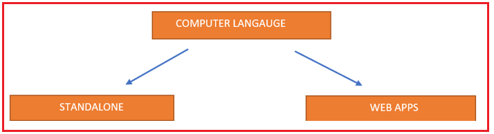
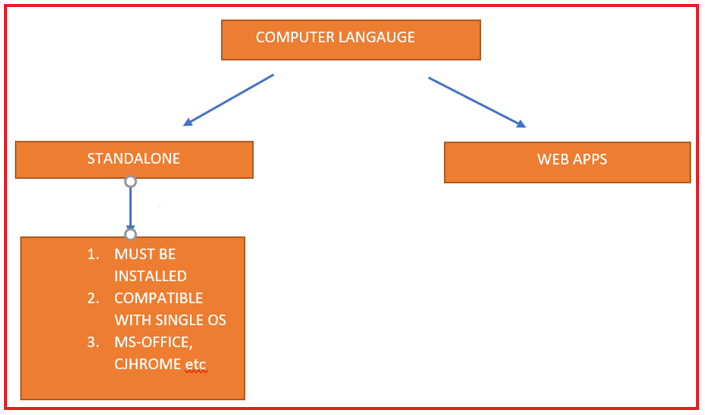
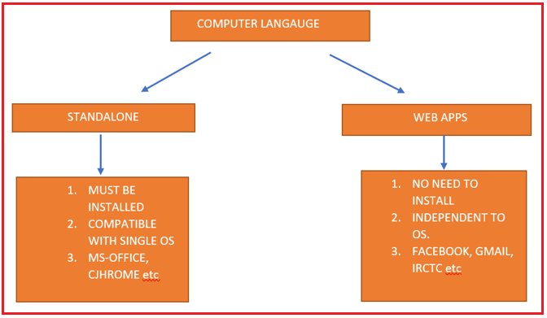
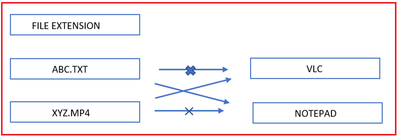
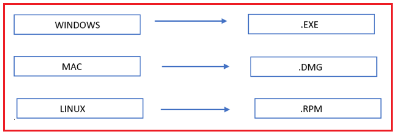
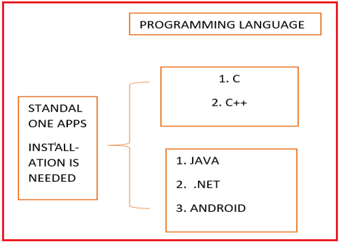
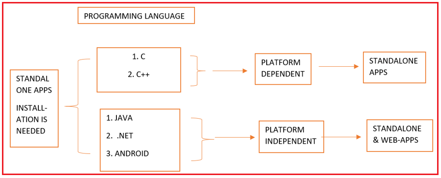

## **انواع مختلف کاربردها**

در این مقاله، قصد دارم در مورد **انواع مختلف برنامه‌هایی** که می‌توانیم با استفاده از یک زبان برنامه‌نویسی توسعه دهیم، بحث کنم. در پایان این مقاله، شما تا حد زیادی متوجه خواهید شد که برنامه‌های مستقل و برنامه‌های وب چیستند و تفاوت‌های بین آنها چیست.

##### **انواع مختلف کاربردها**

2 نوع برنامه کاربردی وجود دارد:

1. برنامه‌های مستقل
2. برنامه‌های کاربردی وب

##### **برنامه‌های مستقل چیستند؟**

برنامه‌ای که ما روی رایانه خود نصب می‌کنیم، یک برنامه مستقل نامیده می‌شود. برای کار با هر برنامه‌ای، اگر آن نرم‌افزار را روی رایانه خود نصب کنید، به آن برنامه مستقل گفته می‌شود. به عنوان مثال، اگر می‌خواهید برخی ویدیوها را پخش کنید، معمولاً از VLC Media PLAYER استفاده می‌کنیم. برای ایجاد اسناد یا ارائه پاورپوینت، معمولاً از MS Office استفاده می‌کنیم. برای مرور چیزی از اینترنت، از Mozilla Firefox یا Google Chrome استفاده می‌کنیم. همه اینها برنامه‌های مستقل هستند.

برنامه مستقل همیشه با یک سیستم عامل واحد سازگار است. ما باید مشخص کنیم که از کدام سیستم عامل استفاده می‌کنیم، که این مهم است. بنابراین، برنامه‌ای که همیشه به یک سیستم عامل وابسته است، برنامه مستقل نامیده می‌شود.

##### **برنامه‌های کاربردی وب چیستند؟**

بدون نصب هیچ نرم‌افزاری روی دستگاهمان، اگر با استفاده از یک مرورگر وب با نرم‌افزار کار کنیم، به آن برنامه وب گفته می‌شود. ما معمولاً از gmail.com، facebook.com، YouTube و google.com استفاده می‌کنیم، نیازی به نصب این برنامه‌ها روی دستگاه خود قبل از استفاده از آنها نداریم. این برنامه‌ها مستقل از سیستم عامل هستند، یعنی به یک سیستم عامل خاص وابسته نیستند. بنابراین، ما فقط به یک مرورگر وب مانند Google Chrome، Mozilla Firefox، Opera و غیره نیاز داریم.

##### **پسوند فایل‌ها:**

برنامه‌های مستقل مختلف، انواع مختلفی از پسوندهای فایل را درک می‌کنند. پسوند فایل Txt توسط برنامه notepad و پسوند فایل Mp4 توسط برنامه VLC Media Player قابل درک است.

##### **افزونه‌های سیستم عامل:**

مانند پسوند فایل‌ها، سیستم عامل نیز پسوندهایی دارد که به آنها پسوند سیستم عامل گفته می‌شود. برای مثال، اگر از سیستم عامل ویندوز استفاده می‌کنیم، سیستم عامل ویندوز فقط فایل‌های .exe را می‌شناسد.

اگر از سیستم عامل مک استفاده می‌کنید، پسوند فایل dot dmg است و اگر از سیستم عامل لینوکس استفاده می‌کنید، پسوند آن .rpm خواهد بود. بنابراین، سیستم عامل‌های مختلف انواع مختلفی از پسوندها را درک می‌کنند.

##### **زبان‌های برنامه‌نویسی، برنامه‌های مستقل هستند یا برنامه‌های تحت وب؟**

سوال این است که آیا زبان‌های برنامه‌نویسی، برنامه‌های مستقل هستند یا برنامه‌های وب. همه زبان‌های برنامه‌نویسی، برنامه‌های مستقل هستند. یعنی نصب برنامه روی دستگاه الزامی است.

##### **زبان وابسته به پلتفرم و مستقل از پلتفرم**

با استفاده از هر زبان وابسته به پلتفرم، ما فقط می‌توانیم برنامه‌های مستقل توسعه دهیم. بنابراین، با استفاده از زبان‌های C و C++، ما فقط می‌توانیم برنامه‌های مستقل توسعه دهیم. ما فقط می‌توانیم برنامه‌های مستقل توسعه دهیم زیرا این زبان‌ها زبان‌های وابسته به پلتفرم هستند. زبان‌های جاوا، C#، PHP و غیره زبان‌های مستقل از پلتفرم هستند، بنابراین با استفاده از زبان‌های مستقل از پلتفرم می‌توانیم هم برنامه‌های مستقل و هم برنامه‌های وب توسعه دهیم.

زبان C عمدتاً برای برنامه‌نویسی سیستم‌های نهفته استفاده می‌شود. بهترین کتابخانه بازی در C++ موجود است. زبان‌های جاوا و .NET برای توسعه برنامه‌های کاربردی در سطح سازمانی، مانند برنامه‌های کاربردی وب مانند بانک ICICI، IRCTC، فیس‌بوک و غیره استفاده می‌شوند.