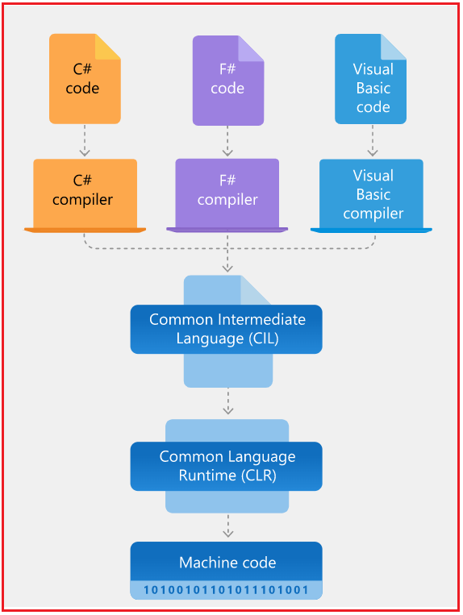

## **معماری و اجزای چارچوب دات نت**

در این مقاله، قصد دارم **به تفصیل در مورد معماری و اجزای چارچوب دات‌نت** بحث کنم . لطفاً مقاله قبلی ما را که در آن [**مقدمه‌ای کوتاه بر چارچوب دات‌نت**](https://dotnettutorials.net/lesson/introduction-to-dot-net-framework/) ارائه می‌دهیم، مطالعه کنید . در پایان این مقاله، شما خواهید فهمید که چارچوب دات‌نت، معماری چارچوب دات‌نت، اجزای دات‌نت و اصل طراحی چارچوب دات‌نت چیست.

##### **معماری چارچوب دات‌نت**

دو جزء اصلی چارچوب دات‌نت، زمان اجرای زبان مشترک و کتابخانه کلاس چارچوب دات‌نت هستند.

1. **CLR** : **زمان اجرای زبان مشترک (CLR)** موتور اجرایی است که برنامه‌های در حال اجرا را مدیریت می‌کند. این موتور خدماتی مانند مدیریت نخ (thread management)، جمع‌آوری زباله (garbage collection)، ایمنی نوع (type safety)، مدیریت استثنا (exception handling) و موارد دیگر را ارائه می‌دهد.
2. **BCL :** کتابخانه **پایه** **کلاس** مجموعه‌ای از APIها و انواع داده را برای عملکردهای رایج فراهم می‌کند. این کتابخانه انواع داده را برای رشته‌ها، تاریخ‌ها، اعداد و غیره فراهم می‌کند. کتابخانه کلاس شامل APIهایی برای خواندن و نوشتن فایل‌ها، اتصال به پایگاه‌های داده، ترسیم و موارد دیگر است.

برنامه‌های .NET با زبان‌های برنامه‌نویسی C#، F# یا VB نوشته می‌شوند. کد منبع به یک کد زبان میانی به نام **IL** یا **MSIL** یا **CIL** ذخیره می‌شود **(زبان میانی مشترک) کامپایل می‌شود. و کد کامپایل شده در اسمبلی‌هایی با پسوند فایل .DLL** یا **.EXE** .

وقتی یک برنامه اجرا می‌شود، **CLR** کد اسمبلی (کد IL یا کد MSIL یا CIL) را می‌گیرد و از **کامپایلر Just-in-Time (JIT)** برای تبدیل **کد MSIL یا IL** به کد ماشینی که بتواند روی معماری خاص رایانه‌ای که روی آن اجرا می‌شود، اجرا شود، استفاده می‌کند.

#### **سوالات متداول در مورد چارچوب دات نت:**

##### **چارچوب دات نت برای چه مواردی استفاده می‌شود؟**

چارچوب دات‌نت برای ایجاد و اجرای برنامه‌های نرم‌افزاری استفاده می‌شود. برنامه‌های دات‌نت می‌توانند با استفاده از پیاده‌سازی‌های مختلف دات‌نت **(چارچوب دات‌نت** ، **هسته دات‌نت یا دات‌نت** و **زامارین/مونو** ) روی بسیاری از سیستم عامل‌ها اجرا شوند. **چارچوب دات‌نت** برای اجرای برنامه‌های دات‌نت در ویندوز، **هسته دات‌نت یا دات‌نت** برای اجرای برنامه‌های دات‌نت در ویندوز، لینوکس و macOS استفاده می‌شود. و **زامارین/مونو** برای اجرای برنامه‌ها در تمام سیستم عامل‌های اصلی موبایل، از جمله iOS و اندروید، استفاده می‌شود.

##### **چه کسانی از چارچوب دات نت استفاده می‌کنند؟**

توسعه‌دهندگان نرم‌افزار و کاربران برنامه‌هایشان هر دو از چارچوب دات‌نت استفاده می‌کنند:

1. کاربران برنامه‌هایی که با چارچوب دات‌نت ساخته شده‌اند، باید چارچوب دات‌نت را نصب داشته باشند. در بیشتر موارد، چارچوب دات‌نت از قبل با ویندوز نصب شده است. در صورت نیاز، می‌توانید چارچوب دات‌نت را دانلود کنید.
2. توسعه‌دهندگان نرم‌افزار از چارچوب دات‌نت برای ساخت انواع مختلف برنامه‌ها مانند وب‌سایت‌ها، سرویس‌ها، برنامه‌های دسکتاپ و موارد دیگر با ویژوال استودیو استفاده می‌کنند. ویژوال استودیو یک محیط توسعه یکپارچه (IDE) است که ابزارهای بهره‌وری توسعه و قابلیت‌های اشکال‌زدایی را فراهم می‌کند.

##### **چرا به دات نت فریم ورک نیاز دارم؟**

برای اجرای برنامه‌هایی که با استفاده از .NET Framework در ویندوز ایجاد شده‌اند، باید .NET Framework روی دستگاه شما نصب باشد. این نرم‌افزار از قبل در بسیاری از نسخه‌های ویندوز وجود دارد. فقط در صورت درخواست، باید .NET Framework را دانلود و نصب کنید.

##### **چارچوب دات نت چگونه کار می‌کند؟**

برنامه‌های چارچوب .NET با استفاده از زبان‌های برنامه‌نویسی C#، F# یا VB توسعه داده می‌شوند و به **زبان میانی مشترک (CIL) یا MSIL (زبان میانی مایکروسافت) کامپایل می‌شوند.** زمان اجرای زبان مشترک (CLR) برنامه‌های .NET را روی یک ماشین مشخص اجرا می‌کند و کد CIL یا کد MSIL را به کد ماشینی تبدیل می‌کند که ماشین مربوطه بتواند آن را اجرا کند.

##### **اجزا/ویژگی‌های اصلی چارچوب دات‌نت چیست؟**

دو جزء اصلی چارچوب .NET عبارتند از **Common Language Runtime (CLR)** و **کتابخانه کلاس چارچوب .NET** . CLR موتور اجرایی است که برنامه‌های در حال اجرا را مدیریت می‌کند. کتابخانه کلاس پایه مجموعه‌ای از APIها و انواع را برای عملکردهای مشترک فراهم می‌کند.

##### **تفاوت بین دات نت و دات نت فریم ورک چیست؟**

.NET و .NET Framework بسیاری از اجزای یکسان را به اشتراک می‌گذارند و می‌توانید کد را بین این دو به اشتراک بگذارید. برخی از تفاوت‌های کلیدی بین آنها به شرح زیر است:

1. **.NET چندسکویی است** و روی لینوکس، macOS و سیستم عامل ویندوز اجرا می‌شود. **.NET Framework** فقط روی سیستم عامل ویندوز اجرا می‌شود.
2. **.NET** است **متن‌باز** و از جامعه‌ی توسعه‌دهندگان کمک می‌گیرد. کد منبع چارچوب .NET در دسترس است اما مستقیماً کمک نمی‌گیرد.
3. **چارچوب دات‌نت** در ویندوز گنجانده شده و به‌طور خودکار توسط Windows Update در سراسر دستگاه به‌روزرسانی می‌شود. دات‌نت به‌طور مستقل ارائه می‌شود.

##### **برنامه‌های توسعه‌یافته با استفاده از چارچوب دات‌نت**

انواع برنامه‌هایی که می‌توانند در چارچوب .Net ساخته شوند، به طور کلی به دسته‌های زیر طبقه‌بندی می‌شوند.

**WinForms -** این برای توسعه برنامه‌های مبتنی بر فرم‌ها استفاده می‌شود که بر روی یک دستگاه کاربر نهایی اجرا می‌شوند. Notepad نمونه‌ای از یک برنامه مبتنی بر کلاینت است. Windows Forms یک فناوری کلاینت هوشمند برای چارچوب .NET است، مجموعه‌ای از کتابخانه‌های مدیریت‌شده که وظایف رایج برنامه مانند خواندن و نوشتن در سیستم فایل را ساده می‌کنند.

**ASP.NET -** این زبان برای توسعه برنامه‌های مبتنی بر وب استفاده می‌شود که برای اجرا روی هر مرورگری مانند Edge، Chrome یا Firefox ساخته شده‌اند. ASP.NET یک چارچوب وب است که توسط مایکروسافت طراحی و توسعه داده شده است. از آن برای توسعه وب‌سایت‌ها، برنامه‌های وب و سرویس‌های وب استفاده می‌شود. این زبان، ادغام فوق‌العاده‌ای از HTML، CSS و JavaScript را فراهم می‌کند. این زبان برای اولین بار در ژانویه ۲۰۰۲ منتشر شد.

1. برنامه وب روی یک سرور پردازش می‌شود که سرویس‌های اطلاعات اینترنتی روی آن نصب شده است.
2. خدمات اطلاعات اینترنتی یا IIS یک جزء مایکروسافت است که برای اجرای یک برنامه ASP.NET استفاده می‌شود.
3. سپس نتیجه اجرا به دستگاه‌های کلاینت ارسال می‌شود و خروجی در مرورگر نمایش داده می‌شود.

**ADO.NET:** این فناوری برای توسعه برنامه‌های کاربردی جهت تعامل با پایگاه‌های داده مانند Oracle یا Microsoft SQL Server استفاده می‌شود. ADO.NET ماژولی از چارچوب .Net است که برای ایجاد ارتباط بین برنامه‌ها و منابع داده استفاده می‌شود. منابع داده می‌توانند مانند SQL Server و XML باشند. ADO .NET شامل کلاس‌هایی است که می‌توانند برای اتصال، بازیابی، درج و حذف داده‌ها استفاده شوند.

**WCF (بنیاد ارتباطات ویندوز):** این یک چارچوب برای ساخت برنامه‌های سرویس‌گرا است. با استفاده از WCF، می‌توانید داده‌ها را به صورت پیام‌های ناهمزمان از یک نقطه پایانی سرویس به نقطه پایانی سرویس دیگر ارسال کنید.

**LINQ (Language Integrated Query):** این یک زبان پرس‌وجو است که در چارچوب .NET 3.5 معرفی شده است. از آن برای ایجاد پرس‌وجو برای منابع داده با زبان‌های برنامه‌نویسی C# یا Visual Basics استفاده می‌شود.

**Entity Framework:** این یک چارچوب متن‌باز مبتنی بر ORM است که برای کار با پایگاه داده با استفاده از اشیاء .NET استفاده می‌شود. این چارچوب بسیاری از تلاش‌های توسعه‌دهندگان برای مدیریت پایگاه داده را از بین می‌برد. این فناوری، فناوری پیشنهادی مایکروسافت برای کار با پایگاه داده است.

**LINQ موازی:** LINQ موازی یا PLINQ یک پیاده‌سازی موازی از LINQ برای اشیاء است. این زبان، سادگی و خوانایی LINQ را با هم ترکیب می‌کند و قدرت برنامه‌نویسی موازی را فراهم می‌کند. این زبان می‌تواند با استفاده از تمام قابلیت‌های موجود کامپیوتر، سرعت اجرای کوئری LINQ را بهبود بخشیده و افزایش دهد.