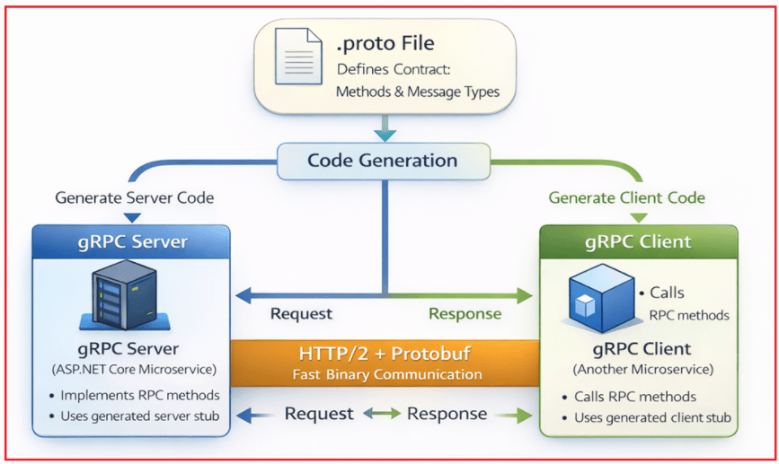

## **gRPC در میکروسرویس‌های ASP.NET Core Web API**

در این پست، در مورد gRPC در ASP.NET Core Web API بحث خواهم کرد. در دنیای ابری امروزی، اکثر سیستم‌های مدرن با استفاده از **معماری میکروسرویس‌ها** ساخته می‌شوند، که در آن یک برنامه بزرگ به بسیاری از سرویس‌های کوچک مانند سفارش، پرداخت، محصول و اعلان تقسیم می‌شود. این امر توسعه را سریع‌تر و مقیاس‌پذیری را آسان‌تر می‌کند، اما همچنین یک چالش جدید ایجاد می‌کند:

- **میکروسرویس‌ها باید دائماً با یکدیگر ارتباط برقرار کنند و این ارتباط باید سریع و قابل اعتماد باشد.**

بسیاری از تیم‌ها با APIهای REST شروع می‌کنند زیرا REST ساده و به طور گسترده قابل فهم است. با این حال، با افزایش تعداد سرویس‌ها و افزایش میزان ترافیک داخلی، REST می‌تواند محدودیت‌هایی را نشان دهد، به خصوص زمانی که به موارد زیر نیاز دارید:

- **تأخیر کم:** درخواست‌ها خیلی سریع پردازش و بازگردانده می‌شوند، بنابراین سرویس‌ها با حداقل تأخیر ارتباط برقرار می‌کنند.
- **توان عملیاتی بالا:** سیستم می‌تواند تعداد زیادی درخواست در ثانیه را بدون کاهش سرعت پردازش کند.
- **حجم کم داده‌ها:** داده‌ها در قالبی فشرده ارسال می‌شوند که باعث کاهش استفاده از پهنای باند و افزایش سرعت انتقال می‌شود.
- **قراردادهای Strongly-Typed:** کلاینت و سرور از یک روش دقیق و تعاریف داده پیروی می‌کنند که باعث کاهش خطاهای ادغام می‌شود.
- **پخش زنده:** کلاینت و سرور می‌توانند به طور مداوم داده‌ها را از طریق یک اتصال واحد برای به‌روزرسانی‌های زنده ارسال و دریافت کنند.

اینجاست که **gRPC** ارزشمند می‌شود. gRPC قرار نیست در همه جا جایگزین REST شود. در عوض، یک **رویکرد ارتباطی تخصصی** **و با کارایی بالا است که در درجه اول برای تماس‌های سرویس به سرویس در** **میکروسرویس‌ها** طراحی شده است. این به تماس‌های داخلی کمک می‌کند تا سریع‌تر، کارآمدتر و با خطاهای کمتری اجرا شوند زیرا هر دو طرف یک قرارداد سختگیرانه دارند.

در این جلسه، شما یاد خواهید گرفت:

- gRPC چیست؟
- چرا وجود دارد؟
- نحوه عملکرد داخلی آن (قرارداد → تولید کد → ارتباط کلاینت/سرور)

## **gRPC در ASP.NET Core چیست؟**

**gRPC (Google Remote Procedure Call)** یک چارچوب ارتباطی با کارایی بالا است که به یک سرویس اجازه می‌دهد سرویس دیگری را طوری فراخوانی کند **که انگار یک متد محلی را فراخوانی می‌کند**، حتی اگر این فراخوانی از طریق شبکه انجام شود.

به جای ایجاد ارتباط پیرامون:

- آدرس‌های اینترنتی (URL)
- کنترل‌کننده‌ها
- بارهای داده JSON
- نقاط پایانی REST

gRPC حول محور موارد زیر ساخته شده است:

- **روش‌ها**
- **پیام‌های درخواست/پاسخ**
- **یک قرارداد مشترک (.proto)**

بنابراین به جای اینکه بگوییم:

- این URL را فراخوانی کرده و JSON ارسال کنید…

gRPC می‌گوید:

- این متد را فراخوانی کنید و این شیء درخواست با نوع داده Strongly-typed را ارسال کنید.

بنابراین، از دیدگاه یک توسعه‌دهنده:

- ما به آن روش می‌گوییم
- یک شیء درخواست با نوع‌بندی قوی ارسال کنید.
- یک شیء پاسخ با نوع‌بندی قوی دریافت کنید

تمام جزئیات شبکه، سریال‌سازی و انتقال به طور خودکار توسط چارچوب gRPC مدیریت می‌شوند.

## **چرا gRPC در میکروسرویس‌های ASP.NET Core استفاده می‌شود؟**

در میکروسرویس‌ها، سرویس‌ها دائماً در حال ارتباط هستند:

- خدمات سفارش → خدمات پرداخت
- سفارش خدمات → خدمات محصول
- سرویس کاربر → سرویس اعلان

حالا تصور کنید که یک درخواست کاربر، **۱۰ تا ۲۰ فراخوانی داخلی** را فعال کند. اگر هر فراخوانی کند یا سنگین باشد، کل برنامه کند می‌شود، حتی اگر هر میکروسرویس کاملاً نوشته شده باشد.

بنابراین، سوال اصلی این می‌شود: **چگونه می‌توانیم تماس‌های داخلی بین سرویس‌ها را سریع‌تر، کوچک‌تر و ایمن‌تر انجام دهیم؟**

**گزینه‌های رایج ارتباط داخلی در میکروسرویس‌ها**

- **REST روی HTTP/1.1 + JSON** ( **همزمان** )
- **کارگزاران پیام (Kafka/RabbitMQ)** (ناهمزمان، مبتنی بر رویداد)
- **gRPC روی HTTP/2 + Protobuf** (همزمان + استریم)

#### **REST روی HTTP/1.1 + JSON (خوب، اما برای فراخوانی‌های داخلی سنگین است)**

REST برای انسان قابل استفاده است و تست آن آسان است، اما برای تماس‌های داخلی با فرکانس بالا، می‌تواند پرهزینه باشد زیرا:

- بارهای داده JSON **بزرگتر هستند**
- تجزیه JSON **کندتر است**
- REST عمدتاً به الگوهای HTTP/1.1 متکی است، که وقتی بسیاری از تماس‌ها به طور همزمان اتفاق می‌افتند، می‌تواند کارایی کمتری داشته باشد.
- قراردادهای API اغلب مبتنی بر مستندات هستند که می‌تواند باعث ایجاد عدم تطابق بین کلاینت و سرور شود.

بنابراین، REST برای APIهای عمومی عالی است، اما در داخل میکروسرویس‌ها، با افزایش ترافیک، ممکن است کارایی کمتری داشته باشد.

#### **کارگزاران پیام (Kafka/RabbitMQ) (برای async عالی هستند، نه برای فراخوانی‌های پرس‌وجوی مستقیم)**

کارگزاران پیام زمانی ایده‌آل هستند که:

- شما ارتباط ناهمزمان می‌خواهید
- شما سیستم‌های رویدادمحور می‌خواهید
- شما به پاسخ‌های فوری نیاز ندارید

مثال: رویداد OrderPlaced منتشر شد → سرویس اعلان بعداً آن را مصرف می‌کند.

اما کارگزاران پیام **ایده‌آل نیستند:** برای درخواست‌ها/پاسخ‌های ساده مانند موارد زیر

- آیا در حال حاضر محصول X موجود است؟
- هزینه ارسال را محاسبه کنید و نتیجه را فوراً ارسال کنید.

برای این تماس‌های مستقیم، به ارتباط همزمان سریع نیاز داریم.

#### **gRPC روی HTTP/2 + Protobuf (دقیقاً برای فراخوانی‌های سرویس داخلی ساخته شده است)**

gRPC برای حل مشکل ارتباطات داخلی طراحی شده است:

- **HTTP/2** به عنوان انتقال (سریع، مالتی پلکس)
- **پروتوباف** به عنوان قالب پیام (باینری کوچک)
- **قراردادهای قوی تایپ‌شده** (عدم تطابق کمتر، اشکالات کمتر)
- **پشتیبانی از پخش جریانی** (عالی برای سناریوهای بلادرنگ)

بنابراین، در یک سیستم میکروسرویس .NET Core، gRPC به یک لایه RPC داخلی با کارایی بالا تبدیل می‌شود، به خصوص بین سرویس‌های backend که در آنها نیازی به payloadهای قابل خواندن توسط انسان نداریم.

## **gRPC در مقابل REST در میکروسرویس‌های ASP.NET Core**

REST و gRPC را به عنوان **دو ابزار متفاوت** در نظر بگیرید که هر دو در جای مناسب خود مفید هستند.

##### **REST زمانی ایده‌آل است که:**

- شما در حال ساخت **API های عمومی هستید**
- شما **به سازگاری مرورگر نیاز دارید**
- انسان‌ها ممکن است با API (ابزارهای توسعه‌دهنده، Postman) تعامل داشته باشند.
- شما در حال مدل‌سازی منابع هستید (عملیات CRUD)
- ادغام ساده‌تر با سیستم‌های شخص ثالث مورد نیاز است

##### **نقاط قوت REST:**

- پشتیبانی جهانی
- اشکال‌زدایی آسان
- JSON قابل خواندن توسط انسان
- همه جا کار می‌کند (وب، موبایل، کلاینت‌های خارجی)

##### **gRPC زمانی ایده‌آل است که:**

- سرویس‌ها در داخل صحبت می‌کنند
- می‌خواهید **شما حداکثر عملکرد را**
- می‌خواهید **شما قراردادهای سختگیرانه**
- شما **به استریمینگ نیاز دارید**
- شما بارهای سبک وزن می‌خواهید
- شما به ارتباطات مبتنی بر متد با نوع‌بندی قوی نیاز دارید

##### **نقاط قوت gRPC:**

- ده برابر حجم کمتر (به لطف Protobuf)
- تأخیر بسیار کم
- قراردادهای تدوین‌شده خطاها را کاهش می‌دهند
- پخش مالتی‌پلکس روی HTTP/2
- به طور خاص برای میکروسرویس‌ها طراحی شده است

##### **کاری که اکثر سیستم‌های دنیای واقعی انجام می‌دهند**

بیشتر معماری‌های بالغ از هر دو استفاده می‌کنند:

- **REST/GraphQL در لبه** : (کلاینت ↔ گیت‌وی) زیرا سازگاری گسترده‌ای دارد
- **gRPC داخلی** : (gateway ↔ microservices/service ↔ service) زیرا سریع و ایمن در برابر قرارداد است

این رویکرد بهترین‌های هر دو جهان را ارائه می‌دهد: سازگاری در بیرون، عملکرد در داخل. این مدل ترکیبی توسط موارد زیر استفاده می‌شود:

- گوگل
- نتفلیکس
- آمازون
- مایکروسافت
- اوبر

## **معماری gRPC در ASP.NET Core**

gRPC در .NET Core از **رویکرد Contract-First** پیروی می‌کند. این بدان معناست که ما ابتدا قرارداد ( **فایل .proto** ) را می‌نویسیم و از آن قرارداد، فریم‌ورک موارد زیر را تولید می‌کند:

- کد سرور با تایپ قوی **(Server Stub)**
- با تایپ قوی (خرد مشتری) **کد مشتری**

این stub های تولید شده با استفاده از موارد زیر ارتباط برقرار می کنند:

- **بافرهای پروتکل (Protobuf)** → پیام‌های دودویی فشرده.
- **HTTP/2** → انتقال سریع شبکه با مالتی‌پلکسینگ و استریمینگ.
- **استاب‌های تولید شده برای کلاینت/سرور** → متدهای RPC با نوع قوی. منظور فراخوانی متدهای با نوع قوی است، مانند فراخوانی متدهای محلی.

برخلاف REST (که در آن ما به صورت دستی کنترلرها را ایجاد می‌کنیم، URLها را می‌سازیم، JSON ارسال می‌کنیم، تجزیه درخواست را مدیریت می‌کنیم و خطاها را نگاشت می‌کنیم)، gRPC بیشتر این مراحل دستی را **پشت کد تولید شده و یک موتور زمان اجرا** پنهان می‌کند. برای درک بهتر، لطفاً به نمودار زیر نگاهی بیندازید.



در زیر توضیح مفصلی از هر مؤلفه معماری و نحوه عملکرد آنها با هم به عنوان یک خط لوله ارائه شده است.

#### **۱. فایل Protocol Buffers (.proto) – قرارداد و منبع حقیقت**

فایل .proto **بلوک سازنده‌ی اصلی** gRPC است. می‌توانید آن را به صورت زیر در نظر بگیرید:

- یک **طرح اولیه.**
- یک **توافق‌نامه ارتباطی بین دو میکروسرویس.**
- یک **رابط کاربری مشترک (از نظر فنی).**
- یا، مانند یک **جدول زمانی کلاس،** هم معلم و هم دانش‌آموز باید از آن پیروی کنند (از دیدگاه افراد غیرمتخصص).

این به هر دو میکروسرویس می‌گوید:

- **چه متدهایی وجود دارد؟** مثال: GetOrder، MakePayment، CheckInventory
- **چه داده‌هایی ارسال خواهد شد؟** مثال: درخواست سفارش، اطلاعات کاربری، جزئیات پرداخت
- **چه داده‌هایی برگردانده خواهد شد؟** مثال: OrderResponse، PaymentResponse، UserResponse

به عبارت ساده، **هر دو میکروسرویس از دستورالعمل‌های یکسانی پیروی می‌کنند، بنابراین هرگز دچار سوءتفاهم نمی‌شوند.**

##### **چرا این مهم است؟**

- از عدم تطابق در نام متدها جلوگیری می‌کند
- از عدم تطابق در شکل داده‌ها جلوگیری می‌کند
- هر دو طرف همیشه با هم هماهنگ می‌مانند
- کد به طور خودکار از این فایل تولید می‌شود
- یک الگوی ارتباطی تمیز، مستند و قابل پیش‌بینی را تشویق می‌کند

از دیدگاه یک فرد غیرمتخصص، فایل Protocol Buffers (.proto) مانند یک جدول زمانی کلاس درس است. هم معلم و هم دانش‌آموزان برای جلوگیری از سردرگمی، از یک برنامه‌ی زمانی یکسان پیروی می‌کنند. به همین سادگی، اما بسیار قدرتمند است.

##### **چه کسی فایل .proto را تعریف می‌کند؟**

- شما (توسعه‌دهنده) فایل .proto را تعریف می‌کنید.
- معمولاً توسط **تیمی که مالک سرویس است** ایجاد می‌شود (مثال: تیم OrderService).
- سایر میکروسرویس‌ها آن را مصرف می‌کنند.

##### **فایل .proto کجا قرار دارد؟**

می‌توانید آن را در موارد زیر قرار دهید:

1. **درون پروژه میکروسرویس سرور**
2. **درون یک پروژه Shared Contracts/Proto** (برای میکروسرویس‌ها توصیه می‌شود)

#### **۲. تولید کد gRPC - ایجاد Server Stubها و Client Proxyها**

پس از ایجاد فایل Protocol Buffers (.proto)، دیگر نیازی به نوشتن دستی کنترلرها یا کلاینت‌ها نداریم. **.NET Core به طور خودکار کد را برای ما تولید می‌کند.**

##### **تولید کد سمت سرور**

این چارچوب تولید می‌کند:

- یک **کلاس پایه** برای سرویس شما
- امضاهای متد برای هر RPC
- منطق سریال‌سازی/غیر سریال‌سازی
- کد مدیریت ارتباطات

شما فقط این متدها را برای نوشتن **منطق کسب و کار** خود override می‌کنید.

##### **مثال:**

```csharp
public override Task<OrderResponse> GetOrder(OrderRequest request)
{
    // Your business logic
}
```

##### **کد سرور کجا تولید می‌شود؟**

درون **پروژه میکروسرویس سرور** شما، معمولاً در مسیر زیر: /obj/Debug/netX.0/Protos/

##### **تولید کد سمت کلاینت**

.NET همچنین موارد زیر را تولید می‌کند:

- یک **کلاس کلاینت با نوع‌بندی قوی**
- روش‌هایی که دقیقاً با روش‌های RPC سرور مطابقت دارند

این یعنی شما نگران این موارد نباشید:

- آدرس‌های اینترنتی (URL)
- کلاینت HTTP
- جی‌سون
- عدم تطابق مدل‌ها
- سریال‌سازی

مثالی از فراخوانی یک متد ریموت: **var response = await client.GetOrderAsync(request);**

##### **کد کلاینت کجا تولید می‌شود؟**

درون **پروژه میکروسرویس کلاینت** (پروژه‌ای که از API سرور استفاده می‌کند)، معمولاً در مسیر زیر: **/obj/Debug/netX.0/Protos/**

**از دیدگاه یک فرد غیرحرفه‌ای،** استفاده از gRPC مانند استفاده از کنترل تلویزیون است. کنترل دارای دکمه‌هایی است و فشار دادن یک دکمه، متدی را در تلویزیون شما فراخوانی می‌کند. لازم نیست در مورد نحوه انتقال سیگنال فکر کنید.

#### **۳. سرور gRPC در ASP.NET Core**

این فقط یک میکروسرویس معمولی ASP.NET Core است که به جای کنترلرها برای gRPC پیکربندی شده است.

##### **کاری که سرور انجام می‌دهد**

- به تماس‌های ورودی gRPC گوش می‌دهد.
- پیام‌های دودویی Protobuf را می‌پذیرد
- آنها را به اشیاء C# تبدیل می‌کند.
- منطق کسب و کار شما را اجرا می‌کند
- پاسخ را دوباره به دودویی تبدیل می‌کند
- آن را از طریق HTTP/2 برای کلاینت ارسال می‌کند.

از دیدگاه یک فرد غیرمتخصص، سرور gRPC مانند معلم واقعی در یک کلاس درس است. دانش‌آموزان (کلاینت‌ها) سؤال می‌پرسند. معلم گوش می‌دهد، می‌فهمد، فکر می‌کند و با پاسخ‌ها پاسخ می‌دهد.

#### **۴. کلاینت gRPC در میکروسرویس‌ها**

برخلاف REST، توسعه‌دهندگان به صورت دستی URLها را نمی‌سازند یا درخواست‌های HTTP ارسال نمی‌کنند. میکروسرویس کلاینت از **کد سمت کلاینت تولید شده** برای فراخوانی متدهای gRPC از راه دور استفاده می‌کند. کلاینت gRPC:

- یک اتصال HTTP/2 را باز می‌کند
- فراخوانی متد شما را به یک پیام Protobuf تبدیل می‌کند.
- آن را به سرور ارسال می‌کند
- منتظر پاسخ است
- پاسخ را به یک شیء C# تبدیل می‌کند.

برای توسعه‌دهنده، فراخوانی یک سرویس از راه دور مانند فراخوانی یک **متد محلی** است.

**مثال:** `var result = await client.MakePaymentAsync(request);`

**مزایای کلیدی**

- بدون آدرس اینترنتی (URL).
- بدون JSON.
- کد سریال سازی ندارد.
- بدون اشتباه در مسیریابی.
- تایپ قوی
- سریع‌تر و امن‌تر از REST

از دیدگاه افراد غیر متخصص: وقتی شما یک متد gRPC را فراخوانی می‌کنید، انگار دارید با کسی که کنارتان ایستاده صحبت می‌کنید، حتی اگر خیلی دور باشد.

#### **۵. لایه انتقال HTTP/2 - بزرگراه پرسرعت gRPC**

REST از HTTP/1.1 استفاده می‌کند که قدیمی‌تر و مبتنی بر متن است. gRPC از **HTTP/2** استفاده می‌کند که ویژگی‌های کلیدی زیر را به همراه دارد:

- **مالتی‌پلکسینگ**: تماس‌های متعدد از طریق یک اتصال واحد. سربار ایجاد اتصال را کاهش می‌دهد.
- **پیام‌های دودویی**: کوچک‌تر و بسیار سریع‌تر از JSON.
- **فشرده‌سازی هدر**: بار شبکه را کاهش می‌دهد.
- **جریان دو طرفه**: کلاینت و سرور می‌توانند به طور مداوم داده‌ها را به یکدیگر ارسال کنند.

این ویژگی‌ها در مجموع gRPC را بسیار سریع و کارآمد می‌کنند.

از دیدگاه یک فرد غیرمتخصص، HTTP/1.1 مانند یک جاده تک بانده است. فقط یک ماشین می‌تواند در یک زمان حرکت کند. HTTP/2 مانند یک بزرگراه سریع‌السیر 10 بانده است؛ بسیاری از ماشین‌ها می‌توانند همزمان حرکت کنند.

#### **۶. gRPC Runtime — موتور داخلی**

این موتور درون gRPC است که توسعه‌دهندگان به ندرت آن را می‌بینند اما هر ثانیه به آن متکی هستند.

**آنچه که زمان اجرا به صورت داخلی مدیریت می‌کند**

- اتصال باز/بسته
- استفاده مجدد از اتصالات (pooling)
- مدیریت تلاش‌های مجدد
- مهلت‌ها (مهلت‌ها)
- سریال‌سازی/غیر سریال‌سازی پروتوباف
- درخواست‌های مسیریابی
- اعتبارسنجی متادیتا (هدرها)
- اجرای رهگیرها (مشابه میان‌افزار)

به همین دلیل است که gRPC بسیار قابل اعتماد است.

از دیدگاه یک فرد غیرحرفه‌ای، شما موتور ماشین را نمی‌بینید، اما بدون آن، ماشین حرکت نخواهد کرد. به طور مشابه، زمان اجرای gRPC همه چیز را در پشت صحنه به طور روان حرکت می‌دهد.

##### **کنار هم قرار دادن همه چیز - خلاصه ساده**

کل مراحل کار به زبان مبتدی در اینجا آمده است:

1. **نوشتن یک فایل .proto** \- تعریف متدها و انواع پیام‌ها
2. **دات‌نت به‌طور خودکار کد سرور و کلاینت را تولید می‌کند**
3. **سرور منطق کسب و کار را در کلاس پایه تولید شده پیاده سازی می کند.**
4. **کلاینت متدهای RPC را طوری فراخوانی می‌کند که انگار متدهای محلی هستند.**
5. **HTTP/2 پیام‌ها را به طور مؤثر حمل می‌کند**
6. **زمان اجرای gRPC همه چیز را در پس‌زمینه مدیریت می‌کند**

اکنون میکروسرویس‌های شما سریع‌تر، ایمن‌تر و کارآمدتر از REST سنتی ارتباط برقرار می‌کنند.

#### **انواع ارتباطات gRPC**

یکی از نقاط قوت کلیدی gRPC این است که از **الگوهای ارتباطی چندگانه** تعریف می‌شوند **پشتیبانی می‌کند، نه فقط درخواست-پاسخ ساده مانند REST. این انواع ارتباط مستقیماً در فایل .proto** و آنها را به بخشی از قرارداد سرویس تبدیل می‌کنند. gRPC **از چهار نوع ارتباط** پشتیبانی می‌کند که هر کدام برای سناریوهای مختلف میکروسرویس طراحی شده‌اند.

##### **۱. RPC یگانه (درخواست-پاسخ)**

این **رایج‌ترین و ساده‌ترین** نوع ارتباط در gRPC است.

###### **چگونه کار می‌کند؟**

- کلاینت **یک درخواست ارسال می‌کند**
- سرور **یک پاسخ برمی‌گرداند**
- اتصال پس از پاسخ بسته می‌شود

###### **مقایسه با REST**

- بسیار شبیه به فراخوانی REST API
- اما سریع‌تر و با تایپ قوی‌تر

###### **موارد استفاده معمول**

- دریافت جزئیات سفارش
- ایجاد پرداخت
- بررسی موجودی محصول

**این انتخاب پیش‌فرض برای اکثر تماس‌های سرویس به سرویس است.**

##### **۲. RPC استریمینگ سرور**

در استریمینگ سرور، کلاینت **یک درخواست واحد** ارسال می‌کند و سرور **در طول زمان چندین پاسخ** ارسال می‌کند.

###### **چگونه کار می‌کند؟**

- کلاینت یک درخواست واحد ارسال می‌کند
- سرور به ارسال جریانی از پاسخ‌ها ادامه می‌دهد
- مشتری پاسخ‌ها را به محض رسیدن می‌خواند

###### **موارد استفاده معمول**

- ارسال به‌روزرسانی‌های وضعیت سفارش به صورت زنده
- گزارش‌ها یا اعلان‌های پخش جریانی
- داده‌های نظارتی بلادرنگ

زمانی مفید است که سرور **داده‌های پیوسته یا افزایشی** برای ارسال داشته باشد.

##### **۳. RPC استریمینگ کلاینت**

در جریان‌سازی کلاینت، کلاینت **چندین درخواست** ارسال می‌کند و سرور **یک بار پاسخ می‌دهد.** پس از دریافت تمام داده‌ها،

###### **چگونه کار می‌کند؟**

- کلاینت یک استریم باز می‌کند
- مشتری چندین پیام ارسال می‌کند
- سرور تمام پیام‌ها را پردازش می‌کند
- سرور یک پاسخ نهایی ارسال می‌کند

###### **موارد استفاده معمول**

- بارگذاری مجموعه داده‌های بزرگ
- ارسال داده‌های انبوه

زمانی مفید است که کلاینت **داده‌های زیادی** تولید می‌کند و سرور نیاز دارد که آنها را با هم پردازش کند.

##### **۴. RPC استریمینگ دوطرفه**

استریمینگ دوطرفه **قدرتمندترین نوع ارتباط** در gRPC است.

###### **چگونه کار می‌کند؟**

- هم جریان‌های باز کلاینت و هم سرور
- هر دو می‌توانند پیام‌ها را **به طور مستقل و مداوم ارسال کنند**
- ارتباط کاملاً ناهمزمان است

###### **موارد استفاده معمول**

- سیستم‌های چت
- به‌روزرسانی‌های معاملات یا قیمت‌گذاری در لحظه
- داشبوردهای زنده
- برنامه‌های کاربردی مشارکتی

این امر امکان **ارتباط واقعی و بلادرنگ** بین میکروسرویس‌ها را فراهم می‌کند.

##### **خلاصه‌ای از انواع ارتباطات gRPC**

- **RPC یکپارچه** → یک درخواست، یک پاسخ (شبیه REST)
- **پخش جریانی سرور** → یک درخواست، چندین پاسخ
- **جریان‌سازی کلاینت** → درخواست‌های زیاد، یک پاسخ
- **جریان دوطرفه** → درخواست‌های زیاد، پاسخ‌های زیاد (به‌صورت آنی)

##### **مزایای gRPC در میکروسرویس‌های ASP.NET Core:**

- **تأخیر کم:** gRPC با استفاده از سریال‌سازی دودویی و ویژگی‌های انتقال کارآمد HTTP/2، زمان صرف شده بین ارسال درخواست و دریافت پاسخ را کاهش می‌دهد.
- **توان عملیاتی بالا:** gRPC به لطف فرمت باینری فشرده و اتصالات مالتی پلکس شده خود، که سربار شبکه و CPU را به حداقل می‌رساند، می‌تواند تعداد زیادی درخواست در ثانیه را مدیریت کند.
- **حجم کم بار داده:** بافرهای پروتکل، داده‌ها را به صورت دودویی بسیار فشرده سریالی می‌کنند و اندازه پیام‌ها را بسیار کوچک‌تر از JSON نگه می‌دارند و استفاده از پهنای باند را کاهش می‌دهند.
- **قراردادهای Strongly-Typed:** فایل .proto ساختارهای درخواست و پاسخ دقیقی را اعمال می‌کند و تضمین می‌کند که هم کلاینت و هم سرور در زمان کامپایل از امضاهای متد و انواع داده یکسانی استفاده کنند.
- **پخش همزمان (Real-Time Streaming):** gRPC از پخش همزمان کلاینت، سرور و دو طرفه پشتیبانی می‌کند و تبادل مداوم و همزمان داده‌ها را از طریق یک اتصال HTTP/2 امکان‌پذیر می‌سازد.

gRPC در ASP.NET Core Microservices روشی سریع، کارآمد و قابل اعتماد برای ارتباط داخلی سرویس‌ها ارائه می‌دهد. gRPC با استفاده از رویکرد contract-first با Protocol Buffers، HTTP/2 و کد کلاینت/سرور تولید شده، تأخیر کم، اندازه بار کوچک و ارتباط Strongly Typed را تضمین می‌کند. در حالی که REST برای APIهای خارجی ایده‌آل است، gRPC برای ارتباط داخلی سرویس به سرویس که در آن عملکرد و مقیاس‌پذیری بسیار مهم هستند، مناسب‌تر است.
