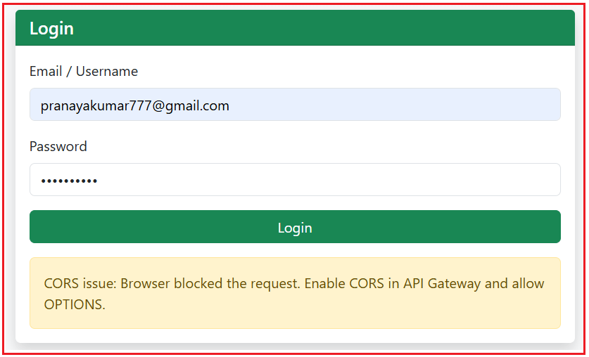
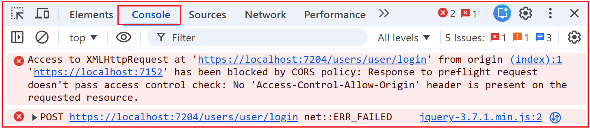
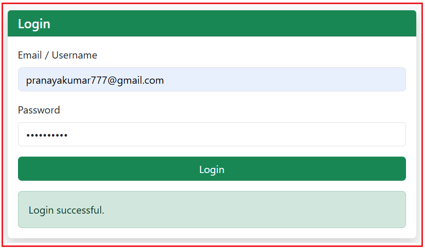
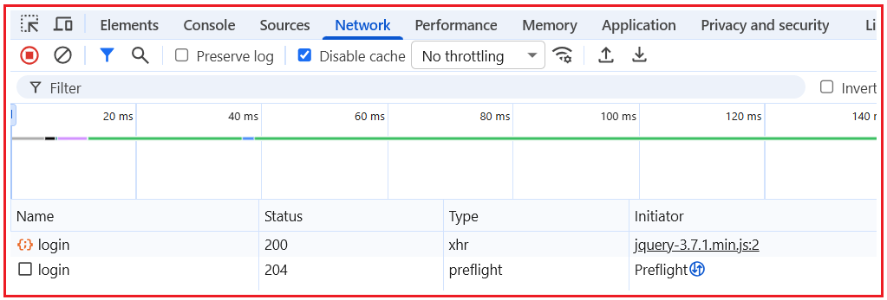
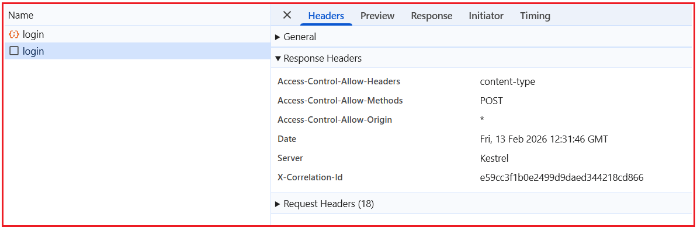

## **پیاده‌سازی CORS در میکروسرویس‌های ASP.NET Core Web API**

در یک سیستم مبتنی بر میکروسرویس‌ها، برنامه frontend و APIهای backend معمولاً روی پورت‌ها، دامنه‌ها یا زیردامنه‌های مختلف اجرا می‌شوند. هنگامی که یک برنامه مبتنی بر مرورگر، مانند یک برنامه ASP.NET Core MVC، Angular، Vue یا React، سعی می‌کند این APIها را از طریق جاوا اسکریپت فراخوانی کند، مرورگر قوانین امنیتی را اعمال می‌کند که ممکن است درخواست را مسدود کند.

اینجاست که اشتراک‌گذاری منابع بین مبدا (CORS) ضروری می‌شود. در این سند، ما یک سناریوی دنیای واقعی را با استفاده از یک کلاینت ASP.NET Core MVC و یک API Gateway بررسی می‌کنیم تا توضیح دهیم که چرا خطاهای CORS رخ می‌دهند، مرورگرها چگونه درخواست‌های قبل از اجرا را مدیریت می‌کنند و چگونه CORS را در API Gateway پیکربندی کنیم تا ارتباط ایمن بین کلاینت‌های مبتنی بر مرورگر و میکروسرویس‌ها برقرار شود.

##### **سناریوی مثال:**

با موارد زیر ایجاد خواهیم کرد : **.NET 8 ASP.NET Core MVC** ما یک برنامه

- **صفحه ورود** → نقطه پایانی Gateway **/users/user/login** را فراخوانی می‌کند ، **JWT + توکن به‌روزرسانی را دریافت می‌کند**
- کاربردهای رابط کاربری:
	- - **CDN بوت‌استرپ**
				- **جی کوئری آژاکس**

##### **ایجاد پروژه MVC**

یک پروژه جدید ASP.NET Core MVC با نام **Ecommerce.Web** ایجاد کنید . لطفاً هنگام ایجاد برنامه، قالب پروژه ASP.NET Core Web App (Model-View-Controller) را انتخاب کنید.

##### **اضافه کردن Bootstrap + jQuery (CDN) در \_Layout.cshtml**

لطفا **فایل Views/Shared/\_Layout.cshtml** را به صورت زیر تغییر دهید:

```html
<head>
    <meta charset="utf-8" />
    <meta name="viewport" content="width=device-width, initial-scale=1.0" />
    <title>@ViewData["Title"] - ECommerceMvcClient</title>

    <!-- Bootstrap CSS -->
    <link href="https://cdn.jsdelivr.net/npm/bootstrap@5.3.3/dist/css/bootstrap.min.css" rel="stylesheet" />
</head>
<body class="bg-light">
    <header>
        <nav class="navbar navbar-expand-lg navbar-dark bg-dark">
            <div class="container">
                <a class="navbar-brand" asp-controller="Home" asp-action="Index">ECommerce MVC</a>
                <button class="navbar-toggler" type="button" data-bs-toggle="collapse" data-bs-target="#nav">
                    <span class="navbar-toggler-icon"></span>
                </button>
                <div id="nav" class="collapse navbar-collapse">
                    <ul class="navbar-nav ms-auto">
                        <li class="nav-item"><a class="nav-link" asp-controller="Account" asp-action="Register">Register</a></li>
                        <li class="nav-item"><a class="nav-link" asp-controller="Account" asp-action="Login">Login</a></li>
                    </ul>
                </div>
            </div>
        </nav>
    </header>

    <main class="container py-4">
        @RenderBody()
    </main>

    <!-- jQuery -->
    <script src="https://code.jquery.com/jquery-3.7.1.min.js"></script>

    <!-- Bootstrap JS -->
    <script src="https://cdn.jsdelivr.net/npm/bootstrap@5.3.3/dist/js/bootstrap.bundle.min.js"></script>

    @await RenderSectionAsync("Scripts", required: false)
</body>
```

##### **آدرس اینترنتی پایه دروازه (Gateway Base URL) را در تنظیمات برنامه (Appsettings) اضافه کنید**

لطفا **فایل appsettings.js** را به صورت زیر تغییر دهید:

```json
{
  "Logging": {
    "LogLevel": {
      "Default": "Information",
      "Microsoft.AspNetCore": "Warning"
    }
  },
  "AllowedHosts": "*",
  // This is the API Gateway base URL
  "Gateway": {
    "BaseUrl": "https://localhost:7204"
  }
}
```

##### **ایجاد کنترل‌کننده حساب**

یک کنترلر خالی MVC جدید با نام **AccountController.cs** در پوشه Controllers ایجاد کنید، سپس کد زیر را کپی و در آن قرار دهید.

```csharp
using Microsoft.AspNetCore.Mvc;

namespace Ecommerce.Web.Controllers
{
    public class AccountController : Controller
    {
        public IActionResult Login()
        {
            return View();
        }
    }
}
```

##### **ایجاد نمای ورود**

یک view با نام **Login.cshtml** در **پوشه Views/Account** ایجاد کنید و سپس کد زیر را کپی و پیست کنید.

```html
@using Microsoft.Extensions.Configuration
@inject IConfiguration Configuration
@{
    ViewData["Title"] = "Login";
    var gatewayBaseUrl = Configuration["Gateway:BaseUrl"]; // e.g. https://localhost:7204
}

<div class="row justify-content-center">
    <div class="col-md-6">
        <div class="card shadow border-0">
            <div class="card-header bg-success text-white">
                <h5 class="mb-0">Login</h5>
            </div>
            <div class="card-body">

                <form id="loginForm" autocomplete="on" novalidate>
                    <div class="mb-3">
                        <label class="form-label">Email / Username</label>
                        <input id="email"
                               class="form-control"
                               placeholder="Enter email or username"
                               autocomplete="username" />
                    </div>

                    <div class="mb-3">
                        <label class="form-label">Password</label>
                        <input id="password"
                               type="password"
                               class="form-control"
                               placeholder="Enter password"
                               autocomplete="current-password" />
                    </div>

                    <button type="submit" class="btn btn-success w-100">Login</button>
                </form>

                <div id="msg" class="mt-3"></div>

            </div>
        </div>
    </div>
</div>

@section Scripts {
    <script>
        $(document).ready(function () {

            // Base URL of the API Gateway read from appsettings.json
            // Example: https://localhost:7204
            const gatewayBaseUrl = "@gatewayBaseUrl";

            // Helper: shows a Bootstrap alert message inside the #msg div
            // type: success | danger | warning | info
            function showMsg(text, type) {
                $("#msg").html(`<div class="alert alert-${type} mb-0">${text}</div>`);
            }

            // Helper: Detect a "likely CORS blocked" scenario in the browser
            // When CORS blocks, the browser does NOT give JS access to the response.
            // jQuery often reports:
            //   - textStatus = "error"
            //   - xhr.status = 0
            function isCorsLikely(xhr, textStatus) {
                return (textStatus === "error" && xhr && xhr.status === 0);
            }

            // Handle the form submit event 
            $("#loginForm").on("submit", function (e) {

                // Stop the default form submit (page refresh).
                // We want to submit using AJAX instead.
                e.preventDefault();

                // Build the request body exactly as your API expects (PascalCase keys)
                // This matches your Postman request:
                // {
                //   "EmailOrUserName": "...",
                //   "Password": "...",
                //   "ClientId": "web"
                // }
                const payload = {
                    EmailOrUserName: $("#email").val(),
                    Password: $("#password").val(),
                    ClientId: "web" // fixed value as per your API requirement
                };

                // Send AJAX request to API Gateway login endpoint
                $.ajax({
                    // Full URL => https://localhost:7204/users/user/login
                    url: gatewayBaseUrl + "/users/user/login",

                    // HTTP method (must match API endpoint)
                    type: "POST",

                    // Tell server we are sending JSON
                    contentType: "application/json",

                    // Tell jQuery to parse the response as JSON
                    dataType: "json",

                    // Convert JS object -> JSON string
                    data: JSON.stringify(payload),

                    // Runs when API returns HTTP 200 (success response)
                    success: function (res) {

                        // Your API response format:
                        // { Success: true/false, Data: {...}, Message: "...", Errors: ... }
                        // We only show the message based on res.Success.
                        if (res && res.Success === true) {

                            // Show success message from API (or fallback)
                            showMsg(res.Message || "Login successful.", "success");
                        } else {
                            // HTTP 200 but business validation failed
                            // (Example: wrong password, user locked, etc.)
                            showMsg(res?.Message || "Login failed.", "danger");
                        }
                    },

                    // Runs when API returns non-200 OR request is blocked/failed
                    error: function (xhr, textStatus) {

                        // If CORS blocks, the browser prevents your JS from reading the response.
                        // So we show a friendly CORS message here.
                        if (isCorsLikely(xhr, textStatus)) {
                            showMsg(
                                "CORS issue: Browser blocked the request. Enable CORS in API Gateway and allow OPTIONS.",
                                "warning"
                            );
                            return;
                        }

                        // Non-CORS error:
                        // Could be 400, 401, 403, 500, etc.
                        // Try to extract a meaningful error message from the API response.
                        let msg = "Login failed.";

                        // If API returns JSON with a Message property
                        if (xhr?.responseJSON?.Message) msg = xhr.responseJSON.Message;

                        // Else show raw response text (if any)
                        else if (xhr?.responseText) msg = xhr.responseText;

                        // Show final message
                        showMsg(msg, "danger");
                    }
                });

            });

        });
    </script>
}
```

##### **تغییر کلاس برنامه:**

لطفا کلاس Program را به صورت زیر تغییر دهید. در اینجا، ما صفحه ورود (Login Page) را به عنوان صفحه پیش‌فرض خود تنظیم می‌کنیم.

```csharp
namespace Ecommerce.Web
{
    public class Program
    {
        public static void Main(string[] args)
        {
            var builder = WebApplication.CreateBuilder(args);

            // Add services to the container.
            builder.Services.AddControllersWithViews();

            var app = builder.Build();

            // Configure the HTTP request pipeline.
            if (!app.Environment.IsDevelopment())
            {
                app.UseExceptionHandler("/Home/Error");
                app.UseHsts();
            }

            app.UseHttpsRedirection();
            app.UseStaticFiles();

            app.UseRouting();

            app.UseAuthorization();

            app.MapControllerRoute(
                name: "default",
                pattern: "{controller=Account}/{action=Login}/{id?}");

            app.Run();
        }
    }
}
```

##### **کنسول را در حالت توسعه اجرا کنید**

لطفا دستور زیر را در Command Prompt اجرا کنید.

**نماینده کنسول -dev -client=0.0.0.0 -ui -node=consul-dev**

**توجه:** هنگام کار با میکروسرویس‌های خود، این پنجره فرمان را **باز** نگه دارید . اگر آن را ببندید، Consul متوقف می‌شود و سرویس‌ها نمی‌توانند ثبت یا شناسایی شوند.

##### **رابط کاربری کنسول را باز کنید**

پس از اجرای کنسول، می‌توانیم همه چیز را از مرورگر رصد کنیم. مرورگر خود را باز کنید و به آدرس زیر بروید: **http://localhost:8500**

##### **اجرای میکروسرویس‌ها**

لطفاً تمام پروژه‌های میکروسرویس، به‌ویژه API gateway و میکروسرویس کاربر را اجرا کنید.

##### **اجرای پروژه MVC**

در نهایت، برنامه MVC را اجرا کنید. اکنون، صفحه ورود را باز کنید، یک ایمیل و رمز عبور معتبر وارد کنید و روی دکمه ورود کلیک کنید. باید پیام خطای CORS را مشاهده کنید.



برای درک بهتر این موضوع، ابزار توسعه‌دهنده مرورگر را باز کنید، تب Console را باز کنید، در این صورت باید مشکل CORS زیر را مشاهده کنید:



##### **چه اتفاقی در داخل می‌افتد؟**

صفحه ورود ما روی **https://localhost:7152 اجرا می‌شود،** API Gateway ما روی **https://localhost:7204** اجرا می‌شود و مرورگر با پورت‌های مختلف مانند وب‌سایت‌های مختلف رفتار می‌کند. بنابراین، وقتی جاوا اسکریپت صفحه ما (jQuery Ajax) سعی می‌کند با gateway تماس بگیرد، مرورگر ابتدا یک درخواست کوچک "بررسی مجوز" (به نام **Preflight/OPTIONS** ) را برنمی‌گرداند **) ارسال می‌کند. از آنجا که gateway هدر مجوز CORS مورد نیاز ( Access-Control-Allow-Origin** ، مرورگر درخواست واقعی را مسدود کرده و خطای CORS را نمایش می‌دهد.

- **پورت‌های مختلف به معنای مبداهای مختلف هستند** (۷۱۵۲ ≠ ۷۲۰۴)، بنابراین مرورگر قوانین بین مبدایی را اعمال می‌کند.
- مرورگر **Preflight (OPTIONS) ارسال می‌کند تا بپرسد: «آیا این مبدا مجاز است؟»** قبل از POST یک درخواست
- پاسخ دروازه **فاقد هدر Access-Control-Allow-Origin است** ، بنابراین مرورگر تماس را مسدود می‌کند.

##### **چگونه CORS را در API Gateway فعال کنیم؟**

فعال‌سازی CORS در API Gateway یک **فرآیند دو مرحله‌ای** است ، زیرا CORS در ASP.NET Core به دو بخش **ثبت سرویس** (قوانین مجاز) و **اجرای میان‌افزار** (زمانی که این قوانین بر درخواست‌های ورودی اعمال می‌شوند) تقسیم می‌شود. اگر هر یک از این مراحل وجود نداشته باشد یا به اشتباه قرار داده شده باشد، درخواست پیش از اجرای مرورگر با شکست مواجه می‌شود و فراخوانی‌های جاوا اسکریپت مسدود می‌شوند.

**ثبت خدمات (AddCors)**

- قوانین را تعریف کنید (کدام ریشه‌ها/سرصفحه‌ها/متدها مجاز هستند).

**میان‌افزار (UseCors)**

- باید **قبل از Authentication/Authorization اجرا شود،** تا **OPTIONS preflight** مسدود نشود.

##### **ثبت سرویس: تعریف سیاست**

این را **قبل از** var app = builder.Build(); قرار دهید.

```csharp
builder.Services.AddCors(options =>
{
    options.AddPolicy("AllowAll", policy =>
    {
        policy
            .AllowAnyOrigin()   // Allow requests from ANY origin (any domain/port)
            .AllowAnyHeader()   // Allow ANY headers (Content-Type, Authorization, etc.)
            .AllowAnyMethod();  // Allow ANY methods (GET, POST, PUT, DELETE, OPTIONS)
    });
});
```

##### **کاری که هر روش انجام می‌دهد**

- AddCors(…): ویژگی CORS را در ASP.NET Core فعال می‌کند.
- AddPolicy(“AllowAll”, …): یک **سیاست نامگذاری شده** ایجاد می‌کند که می‌توانید بعداً اعمال کنید. همچنین می‌توانید هر نامی به آن بدهید.
- AllowAnyOrigin(): به gateway می‌گوید که من تماس‌ها را از هر مبدأ رابط کاربری می‌پذیرم.
- AllowAnyHeader(): هدرهای مورد نیاز مرورگرها را مجاز می‌کند، به خصوص:
	- نوع محتوا: application/json
		- مجوز: دارنده <JWT>
- AllowAnyMethod(): همه متدها، از جمله **OPTIONS** (preflight) را مجاز می‌داند.

##### **میان‌افزار: اعمال سیاست به ترتیب صحیح**

این را **بعد از** app.UseRouting(); و **قبل از** auth قرار دهید:

```csharp
app.UseRouting();

// CORS must run here so it can handle OPTIONS (preflight)
app.UseCors("AllowAll");

app.UseAuthentication();
app.UseAuthorization();
```

##### **چرا باید CORS قبل از auth باشد؟**

- مرورگر ابتدا یک **درخواست OPTIONS** (پیش از پرواز) ارسال می‌کند: «آیا می‌توانم از مبدا با شما تماس بگیرم؟»
- اگر auth قبل از CORS اجرا شود، ممکن است دروازه درخواست‌های OPTIONS را رد کند یا نتواند هدرهای CORS را اضافه کند.
- سپس مرورگر POST واقعی را مسدود می‌کند و خطای CORS را نشان می‌دهد.

حالا، برنامه MVC را اجرا کنید، به صفحه ورود بروید، اطلاعات ورود معتبر را وارد کنید و روی دکمه ارسال کلیک کنید. باید پاسخ زیر را مشاهده کنید.



##### **برگه شبکه:**

در تب شبکه، دو درخواست ورود به سیستم را همانطور که در تصویر زیر نشان داده شده است، مشاهده خواهید کرد.



###### **اینجا:**

- **login (وضعیت ۲۰۴، نوع: preflight)** مرورگر است **: این درخواست OPTIONS** . اساساً می‌پرسد: «Gateway، آیا به وب‌سایت من اجازه می‌دهید که با استفاده از هدرهای JSON، این نقطه پایانی را فراخوانی کند؟»  
	**۲۰۴** به معنی «بدون محتوا» است - این برای پیش‌اجرا کاملاً طبیعی است. بخش مهم، **هدرهای پاسخ** هستند ، نه بدنه.
- **login (وضعیت ۲۰۰، نوع: xhr)** : این **درخواست POST واقعی** ما است که توسط jQuery Ajax آغاز می‌شود. این درخواست فقط **پس از** موفقیت پیش‌پرواز (preflight) رخ می‌دهد.

##### **درخواست پیش از پرواز:**

کلیک کنید **اگر روی ورودی preflight (204)** و **Response Headers را** باز کنید ، باید مواردی مانند موارد زیر را ببینید:



اینجا:

- کنترل-دسترسی-اجازه-مبدا: …
- روش‌های مجاز-کنترل-دسترسی: …
- سربرگ‌های کنترل دسترسی-مجاز: …

این تأیید می‌کند که CORS فعال شده و به درستی در Gateway کار می‌کند.

##### **آیا می‌توانم چندین سیاست CORS ایجاد کنم؟**

بله. ما می‌توانیم چندین سیاست CORS ایجاد کنیم.

```csharp
// CORS Policies
// We can have multiple CORS Policies
builder.Services.AddCors(options =>
{
    // Policy 1: Allow ALL origins, headers, and methods (demo / dev)
    options.AddPolicy("AllowAll", policy =>
    {
        policy
            .AllowAnyOrigin()   // any UI/domain can call
            .AllowAnyHeader()   // any headers allowed
            .AllowAnyMethod();  // any HTTP methods allowed
    });

    // Policy 2: STRICT (specific origin + specific headers + specific methods)
    options.AddPolicy("StrictMvc", policy =>
    {
        policy
            .WithOrigins("https://localhost:7152")               // only this UI origin
            .WithHeaders("Content-Type", "Authorization")        // allow only these headers
            .WithMethods("GET", "POST");                         // allow only these methods
    });

    // Policy 3: MIXED (specific origin + ANY header + ANY method)
    options.AddPolicy("MixedPolicy", policy =>
    {
        policy
            .WithOrigins("https://localhost:7152")  // only this UI origin
            .AllowAnyHeader()                       // allow any headers (json, auth, custom, etc.)
            .AllowAnyMethod();                      // allow any methods (GET/POST/PUT/DELETE/OPTIONS)
    });
});
```

##### **آیا می‌توانم چندین سیاست CORS را به صورت سراسری اعمال کنم؟**

خیر. ما فقط می‌توانیم یک سیاست CORS را به صورت سراسری اعمال کنیم. بنابراین، اگر چندین سیاست CORS را ثبت کنیم، **ASP.NET Core به طور خودکار یکی را انتخاب نمی‌کند** . در زمان اجرا، سیاست مورد استفاده بستگی به **نحوه اعمال CORS** دارد . **اگر CORS را به صورت سراسری با استفاده از میان‌افزار اعمال کنیم،**

- **app.UseCors("AllowAll");**

سپس **هر درخواست از آن سیاست** ( **AllowAll** ) استفاده می‌کند. بقیه نادیده گرفته می‌شوند مگر اینکه نام را تغییر دهیم. **اعمال کنید** اگر CORS را برای هر نقطه پایانی/کنترل‌کننده/عمل (با استفاده از ویژگی‌ها یا ابرداده‌های نقطه پایانی)

- **[EnableCors("StrictMvc")]**

سپس **آن نقطه پایانی خاص از آن سیاست استفاده می‌کند** ، در حالی که سایر نقاط پایانی می‌توانند از سیاست متفاوتی استفاده کنند.

##### **نکات مهم:**

- **شما نمی‌توانید چندین سیاست را برای یک درخواست واحد ادغام کنید** . برای یک درخواست مشخص، نتیجه عملاً **قوانین یک سیاست** است .
- وقتی **دو سیاست CORS به یک نقطه پایانی اعمال می‌شوند** (برای مثال، یکی **به صورت سراسری** با استفاده از UseCors() اعمال می‌شود و دیگری **به صورت اختصاصی** با استفاده از [EnableCors] اعمال می‌شود)، **سیاست مختص به نقطه پایانی برنده می‌شود** . ASP.NET Core همیشه **خاص‌ترین سیاست CORS را** برای یک درخواست ترجیح می‌دهد، زیرا فرض می‌کند که یک کنترلر یا نقطه پایانی الزامات آن را بهتر از یک پیش‌فرض سراسری می‌داند.
- در زمان واقعی، از ترکیب صداها خودداری کنید تا از سردرگمی جلوگیری شود - یا:
	- - استفاده کنید **از یک سیاست جهانی** ، یا
				- استفاده کنید . **از سیاست‌های Per-Endpoint** بدون هیچ سیاست کلی متناقضی

CORS یک مشکل API نیست، بلکه یک مکانیزم امنیتی مرورگر است که برای محافظت از کاربران در برابر دسترسی ناامن بین مبدا و مقصد طراحی شده است. در میکروسرویس‌های ASP.NET Core، قابل اعتمادترین و قابل نگهداری‌ترین رویکرد، مدیریت CORS در API Gateway است، جایی که تمام ترافیک مرورگر وارد سیستم می‌شود. با ثبت صحیح سرویس‌های CORS، اعمال میان‌افزار به ترتیب مناسب و درک نحوه عملکرد درخواست‌های پیش از اجرا، می‌توانیم خطاهای سمت مرورگر را که حتی زمانی که APIها سالم هستند رخ می‌دهند، از بین ببریم. درک روشن از CORS، ادغام روان‌تر frontend-backend، غافلگیری‌های کمتر در تولید و معماری میکروسرویس‌های تمیزتر را تضمین می‌کند.
