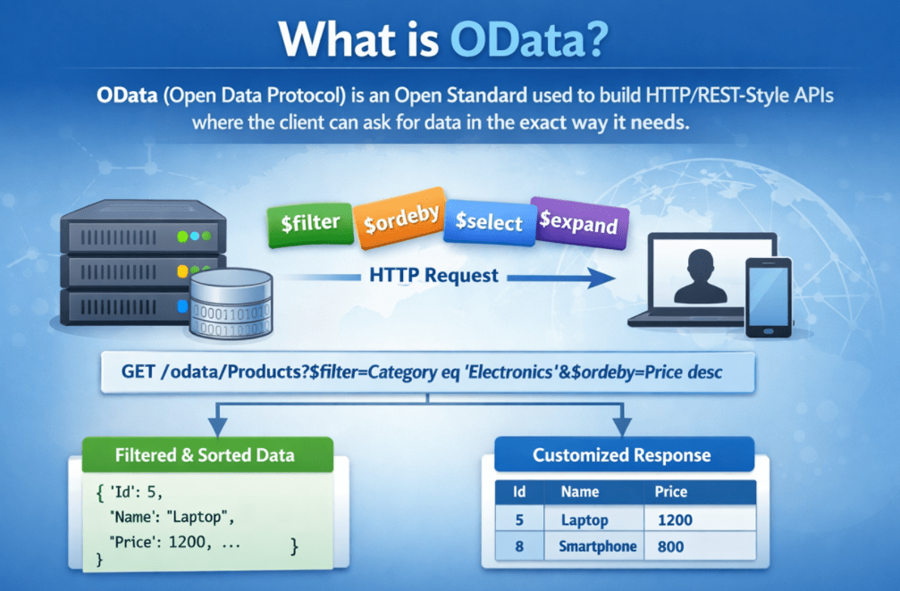
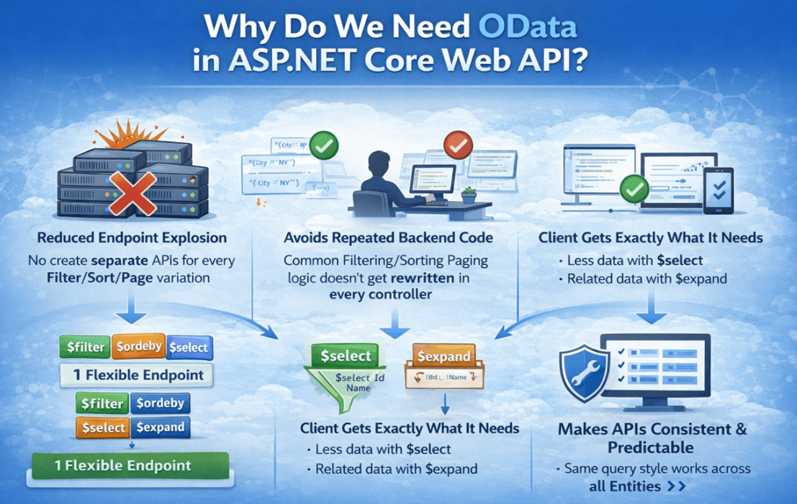
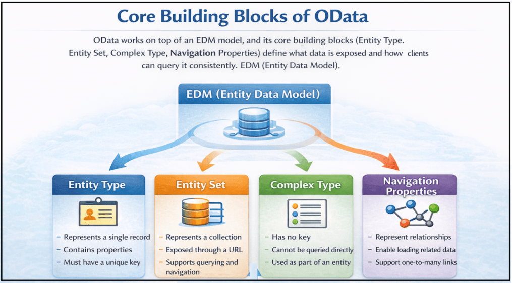
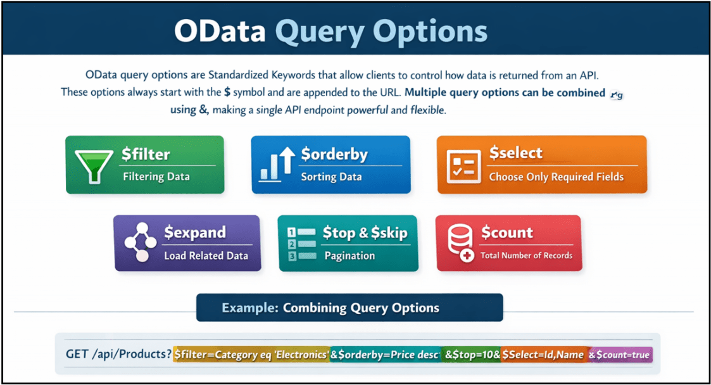
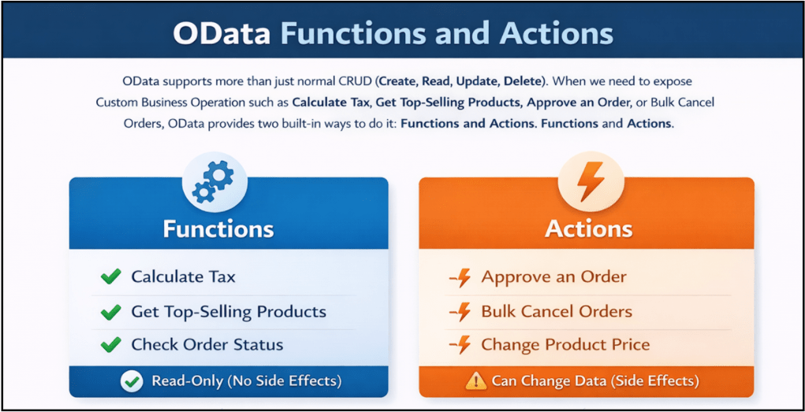

## **OData در ASP.NET Core Web API**

توضیح خواهم داد **در این پست، OData را در ASP.NET Core Web API** . برنامه‌های مدرن نیازمند **APIهای انعطاف‌پذیر، کارآمد و استاندارد** هستند که به کلاینت‌ها اجازه می‌دهد دقیقاً داده‌های مورد نیاز خود را جستجو کنند - نه بیشتر و نه کمتر. اینجاست که **OData (پروتکل داده باز)** نقش مهمی در برنامه‌های ASP.NET Core ایفا می‌کند.

#### **OData چیست؟**

OData (پروتکل داده باز) یک **استاندارد باز** برای ساخت **APIهای به سبک HTTP/REST** است که به کلاینت‌ها اجازه می‌دهد داده‌ها را دقیقاً مطابق نیاز درخواست کنند . معمولاً برای پشتیبانی **از فیلتر کردن، مرتب‌سازی، صفحه‌بندی یا انتخاب فیلدهای خاص** ، ممکن است در نهایت نقاط پایانی مختلفی ایجاد کنیم. با OData، کلاینت‌ها می‌توانند این کارها را با استفاده **از گزینه‌های استاندارد پرس‌وجو در URL** انجام دهند و API را بدون ایجاد چندین نقطه پایانی انعطاف‌پذیرتر کنند.

به زبان ساده، OData یک API را **هوشمند و سازگار با پرس و جو** می‌کند . API همچنان داده‌ها را برمی‌گرداند (معمولاً JSON)، اما کلاینت تصمیم می‌گیرد **که چه مقدار داده را دریافت کند، کدام فیلدها را برگرداند و نتایج را چگونه مرتب کند** ، همه این‌ها از طریق URL درخواست انجام می‌شود. برای درک بهتر OData، لطفاً به تصویر زیر مراجعه کنید.

##### **نکات کلیدی برای به خاطر سپردن:**

- **OData یک پروتکل (مجموعه‌ای از قوانین) است، نه یک چارچوب.**
- این برنامه روی **HTTP** کار می‌کند و به طور طبیعی با **APIهای وب به سبک REST** سازگار است .
- این به کلاینت‌ها اجازه می‌دهد **از گزینه‌های پرس‌وجوی URL** برای شکل‌دهی به پاسخ استفاده کنند:
	- - **فیلتر کردن داده‌ها:** $filter
				- **مرتب‌سازی داده‌ها:** $orderby
				- **صفحه‌بندی:** $top و $skip
				- **انتخاب فیلدهای خاص:** $select
				- **دریافت داده‌های مرتبط (مانند joinها):** $expand
- این یک **نقطه پایانی فراداده** ($metadata) ارائه می‌دهد که به مشتریان کمک می‌کند ساختار داده‌های API ما را درک کنند.

به زبان ساده، OData استانداردی برای ساخت APIهایی است که به کلاینت‌ها اجازه می‌دهد **با استفاده از URL درخواستی، داده‌ها را جستجو و شکل‌دهی کنند** .

#### **چرا در ASP.NET Core Web API به OData نیاز داریم؟**

در ASP.NET Core Web API، ما به OData نیاز داریم زیرا APIهای وب معمولی معمولاً یک **پاسخ ثابت** برمی‌گردانند . هر زمان که تیم رابط کاربری درخواست تغییرات کوچکی مانند «فیلتر بر اساس شهر»، «مرتب‌سازی بر اساس نام»، «فقط شناسه و نام را برگرداند»، «بارگذاری داده‌های مرتبط» یا «افزودن صفحه‌بندی» را داشته باشد، توسعه‌دهندگان اغلب مجبور می‌شوند **نقاط پایانی جدیدی اضافه کنند** یا **کد موجود را بارها و بارها تغییر دهند** . با گذشت زمان، این امر باعث ایجاد APIهای زیاد، منطق تکراری و نگهداری دشوارتر می‌شود.

OData این مشکل را با ارائه یک روش استاندارد برای پرس‌وجو و شکل‌دهی داده‌ها به کلاینت **URL درخواست**   با استفاده از پارامترهای (به عنوان مثال: **$filter، $orderby، $select، $expand، $top، $skip** ) حل می‌کند. این بدان معناست که **یک نقطه پایانی می‌تواند از سناریوهای پرس‌وجوی زیادی پشتیبانی کند** . برای درک بهتر اینکه چرا به OData در ASP.NET Core Web API نیاز داریم، لطفاً به تصویر زیر مراجعه کنید.

##### **نکات کلیدی برای به خاطر سپردن:**

- **کاهش انفجار نقطه پایانی:** نیازی به ایجاد APIهای جداگانه برای هر **فیلتر/مرتب‌سازی/صفحه نیست.** تغییر
- **از تکرار کدنویسی در بک‌اند جلوگیری می‌کند:** منطق رایج **فیلترینگ/مرتب‌سازی/صفحه‌بندی** در هر کنترلری بازنویسی نمی‌شود.
- **مشتری دقیقاً همان چیزی را که نیاز دارد دریافت می‌کند:**
	- - داده‌های کمتر با **$select** (از واکشی بیش از حد جلوگیری می‌کند)
				- داده‌های مرتبط با **$expand** (به جلوگیری از فراخوانی‌های چندگانه کمک می‌کند)
- **APIها را سازگار و قابل پیش‌بینی می‌کند:** قوانین پرس‌وجوی یکسانی در موجودیت‌ها/ماژول‌های مختلف اعمال می‌شود.
- **عالی برای برنامه‌های داده‌محور:** ایده‌آل برای **داشبوردها، گزارش‌ها، پنل‌های مدیریتی، صفحات تحلیلی** و سیستم‌های سازمانی که در آن‌ها پرس‌وجوها نیاز به تغییر مکرر دارند.
- **بهبود قابلیت نگهداری:** تعداد نقاط پایانی کمتر + سبک پرس‌وجوی استاندارد = پشتیبانی و تکامل آسان‌تر.

بنابراین، به زبان ساده، ما به OData در ASP.NET Core نیاز داریم تا APIهای انعطاف‌پذیری بسازیم که در آن‌ها یک نقطه پایانی واحد بتواند از چندین درخواست داده بدون ایجاد چندین API جداگانه پشتیبانی کند.

#### **چه زمانی باید از OData در ASP.NET Core Web API استفاده کنیم؟**

OData باید زمانی استفاده شود که API شما **داده‌محور** باشد و کلاینت ( **رابط کاربری، اپلیکیشن موبایل یا سیستم دیگر** ) به **پرس‌وجوهای انعطاف‌پذیر** مانند **فیلتر کردن، مرتب‌سازی، صفحه‌بندی، انتخاب فیلدها و گسترش داده‌های مرتبط،** بدون ایجاد نقاط پایانی جدید برای هر نیاز جدید، نیاز داشته باشد. این روش در پروژه‌های واقعی که صفحاتی مانند گریدها و گزارش‌ها دائماً در حال تغییر هستند و چندین کلاینت از یک API به روش‌های مختلف استفاده می‌کنند، بیشترین کاربرد را دارد.

##### **از OData زمانی استفاده کنید که:**

- نقاط پایانی شما **مبتنی بر لیست/جستجو/شبکه** ​​هستند (پنل‌های مدیریتی، داشبوردها، صفحات گزارش‌گیری).
- کلاینت‌ها **به فیلترینگ، مرتب‌سازی، صفحه‌بندی** و **انتخاب فیلد** پویا نیاز دارند .
- چندین کلاینت ( **وب، موبایل، ابزارهای BI** ) **به ترکیب‌های مختلف کوئری** روی داده‌های یکسان نیاز دارند.

##### **از OData در موارد زیر اجتناب کنید:**

- API شما **بسیار ساده** است و پاسخ‌ها همیشه ثابت هستند.
- نقاط پایانی شما **گردش کار و دستورات زیادی** دارند (ثبت سفارش، تأیید پرداخت، ارسال درخواست) و شکل پاسخ باید به شدت کنترل شود.

**به عبارت ساده:** از OData برای **نقاط پایانی مرور داده و پرس‌وجوهای سنگین** (گرید/گزارش/داشبورد) استفاده کنید و از آن برای APIهای ساده یا مبتنی بر گردش کار اجتناب کنید.

#### **بلوک‌های سازنده‌ی اصلی OData**

OData بر اساس یک مدل داده‌ی خوش‌تعریف **به نام مدل داده‌ی موجودیت (EDM)** ساخته شده است . این مدل، داده‌هایی را که API در معرض نمایش قرار می‌دهد و آن **ساختار** را توصیف می‌کند . به لطف این مدل، OData می‌تواند **فیلتر کردن، مرتب‌سازی، صفحه‌بندی و بارگذاری روابط را** به **روشی سازگار و قابل پیش‌بینی** اعمال کند .

برای درک نحوه عملکرد داخلی OData، درک **بلوک‌های سازنده اصلی** آن مهم است . برای درک بهتر بلوک‌های سازنده اصلی OData، لطفاً به تصویر زیر مراجعه کنید.

##### **نوع موجودیت**

یک **نوع موجودیت (Entity Type)** نشان دهنده یک شیء تجاری واحد است. این نوع، ساختار داده‌ها، شامل ویژگی‌ها و یک کلید منحصر به فرد را تعریف می‌کند.

- نشان دهنده یک رکورد واحد است
- شامل خواص
- باید کلید داشته باشد
- قابل مقایسه با یک مدل یا کلاس موجودیت

##### **مجموعه موجودیت**

یک **مجموعه موجودیت (Entity Set)** مجموعه‌ای از موجودیت‌های هم نوع است. این همان چیزی است که به عنوان یک نقطه پایانی در OData نمایش داده می‌شود.

- نشان دهنده یک مجموعه است
- از طریق یک URL در معرض دید قرار می‌گیرد
- پشتیبانی از پرس‌وجو و ناوبری
- قابل مقایسه با یک جدول یا لیست

##### **انواع پیچیده**

یک **نوع پیچیده (Complex Type)** نشان دهنده داده‌های ساختاریافته‌ای است که هویت خاص خود را ندارند. این نوع داده نمی‌تواند به طور مستقل وجود داشته باشد.

- کلید ندارد.
- امکان استعلام مستقیم وجود ندارد
- فقط به عنوان بخشی از یک موجودیت استفاده می‌شود
- به ساختاردهی تمیز داده‌ها کمک می‌کند

##### **ویژگی‌های ناوبری**

**ویژگی‌های ناوبری،** روابط بین موجودیت‌ها را تعریف می‌کنند. آن‌ها به کلاینت‌ها اجازه می‌دهند تا از یک موجودیت به موجودیت‌های مرتبط پیمایش کنند.

- روابط را نشان دهید
- فعال کردن بارگذاری داده‌های مرتبط
- پشتیبانی از روابط یک به یک و یک به چند
- با $expand استفاده می‌شود

##### **EDM (مدل داده موجودیت)**

مدل **داده موجودیت (EDM)** طرح اولیه سرویس OData است. این مدل، انواع موجودیت‌ها، روابط و ساختارها را توصیف می‌کند.

- شکل داده‌ها را تعریف می‌کند
- تولید فراداده را هدایت می‌کند
- به عنوان یک قرارداد بین کلاینت و سرور عمل می‌کند
- اعتبارسنجی پرس‌وجو را فعال می‌کند

**به عبارت ساده،** OData بر روی یک مدل EDM کار می‌کند و بلوک‌های سازنده اصلی آن (نوع موجودیت، مجموعه موجودیت، نوع پیچیده، ویژگی‌های ناوبری) تعریف می‌کنند که چه داده‌هایی در معرض نمایش قرار می‌گیرند و چگونه کلاینت‌ها می‌توانند به طور مداوم از آنها پرس‌وجو کنند.

#### **گزینه‌های پرس‌وجوی OData**

گزینه‌های پرس‌وجوی OData **کلمات کلیدی استانداردی** کنترل کنند **هستند که به کلاینت‌ها اجازه می‌دهند نحوه‌ی بازگشت داده‌ها از یک API را** . این گزینه‌ها همیشه با **نماد $** شروع می‌شوند و به URL اضافه می‌شوند. چندین گزینه‌ی پرس‌وجو را می‌توان با استفاده از **عملگر &** ترکیب کرد و یک نقطه‌ی پایانی API واحد را قدرتمند و انعطاف‌پذیر ساخت. برای درک بهتر **گزینه‌های پرس‌وجوی OData** ، لطفاً به تصویر زیر مراجعه کنید.

##### **فیلتر کردن داده‌ها با $filter**

برای برگرداندن فقط رکوردهایی که با شرایط خاص مطابقت دارند، استفاده می‌شود.

- مثال: /odata/Products?$filter=Price gt 100
- پشتیبانی از عملگرهای مقایسه‌ای:
	- - **eq** – برابر است با
				- **ne** – برابر نیست با
				- **gt** – بزرگتر از
				- **ge** – بزرگتر یا مساوی با
				- **lt** – کمتر از
				- **le** – کوچکتر یا مساوی با
- از عملگرهای منطقی پشتیبانی می‌کند: and، or، not
- پشتیبانی از توابعی مانند contains، startswith، endswith
- کاهش داده‌های غیرضروری و بهبود عملکرد

##### **$orderby – مرتب‌سازی داده‌ها:**

برای مرتب‌سازی مجموعه نتایج بر اساس یک یا چند فیلد استفاده می‌شود.

- مثال: /odata/Products?$orderby=Price desc
- پشتیبانی از ترتیب صعودی و نزولی
- امکان مرتب‌سازی چند ستونی را فراهم می‌کند. مثال: /odata/Products?$orderby=IsActive desc, Price asc
- مرتب‌سازی منطق را از کد backend حذف می‌کند

##### **$select – فقط فیلدهای ضروری را انتخاب کنید:**

برای برگرداندن فقط ویژگی‌های انتخاب شده در پاسخ استفاده می‌شود.

- مثال: /odata/Products?$select=Id,Name,Price
- از بارگیری بیش از حد جلوگیری می‌کند
- اندازه بار مفید را کاهش می‌دهد
- زمان پاسخگویی را بهبود می‌بخشد، به خصوص برای صفحات فهرست و شبکه

##### **$expand – بارگذاری داده‌های مرتبط:**

برای گنجاندن موجودیت‌های مرتبط با استفاده از ویژگی‌های ناوبری استفاده می‌شود.

- مثال: /odata/Products?$expand=Images
- از انتخاب تو در تو پشتیبانی می‌کند: odata/Products?$select=Id,Name,Price&$expand=Images($select=Id,ImageUrl,IsPrimary)
- کاهش فراخوانی‌های متعدد API
- باید کنترل شود تا از پرس‌وجوهای پرهزینه جلوگیری شود

##### **$top و $skip – صفحه‌بندی:**

برای کنترل تعداد رکوردهای برگردانده شده و محل آنها استفاده می‌شود.

- $top = تعداد رکوردهایی که باید برگردانده شوند
- ‎$skip = تعداد رکوردهایی که باید از آنها صرف نظر شود
- مثال: /odata/Products?$skip=10&$top=10
- ضروری برای مجموعه داده‌های بزرگ و APIهای مقیاس‌پذیر

##### **$count – تعداد کل رکوردها:**

برای برگرداندن تعداد کل رکوردهای منطبق استفاده می‌شود.

- مثال: /odata/Products?$count=true
- برای رابط کاربری صفحه‌بندی و شمارش نتایج مفید است
- اغلب با $top و $skip استفاده می‌شود

##### **ترکیب گزینه‌های پرس‌وجو - قدرت واقعی OData:**

چندین گزینه پرس و جو را می‌توان در یک درخواست واحد ترکیب کرد.

- مثال: /odata/Products?$filter=Price gt 100&$orderby=Price desc&$top=10&$select=Id,Name,Price&$count=true
- یک درخواست، فیلتر کردن، مرتب‌سازی، صفحه‌بندی، پیش‌بینی و شمارش را مدیریت می‌کند.
- ایده‌آل برای شبکه‌های داده، صفحات جستجو، داشبوردها و گزارش‌ها
- هیچ تغییر کد backend لازم نیست.

**به عبارت ساده** ، گزینه‌های پرس‌وجوی OData به کلاینت‌ها اجازه می‌دهند تا با استفاده از URL، فیلدها را فیلتر، مرتب‌سازی، صفحه‌بندی، انتخاب و داده‌های مرتبط را بارگذاری کنند و یک نقطه پایانی API واحد را انعطاف‌پذیر و قدرتمند سازند.

#### **توابع و اقدامات OData**

OData از عملیات CRUD معمولی (ایجاد، خواندن، به‌روزرسانی، حذف) پشتیبانی می‌کند. وقتی نیاز به نمایش **عملیات تجاری سفارشی** مانند « **محاسبه مالیات** »، « **دریافت محصولات پرفروش** »، « **تأیید سفارش** » یا « **لغو دسته‌ای سفارشات** » داریم، OData دو روش داخلی برای انجام این کار ارائه می‌دهد: **توابع** و **اقدامات** .

تفاوت کلیدی ساده است: **توابع فقط خواندنی هستند (بدون عوارض جانبی)** ، در حالی که **اکشن‌ها می‌توانند داده‌ها را تغییر دهند (عوارض جانبی)** تعریف شده‌اند . هر دو در **مدل OData (EDM)** ، بنابراین برای کلاینت‌ها قابل کشف هستند و از یک استاندارد ثابت پیروی می‌کنند. برای درک بهتر **توابع و اکشن‌های OData** ، لطفاً به تصویر زیر نگاهی بیندازید.

##### **توابع (عملیات فقط خواندنی)**

- زمانی استفاده می‌شود که عملیات **نباید** داده‌ها را تغییر دهد.
- برای محاسبات، جستجوها و نتایج مشتق‌شده ایمن است.
- **بدون عوارض جانبی** (وضعیت سرور بدون تغییر باقی می‌ماند)
- می‌تواند پارامترها را بپذیرد و مقادیر را برگرداند
- معمولاً **به سبک GET نامیده می‌شوند** عملیات

##### **اقدامات (عملیات فرماندهی)**

- زمانی استفاده می‌شود که عملیات **بتواند** داده‌ها را تغییر دهد.
- بهترین گزینه برای گردش‌های کاری و دستوراتی مانند تأیید، لغو، ارسال و انتشار.
- **ممکن است وضعیت سرور را تغییر دهد** (عوارض جانبی مجاز است)
- معمولاً **به سبک POST نامیده می‌شوند** عملیات

**به عبارت ساده:** در OData، **توابع** برای **عملیات فقط خواندنی** (بدون عوارض جانبی) هستند، در حالی که **اکشن‌ها** برای **دستوراتی** هستند که می‌توانند **داده‌ها را تغییر داده** و وضعیت سرور را به‌روزرسانی کنند.

#### **آیا OData جایگزینی برای REST است؟**

خیر، OData **نیست** جایگزینی برای REST **. REST یک سبک معماری** گسترده است که نحوه طراحی APIها (منابع، URLها، افعال HTTP، ارتباطات بدون وضعیت) را تعریف می‌کند. OData عمل می‌کند **در دنیای REST/HTTP** و روشی **استاندارد و قابل پیش‌بینی برای پرس‌وجو و شکل‌دهی داده‌ها** از نقاط انتهایی منابع ارائه می‌دهد.

یک راه ساده برای به خاطر سپردن این است: **REST تصمیم می‌گیرد که «نقطه پایانی چیست»** ، در حالی که **OData تصمیم می‌گیرد که «کلاینت چگونه می‌تواند از آن نقطه پایانی، داده‌ها را پرس‌وجو کند.»** بسیاری از پروژه‌های واقعی از نقاط پایانی REST برای اقدامات گردش کار (مانند ثبت سفارش) و از نقاط پایانی OData برای صفحات پرس‌وجو-محور (مانند جستجو و فهرست کردن سفارش‌ها) استفاده می‌کنند.

##### **نکات کلیدی برای به خاطر سپردن:**

- **REST = سبک معماری** ، **OData = پروتکل/استاندارد روی HTTP** برای داده‌های قابل پرس‌وجو.
- OData **از اصول REST پیروی می‌کند** و از همان افعال HTTP ( **GET، POST، PUT، DELETE** ) استفاده می‌کند.
- **REST ساختار را فراهم می‌کند** و OData **قابلیت‌های پرس‌وجو** مانند $filter، $orderby، $select، $top، $skip و $expand را اضافه می‌کند.
- شما می‌توانید **REST و OData را** در یک برنامه ASP.NET Core با هم ترکیب کنید:
	- - استفاده از **REST** برای اقدامات/گردش‌های کاری (مثلاً سفارش مکان، تأیید پرداخت)
				- استفاده از **OData** برای صفحات مرور/جستجوی داده‌ها (مثلاً ListProducts، SearchOrders)

بنابراین، به عبارت ساده، OData جایگزین REST نمی‌شود. بلکه **APIهای REST را بهبود می‌بخشد .** با اضافه کردن یک روش استاندارد برای کلاینت‌ها جهت پرس‌وجو و شکل‌دهی داده‌ها از طریق URL،

#### **آیا OData مشابه GraphQL است؟**

OData و GraphQL دارند **هدف مشابهی** اما **متفاوت هستند** **در رویکرد** . هر دو به کلاینت‌ها کمک می‌کنند تا با اجازه دادن به آنها برای درخواست شکل دقیق داده مورد نیاز خود، از **over-fetching** (دریافت داده‌های بیش از حد) و **under-fetching** (نیاز به چندین فراخوانی) جلوگیری کنند.

تفاوت اصلی در نحوه ارسال کوئری توسط کلاینت است. **OData به REST نزدیک می‌ماند** و از **گزینه‌های استاندارد کوئری URL** ( مانند **$filter، $select** و **$expand** ) در بالای نقاط انتهایی منابع (مانند /Products) استفاده می‌کند. **GraphQL از یک زبان کوئری** (که معمولاً در بدنه درخواست ارسال می‌شود) استفاده می‌کند و معمولاً **یک نقطه انتهایی واحد را** در معرض نمایش قرار می‌دهد ، جایی که سرور کوئری را با استفاده از resolvers حل می‌کند.

##### **نکات کلیدی برای به خاطر سپردن:**

- **هدف یکسان، سبک متفاوت**
	- - هر دو، واکشی داده‌ها و شکل‌دهی داده‌ها را به صورت انعطاف‌پذیر ارائه می‌دهند.
				- هر دو می‌توانند فقط فیلدهای مورد نیاز و داده‌های مرتبط را در یک فراخوانی برگردانند.
- **نحوه نگارش کوئری‌ها**
	- - **OData:** گزینه‌های مبتنی بر URL (مثلاً $filter، $orderby، $select، $expand)
				- **GraphQL:** سند پرس‌وجو (فیلدها + فیلدهای تودرتو + آرگومان‌ها) به یک نقطه پایانی GraphQL ارسال شد
- **سازگاری با REST**
	- - **OData:** به طور طبیعی با APIهای سبک REST و URLهای منابع سازگار است.
				- **GraphQL:** یک سبک API متفاوت (تک نقطه پایانی + طرحواره + حل کننده ها) را معرفی می کند
- **ذخیره سازی و رفتار HTTP**
	- - **OData:** اغلب از GET استفاده می‌کند که به طور طبیعی با حافظه پنهان سازگار است.
				- **GraphQL:** معمولاً از POST استفاده می‌کند، بنابراین ذخیره‌سازی معمولاً به یک استراتژی اضافی نیاز دارد.
- **تصمیم گیری در مورد اینکه از کدام یک استفاده کنیم**
	- - انتخاب کنید . **OData را** وقتی از قبل REST API دارید و به کوئری‌های قدرتمند و سریع نیاز دارید،
				- انتخاب کنید . **GraphQL را** وقتی می‌خواهید حداکثر انعطاف‌پذیری مبتنی بر کلاینت را داشته باشید و بتوانید روی طراحی schema + resolver سرمایه‌گذاری کنید،

**به عبارت ساده،** OData و GraphQL مشکل یکسانی از پرس‌وجوی انعطاف‌پذیر داده‌ها را حل می‌کنند، اما OData این کار را با استفاده از پرس‌وجوهای URL سازگار با REST انجام می‌دهد، در حالی که GraphQL از یک زبان پرس‌وجو و مدل اجرای جداگانه استفاده می‌کند.

OData روشی قدرتمند و استاندارد برای ساخت **APIهای داده‌محور** در ASP.NET Core ارائه می‌دهد. با ترکیب یک مدل داده قوی (EDM)، گزینه‌های پرس‌وجوی غنی و فراداده، OData به کلاینت‌ها این امکان را می‌دهد که دقیقاً داده‌های مورد نیاز خود را درخواست کنند و در عین حال APIها را تمیز و قابل نگهداری نگه دارند. هنگامی که در سناریوهای مناسب - مانند داشبوردها، گزارش‌ها و پنل‌های مدیریتی - استفاده شود، OData پیچیدگی API را تا حد زیادی کاهش می‌دهد و مقیاس‌پذیری بلندمدت را بهبود می‌بخشد، در حالی که همچنان به طور یکپارچه در کنار نقاط پایانی سنتی REST کار می‌کند.