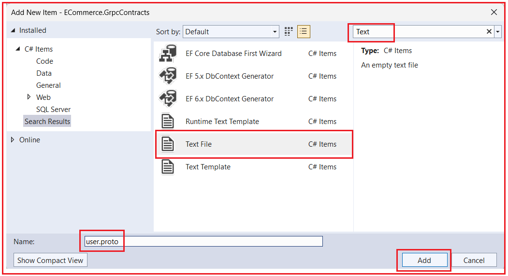
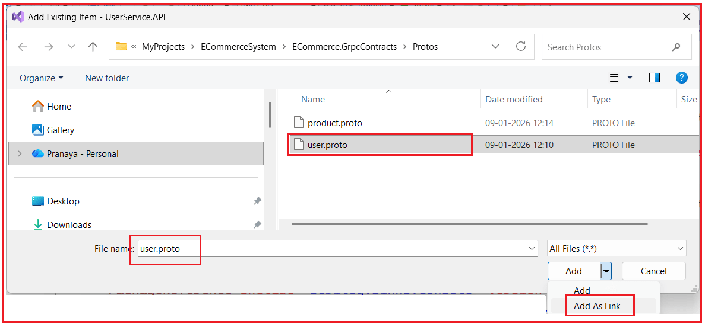
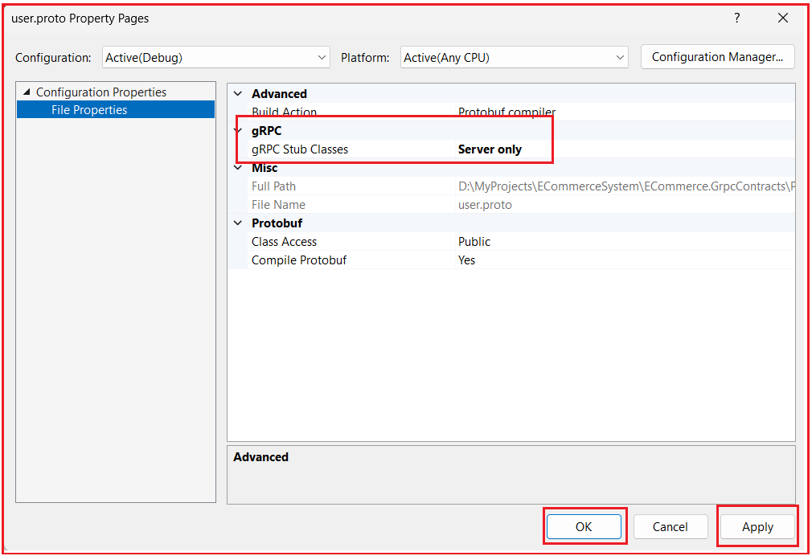

## **پیاده‌سازی gRPC در میکروسرویس‌های ASP.NET Core**

در یک معماری مبتنی بر میکروسرویس‌ها، سرویس‌ها اغلب نیاز دارند که به سرعت، به طور قابل اعتماد و در مقیاس مناسب با یکدیگر ارتباط برقرار کنند. در حالی که REST APIها به طور گسترده برای ارتباطات رو در رو با کلاینت استفاده می‌شوند، ممکن است هنگام استفاده برای تماس‌های داخلی و پربسامد سرویس به سرویس، سربار غیرضروری ایجاد کنند. gRPC یک چارچوب ارتباطی مدرن و با کارایی بالا است که بر اساس HTTP/2 و Protocol Buffers ساخته شده است و به طور خاص برای رسیدگی به این چالش‌ها طراحی شده است.

اکنون، بررسی خواهیم کرد که چگونه gRPC می‌تواند عملاً در یک سیستم میکروسرویس تجارت الکترونیک در دنیای واقعی پیاده‌سازی شود تا عملکرد را بهبود بخشد، قراردادهای قوی را اجرا کند و مرزهای معماری تمیز را حفظ کند، در حالی که به طور یکپارچه با APIهای REST موجود همزیستی می‌کند.

### **سناریوی بلادرنگ: دریافت جزئیات کاربر و محصول با استفاده از gRPC**

در یک برنامه تجارت الکترونیک، **ایجاد سفارش یک عملیات حیاتی است**. قبل از اینکه یک سفارش با موفقیت ایجاد شود، سیستم باید **چندین قطعه اطلاعات را در زمان واقعی اعتبارسنجی کند**. این اعتبارسنجی‌ها باید **به صورت همزمان** انجام شوند، به این معنی که سرویس سفارش باید قبل از رفتن به مرحله بعدی منتظر پاسخ بماند.

در سیستم ما، OrderService **مالک داده‌های کاربر یا داده‌های محصول نیست**. در عوض، با سایر میکروسرویس‌ها ارتباط برقرار می‌کند تا این اطلاعات را دریافت و اعتبارسنجی کند. اینجاست که **gRPC بسیار مفید واقع می‌شود**.

#### **اعتبارسنجی کاربر با استفاده از UserService**

قبل از ایجاد سفارش، سرویس سفارش (OrderService) ابتدا باید تأیید کند که کاربری که سفارش را ثبت می‌کند، معتبر است. این مرحله تضمین می‌کند که سیستم برای کاربران نامعتبر یا غیرمجاز سفارش ایجاد نمی‌کند. سرویس سفارش (OrderService) با سرویس کاربر (UserService) ارتباط برقرار می‌کند تا موارد زیر را بررسی کند:

- اینکه آیا **کاربر وجود دارد یا خیر**
- یا نبودن کاربر **فعال بودن**
- آیا **کاربر تأیید شده است یا خیر**
- آیا **کاربر مجاز به ثبت سفارش است؟**
- اطلاعات اولیه کاربر، مانند **نام، ایمیل و شماره تلفن** را برای ثبت سفارش و ارتباطات دریافت کنید

این تعامل از یک **الگوی ساده‌ی درخواست-پاسخ** پیروی می‌کند:

- سرویس سفارش (OrderService) یک شناسه کاربری (UserId) ارسال می‌کند.
- سرویس کاربری جزئیات کاربر را برمی‌گرداند یا نشان می‌دهد که کاربر وجود ندارد.

از آنجایی که این یک **عملیات سبک و همزمان** با درخواست و پاسخ واضح است، یک **مورد استفاده ایده‌آل برای gRPC Unary RPC** است.

#### **دریافت جزئیات محصول با استفاده از ProductService**

پس از اعتبارسنجی کاربر، سرویس سفارش (OrderService) باید اطلاعات مربوط به محصول را اعتبارسنجی و دریافت کند. این مرحله برای اطمینان از صحت سفارش و امکان انجام آن ضروری است. سرویس سفارش (OrderService) اطلاعات زیر را از سرویس محصول (ProductService) درخواست می‌کند:

- نام محصول
- قیمت فعلی
- قیمت با تخفیف (در صورت وجود)
- موجودی انبار
- وضعیت محصول

این سوالات مربوط به محصول عبارتند از:

- **بسیار مکرر**
- **حساس به زمان**
- **عملکرد بحرانی**

حتی یک تأخیر کوچک در دریافت این داده‌ها می‌تواند زمان کلی ثبت سفارش را به میزان قابل توجهی افزایش دهد. از آنجا که این درخواست‌ها **هزاران بار در دقیقه** اتفاق می‌افتند، استفاده از APIهای REST سنتی با JSON سربار غیرضروری ایجاد می‌کند، مانند:

- اندازه‌های بار بزرگتر
- استفاده بیشتر از CPU برای سریال‌سازی و حذف سریال‌سازی
- افزایش تأخیر شبکه
- زمان پاسخ کلی کندتر

#### **چرا gRPC در اینجا انتخاب بهتری است؟**

کاربردهای gRPC:

- **بافرهای پروتکل (با فرمت دودویی)** به جای JSON
- **HTTP/2** که از مالتی‌پلکسینگ و استفاده کارآمد از شبکه پشتیبانی می‌کند
- **قراردادهای قویاً تایپ‌شده**، که در زمان کامپایل تولید می‌شوند

به دلیل این مزایا، gRPC **ارتباط داخلی سریع‌تر، کارآمدتر و قابل اعتمادتری** بین میکروسرویس‌ها فراهم می‌کند. این امر آن را به **انتخابی ایده‌آل برای تماس‌های داخلی و پربسامد سرویس به سرویس**، مانند مواردی که در هنگام ایجاد سفارش مورد نیاز است، تبدیل می‌کند.

### **جریان ایجاد سفارش با استفاده از اعتبارسنجی مبتنی بر gRPC**

در حین ثبت سفارش، سرویس سفارش (OrderService) چندین فراخوانی gRPC را برای اعتبارسنجی و آماده‌سازی سفارش انجام می‌دهد.

#### **فراخوانی‌های gRPC سرویس کاربری**

##### **فراخوانی ۱: دریافت کاربر از طریق شناسه**

- **متد**: GetUserByIdAsync(request.UserId, accessToken)
- **ورودی**:
  - شناسه کاربری (راهنما)
  - توکن دسترسی (برای احراز هویت)
- **خروجی**:
  - UserDTO شامل شناسه، نام کامل، ایمیل و شماره تلفن
- **هدف**:
  - اطمینان از وجود کاربر
  - اگر کاربر نامعتبر باشد، فوراً شکست می‌خورد

اگر کاربر پیدا نشود، فرآیند ایجاد سفارش بلافاصله متوقف می‌شود.

##### **شماره ۲: ذخیره یا به‌روزرسانی آدرس ارسال**

- **متد**: SaveOrUpdateAddressAsync(request.ShippingAddress, accessToken)
- **وقتی فراخوانده شد**:
  - فقط در صورتی که ShippingAddressId برابر با null باشد
  - و آدرس ارسال جدید ارائه شده است
- **خروجی**:
  - AddressId جدید ایجاد شده یا به‌روزرسانی شده
- **هدف**:
  - قبل از ایجاد سفارش، از وجود آدرس ارسال مطمئن شوید

##### **شماره ۳: ذخیره یا به‌روزرسانی آدرس صورتحساب**

- **متد**: SaveOrUpdateAddressAsync(request.BillingAddress, accessToken)
- **منطق**:
  - همانند رسیدگی به آدرس ارسال
- **هدف**:
  - اطمینان حاصل کنید که جزئیات صورتحساب به درستی ذخیره شده است

#### **فراخوانی‌های gRPC در سرویس محصول**

**تماس ۱: بررسی موجودی محصول**

- **متد**: CheckProductsAvailabilityAsync(stockCheckRequests, accessToken)
- **ورودی**:
  - لیست محصولات با تعداد درخواستی
- **خروجی**:
  - وضعیت موجودی هر محصول
- **هدف**:
  - سریع شکست بخورید اگر:
    - محصول نامعتبر است
    - مقدار مورد نظر موجود نیست

این مرحله از ایجاد سفارش‌هایی که قابل انجام نیستند جلوگیری می‌کند.

##### **فراخوان دوم: دریافت جزئیات محصول بر اساس شناسه‌ها**

- **متد**: GetProductsByIdsAsync(productIds, accessToken)
- **ورودی**:
  - فهرست شناسه‌های محصول
- **خروجی**:
  - جزئیات محصول شامل:
    - نام
    - قیمت
    - قیمت با تخفیف
    - مقدار موجودی
- **هدف**:
  - اطمینان از قیمت‌گذاری دقیق و محاسبه تخفیف در زمان ثبت سفارش

#### **چرا این سناریو برای gRPC ایده‌آل است؟**

این جریان ایجاد سفارش کاملاً نشان می‌دهد **که gRPC کجا باید استفاده شود**:

- تماس‌های با فرکانس بالا
- ارتباط همزمان سرویس به سرویس
- میکروسرویس‌های داخلی (در معرض کلاینت‌های عمومی قرار ندارند)
- الزامات عملکرد قوی
- پیام‌های درخواست-پاسخ کوچک و ساختاریافته

**این دقیقاً همان سناریویی است که در آن gRPC از REST بهتر عمل می‌کند** و به همین دلیل است که معمولاً در سیستم‌های میکروسرویس در مقیاس بزرگ و در دنیای واقعی استفاده می‌شود.

### **مرحله ۱: ایجاد یک پروژه قراردادهای gRPC مشترک**

در معماری میکروسرویس‌ها، سرویس‌های مختلف باید در مورد **نحوه ارتباط خود** توافق داشته باشند. وقتی از gRPC استفاده می‌کنیم، این توافق با استفاده از **فایل‌های Protocol Buffer (.proto)** نوشته می‌شود. این فایل‌ها موارد زیر را تعریف می‌کنند:

- چه خدماتی وجود دارد؟
- چه روش‌هایی را افشا می‌کنند؟
- چه داده‌هایی ارسال و دریافت می‌شود

از آنجا که این تعاریف **بین کلاینت gRPC و سرور gRPC به اشتراک گذاشته** می‌شوند، ما **یک پروژه مشترک** ایجاد می‌کنیم که فقط شامل قراردادهای gRPC است. این پروژه مشترک سپس **توسط تمام میکروسرویس‌هایی** که یکی از شرایط زیر را دارند، ارجاع داده می‌شود:

- میزبان یک سرویس gRPC باشید، یا
- با یک سرویس gRPC تماس بگیرید

این کار از تکرار، ناهماهنگی و مشکلات عدم تطابق نسخه‌ها جلوگیری می‌کند.

#### **مرحله 1: ایجاد یک پوشه راه حل**

درون سولوشن اصلی خود، یک پوشه سولوشن با نام **GRPC ایجاد کنید.**

این پوشه فقط برای سازماندهی پروژه‌های مرتبط با gRPC و جدا نگه داشتن آنها از منطق برنامه استفاده می‌شود.

#### **مرحله ۲: ایجاد پروژه قراردادها**

درون **پوشه‌ی solution مربوط به GRPC** جدید **Class Library**، یک پروژه‌ی **با نام ECommerce.GrpcContracts اضافه کنید.**

این پروژه:

- فقط شامل فایل‌های ‎.proto‎ باشد
- هیچ منطق تجاری ندارد
- عدم میزبانی از هیچ سرویس gRPC
- در چندین میکروسرویس به اشتراک گذاشته شود

#### **مرحله 3: نصب بسته‌های NuGet مورد نیاز**

درون **پروژه ECommerce.GrpcContracts**، بسته‌های NuGet زیر را با استفاده از Package Manager Console نصب کنید:

- **نصب بسته Google.Protobuf**
- **نصب بسته Grpc.Tools**

##### **چرا این بسته‌ها مورد نیاز هستند**

- **Google.Protobuf**: این بسته پشتیبانی از سریال‌سازی Protocol Buffers اصلی را فراهم می‌کند. این بسته نحوه تبدیل داده‌های دودویی به اشیاء و برعکس را درک می‌کند.
- **Grpc.Tools**: این بسته مسئول **تولید کد سی‌شارپ از فایل‌های .proto** در زمان ساخت است. این بسته موارد زیر را تولید می‌کند:
  - کلاس‌های پیام
  - کلاس‌های مبتنی بر سرویس
  - مقاله‌های خرد کلاینت gRPC

را **Grpc.Tools** به عنوان یک تولیدکننده کد در نظر بگیرید و **Google.Protobuf** موتوری است که کد تولید شده را اجرا می‌کند.

#### **مرحله ۴: ایجاد ساختار پوشه**

درون پروژه ECommerce.GrpcContracts، پوشه‌ای با نام **Protos ایجاد کنید.**

این پوشه تمام فایل‌های .proto را ذخیره می‌کند. نگهداری آنها در یک مکان، خوانایی را بهبود می‌بخشد و نسخه‌بندی را آسان‌تر می‌کند.

##### **فایل .proto چیست؟**

یک فایل .proto یک **فایل متنی ساده** با پسوند .proto است. از آن برای تعریف موارد زیر استفاده می‌شود:

- خدمات gRPC
- قالب‌های پیام درخواست و پاسخ
- انواع داده‌هایی که بین سرویس‌ها رد و بدل می‌شوند

می‌توانید یک فایل .proto را به عنوان قراردادی در نظر بگیرید که هم کلاینت و هم سرور باید از آن پیروی کنند.

#### **ایجاد user.proto**

**مراحل ایجاد فایل**

1. روی **Protos کلیک راست کنید.** پوشه
2. را انتخاب کنید **افزودن → مورد جدید**
3. در کادر جستجو، **متن را تایپ کنید**
4. انتخاب **فایل متنی**
5. نام فایل را به صورت **user.proto تنظیم کنید.**
6. کلیک کنید **روی افزودن** همانطور که در تصویر زیر نشان داده شده است،



اکنون یک فایل خالی user.proto را در ویرایشگر باز خواهید دید. سپس لطفاً کد زیر را در آن کپی و پیست کنید. کد زیر نیاز به توضیح ندارد، بنابراین لطفاً برای درک بهتر، خطوط کامنت را بخوانید.

```csharp
// -------------------------------
// Protocol Buffers version
// -------------------------------
// - proto3 is the latest and recommended syntax.
// - Default values are used when fields are missing
syntax = "proto3";

// -------------------------------
// C# namespace for generated code
// -------------------------------
// Controls the C# namespace of the generated classes.
// Example generated types will be:
// - ECommerce.GrpcContracts.Users.UserGrpc
// - ECommerce.GrpcContracts.Users.UserExistsRequest, etc.
option csharp_namespace = "ECommerce.GrpcContracts.Users";

// -------------------------------
// Protobuf package name
// -------------------------------
// This is NOT a C# namespace.
// It is used internally by protobuf for namespacing
// and to avoid conflicts across services/languages.
package ecommerce.users;

// -------------------------------
// gRPC Service Definition
// -------------------------------
// A gRPC service is similar to a Controller in REST,
// but instead of URLs, it exposes METHOD calls.
// This defines a gRPC service named "UserGrpc".
// Each RPC method inside maps to a callable endpoint.
service UserGrpc {
  // ----------------------------------
  // RPC: Checks whether a user exists
  // ----------------------------------
  // Used when OrderService only needs to validate
  // whether a UserId is valid.
  // Input  : UserExistsRequest (contains user_id)
  // Output : UserExistsReply   (contains exists = true/false)
  rpc UserExists (UserExistsRequest) returns (UserExistsReply);

  // ----------------------------------
  // RPC: Fetch user profile by UserId
  // ----------------------------------
  // Returns basic user info required during order creation
  // (Name, Email, Phone, etc.)
  // Input  : GetUserByIdRequest
  // Output : GetUserByIdReply (found flag + user object)
  rpc GetUserById (GetUserByIdRequest) returns (GetUserByIdReply);

  // -----------------------------------------
  //  RPC: Fetch a specific address of a user
  // -----------------------------------------
  // Used when OrderService needs shipping/billing address by user id + address id.
  // Input  : GetUserAddressByIdRequest
  // Output : GetUserAddressByIdReply (found flag + address object)
  rpc GetUserAddressById (GetUserAddressByIdRequest) returns (GetUserAddressByIdReply);

  // -------------------------------
  // RPC: Create or update an address
  // -------------------------------
  // If Address.Id is empty => create new
  // If Address.Id is present => update existing
  // Output returns the saved address_id
  rpc SaveOrUpdateAddress (SaveOrUpdateAddressRequest) returns (SaveOrUpdateAddressReply);
}

// Request message for UserExists RPC.
message UserExistsRequest {
  // User ID as string (Guid passed as string)
  string user_id = 1;
}

// Response message for UserExists RPC.
message UserExistsReply {
  // true if user exists, false otherwise
  bool exists = 1;
}

// Request message for GetUserById RPC.
message GetUserByIdRequest {
  // The user ID to search for.
  // user Guid as string
  string user_id = 1;
}

// Response for GetUserById RPC.
// "found"   → whether user exists.
// "user"    → the user details (only if found == true)
message GetUserByIdReply {
  // true if user found, false if not found
  bool found = 1;

  // If found == true, this should contain user details.
  // If found == false, this may be empty / default.
  User user = 2;
}

// USER MESSAGE MODEL
// Represents the user details returned to OrderService.
// This is the Protobuf representation of a User.
message User {
  string id = 1;            // UserId (GUID as string)
  string full_name = 2;     // Full name of the user
  string email = 3;         // Email address
  string phone_number = 4;  // Phone number
}

// GET USER ADDRESS — REQUEST
// Request for fetching user address by user_id and address_id.
// OrderService passes both:
// user_id     → who owns the address
// address_id  → which address to retrieve
message GetUserAddressByIdRequest {
  string user_id = 1;      // UserId (Guid as string)
  string address_id = 2;   // AddressId (Guid as string)
}

// GET USER ADDRESS — RESPONSE
// Response for GetUserAddressById.
// found    → whether address exists
// address  → address object (if found)
message GetUserAddressByIdReply {
  // true if address found for that user_id + address_id
  bool found = 1;

  // If found == true, this contains the address details.
  Address address = 2;
}

// SAVE/UPDATE ADDRESS — REQUEST
// Request for SaveOrUpdateAddress RPC.
// Contains a nested Address message.
// If address.id is empty → create new
// If address.id is set   → update existing
message SaveOrUpdateAddressRequest {
   // Address object containing all fields
  Address address = 1;
}

// SAVE/UPDATE ADDRESS — RESPONSE
// Response for SaveOrUpdateAddress RPC.
message SaveOrUpdateAddressReply {
  // The saved/updated address ID (Guid as string)
  string address_id = 1;
}

// ADDRESS MESSAGE MODEL
// Represents shipping/billing address
message Address {
  // Address ID (Guid as string)
  // Convention used here:
  // - empty string => create new address
  // - non-empty    => update existing address
  string id = 1;

  // User ID to which this address belongs (Guid as string)
  string user_id = 2;

  // Address line 1 (house/building/street)
  string address_line1 = 3;

  // Address line 2 (landmark/apartment/etc.)
  // Can be empty string if not used
  string address_line2 = 4;

  // City
  string city = 5;

  // State
  string state = 6;

  // Postal / ZIP code
  string postal_code = 7;

  // Country
  string country = 8;

  // Whether this is the default billing address for the user
  bool is_default_billing = 9;

  // Whether this is the default shipping address for the user
  bool is_default_shipping = 10;
}
```

#### **ایجاد product.proto**

تعریف می‌کند:

- خدمات gRPC مرتبط با محصول
- پیام‌هایی برای اعتبارسنجی موجودی
- عملیات فله‌ای برای عملکرد

لطفاً مراحل قبلی را دنبال کنید، **فایل product.proto** را در **Protos** پوشه ایجاد کنید و کد زیر را کپی و جایگذاری کنید.

```csharp
// PROTO3 syntax
// We are using Protocol Buffers v3 syntax.
syntax = "proto3";

// Controls the C# namespace for the generated C# classes.
// Example generated types:
// - ECommerce.GrpcContracts.Products.ProductGrpc
// - ECommerce.GrpcContracts.Products.Product, GetProductsByIdsRequest, etc.
option csharp_namespace = "ECommerce.GrpcContracts.Products";

// Protobuf "package" to logically group messages/services in protobuf world.
// Helps avoid name collisions across multiple .proto files.
package ecommerce.products;

// gRPC service contract exposed by ProductService.
service ProductGrpc {
  // RPC: Fetch product details for multiple product IDs in one call.
  // Used by OrderService during order creation for pricing/discounts/stock info.
  // Input  : list of product IDs
  // Output : list of product objects
  rpc GetProductsByIds (GetProductsByIdsRequest) returns (GetProductsByIdsReply);

  // RPC: Validate each ordered product:
  // - does the product exist?
  // - is requested quantity available?
  // Used by OrderService before creating an order (fail-fast).
  rpc CheckProductsAvailability (CheckProductsAvailabilityRequest) returns (CheckProductsAvailabilityReply);

  // RPC: Increase stock for multiple products at once.
  // Used in scenarios like:
  // - order cancellation
  // - return approved
  // - compensation in saga pattern
  rpc IncreaseStockBulk (StockBulkUpdateRequest) returns (StockBulkUpdateReply);

  // RPC: Decrease stock for multiple products at once.
  // Used in scenarios like:
  // - order placement / confirmation
  // - reservation confirmed
  rpc DecreaseStockBulk (StockBulkUpdateRequest) returns (StockBulkUpdateReply);
}

// Request for GetProductsByIds.
// A list of product IDs to fetch.
// "repeated string" means:
// - A list/array of strings
// - Each string is a ProductId (Guid)
message GetProductsByIdsRequest {
  repeated string product_ids = 1; // A list of product IDs to fetch
}

// Response for GetProductsByIds.
// Returns multiple Product messages.
message GetProductsByIdsReply {
  repeated Product products = 1; // List of products returned
}

// Product object returned by ProductService.
// Keep it minimal: only what OrderService needs during order creation.
message Product {
  // Product ID (Guid as string)
  string id = 1;

  // Product name
  string name = 2;

  // Price fields are strings to avoid floating-point precision issues.
  // In C#, your service will convert:
  // decimal -> string using ToString(CultureInfo.InvariantCulture)
  // and in client convert back:
  // string -> decimal using decimal.Parse(..., CultureInfo.InvariantCulture)
  string price = 3;
  string discounted_price = 4;

  // Current available stock quantity
  int32 stock_quantity = 5;
}

// One stock check request item: product + requested quantity.
message StockCheckItem {
  // Product ID (Guid as string)
  string product_id = 1;

  // Quantity requested by OrderService
  int32 quantity = 2;
}

// Result of validating one product for stock availability.
message StockCheckResult {
  // Product ID for which this result applies
  string product_id = 1;

  // true => product exists and is valid
  // false => product does not exist / inactive / invalid product id
  bool is_valid_product = 2;

  // true => requested quantity is available
  // false => stock is insufficient
  bool is_quantity_available = 3;

  // Stock available at time of validation
  // (useful for UI messages or decision making)
  int32 available_quantity = 4;
}

// Request to verify multiple products' stock
// Stock check request → list of StockCheckItem
// Uses bulk verification for performance.
message CheckProductsAvailabilityRequest {
  repeated StockCheckItem items = 1;
}

// Stock check reply → list of StockCheckResult
message CheckProductsAvailabilityReply {
  repeated StockCheckResult results = 1;
}

// Used for both increase and decrease operations.
message StockUpdate {
  // Product ID (Guid as string)
  string product_id = 1;

  // Quantity to adjust (increase or decrease depending on RPC)
  int32 quantity = 2;
}

// Request for bulk stock updates.
// Contains many StockUpdate items.
// Allows multiple stock updates in a single call.
message StockBulkUpdateRequest {
  repeated StockUpdate updates = 1;
}

// Response after bulk stock update is applied.
// success = true  => operation completed
// success = false => operation failed, message describes why
message StockBulkUpdateReply {
  bool success = 1;
  string message = 2;
}
```

##### **به‌روزرسانی ECommerce.GrpcContracts.csproj**

لطفاً فایل پروژه را به صورت زیر به‌روزرسانی کنید. **GrpcServices=”None”** → ما کد کلاینت/سرور را در میکروسرویس‌ها تولید می‌کنیم، نه اینجا.

```xml
<Project Sdk="Microsoft.NET.Sdk">
  <PropertyGroup>
    <TargetFramework>net8.0</TargetFramework>
    <ImplicitUsings>enable</ImplicitUsings>
    <Nullable>enable</Nullable>
  </PropertyGroup>

  <ItemGroup>
    <PackageReference Include="Google.Protobuf" Version="3.33.2" />
    <PackageReference Include="Grpc.Net.Client" Version="2.76.0" />
    <PackageReference Include="Grpc.Tools" Version="2.76.0">
      <PrivateAssets>all</PrivateAssets>
      <IncludeAssets>runtime; build; native; contentfiles; analyzers; buildtransitive</IncludeAssets>
    </PackageReference>
  </ItemGroup>

  <ItemGroup>
    <Protobuf Include="Protos\\user.proto" GrpcServices="None" />
    <Protobuf Include="Protos\\product.proto" GrpcServices="None" />
  </ItemGroup>
</Project>
```

این به کامپایلر می‌گوید:

- نکنید **تولید** کد سرور یا کلاینت gRPC را اینجا
- این پروژه **فقط به صورت قراردادی است**
- تولید کد واقعی درون میکروسرویس‌ها اتفاق خواهد افتاد

این کار مسئولیت‌ها را تمیز نگه می‌دارد و از میزبانی تصادفی سرویس جلوگیری می‌کند.

### **مرحله 2: افزودن پشتیبانی سرور gRPC به میکروسرویس‌های موجود**

در سیستم تجارت الکترونیک ما، ما از قبل **UserService** و **ProductService را** به عنوان میکروسرویس‌های مستقل با REST APIها اجرا می‌کنیم. از آنجایی که این سرویس‌ها **از قبل پایدار و در حال استفاده** هستند، ما **میکروسرویس‌های جدیدی برای gRPC ایجاد نمی‌کنیم**. در عوض، **سرویس‌های موجود را** با اضافه کردن **نقاط پایانی gRPC در کنار REST APIها** بهبود می‌بخشیم. این رویکرد مزایای متعددی دارد:

- بدون ایجاد تغییرات اساسی در کلاینت‌های REST موجود
- REST برای رابط کاربری و مصرف‌کنندگان خارجی در دسترس باقی می‌ماند.
- استفاده می‌شود. **gRPC فقط برای ارتباطات داخلی سرویس به سرویس**
- پذیرش تدریجی و پاک gRPC

این یک **رویکرد صنعتی در دنیای واقعی** است، نه یک طرح نظری.

#### **نصب بسته‌های gRPC مورد نیاز**

درون هر دو:

- **UserService.API**
- **رابط برنامه‌نویسی کاربردی محصول و خدمات**

بسته‌های NuGet زیر را با اجرای دستورات زیر در Package Manager Console نصب کنید:

- **نصب بسته Grpc.AspNetCore**
- **نصب بسته Google.Protobuf**
- **نصب بسته Grpc.Tools**

##### **چرا این بسته‌ها مورد نیاز هستند**

- **Grpc.AspNetCore**: میزبانی سرویس‌های gRPC را درون یک برنامه ASP.NET Core فعال می‌کند.
- **Google.Protobuf**: سریال‌سازی و غیر سریال‌سازی پیام‌های Protocol Buffer را مدیریت می‌کند.
- **Grpc.Tools**: کلاس‌های C# سمت سرور را از فایل‌های .proto در حین ساخت تولید می‌کند.

این مرحله را به عنوان «آموزش صحبت کردن به میکروسرویس با gRPC» در نظر بگیرید.

#### **پیوند دادن user.proto به UserService.API**

فایل‌های .proto در **پروژه قراردادهای مشترک** قرار دارند، اما UserService باید **کد سرور را** از آنها تولید کند. به جای کپی کردن فایل (که باعث ایجاد تکرار می‌شود)، **آن را لینک** می‌کنیم.

##### **مراحل اضافه کردن user.proto**

1. کلیک راست کنید. **UserService.API** روی پروژه
2. را انتخاب کنید **افزودن → مورد موجود**
3. به مسیر زیر بروید: **ECommerce.GrpcContracts\\Protos\\user.proto**
4. روی منوی کشویی کنار **«افزودن» کلیک کنید**
5. را انتخاب کنید : **گزینه Add As Link** همانطور که در تصویر زیر نشان داده شده است،



این تضمین می‌کند:

- تنها یک منبع حقیقت
- هیچ فایل .proto تکراری وجود ندارد
- تغییرات به طور خودکار اعمال می‌شوند

##### **پیکربندی فایل لینک شده**

بعد از اضافه کردن فایل:

- روی user.proto کلیک راست کرده و Properties را انتخاب کنید.
- تنظیم **اکشن ساخت** \= Protobuf
- را روی Server Only تنظیم کنید : **GrpcServices** همانطور که در تصویر زیر نشان داده شده است،



اگر رابط کاربری این گزینه را نشان نمی‌دهد، فایل پروژه را به صورت دستی به‌روزرسانی کنید. موارد زیر را به فایل پروژه اضافه کنید:

```xml
<ItemGroup>
  <Protobuf Include="..\\ECommerce.GrpcContracts\\Protos\\user.proto" GrpcServices="Server">
    <Link>user.proto</Link>
  </Protobuf>
</ItemGroup>
```

###### **این پیکربندی به چه معناست**

- GrpcServices=”Server” → **فقط کلاس‌های پایه سمت سرور را تولید می‌کند**
- هیچ کد کلاینتی اینجا تولید نمی‌شود
- این سرویس **میزبان UserGrpc می‌شود.**

##### **اضافه کردن مرجع لینک product.proto در ProductService.API.csproj**

**همین مراحل را برای ProductService تکرار کنید.** دنبال کنید **دقیقاً همین فرآیند را** برای اضافه کردن product.proto به ProductService.API

تنها تفاوت:

- ProductService برای ProductGrpc، stubهای سرور تولید می‌کند.
- UserService برای UserGrpc، stubهای سرور تولید می‌کند.

### **پیاده‌سازی سرور gRPC برای UserService**

درون UserService.API:

1. یک پوشه با نام GrpcServices ایجاد کنید.
2. یک کلاس به **نام UserGrpcService.cs** اضافه کنید و سپس کد زیر را کپی و پیست کنید.

این کلاس **متدهای RPC تعریف شده در user.proto را پیاده‌سازی می‌کند**. کد زیر نیازی به توضیح ندارد، بنابراین لطفاً خطوط توضیحات را بخوانید.

```csharp
using Grpc.Core;
using UserService.Application.Services;
using ECommerce.GrpcContracts.Users;

namespace UserService.API.GrpcServices
{
    // This class IMPLEMENTS the RPC operations defined in user.proto:
    // service UserGrpc {
    //   rpc UserExists(...)
    //   rpc GetUserById(...)
    //   rpc GetUserAddressById(...)
    //   rpc SaveOrUpdateAddress(...)
    // }
    public sealed class UserGrpcService : UserGrpc.UserGrpcBase
    {
        private readonly IUserService _userService;
        private readonly ILogger<UserGrpcService> _logger;

        public UserGrpcService(IUserService userService, ILogger<UserGrpcService> logger)
        {
            _userService = userService ?? throw new ArgumentNullException(nameof(userService));
            _logger = logger;
        }

        // 1. USER EXISTS
        public override async Task<UserExistsReply> UserExists(UserExistsRequest request, ServerCallContext context)
        {
            _logger.LogInformation("gRPC UserExists called. user_id={UserId}", request.UserId);

            if (!Guid.TryParse(request.UserId, out var userId))
            {
                _logger.LogWarning("Invalid user_id received in UserExists. value={UserId}", request.UserId);
                throw new RpcException(new Status(StatusCode.InvalidArgument, "Invalid user_id."));
            }

            var exists = await _userService.IsUserExistsAsync(userId);
            _logger.LogInformation("UserExists completed. user_id={UserId}, exists={Exists}", userId, exists);

            return new UserExistsReply { Exists = exists };
        }

        // 2. GET USER BY ID
        public override async Task<GetUserByIdReply> GetUserById(GetUserByIdRequest request, ServerCallContext context)
        {
            _logger.LogInformation("gRPC GetUserById called. user_id={UserId}", request.UserId);

            if (!Guid.TryParse(request.UserId, out var userId))
            {
                _logger.LogWarning("Invalid user_id received in GetUserById. value={UserId}", request.UserId);
                throw new RpcException(new Status(StatusCode.InvalidArgument, "Invalid user_id."));
            }

            var profile = await _userService.GetProfileAsync(userId);

            if (profile == null)
            {
                _logger.LogInformation("User not found. user_id={UserId}", userId);
                return new GetUserByIdReply { Found = false };
            }

            return new GetUserByIdReply
            {
                Found = true,
                User = new ECommerce.GrpcContracts.Users.User
                {
                    Id = profile.UserId.ToString(),
                    FullName = profile.FullName ?? string.Empty,
                    Email = profile.Email ?? string.Empty,
                    PhoneNumber = profile.PhoneNumber ?? string.Empty
                }
            };
        }

        // 3. GET USER ADDRESS BY ID
        public override async Task<GetUserAddressByIdReply> GetUserAddressById(GetUserAddressByIdRequest request, ServerCallContext context)
        {
            _logger.LogInformation("gRPC GetUserAddressById called. user_id={UserId}, address_id={AddressId}",
                request.UserId, request.AddressId);

            if (!Guid.TryParse(request.UserId, out var userId))
            {
                _logger.LogWarning("Invalid user_id in GetUserAddressById. value={UserId}", request.UserId);
                throw new RpcException(new Status(StatusCode.InvalidArgument, "Invalid user_id."));
            }

            if (!Guid.TryParse(request.AddressId, out var addressId))
            {
                _logger.LogWarning("Invalid address_id in GetUserAddressById. value={AddressId}", request.AddressId);
                throw new RpcException(new Status(StatusCode.InvalidArgument, "Invalid address_id."));
            }

            var address = await _userService.GetAddressByUserIdAndAddressIdAsync(userId, addressId);

            if (address == null)
            {
                _logger.LogInformation("Address not found. user_id={UserId}, address_id={AddressId}", userId, addressId);
                return new GetUserAddressByIdReply { Found = false };
            }

            return new GetUserAddressByIdReply
            {
                Found = true,
                Address = new ECommerce.GrpcContracts.Users.Address
                {
                    Id = address.Id?.ToString() ?? string.Empty,
                    UserId = address.UserId.ToString(),
                    AddressLine1 = address.AddressLine1,
                    AddressLine2 = address.AddressLine2 ?? string.Empty,
                    City = address.City,
                    State = address.State,
                    PostalCode = address.PostalCode,
                    Country = address.Country,
                    IsDefaultBilling = address.IsDefaultBilling,
                    IsDefaultShipping = address.IsDefaultShipping
                }
            };
        }

        // 4. SAVE OR UPDATE ADDRESS
        public override async Task<SaveOrUpdateAddressReply> SaveOrUpdateAddress(SaveOrUpdateAddressRequest request, ServerCallContext context)
        {
            _logger.LogInformation("gRPC SaveOrUpdateAddress called.");

            if (request.Address == null)
            {
                _logger.LogWarning("SaveOrUpdateAddress failed. Address is null.");
                throw new RpcException(new Status(StatusCode.InvalidArgument, "Address is required."));
            }

            var a = request.Address;

            if (!Guid.TryParse(a.UserId, out var userId))
            {
                _logger.LogWarning("Invalid user_id in SaveOrUpdateAddress. value={UserId}", a.UserId);
                throw new RpcException(new Status(StatusCode.InvalidArgument, "Invalid user_id."));
            }

            Guid? addressId = null;

            if (!string.IsNullOrWhiteSpace(a.Id))
            {
                if (!Guid.TryParse(a.Id, out var parsedId))
                {
                    _logger.LogWarning("Invalid address_id in SaveOrUpdateAddress. value={AddressId}", a.Id);
                    throw new RpcException(new Status(StatusCode.InvalidArgument, "Invalid address_id."));
                }
                addressId = parsedId;
            }

            var dto = new UserService.Application.DTOs.AddressDTO
            {
                Id = addressId,
                UserId = userId,
                AddressLine1 = a.AddressLine1,
                AddressLine2 = string.IsNullOrWhiteSpace(a.AddressLine2) ? null : a.AddressLine2,
                City = a.City,
                State = a.State,
                PostalCode = a.PostalCode,
                Country = a.Country,
                IsDefaultBilling = a.IsDefaultBilling,
                IsDefaultShipping = a.IsDefaultShipping
            };

            var savedId = await _userService.AddOrUpdateAddressAsync(dto);
            _logger.LogInformation("Address saved successfully. user_id={UserId}, address_id={AddressId}", userId, savedId);

            return new SaveOrUpdateAddressReply { AddressId = savedId.ToString() };
        }
    }
}
```

##### **این کلاس چه چیزی را نشان می‌دهد؟**

- این **معادل gRPC یک کنترلر REST است.**
- نیست **شامل منطق تجاری**
- کار را به IUserService (لایه برنامه) واگذار می‌کند.
- انجام می‌دهد:
  - اعتبارسنجی
  - نقشه برداری
  - ثبت وقایع
  - ترجمه خطا (به کدهای وضعیت gRPC)

این **اصول معماری پاک را** حفظ می‌کند.

##### **اتصال در UserService.API/Program.cs**

لطفا اجزای سرویس و میان‌افزار زیر را اضافه کنید.

اضافه کردن سرویس

- **سازنده.خدمات.افزودنGrpc();**

و میان‌افزار:

- **app.MapGrpcService<UserService.API.GrpcServices.UserGrpcService>();**

##### **تابع ()builder.Services.AddGrpc**

این خط، **پشتیبانی از gRPC را در کانتینر ASP.NET Core DI ثبت می‌کند**. به این صورت تصور کنید که می‌گوییم: این برنامه قادر به میزبانی سرویس‌های gRPC است. وقتی AddGrpc() را فراخوانی می‌کنیم:

- زیرساخت سرور gRPC اضافه شد
- پشتیبانی از خط لوله HTTP/2 فعال شده است
- سریال‌سازی/غیر سریال‌سازی Protobuf ثبت شده است
- اتصال مدل gRPC سیمی است
- سرویس‌های میان‌افزار مخصوص gRPC رجیستر شده‌اند

##### **app.MapGrpcService<UserGrpcService>():**

این **نگاشت نقطه پایانی میان‌افزار** (ثبت مسیریابی) است. وقتی ما فراخوانی می‌کنیم: app.MapGrpcService<UserService.API.GrpcServices.UserGrpcService>(); ما به ASP.NET Core می‌گوییم: متدهای RPC تعریف شده در user.proto (سرویس UserGrpc) را در زمان اجرا نمایش بده.

از نظر داخلی این:

- نقاط انتهایی gRPC را در سیستم مسیریابی ASP.NET Core ثبت می‌کند.
- درخواست‌های ورودی HTTP/2 را به پیاده‌سازی سرویس ما متصل می‌کند.
- از قرارداد تولید شده (از UserGrpc.UserGrpcBase) برای دانستن اینکه کدام متدهای RPC وجود دارند، استفاده می‌کند.

### **پیاده‌سازی سرور gRPC در ProductService**

پیاده‌سازی ProductService نیز **از همین الگو** پیروی می‌کند. مسئولیت‌های کلیدی ProductGrpcService:

- دریافت محصول فله‌ای
- اعتبارسنجی موجودی انبار
- به‌روزرسانی‌های عمده موجودی (افزایش/کاهش)
- ارتباط سرویس به سرویس با عملکرد بهینه

درون **پروژه Product.API**، پوشه‌ای به نام **GrpcServices** ایجاد کنید. سپس، درون پوشه GrpcServices، یک فایل کلاس به نام **ProductGrpcService.cs** ایجاد کنید و کد زیر را کپی و در آن قرار دهید.

```csharp
using ECommerce.GrpcContracts.Products;
using Grpc.Core;
using ProductService.Application.DTOs;
using ProductService.Application.Interfaces;
using System.Globalization;

namespace ProductService.API.GrpcServices
{
    // This class implements the RPC operations defined in product.proto:
    // service ProductGrpc {
    //   rpc GetProductsByIds(...)
    //   rpc CheckProductsAvailability(...)
    //   rpc IncreaseStockBulk(...)
    //   rpc DecreaseStockBulk(...)
    // }
    public sealed class ProductGrpcService : ProductGrpc.ProductGrpcBase
    {
        private readonly IProductService _productService;
        private readonly IInventoryService _inventoryService;
        private readonly ILogger<ProductGrpcService> _logger;

        public ProductGrpcService(
            IProductService productService,
            IInventoryService inventoryService,
            ILogger<ProductGrpcService> logger)
        {
            _productService = productService ?? throw new ArgumentNullException(nameof(productService));
            _inventoryService = inventoryService ?? throw new ArgumentNullException(nameof(inventoryService));
            _logger = logger ?? throw new ArgumentNullException(nameof(logger));
        }

        // 1. GET PRODUCTS BY IDS
        public override async Task<GetProductsByIdsReply> GetProductsByIds(
            GetProductsByIdsRequest request,
            ServerCallContext context)
        {
            _logger.LogInformation("gRPC GetProductsByIds called. count={Count}", request.ProductIds?.Count ?? 0);

            if (request.ProductIds == null || request.ProductIds.Count == 0)
            {
                _logger.LogWarning("GetProductsByIds failed: product_ids missing.");
                throw new RpcException(new Status(StatusCode.InvalidArgument, "product_ids required."));
            }

            var ids = request.ProductIds.Select(id =>
            {
                if (!Guid.TryParse(id, out var gid))
                {
                    _logger.LogWarning("Invalid product_id received: {ProductId}", id);
                    throw new RpcException(new Status(StatusCode.InvalidArgument, $"Invalid product_id: {id}"));
                }
                return gid;
            }).ToList();

            var products = await _productService.GetByIdsAsync(ids);

            var reply = new GetProductsByIdsReply();
            reply.Products.AddRange(products.Select(p => new ECommerce.GrpcContracts.Products.Product
            {
                Id = p.Id.ToString(),
                Name = p.Name ?? string.Empty,
                Price = p.Price.ToString(CultureInfo.InvariantCulture),
                DiscountedPrice = p.DiscountedPrice.ToString(CultureInfo.InvariantCulture),
                StockQuantity = p.StockQuantity
            }));

            return reply;
        }

        // 2. CHECK PRODUCTS AVAILABILITY
        public override async Task<CheckProductsAvailabilityReply> CheckProductsAvailability(
            CheckProductsAvailabilityRequest request,
            ServerCallContext context)
        {
            _logger.LogInformation("gRPC CheckProductsAvailability called. itemCount={Count}", request.Items?.Count ?? 0);

            if (request.Items == null || request.Items.Count == 0)
            {
                _logger.LogWarning("CheckProductsAvailability failed: items missing.");
                throw new RpcException(new Status(StatusCode.InvalidArgument, "items required."));
            }

            var dto = request.Items.Select(i =>
            {
                if (!Guid.TryParse(i.ProductId, out var pid))
                {
                    _logger.LogWarning("Invalid product_id in stock check: {ProductId}", i.ProductId);
                    throw new RpcException(new Status(StatusCode.InvalidArgument,
                               $"Invalid product_id: {i.ProductId}"));
                }

                return new ProductStockInfoRequestDTO
                {
                    ProductId = pid,
                    Quantity = i.Quantity
                };
            }).ToList();

            var results = await _inventoryService.VerifyStockForProductsAsync(dto);

            var reply = new CheckProductsAvailabilityReply();
            reply.Results.AddRange(results.Select(r => new StockCheckResult
            {
                ProductId = r.ProductId.ToString(),
                IsValidProduct = r.IsValidProduct,
                IsQuantityAvailable = r.IsQuantityAvailable,
                AvailableQuantity = r.AvailableQuantity
            }));

            return reply;
        }

        // 3. INCREASE STOCK BULK
        public override async Task<StockBulkUpdateReply> IncreaseStockBulk(
            StockBulkUpdateRequest request,
            ServerCallContext context)
        {
            _logger.LogInformation("gRPC IncreaseStockBulk called.");

            var updates = ToInventoryUpdates(request);
            await _inventoryService.IncreaseStockBulkAsync(updates);

            return new StockBulkUpdateReply
            {
                Success = true,
                Message = "Stock increased."
            };
        }

        // 4. DECREASE STOCK BULK
        public override async Task<StockBulkUpdateReply> DecreaseStockBulk(
            StockBulkUpdateRequest request,
            ServerCallContext context)
        {
            _logger.LogInformation("gRPC DecreaseStockBulk called.");

            var updates = ToInventoryUpdates(request);
            await _inventoryService.DecreaseStockBulkAsync(updates);

            return new StockBulkUpdateReply
            {
                Success = true,
                Message = "Stock decreased."
            };
        }

        // HELPER: Convert StockBulkUpdateRequest → InventoryUpdateDTO
        private static List<InventoryUpdateDTO> ToInventoryUpdates(StockBulkUpdateRequest request)
        {
            if (request.Updates == null || request.Updates.Count == 0)
                throw new RpcException(new Status(StatusCode.InvalidArgument, "updates required."));

            return request.Updates.Select(u =>
            {
                if (!Guid.TryParse(u.ProductId, out var pid))
                    throw new RpcException(new Status(StatusCode.InvalidArgument,
                               $"Invalid product_id: {u.ProductId}"));

                return new InventoryUpdateDTO
                {
                    ProductId = pid,
                    Quantity = u.Quantity
                };
            }).ToList();
        }
    }
}
```

##### **سیم‌کشی در ProductService.API/Program.cs:**

- **سازنده.خدمات.افزودنGrpc();**
- **app.MapGrpcService<ProductService.API.GrpcServices.ProductGrpcService>();**

### **مرحله ۳: سمت کلاینت (OrderService.Infrastructure):**

تا اینجا، موارد زیر را داریم:

- قراردادهای gRPC مشترک تعریف‌شده (فایل‌های .proto)
- سرورهای gRPC به **UserService** و **ProductService اضافه شدند**

حالا، مرحله آخر فعال کردن **OrderService** برای **فراخوانی سرویس‌های gRPC** است. این کار از **لایه Order Service** **Infrastructure** انجام می‌شود، زیرا:

- ارتباط سرویس خارجی یک نگرانی زیرساختی است
- لایه‌های دامنه و کاربرد باید مستقل از پروتکل باقی بمانند

##### **چرا کلاینت‌های gRPC در لایه زیرساخت قرار دارند؟**

لایه زیرساخت مسئولیت موارد زیر را بر عهده دارد:

- صحبت با سیستم‌های خارجی
- مدیریت پروتکل‌های انتقال (REST، gRPC، پیام‌رسانی و غیره)
- تبدیل داده‌های خارجی به DTO های داخلی

با قرار دادن کلاینت‌های gRPC در اینجا:

- لایه برنامه تمیز می‌ماند
- ما می‌توانیم پیاده‌سازی‌ها را تغییر دهیم (REST ↔ gRPC) بدون تغییر منطق کسب‌وکار
- اصول معماری پاک حفظ شده است

##### **نصب بسته‌های gRPC مورد نیاز**

داخل **پروژه OrderService.Infrastructure**، لطفا بسته‌های NuGet زیر را با اجرای دستورات زیر در Package Manager Console نصب کنید:

- **نصب بسته Grpc.Net.ClientFactory**
- **نصب بسته Grpc.Core.Api**
- **نصب بسته Google.Protobuf**
- **نصب بسته Grpc.Tools**

##### **چرا این بسته‌ها مورد نیاز هستند**

- **Grpc.Net.ClientFactory**: کلاینت‌های gRPC را با HttpClientFactory مربوط به ASP.NET Core ادغام می‌کند.
  - فعال کردن DI
  - از تلاش‌های مجدد، ثبت وقایع، به‌روزرسانی DNS و غیره پشتیبانی می‌کند.
- **Grpc.Core.Api**: انواع اصلی gRPC مانند موارد زیر را ارائه می‌دهد:
  - فراداده
  - استثنای Rpc
  - کد وضعیت
- **Google.Protobuf**: برای کار با کلاس‌های پیام تولید شده توسط protobuf مورد نیاز است.
- **Grpc.Tools**: از فایل‌های .proto، خلاصه‌های کلاینت را تولید می‌کند.

##### **اضافه کردن ارجاعات به هر دو فایل Proto:**

سرویس سفارش (OrderService) باید **کدهای کلاینت را** تولید کند، نه کد سرور. بنابراین، ما هر دو فایل پروتو را با این عبارت ارجاع می‌دهیم: **GrpcServices=”Client”**

##### **پوشه GrpcClients را ایجاد کنید**

درون **پروژه OrderService.Infrastructure**، پوشه‌ای با نام GrpcClients ایجاد کنید. این پوشه شامل موارد زیر خواهد بود:

- پیاده‌سازی‌های کلاینت gRPC
- یک کلاینت به ازای هر میکروسرویس خارجی

این نامگذاری، هدف را روشن می‌کند و کد زیرساخت را سازماندهی شده نگه می‌دارد.

#### **UserServiceGrpcClient (پیاده‌سازی کلاینت)**

این کلاس:

- در نظم و ترتیب زندگی می‌کند. خدمات. زیرساخت
- IUserServiceClient را پیاده‌سازی می‌کند.
- فراخوانی‌های REST را به صورت شفاف با فراخوانی‌های gRPC جایگزین می‌کند.

##### **مسئولیت‌های کلیدی UserServiceGrpcClient**

- فراخوانی نقاط پایانی gRPC مربوط به UserService
- عبور از فراداده احراز هویت (JWT)
- تبدیل پیام‌های protobuf → OrderService DTOها
- چرخه حیات درخواست و پاسخ را ثبت کنید

##### **چرا یک رابط کاربری (Interface) پیاده‌سازی می‌کنیم؟**

UserServiceGrpcClient، IUserServiceClient را پیاده‌سازی می‌کند، که به معنی:

- کد لایه برنامه **نمی‌داند** که از gRPC استفاده می‌کند
- جابجایی بین REST و gRPC نیازی به **تغییر برنامه ندارد**
- اصل وارونگی وابستگی رعایت می‌شود

بنابراین، یک فایل کلاس به نام **UserServiceGrpcClient.cs** را در **پوشه GrpcClients** اضافه کنید و کد زیر را کپی و پیست کنید.

```csharp
using ECommerce.GrpcContracts.Users;
using Grpc.Core;
using Microsoft.Extensions.Logging;
using OrderService.Contracts.DTOs;
using OrderService.Contracts.ExternalServices;

namespace OrderService.Infrastructure.GrpcClients
{
    // gRPC Client Implementation for UserService
    public sealed class UserServiceGrpcClient : IUserServiceClient
    {
        private readonly UserGrpc.UserGrpcClient _client;
        private readonly ILogger<UserServiceGrpcClient> _logger;

        public UserServiceGrpcClient(
            UserGrpc.UserGrpcClient client,
            ILogger<UserServiceGrpcClient> logger)
        {
            _client = client ?? throw new ArgumentNullException(nameof(client));
            _logger = logger ?? throw new ArgumentNullException(nameof(logger));
        }

        // 1. CHECK IF USER EXISTS
        public async Task<bool> UserExistsAsync(Guid userId, string accessToken)
        {
            _logger.LogInformation("Calling UserService.UserExists via gRPC. user_id={UserId}", userId);

            var reply = await _client.UserExistsAsync(
                new UserExistsRequest
                {
                    UserId = userId.ToString()
                },
                headers: BuildHeaders(accessToken));

            _logger.LogInformation("UserExists completed. user_id={UserId}, exists={Exists}", userId, reply.Exists);

            return reply.Exists;
        }

        // 2. GET USER PROFILE BY ID
        public async Task<UserDTO?> GetUserByIdAsync(Guid userId, string accessToken)
        {
            _logger.LogInformation("Calling UserService.GetUserById via gRPC. user_id={UserId}", userId);

            var reply = await _client.GetUserByIdAsync(
                new GetUserByIdRequest
                {
                    UserId = userId.ToString()
                },
                headers: BuildHeaders(accessToken));

            if (!reply.Found || reply.User == null)
            {
                _logger.LogInformation("User not found in UserService. user_id={UserId}", userId);
                return null;
            }

            return new UserDTO
            {
                Id = Guid.Parse(reply.User.Id),
                FullName = reply.User.FullName,
                Email = reply.User.Email,
                PhoneNumber = reply.User.PhoneNumber
            };
        }

        // 3. GET USER ADDRESS BY ID
        public async Task<AddressDTO?> GetUserAddressByIdAsync(
            Guid userId,
            Guid addressId,
            string accessToken)
        {
            _logger.LogInformation("Calling UserService.GetUserAddressById via gRPC. user_id={UserId}, address_id={AddressId}",
                userId, addressId);

            var reply = await _client.GetUserAddressByIdAsync(
                new GetUserAddressByIdRequest
                {
                    UserId = userId.ToString(),
                    AddressId = addressId.ToString()
                },
                headers: BuildHeaders(accessToken));

            if (!reply.Found || reply.Address == null)
            {
                _logger.LogInformation("Address not found. user_id={UserId}, address_id={AddressId}", userId, addressId);
                return null;
            }

            return new AddressDTO
            {
                Id = Guid.Parse(reply.Address.Id),
                UserId = Guid.Parse(reply.Address.UserId),
                AddressLine1 = reply.Address.AddressLine1,
                AddressLine2 = string.IsNullOrWhiteSpace(reply.Address.AddressLine2) ? null : reply.Address.AddressLine2,
                City = reply.Address.City,
                State = reply.Address.State,
                PostalCode = reply.Address.PostalCode,
                Country = reply.Address.Country,
                IsDefaultBilling = reply.Address.IsDefaultBilling,
                IsDefaultShipping = reply.Address.IsDefaultShipping
            };
        }

        // 4. SAVE OR UPDATE USER ADDRESS
        public async Task<Guid?> SaveOrUpdateAddressAsync(AddressDTO addressDto, string accessToken)
        {
            _logger.LogInformation("Calling UserService.SaveOrUpdateAddress via gRPC. user_id={UserId}, address_id={AddressId}",
                addressDto.UserId, addressDto.Id == Guid.Empty ? "NEW" : addressDto.Id);

            var reply = await _client.SaveOrUpdateAddressAsync(
                new SaveOrUpdateAddressRequest
                {
                    Address = new ECommerce.GrpcContracts.Users.Address
                    {
                        Id = addressDto.Id == Guid.Empty ? string.Empty : addressDto.Id.ToString(),
                        UserId = addressDto.UserId.ToString(),
                        AddressLine1 = addressDto.AddressLine1,
                        AddressLine2 = addressDto.AddressLine2 ?? string.Empty,
                        City = addressDto.City,
                        State = addressDto.State,
                        PostalCode = addressDto.PostalCode,
                        Country = addressDto.Country,
                        IsDefaultBilling = addressDto.IsDefaultBilling,
                        IsDefaultShipping = addressDto.IsDefaultShipping
                    }
                },
                headers: BuildHeaders(accessToken));

            if (Guid.TryParse(reply.AddressId, out var id))
            {
                _logger.LogInformation("Address saved successfully. address_id={AddressId}", id);
                return id;
            }

            _logger.LogWarning("SaveOrUpdateAddress returned invalid address_id. value={Value}", reply.AddressId);
            return null;
        }

        // HELPER: BUILD gRPC METADATA HEADERS
        private static Metadata BuildHeaders(string accessToken)
        {
            var headers = new Metadata();

            if (!string.IsNullOrWhiteSpace(accessToken))
            {
                headers.Add("authorization", $"Bearer {accessToken}");
            }

            return headers;
        }
    }
}
```

#### **ProductServiceGrpcClient، IProductServiceClient را پیاده‌سازی می‌کند.**

این کلاس **فراخوانی‌های با فرکانس بالا و عملکرد بحرانی را** به ProductService انجام می‌دهد. یک فایل کلاس با نام **ProductServiceGrpcClient.cs** را در **پوشه GrpcClients** اضافه کنید و کد زیر را کپی و جایگذاری کنید.

```csharp
using ECommerce.GrpcContracts.Products;
using Grpc.Core;
using Microsoft.Extensions.Logging;
using OrderService.Contracts.DTOs;
using OrderService.Contracts.ExternalServices;
using System.Globalization;

namespace OrderService.Infrastructure.GrpcClients
{
    // gRPC Client Implementation for ProductService
    public sealed class ProductServiceGrpcClient : IProductServiceClient
    {
        private readonly ProductGrpc.ProductGrpcClient _client;
        private readonly ILogger<ProductServiceGrpcClient> _logger;

        public ProductServiceGrpcClient(
            ProductGrpc.ProductGrpcClient client,
            ILogger<ProductServiceGrpcClient> logger)
        {
            _client = client ?? throw new ArgumentNullException(nameof(client));
            _logger = logger ?? throw new ArgumentNullException(nameof(logger));
        }

        // 1. GET SINGLE PRODUCT BY ID
        public async Task<ProductDTO?> GetProductByIdAsync(Guid productId)
        {
            _logger.LogInformation("Calling ProductService.GetProductById via gRPC. product_id={ProductId}", productId);

            var list = await GetProductsByIdsAsync(new List<Guid> { productId }, accessToken: string.Empty);
            var product = list?.FirstOrDefault();

            _logger.LogInformation(product == null ? "Product not found. product_id={ProductId}" : "Product retrieved successfully. product_id={ProductId}", productId);

            return product;
        }

        // 2. GET PRODUCTS BY IDS (BULK)
        public async Task<List<ProductDTO>?> GetProductsByIdsAsync(List<Guid> productIds, string accessToken)
        {
            _logger.LogInformation("Calling ProductService.GetProductsByIds via gRPC. count={Count}", productIds.Count);

            var req = new GetProductsByIdsRequest();
            req.ProductIds.AddRange(productIds.Select(x => x.ToString()));

            var reply = await _client.GetProductsByIdsAsync(req, headers: BuildHeaders(accessToken));

            return reply.Products.Select(p => new ProductDTO
            {
                Id = Guid.Parse(p.Id),
                Name = p.Name,
                Price = decimal.Parse(p.Price, CultureInfo.InvariantCulture),
                DiscountedPrice = decimal.Parse(p.DiscountedPrice, CultureInfo.InvariantCulture),
                StockQuantity = p.StockQuantity
            }).ToList();
        }

        // 3. CHECK PRODUCTS AVAILABILITY
        public async Task<List<ProductStockVerificationResponseDTO>?> CheckProductsAvailabilityAsync(
            List<ProductStockVerificationRequestDTO> requestedItems,
            string accessToken)
        {
            _logger.LogInformation("Calling ProductService.CheckProductsAvailability via gRPC. itemCount={Count}", requestedItems.Count);

            var req = new CheckProductsAvailabilityRequest();
            req.Items.AddRange(requestedItems.Select(i => new StockCheckItem
            {
                ProductId = i.ProductId.ToString(),
                Quantity = i.Quantity
            }));

            var reply = await _client.CheckProductsAvailabilityAsync(req, headers: BuildHeaders(accessToken));

            return reply.Results.Select(r => new ProductStockVerificationResponseDTO
            {
                ProductId = Guid.Parse(r.ProductId),
                IsValidProduct = r.IsValidProduct,
                IsQuantityAvailable = r.IsQuantityAvailable,
                AvailableQuantity = r.AvailableQuantity
            }).ToList();
        }

        // 4. INCREASE STOCK (BULK)
        public async Task<bool> IncreaseStockBulkAsync(IEnumerable<UpdateStockRequestDTO> stockUpdates, string accessToken)
        {
            _logger.LogInformation("Calling ProductService.IncreaseStockBulk via gRPC.");

            var req = new StockBulkUpdateRequest();
            req.Updates.AddRange(stockUpdates.Select(u => new StockUpdate
            {
                ProductId = u.ProductId.ToString(),
                Quantity = u.Quantity
            }));

            var reply = await _client.IncreaseStockBulkAsync(req, headers: BuildHeaders(accessToken));
            return reply.Success;
        }

        // 5. DECREASE STOCK (BULK)
        public async Task<bool> DecreaseStockBulkAsync(IEnumerable<UpdateStockRequestDTO> stockUpdates, string accessToken)
        {
            _logger.LogInformation("Calling ProductService.DecreaseStockBulk via gRPC.");

            var req = new StockBulkUpdateRequest();
            req.Updates.AddRange(stockUpdates.Select(u => new StockUpdate
            {
                ProductId = u.ProductId.ToString(),
                Quantity = u.Quantity
            }));

            var reply = await _client.DecreaseStockBulkAsync(req, headers: BuildHeaders(accessToken));
            return reply.Success;
        }

        // HELPER: BUILD gRPC METADATA HEADERS
        private static Metadata BuildHeaders(string accessToken)
        {
            var headers = new Metadata();

            if (!string.IsNullOrWhiteSpace(accessToken))
            {
                headers.Add("authorization", $"Bearer {accessToken}");
            }

            return headers;
        }
    }
}
```

#### **سیم‌کشی DI (OrderService.Infrastructure): کلاینت‌های REST را به کلاینت‌های gRPC منتقل کنید**

با کلاینت‌های gRPC جایگزین می‌کنیم **ما کلاینت‌های REST را بدون دست زدن به کد برنامه**. بنابراین، لطفاً **کلاس InfrastructureServiceRegistration** را به صورت زیر تغییر دهید.

```csharp
using ECommerce.GrpcContracts.Products;
using ECommerce.GrpcContracts.Users;
using Microsoft.Extensions.Configuration;
using Microsoft.Extensions.DependencyInjection;
using OrderService.Contracts.ExternalServices;
using OrderService.Domain.Repositories;
using OrderService.Infrastructure.ExternalServices;
using OrderService.Infrastructure.GrpcClients;
using OrderService.Infrastructure.Repositories;

namespace OrderService.Infrastructure.DependencyInjection
{
    // Infrastructure Service Registration
    public static class InfrastructureServiceRegistration
    {
        public static IServiceCollection AddInfrastructureServices(
            this IServiceCollection services,
            IConfiguration configuration)
        {
            // ============================================================
            // USER SERVICE & PRODUCT SERVICE → gRPC CLIENTS
            // ============================================================
            // These services are high-frequency, internal, synchronous calls.
            // gRPC is chosen for better performance, lower latency, and strong contracts.

            // UserService gRPC client
            services.AddGrpcClient<UserGrpc.UserGrpcClient>(o =>
            {
                var baseUrl = configuration["ExternalServices:UserServiceUrl"]
                    ?? throw new ArgumentNullException("UserServiceUrl not configured");

                o.Address = new Uri(baseUrl);
            });

            // ProductService gRPC client
            services.AddGrpcClient<ProductGrpc.ProductGrpcClient>(o =>
            {
                var baseUrl = configuration["ExternalServices:ProductServiceUrl"]
                    ?? throw new ArgumentNullException("ProductServiceUrl not configured");

                o.Address = new Uri(baseUrl);
            });

            // ============================================================
            // PAYMENT & NOTIFICATION → REST HTTP CLIENTS
            // ============================================================
            // These services are possibly external, lower frequency, and asynchronous.
            // REST is intentionally retained here.

            // PaymentService REST client
            services.AddHttpClient("PaymentServiceClient", client =>
            {
                var baseUrl = configuration["ExternalServices:PaymentServiceUrl"]
                    ?? throw new ArgumentNullException("PaymentServiceUrl not configured");

                client.BaseAddress = new Uri(baseUrl);
            });

            // NotificationService REST client
            services.AddHttpClient("NotificationServiceClient", client =>
            {
                var baseUrl = configuration["ExternalServices:NotificationServiceUrl"]
                    ?? throw new ArgumentNullException("NotificationServiceUrl not configured");

                client.BaseAddress = new Uri(baseUrl);
            });

            // Swap REST with gRPC seamlessly
            services.AddScoped<IUserServiceClient, UserServiceGrpcClient>(); // OrderService now calls UserService via gRPC
            services.AddScoped<IProductServiceClient, ProductServiceGrpcClient>(); // OrderService now calls ProductService via gRPC

            // REST-based external services
            services.AddScoped<IPaymentServiceClient, PaymentServiceClient>();
            services.AddScoped<INotificationServiceClient, NotificationServiceClient>();

            // ============================================================
            // DOMAIN REPOSITORIES (UNCHANGED)
            // ============================================================
            services.AddScoped<ICancellationRepository, CancellationRepository>();
            services.AddScoped<ICartRepository, CartRepository>();
            services.AddScoped<IMasterDataRepository, MasterDataRepository>();
            services.AddScoped<IOrderRepository, OrderRepository>();
            services.AddScoped<IRefundRepository, RefundRepository>();
            services.AddScoped<IReturnRepository, ReturnRepository>();
            services.AddScoped<IShipmentRepository, ShipmentRepository>();

            return services;
        }
    }
}
```

##### **اجرای تمام میکروسرویس‌ها:**

##### **نقطه پایانی ایجاد سفارش را آزمایش کنید:**

##### **چه کسی و چه زمانی کد را تولید می‌کند؟**

- **Grpc.Tools** اجرا می‌شود **در زمان ساخت**
- شما را می‌خواند. **فایل‌های .proto**
- این برنامه **به طور خودکار کد C# تولید می‌کند.**
- شما **هرگز این کد تولید شده را نمی‌نویسید یا ویرایش نمی‌کنید**

به این صورت در نظر بگیرید: **فایل .proto منبع حقیقت است → کد C# فقط یک نتیجه تولید شده است.**

**محل کد تولید شده:** **obj\\Debug\\net8.0\\**

در این پیاده‌سازی، دیدیم که چگونه gRPC به میکروسرویس‌ها کمک می‌کند تا سریع‌تر و کارآمدتر ارتباط برقرار کنند. استفاده از gRPC بین سرویس‌های داخلی مانند سفارش، کاربر و محصول، سیستم را سریع‌تر و قابل اعتمادتر می‌کند. در عین حال، APIهای REST همچنان برای درخواست‌های کلاینت استفاده می‌شوند که سیستم را انعطاف‌پذیر نگه می‌دارد. نکته کلیدی این است که gRPC جایگزینی برای REST نیست، بلکه انتخاب بهتری برای ارتباط سرویس داخلی در برنامه‌های میکروسرویس دنیای واقعی است.
