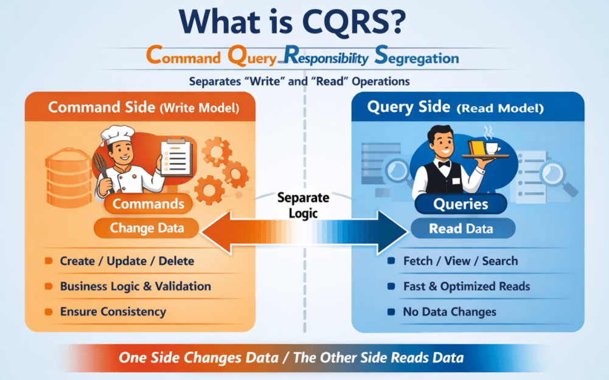
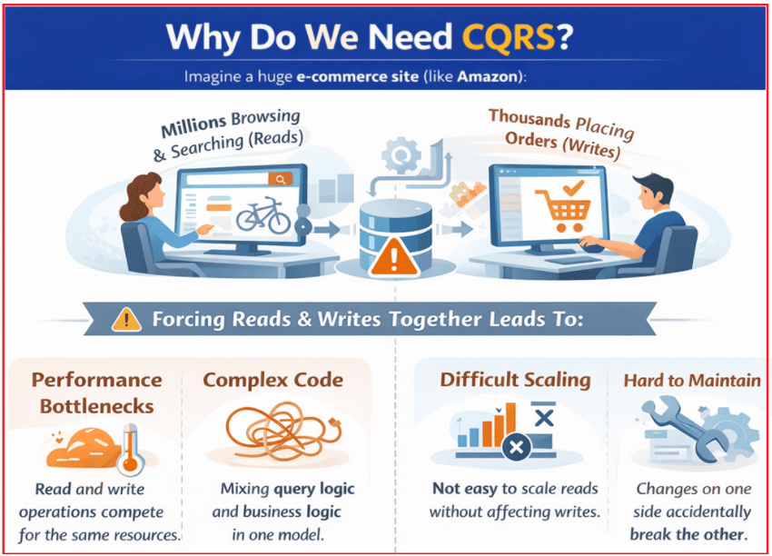
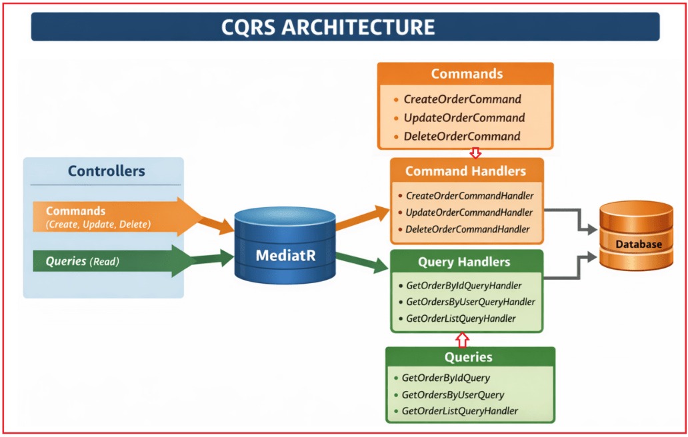
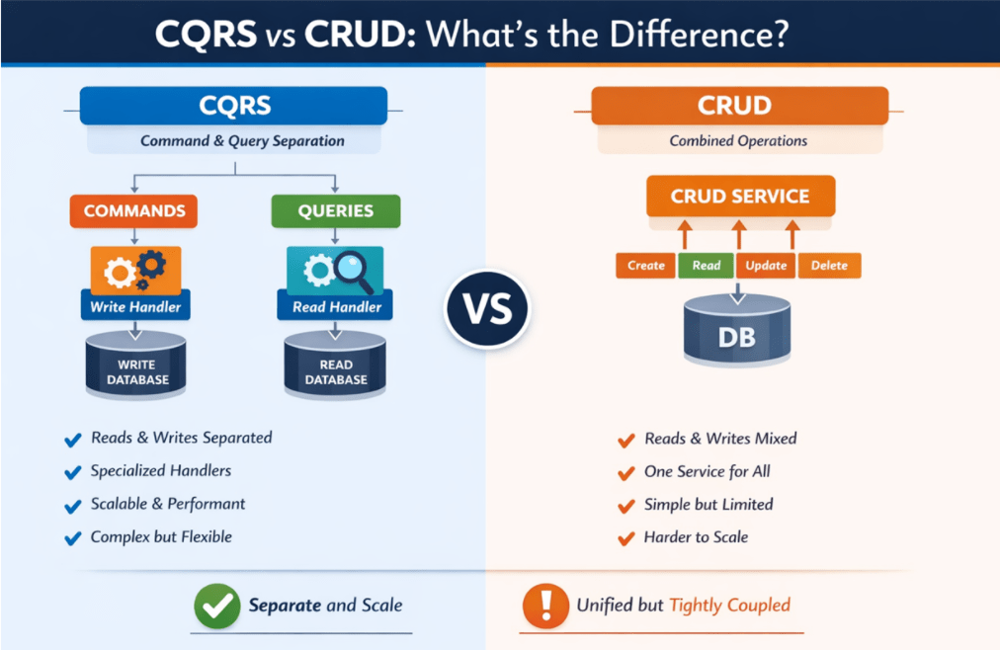
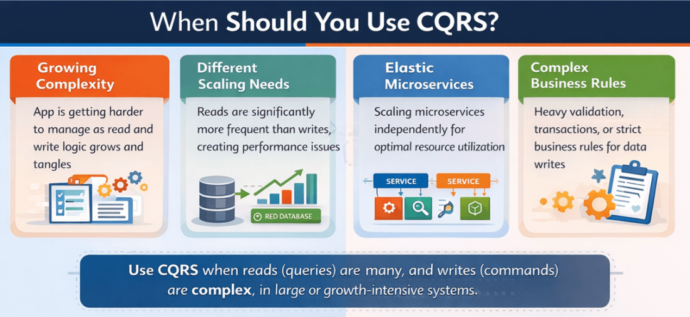
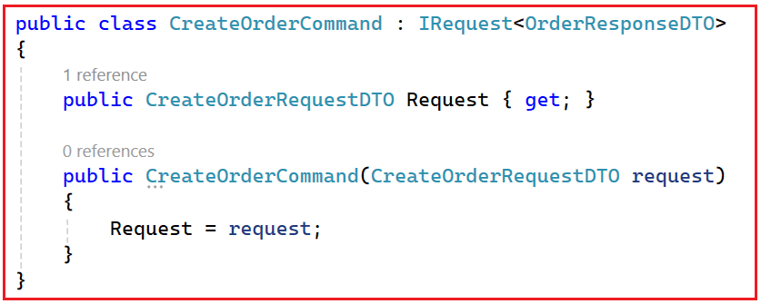
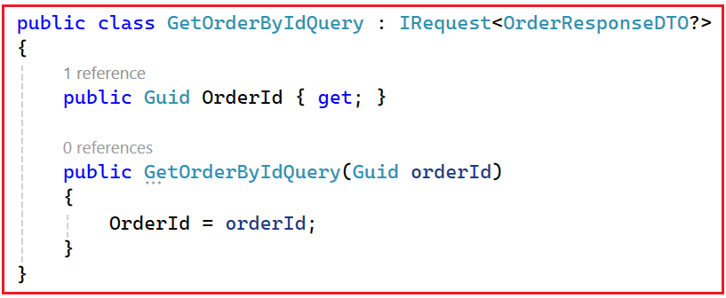
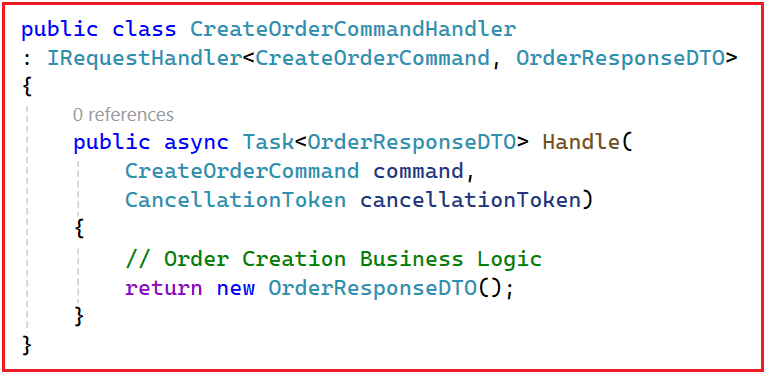
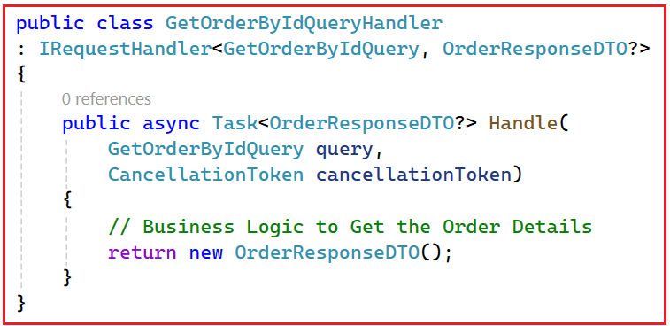

## **CQRS در میکروسرویس‌های ASP.NET Core Web API**

در این پست، در مورد CQRS در ASP.NET Core Web API بحث خواهم کرد. در برنامه‌های دنیای واقعی، به خصوص در **میکروسرویس‌های .NET Core**، ما مرتباً دو کار انجام می‌دهیم: **داده‌ها را می‌نویسیم** (ایجاد/به‌روزرسانی/حذف) و **داده‌ها را می‌خوانیم** (لیست‌ها، جستجو، داشبوردها، گزارش‌ها). اکثر مبتدیان همه چیز را با استفاده از مدل‌های مشابه و سرویس‌های مشابه برای خواندن و نوشتن می‌سازند.

این روش برای پروژه‌های کوچک خوب جواب می‌دهد، اما با رشد سیستم، اغلب منجر به **کند شدن صفحه نمایش، درهم‌تنیدگی کد و مشکلات مقیاس‌بندی می‌شود**، زیرا عملیات خواندن و نوشتن نیازهای بسیار متفاوتی دارند. برای مدیریت این رشد به روشی تمیزتر، معماران از **CQRS (تفکیک مسئولیت پرس‌وجوی فرمان)** استفاده می‌کنند، الگویی که **مسئولیت‌های نوشتن (دستورات) را** از **مسئولیت‌های خواندن (پرس‌وجوها) جدا می‌کند و به هر طرف اجازه می‌دهد تا برای هدف خاص خود طراحی و بهینه‌سازی شود**.

### **CQRS در ASP.NET Core چیست؟**

**CQRS** مخفف **تفکیک مسئولیت پرس‌وجوی فرمان** است. این یک **الگوی معماری/طراحی** است که می‌گوید: **منطقی که داده‌ها را تغییر می‌دهد (دستورات) را از منطقی که داده‌ها را می‌خواند (پرس‌وجوها) جدا کنید.** برای درک بهتر، لطفاً به نمودار زیر نگاهی بیندازید:



بیایید آن را به ساده‌ترین شکل ممکن تجزیه و تحلیل کنیم:

##### **فرمان**

- دستورالعملی که **سیستم را تغییر می‌دهد**.
- مثال‌ها: ایجادکاربر، ثبت سفارش، به‌روزرسانی پروفایل، حذف محصول
- دستورات **داده‌ها را تغییر می‌دهند** و معمولاً فقط یک نتیجه کوچک، مانند موفقیت/شکست یا یک شناسه، برمی‌گردانند.

##### **پرس و جو**

- درخواستی برای **دریافت اطلاعات**
- مثال‌ها: GetUserDetails، ListOrders، SearchProducts، DashboardReport
- کوئری‌ها **فقط داده‌ها را می‌خوانند** و نباید **چیزی را تغییر دهند**.

بنابراین، به جای اینکه یک سرویس/متد/مدل همه کارها (خواندن + نوشتن) را انجام دهد، CQRS **دو مسیر جداگانه** ایجاد می‌کند:

- **سمت فرمان (مدل نوشتن):** بر **قوانین تجاری، اعتبارسنجی، سازگاری و به‌روزرسانی‌های صحیح تمرکز دارد.**
- **سمت پرس‌وجو (مدل خواندن):** بر **خواندن سریع، فیلتر کردن، مرتب‌سازی، جستجو و بازگرداندن داده‌ها به شکل دقیقی که رابط کاربری نیاز دارد، تمرکز دارد.**

##### **قیاس ساده (رستوران)**

CQRS را مانند یک رستوران در نظر بگیرید:

- **پیشخدمت = پرس و جو (خواندن)**
  - شما از پیشخدمت می‌پرسید: «می‌توانم منو را ببینم؟» یا «کل صورتحساب من چقدر می‌شود؟»
  - پیشخدمت فقط **به شما اطلاعات می‌دهد**. هیچ چیز در آشپزخانه تغییر نمی‌کند.
- **سرآشپز = دستور (نوشتن)**
  - شما می‌گویید: «یک ماسالا دوسا و یک قهوه درست کنید.»
  - سرآشپز **با تهیه غذای جدید، وضعیت** آشپزخانه را تغییر می‌دهد.

به همین ترتیب، در یک سیستم مبتنی بر CQRS:

- **پرس‌وجوها** → فقط **داده‌ها را بخوانید**، بدون تغییر.
- **دستورات** → **اصلاح داده‌ها** (درج، به‌روزرسانی، حذف).

**به طور خلاصه،** CQRS یک الگوی طراحی است که عملیات خواندن (query) و عملیات نوشتن (commands) را به مدل‌ها و منطق‌های مجزا تفکیک می‌کند و به هر طرف اجازه می‌دهد تا ساده، کارآمد و نگهداری آن آسان باشد. این جداسازی، برنامه‌ها را تمیزتر، سریع‌تر و مقیاس‌پذیرتر می‌کند، به خصوص در سیستم‌های بزرگ مبتنی بر میکروسرویس.

### **چرا در ASP.NET Core به CQRS نیاز داریم؟**

ما **زمانی به CQRS** نیاز داریم که یک برنامه آنقدر بزرگ شود که مدیریت **همزمان خواندن و نوشتن**، سیستم را کند، **آن را شلوغ و مقیاس‌پذیری را دشوار کند**. برای درک بهتر، لطفاً به نمودار زیر نگاهی بیندازید:



به یک پلتفرم تجارت الکترونیک بزرگ (مانند سیستم‌هایی به سبک آمازون) فکر کنید:

- **میلیون‌ها کاربر** هستند **دائماً در حال مرور محصولات، جستجو و مشاهده داشبوردها** → اینها **خوانده می‌شوند**
- **کاربران کمتری** سفارش می‌دهند **، پروفایل‌هایشان را به‌روزرسانی می‌کنند، نقد می‌نویسند** → اینها **نوشته‌ها هستند**

وقتی سرویس‌ها و مدل‌های یکسانی هم خواندن و هم نوشتن را مدیریت می‌کنند، مشکلات شروع به ظاهر شدن می‌کنند:

- **سرویس‌ها بیش از حد بزرگ و گیج‌کننده می‌شوند،** زیرا هم شامل منطق پرس‌وجوی سنگین (فیلترها، اتصال‌ها، گزارش‌ها) و هم منطق نوشتن دقیق (اعتبارسنجی‌ها، قوانین کسب‌وکار، تراکنش‌ها) هستند.
- **عملکرد دچار مشکل می‌شود** زیرا درخواست‌های خواندن (که بیشترین ترافیک را تشکیل می‌دهند) با عملیات نوشتن برای منابع یکسان رقابت می‌کنند.
- **مقیاس‌بندی دشوار می‌شود** زیرا نمی‌توانید خواندن‌ها را جدا از نوشتن‌ها مقیاس‌بندی کنید، اگرچه خواندن‌ها معمولاً به مقیاس‌بندی بسیار بیشتری نیاز دارند.
- **تغییرات خطرناک می‌شوند** زیرا تغییر منطق پرس‌وجو برای یک صفحه جدید می‌تواند به‌طور تصادفی بر منطق نوشتن تأثیر بگذارد و تغییر قوانین نوشتن می‌تواند خواندن را مختل یا کند کند.
- **نگهداری و آزمایش سخت‌تر می‌شود** زیرا همه چیز در یک مکان با هم مخلوط شده است.

**CQRS این مشکل را با تفکیک واضح مسئولیت‌ها حل می‌کند:**

- بخش فرمان **(نوشتن)** بر صحت، اعتبارسنجی و قوانین کسب‌وکار تمرکز دارد.
- بخش پرس‌وجو **(خواندن)** بر بازیابی سریع و انعطاف‌پذیر داده‌ها (فیلترها، مرتب‌سازی، ذخیره‌سازی، پیش‌بینی‌ها) تمرکز دارد.

**در یک خط:** ما زمانی به CQRS نیاز داریم که برنامه ما بیش از حد پیچیده و بزرگ شود تا بتواند **خواندن و نوشتن را با منطق یکسان** و به طور ایمن و کارآمد مدیریت کند.

CQRS با ارائه موارد زیر به ما کمک می‌کند:

- تفکیک واضح دغدغه‌ها
- کد تمیزتر و قابل فهم تر
- عملکرد و مقیاس‌پذیری بهتر
- تست و نگهداری آسان‌تر

##### **قیاس ساده**

مثل این است که یک باجه شلوغ بانک را به دو قسمت تقسیم کنید:

- یک شمارنده برای **واریز/برداشت** (می‌نویسد، دقیق و کند)
- پیشخوان دیگری برای **استعلام موجودی** (خواندن، سریع و مکرر)

این جداسازی، سیستم را **تمیزتر، سریع‌تر، مقیاس‌پذیرتر و ایمن‌تر برای تغییر** می‌کند، و دقیقاً به همین دلیل است که به CQRS نیاز داریم.

### **معماری CQRS:**

برای درک بهتر معماری CQRS، لطفاً به نمودار زیر مراجعه کنید.



این معماری **هفت جزء اصلی** دارد:

1. کنترل‌کننده‌ها
2. مدیاتور
3. دستورات
4. کنترل‌کننده‌های فرمان
5. پرس‌وجوها
6. کنترل‌کننده‌های پرس‌وجو
7. پایگاه داده

#### **جزء ۱: کنترل‌کننده‌ها - نقطه ورود سیستم**

کنترلرها **نقطه شروع** هر درخواستی هستند.

- آنها درخواست‌های HTTP را از کلاینت‌ها (مثلاً رابط کاربری، برنامه موبایل، پستچی) دریافت می‌کنند.
- کنترلرها **شامل منطق کسب و کار نیستند**.
- تنها مسئولیت آنها این است که:
  - ایجاد یک **دستور** یا **پرس و جو**
  - ارسال آن به **MediatR**

کنترل‌کننده‌ها مستقیماً با هندلرها یا پایگاه داده صحبت نمی‌کنند.

#### **جزء ۲: MediatR – توزیع‌کننده مرکزی (لایه میانی)**

MediatR مانند یک **کنترل‌کننده ترافیک** یا **اداره پست** عمل می‌کند. کاری که MediatR انجام می‌دهد:

- یک دستور یا پرس و جو از کنترلر دریافت می‌کند
- **هندلر صحیح** را پیدا می‌کند
- هندلر را اجرا می‌کند
- نتیجه را به کنترلر برمی‌گرداند

مهم:

- کنترل‌کننده‌ها **نمی‌دانند** کدام کنترل‌کننده منطق را اجرا می‌کند
- مدیران **نمی‌دانند** چه کسی درخواست را ارسال کرده است

این کار اتصال محکم را از بین می‌برد و معماری را تمیز نگه می‌دارد.

#### **بخش ۳: دستورات - چه عملی باید انجام شود؟**

دستورات، **نیت نوشتن را** نشان می‌دهند. از نمودار:

- دستور CreateOrder
- دستور UpdateOrder
- دستور DeleteOrder

ویژگی‌های کلیدی:

- دستورات **تغییر وضعیت سیستم**
- آنها توصیف می‌کنند **که چه کاری باید انجام شود**، نه **چگونه**
- آنها معمولاً برمی‌گردند:
  - موفقیت / شکست
  - بولی
  - شناسه ایجاد شده یا به‌روزرسانی شده

درک مثال: CreateOrderCommand به وضوح به معنای ایجاد یک سفارش جدید است.

#### **بخش ۴: کنترل‌کننده‌های فرمان - جایی که منطق نوشتن (Write Logic) قرار دارد**

کنترل‌کننده‌های فرمان (Command Handlers) **منطق کسب‌وکار را برای نوشتن** اجرا می‌کنند. از نمودار:

- کنترل‌کننده‌ی دستور CreateOrder
- کنترل‌کننده‌ی دستور به‌روزرسانی
- کنترل‌کننده‌ی دستور حذف

مسئولیت‌های یک مدیر فرمان:

- اعتبارسنجی ورودی
- اعمال قوانین کسب و کار
- اصلاح موجودیت‌ها
- ذخیره تغییرات در پایگاه داده
- انتشار رویدادها (در صورت نیاز)

قانون مهم: **یک دستور → یک کنترل‌کننده → یک مسئولیت**. این کار گردش‌های کاری نوشتن را تمیز و قابل آزمایش نگه می‌دارد.

#### **جزء ۵: پرس‌وجوها - اطلاعات را در اختیار من قرار دهید**

پرس‌وجوها (querys) نشان‌دهنده **درخواست‌های خواندن** هستند. از نمودار:

- GetOrderByIdQuery
- GetOrdersByUserQuery
- GetOrderListQuery

ویژگی‌های کلیدی:

- پرس‌وجوها **داده‌ها را تغییر نمی‌دهند**
- کوئری‌ها فقط **داده‌ها را می‌خوانند و برمی‌گردانند**
- آنها DTO هایی را که برای رابط کاربری/صفحه نمایش طراحی شده‌اند، برمی‌گردانند.

درک مثال: GetOrdersByUserQuery به وضوح به معنای واکشی سفارشات برای یک کاربر است

#### **کامپوننت-۶: کنترل‌کننده‌های پرس‌وجو - منطق خواندن بهینه‌شده**

کنترل‌کننده‌های پرس‌وجو (Query Handlers) **عملیات فقط خواندنی را** مدیریت می‌کنند. از نمودار:

- GetOrderByIdQueryHandler
- GetOrdersByUserQueryHandler
- GetOrderListQueryHandler

مسئولیت‌ها:

- اجرای کوئری‌های خواندن سریع
- اعمال فیلتر، صفحه‌بندی و مرتب‌سازی
- نگاشت داده‌ها به DTOهای پاسخ
- هرگز پایگاه داده را به‌روزرسانی نکنید

قانون: کنترل‌کننده‌های پرس‌وجو **هرگز نباید وضعیت را تغییر دهند**

#### **جزء ۷: پایگاه داده - یک پایگاه داده، دو مسیر**

توضیح مهم از نمودار:

- **فقط یک پایگاه داده وجود دارد**
- هر دو دستور و کوئری از یک پایگاه داده استفاده می‌کنند
- CQRS در اینجا در مورد **جداسازی منطق** است، نه پایگاه‌های داده

بعداً (اختیاری):

- همین معماری می‌تواند از موارد زیر پشتیبانی کند:
  - ذخیره سازی
  - کپی‌ها را بخوانید
  - پایگاه داده خواندن جداگانه
  - اما **اجباری نیست**.

### **CQRS در مقابل CRUD: تفاوت چیست؟**

هر دو **CRUD** و **CQRS** با خواندن و تغییر داده‌ها سروکار دارند، اما سیستم را به روش‌های بسیار متفاوتی سازماندهی می‌کنند.



##### **عملیات CRUD (ایجاد، خواندن، به‌روزرسانی، حذف)**

در رویکرد سنتی **CRUD**:

- شما معمولاً **از یک مدل (موجودیت)** برای **خواندن و نوشتن استفاده می‌کنید**
- شما معمولاً **یک کنترلر/سرویس** دارید که شامل متدهایی مانند: Get، GetById، Post، Put، Delete است.
- منطق خواندن و نوشتن **به شدت به هم وابسته** است (در یک لایه و اغلب با جریان کد یکسان ترکیب می‌شوند)

**مناسب برای:** برنامه‌های کوچک تا متوسط، یادگیری و قوانین ساده کسب و کار.

##### **CQRS (تفکیک مسئولیت پرس‌وجوهای فرمان)**

در **رویکرد CQRS**:

- **دستورات،** مدیریت می‌کنند **نوشتن‌ها را** (ایجاد/به‌روزرسانی/حذف)
- **کوئری‌ها** مدیریت می‌کنند **خواندن‌ها را** (دریافت/جستجو/لیست/گزارش)
- شما اغلب از **مدل‌های جداگانه** استفاده می‌کنید:
  - مدل نوشتن بر **قوانین کسب و کار، اعتبارسنجی و صحت تمرکز دارد.**
  - مدل خواندن بر **سرعت، فیلتر کردن و داده‌های سازگار با رابط کاربری تمرکز دارد.**
- شما معمولاً از **Command Handlers** و **Query Handlers** (مسئولیت‌های جداگانه) استفاده می‌کنید.
- گاهی اوقات (نه همیشه)، خواندن و نوشتن حتی می‌توانند **از پایگاه‌های داده مختلف** برای مقیاس‌بندی مستقل استفاده کنند.

**بهترین برای:** سیستم‌های بزرگ یا پیچیده، برنامه‌های کاربردی با حجم خواندن بالا، میکروسرویس‌ها و نیازهای مقیاس‌پذیری بالا.

###### **ساده‌ترین راه برای به خاطر سپردن**

- **CRUD:** یک مسیر برای همه چیز (مدل یکسان + خط لوله یکسان برای خواندن و نوشتن)
- **CQRS:** دو لاین مجزا
  - یک خط برای **کامیون‌های سنگین** (همراه با اعتبارسنجی‌ها و قوانین نوشته شده است)
  - یک لاین برای **ماشین‌های سریع** (برای سرعت و نیازهای رابط کاربری بهینه شده است)

این تفاوت اصلی است که دانش‌آموزان باید به خاطر داشته باشند.

### **چه زمانی باید از CQRS در میکروسرویس‌های ASP.NET Core استفاده کنید؟**

شما باید **زمانی از CQRS** استفاده کنید که برنامه شما به اندازه‌ای بزرگ شود که مدیریت **خواندن و نوشتن با همان مدل و منطق،** باعث ایجاد مشکلات عملکرد، مقیاس‌بندی یا نگهداری شود. CQRS قدرتمند است، اما ساختار و قطعات متحرک اضافه می‌کند، بنابراین فقط زمانی باید استفاده شود **که مزایای واضحی داشته باشد**.



#### **سناریوهای خوبی که CQRS در آنها منطقی به نظر می‌رسد**

##### **نسبت بالای خواندن به نوشتن (سیستم‌های با حجم بالای خواندن)**

- وقتی بیشتر درخواست‌ها خواندنی هستند (مرور، جستجو، داشبورد، گزارش‌ها) و تنها بخش کوچکی از آنها نوشتنی است.
- مثال: مرور کاتالوگ محصولات، جستجوی هتل/پرواز، داشبوردهای مدیریتی، صفحات تحلیلی/گزارش‌دهی.

##### **قوانین پیچیده کسب و کار در سمت نوشتن**

- وقتی عملیات نوشتن ساده نباشد، «ذخیره داده‌ها» نیست، بلکه شامل گردش کار و قوانین سختگیرانه است.
- مثال: ثبت سفارش، تأیید وام، شروع بازپرداخت، لغو رزرو، رزرو موجودی - که در آن اعتبارسنجی و ثبات اهمیت زیادی دارد.

##### **رابط کاربری به شکل داده متفاوتی نسبت به مدل دامنه نیاز دارد**

- مدل نوشتن برای صحت و روابط طراحی شده است، اما رابط کاربری اغلب داده‌های مسطح، ترکیبی یا تجمیعی را می‌خواهد.
- مثال: «جزئیات سفارش به همراه نام مشتری، مبلغ کل، تاریخ آخرین پرداخت» در یک پاسخ سریع.
  CQRS امکان یک مدل خواندن جداگانه را فراهم می‌کند که برای چنین صفحات نمایشی بهینه شده است.

##### **شما باید خواندن و نوشتن را به طور متفاوتی مقیاس‌بندی کنید**

- اگر خواندن‌ها نیاز به ذخیره‌سازی موقت (caching)، کپی‌های خواندن یا حتی یک پایگاه داده جداگانه برای خواندن داشته باشند، در حالی که نوشتن‌ها باید دقیق و تراکنشی باقی بمانند. CQRS این جداسازی را آسان‌تر و ایمن‌تر می‌کند.

#### **چه زمانی CQRS معمولاً بیش از حد مورد استفاده قرار می‌گیرد (از آن اجتناب کنید)**

- **برنامه‌های کوچک و ساده CRUD** (پنل‌های مدیریت پایه، نمونه‌های اولیه، MVPها)
- **پرسش‌های ساده و قوانین تجاری ساده**
- **تیم‌های بسیار کوچک یا توسعه در مراحل اولیه**، جایی که سادگی و سرعت بیش از معماری پیشرفته اهمیت دارند
- **وقتی نمی‌توانید ثبات نهایی را تحمل کنید** (در مواردی که هر خواندن باید فوراً هر نوشتن را منعکس کند)

**قاعده کلی (بهترین توصیه عملی):** با **CRUD** برای سادگی **شروع کنید. فقط زمانی به CQRS** سیستم **بروید که بار خواندن، پیچیدگی نوشتن یا نیازهای مقیاس‌بندی**، ساختار اضافی را به وضوح توجیه کند.

#### **درک CQRS در مقابل CRUD: سوالاتی که هر دانش‌آموزی می‌پرسد**

##### **دانشجو:**

آقا، من همین الان هم از چندین DTO مثل CreateOrderDTO، UpdateOrderDTO و OrderResponseDTO استفاده می‌کنم. پس چرا مردم می‌گویند CRUD بد است و CQRS بهتر است؟

##### **مربی:**

اول از همه، این را به وضوح به خاطر داشته باشید: **CRUD بد نیست.** CRUD برای بسیاری از پروژه‌ها کاملاً مناسب است. همچنین، استفاده از DTO های مختلف یک **روش خوب** است - شما کار درستی انجام می‌دهید.
اما DTOها و CQRSها **مشکلات متفاوتی را** حل می‌کنند.

##### **دانشجو:**

مشکلات مختلف؟ چگونه؟

##### **مربی:**

- DTOها **شکل داده‌ها را** از هم جدا می‌کنند.
- CQRS **عملیات (اکشن‌ها) را** از هم جدا می‌کند.

بنابراین: **DTOها = «چه داده‌ای؟»** و **CQRS = «چه عملی؟»**

##### **دانشجو:**

من هنوز گیج هستم. میشه یه مثال ساده بزنید؟

##### **مربی:**

بله. به یک سرویس CRUD معمولی نگاه کنید:

- ایجادسفارش(ایجادسفارشDTO)
- UpdateOrder(مرجع UpdateOrderDTO)
- GetOrderById(شناسه)

حالا مشکل: **UpdateOrder() واقعاً به چه معناست؟**

آیا این است:

- تغییر آدرس؟
- تایید پرداخت؟
- سفارش را لغو کردن؟
- تغییر وضعیت؟

حتی اگر از DTO متفاوتی استفاده کنید، هدف از عمل **نامشخص** باقی می‌ماند.

##### **دانشجو:**

اوه! بنابراین، یک DTO می‌گوید چه داده‌هایی را نشان می‌دهد، اما دقیقاً نمی‌گوید چه عملی را انجام می‌دهم.

##### **مربی:**

دقیقاً.

##### **دانشجو:**

پس CQRS چگونه این مشکل را حل می‌کند؟

##### **مربی:**

CQRS با استفاده از نام‌های واضح، عمل را صریح می‌کند:

- دستور تایید سفارش
- دستور لغو سفارش
- دستور تغییر وضعیت سفارش
- GetOrderByIdQuery

فقط با خواندن نام، همه می‌دانند:

- **چه عملی** در حال وقوع است
- باشد **چه نوشتن (دستور)** و چه **خواندن (پرس و جو)**

حدس زدنی در کار نیست.

##### **دانشجو:**

بنابراین CQRS عمدتاً در مورد وضوح است؟

##### **مربی:**

بله، وضوح و کنترل. CQRS به این سوال به روشنی پاسخ می‌دهد: **کاربر دقیقاً چه کاری می‌خواهد انجام دهد؟** این موضوع در سیستم‌های واقعی که اقدامات تجاری پیچیده می‌شوند، بسیار مهم است.

##### **دانشجو:**

اما CQRS کلاس‌های زیادی ایجاد می‌کند. آیا این زیاده‌روی نیست؟

##### **مربی:**

این می‌تواند برای پروژه‌های کوچک زیاده‌روی باشد. اما در پروژه‌های واقعی، یک سرویس بزرگ به دلایل زیر دشوار می‌شود:

- عظیم می‌شود.
- اشکال‌زدایی سخت‌تر می‌شود
- آزمایش سخت‌تر می‌شود
- قوانین کسب‌وکار با منطق پرس‌وجو مخلوط می‌شوند

CQRS فایل‌های بیشتری ایجاد می‌کند، اما هر فایل **کوچک، متمرکز و قابل توضیح** می‌شود.

##### **دانشجو:**

آیا CQRS عملکرد را بهبود می‌بخشد؟

##### **مربی:**

نه به طور خودکار. CQRS **جادو نیست**. اگر از همان پایگاه داده و کوئری‌ها استفاده کنید، ممکن است هیچ پیشرفتی در سرعت مشاهده نکنید. عملکرد فقط زمانی بهبود می‌یابد که از CQRS همراه با مواردی مانند موارد زیر استفاده کنید:

- بهینه‌سازی پرس‌وجو (تصویرسازی، تعداد اتصالات کمتر)
- ذخیره سازی برای کوئری های خوانده شده
- خواندن کپی‌ها / خواندن جداگانه پایگاه داده
- مدل‌های مختلف خواندن (برای داشبوردها و لیست‌ها)

بنابراین CQRS ارائه می‌دهد **ابتدا ساختار را** و سپس **گزینه‌های مقیاس‌بندی** را ارائه می‌دهد.

##### **دانشجو:**

پس چرا شرکت‌ها در پروژه‌های واقعی از CQRS استفاده می‌کنند؟

##### **مربی:**

چون پروژه‌های واقعی رشد می‌کنند. اقدامات پیچیده می‌شوند:

- ایجاد سفارش
- سفارش را تأیید کنید
- لغو سفارش
- سفارش بازپرداخت
- تغییر وضعیت با قوانین
- حفظ تاریخچه وضعیت

CQRS این اقدامات را **تمیز و ایزوله** نگه می‌دارد، بنابراین کد حتی پس از ۱ تا ۲ سال قابل مدیریت باقی می‌ماند.

##### **دانشجو:**

بنابراین، آیا همیشه باید از CQRS استفاده کنم؟

##### **مربی:**

خیر. از CQRS همه جا استفاده نکنید. فقط زمانی از CQRS استفاده کنید که ماژول موارد زیر را داشته باشد:

- گردش‌های کاری پیچیده و قوانین تجاری
- صفحات خواندن متنوع و فراوان (فیلترها، لیست‌ها، جدول‌های زمانی، داشبوردها)
- تغییرات مکرر در الزامات

##### **دانشجو:**

چه زمانی CRUD + DTO کافی است؟

##### **مربی:**

CRUD + DTO زمانی عالی است که:

- ماژول ساده است (جداول اصلی پایه)
- قوانین کسب و کار حداقلی هستند
- تعداد کم صفحه نمایش و تعداد کم تغییرات API
- تیم کوچک/مرحله یادگیری

اکثر پروژه‌های دانشجویی در همه جا به CQRS نیاز ندارند.

##### **دانشجو:**

میشه تفاوت مصاحبه‌ها رو تو یه خط خلاصه کنید؟

##### **مربی:**

بله:
**DTOها داده‌ها را جدا می‌کنند. CQRS اقدامات (نوشتن در مقابل خواندن) را جدا می‌کند.**

##### **دانشجو:**

بنابراین، استفاده از DTOها به این معنی نیست که من از CQRS استفاده می‌کنم؟

##### **مربی:**

درست است. می‌توانید داشته باشید:

- **CRUD + DTO ها** (رایج و خوب)
- **CQRS + DTOها** (برای ماژول‌های پیچیده رایج است)

DTOها و CQRS مستقل هستند.

##### **خلاصه:**

CQRS (تفکیک مسئولیت پرس‌وجوی فرمان) جادو نیست؛ بلکه یک ایده ساده اما قدرتمند است: **نحوه نوشتن داده‌ها (دستورات) را از نحوه خواندن داده‌ها (پرس‌وجوها) جدا کنید**. این جداسازی، **سمت نوشتن را تمیز و مبتنی بر قانون** (اعتبارسنجی‌ها، منطق کسب‌وکار، سازگاری) نگه می‌دارد، در حالی که به **سمت خواندن اجازه می‌دهد سریع و انعطاف‌پذیر باشد** (جستجو، فیلتر کردن، داشبورد، داده‌های سازگار با رابط کاربری).

CQRS برای هر برنامه CRUD کوچکی مورد نیاز نیست، اما وقتی یک سیستم رشد می‌کند، به خصوص در **میکروسرویس‌ها** با ترافیک خواندن سنگین و گردش‌های کاری پیچیده، CQRS روشی واضح‌تر، مقیاس‌پذیرتر و قابل نگهداری‌تر برای مدیریت آن رشد ارائه می‌دهد.

### **پیاده‌سازی الگوی CQRS با استفاده از MediatR در ASP.NET Core**

وقتی عملیات نوشتن و خواندن را از نظر مفهومی از هم جدا کردیم، قدم بعدی پیاده‌سازی تمیز آنها در کد است. حال، سوال بعدی این است: **چگونه این را به طور تمیز در سرویس سفارش دات‌نت خود پیاده‌سازی کنیم؟**

پیاده‌سازی خواهیم کرد ما CQRS را در .NET Core با استفاده از کتابخانه MediatR. MediatR مانند یک **خط لوله پیام‌رسانی (Messaging Pipeline)** در داخل برنامه عمل می‌کند:

1. ایجاد می‌کنیم. **Command** یا **Query** یک کلاس
2. ما آن را با استفاده از **\_mediator.Send(…) ارسال می‌کنیم.**
3. صحیح را پیدا می‌کند **MediatR هندلر** .
4. کنترل‌کننده منطق را اجرا می‌کند و نتیجه را برمی‌گرداند.

این امر وابستگی‌های مستقیم بین کنترلرها و سرویس‌ها را حذف می‌کند و یک معماری تمیز را ممکن می‌سازد. برای درک واضح CQRS، ابتدا باید سه بلوک اصلی سازنده آن را درک کنیم: **Command**، **Query** و **Handler**.

#### **دستور - عملیات نوشتن**

یک **دستور (Command)** درخواستی برای انجام عملی است که **وضعیت برنامه را تغییر می‌دهد**، مانند درج، به‌روزرسانی یا حذف داده‌ها.

##### **یک دستور شامل چه چیزهایی است؟**

- داده‌های ورودی مورد نیاز برای انجام عملیات
- قصد (چه عملی باید اتفاق بیفتد)
- بدون منطق تجاری
- معمولاً خروجی کوچکی (وضعیت، شناسه، مقدار موفقیت یا گاهی اوقات یک شیء پیچیده) برمی‌گرداند.
- پس از خلقت تغییرناپذیر

###### **قیاس در زندگی واقعی**

وقتی روی **ثبت سفارش** در آمازون کلیک می‌کنید، به سیستم دستور می‌دهید که:

- ایجاد سفارش
- کاهش موجودی
- ذخیره جزئیات تراکنش

این یک فرمان است.

###### **نحو: ایجاد یک دستور:**



###### **توضیح نحو**

- **CreateOrderCommand** → این نوع دستور است. **MediatR** استفاده می‌کند. **از این نوع** برای یافتن کنترل‌کننده‌ی منطبق
- **IRequest\<OrderResponseDTO>** → این نوع بازگشتی مورد انتظار برای این دستور را اعلام می‌کند. به MediatR می‌گوید: وقتی این دستور با موفقیت مدیریت شود، کنترل‌کننده یک OrderResponseDTO برمی‌گرداند.
- **ویژگی‌های فقط خواندنی + سازنده** : به این ترتیب دستور را **تغییرناپذیر** می‌کنیم. داده‌های درخواست پس از ایجاد قابل تغییر نیستند، که از عوارض جانبی تصادفی در لایه‌های مختلف جلوگیری می‌کند.

#### **عملیات پرس و جو - خواندن**

یک **پرس‌وجو (Query)** نشان دهنده یک درخواست خواندن است، مانند دریافت یک سفارش، فهرست کردن سفارش‌ها یا بازگرداندن تاریخچه وضعیت. یک پرس‌وجو فقط باید داده‌ها را بازیابی و برگرداند؛ نباید چیزی را به‌روزرسانی کند.

##### **یک کوئری شامل چه چیزهایی است؟**

- پارامترهای ورودی برای جستجو
- بدون عملیات نوشتن
- بازیابی داده‌های خالص
- DTO(ها) یا یک شیء واحد را برمی‌گرداند

###### **قیاس در زندگی واقعی**

وقتی روی **«پیگیری سفارش من»** در آمازون کلیک می‌کنید:

- سیستم وضعیت سفارش شما را دریافت می‌کند.
- هیچ تغییری در پایگاه داده ایجاد نمی‌شود.

این یک پرس و جو است.

###### **سینتکس پرس و جو:**



###### **توضیح نحو**

- **GetOrderByIdQuery:** این نوع پرس‌وجو است. MediatR از این **نوع** برای یافتن هندلر منطبق استفاده می‌کند.
- **IRequest<OrderResponseDTO?>:** علامت ? نشان می‌دهد که سفارش ممکن است وجود نداشته باشد. برگرداندن nullable روشی تمیز برای انعکاس «یافت نشد» بدون استثنا برای سناریوهای خواندن معمولی است.
- **ورودی حداقلی:** کوئری‌ها باید فقط آنچه را که برای خواندن لازم است، حمل کنند. در اینجا، فقط OrderId است. این کار کوئری‌ها را ساده و قابل پیش‌بینی نگه می‌دارد.

#### **هندلر - جایی که منطق زندگی می‌کند**

هندلرها **قلب CQRS** هستند. هر دستور یا پرس‌وجو هندلر اختصاصی خود را دارد که شامل **منطق کسب‌وکار واقعی** است. اینجاست که MediatR درخواست را ارسال می‌کند.

##### **کنترل‌کننده‌ی فرمان (کنترل‌کننده‌ی سمت نوشتن)**

این کنترل‌کننده یک دستور را پردازش می‌کند و تغییرات را به صورت ایمن انجام می‌دهد:

- اعتبارسنجی ورودی‌ها و قوانین کسب‌وکار
- بارگذاری موجودیت‌ها/مجموعه‌های مورد نیاز
- منطق دامنه (تغییر وضعیت) را اعمال می‌کند
- تغییرات را ذخیره می‌کند (اغلب با استفاده از یک تراکنش)
- در صورت نیاز، ممکن است رویدادها را مطرح/منتشر کند

###### **سینتکس کنترل‌کننده فرمان:**



###### **توضیح نحو**

- **IRequestHandler<CreateOrderCommand, OrderResponseDTO>:** این قرارداد MediatR است. معنای تحت‌اللفظی آن این است: من می‌توانم CreateOrderCommand را مدیریت کنم و OrderResponseDTO را برمی‌گردانم.
- **Handle(…):** این متدی است که MediatR فراخوانی می‌کند. پارامتر، شیء دستور شماست؛ مقدار بازگشتی، نوع پاسخی است که در IRequest\<T> اعلام کرده‌اید.
- **CancellationToken:** ASP.NET Core این را از طریق این متد عبور می‌دهد تا عملیات طولانی مدت (قطع ارتباط کلاینت، وقفه‌های زمانی) بتوانند با خیال راحت لغو شوند. بهتر است در صورت امکان، آن را به فراخوانی‌های EF Core و فراخوانی‌های HTTP کلاینت منتقل کنید.

#### **کنترل‌کننده‌ی پرس‌وجو (کنترل‌کننده‌ی سمت خواندن)**

این هندلر باید برای خواندن بهینه شده باشد. باید روی کوئری‌های سریع پایگاه داده، نگاشت به DTOها و بازگرداندن نتایج تمرکز کند. باید از تغییرات وضعیت دامنه به طور کامل اجتناب کند. قانون «عدم تغییر وضعیت» همان چیزی است که CQRS را تمیز نگه می‌دارد و از نوشتن‌های تصادفی از نقاط انتهایی خواندن جلوگیری می‌کند.

###### **سینتکس مدیریت کننده پرس و جو:**



###### **توضیح نحو**

- فقط **داده‌ها را می‌خواند** - بدون تغییر
- موجودیت نقشه‌ها → DTO
- یک پاسخ تمیز برمی‌گرداند

##### **نحوه استفاده از IMediator برای ارسال دستورات و پرس و جوها**

برای اجرای یک دستور/پرس‌وجو، باید IMediator را تزریق کنیم و متد .Send(…) را فراخوانی کنیم. MediatR هندلر صحیح را پیدا می‌کند، متد Handle را فراخوانی می‌کند و نتیجه را برمی‌گرداند.

- **دستور ارسال:** **await \_mediator.Send(new CreateOrderCommand(request));**
- **ارسال کوئری:** **await \_mediator.Send(new GetOrderByIdQuery(orderId));**

###### **کاری که MediatR در پشت صحنه انجام می‌دهد**

- هندلر صحیح را پیدا می‌کند
- با اجرای متد Handle، منطق کنترل‌کننده را اجرا می‌کند.
- نتیجه را به فراخواننده برمی‌گرداند
- جریان وابستگی را مدیریت می‌کند (بدون اتصال محکم)
- معماری تمیز و قابل آزمایش را تقویت می‌کند

برای مثال، با موارد زیر مطابقت دارد:

- **دستور CreateOrderCommand** **→ IRequestHandler<CreateOrderCommand, OrderResponseDTO>**
- **GetOrderByIdQuery** → **IRequestHandler<GetOrderByIdQuery, OrderResponseDTO?>**

سپس متد Handle مربوط به handler را اجرا می‌کند و خروجی handler را برمی‌گرداند.

#### **مرحله ۱ – افزودن MediatR به OrderService**

اولین قدم **اضافه کردن کتابخانه MediatR** به پروژه‌هایی است که قرار است از آن استفاده کنیم. ما به MediatR در موارد زیر نیاز داریم:

- **OrderService.Application** → زیرا در اینجا موارد زیر را تعریف خواهیم کرد:
  - دستورات
  - پرس‌وجوها
  - هندلرها (منطق کسب و کار)
- **OrderService.API** → زیرا اینجا جایی است که MediatR را در کانتینر DI (Program.cs) ثبت خواهیم کرد.

##### **اضافه کردن بسته NuGet با استفاده از کنسول مدیریت بسته‌ها**

در **هر دو** پروژه (OrderService.Application و OrderService.API)، دستور زیر را در **Package Manager Console** اجرا کنید:

- **نصب بسته MediatR**

#### **مرحله ۲ - تعریف دستورات سفارش (سمت نوشتن)**

ابتدا، پوشه‌ای به نام **Orders** در **پروژه لایه OrderService.Application** ایجاد کنید. سپس، یک زیرپوشه به نام **Commands** در **پوشه Orders** اضافه کنید که در آن تمام دستورات خود را ایجاد خواهیم کرد. این دستورات **حاوی منطق نیستند** توصیف می‌کنند. *؛ آنها فقط کاری را که* می‌خواهیم با انواع قوی انجام دهیم

##### **دستور CreateOrder.cs**

این کلاس نشان‌دهنده‌ی **قصد ایجاد یک سفارش جدید** در سیستم است. این کلاس هیچ منطق تجاری ندارد؛ در عوض، تمام داده‌های مورد نیاز برای ایجاد یک سفارش، مانند جزئیات درخواست سفارش و توکن دسترسی کاربر را در خود جای می‌دهد. تغییرناپذیر نگه داشتن دستور پس از ایجاد، تضمین می‌کند که عملیات نوشتن هنگام جریان از طریق MediatR به سمت کنترل‌کننده‌اش، قابل پیش‌بینی و ایمن باقی بماند. یک فایل کلاس با نام **CreateOrderCommand.cs** در **پوشه‌ی Orders/Commands** ایجاد کنید، سپس کد زیر را در آن کپی و پیست کنید.

```csharp
using MediatR;
using OrderService.Application.DTOs.Order;

namespace OrderService.Application.Orders.Commands
{
    // CQRS Command:
    // Represents a "WRITE" operation (i.e., it changes system state).
    // This command encapsulates everything needed to create an order:
    // 1) The order creation request payload (CreateOrderRequestDTO)
    // 2) The AccessToken (so the handler can call other microservices securely if needed)
    // This is a CQRS Command that will be handled by a corresponding Command Handler.
    // - It does NOT contain business logic.
    // - It only carries the data required to perform the "Create Order" operation.
    // - MediatR will pass this object to a handler that implements:
    //     IRequestHandler<CreateOrderCommand, OrderResponseDTO>
    // - The handler will return an OrderResponseDTO as the result.
    public class CreateOrderCommand : IRequest<OrderResponseDTO>
    {
        // The payload sent from the API/client containing all
        // the necessary information to create an order (user, items, addresses, etc.).
        // This is read-only (only getter) so the command is immutable after creation,
        // which is a good CQRS practice (commands should not change after being created).
        public CreateOrderRequestDTO Request { get; }

        // JWT / access token of the current user.
        // - The command handler might need to call other microservices (UserService, ProductService, PaymentService)
        //   using the user's identity/authorization context.
        // - This keeps the handler self-sufficient without depending on HttpContext.
        public string AccessToken { get; }

        // Initializes a new instance of the CreateOrderCommand class.
        // Parameters:
        // request: The input DTO coming from the client, containing order details.
        // accessToken: The bearer token used for downstream service calls.
        public CreateOrderCommand(CreateOrderRequestDTO request, string accessToken)
        {
            // Ensure the request DTO is not null.
            // If it is null, the command is invalid because we cannot create an order without data.
            Request = request ?? throw new ArgumentNullException(nameof(request));

            // Ensure access token is not null.
            // If token is null, handler may fail when calling other services or validating the user.
            AccessToken = accessToken ?? throw new ArgumentNullException(nameof(accessToken));
        }
    }
}
```

##### **دستور ConfirmOrder.cs**

این کلاس نشان‌دهنده‌ی **هدف تأیید سفارش موجود** پس از تأیید پرداخت است. این کلاس فقط شناسه‌ی سفارش و توکن دسترسی مورد نیاز برای فراخوانی‌های سرویس پایین‌دستی را در خود جای داده است. مسئولیت آن محدود به توصیف آنچه باید اتفاق بیفتد (تأیید سفارش) است، نه نحوه‌ی وقوع آن، که کاملاً توسط کنترل‌کننده‌ی دستور مربوطه مدیریت می‌شود. ایجاد کنید **یک فایل کلاس با نام ConfirmOrderCommand.cs** در **پوشه‌ی Orders/Commands**، سپس کد زیر را در آن کپی-پیست کنید.

```csharp
using MediatR;

namespace OrderService.Application.Orders.Commands
{
    // CQRS Command:
    // Represents a "WRITE" operation because confirming an order changes the system state
    // (for example, OrderStatus changes from Pending -> Confirmed and events may be published).
    // What this command carries:
    // 1) OrderId     -> Which order should be confirmed
    // 2) AccessToken -> So the handler can securely call other microservices (Payment/User/etc.)
    //                  without depending on HttpContext inside the Application layer.
    // MediatR Flow:
    // - This command will be sent using: IMediator.Send(new ConfirmOrderCommand(...))
    // - MediatR will route it to a handler that implements:
    //     IRequestHandler<ConfirmOrderCommand, bool>
    // - The handler returns a bool:
    //     true  => order confirmed successfully
    //     false => confirmation failed (or you may throw exceptions for failures)
    public class ConfirmOrderCommand : IRequest<bool>
    {
        // The unique identifier of the order we want to confirm.
        // - The handler will:
        //   * Load the order from the database using this ID.
        //   * Validate that the order exists and is in "Pending" state.
        //   * Then confirm it if payment is successful.
        public Guid OrderId { get; }

        // JWT / access token of the current caller.
        // - Used by the handler to:
        //   * Call PaymentService to verify payment status.
        //   * Call UserService to fetch user details (for events/notifications).
        // - Passing this token into the command makes the handler self-contained,
        //   so it doesn't need direct access to HttpContext or other web-layer details.
        public string AccessToken { get; }

        // Constructor:
        // Creates a new ConfirmOrderCommand instance with the required data.
        // Parameters:
        // orderId     : The ID of the order that needs to be confirmed.
        // accessToken : The bearer token used for downstream service calls
        //               (PaymentService, UserService, etc.).
        public ConfirmOrderCommand(Guid orderId, string accessToken)
        {
            // Simply assign the order ID.
            OrderId = orderId;

            // Ensure access token is not null.
            // If token is null, handler may fail when calling other services or validating security context.
            AccessToken = accessToken ?? throw new ArgumentNullException(nameof(accessToken));
        }
    }
}
```

##### **دستور ChangeOrderStatus.cs**

این کلاس نشان‌دهنده‌ی **قصد تغییر** **وضعیت یک سفارش** است که معمولاً توسط یک مدیر یا یک فرآیند سیستمی آغاز می‌شود. این کلاس یک DTO درخواست را که شامل وضعیت جدید، توضیحات و اطلاعات عامل است، در بر می‌گیرد. خود دستور بدون منطق و تغییرناپذیر باقی می‌ماند و فقط به عنوان یک پیام ساختاریافته که درخواست تغییر وضعیت را بیان می‌کند، عمل می‌کند. ایجاد کنید **یک فایل کلاس به نام ChangeOrderStatusCommand.cs** در **پوشه‌ی Orders/Commands**، سپس کد زیر را در آن کپی و پیست کنید.

```csharp
using MediatR;
using OrderService.Application.DTOs.Order;

namespace OrderService.Application.Orders.Commands
{
    // CQRS Command:
    // Represents a "WRITE" operation that changes the status of an existing order.
    //
    // When is this used?
    // - When an admin or a system process wants to:
    //   * Move an order from Pending -> Shipped
    //   * Shipped -> Delivered
    //   * Pending/Confirmed -> Cancelled, etc.
    //
    // What does this command carry?
    // - A ChangeOrderStatusRequestDTO that contains:
    //   * OrderId       : Which order to update
    //   * NewStatus     : The new status (enum)
    //   * ChangedBy     : Who is performing the change (user/system)
    //   * Remarks       : Optional comments or reason
    //
    // IMPORTANT:
    // - This command does NOT contain business logic itself.
    // - It only represents the "intent" to change the status.
    // - MediatR will forward this to a handler that implements:
    //     IRequestHandler<ChangeOrderStatusCommand, ChangeOrderStatusResponseDTO>
    // - The handler will:
    //   * Validate the order
    //   * Apply the new status
    //   * Persist changes
    //   * And return a ChangeOrderStatusResponseDTO describing the outcome.
    public class ChangeOrderStatusCommand : IRequest<ChangeOrderStatusResponseDTO>
    {
        // The payload sent from the API/client containing the details required
        // to change the order status.
        // Typical fields inside ChangeOrderStatusRequestDTO might be:
        // - OrderId
        // - NewStatus
        // - Reason / Remarks
        // - UpdatedBy (optional)
        // The property is read-only (getter only), so once the command is created,
        // you cannot change the request inside it. This is a good CQRS practice:
        // commands should be immutable after creation.
        public ChangeOrderStatusRequestDTO Request { get; }

        // Constructor:
        // Creates a new ChangeOrderStatusCommand with the provided request DTO.
        // Parameters:
        // request : The DTO that contains all details required to change the order status.
        public ChangeOrderStatusCommand(ChangeOrderStatusRequestDTO request)
        {
            // Validate that the request is not null.
            // If the request is null, the command is invalid because we don't know:
            // - which order to update
            // - what status to set
            // - who is performing the change, etc.
            Request = request ?? throw new ArgumentNullException(nameof(request));
        }
    }
}
```

#### **مرحله ۳ - پیاده‌سازی کنترل‌کننده‌های فرمان**

حالا می‌خواهیم هندلرهایی را پیاده‌سازی کنیم که شامل **منطق کسب‌وکار** باشند. ابتدا، یک زیرپوشه به نام **Handlers** در **پوشه Orders** اضافه کنید و سپس زیرپوشه دیگری به نام **Commands** در **پوشه Orders/Handlers** اضافه کنید، جایی که تمام هندلرهای مربوط به Commands را ایجاد خواهیم کرد.

##### **فایل CreateOrderCommandHandler.cs**

این هندلر شامل **گردش کار کامل کسب و کار برای ایجاد سفارش** است. این هندلر کاربر را اعتبارسنجی می‌کند، موجودی محصول را بررسی می‌کند، تجمیع سفارش را می‌سازد، قیمت‌گذاری را محاسبه می‌کند، داده‌ها را ذخیره می‌کند، پرداخت را آغاز می‌کند و در صورت نیاز رویدادهای ادغام را منتشر می‌کند. این کلاس نقطه مرکزی هماهنگی برای ایجاد یک سفارش است و به وضوح نشان می‌دهد که چرا هندلرهای CQRS چیزی بیش از عملیات CRUD ساده هستند. یک فایل کلاس به نام **CreateOrderCommandHandler.cs** در **پوشه Orders/Handlers/Commands** ایجاد کنید، سپس کد زیر را در آن کپی و پیست کنید.

```csharp
using AutoMapper;
using MediatR;
using Messaging.Common.Events;
using Messaging.Common.Models;
using Microsoft.Extensions.Configuration;
using Microsoft.Extensions.Logging;
using OrderService.Application.DTOs.Order;
using OrderService.Application.Orders.Commands;
using OrderService.Contracts.DTOs;
using OrderService.Contracts.Enums;
using OrderService.Contracts.ExternalServices;
using OrderService.Contracts.Messaging;
using OrderService.Domain.Entities;
using OrderService.Domain.Enums;
using OrderService.Domain.Repositories;

namespace OrderService.Application.Orders.Handlers.Commands
{
    // CQRS Command Handler:
    // Handles the CreateOrderCommand and returns an OrderResponseDTO.
    // Business meaning:
    // - This is the "WRITE" side operation that:
    //   1) Validates user and addresses via User Microservice.
    //   2) Validates product stock via Product Microservice.
    //   3) Builds the Order aggregate with items, policies, and pricing.
    //   4) Calculates discount, tax, shipping, and total.
    //   5) Persists the Order in the database.
    //   6) Initiates payment via Payment Microservice.
    //   7) For COD:
    //        * Immediately publishes an OrderPlacedEvent to RabbitMQ so:
    //            - ProductService can reserve/reduce stock.
    //            - NotificationService can send order-confirmation messages.
    //      For Online payment:
    //        * Returns payment URL and keeps order in Pending state.
    public class CreateOrderCommandHandler : IRequestHandler<CreateOrderCommand, OrderResponseDTO>
    {
        // Repository for reading/writing orders to the database.
        private readonly IOrderRepository _orderRepository;

        // User Microservice client:
        // - Validate that user exists.
        // - Manage addresses (save/update).
        private readonly IUserServiceClient _userServiceClient;

        // Product Microservice client:
        // - Validate product stock.
        // - Fetch latest product details (price, discount, etc.).
        private readonly IProductServiceClient _productServiceClient;

        // Payment Microservice client:
        // - Initiate payment for NON-COD orders.
        private readonly IPaymentServiceClient _paymentServiceClient;

        // Master data repository:
        // - Fetch cancellation and return policies.
        // - Fetch discounts and tax rules.
        private readonly IMasterDataRepository _masterDataRepository;

        // AutoMapper:
        // - Map Order entity -> OrderResponseDTO.
        private readonly IMapper _mapper;

        // Configuration:
        // - Used for shipping configuration (free threshold, charges, etc.).
        private readonly IConfiguration _configuration;

        // Publisher for OrderPlacedEvent:
        // - Sends integration events to RabbitMQ.
        private readonly IOrderPlacedEventPublisher _publisher;

        // Logger:
        // - Used to log errors and diagnostics.
        private readonly ILogger<CreateOrderCommandHandler> _logger;

        // Constructor:
        // All dependencies are injected via DI.
        // Note: notificationServiceClient is injected but not stored in a field.
        //       You can later use it directly for synchronous notifications if needed.
        public CreateOrderCommandHandler(
            IOrderRepository orderRepository,
            IUserServiceClient userServiceClient,
            IProductServiceClient productServiceClient,
            IPaymentServiceClient paymentServiceClient,
            IMasterDataRepository masterDataRepository,
            IMapper mapper,
            IConfiguration configuration,
            IOrderPlacedEventPublisher publisher,
            ILogger<CreateOrderCommandHandler> logger)
        {
            _orderRepository = orderRepository ?? throw new ArgumentNullException(nameof(orderRepository));
            _userServiceClient = userServiceClient ?? throw new ArgumentNullException(nameof(userServiceClient));
            _productServiceClient = productServiceClient ?? throw new ArgumentNullException(nameof(productServiceClient));
            _paymentServiceClient = paymentServiceClient ?? throw new ArgumentNullException(nameof(paymentServiceClient));
            _masterDataRepository = masterDataRepository ?? throw new ArgumentNullException(nameof(masterDataRepository));
            _mapper = mapper ?? throw new ArgumentNullException(nameof(mapper));
            _configuration = configuration ?? throw new ArgumentNullException(nameof(configuration));
            _publisher = publisher ?? throw new ArgumentNullException(nameof(publisher));
            _logger = logger ?? throw new ArgumentNullException(nameof(logger));
        }

        // Handle method:
        // This is the core logic for creating an order.
        // High-level flow:
        // 1) Validate basic request (non-null, has items).
        // 2) Validate user existence in UserService.
        // 3) Resolve shipping/billing address IDs (existing or newly created).
        // 4) Validate product availability (stock check).
        // 5) Fetch latest product details.
        // 6) Build the Order + items (with policies).
        // 7) Calculate discounts, tax, shipping, and total.
        // 8) Persist the order via repository.
        // 9) Initiate payment via PaymentService.
        // 10) For COD:
        //      - Publish OrderPlacedEvent immediately.
        //      - Return Confirmed order DTO.
        //     For Online payment:
        //      - Return Pending order DTO + PaymentUrl.
        public async Task<OrderResponseDTO> Handle(CreateOrderCommand command, CancellationToken cancellationToken)
        {
            // Extract the data from the command.
            var request = command.Request;
            var accessToken = command.AccessToken;

            // 1. Basic validation of the incoming request.
            if (request == null)
                throw new ArgumentNullException(nameof(request));

            // Ensure there is at least one order item.
            if (request.Items == null || !request.Items.Any())
                throw new ArgumentException("Order must have at least one item.");

            // 2. Validate that the user exists in the User Microservice.
            //    - If user doesn't exist, we cannot proceed with the order.
            var user = await _userServiceClient.GetUserByIdAsync(request.UserId, accessToken);
            if (user == null)
                throw new InvalidOperationException("User does not exist.");

            // 3. Resolve Shipping Address ID:
            //    - If ShippingAddressId is provided, use it.
            //    - Otherwise, if ShippingAddress DTO is provided, save it via UserService and get its ID.
            //    - This ensures we always have a valid ShippingAddressId to store in the Order.
            Guid? shippingAddressId = null;
            if (request.ShippingAddressId != null)
            {
                // Use existing shipping address ID.
                shippingAddressId = request.ShippingAddressId;
            }
            else if (request.ShippingAddress != null)
            {
                // Create/update shipping address in User Microservice and use the returned ID.
                request.ShippingAddress.UserId = request.UserId;
                shippingAddressId = await _userServiceClient.SaveOrUpdateAddressAsync(request.ShippingAddress, accessToken);
            }

            // 4. Resolve Billing Address ID:
            //    - Same logic as shipping address (existing ID or create new).
            Guid? billingAddressId = null;
            if (request.BillingAddressId != null)
            {
                billingAddressId = request.BillingAddressId;
            }
            else if (request.BillingAddress != null)
            {
                request.BillingAddress.UserId = request.UserId;
                billingAddressId = await _userServiceClient.SaveOrUpdateAddressAsync(request.BillingAddress, accessToken);
            }

            // Ensure both addresses are present at this point.
            if (shippingAddressId == null || billingAddressId == null)
                throw new ArgumentException("Both ShippingAddressId and BillingAddressId must be provided or created.");

            // 5. Validate product stock availability but DO NOT reduce stock yet.
            //    - This is just a pre-check; actual stock reduction will be done
            //      by ProductService when it consumes the OrderPlacedEvent.
            var stockCheckRequests = request.Items.Select(i => new ProductStockVerificationRequestDTO
            {
                ProductId = i.ProductId,
                Quantity = i.Quantity
            }).ToList();

            var stockValidation = await _productServiceClient.CheckProductsAvailabilityAsync(stockCheckRequests, accessToken);
            if (stockValidation == null || stockValidation.Any(x => !x.IsValidProduct || !x.IsQuantityAvailable))
                throw new InvalidOperationException("One or more products are invalid or out of stock.");

            // 6. Retrieve the latest product info for accurate pricing/discount.
            //    - This ensures we don't rely on stale price data sent from the client.
            var productIds = request.Items.Select(i => i.ProductId).ToList();
            var products = await _productServiceClient.GetProductsByIdsAsync(productIds, accessToken);
            if (products == null || products.Count != productIds.Count)
                throw new InvalidOperationException("Failed to retrieve product details for all items.");

            try
            {
                // 7. Fetch policy data from MasterData (if applicable).
                int? cancellationPolicyId = null;
                int? returnPolicyId = null;

                var cancellationPolicy = await _masterDataRepository.GetActiveCancellationPolicyAsync();
                if (cancellationPolicy != null)
                    cancellationPolicyId = cancellationPolicy.Id;

                var returnPolicy = await _masterDataRepository.GetActiveReturnPolicyAsync();
                if (returnPolicy != null)
                    returnPolicyId = returnPolicy.Id;

                // 8. Prepare order identity and timestamps.
                var orderId = Guid.NewGuid();
                var orderNumber = GenerateOrderNumberFromGuid(orderId); // Human-friendly readable ID.
                var now = DateTime.UtcNow;

                // Determine initial order status based on payment method:
                // - COD:
                //    * We treat it as Confirmed immediately.
                //    * Stock will be reduced after event is processed.
                // - Online:
                //    * Start as Pending until payment is completed.
                var initialStatus = request.PaymentMethod == PaymentMethodEnum.COD
                    ? OrderStatusEnum.Confirmed
                    : OrderStatusEnum.Pending;

                // 9. Create the Order entity (aggregate root).
                var order = new Order
                {
                    Id = orderId,
                    OrderNumber = orderNumber,
                    UserId = request.UserId,
                    ShippingAddressId = shippingAddressId.Value,
                    BillingAddressId = billingAddressId.Value,
                    PaymentMethod = request.PaymentMethod.ToString(),
                    OrderStatusId = (int)initialStatus,
                    CreatedAt = now,
                    OrderDate = now,
                    CancellationPolicyId = cancellationPolicyId,
                    ReturnPolicyId = returnPolicyId,
                    OrderItems = new List<OrderItem>()
                };

                // 10. Add OrderItems using fresh product data from ProductService.
                foreach (var item in request.Items)
                {
                    // Find matching product details.
                    var product = products.First(p => p.Id == item.ProductId);

                    order.OrderItems.Add(new OrderItem
                    {
                        Id = Guid.NewGuid(),
                        OrderId = order.Id,
                        ProductId = product.Id,
                        ProductName = product.Name,
                        PriceAtPurchase = product.Price,
                        DiscountedPrice = product.DiscountedPrice,
                        Quantity = item.Quantity,
                        ItemStatusId = (int)initialStatus
                    });
                }

                // 11. Calculate pricing (Subtotal, Discount, Tax, Shipping, Total).
                //     - SubTotalAmount: Sum of price * quantity, before discounts.
                order.SubTotalAmount = Math.Round(
                    order.OrderItems.Sum(i => i.PriceAtPurchase * i.Quantity),
                    2,
                    MidpointRounding.AwayFromZero);

                //     - DiscountAmount: Product-level discounts + best order-level discount.
                order.DiscountAmount = Math.Round(
                    await CalculateDiscountAmountAsync(order.OrderItems),
                    2,
                    MidpointRounding.AwayFromZero);

                //     - TaxAmount: Taxes applied on (Subtotal - Discount).
                order.TaxAmount = Math.Round(
                    await CalculateTaxAmountAsync(order.SubTotalAmount - order.DiscountAmount),
                    2,
                    MidpointRounding.AwayFromZero);

                //     - ShippingCharges: Based on total after discount and config rules.
                order.ShippingCharges = Math.Round(
                    CalculateShippingCharges(order.SubTotalAmount - order.DiscountAmount),
                    2,
                    MidpointRounding.AwayFromZero);

                //     - TotalAmount: Final amount the customer has to pay.
                order.TotalAmount = Math.Round(
                    order.SubTotalAmount - order.DiscountAmount + order.TaxAmount + order.ShippingCharges,
                    2,
                    MidpointRounding.AwayFromZero);

                // 12. Persist the Order in the database.
                var addedOrder = await _orderRepository.AddAsync(order);
                if (addedOrder == null)
                    throw new InvalidOperationException("Failed to create order.");

                // 13. Initiate payment via Payment Microservice.
                //     - Even for COD, you might still record a "zero" or "COD" payment entry.
                var paymentRequest = new CreatePaymentRequestDTO
                {
                    OrderId = order.Id,
                    UserId = order.UserId,
                    Amount = order.TotalAmount,
                    PaymentMethod = request.PaymentMethod
                };

                var paymentResponse = await _paymentServiceClient.InitiatePaymentAsync(paymentRequest, accessToken);
                if (paymentResponse == null)
                    throw new InvalidOperationException("Payment initiation failed.");

                // 14. Behavior differs based on payment method:

                // Case A: COD (Cash on Delivery)
                // - Order is already marked as Confirmed.
                // - We immediately publish OrderPlacedEvent so ProductService and NotificationService can act.
                if (request.PaymentMethod == PaymentMethodEnum.COD)
                {
                    #region Event Publishing to RabbitMQ

                    var orderPlacedEvent = new OrderPlacedEvent
                    {
                        OrderId = order.Id,
                        OrderNumber = order.OrderNumber,
                        UserId = order.UserId,
                        CustomerName = user.FullName,
                        CustomerEmail = user.Email,
                        PhoneNumber = user.PhoneNumber,
                        TotalAmount = order.TotalAmount,
                        CorrelationId = order.Id.ToString(),
                        Items = order.OrderItems.Select(i => new OrderLineItem
                        {
                            ProductId = i.ProductId,
                            Name = i.ProductName,
                            Quantity = i.Quantity,
                            UnitPrice = i.PriceAtPurchase
                        }).ToList()
                    };

                    // Publish integration event:
                    // - ProductService: Reserve/reduce stock.
                    // - NotificationService: Send order confirmation.
                    await _publisher.PublishOrderPlacedAsync(orderPlacedEvent);

                    #endregion

                    // Map Order -> OrderResponseDTO and adjust status/payment info for COD.
                    var orderDto = _mapper.Map<OrderResponseDTO>(order);
                    orderDto.OrderStatus = OrderStatusEnum.Confirmed;
                    orderDto.PaymentMethod = PaymentMethodEnum.COD;
                    orderDto.PaymentUrl = null; // No payment URL for COD.

                    return orderDto;
                }
                else
                {
                    // Case B: Online Payment
                    // - Order is in Pending state.
                    // - We return the payment URL so the client can redirect the user to payment page.
                    var orderDto = _mapper.Map<OrderResponseDTO>(order);
                    orderDto.OrderStatus = OrderStatusEnum.Pending;
                    orderDto.PaymentMethod = request.PaymentMethod;
                    orderDto.PaymentUrl = paymentResponse.PaymentUrl;

                    return orderDto;
                }
            }
            catch (Exception ex)
            {
                // Log the error with user context (UserId) for easier debugging.
                _logger.LogError(ex, "Error while creating order for user {UserId}", command.Request.UserId);

                // Re-throw the exception so upper layers (API, orchestrator, etc.) can handle it.
                throw;
            }
        }

        #region Private Helpers (moved from OrderService)

        // Calculates total discount: product-level + best order-level discount.
        // Product-level:
        // - Based on difference between PriceAtPurchase and DiscountedPrice * Quantity.
        // Order-level:
        // - Based on active discounts configured in master data.
        // - Applies the single "best" discount (highest percentage or amount).
        private async Task<decimal> CalculateDiscountAmountAsync(IEnumerable<OrderItem> orderItems)
        {
            decimal productLevelDiscountTotal = 0m;

            // Sum discounts applied on individual products (multiplied by quantity).
            foreach (var item in orderItems)
            {
                productLevelDiscountTotal += (item.PriceAtPurchase - item.DiscountedPrice) * item.Quantity;
            }

            decimal orderLevelDiscount = 0m;
            DateTime today = DateTime.UtcNow.Date;

            // Retrieve currently active order-level discounts.
            var activeOrderDiscounts = await _masterDataRepository.GetActiveDiscountsAsync(today);

            // Select the best discount (simple rule: highest effective value).
            var bestOrderDiscount = activeOrderDiscounts
                .Where(d => d.IsActive && d.StartDate <= today && d.EndDate >= today)
                .OrderByDescending(d => d.DiscountType == DiscountTypeEnum.Percentage
                    ? d.DiscountPercentage ?? 0
                    : d.DiscountAmount ?? 0)
                .FirstOrDefault();

            if (bestOrderDiscount != null)
            {
                // Compute order subtotal AFTER product-level discounts (using DiscountedPrice).
                decimal orderSubtotal = orderItems.Sum(i => i.DiscountedPrice * i.Quantity);

                if (bestOrderDiscount.DiscountType == DiscountTypeEnum.Percentage &&
                    bestOrderDiscount.DiscountPercentage.HasValue)
                {
                    // Percentage-based discount on orderSubtotal.
                    orderLevelDiscount = orderSubtotal * (bestOrderDiscount.DiscountPercentage.Value / 100m);
                }
                else if (bestOrderDiscount.DiscountType == DiscountTypeEnum.FixedAmount &&
                         bestOrderDiscount.DiscountAmount.HasValue)
                {
                    // Fixed-amount discount (e.g., ₹200 off).
                    orderLevelDiscount = bestOrderDiscount.DiscountAmount.Value;
                }
            }

            // Final discount = product-level discounts + best order-level discount.
            return productLevelDiscountTotal + orderLevelDiscount;
        }

        // Calculates total tax based on active tax rules and the taxable amount.
        // TaxableAmount:
        // - Typically (Subtotal - Discount).
        // Tax rules:
        // - Fetched from master data.
        // - Only active taxes within valid date range are applied.
        private async Task<decimal> CalculateTaxAmountAsync(decimal taxableAmount)
        {
            decimal totalTax = 0m;
            DateTime today = DateTime.UtcNow.Date;

            var activeTaxes = await _masterDataRepository.GetActiveTaxesAsync(today);

            foreach (var tax in activeTaxes)
            {
                // Apply only active taxes within valid date range.
                if (tax.IsActive &&
                    (!tax.ValidTo.HasValue || tax.ValidTo >= today) &&
                    tax.ValidFrom <= today)
                {
                    // In this example, we apply tax only to products.
                    if (tax.AppliesToProduct)
                    {
                        totalTax += taxableAmount * (tax.TaxPercentage / 100m);
                    }
                }
            }

            return totalTax;
        }

        // Calculates shipping charges based on:
        // - Whether shipping charge is enabled.
        // - Free shipping threshold.
        // - Flat shipping charge from configuration.
        private decimal CalculateShippingCharges(decimal orderTotal)
        {
            bool isShippingAllowed = _configuration.GetValue<bool>("ShippingConfig:IsShippingChargeAllowed");
            decimal freeShippingThreshold = _configuration.GetValue<decimal>("ShippingConfig:FreeShippingThreshold");
            decimal shippingCharge = _configuration.GetValue<decimal>("ShippingConfig:ShippingCharge");

            // If shipping charges are disabled, always return 0.
            if (!isShippingAllowed)
                return 0m;

            // If the order total exceeds the free shipping threshold, no shipping charge.
            if (orderTotal >= freeShippingThreshold)
                return 0m;

            // Otherwise, apply the configured flat shipping charge.
            return shippingCharge;
        }

        // Generates a human-readable Order Number from a GUID.
        // Format example:
        //   ORD20260110ABCDE123
        // where:
        //   - "ORD"       : Prefix.
        //   - "20260110"  : Current date (yyyyMMdd).
        //   - "ABCDE123"  : Last 8 characters of GUID (uppercase).
        private string GenerateOrderNumberFromGuid(Guid orderId)
        {
            var prefix = "ORD";
            var datePart = DateTime.UtcNow.ToString("yyyyMMdd");

            // Get last 8 characters from GUID string (without dashes).
            var guidString = orderId.ToString("N"); // N = digits only, no dashes.
            var guidSuffix = guidString.Substring(guidString.Length - 8, 8).ToUpper();

            return $"{prefix}{datePart}{guidSuffix}";
        }

        #endregion
    }
}
```

##### **فایل ConfirmOrderCommandHandler.cs**

این هندلر مسئول **تأیید ایمن سفارش** پس از تکمیل پرداخت است. این هندلر وضعیت فعلی سفارش را تأیید می‌کند، وضعیت پرداخت را از طریق میکروسرویس Payment تأیید می‌کند، وضعیت سفارش را به‌روزرسانی می‌کند و یک رویداد ادغام برای سایر سرویس‌ها مانند Product و Notification منتشر می‌کند. تمام قوانین تأیید و عوارض جانبی در اینجا متمرکز شده‌اند. ایجاد کنید **یک فایل کلاس با نام ConfirmOrderCommandHandler.cs** در **پوشه Orders/Handlers/Commands**، سپس کد زیر را در آن کپی و پیست کنید.

```csharp
using MediatR;
using Messaging.Common.Events;
using Messaging.Common.Models;
using Microsoft.Extensions.Logging;
using OrderService.Application.Orders.Commands;
using OrderService.Contracts.DTOs;
using OrderService.Contracts.Enums;
using OrderService.Contracts.ExternalServices;
using OrderService.Contracts.Messaging;
using OrderService.Domain.Repositories;

namespace OrderService.Application.Orders.Handlers.Commands
{
    // CQRS Command Handler:
    // Handles the ConfirmOrderCommand and returns a boolean indicating success.
    // Business meaning:
    // - This is the "WRITE" side operation that:
    //   1) Validates that an order is in a Pending state.
    //   2) Verifies payment status with the Payment Microservice.
    //   3) Updates the order status to Confirmed in the database.
    //   4) Publishes an OrderPlacedEvent to RabbitMQ so:
    //        - ProductService can reserve/reduce stock.
    //        - NotificationService can send email/SMS/notification to the user.
    // Why a handler (and not just a service method)?
    // - To implement CQRS with MediatR:
    //   * Controller/Service sends ConfirmOrderCommand.
    //   * MediatR routes it to this handler.
    //   * This handler performs the full confirmation process.
    public class ConfirmOrderCommandHandler : IRequestHandler<ConfirmOrderCommand, bool>
    {
        // Repository for accessing and updating Order data in the database.
        private readonly IOrderRepository _orderRepository;

        // Client for calling the Payment Microservice.
        // - Used to verify that the payment for this order is completed.
        private readonly IPaymentServiceClient _paymentServiceClient;

        // Client for calling the User Microservice.
        // - Used to fetch user details (name, email, phone) for event/notification.
        private readonly IUserServiceClient _userServiceClient;

        // Abstraction over RabbitMQ publisher for OrderPlacedEvent.
        // - Sends the integration event to the broker so other services can react.
        private readonly IOrderPlacedEventPublisher _publisher;

        // Logger for capturing errors and useful diagnostic information.
        private readonly ILogger<ConfirmOrderCommandHandler> _logger;

        // Constructor:
        // ------------
        // All dependencies are injected via DI.
        //
        // Parameters:
        // orderRepository       : For reading/updating orders.
        // paymentServiceClient  : For fetching payment status.
        // userServiceClient     : For fetching user details.
        // publisher             : For publishing OrderPlacedEvent to RabbitMQ.
        // logger                : For logging errors and debugging info.
        public ConfirmOrderCommandHandler(
            IOrderRepository orderRepository,
            IPaymentServiceClient paymentServiceClient,
            IUserServiceClient userServiceClient,
            IOrderPlacedEventPublisher publisher,
            ILogger<ConfirmOrderCommandHandler> logger)
        {
            _orderRepository = orderRepository ?? throw new ArgumentNullException(nameof(orderRepository));
            _paymentServiceClient = paymentServiceClient ?? throw new ArgumentNullException(nameof(paymentServiceClient));
            _userServiceClient = userServiceClient ?? throw new ArgumentNullException(nameof(userServiceClient));
            _publisher = publisher ?? throw new ArgumentNullException(nameof(publisher));
            _logger = logger ?? throw new ArgumentNullException(nameof(logger));
        }

        // Handle method:
        // --------------
        // This is the core logic executed when ConfirmOrderCommand is sent.
        //
        // Steps:
        // 1) Load order by ID.
        // 2) Ensure order is in Pending status.
        // 3) Verify payment info from PaymentService.
        // 4) Ensure payment is Completed.
        // 5) Fetch user details from UserService.
        // 6) Change order status to Confirmed in database.
        // 7) Publish OrderPlacedEvent to RabbitMQ.
        //
        // Returns:
        // - true  : if everything succeeds (including status update + event publishing).
        // - throws: if any validation or operation fails (exceptions are logged).
        public async Task<bool> Handle(ConfirmOrderCommand command, CancellationToken cancellationToken)
        {
            // Extract data from the command.
            var orderId = command.OrderId;
            var accessToken = command.AccessToken;

            // 1. Retrieve the order by its ID from the repository (database).
            //    If no order is found, something is wrong: either a bad ID or stale request.
            var order = await _orderRepository.GetByIdAsync(orderId);
            if (order == null)
                throw new KeyNotFoundException("Order not found.");

            // 2. Only allow confirmation if the order is still in Pending state.
            //    - This prevents:
            //      * Double confirmation.
            //      * Confirming orders that are cancelled or already shipped, etc.
            if (order.OrderStatusId != (int)Domain.Enums.OrderStatusEnum.Pending)
                throw new InvalidOperationException("Order is not in a pending state.");

            // 3. Call the Payment Microservice to fetch the latest payment info for this order.
            //    - We pass OrderId + AccessToken to ensure:
            //      * Correct payment record is loaded.
            //      * Authorization is respected by PaymentService.
            var paymentInfo = await _paymentServiceClient.GetPaymentInfoAsync(
                new PaymentInfoRequestDTO { OrderId = orderId }, accessToken);

            // If PaymentService returns null, we cannot safely confirm the order.
            if (paymentInfo == null)
                throw new InvalidOperationException("Payment information not found for this order.");

            // 4. Ensure payment was successfully completed before confirming the order.
            //    - Business rule: Online orders must only be confirmed if PaymentStatus == Completed.
            //    - If payment is Pending/Failed/Cancelled, we refuse to confirm.
            if (paymentInfo.PaymentStatus != PaymentStatusEnum.Completed)
                throw new InvalidOperationException("Payment is not successful.");

            // 5. Get the user details via User Microservice.
            //    - Needed for:
            //      * Filling event fields (CustomerName, Email, Phone).
            //      * NotificationService to send user-specific messages.
            var user = await _userServiceClient.GetUserByIdAsync(order.UserId, accessToken);
            if (user == null)
                throw new InvalidOperationException("User does not exist.");

            try
            {
                // 6. Change the order status in the database to "Confirmed".
                //    - Source: "PaymentService" (because confirmation is driven by payment success).
                //    - Remarks: For audit trail / order status history.
                bool statusChanged = await _orderRepository.ChangeOrderStatusAsync(
                    orderId,
                    Domain.Enums.OrderStatusEnum.Confirmed,
                    "PaymentService",
                    "Payment successful, order confirmed.");

                // If DB update failed, treat it as a hard failure.
                if (!statusChanged)
                    throw new InvalidOperationException("Failed to update order status.");

                // 7. Create the integration event payload that downstream services need.
                //    - ProductService will:
                //        * Reserve/reduce stock for each item.
                //    - NotificationService will:
                //        * Send confirmation email/SMS/app notification.
                var orderPlacedEvent = new OrderPlacedEvent
                {
                    OrderId = order.Id,
                    UserId = order.UserId,
                    CustomerName = user.FullName,
                    CustomerEmail = user.Email,
                    PhoneNumber = user.PhoneNumber,
                    TotalAmount = order.TotalAmount,
                    CorrelationId = order.Id.ToString(),
                    Items = order.OrderItems.Select(i => new OrderLineItem
                    {
                        ProductId = i.ProductId,
                        Name = i.ProductName,
                        Quantity = i.Quantity,
                        UnitPrice = i.PriceAtPurchase
                    }).ToList()
                };

                // 8. Publish the OrderPlacedEvent to RabbitMQ using the shared publisher.
                //    - Under the hood:
                //        * It sends the message to an exchange (e.g., "ecommerce.topic").
                //        * With a routing key (e.g., "order.placed").
                //    - Multiple services can subscribe to this event.
                await _publisher.PublishOrderPlacedAsync(orderPlacedEvent);

                // Everything succeeded: status updated + event published.
                return true;
            }
            catch (Exception ex)
            {
                // Log the exception with context (OrderId) to help with debugging.
                _logger.LogError(ex, "Error while confirming order {OrderId}", orderId);

                // Re-throw so upper layers (API, orchestrator, etc.) can handle it properly:
                // - Return appropriate HTTP status code.
                // - Trigger compensating actions if needed.
                throw;
            }
        }
    }
}
```

##### **فایل ChangeOrderStatusCommandHandler.cs**

این هندلر، **انتقال وضعیت‌های سفارش کنترل‌شده** مانند ارسال‌شده، تحویل‌شده یا لغوشده را مدیریت می‌کند. این هندلر وجود سفارش را تأیید می‌کند، بررسی می‌کند که آیا انتقال معتبر است یا خیر، وضعیت را به‌روزرسانی می‌کند و اطلاعات حسابرسی را ثبت می‌کند. این هندلر تضمین می‌کند که از تغییرات وضعیت نامعتبر یا تکراری جلوگیری می‌شود و چرخه حیات سفارش را ثابت نگه می‌دارد. ایجاد کنید **یک فایل کلاس به نام ChangeOrderStatusCommandHandler.cs** در **پوشه Orders/Handlers/Commands**، سپس کد زیر را در آن کپی و پیست کنید.

```csharp
using MediatR;
using Microsoft.Extensions.Logging;
using OrderService.Application.DTOs.Order;
using OrderService.Application.Orders.Commands;
using OrderService.Domain.Enums;
using OrderService.Domain.Repositories;

namespace OrderService.Application.Orders.Handlers.Commands
{
    // CQRS Command Handler:
    // Handles the ChangeOrderStatusCommand and returns a ChangeOrderStatusResponseDTO.
    // Business meaning:
    // - This is the "WRITE" side operation that changes the status of an existing order.
    // - Typical use cases:
    //   * Admin marks an order as Shipped / Delivered / Cancelled.
    //   * System processes (e.g., scheduled jobs) update stale orders.
    // Key responsibilities:
    // - Validate that the order exists.
    // - Validate that the new status is different from the current status.
    // - Persist the new status and status history.
    // - Return a detailed result object describing what happened.
    public class ChangeOrderStatusCommandHandler :
        IRequestHandler<ChangeOrderStatusCommand, ChangeOrderStatusResponseDTO>
    {
        // Repository abstraction for accessing and updating orders in the database.
        private readonly IOrderRepository _orderRepository;

        // Logger to record errors and operational information.
        private readonly ILogger<ChangeOrderStatusCommandHandler> _logger;

        // Constructor:
        // Dependencies are injected via DI.
        // Parameters:
        // orderRepository : Used to load and update orders.
        // logger          : Used to log exceptions and important events.
        public ChangeOrderStatusCommandHandler(
            IOrderRepository orderRepository,
            ILogger<ChangeOrderStatusCommandHandler> logger)
        {
            _orderRepository = orderRepository ?? throw new ArgumentNullException(nameof(orderRepository));
            _logger = logger ?? throw new ArgumentNullException(nameof(logger));
        }

        // Handle method:
        // Executes when a ChangeOrderStatusCommand is sent through MediatR.
        // Steps:
        // 1) Build an initial response object based on the request.
        // 2) Fetch the order and validate its existence.
        // 3) Check current status vs. requested new status.
        // 4) If valid, update the status using the repository.
        // 5) Fill the response (Success/Error) and return it.
        // Returns:
        // - ChangeOrderStatusResponseDTO:
        //   * Contains OldStatus, NewStatus, ChangedBy, Remarks, ChangedAt, Success flag, ErrorMessage.
        public async Task<ChangeOrderStatusResponseDTO> Handle(
            ChangeOrderStatusCommand command,
            CancellationToken cancellationToken)
        {
            // 1. Extract the request DTO from the command.
            //    - The request has: OrderId, NewStatus, ChangedBy, Remarks, etc.
            var request = command.Request;

            // 2. Initialize the response with the basic info from the request.
            //    - We set Success = false by default and only flip it to true if everything goes well.
            var response = new ChangeOrderStatusResponseDTO
            {
                OrderId = request.OrderId,
                NewStatus = request.NewStatus,
                ChangedBy = request.ChangedBy,
                Remarks = request.Remarks,
                ChangedAt = DateTime.UtcNow,
                Success = false
            };

            try
            {
                // 3. Fetch the current order from the database.
                //    - We need the current status and to confirm the order actually exists.
                var order = await _orderRepository.GetByIdAsync(request.OrderId);
                if (order == null)
                {
                    // Order not found – we return a failure response with an appropriate message.
                    response.ErrorMessage = "Order not found.";
                    return response;
                }

                // 4. Capture the current status (old status) of the order.
                //    - This is useful for:
                //       * Returning in the response.
                //       * Logging/auditing.
                var oldStatus = (OrderStatusEnum)order.OrderStatusId;
                response.OldStatus = oldStatus;

                // 5. Prevent no-op updates:
                //    - If the order is already in the requested status, there's nothing to change.
                //    - We treat this as a failure (or a validation warning), not a success.
                if (oldStatus == request.NewStatus)
                {
                    response.ErrorMessage = "Order is already in the requested status.";
                    return response;
                }

                // 6. Attempt to change the status in the repository.
                //    - The repository should:
                //       * Update the Order table.
                //       * Optionally insert into an OrderStatusHistory table.
                bool statusChanged = await _orderRepository.ChangeOrderStatusAsync(
                    request.OrderId,
                    request.NewStatus,
                    request.ChangedBy ?? "System", // Fallback to "System" if ChangedBy is null.
                    request.Remarks);

                // If the repository reports failure, we return an error response.
                if (!statusChanged)
                {
                    response.ErrorMessage = "Failed to update order status.";
                    return response;
                }

                // 7. At this point, the status update succeeded.
                //    - Here is where you could trigger:
                //       * Notifications (email/SMS).
                //       * Domain events / integration events.
                //    - Mark the operation as successful.
                // TODO: Trigger notifications or other side-effects based on new status
                response.Success = true;
                return response;
            }
            catch (Exception ex)
            {
                // 8. If any unexpected exception occurs:
                //    - Log the error with context (OrderId).
                //    - Fill the response with an error message.
                //    - Return the response with Success = false.
                _logger.LogError(ex, "Error while changing order status for {OrderId}", request.OrderId);
                response.ErrorMessage = $"Exception: {ex.Message}";
                return response;
            }
        }
    }
}
```

#### **مرحله ۴ - تعریف درخواست‌های سفارش (سمت خواندن)**

ابتدا، پوشه‌ای به نام **Queries** در **پوشه Orders** ایجاد کنید که تمام Queryهای خود را در آن ایجاد خواهیم کرد.

##### **GetOrderByIdQuery.cs**

این کلاس، **درخواستی برای دریافت جزئیات یک سفارش واحد** با استفاده از شناسه منحصر به فرد آن را نشان می‌دهد. این کلاس فقط OrderId را حمل می‌کند که آن را سبک و متمرکز می‌کند. این پرس‌وجو هیچ حالتی را تغییر نمی‌دهد و صرفاً برای بازیابی داده‌ها برای نمایش یا پردازش بیشتر وجود دارد. یک فایل کلاس با نام **GetOrderByIdQuery.cs** در **پوشه Orders/Queries** ایجاد کنید، سپس کد زیر را در آن کپی و پیست کنید.

```csharp
using MediatR;
using OrderService.Application.DTOs.Order;

namespace OrderService.Application.Orders.Queries
{
    // CQRS Query:
    // Represents a "READ" operation (it does NOT change system state).
    // When is this used?
    // - Whenever we want to fetch the details of a single order
    //   based on its unique identifier (OrderId).
    // What does this query carry?
    // - Only the OrderId, because that's all we need to look up the order.
    // How does MediatR use this?
    // - MediatR will send this query to a handler that implements:
    //     IRequestHandler<GetOrderByIdQuery, OrderResponseDTO?>
    // - The handler will:
    //   * Use OrderId to fetch the order from the repository/DB.
    //   * Map the entity to OrderResponseDTO.
    //   * Return:
    //     - an OrderResponseDTO if found
    //     - null if no order exists with this ID (hence the nullable type OrderResponseDTO?).
    public class GetOrderByIdQuery : IRequest<OrderResponseDTO?>
    {
        // The unique identifier of the order we want to retrieve.
        public Guid OrderId { get; }

        // Constructor:
        // Creates a new GetOrderByIdQuery with the specified order ID.
        // Parameters:
        // orderId : The ID of the order to fetch from the database.
        public GetOrderByIdQuery(Guid orderId)
        {
            // Store the provided order id.
            OrderId = orderId;
        }
    }
}
```

##### **GetOrdersByUserQuery.cs**

این کلاس نشان‌دهنده‌ی **درخواستی برای دریافت لیست صفحه‌بندی‌شده‌ی سفارشات برای یک کاربر خاص است**. این کلاس شامل پارامترهای شناسایی کاربر و صفحه‌بندی است که آن را برای صفحات «سفارشات من» مناسب می‌کند. این پرس‌وجو به گونه‌ای طراحی شده است که از دسترسی مکرر به رابط کاربری پشتیبانی کند و در عین حال فقط خواندنی و بدون عوارض جانبی باقی بماند. ایجاد کنید **یک فایل کلاس با نام GetOrdersByUserQuery.cs** در **پوشه‌ی Orders/Queries**، سپس کد زیر را در آن کپی و پیست کنید.

```csharp
using MediatR;
using OrderService.Application.DTOs.Common;
using OrderService.Application.DTOs.Order;

namespace OrderService.Application.Orders.Queries
{
    // CQRS Query:
    // Represents a "READ" operation to fetch a list of orders for a specific user,
    // with pagination support.
    // What does this query carry?
    // - UserId     : Whose orders we want.
    // - PageNumber : Which page of results we want.
    // - PageSize   : How many records per page.
    // What is returned?
    // - PaginatedResultDTO<OrderResponseDTO>
    //   * Items      : List of OrderResponseDTO for the requested page.
    //   * PageNumber : Current page index.
    //   * PageSize   : Size of each page.
    //   * TotalCount : Total number of orders for that user (for pagination UI).
    // How does MediatR use this?
    // - MediatR will send this query to a handler that implements:
    //     IRequestHandler<GetOrdersByUserQuery, PaginatedResultDTO<OrderResponseDTO>>
    // - The handler will:
    //   * Call the repository method (e.g., GetByUserIdAsync).
    //   * Apply pagination.
    //   * Map entities to OrderResponseDTO.
    //   * Wrap everything in a PaginatedResultDTO and return it.
    public class GetOrdersByUserQuery : IRequest<PaginatedResultDTO<OrderResponseDTO>>
    {
        // The unique identifier of the user whose orders we want to retrieve.
        // This is typically the "Owner" of the orders:
        public Guid UserId { get; }

        // PageNumber determines which "page" of data to fetch.
        // Example: PageNumber = 1 means the first page.
        public int PageNumber { get; }

        // PageSize determines how many orders to return per page.
        // Example: PageSize = 20 means return 20 orders per page.
        public int PageSize { get; }

        // Constructor:
        // Creates a new GetOrdersByUserQuery with user ID and pagination info.
        // Parameters:
        // userId     : The user whose orders we want to fetch.
        // pageNumber : Which page of results to fetch (defaults to 1).
        // pageSize   : How many records per page (defaults to 20).
        public GetOrdersByUserQuery(Guid userId, int pageNumber = 1, int pageSize = 20)
        {
            // Assign the user id.
            UserId = userId;

            // Defensive defaults:
            // - If pageNumber is 0 or negative, fallback to 1.
            //   This prevents invalid pagination inputs from causing issues in the handler or repository.
            PageNumber = pageNumber <= 0 ? 1 : pageNumber;

            // - If pageSize is 0 or negative, fallback to 20.
            //   This ensures we always have a reasonable page size.
            PageSize = pageSize <= 0 ? 20 : pageSize;
        }
    }
}
```

###### **GetOrdersQuery.cs**

این کلاس یک **کوئری لیست سفارش فیلتر شده و صفحه بندی شده** را نشان می‌دهد که معمولاً توسط صفحات مدیریت یا بخش مدیریت استفاده می‌شود. این کلاس معیارهای فیلترینگ انعطاف‌پذیری مانند وضعیت، محدوده تاریخ، عبارات جستجو و صفحه‌بندی را در بر می‌گیرد. این کوئری به طور واضح دغدغه‌های خواندن را از منطق نوشتن جدا می‌کند و در عین حال از سناریوهای جستجوی پیشرفته پشتیبانی می‌کند. ایجاد کنید **یک فایل کلاس با نام GetOrdersQuery.cs** در **پوشه Orders/Queries**، سپس کد زیر را در آن کپی و پیست کنید.

```csharp
using MediatR;
using OrderService.Application.DTOs.Common;
using OrderService.Application.DTOs.Order;

namespace OrderService.Application.Orders.Queries
{
    // CQRS Query:
    // Represents a "READ" operation to fetch a paginated list of orders
    // using flexible filter criteria.
    // When is this used?
    // - In an admin "Order Management" screen:
    //   * Filter by status (Pending, Confirmed, Shipped, Cancelled, etc.)
    //   * Filter by date range (FromDate, ToDate)
    //   * Search by order number or keyword
    //   * Apply pagination (PageNumber, PageSize)
    // What does this query carry?
    // - A single object: OrderFilterRequestDTO (Filter)
    //   * Status       : Optional status filter
    //   * FromDate     : Optional start date
    //   * ToDate       : Optional end date
    //   * SearchTerm   : Optional search by order number / keyword
    //   * PageNumber   : Which page to return
    //   * PageSize     : How many records per page
    // What is returned?
    // - PaginatedResultDTO<OrderResponseDTO>, which includes:
    //   * Items      : List of matching orders (current page)
    //   * PageNumber : Current page index
    //   * PageSize   : Page size used
    //   * TotalCount : Total number of matching orders (for pagination UI)
    // How does MediatR use this?
    // - MediatR will send this query to a handler implementing:
    //     IRequestHandler<GetOrdersQuery, PaginatedResultDTO<OrderResponseDTO>>
    // - The handler will:
    //   * Read the Filter.
    //   * Call a repository method like GetOrdersWithFiltersAsync(...)
    //   * Map entities to OrderResponseDTO.
    //   * Wrap them in PaginatedResultDTO and return.
    public class GetOrdersQuery : IRequest<PaginatedResultDTO<OrderResponseDTO>>
    {
        // Encapsulates all filter criteria and pagination settings in a single DTO.
        public OrderFilterRequestDTO Filter { get; }

        // Constructor:
        // Creates a new GetOrdersQuery with the provided filter object.
        // Parameters:
        // filter : An OrderFilterRequestDTO containing all search and pagination parameters.
        public GetOrdersQuery(OrderFilterRequestDTO filter)
        {
            // Ensure the filter is not null.
            // If Filter is null, the handler would not know:
            // - what status to filter by (if any)
            // - what date range to apply
            // - which page to return, etc.
            // So we enforce non-null here to keep the query in a valid state.
            Filter = filter ?? throw new ArgumentNullException(nameof(filter));
        }
    }
}
```

##### **GetOrderStatusHistoryQuery.cs**

این کلاس نشان‌دهنده‌ی **درخواستی برای بازیابی جدول زمانی کامل وضعیت یک سفارش است**. این کلاس فقط OrderId را حمل می‌کند و برای نمایش مسیرهای حسابرسی یا جدول‌های زمانی ردیابی استفاده می‌شود. با جداسازی این قابلیت در یک پرس‌وجوی اختصاصی، سیستم تضمین می‌کند که بازیابی تاریخچه بهینه و فقط خواندنی باقی بماند. یک فایل کلاس با نام **GetOrderStatusHistoryQuery.cs** در **پوشه‌ی Orders/Queries** ایجاد کنید، سپس کد زیر را در آن کپی و پیست کنید.

```csharp
using MediatR;
using OrderService.Application.DTOs.Order;

namespace OrderService.Application.Orders.Queries
{
    // CQRS Query:
    // Represents a "READ" operation that retrieves the **status history**
    // (timeline of status changes) for a specific order.
    // When is this used?
    // - In an "Order Details" screen, where you want to show:
    //   * When the order was Created
    //   * When it was Confirmed
    //   * When it was Shipped / Delivered / Cancelled, etc.
    // - Useful for both:
    //   * Customers (tracking their order progress)
    //   * Admins / Support team (audit trail and troubleshooting).
    // What does this query carry?
    // - Only the OrderId, because:
    //   * The handler can use this ID to load all related status-history entries
    //     (from OrderStatusHistory table) from the database.
    // What does it return?
    // - A List<OrderStatusHistoryResponseDTO>
    //   * Each item typically contains:
    //       - OldStatus / NewStatus
    //       - ChangedBy
    //       - ChangedAt (timestamp)
    //       - Remarks / Reason
    // How does MediatR use this?
    // - MediatR will send this query to a handler that implements:
    //     IRequestHandler<GetOrderStatusHistoryQuery, List<OrderStatusHistoryResponseDTO>>
    // - The handler will:
    //   * Fetch status history from the repository using OrderId.
    //   * Map entities to OrderStatusHistoryResponseDTO.
    //   * Return the list.
    public class GetOrderStatusHistoryQuery : IRequest<List<OrderStatusHistoryResponseDTO>>
    {
        // The unique identifier of the order whose status history we want to retrieve.
        public Guid OrderId { get; }

        // Constructor:
        // Creates a new GetOrderStatusHistoryQuery with the given order ID.
        // Parameters:
        // orderId : The ID of the order whose history we want to load.
        public GetOrderStatusHistoryQuery(Guid orderId)
        {
            OrderId = orderId;
        }
    }
}
```

#### **مرحله ۵ - پیاده‌سازی کنترل‌کننده‌های پرس‌وجو**

ابتدا، یک زیرپوشه به نام **Queries** در **پوشه Orders/Handlers** اضافه کنید.

##### **GetOrderByIdQueryHandler.cs**

این هندلر یک سفارش واحد را از مخزن بازیابی کرده و آن را به یک DTO پاسخ نگاشت می‌کند. این هندلر هیچ تغییری در وضعیت انجام نمی‌دهد و صرفاً بر بازیابی و تبدیل کارآمد داده‌ها تمرکز دارد و تضمین می‌کند که موجودیت‌های دامنه مستقیماً در معرض مصرف‌کنندگان API قرار نمی‌گیرند. یک فایل کلاس با نام **GetOrderByIdQueryHandler.cs** در **پوشه Orders/Handlers/Queries** ایجاد کنید، سپس کد زیر را در آن کپی و پیست کنید.

```csharp
using AutoMapper;
using MediatR;
using OrderService.Application.DTOs.Order;
using OrderService.Application.Orders.Queries;
using OrderService.Domain.Repositories;

namespace OrderService.Application.Orders.Handlers.Queries
{
    // CQRS Query Handler:
    // Handles the "GetOrderByIdQuery" and returns a single OrderResponseDTO (or null).
    // Responsibility of this handler:
    // - It is the "READ" side implementation for fetching an order by its ID.
    // - It:
    //   1) Receives the query (which contains only OrderId).
    //   2) Uses the repository to load the Order entity from the database.
    //   3) Maps the entity to OrderResponseDTO using AutoMapper.
    //   4) Returns the DTO (or null if no order is found).
    // Note:
    // - This class contains **only** read/query logic, no state changes.
    // - It implements MediatR's IRequestHandler<GetOrderByIdQuery, OrderResponseDTO?>:
    //   - TRequest  = GetOrderByIdQuery
    //   - TResponse = OrderResponseDTO? (nullable: might return null if not found)
    public class GetOrderByIdQueryHandler : IRequestHandler<GetOrderByIdQuery, OrderResponseDTO?>
    {
        // Repository abstraction for accessing Order data from the database.
        // - Hides the underlying data access (EF Core, Dapper, etc.).
        // - Provides methods like GetByIdAsync.
        private readonly IOrderRepository _orderRepository;

        // AutoMapper instance used to convert domain entities (Order)
        // into DTOs (OrderResponseDTO) that will be returned to the caller.
        private readonly IMapper _mapper;

        // Constructor:
        // Receives dependencies via Dependency Injection.
        // Parameters:
        // orderRepository : Used to retrieve order data from the database.
        // mapper          : Used to map Order entity -> OrderResponseDTO.
        public GetOrderByIdQueryHandler(IOrderRepository orderRepository, IMapper mapper)
        {
            // Ensure the dependencies are not null.
            // If they are null, something is wrong with the DI configuration.
            _orderRepository = orderRepository ?? throw new ArgumentNullException(nameof(orderRepository));
            _mapper = mapper ?? throw new ArgumentNullException(nameof(mapper));
        }

        // Handle method:
        // This is where the actual query processing happens.
        // Parameters:
        // query            : The GetOrderByIdQuery containing the OrderId to look up.
        // cancellationToken: Used to cancel the operation if the request is aborted (optional).
        // Returns:
        // - OrderResponseDTO? :
        //   * A fully populated DTO if the order exists.
        //   * null if no order was found with the given ID.
        public async Task<OrderResponseDTO?> Handle(GetOrderByIdQuery query, CancellationToken cancellationToken)
        {
            // 1. Use the repository to fetch the order entity by ID.
            //    - This is a pure read operation.
            var order = await _orderRepository.GetByIdAsync(query.OrderId);

            // 2. If no order is found, return null.
            //    - The caller (service/controller) can decide how to handle this:
            //      * return 404 Not Found
            //      * or some custom error response.
            if (order == null)
                return null;

            // 3. Map the domain entity to a DTO using AutoMapper.
            //    - This ensures that API consumers do not directly see domain entities.
            var orderDto = _mapper.Map<OrderResponseDTO>(order);

            // 4. Return the DTO to the caller.
            return orderDto;
        }
    }
}
```

##### **GetOrdersByUserQueryHandler.cs**

این هندلر، سفارشات کاربر را با پشتیبانی از صفحه‌بندی دریافت می‌کند. داده‌ها را از مخزن می‌خواند، موجودیت‌ها را به DTOها نگاشت می‌کند و یک ساختار نتیجه صفحه‌بندی شده مناسب برای رندر رابط کاربری برمی‌گرداند. طراحی آن، عملکرد و وضوح را برای نماهای کاربرمحور که مرتباً به آنها دسترسی پیدا می‌شود، در اولویت قرار می‌دهد. ایجاد کنید **یک فایل کلاس با نام GetOrdersByUserQueryHandler.cs** در **پوشه Orders/Handlers/Queries**، سپس کد زیر را در آن کپی و پیست کنید.

```csharp
using AutoMapper;
using MediatR;
using OrderService.Application.DTOs.Common;
using OrderService.Application.DTOs.Order;
using OrderService.Application.Orders.Queries;
using OrderService.Domain.Repositories;

namespace OrderService.Application.Orders.Handlers.Queries
{
    // CQRS Query Handler:
    // Handles "GetOrdersByUserQuery" and returns a paginated list of orders
    // for a specific user.
    // Responsibility of this handler:
    // - This is the "READ" side for fetching a user's order history.
    // - It:
    //   1) Receives the query (which contains UserId, PageNumber, PageSize).
    //   2) Uses the repository to load the user's orders from the database.
    //   3) Maps the entities to OrderResponseDTO using AutoMapper.
    //   4) Wraps them in a PaginatedResultDTO and returns it.
    // MediatR contract:
    // - Implements IRequestHandler<GetOrdersByUserQuery, PaginatedResultDTO<OrderResponseDTO>>
    //   * TRequest  = GetOrdersByUserQuery
    //   * TResponse = PaginatedResultDTO<OrderResponseDTO>
    public class GetOrdersByUserQueryHandler :
        IRequestHandler<GetOrdersByUserQuery, PaginatedResultDTO<OrderResponseDTO>>
    {
        // Repository abstraction for retrieving orders from the database.
        // - Provides a method like GetByUserIdAsync(userId, pageNumber, pageSize).
        // - Hides the underlying data access implementation (EF Core, Dapper, etc.).
        private readonly IOrderRepository _orderRepository;

        // AutoMapper instance used to map domain entities (Order)
        // to DTOs (OrderResponseDTO) that are safe and convenient for API responses.
        private readonly IMapper _mapper;

        // Constructor:
        // Receives dependencies via Dependency Injection.
        // Parameters:
        // orderRepository : Used to fetch the user's orders from the data store.
        // mapper          : Used to map Order entities to OrderResponseDTO.
        public GetOrdersByUserQueryHandler(IOrderRepository orderRepository, IMapper mapper)
        {
            // Ensure the dependencies are properly injected.
            _orderRepository = orderRepository ?? throw new ArgumentNullException(nameof(orderRepository));
            _mapper = mapper ?? throw new ArgumentNullException(nameof(mapper));
        }

        // Handle method:
        // This is where the actual query processing logic lives.
        // Parameters:
        // query            : The GetOrdersByUserQuery containing UserId, PageNumber, and PageSize.
        // cancellationToken: Used to cancel the operation if the client aborts the request (optional).
        // Returns:
        // - PaginatedResultDTO<OrderResponseDTO> containing:
        //   * Items      : List of the user's orders for the requested page.
        //   * PageNumber : Which page we returned.
        //   * PageSize   : How many items per page.
        //   * TotalCount : Total number of orders fetched (for this simple implementation).
        public async Task<PaginatedResultDTO<OrderResponseDTO>> Handle(
            GetOrdersByUserQuery query,
            CancellationToken cancellationToken)
        {
            // 1. Retrieve the orders for the specified user with pagination.
            //    - The repository should apply skip/take based on pageNumber and pageSize.
            var orders = await _orderRepository.GetByUserIdAsync(
                query.UserId,
                query.PageNumber,
                query.PageSize);

            // 2. Map the list of domain entities (Order) to DTOs (OrderResponseDTO).
            //    - Keeps your API layer strongly typed and independent of persistence concerns.
            var orderDtos = _mapper.Map<List<OrderResponseDTO>>(orders);

            // 3. Determine the total count.
            //    - In this simple implementation, we use orders.Count.
            //    - In a real-world scenario, you might have:
            //      * A separate repository method that returns (Items, TotalCount)
            //        so TotalCount represents ALL matching records (not just current page).
            var totalCount = orders.Count;

            // 4. Wrap the DTO list and pagination metadata into PaginatedResultDTO.
            //    - This structure is very useful for building UI pagination controls.
            return new PaginatedResultDTO<OrderResponseDTO>
            {
                Items = orderDtos,
                PageNumber = query.PageNumber,
                PageSize = query.PageSize,
                TotalCount = totalCount
            };
        }
    }
}
```

##### **GetOrdersQueryHandler.cs**

این هندلر، جستجوهای پیچیده‌ی سفارش سمت ادمین را پردازش می‌کند. فیلترها، صفحه‌بندی و معیارهای جستجو را در سطح مخزن اعمال می‌کند، نتایج را به DTOها نگاشت می‌کند و هم داده‌ها و هم تعداد کل را برمی‌گرداند. این هندلر نشان می‌دهد که چگونه CQRS امکان ایجاد مدل‌های خواندن بهینه و هدفمند را فراهم می‌کند. یک فایل کلاس با نام **GetOrdersQueryHandler.cs** در **پوشه‌ی Orders/Handlers/Queries** ایجاد کنید، سپس کد زیر را در آن کپی و پیست کنید.

```csharp
using AutoMapper;
using MediatR;
using OrderService.Application.DTOs.Common;
using OrderService.Application.DTOs.Order;
using OrderService.Application.Orders.Queries;
using OrderService.Domain.Repositories;

namespace OrderService.Application.Orders.Handlers.Queries
{
    // CQRS Query Handler:
    // Handles the "GetOrdersQuery" and returns a paginated, filtered list of orders.
    // Responsibility of this handler:
    // - This is the "READ" side for the admin / back-office order listing.
    // - It:
    //   1) Receives a GetOrdersQuery which contains an OrderFilterRequestDTO (Filter).
    //   2) Uses the filter parameters (status, date range, search term, pagination) to query the repository.
    //   3) Maps the resulting Order entities to OrderResponseDTO.
    //   4) Wraps them in a PaginatedResultDTO and returns to the caller.
    // MediatR contract:
    // - Implements IRequestHandler<GetOrdersQuery, PaginatedResultDTO<OrderResponseDTO>>
    //   * TRequest  = GetOrdersQuery
    //   * TResponse = PaginatedResultDTO<OrderResponseDTO>
    public class GetOrdersQueryHandler :
        IRequestHandler<GetOrdersQuery, PaginatedResultDTO<OrderResponseDTO>>
    {
        // Repository abstraction to access order data in the database.
        // - Exposes a method GetOrdersWithFiltersAsync that:
        //   * Applies status filter
        //   * Applies date range filter
        //   * Applies search term filter (order number, etc.)
        //   * Applies pagination (pageNumber, pageSize)
        //   * Returns (orders, totalCount)
        private readonly IOrderRepository _orderRepository;

        // AutoMapper instance used to map domain entities (Order)
        // to DTOs (OrderResponseDTO) which are safe and convenient for the API layer.
        private readonly IMapper _mapper;

        // Constructor:
        // Injects the required dependencies via Dependency Injection.
        // Parameters:
        // orderRepository : Used to query orders based on supplied filter criteria.
        // mapper          : Used to convert Order entities to OrderResponseDTO.
        public GetOrdersQueryHandler(IOrderRepository orderRepository, IMapper mapper)
        {
            // Validate that dependencies are provided by the DI container.
            _orderRepository = orderRepository ?? throw new ArgumentNullException(nameof(orderRepository));
            _mapper = mapper ?? throw new ArgumentNullException(nameof(mapper));
        }

        // Handle method:
        // The core logic that executes when a GetOrdersQuery is sent through MediatR.
        // Parameters:
        // query            : Contains the Filter (OrderFilterRequestDTO) with search + pagination criteria.
        // cancellationToken: Used to cancel the operation if the request is aborted (optional).
        // Returns:
        // - PaginatedResultDTO<OrderResponseDTO> containing:
        //   * Items      : List of orders for the current page.
        //   * PageNumber : Current page number from the filter.
        //   * PageSize   : Page size from the filter.
        //   * TotalCount : Total number of orders that match the filter.
        public async Task<PaginatedResultDTO<OrderResponseDTO>> Handle(
            GetOrdersQuery query,
            CancellationToken cancellationToken)
        {
            // 1. Extract and validate the filter from the query.
            //    - The filter contains: Status, FromDate, ToDate, SearchTerm, PageNumber, PageSize, etc.
            //    - If filter is null, we cannot perform a filtered query, so we throw an exception.
            var filter = query.Filter ?? throw new ArgumentNullException(nameof(query.Filter));

            // 2. Call the repository to get orders that match the filter.
            //    - GetOrdersWithFiltersAsync returns a tuple:
            //        (orders: List<Order>, totalCount: int)
            //    - status         : Optional OrderStatusEnum filter.
            //    - fromDate/toDate: Optional date range to limit orders.
            //    - searchOrderNumber: Free-text search for order number / keyword.
            //    - pageNumber/pageSize: For pagination.
            var (orders, totalCount) = await _orderRepository.GetOrdersWithFiltersAsync(
                status: filter.Status,
                fromDate: filter.FromDate,
                toDate: filter.ToDate,
                searchOrderNumber: filter.SearchTerm,
                pageNumber: filter.PageNumber,
                pageSize: filter.PageSize);

            // 3. Map the list of Order entities to a list of OrderResponseDTO.
            //    - This decouples the API response model from the persistence model.
            //    - AutoMapper configuration must be set up to map Order -> OrderResponseDTO.
            var orderDtos = _mapper.Map<List<OrderResponseDTO>>(orders);

            // 4. Wrap the resulting DTO list and pagination info into PaginatedResultDTO.
            //    - This DTO is very convenient for building paged grids in the UI:
            //        * Items      : data for the current page
            //        * PageNumber : current page index
            //        * PageSize   : items per page
            //        * TotalCount : total records (used to compute total pages)
            return new PaginatedResultDTO<OrderResponseDTO>
            {
                Items = orderDtos,
                PageNumber = filter.PageNumber,
                PageSize = filter.PageSize,
                TotalCount = totalCount
            };
        }
    }
}
```

##### **GetOrderStatusHistoryQueryHandler.cs**

این هندلر، **تاریخچه کامل تغییر وضعیت** یک سفارش را بازیابی و برمی‌گرداند. این هندلر، رکوردهای تاریخی را از پایگاه داده می‌خواند، آنها را به DTOهای پاسخ نگاشت می‌کند و یک نمای جدول زمانی تمیز برمی‌گرداند. این هندلر تضمین می‌کند که داده‌های حسابرسی و ردیابی از منطق نوشتن جدا می‌مانند. یک فایل کلاس به نام **GetOrderStatusHistoryQueryHandler.cs** در **پوشه Orders/Handlers/Queries** ایجاد کنید، سپس کد زیر را در آن کپی و پیست کنید.

```csharp
using AutoMapper;
using MediatR;
using OrderService.Application.DTOs.Order;
using OrderService.Application.Orders.Queries;
using OrderService.Domain.Repositories;

namespace OrderService.Application.Orders.Handlers.Queries
{
    // CQRS Query Handler:
    // Handles the "GetOrderStatusHistoryQuery" and returns the full
    // status-change history for a specific order.
    // Responsibility of this handler:
    // - This is the "READ" side for the order's audit trail / timeline.
    // - It:
    //   1) Receives a GetOrderStatusHistoryQuery containing only OrderId.
    //   2) Uses the repository to load all status-history records for that order.
    //   3) Maps those records to OrderStatusHistoryResponseDTO using AutoMapper.
    //   4) Returns the list of DTOs to the caller.
    // MediatR contract:
    // - Implements IRequestHandler<GetOrderStatusHistoryQuery, List<OrderStatusHistoryResponseDTO>>
    //   * TRequest  = GetOrderStatusHistoryQuery
    //   * TResponse = List<OrderStatusHistoryResponseDTO>
    public class GetOrderStatusHistoryQueryHandler :
        IRequestHandler<GetOrderStatusHistoryQuery, List<OrderStatusHistoryResponseDTO>>
    {
        // Repository abstraction for accessing order data (and related status history)
        // from the database.
        // - Exposes GetOrderStatusHistoryAsync(orderId) which returns all status-change
        //   records for a given order.
        private readonly IOrderRepository _orderRepository;

        // AutoMapper instance used to map the domain status-history entities
        // to response DTOs (OrderStatusHistoryResponseDTO).
        private readonly IMapper _mapper;

        // Constructor:
        // Receives dependencies via Dependency Injection.
        // Parameters:
        // orderRepository : Used to fetch the status history from the data store.
        // mapper          : Used to map domain entities to DTOs.
        public GetOrderStatusHistoryQueryHandler(IOrderRepository orderRepository, IMapper mapper)
        {
            // Validate DI wiring: we must have a repository instance.
            _orderRepository = orderRepository ?? throw new ArgumentNullException(nameof(orderRepository));

            // Validate DI wiring: we must have an AutoMapper instance.
            _mapper = mapper ?? throw new ArgumentNullException(nameof(mapper));
        }

        // Handle method:
        // This is where the actual query logic is implemented.
        // Parameters:
        // query            : The GetOrderStatusHistoryQuery containing the OrderId.
        // cancellationToken: Used to cancel the operation if the client aborts (optional).
        // Returns:
        // - List<OrderStatusHistoryResponseDTO>:
        //   * Each item represents one status change (old status, new status, date, remarks, etc.).
        public async Task<List<OrderStatusHistoryResponseDTO>> Handle(
            GetOrderStatusHistoryQuery query,
            CancellationToken cancellationToken)
        {
            // 1. Retrieve the raw status history records from the repository
            //    based on the OrderId provided in the query.
            var history = await _orderRepository.GetOrderStatusHistoryAsync(query.OrderId);

            // 2. Map the domain entities to a list of DTOs.
            //    - This keeps your API contracts clean and independent from the persistence model.
            var historyDtos = _mapper.Map<List<OrderStatusHistoryResponseDTO>>(history);

            // 3. Return the DTO list back to the caller (service/controller).
            //    - The caller can use this to show an order's status timeline on the UI.
            return historyDtos;
        }
    }
}
```

#### **مرحله ۷ - سفارش کنترلرها با استفاده از MediatR**

لطفا **OrderController را** به صورت زیر تغییر دهید تا از MediatR استفاده کند:

```csharp
using MediatR;
using Microsoft.AspNetCore.Authorization;
using Microsoft.AspNetCore.Mvc;
using OrderService.API.DTOs;
using OrderService.Application.DTOs.Common;
using OrderService.Application.DTOs.Order;
using OrderService.Application.Orders.Commands;
using OrderService.Application.Orders.Queries;

namespace OrderService.API.Controllers
{
    [ApiController]
    [Route("api/[controller]")]
    public class OrderController : ControllerBase
    {
        private readonly IMediator _mediator;
        private readonly ILogger<OrderController> _logger;

        public OrderController(IMediator mediator, ILogger<OrderController> logger)
        {
            _mediator = mediator ?? throw new ArgumentNullException(nameof(mediator));
            _logger = logger ?? throw new ArgumentNullException(nameof(logger));
        }

        // CREATE ORDER  (WRITE → COMMAND)
        [Authorize]
        [HttpPost]
        public async Task<ActionResult<ApiResponse<OrderResponseDTO>>> CreateOrder(
            [FromBody] CreateOrderRequestDTO request)
        {
            _logger.LogInformation("CreateOrder request received for UserId: {UserId}", request.UserId);

            try
            {
                // Extract bearer token for downstream microservice calls
                var accessToken = Request.Headers["Authorization"]
                                     .ToString()
                                     .Replace("Bearer ", "");

                // Send Command to MediatR → CommandHandler will execute logic
                // MediatR routes it to CreateOrderCommandHandler
                var result = await _mediator.Send(new CreateOrderCommand(request, accessToken));

                _logger.LogInformation("Order created successfully for UserId: {UserId}", request.UserId);

                return Ok(ApiResponse<OrderResponseDTO>.SuccessResponse(
                    result, "Order placed successfully."));
            }
            catch (Exception ex)
            {
                _logger.LogError(ex, "Error occurred while creating order for UserId: {UserId}", request.UserId);

                return BadRequest(ApiResponse<OrderResponseDTO>.FailResponse(
                    "Order creation failed.",
                    new List<string> { ex.Message }));
            }
        }

        // CONFIRM ORDER  (WRITE → COMMAND)
        [HttpPost("confirm/{orderId}")]
        public async Task<ActionResult<ApiResponse<bool>>> ConfirmOrder(Guid orderId)
        {
            _logger.LogInformation("ConfirmOrder request received for OrderId: {OrderId}", orderId);

            try
            {
                // Read bearer token for payment service communication
                var accessToken = Request.Headers["Authorization"]
                                     .ToString()
                                     .Replace("Bearer ", "");

                // CQRS Command -> ConfirmOrderCommandHandler
                var isConfirmed = await _mediator.Send(new ConfirmOrderCommand(orderId, accessToken));

                if (!isConfirmed)
                {
                    _logger.LogWarning("Order confirmation failed for OrderId: {OrderId}", orderId);
                    return BadRequest(ApiResponse<bool>.FailResponse("Failed to confirm order."));
                }

                _logger.LogInformation("Order confirmed successfully. OrderId: {OrderId}", orderId);

                return Ok(ApiResponse<bool>.SuccessResponse(true, "Order confirmed successfully."));
            }
            catch (Exception ex)
            {
                _logger.LogError(ex, "Error occurred while confirming OrderId: {OrderId}", orderId);

                return BadRequest(ApiResponse<bool>.FailResponse(ex.Message));
            }
        }

        // CHANGE ORDER STATUS (WRITE → COMMAND)
        [HttpPut("change-status")]
        public async Task<ActionResult<ApiResponse<bool>>> ChangeOrderStatus(
            [FromBody] ChangeOrderStatusRequestDTO request)
        {
            _logger.LogInformation(
                "ChangeOrderStatus request received. OrderId: {OrderId}, NewStatus: {Status}",
                request.OrderId, request.NewStatus);

            try
            {
                // CQRS Command -> ChangeOrderStatusCommandHandler
                var result = await _mediator.Send(new ChangeOrderStatusCommand(request));

                if (!result.Success)
                {
                    _logger.LogWarning("Status change failed for OrderId: {OrderId}", request.OrderId);
                    return BadRequest(ApiResponse<bool>.FailResponse("Failed to change order status."));
                }

                _logger.LogInformation("Order status updated successfully. OrderId: {OrderId}", request.OrderId);

                return Ok(ApiResponse<bool>.SuccessResponse(true, "Order status updated successfully."));
            }
            catch (Exception ex)
            {
                _logger.LogError(ex,
                    "Error changing status for OrderId: {OrderId}", request.OrderId);

                return BadRequest(ApiResponse<bool>.FailResponse(
                    "Failed to change order status.",
                    new List<string> { ex.Message }));
            }
        }

        // GET ORDER BY ID  (READ → QUERY)
        [HttpGet("{orderId:guid}")]
        public async Task<ActionResult<ApiResponse<OrderResponseDTO>>> GetOrder(Guid orderId)
        {
            _logger.LogInformation("GetOrderById request received for OrderId: {OrderId}", orderId);

            try
            {
                // CQRS Query -> GetOrderByIdQueryHandler
                var result = await _mediator.Send(new GetOrderByIdQuery(orderId));

                if (result == null)
                {
                    _logger.LogWarning("Order not found. OrderId: {OrderId}", orderId);

                    return NotFound(ApiResponse<OrderResponseDTO>.FailResponse("Order not found."));
                }

                _logger.LogInformation("Order details retrieved successfully. OrderId: {OrderId}", orderId);

                return Ok(ApiResponse<OrderResponseDTO>.SuccessResponse(result));
            }
            catch (Exception ex)
            {
                _logger.LogError(ex, "Failed to fetch order. OrderId: {OrderId}", orderId);

                return BadRequest(ApiResponse<OrderResponseDTO>.FailResponse(
                    "Failed to fetch order.",
                    new List<string> { ex.Message }));
            }
        }

        // GET ORDERS BY USER WITH PAGINATION (READ → QUERY)
        [HttpGet("user/{userId}")]
        public async Task<ActionResult<ApiResponse<PaginatedResultDTO<OrderResponseDTO>>>>
            GetOrdersByUser(Guid userId, int pageNumber = 1, int pageSize = 20)
        {
            _logger.LogInformation(
                "GetOrdersByUser request received → UserId: {UserId}, Page: {Page}, Size: {PageSize}",
                userId, pageNumber, pageSize);

            try
            {
                // CQRS Query -> GetOrdersByUserQueryHandler
                var result = await _mediator.Send(
                    new GetOrdersByUserQuery(userId, pageNumber, pageSize));

                _logger.LogInformation("Orders fetched successfully for UserId: {UserId}", userId);

                return Ok(ApiResponse<PaginatedResultDTO<OrderResponseDTO>>.SuccessResponse(result));
            }
            catch (Exception ex)
            {
                _logger.LogError(ex,
                    "Error fetching orders for UserId: {UserId}", userId);

                return BadRequest(ApiResponse<PaginatedResultDTO<OrderResponseDTO>>.FailResponse(ex.Message));
            }
        }

        // FILTERED ORDERS QUERY (READ → QUERY)
        [HttpPost("filter")]
        public async Task<ActionResult<ApiResponse<PaginatedResultDTO<OrderResponseDTO>>>>
            GetOrders([FromBody] OrderFilterRequestDTO filter)
        {
            _logger.LogInformation("Filtered orders request received.");

            try
            {
                // CQRS Query -> GetOrdersQueryHandler
                var result = await _mediator.Send(new GetOrdersQuery(filter));

                _logger.LogInformation("Filtered orders retrieved successfully.");

                return Ok(ApiResponse<PaginatedResultDTO<OrderResponseDTO>>.SuccessResponse(result));
            }
            catch (Exception ex)
            {
                _logger.LogError(ex, "Failed to fetch filtered orders.");

                return BadRequest(ApiResponse<PaginatedResultDTO<OrderResponseDTO>>.FailResponse(
                    "Failed to fetch orders.",
                    new List<string> { ex.Message }));
            }
        }

        // ORDER STATUS HISTORY (READ → QUERY)
        [HttpGet("{orderId:guid}/status-history")]
        public async Task<ActionResult<ApiResponse<List<OrderStatusHistoryResponseDTO>>>>
            GetStatusHistory(Guid orderId)
        {
            _logger.LogInformation("GetOrderStatusHistory request received. OrderId: {OrderId}", orderId);

            try
            {
                // CQRS Query -> GetOrderStatusHistoryQueryHandler
                var result = await _mediator.Send(new GetOrderStatusHistoryQuery(orderId));

                _logger.LogInformation("Order status history retrieved for OrderId: {OrderId}", orderId);

                return Ok(ApiResponse<List<OrderStatusHistoryResponseDTO>>.SuccessResponse(result));
            }
            catch (Exception ex)
            {
                _logger.LogError(ex, "Failed to fetch status history for OrderId: {OrderId}", orderId);

                return BadRequest(ApiResponse<List<OrderStatusHistoryResponseDTO>>.FailResponse(
                    "Failed to fetch status history.",
                    new List<string> { ex.Message }));
            }
        }
    }
}
```

#### **مرحله ۸ – ثبت MediatR در OrderService.API**

در Program.cs از OrderService.API، لطفاً سرویس‌های زیر را اضافه کنید:

```csharp
// Register MediatR in the DI container.
// builder.Services : The dependency injection (DI) service collection
//                    used to register all application services.
// AddMediatR(...)  : Extension method that wires up MediatR so that:
//  - It can discover all our IRequest / IRequestHandler implementations.
//  - It can be injected as IMediator and used via _mediator.Send method.
builder.Services.AddMediatR(cfg =>
{
    // RegisterServicesFromAssembly(...):
    // Tells MediatR: "Scan this assembly for all MediatR handlers, requests, and behaviors."
    // typeof(CreateOrderCommand).Assembly:
    // - We take the assembly where CreateOrderCommand is defined.
    // - This is typically our "OrderService.Application" assembly.
    // - MediatR will scan this assembly and automatically register:
    //     * All IRequestHandler<,> implementations (command/query handlers)
    //     * Any MediatR pipeline behaviors in that assembly.
    // Why use a known type like CreateOrderCommand?
    // - It’s a simple way to reference the correct assembly without hardcoding the name.
    // - If later you move commands/handlers to another assembly, you just point to a type from that assembly.
    cfg.RegisterServicesFromAssembly(typeof(CreateOrderCommand).Assembly);
});
```

##### **کنسول را در حالت توسعه اجرا کنید**

لطفا دستور زیر را در خط فرمان اجرا کنید.

**Consul agent -dev -client=0.0.0.0 -ui -node=consul-dev**

**توجه:** هنگام کار با میکروسرویس‌های خود، این پنجره فرمان را **باز** نگه دارید. اگر آن را ببندید، Consul متوقف می‌شود و سرویس‌ها نمی‌توانند ثبت یا شناسایی شوند.

##### **رابط کاربری کنسول را باز کنید**

پس از اجرای کنسول، می‌توانیم همه چیز را از مرورگر رصد کنیم. مرورگر خود را باز کنید و به آدرس زیر بروید: **http://localhost:8500**

##### **اجرای تمام میکروسرویس‌ها:**

##### **نقاط پایانی سفارش را آزمایش کنید:**

در این پیاده‌سازی CQRS، هر کلاس یک مسئولیت واحد و واضح دارد. دستورات، اهداف نوشتن را توصیف می‌کنند، کوئری‌ها درخواست‌های خواندن را توصیف می‌کنند و هندلرها منطق کسب‌وکار را اجرا می‌کنند. MediatR همه آنها را به طور واضح و بدون اتصال محکم به هم متصل می‌کند. این طراحی، نگهداری، آزمایش و مقیاس‌پذیری میکروسرویس Order را در سیستم‌های سازمانی واقعی آسان‌تر می‌کند.
