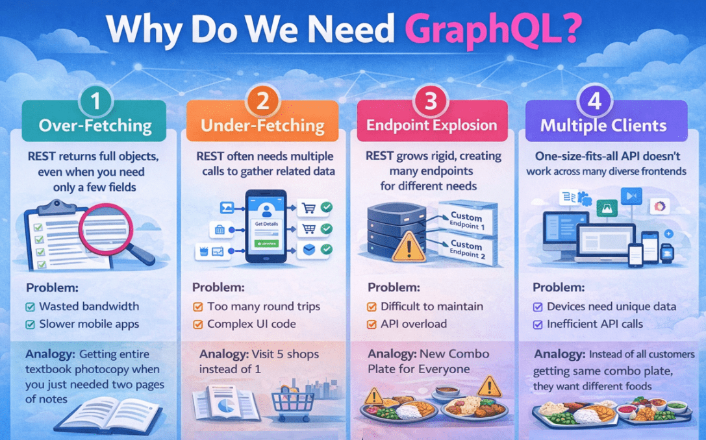
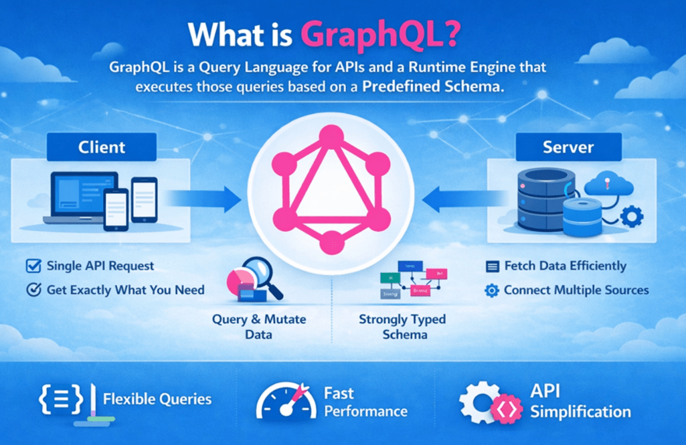
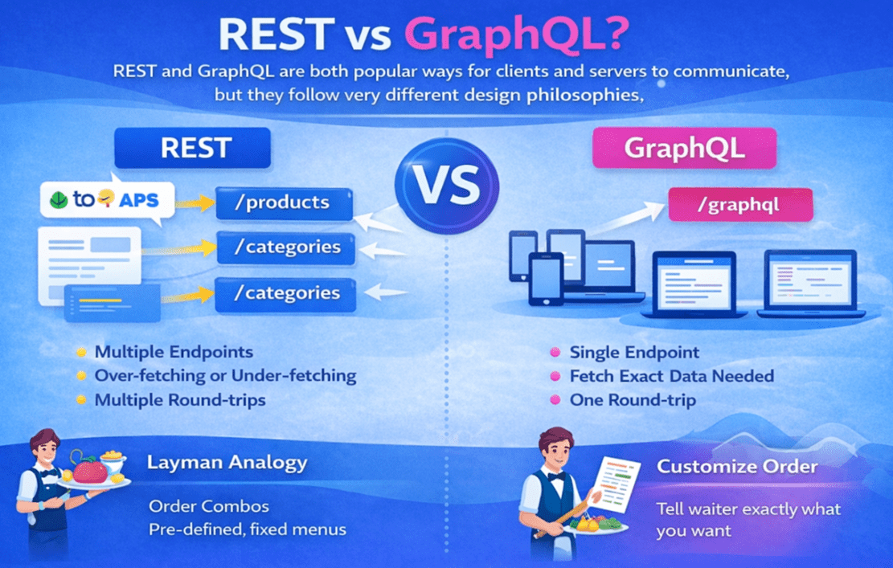
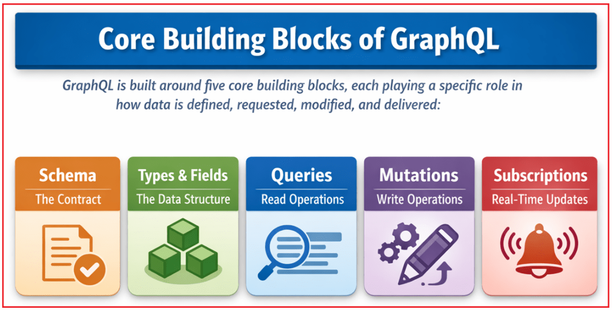

## **GraphQL در ASP.NET Core Web API**

ASP.NET Core Web API معمولاً برای ساخت REST APIها استفاده می‌شود. REST برای برنامه‌های ساده به خوبی کار می‌کند، اما با رشد برنامه‌های مدرن و ارائه خدمات به چندین کلاینت، مانند برنامه‌های وب، برنامه‌های تلفن همراه و داشبوردها، نیازهای داده پیچیده‌تر می‌شوند. GraphQL برای حل این مشکلات واکشی داده‌ها معرفی شد و به کلاینت‌ها اجازه می‌دهد فقط داده‌های مورد نیاز خود را درخواست کنند.

#### **رویکرد پیش‌فرض برای ساخت APIها در اکثر پروژه‌های .NET چیست؟**

در اکثر برنامه‌های .NET، **رویکرد استاندارد و پرکاربرد برای ساخت APIها، ASP.NET Core Web API است که از سبک معماری REST (Representational State Transfer) پیروی می‌کند**. REST سال‌هاست که محبوب باقی مانده است زیرا درک آن آسان، پیاده‌سازی آن ساده و هماهنگی نزدیکی با نحوه عملکرد HTTP دارد.

در APIهای مبتنی بر REST، بک‌اند **چندین نقطه پایانی را** در معرض نمایش قرار می‌دهد که هر کدام نشان‌دهنده یک منبع خاص مانند کاربران، سفارشات یا محصولات هستند. هر نقطه پایانی یک **ساختار پاسخ از پیش تعریف‌شده** را برمی‌گرداند که کاملاً توسط سرور تعیین می‌شود. روش‌های استاندارد HTTP مانند **GET، POST، PUT و DELETE** برای انجام عملیات روی این منابع استفاده می‌شوند.

#### **چه زمانی REST بهترین عملکرد را دارد؟**

REST به ویژه زمانی خوب کار می‌کند که الزامات برنامه پایدار و سرراست باشند، مانند:

- این برنامه **نسبتاً ساده** است و شامل روابط پیچیده داده نمی‌شود.
- الزامات **داده به وضوح تعریف شده‌اند** و مرتباً تغییر نمی‌کنند
- تعداد مصرف‌کنندگان API **کم یا محدود است**
- همه کلاینت‌ها می‌توانند به راحتی با **ساختارهای پاسخ ثابت** تعریف شده توسط سرور کار کنند.

در این شرایط، API های REST عبارتند از:

- طراحی آسان زیرا هر نقطه پایانی مسئولیت مشخصی دارد
- تست آسان با استفاده از ابزارهایی مانند Swagger یا Postman
- نگهداری آسان به دلیل پایداری ساختار API در طول زمان

با این حال، با رشد برنامه‌ها و افزایش **وابستگی به رابط کاربری**، REST ممکن است محدودیت‌هایی را نشان دهد. این **به این دلیل نیست که REST طراحی بدی دارد**، بلکه به این دلیل است که REST فرض می‌کند که یک ساختار پاسخ ثابت برای هر نقطه پایانی برای همه کلاینت‌ها کار خواهد کرد. برنامه‌های مدرن اغلب **برای صفحات نمایش مختلف به شکل‌های داده متفاوتی** نیاز دارند، که REST به طور طبیعی برای مدیریت آنها طراحی نشده است.

#### **چرا REST در برنامه‌های مدرن ناکافی به نظر می‌رسد؟**

برنامه‌های مدرن دیگر کوچک یا تک منظوره نیستند. امروزه یک سیستم backend واحد اغلب به **چندین نوع کلاینت خدمات** ارائه می‌دهد، مانند:

- برنامه‌های وب ساخته شده با استفاده از React یا Angular.
- اپلیکیشن‌های موبایل برای اندروید و iOS.
- داشبوردهای مدیریتی با نماهای پیچیده.
- سیستم‌های شخص ثالث و ادغام با شرکا.

هر یک از این کلاینت‌ها **انتظارات متفاوتی از API** دارند. آن‌ها از نظر اندازه صفحه نمایش، محدودیت‌های عملکرد، استفاده از پهنای باند و میزان داده مورد نیازشان با هم متفاوت هستند.

برای مثال:

- یک **اپلیکیشن موبایل،** ترجیح می‌دهد **پاسخ‌های کوچک‌تر و سبک‌تر را** تا پهنای باند را ذخیره کرده و عملکرد را بهبود بخشد.
- یک **داشبورد مدیریتی** معمولاً به **داده‌های عمیق، جزئی و تو در تو** مانند خلاصه‌ها، داده‌های تجمیعی و موجودیت‌های مرتبط نیاز دارد.
- **یکپارچه‌سازی‌های شخص ثالث** اغلب **فقط به زیرمجموعه کوچکی از داده‌ها** برای موارد استفاده خاص نیاز دارند.

APIهای REST، ذاتاً، **برای هر نقطه پایانی یک ساختار پاسخ ثابت** برمی‌گردانند. اگرچه این رویکرد در مراحل اولیه یک برنامه به خوبی کار می‌کند، اما با افزایش تعداد کلاینت‌ها و تغییرات رابط کاربری، محدودکننده می‌شود.

وقتی چندین کلاینت و چندین صفحه نمایش به **اشکال مختلف داده** نیاز دارند، REST احساس ناکافی بودن می‌کند و backend انعطاف‌پذیری محدودی دارد. توسعه‌دهندگان مجبور می‌شوند یکی از این دو کار را انجام دهند:

- ایجاد **نقاط پایانی جدید** برای صفحات نمایش خاص
- افزودن **متغیرهای پاسخ** یا پارامترهای پرس‌وجو
- بپذیرند **یا کلاینت‌ها را مجبور کنید داده‌های ناخواسته را** و فراخوانی‌های API اضافی انجام دهند

این انعطاف‌ناپذیری دلیل اصلی این است که REST در برنامه‌های پیچیده، مدرن و با رابط کاربری سنگین، ناکافی به نظر می‌رسد.

#### **معمولاً چه مشکلاتی هنگام رشد REST APIها با برنامه ظاهر می‌شوند؟**

با رشد یک برنامه و افزایش تعداد صفحات نمایش و موارد استفاده، APIهای REST اغلب با چالش‌های عملی متعددی روبرو می‌شوند.

- **انفجار نقاط پایانی:** برای پشتیبانی از صفحات و الزامات مختلف، توسعه‌دهندگان اغلب چندین نقطه پایانی تخصصی مانند /users/summary، /users/withOrders یا /users/profileDetails ایجاد می‌کنند. با گذشت زمان، سازماندهی، مستندسازی و نگهداری API دشوار می‌شود.
- **فراخوانی‌های چندگانه API برای یک صفحه:** صفحات رابط کاربری دنیای واقعی معمولاً به داده‌های ترکیبی نیاز دارند. برای مثال، یک صفحه ممکن است به جزئیات کاربر، سفارشات، اقلام سفارش و اطلاعات محصول نیاز داشته باشد. با REST، این اغلب منجر به **فراخوانی‌های چندگانه API** می‌شود و frontend باید به صورت دستی داده‌ها را ادغام کند.
- **واکشی بیش از حد:** گاهی اوقات یک نقطه پایانی، شیء بزرگی با فیلدهای زیاد را برمی‌گرداند، در حالی که رابط کاربری فقط به تعداد کمی از آنها نیاز دارد. این امر منجر به انتقال غیرضروری داده‌ها، افزایش اندازه بار مفید (payload) و تأثیر بر عملکرد می‌شود.
- **دریافت ناقص (Under-Fetching):** در موارد دیگر، یک نقطه پایانی داده‌های ناکافی را برمی‌گرداند و کلاینت را مجبور می‌کند برای تکمیل یک صفحه، فراخوانی‌های API بیشتری انجام دهد.

روی هم رفته، همه این مشکلات باعث افزایش استفاده از شبکه، کند شدن برنامه‌ها و ایجاد پیچیدگی در کدهای backend و frontend می‌شوند. در نتیجه، نگهداری سخت‌تر می‌شود و بهره‌وری کلی توسعه کاهش می‌یابد. برای درک بهتر، لطفاً به تصویر زیر نگاه کنید:

#### **گراف کیوال چیست؟**

GraphQL یک **رویکرد طراحی API جایگزین** است که به طور خاص برای حل مشکلات واکشی داده‌ها که معمولاً با APIهای REST تجربه می‌شوند، ایجاد شده است. GraphQL به جای تمرکز بر منابع و نقاط پایانی، بر **الزامات و روابط داده‌ها** تمرکز دارد. GraphQL عمدتاً برای پرداختن به مشکلاتی مانند موارد زیر وجود دارد:

- واکشی بیش از حد داده‌های غیرضروری
- کمبود واکشی که نیاز به فراخوانی‌های متعدد API دارد
- درخواست‌های متعدد شبکه برای داده‌های مرتبط

در GraphQL، کلاینت به صراحت مشخص می‌کند که **به چه داده‌هایی نیاز دارد** و سرور **دقیقاً با همان داده‌ها پاسخ می‌دهد - نه بیشتر و نه کمتر**.

**به زبان ساده:**

- **REST** → سرور ساختار پاسخ را تعیین می‌کند.
- **GraphQL** → کلاینت ساختار پاسخ را تعیین می‌کند.

GraphQL **نمی‌شود** جایگزین ASP.NET Core یا معماری backend ما **. این فریم‌ورک فقط نحوه درخواست و شکل‌دهی داده‌ها را** تغییر می‌دهد و آن را برای برنامه‌های مدرن مبتنی بر رابط کاربری که در آن‌ها نیازهای داده در صفحات نمایش و کلاینت‌ها متفاوت است، بسیار مناسب می‌کند. برای درک بهتر، لطفاً به تصویر زیر نگاه کنید:

##### **قیاس غیر روحانی**

به API خود مانند یک رستوران فکر کنید:

- **REST** مانند سفارش یک غذای ترکیبی ثابت است. شما اقلام از پیش تعریف شده‌ای را دریافت می‌کنید، حتی اگر همه آنها را نخواهید.
- **GraphQL** مثل این است که به گارسون بگویید دقیقاً چه چیزی در بشقابتان می‌خواهید. آشپزخانه فقط همان سفارش را آماده می‌کند - بدون هیچ مورد اضافی، بدون هیچ اسرافی.

**معنای عمیق‌تر این تشبیه:**

- REST برای **پاسخ‌های استاندارد و از پیش تعریف‌شده بهینه شده است.**
- GraphQL برای **نیازهای داده‌ای سفارشی و خاص مشتری بهینه شده است.**

به همین دلیل، GraphQL داده‌های هدر رفته (فراخوانی بیش از حد) و فراخوانی‌های غیرضروری API (فراخوانی کمتر از حد) را کاهش می‌دهد.

#### **GraphQL در ASP.NET Core Web API دقیقاً چیست؟**

GraphQL از دو بخش اصلی تشکیل شده است:

##### **یک زبان پرس‌وجو**

این به مشتریان اجازه می‌دهد تا به وضوح اعلام کنند که چه داده‌هایی می‌خواهند. این به مشتریان یک روش ساختاریافته برای درخواست داده‌ها می‌دهد:

- کدام نهاد؟
- کدام فیلدها
- داده‌های تو در تو چقدر باید عمیق باشند؟

##### **یک موتور اجرایی**

موتور GraphQL:

- درخواست را با توجه به طرحواره اعتبارسنجی می‌کند.
- حل کننده ها را اجرا می کند
- پاسخ نهایی را می‌سازد

GraphQL نگران محل ذخیره داده‌های شما نیست. این مربوط به **نحوه درخواست و دریافت داده‌ها توسط کلاینت‌ها** است.

در ASP.NET Core Web API، GraphQL به عنوان یک **لایه ارتباطی جایگزین** (یک روش جایگزین برای ارتباط با backend ما) عمل می‌کند. این لایه به راحتی با موارد زیر کار می‌کند:

- میان‌افزار
- تزریق وابستگی
- لایه سرویس
- مخازن
- هسته EF

بنابراین، backend ما ثابت می‌ماند، فقط سبک تعامل API تغییر می‌کند.

#### **تفاوت‌های بین REST و GraphQL**

REST و GraphQL دو رویکرد متفاوت برای طراحی APIها هستند. REST مبتنی بر منابع و مبتنی بر نقطه پایانی است، در حالی که GraphQL مبتنی بر داده و مبتنی بر پرس و جو است. برای درک بهتر، لطفاً به تصویر زیر نگاه کنید:

##### **رویکرد طراحی API**

- **REST** حول **منابع** ساخته شده است. هر منبع از طریق یک نقطه پایانی جداگانه در معرض دید قرار می‌گیرد و سرور ساختار پاسخ را تعیین می‌کند.
- **GraphQL** حول **الزامات داده** ساخته شده است. معمولاً یک نقطه پایانی واحد را در معرض نمایش قرار می‌دهد و کلاینت دقیقاً مشخص می‌کند که به چه داده‌هایی نیاز دارد.

##### **تعداد نقاط پایانی**

- **REST** استفاده می‌کند **از چندین نقطه پایانی** برای منابع و موارد استفاده مختلف
- **GraphQL** معمولاً **از یک نقطه پایانی واحد (Single Endpoint** ) استفاده می‌کند و عملیات‌ها به جای URL، توسط کوئری تعریف می‌شوند.

##### **کنترل بر پاسخ**

- **REST** است **مبتنی بر سرور**. کلاینت باید پاسخ ثابت تعریف شده توسط سرور را بپذیرد.
- **GraphQL** است **مبتنی بر کلاینت**. کلاینت تصمیم می‌گیرد کدام فیلدها را برگرداند.

##### **واکشی بیش از حد و کمتر از حد مجاز**

- **REST** اغلب از مشکل over-fetching یا under-fetching رنج می‌برد، زیرا نقاط انتهایی داده‌های ثابتی را برمی‌گردانند.
- **GraphQL** با برگرداندن فقط فیلدهایی که صریحاً توسط کلاینت درخواست شده‌اند، از هر دو مورد جلوگیری می‌کند.

##### **واکشی داده‌های مرتبط**

- **REST** معمولاً **چندین فراخوانی API نیاز دارد.** برای دریافت داده‌های مرتبط به
- **GraphQL** می‌تواند داده‌های مرتبط و تو در تو را در **یک درخواست واحد** دریافت کند.

##### **نسخه‌بندی API**

- **REST** معمولاً از نسخه‌بندی، مانند /v1 و /v2، برای مدیریت تغییرات استفاده می‌کند.
- **GraphQL** معمولاً نیازی به نسخه‌بندی ندارد زیرا می‌توان فیلدهای جدید را بدون از کار انداختن کلاینت‌های موجود اضافه کرد.

##### **موارد استفاده**

- **REST** مناسب ترین است **برای API های ساده و پایدار** با الزامات داده قابل پیش بینی
- **GraphQL** مناسب‌تر است **برای برنامه‌های پیچیده و مبتنی بر رابط کاربری** با چندین کلاینت و نیازهای داده‌ای متغیر،

###### **کدام یک بهتر است؟**

هیچ‌کدام به‌طور کلی بهتر نیستند. REST برای APIهای ساده و پایدار خوب عمل می‌کند، در حالی که GraphQL برای برنامه‌های پیچیده و داده‌محور با چندین رابط کاربری مناسب‌تر است. REST متمرکز بر نقطه پایانی و تحت کنترل سرور است، در حالی که GraphQL متمرکز بر پرس‌وجو و تحت کنترل کلاینت است.

#### **بلوک‌های سازنده‌ی اصلی GraphQL:**

GraphQL بر اساس پنج بلوک سازنده اصلی ساخته شده است که نحوه جریان داده‌ها در سیستم را تعریف می‌کنند:

1. **طرحواره** \- قرارداد بین کلاینت و سرور را تعریف می‌کند.
2. **انواع و فیلدها** \- ساختار داده را شرح دهید.
3. **پرس‌وجوها** \- برای خواندن داده‌ها استفاده می‌شوند.
4. **جهش‌ها** \- برای تغییر داده‌ها استفاده می‌شود.
5. **اشتراک‌ها** \- برای به‌روزرسانی‌های بلادرنگ استفاده می‌شود

برای درک بهتر، لطفاً به تصویر زیر نگاه کنید:

این اجزا در کنار هم، تعریف می‌کنند که چه داده‌هایی در دسترس هستند، چگونه می‌توان به آنها دسترسی داشت و چگونه در سیستم جریان می‌یابند. یک راه ساده برای تصور این موضوع:

- برنامه → منو
- انواع و زمینه‌ها → غذاها و مواد تشکیل‌دهنده
- پرس‌وجوها و جهش‌ها → رسید سفارش
- اشتراک‌ها → به‌روزرسانی‌های زنده («وقتی آماده شد به من اطلاع بده»)

##### **اسکیما در GraphQL چیست؟**

طرحواره، **پایه و اساس اصلی** GraphQL است. این طرحواره به عنوان یک قرارداد قوی بین کلاینت و سرور عمل می‌کند و موارد زیر را تعریف می‌کند:

- چه نوع‌هایی وجود دارد (کاربر، سفارش، محصول)
- چه فیلدهایی در هر نوع موجود است؟
- کلاینت چه عملیاتی را می‌تواند انجام دهد؟
- چه ورودی‌هایی معتبر هستند؟
- چگونه انواع با یکدیگر مرتبط هستند

قبل از اجرای هرگونه درخواست، GraphQL آن را با توجه به طرحواره اعتبارسنجی می‌کند. اگر کلاینت فیلدی را درخواست کند که وجود ندارد یا ورودی نامعتبر ارائه دهد، درخواست بلافاصله رد می‌شود. می‌توانید طرحواره را مانند منوی رستوران تصور کنید. اگر یک آیتم در منو نباشد، نمی‌توانید آن را سفارش دهید.

##### **انواع و فیلدها چیستند؟**

GraphQL داده‌ها را به **انواع (types** ) سازماندهی می‌کند و هر نوع شامل **فیلدهایی (fields)** است.

- انواع، نشان‌دهنده‌ی موجودیت‌ها یا مدل‌ها (کاربر، سفارش، محصول، پرداخت و غیره) هستند.
- فیلدها نشان‌دهنده‌ی ویژگی‌های درون یک نوع (شناسه، نام، ایمیل، قیمت) هستند.

GraphQL از انواع مختلفی از جمله موارد زیر پشتیبانی می‌کند:

- **انواع شیء** (ساختارهای پیچیده مانند کاربر، سفارش)
- **انواع اسکالر** (رشته، عدد صحیح، بولی)
- **انواع شمارشی** (گزینه‌های ثابت مانند OrderStatus)
- **انواع لیست** (مجموعه‌هایی مانند لیست سفارشات، لیست محصولات داخل یک سفارش)
- **فیلدهای تهی‌پذیر/غیرتهی** (مقادیر اختیاری در مقابل مقادیر اجباری)

##### **کوئری‌ها در GraphQL چه هستند؟**

استفاده می‌شوند **کوئری‌ها برای خواندن داده‌ها**، مشابه درخواست REST **GET**. اما مزیت اصلی این است که کوئری‌ها امکان **کنترل سطح فیلد را** فراهم می‌کنند. کلاینت تصمیم می‌گیرد:

- کدام فیلدها باید برگردند
- داده‌های تو در تو چقدر باید گنجانده شوند؟

برای مثال، فقط نام، ایمیل و ۵ سفارش آخرم را به من بده. این باعث می‌شود کوئری‌ها برای صفحات نمایش مبتنی بر رابط کاربری که به اشکال مختلف داده نیاز دارند، ایده‌آل باشند.

##### **جهش‌ها در GraphQL چیستند؟**

استفاده می‌شوند **جهش‌ها برای تغییر داده‌ها**، مشابه عملیات REST POST، PUT و DELETE. آن‌ها از موارد زیر پشتیبانی می‌کنند:

- ایجاد داده (POST)
- به‌روزرسانی داده‌ها (PUT/PATCH)
- حذف داده‌ها (DELETE)

یک جهش خوب طراحی شده معمولاً موارد زیر را برمی‌گرداند:

- داده‌های ایجاد شده یا به‌روزرسانی شده
- اطلاعات موفقیت یا وضعیت
- جزئیات خطای اعتبارسنجی یا کسب و کار

برای مثال **،** سفارش من را ثبت کنید و جزئیات تأیید را به من بدهید.

##### **اشتراک‌ها در GraphQL چیستند؟**

اشتراک‌ها امکان **ارتباط بلادرنگ** بین سرور و کلاینت را فراهم می‌کنند. به جای درخواست مکرر به‌روزرسانی‌ها، سرور به طور خودکار داده‌ها را هنگام تغییر ارسال می‌کند. موارد استفاده رایج عبارتند از:

- اعلان‌های زنده
- اپلیکیشن‌های چت
- داشبوردهای بلادرنگ (موجودی، سفارشات، پیگیری تحویل)

برای مثال، به‌روزرسانی‌های نتایج زنده کریکت - لازم نیست صفحه را رفرش کنید؛ آن‌ها به‌طور خودکار می‌آیند.

#### **بک‌اند برای فرانت‌اند (BFF) چیست؟**

**BFF مخفف Backend for Frontend است.** این یک **لایه اختصاصی backend است که برای ارائه خدمات به یک برنامه frontend خاص طراحی شده است**. در سیستم‌های مدرن، ما معمولاً **چندین frontend** مانند برنامه‌های وب، برنامه‌های تلفن همراه و داشبوردهای مدیریتی داریم. اگرچه آنها از داده‌های تجاری یکسانی استفاده می‌کنند، اما **نیازهای داده‌ای آنها به طور قابل توجهی متفاوت است**.

##### **یک BFF چه کاری انجام می‌دهد؟**

یک بک‌اند برای فرانت‌اند **بین میکروسرویس‌های فرانت‌اند و بک‌اند** قرار می‌گیرد و فقط بر آماده‌سازی داده‌ها برای رابط کاربری تمرکز دارد.

یک دوست صمیمی معمولاً:

- با **چندین میکروسرویس ارتباط برقرار می‌کند**
- داده‌ها را از سیستم‌های backend مختلف دریافت می‌کند
- داده‌ها را ترکیب و تبدیل می‌کند
- پاسخ را **دقیقاً مطابق با نیاز رابط کاربری شکل می‌دهد.**
- پیچیدگی‌های بک‌اند را از توسعه‌دهندگان فرانت‌اند پنهان می‌کند

از دیدگاه فرانت‌اند، بهترین دوست (BFF) **تنها بک‌اندی است که باید با او صحبت کند**.

##### **قیاس غیر روحانی**

یک رستوران را در نظر بگیرید:

###### **میکروسرویس‌ها = بخش‌های آشپزخانه**

- بخش سبزیجات
- بخش دسر
- بخش صورتحساب

هر بخش آشپزخانه فقط اقلام مورد نیاز خود را آماده می‌کند و کاری به سفارش نهایی مشتری ندارد.

###### **درگاه API = نگهبان امنیتی + کنترل‌کننده ترافیک**

- کنترل می‌کند چه کسی می‌تواند وارد شود
- درخواست‌ها را به مکان مناسب هدایت می‌کند
- قوانینی مانند احراز هویت و محدود کردن نرخ را اعمال می‌کند

###### **بهترین دوست = پیشخدمت شخصی**

- می‌پذیرد **سفارش دقیق شما را**
- می‌فهمد چه می‌خواهید و چگونه می‌خواهید به آن خدمت کنید
- با چندین پیشخوان آشپزخانه ارتباط برقرار می‌کند
- همه چیز را جمع می‌کند
- آن را **در یک بشقاب گرد هم آورید**

مشتری (کارمند بخش پذیرش) هرگز مستقیماً با آشپزخانه سروکار ندارد—فقط با پیشخدمت (بهترین دوست) سروکار دارد.

##### **نتیجه‌گیری: چرا GraphQL اهمیت دارد؟**

GraphQL یک رویکرد API جایگزین است که بر واکشی داده‌های انعطاف‌پذیر و کارآمد تمرکز دارد. این رویکرد به جلوگیری از مشکلات رایج REST مانند واکشی بیش از حد، واکشی کمتر از حد و فراخوانی‌های چندگانه API کمک می‌کند. GraphQL بدون تغییر منطق backend موجود، به راحتی با ASP.NET Core کار می‌کند. هنگامی که در سناریوهای مناسب استفاده شود، APIها را برای برنامه‌های مدرن کارآمدتر و آسان‌تر می‌کند.