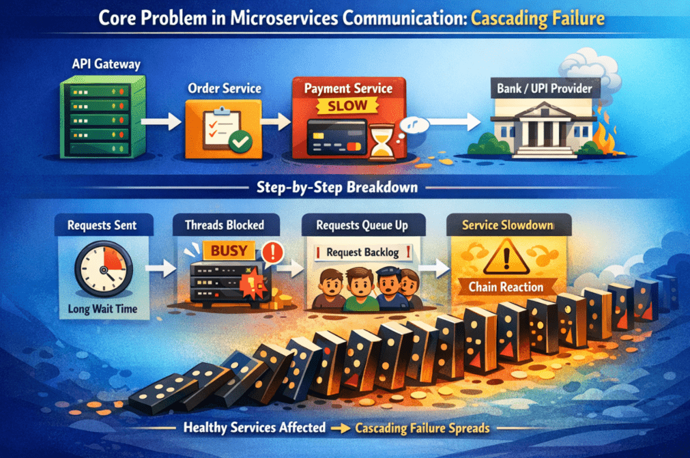
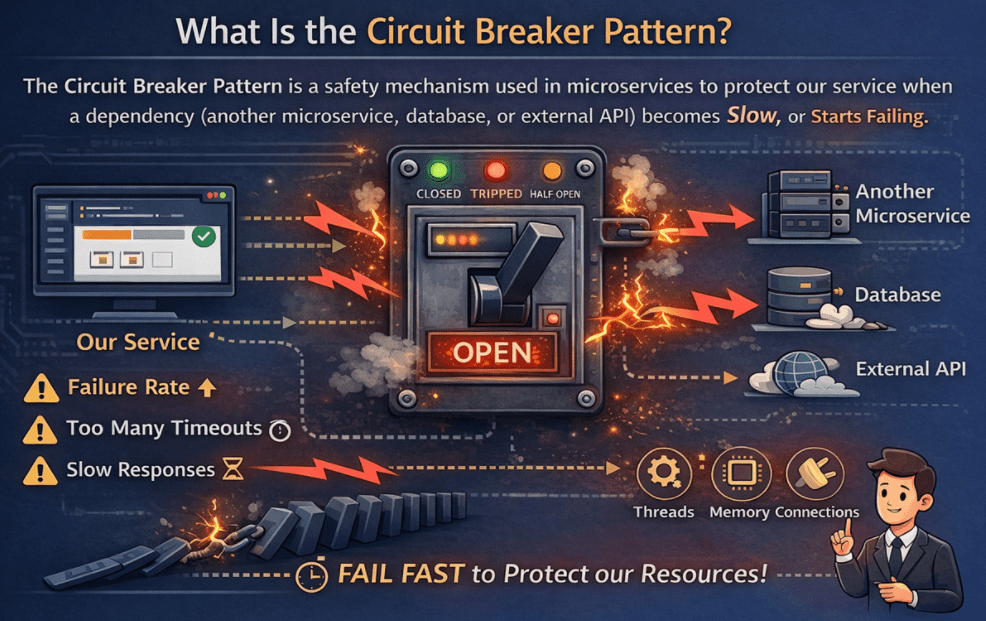
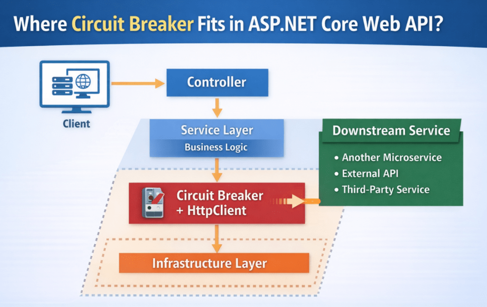
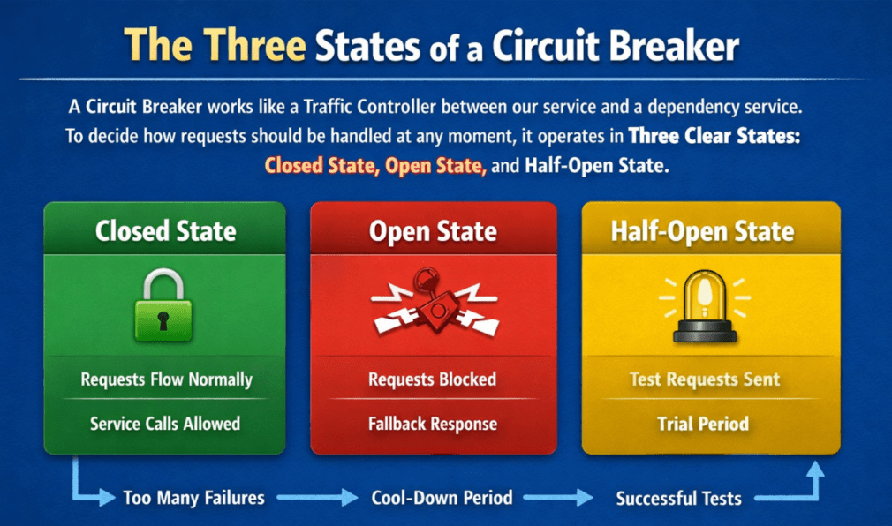
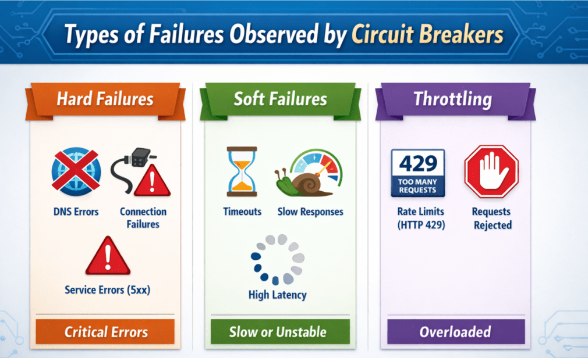
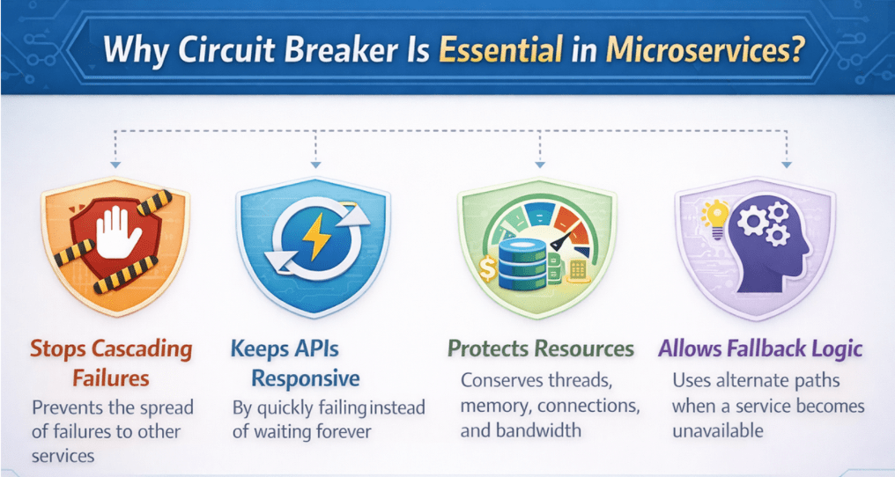

## **قطع کننده مدار در میکروسرویس‌های ASP.NET Core Web API**

در این پست، در مورد Circuit Breaker در ASP.NET Core Web API بحث خواهم کرد. در میکروسرویس‌ها، یک سرویس به سرویس‌های دیگر وابسته است. این بدان معناست که هر درخواست ممکن است شامل **فراخوانی‌های شبکه** (از یک سرویس به سرویس دیگر از طریق REST یا gRPC) باشد و این فراخوانی‌ها می‌توانند در هر زمانی با شکست مواجه شوند یا سرعتشان کاهش یابد. **الگوی Circuit Breaker** با **متوقف کردن فراخوانی‌های مکرر به یک وابستگی ناسالم** ، به API ما کمک می‌کند تا پاسخگو بماند و از گسترش خطاها در سراسر سیستم جلوگیری می‌کند.

#### **مشکل اصلی در ارتباطات میکروسرویس‌ها: شکست آبشاری**

در میکروسرویس‌ها، خطر واقعی معمولاً **از کار افتادن یک سرویس نیست** \- بلکه اتفاقی است که پس از آن خرابی می‌افتد. یک درخواست کاربر اغلب از طریق چندین سرویس ارسال می‌شود. برای مثال:

- درگاه API → خدمات سفارش
- خدمات سفارش → خدمات پرداخت
- خدمات پرداخت → بانک/ارائه‌دهنده UPI

حالا تصور کنید که **سرویس پرداخت کند می‌شود** (شاید پایگاه داده آن شلوغ یا پر از بار باشد). سرویس سفارش هنوز همان تعداد درخواست کاربر را دریافت می‌کند، بنابراین مرتباً سرویس پرداخت را فراخوانی می‌کند.

در اینجا اتفاقی که می‌افتد گام به گام آمده است:

- سرویس سفارش، درخواستی را به سرویس پرداخت ارسال می‌کند، اما پاسخ با تأخیر ارسال می‌شود.
- سرویس سفارش همچنان منتظر می‌ماند، بنابراین **Threadهای آن همچنان مشغول (مسدود) باقی می‌مانند** .
- در همین حال، درخواست‌های جدید کاربران همچنان دریافت می‌شوند، بنابراین **درخواست‌ها شروع به صف شدن می‌کنند** .
- کم کم، سرویس سفارش هم کند می‌شود—نه به این دلیل که خراب است، بلکه به این دلیل که معطل مانده است.
- پس از آن، هر سرویسی که به Order Service وابسته باشد نیز کند می‌شود یا از کار می‌افتد.
- این یک واکنش زنجیره‌ای در سراسر سرویس‌ها ایجاد می‌کند، مانند **دامنه‌هایی که یکی پس از دیگری از دسترس خارج می‌شوند** .

نامیده می‌شود **این واکنش زنجیره‌ای، خرابی آبشاری** \- مشکل یک سرویس گسترش می‌یابد و باعث می‌شود سایر سرویس‌های سالم، ناسالم به نظر برسند.

بنابراین، مشکل اصلی فقط این نیست که یک سرویس از کار می‌افتد. مشکل بزرگتر این است که **سرویس‌های سالم مدام یک سرویس ناسالم را فراخوانی می‌کنند، در انتظار می‌مانند و به آرامی،** **خرابی به کل سیستم گسترش می‌یابد.** دقیقاً به همین دلیل است که ما به الگوهایی مانند **Circuit Breaker** نیاز داریم تا جلوی گسترش خرابی‌ها را در مراحل اولیه بگیریم.

##### **یک قیاس ساده‌ی غیرحرفه‌ای**

یک **رستوران شلوغ را** تصور کنید .

- مشتریان همچنان سفارش می‌دهند (مشابه **درخواست‌های ورودی API** ).
- پیشخدمت سفارش را می‌گیرد و آن را به آشپزخانه می‌فرستد (این مانند تماس سرویس شما با **سرویس پایین‌دستی** است ).
- وقتی آشپزخانه خوب باشد، غذا سریع آماده می‌شود و همه چیز به خوبی پیش می‌رود.

حالا فرض کنید **یک بخش کلیدی آشپزخانه خراب** شود (مثلاً فر از کار بیفتد یا یکی از سرآشپزها در دسترس نباشد). آشپزی کند می‌شود.

اگر پیشخدمت **مدام هر سفارش جدید را به آن آشپزخانه‌ی کُند بفرستد** ، این اتفاق می‌افتد:

- آشپزخانه مدام **سفارش‌های معوق بیشتری** جمع می‌کند .
- پیشخدمت مدام **ایستاده و منتظر** غذای معوقه است.
- از آنجایی که پیشخدمت‌ها معطل می‌شوند، پیشخدمت‌های کمتری برای رسیدگی به مشتریان جدید باقی می‌مانند.
- خیلی زود، احساس شد که کل رستوران از کار افتاده است - با اینکه فقط یک بخش مشکل داشت.

حالا به یک مدیر رستوران باهوش فکر کنید که می‌گوید:

- آشپزخانه الان اوضاعش خرابه. **برای مدتی ارسال سفارش پیتزای جدید رو متوقف کنید** .
- به مشتریان بگویید **پیتزا موقتاً موجود نیست** (یا منوی ساده‌تری ارائه دهید).
- بعد از یک استراحت کوتاه، **۱ تا ۲ دستور آزمایشی را امتحان کنید** تا ببینید آیا آشپزخانه به حالت عادی برگشته است یا خیر.

آن مدیر هوشمند، **Circuit Breaker** است . در میکروسرویس‌ها، Circuit Breaker همین کار را انجام می‌دهد: ، **ارسال درخواست‌ها به یک سرویس ناموفق را موقتاً متوقف می‌کند** بنابراین سرویس شما در انتظار گیر نمی‌کند و بقیه سیستم می‌تواند به اجرای خود ادامه دهد.

#### **الگوی قطع کننده مدار چیست؟**

الگوی **قطع مدار (Circuit Breaker Pattern)** یک مکانیزم ایمنی است که در میکروسرویس‌ها برای محافظت از سرویس ما در زمانی که یک وابستگی (میکروسرویس دیگر، پایگاه داده یا API خارجی) **کند می‌شود یا شروع به از کار افتادن می‌کند،** استفاده می‌شود . آن را به عنوان یک **سوئیچ محافظ** در اطراف یک تماس خروجی در نظر بگیرید.

به عبارت ساده **،** وقتی سرویس ما سرویس دیگری را فراخوانی می‌کند، قطع‌کننده مدار نتایج آن فراخوانی‌ها را زیر نظر می‌گیرد:

- آیا ما **زیادی مواجه می‌شویم؟** با شکست‌ها (خطاها/استثنائات)
- آیا شاهد **تایم اوت‌های زیادی** هستیم ؟
- آیا پاسخ‌ها **خیلی کند می‌شوند؟** بارها و بارها

اگر وابستگی ناسالم به نظر برسد، قطع‌کننده مدار **باز می‌شود** . باز شدن به معنای:

- سرویس شما **فراخوانی آن وابستگی را متوقف می‌کند .** برای مدت کوتاهی
- ( **سریعاً شکست می‌خورد** یک خطای سریع یا یک پاسخ جایگزین برمی‌گرداند).
- این باعث صرفه‌جویی در منابع مهمی مانند **Threadها، حافظه و اتصالات می‌شود.**

پس از یک زمان کوتاه « **آرام شدن** »، مدارشکن امکان چند **تماس آزمایشی را** فراهم می‌کند .

- اگر تماس‌های آزمایشی موفقیت‌آمیز باشند، مدار **بسته می‌شود** و تماس‌های عادی از سر گرفته می‌شوند.
- می‌ماند . **باز** اگر دوباره شکست بخورند، برای مدتی دیگر

قطع‌کننده مدار قرار نیست موفقیت هر درخواستی را تضمین کند. هدف اصلی آن **پایدار و پاسخگو نگه داشتن سیستم کلی ما و جلوگیری از از کار افتادن** سایر سرویس‌ها توسط یک وابستگی ناسالم است. تصمیمات قطع‌کننده مدار بر اساس تاریخچه اخیر تماس‌ها گرفته می‌شود، نه یک خرابی واحد.

#### **جایگاه Circuit Breaker در ASP.NET Core Web API**

در یک **میکروسرویس ASP.NET Core Web API** ، قطع‌کننده مدار باید **دقیقاً در جایی قرار گیرد که سرویس شما سیستم دیگری را فراخوانی می‌کند** . به عبارت دیگر، متعلق به **مرز ارتباط خروجی** است ، نه داخل منطق اصلی کسب‌وکار شما. قطع‌کننده مدار معمولاً در اطراف موارد زیر اعمال می‌شود:

- **فراخوانی‌های HttpClient** به سایر میکروسرویس‌ها، برای مثال، سرویس سفارش، سرویس پرداخت را فراخوانی می‌کند.
- **فراخوانی‌های کلاینت gRPC**
- **فراخوانی‌های API شخص ثالث** : درگاه پرداخت، ارائه‌دهنده پیامک/ایمیل، سرویس OTP و غیره)

یک روش ساده برای تجسم محل قرارگیری:

- **کنترل‌کننده** درخواست را دریافت می‌کند
- **لایه سرویس،** قوانین کسب‌وکار را اعمال می‌کند.
- فراخوانی می‌کند **وقتی به داده از سرویس دیگری نیاز دارد → از طریق HttpClient/gRPC**
- **قطع کننده مدار این تماس خروجی را** قبل از رسیدن به وابستگی پایین دستی قطع می‌کند.

بنابراین، جریان به این صورت می‌شود: **کنترلر → لایه سرویس → (قطع‌کننده مدار + HttpClient) → سرویس پایین‌دستی.**

بنابراین، قطع‌کننده در **مرزی قرار می‌گیرد که سرویس ما به سرویس دیگری وابسته است، که عمدتاً در لایه زیرساخت میکروسرویس‌های ما قرار دارد** . این امر منطق کسب‌وکار ما را تمیز نگه می‌دارد و نگرانی‌های مربوط به تاب‌آوری را در لایه ارتباطی حفظ می‌کند.

#### **سه حالت یک مدارشکن**

یک قطع‌کننده مدار مانند یک **کنترل‌کننده ترافیک** بین سرویس ما و یک سرویس وابستگی عمل می‌کند. برای تصمیم‌گیری در مورد نحوه رسیدگی به درخواست‌ها در هر لحظه، در **سه حالت شفاف** عمل می‌کند . هر حالت نشان دهنده باور فعلی قطع‌کننده مدار در مورد سلامت وابستگی است.

##### **حالت بسته - عملکرد عادی**

حالت **بسته (Closed)** حالت پیش‌فرض و عادی یک مدارشکن است. در این حالت:

- همه درخواست‌ها مجاز به رفتن به سرویس وابسته هستند
- قطع کننده مدار هیچ چیزی را مسدود نمی کند
- بی‌سروصدا هر درخواست و پاسخ را مشاهده می‌کند
- خطاها، وقفه‌ها و زمان‌های پاسخ در پس‌زمینه ثبت می‌شوند

سیستم طوری رفتار می‌کند که انگار اصلاً هیچ قطع‌کننده مداری وجود ندارد. با این حال، قطع‌کننده مدار به طور فعال بررسی می‌کند که آیا وابستگی به درستی کار می‌کند یا شروع به نشان دادن مشکلات می‌کند. بسته بودن به **این معنی نیست** که هرگز خرابی رخ نمی‌دهد. این به سادگی به این معنی است که خرابی‌ها **در محدوده قابل قبول** هستند و وابستگی هنوز قابل استفاده در نظر گرفته می‌شود.

##### **حالت باز - حالت محافظت**

وقتی مدارشکن، خرابی‌ها یا تأخیرهایی را که از حد ایمن فراتر رفته‌اند، تشخیص می‌دهد، به **حالت باز (Open)** تغییر وضعیت می‌دهد . در این حالت:

- تماس‌ها به وابستگی **بلافاصله مسدود می‌شوند**
- هیچ درخواست شبکه‌ای ارسال نمی‌شود
- سرویس به جای انتظار برای تایم اوت، سریع از کار می‌افتد.
- منابع سیستم، مانند رشته‌ها و اتصالات، محافظت می‌شوند

حالت باز برای جلوگیری از آسیب بیشتر وجود دارد. این حالت مانع از مصرف منابع توسط یک وابستگیِ در حال تقلا و تبدیل یک مشکل کوچک به یک قطعی بزرگ می‌شود.

به زبان ساده، حالت باز به این معنی است: وابستگی در حال حاضر ناسالم است. برای محافظت از سیستم، فراخوانی آن را متوقف کنید. این حالت ممکن است به طور موقت عملکرد را کاهش دهد، اما سرویس را پاسخگو و پایدار نگه می‌دارد.

##### **حالت نیمه‌باز - بررسی بازیابی**

پس از یک دوره کوتاه و از پیش تعریف شده، مدارشکن به **حالت نیمه باز (Half-Open)** می‌رود . در این حالت:

- فقط تعداد کمی **درخواست آزمایش** مجاز است
- این درخواست‌ها برای بررسی اینکه آیا وابستگی بازیابی شده است یا خیر، استفاده می‌شوند.
- اگر درخواست‌های آزمایشی با موفقیت انجام شوند، قطع‌کننده مدار بسته شده و ترافیک عادی از سر گرفته می‌شود.
- اگر آنها شکست بخورند، قطع کننده مدار دوباره باز می شود

نیمه‌باز یک مرحله آزمایش دقیق است که از دو افراط و تفریط جلوگیری می‌کند:

- باز نگه داشتن مدار برای همیشه
- غرق کردن یک سرویس در حال بازیابی با ترافیک کامل خیلی زود

این حالت به سیستم اجازه می‌دهد تا **به طور خودکار بازیابی شود.** بدون دخالت دست،

###### **به زبان ساده**

- **بسته** : همه چیز خوب به نظر می‌رسد. بگذارید درخواست‌ها جریان پیدا کنند.
- **باز** : اوضاع خراب است. ارسال درخواست را متوقف کنید.
- **نیمه باز** : بیایید با دقت بررسی کنیم و تصمیم بگیریم.

این سه حالت در کنار هم به یک میکروسرویس اجازه می‌دهند تا پاسخگو بماند، در هنگام خرابی از خود محافظت کند و هنگامی که وابستگی‌ها دوباره سالم شدند، با خیال راحت بازیابی شود.

#### **انواع خرابی‌های مشاهده شده توسط مدارشکن‌ها**

یک قطع‌کننده مدار فقط به دنبال استثنائات نیست. بلکه نشانه‌هایی را که نشان می‌دهد یک وابستگی **ناسالم** است یا **به طور عادی رفتار نمی‌کند،** زیر نظر دارد . در میکروسرویس‌های واقعی، وابستگی‌ها می‌توانند به روش‌های مختلفی دچار مشکل شوند، بنابراین قطع‌کننده مدار سیگنال‌های خرابی متعددی را رصد می‌کند. برای درک آسان‌تر، می‌توانید خرابی‌ها را در **سه دسته اصلی** در نظر بگیرید .

##### **خرابی‌های سخت (وابستگی قابل دسترسی نیست)**

اینها موقعیت‌های واضحی هستند که در آنها سرویس در دسترس نیست. سرویس شما سعی می‌کند وابستگی را فراخوانی کند، اما حتی نمی‌تواند متصل شود.

مثال‌های رایج:

- **خرابی DNS** (نام سرویس قابل حل نیست)
- **اتصال رد شد** (سرویس از کار افتاده یا در حال گوش دادن نیست)
- **خطاهای سوکت/شبکه** ​​(قطعی شبکه، تنظیم مجدد اتصال)
- **سرویس قابل دسترسی نیست** (مشکل مسیریابی، فایروال، مشکل کلاستر)

به عبارت ساده: ما اصلاً نمی‌توانیم با سرویس صحبت کنیم.

##### **شکست‌های نرم (وابستگی قابل دستیابی است اما ناسالم است)**

در اینجا، وابستگی قابل دسترسی است اما عملکرد ضعیفی دارد—معمولاً به دلیل بارگذاری بیش از حد یا مشکلات داخلی.

مثال‌های رایج:

- **وقفه‌ها** (سرویس به موقع پاسخ نداد)
- **پاسخ‌های بسیار کند** (افزایش ناگهانی تأخیر)
- **خطاهای HTTP 5xx** (خطاهای سمت سرور مانند 500، 502، 503، 504)

به عبارت ساده: سرویس در حال پاسخگویی است، اما با مشکل مواجه است.

##### **مورد خاص: محدود کردن/تنظیم سرعت (بستگی به قوانین شما دارد)**

گاهی اوقات یک وابستگی با موارد زیر پاسخ می‌دهد:

- **HTTP 429 (درخواست‌های بسیار زیاد)**

این یعنی وابستگی می‌گوید: من بیش از حد بار دارم. لطفاً سرعت را کم کنید.

در سیستم‌های توزیع‌شده، **یک سرویس کند می‌تواند خطرناک‌تر از یک سرویس از کار افتاده باشد** . یک سرویس از کار افتاده به سرعت از کار می‌افتد، اما یک سرویس کند سیستم شما را در انتظار نگه می‌دارد و به آرامی منابع را تخلیه می‌کند. به همین دلیل است که قطع‌کننده‌های مدار نه تنها از کار افتادن‌ها، بلکه **هر رفتاری را که فراخوانی یک وابستگی را ناامن می‌کند،** مشاهده می‌کنند .

#### **چرا Circuit Breaker در میکروسرویس‌ها ضروری است؟**

به همین دلیل است که اینقدر اهمیت دارد:

- **از خرابی‌های آبشاری جلوگیری می‌کند** : وقتی یک سرویس پایین‌دستی دچار مشکل می‌شود، قطع‌کننده مدار موقتاً فراخوانی آن را متوقف می‌کند. این امر مانع از آن می‌شود که یک سرویس خراب، سرویس‌های سالم دیگر را از کار بیندازد.
- **از منابع سرویس شما محافظت می‌کند** : فراخوانی‌های کند یا ناموفق می‌توانند نخ‌ها را مسدود کرده و اتصالات را برای مدت طولانی نگه دارند. با گذشت زمان، API شما کند می‌شود زیرا نخ‌ها و اتصالات موجود تمام می‌شوند. یک قطع‌کننده مدار با خرابی سریع از این امر جلوگیری می‌کند.
- **بهبود تجربه کاربری در زمان خرابی‌ها** : یک پاسخ سریع و واضح مانند «سرویس موقتاً در دسترس نیست، دوباره امتحان کنید» بسیار بهتر از انتظار 30 تا 60 ثانیه‌ای و دریافت خطای timeout است. Fail-fast باعث می‌شود سیستم قابل پیش‌بینی‌تر به نظر برسد.
- **امکان تخریب کنترل‌شده را فراهم می‌کند** : حتی اگر یک وابستگی در دسترس نباشد، برنامه شما هنوز می‌تواند تا حدی کار کند. به عنوان مثال، می‌توانید داده‌های ذخیره‌شده یا داده‌های جزئی را نمایش دهید، یا به جای از کار انداختن کل ویژگی، از یک مرحله غیر بحرانی صرف نظر کنید.
- **به بازیابی سریع‌تر کمک می‌کند** : با کاهش تماس‌ها به یک سرویس در حال مشکل، به آن فضای تنفس برای بازیابی می‌دهید. این امر همچنین به مقیاس‌بندی خودکار و راه‌اندازی مجدد کمک می‌کند تا بدون غرق شدن در ترافیک مداوم، به طور مؤثر کار کند.

قطع‌کننده مدار از وقوع خرابی‌ها جلوگیری نمی‌کند - اما خرابی‌ها را **قابل مهار، قابل پیش‌بینی و قابل جبران** می‌کند . در میکروسرویس‌های عملیاتی، این فقط یک ویژگی خوب نیست؛ بلکه یک الزام پایداری برای هرگونه وابستگی حیاتی است.

##### **نتیجه‌گیری: چرا Circuit Breaker در میکروسرویس‌های ASP.NET Core اهمیت دارد؟**

قطع‌کننده مدار مانند یک کلید ایمنی در میکروسرویس‌ها است - وقتی یک وابستگی کند می‌شود یا شروع به از کار افتادن می‌کند، از سرویس شما محافظت می‌کند. به جای اینکه اجازه دهد درخواست‌ها منتظر بمانند، روی هم انباشته شوند و خرابی را به سایر سرویس‌ها منتقل کنند، فراخوانی‌های مضر را برای مدت کوتاهی متوقف می‌کند و API شما را پاسخگو نگه می‌دارد. به طور خلاصه، یک قطع‌کننده مدار خرابی‌ها را حذف نمی‌کند، اما خرابی‌ها را **کنترل‌شده، قابل پیش‌بینی و قابل تحمل** می‌کند ، که دقیقاً همان چیزی است که یک سیستم میکروسرویس در حال تولید به آن نیاز دارد.