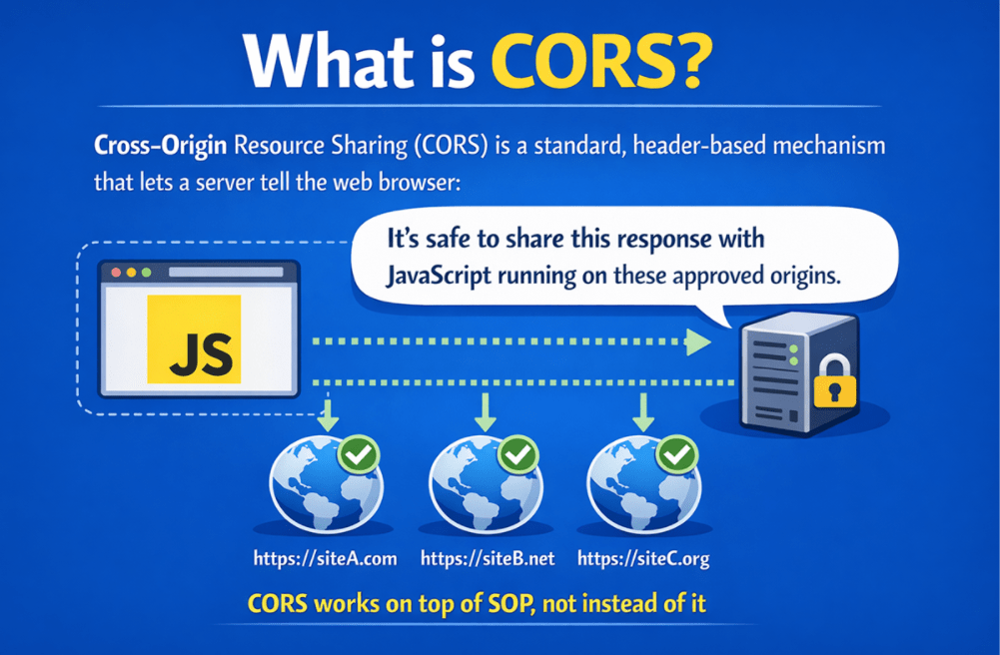

## **CORS در میکروسرویس‌های ASP.NET Core Web API**

در یک **معماری مبتنی بر میکروسرویس‌های** معمولی ، برنامه‌ی frontend ( **Angular، React یا Vue** ) در یک مبدا میزبانی می‌شود، در حالی که APIهای backend که معمولاً از طریق یک **API Gateway** در دسترس هستند ، در مبدا دیگری میزبانی می‌شوند. هنگامی که یک برنامه‌ی مبتنی بر مرورگر سعی می‌کند این APIها را با استفاده از جاوا اسکریپت (یا jQuery AJAX) فراخوانی کند، مدل امنیتی مرورگر به طور خودکار **سیاست Same-Origin Policy (SOP)** را اعمال می‌کند و **به طور پیش‌فرض دسترسی متقابل به مبدا را مسدود می‌کند** .

**CORS (اشتراک‌گذاری منابع بین مبدا)** مکانیزم استانداردی است که به سرورها اجازه می‌دهد **صریحاً به مرورگر بگویند کدام درخواست‌های بین مبدا امن هستند** . با پیکربندی صحیح CORS، سرویس‌های backend می‌توانند APIها را با خیال راحت در اختیار کلاینت‌های مبتنی بر مرورگر قرار دهند و در عین حال قوانین امنیتی داخلی مرورگر را رعایت کنند.

#### **سیاست مبدا یکسان (SOP) چیست؟**

سیاست مبدا یکسان ( Same **\-Origin Policy) یا به اختصار SOP** یک **قانون امنیتی اساسی است که توسط مرورگرهای وب اعمال می‌شود** و نحوه جداسازی وب‌سایت‌ها از یکدیگر را در مرورگر کاربر تعریف می‌کند. این قانون تضمین می‌کند که **کد جاوا اسکریپتی که در یک وب‌سایت اجرا می‌شود، نمی‌تواند آزادانه به داده‌های** **وب‌سایت دیگر** دسترسی داشته باشد ، حتی اگر هر دو در یک جلسه مرورگر باز باشند.

 چیست؟")

به هر صفحه وب که در مرورگر بارگذاری می‌شود، یک **origin** اختصاص داده می‌شود که با ترکیب دقیق موارد زیر تعیین می‌شود:

- **طرح (پروتکل)** – http یا https
- **میزبان (دامنه)** \- مانند example.com
- **پورت** \- مانند ۸۰، ۴۴۳ یا ۴۲۰۰

هر سه مورد باید دقیقاً با هم مطابقت داشته باشند تا دو URL از یک مبدا در نظر گرفته شوند. اگر حتی یک جزء متفاوت باشد، مرورگر آنها را به عنوان مبداهای متفاوت در نظر می‌گیرد.

هدف اصلی SOP محافظت از کاربران است. یک کاربر ممکن است هنگام مرور وب‌سایت‌های دیگر، وارد سیستم‌های حساسی مانند پورتال‌های بانکی، حساب‌های ایمیل یا داشبوردهای مدیریتی شود. SOP مانع از آن می‌شود که یک سایت مخرب با استفاده از جاوا اسکریپت، مخفیانه داده‌های خصوصی را از آن سایت‌های مورد اعتماد بخواند.

##### **ایده کلیدی برای به خاطر سپردن:**

- SOP توسط مرورگر اجرا می‌شود **.**
- SOP **از داده‌های کاربر درون مرورگر محافظت می‌کند.**
- نیست **SOP یک مکانیزم امنیتی سمت سرور** .

#### **چه محدودیت‌هایی در SOP وجود دارد و چرا این موضوع اهمیت دارد؟**

SOP محدود می‌کند **در درجه اول دسترسی به داده‌های بین‌مرجعی از طریق جاوا اسکریپت را** و مانع از سرقت یا جاسوسی اطلاعات محافظت‌شده سایت دیگر توسط یک سایت می‌شود. به‌طور پیش‌فرض، SOP از موارد زیر توسط یک صفحه جلوگیری می‌کند:

- **خواندن پاسخ‌های API بین‌مرجعی** (حتی اگر درخواست ارسال شده و سرور پاسخ دهد).
- **دسترسی به کوکی‌های بین‌منبعی و زمینه‌های محافظت‌شده توسط نشست.**
- **خواندن یا دستکاری محتوای DOM بین‌منبعی (Cross-Origin DOM content).**
- **دسترسی به فضای ذخیره‌سازی مرورگر Cross-Origin** مانند localStorage و sessionStorage.

##### **چرا این مهم است:**

بدون این محدودیت‌ها، هر وب‌سایت تصادفی می‌تواند از مرورگر شما (جایی که از قبل وارد سیستم شده‌اید) برای دریافت و خواندن اطلاعات حساس از سایت‌های دیگر استفاده کند. نکته کلیدی که باید به خاطر داشته باشید این است که **SOP درخواست‌های HTTP را مسدود نمی‌کند** . در عوض، **دسترسی جاوا اسکریپت به داده‌های پاسخ را** مسدود می‌کند .

این یعنی:

- مرورگر ممکن است با موفقیت یک درخواست ارسال کند
- سرور ممکن است آن را پردازش کرده و پاسخی را برگرداند
- ممکن است برگه شبکه عدد ۲۰۰ OK را نشان دهد.
- با این حال، جاوا اسکریپت هنوز از دسترسی به پاسخ محروم است.

SOP درخواست‌ها را مجاز می‌داند اما کنترل می‌کند چه کسی می‌تواند پاسخ را ببیند.

#### **سیاست مبدا یکسان (SOP) چگونه کار می‌کند؟**

وقتی مرورگر یک صفحه وب را بارگذاری می‌کند، به آن صفحه یک مبدأ اختصاص می‌دهد. از آن لحظه به بعد، مرورگر مانند یک نگهبان امنیتی عمل می‌کند: به جاوا اسکریپت صفحه اجازه می‌دهد تا آزادانه با منابع همان مبدأ تعامل داشته باشد، اما دسترسی بین مبدأها را محدود می‌کند. نکته مهم این است که SOP اغلب **نمی‌کند** ارسال درخواست HTTP را متوقف **؛ بلکه مانع از خواندن پاسخ** توسط جاوا اسکریپت می‌شود (یا در سناریوهای قبل از اجرا، درخواست را به طور کامل مسدود می‌کند).

- مقایسه مرورگرها: **Page Origin** در مقابل **API Origin**
- اگر همان → پاسخ برای جاوا اسکریپت قابل دسترسی باشد
- اگر متفاوت باشد → مرورگر دسترسی جاوا اسکریپت به داده‌های پاسخ بین مبدا را مسدود می‌کند
- اعمال می‌شود **SOP توسط مرورگرها** ، نه توسط سرورها

بیایید سناریوها را با مثال‌هایی درک کنیم. برای درک بهتر، لطفاً به نمودار زیر مراجعه کنید.

 چگونه کار می‌کند؟")

##### **درخواست مبدا یکسان**

- **آدرس اینترنتی کلاینت (صفحه وب):** https://example.com/page
- **آدرس اینترنتی سرور (API):** https://example.com/api
- **نتیجه:** درخواست AJAX با موفقیت انجام می‌شود زیرا هر دو URL از یک مبدا مشترک، یعنی پروتکل (https)، دامنه (example.com) و پورت (پیش‌فرض ۴۴۳) استفاده می‌کنند. هیچ مجوز خاصی لازم نیست.

##### **درخواست متقابل مبدا**

- **آدرس اینترنتی کلاینت (صفحه وب):** https://example.com
- **آدرس اینترنتی سرور (API):** https://other-sie.com/api
- **نتیجه:** مرورگر درخواست AJAX را مسدود می‌کند زیرا مبدا (https://example.com در مقابل https://other-sie.com) متفاوت است.

#### **CORS در ASP.NET Core Web API چیست؟**

**اشتراک‌گذاری منابع بین مبداها (CORS)** یک مکانیزم استاندارد مبتنی بر هدر است که به سرور اجازه می‌دهد به مرورگر وب بگوید: اشتراک‌گذاری این پاسخ با جاوا اسکریپتی که روی این مبداهای تأیید شده اجرا می‌شود، ایمن است. CORS **بر روی SOP** کار می‌کند ، نه به جای آن:

- **SOP به طور پیش‌فرض دسترسی بین مبدا و مقصد (Cross-Origin Access) را مسدود می‌کند** (قانون ایمنی مرورگر).
- **CORS یک استثنای کنترل‌شده و مبتنی بر قانون را** زمانی که سرور صراحتاً اجازه دهد، ارائه می‌دهد.

##### **هدرهای کلیدی CORS**

CORS کاملاً توسط مجموعه کوچکی از هدرهای درخواست/پاسخ هدایت می‌شود. هدرهای گم‌شده یا ناسازگار دلیل شکست‌های تصادفی CORS هستند.

###### **هدرهای درخواست (ارسال شده توسط مرورگر):**

- **مبدا** : مبدا فراخوانی را مشخص می‌کند.
- **روش درخواست کنترل دسترسی** : قبل از ارسال، روش مورد نظر را اعلام می‌کند.
- **هدرهای درخواست کنترل دسترسی** : در درخواست‌های قبل از پرواز ارسال می‌شود و هدرهای درخواست مورد نظر را مشخص می‌کند.

###### **هدرهای پاسخ (ارسال شده توسط سرور):**

- **کنترل دسترسی-اجازه-مبدا** : کدام مبدا(ها) می‌توانند به منبع دسترسی داشته باشند؟
- **روش‌های مجاز-کنترل-دسترسی** : کدام روش‌های HTTP مجاز هستند؟
- **Access-Control-Allow-Headers** : کدام هدرهای درخواست مجاز هستند (مثلاً Authorization)؟
- **حداکثر سن کنترل دسترسی** : مرورگر تا چه مدت می‌تواند مجوزهای قبل از پرواز را ذخیره کند؟

با تنظیم این هدرها روی سرور، CORS درخواست‌های امن بین مبدا و مقصد را فعال می‌کند. این هدرها به مرورگر دستور می‌دهند که چگونه درخواست بین مبدا و مقصد را مدیریت کند.

#### **اشتراک‌گذاری منابع بین مبدا (CORS) چگونه کار می‌کند؟**

وقتی یک برنامه وب کلاینت یک درخواست AJAX به یک API وب میزبانی شده در مبدا دیگری ارسال می‌کند، این فرآیند شامل چندین مرحله است که تضمین می‌کند درخواست ایمن است و از سیاست CORS سرور پیروی می‌کند. برای درک بهتر، لطفاً به تصویر زیر نگاهی بیندازید:

 چگونه کار می‌کند؟")

##### **مرحله ۱: درخواست پیش از پرواز (بررسی اولیه)**

قبل از ارسال درخواست اصلی، مرورگر یک درخواست پیش از ارسال را با استفاده از **متد HTTP OPTIONS** به سرور هدف ارسال می‌کند. این درخواست پیش از ارسال شامل اطلاعاتی در مورد **متد HTTP** مورد نظر (مثلاً GET، POST) و **هدرها** (از جمله هدرهای سفارشی) درخواست اصلی است.

- **هدف:** این درخواست از سرور می‌پرسد که آیا ارسال درخواست اصلی امن است یا خیر، و جزئیاتی در مورد روش HTTP و هدرهایی که کلاینت قصد استفاده از آنها را دارد، ارائه می‌دهد.
- **پاسخ سرور:** سرور درخواست پیش از ارسال را با توجه به سیاست CORS خود ارزیابی می‌کند و با هدرهای CORS مانند **Access-Control-Allow-Origin** ، **Access-Control-Allow-Methods** ، **Access-Control-Max-Age** و **Access-Control-Allow-Headers** برای نشان دادن مجوز پاسخ می‌دهد.
- **اگر مجاز باشد:** مرورگر درخواست اصلی را ارسال می‌کند.
- **اگر رد شد:** مرورگر درخواست را مسدود می‌کند.

##### **مرحله ۲: درخواست واقعی**

- پس از دریافت پاسخ مثبت پیش از ارسال، مرورگر درخواست واقعی AJAX (مثلاً GET، POST) را به سرور ارسال می‌کند.
- سرور درخواست را پردازش می‌کند و پاسخی (مانند JSON یا XML) برمی‌گرداند.

##### **مرحله 3: ذخیره نتایج پیش از پرواز**

- برای بهبود عملکرد، مرورگرها پاسخ سرور به درخواست پیش از پرواز را برای مدت زمانی که توسط **هدر Access-Control-Max-Age** تعریف شده است، ذخیره می‌کنند .
- در طول این دوره کش، درخواست‌های بعدی با همان متد و هدرها، مرحله پیش‌پرواز را رد می‌کنند و درخواست اصلی را مستقیماً ارسال می‌کنند.

#### **چرا CORS در میکروسرویس‌های ASP.NET Core Web API اهمیت دارد؟**

در میکروسرویس‌ها، CORS اهمیت پیدا می‌کند زیرا سیستم ما معمولاً بین **چندین دامنه/زیردامنه/پورت** تقسیم می‌شود . یک frontend (Angular/React/Vue) اغلب روی یک مبدا (مانند https://app.company.com) اجرا می‌شود در حالی که نقطه ورود API (Gateway) روی مبدا دیگری (مانند https://api.company.com) اجرا می‌شود. از آنجایی که مرورگرها **سیاست Same-Origin را** در نظر گرفته می‌شوند **اجرا می‌کنند، این فراخوانی‌ها به عنوان cross-origin** و مگر اینکه CORS به درستی پیکربندی شود، مسدود خواهند شد.

CORS ربطی به این ندارد که آیا API ما کار می‌کند یا خیر. APIهای ما می‌توانند کاملاً سالم باشند، اما **اگر قوانین CORS وجود نداشته باشند یا اشتباه باشند ، مرورگر همچنان جاوا اسکریپت را از خواندن پاسخ باز می‌دارد** . به همین دلیل است که تیم‌ها اغلب با این وضعیت گیج‌کننده مواجه می‌شوند: در Postman کار می‌کند اما در مرورگر از کار می‌افتد.

- میکروسرویس‌ها معمولاً **ریشه‌های بیشتری را** معرفی می‌کنند : دامنه رابط کاربری، دامنه دروازه، دامنه هویت، دامنه CDN و محیط‌های چندگانه (dev/stage/prod).
- SPA های مدرن معمولاً **هدرهای مجوز (JWT)** و **هدرهای سفارشی** (X-API-Key، X-Correlation-Id) ارسال می‌کنند که اغلب **درخواست‌های پیش از اجرا (OPTIONS)** را فعال می‌کنند .
- بدون CORS مناسب، **رابط کاربری با مشکل مواجه می‌شود** ، حتی اگر سرویس‌های بک‌اند به خوبی کار کنند.

#### **CORS در API Gateway در مقابل سرویس‌های تکی**

CORS باید زمانی مدیریت شود که **مرورگر درخواستی به سیستم ما ارسال می‌کند** . در میکروسرویس‌ها، ساده‌ترین رویکرد معمولاً اعمال CORS در **API Gateway است، نه پیکربندی آن در هر** میکروسرویس. این کار باعث می‌شود سرویس‌های داخلی بر منطق کسب‌وکار متمرکز شوند و قوانین خاص مرورگر در حاشیه باقی بمانند.

##### **CORS در دروازه API (توصیه شده)**

وقتی CORS در API Gateway پیکربندی می‌شود، مرورگر با **یک نقطه پایانی عمومی** ارتباط برقرار می‌کند و Gateway دسترسی بین مبداها را به طور مداوم مدیریت می‌کند.

- **نقطه کنترل واحد:** یک مکان برای تعریف مبداها، متدها و سرآیندهای مجاز.
- **ثبات:** هر مسیر برای مرورگر رفتار یکسانی دارد.
- **نگهداری آسان:** ما به جای تغییر چندین سرویس، یک بار سیاست را به‌روزرسانی می‌کنیم.
- **کارایی قبل از پرواز:** دروازه اغلب می‌تواند بدون فراخوانی سرویس‌های پایین‌دستی، به سرعت به OPTIONS پاسخ دهد.

##### **CORS در مورد خدمات انفرادی (فقط در صورت نیاز)**

این فقط زمانی استفاده می‌شود که مرورگر بتواند مستقیماً چندین سرویس (سرویس‌های در معرض دید عموم) را فراخوانی کند. این کار امکان‌پذیر است، اما پیچیدگی را افزایش می‌دهد.

- **تکرار سیاست‌ها:** هر سرویس قوانین یکسانی را تکرار می‌کند.
- **رانش پیکربندی:** یک سرویس فراموش می‌کند که به یک هدر/متد → وقفه‌های رابط کاربری فقط برای برخی از نقاط پایانی اجازه دهد.
- **سطح حمله بزرگتر:** هر سرویس به یک هدف مرورگر تبدیل می‌شود.
- **ریسک بیشتر در استقرار:** ریشه‌های محیطی باید در بین سرویس‌ها هماهنگ نگه داشته شوند.

#### **چه زمانی واقعاً به CORS نیاز دارید؟**

ما فقط در سناریوی خاصی به CORS نیاز داریم که **جاوااسکریپتِ در حال اجرا در مرورگر،** یک API را از **مبدا دیگری** فراخوانی می‌کند و مرورگر باید به جاوااسکریپت اجازه دهد **پاسخ را بخواند** (یا از پیش اجرا عبور کند). **CORS برای مرورگرها وجود دارد، نه برای APIها.**

##### **وقتی همه این موارد درست باشند، به CORS نیاز داریم:**

- کلاینت یک **برنامه مبتنی بر مرورگر است.**
- مرورگر **جاوا اسکریپت را اجرا می‌کند.**
- API از **مبدا متفاوتی** است (طرح/میزبان/پورت متفاوت است).
- جاوا اسکریپت باید بتواند **پاسخ را بخواند** (و در صورت لزوم پیش‌پرواز را تکمیل کند).

##### **ما معمولاً برای موارد زیر به CORS نیاز نداریم:**

- **فراخوانی‌های سرویس به سرویس** درون شبکه میکروسرویس‌ها.
- **فراخوانی‌های سرور بک‌اند** (کارهای زمان‌بندی‌شده، workerها، سرویس‌های پس‌زمینه).
- **اپلیکیشن‌های موبایل.**
- **پستچی/کِرل.**
- رابط کاربری و API از یک **مبدا یکسان ارائه می‌شوند.**

#### **چرا CORS برای جاوا اسکریپت اعمال می‌شود اما برای Postman یا فراخوانی‌های سرور به سرور اعمال نمی‌شود؟**

اجرا می‌شود **CORS فقط توسط مرورگرهای وب** تا کاربران را از **کد جاوا اسکریپت غیرقابل اعتماد** که درون مرورگر اجرا می‌شود، محافظت کند. وقتی جاوا اسکریپت یک درخواست بین مبدا ارسال می‌کند، مرورگر قوانین CORS را بررسی می‌کند تا تصمیم بگیرد که آیا می‌توان به پاسخ دسترسی پیدا کرد یا خیر.

فراخوانی‌های Postman و Server-to-Server نیازی به CORS ندارند زیرا **درون مرورگر اجرا نمی‌شوند** و در **محیط‌های قابل اعتماد** عمل می‌کنند . از آنجایی که هیچ خطری برای سرقت داده‌های بین سایتی توسط اسکریپت‌های مرورگر وجود ندارد، سیاست Same-Origin و قوانین CORS مرورگر اعمال نمی‌شوند. **قانون ساده:** **بدون مرورگر، بدون جاوا اسکریپت، بدون CORS.**

##### **نتیجه‌گیری: چرا CORS در میکروسرویس‌ها اهمیت دارد؟**

CORS یک **مکانیزم امنیتی مرورگر** است ، نه یک ویژگی API، و به گونه‌ای طراحی شده است که ارتباط بین مبدا و مبدا را برای جاوا اسکریپت در حال اجرا در مرورگرهای وب به طور ایمن فعال کند. در میکروسرویس‌های ASP.NET Core Web API، که در آن معمولاً frontend و backend روی مبداهای مختلفی اجرا می‌شوند، درک CORS برای جلوگیری از خرابی‌های سمت مرورگر که حتی در صورت سالم بودن APIها رخ می‌دهند، ضروری است. با اعمال صحیح CORS، ترجیحاً در API Gateway، و دانستن زمان واقعی نیاز به آن، می‌توانید تعاملات مرورگر با API را در سیستم‌های توزیع‌شده مدرن، ایمن، قابل پیش‌بینی و قابل نگهداری بسازید.