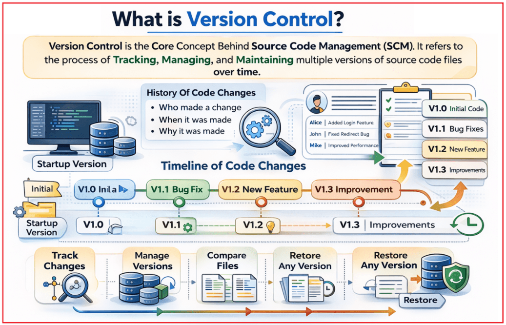
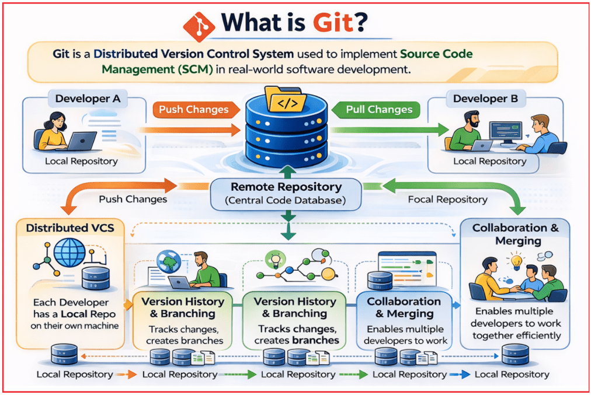
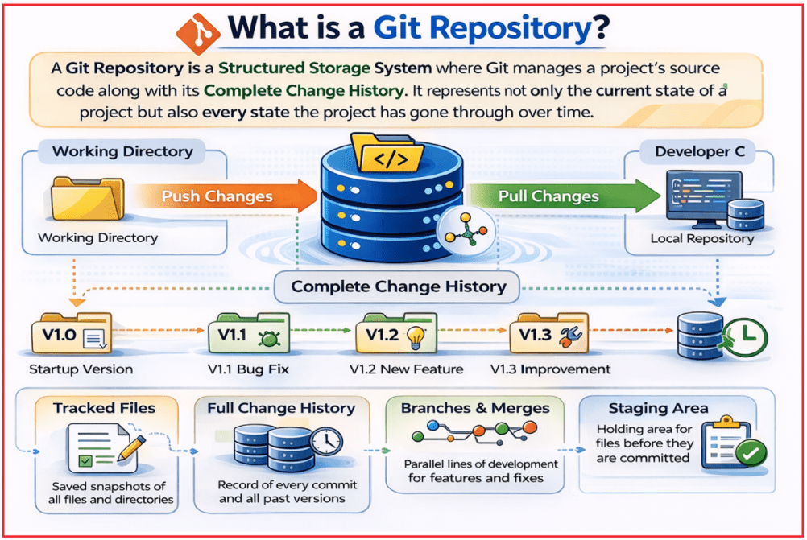
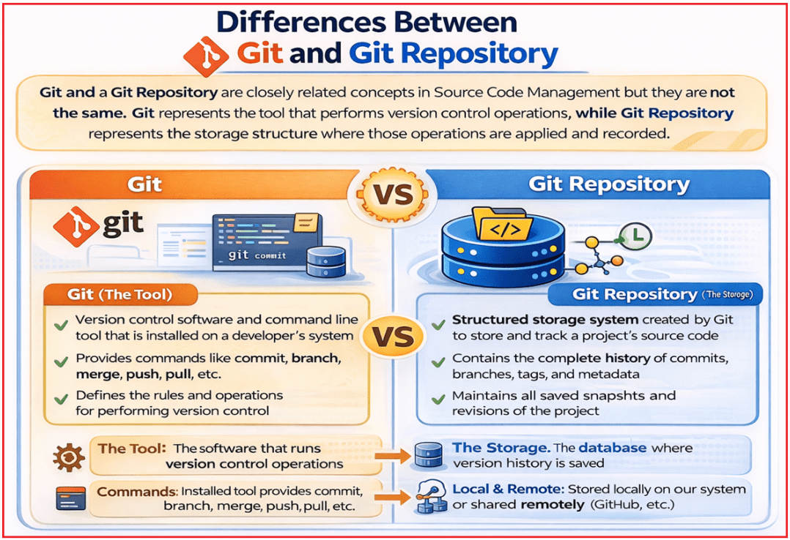

## **مقدمه‌ای بر مدیریت کد منبع (SCM)**

در توسعه نرم‌افزار، نوشتن کد تنها بخشی از کار است. چالش بزرگتر، **مدیریت تغییرات کد در طول زمان** است ، به خصوص زمانی که چندین توسعه‌دهنده روی یک پروژه کار می‌کنند. با رشد برنامه‌ها، فایل‌ها مرتباً ویرایش می‌شوند، ویژگی‌ها اضافه می‌شوند، اشکالات برطرف می‌شوند و پیشرفت‌ها به طور مداوم انجام می‌شوند. بدون یک سیستم مناسب، مدیریت این تغییرات بسیار دشوار و پرخطر می‌شود.

اینجاست که **مدیریت کد منبع (SCM)** نقش حیاتی ایفا می‌کند. SCM روشی ساختاریافته برای **ذخیره، پیگیری، مدیریت و کنترل تغییرات کد منبع** فراهم می‌کند و ثبات، پاسخگویی و همکاری روان را در طول چرخه عمر توسعه نرم‌افزار تضمین می‌کند.

#### **مدیریت کد منبع (SCM) چیست؟**

مدیریت کد منبع (SCM) یک رویکرد سیستماتیک است که برای **مدیریت، پیگیری و کنترل تغییرات** ایجاد شده در کد منبع در طول چرخه عمر توسعه نرم‌افزار استفاده می‌شود. در پروژه‌های نرم‌افزاری دنیای واقعی، کد هرگز یک بار نوشته نمی‌شود و بدون تغییر باقی می‌ماند. با اضافه شدن ویژگی‌های جدید، رفع اشکالات و بهبودها، کد به طور مداوم تکامل می‌یابد. SCM تضمین می‌کند که رخ می‌دهد **این تکامل به شیوه‌ای کنترل‌شده و** **سازمان‌یافته** .

 چیست؟")

SCM به عنوان یک **مرجع مرکزی و نگهدارنده تاریخچه** برای کد منبع عمل می‌کند. این سیستم، سابقه کاملی از نحوه تغییر کدبیس در طول زمان، چه کسی این تغییرات را انجام داده و چرایی آن را نگهداری می‌کند. این سابقه برای درک رشد یک برنامه و حفظ کیفیت کد در درازمدت ضروری است.

##### **SCM تضمین می‌کند که:**

- هر تغییری که در کد ایجاد شود، ثبت می‌شود.
- نسخه‌های قدیمی‌تر کد با خیال راحت حفظ می‌شوند
- چندین توسعه‌دهنده می‌توانند همزمان کار کنند
- یکپارچگی و ثبات کد حفظ می‌شود
- توسعه‌دهندگان می‌توانند در صورت نیاز به نسخه‌های پایدار قبلی بازگردند

#### **چرا SCM در توسعه نرم‌افزار مورد نیاز است؟**

توسعه نرم‌افزار یک **فرآیند پیوسته، افزایشی و مشارکتی** است . در پروژه‌های دنیای واقعی، کد یک بار نوشته و نهایی نمی‌شود؛ بلکه با آمدن الزامات جدید، رفع اشکالات، بهینه‌سازی عملکرد و اصلاح کد موجود، دائماً تکامل می‌یابد. مدیریت این تغییرات مکرر به صورت دستی، غیرقابل اعتماد، مستعد خطا و با رشد پروژه یا تیم، قابل توسعه نیست.

توسعه داده می‌شوند **برنامه‌های مدرن معمولاً توسط چندین توسعه‌دهنده** که اغلب به طور همزمان و گاهی از مکان‌های مختلف کار می‌کنند. بدون یک سیستم مناسب، تیم‌ها ممکن است به شیوه‌های ناامن مانند کپی کردن پوشه‌ها، تغییر نام فایل‌ها با تاریخ یا اشتراک‌گذاری کد از طریق ایمیل متوسل شوند. این رویکردها به سرعت نامرتب و نامنظم می‌شوند و شناسایی آخرین نسخه، بازیابی کد قبلی یا درک اینکه چه کسی تغییرات خاصی را ایجاد کرده است، دشوار می‌شود. SCM تضمین می‌کند که تغییرات کد به شیوه‌ای کنترل‌شده و حرفه‌ای در طول چرخه عمر توسعه انجام شود.

##### **SCM مورد نیاز است زیرا:**

- سابقه کامل و قابل اعتمادی از تمام تغییرات کد را نگهداری می‌کند
- به توسعه‌دهندگان اجازه می‌دهد تا نسخه‌های پایدار قبلی را بازیابی یا به آنها بازگردند
- از گم شدن تصادفی یا بازنویسی کد جلوگیری می‌کند
- چندین توسعه‌دهنده را قادر می‌سازد تا به صورت موازی و ایمن کار کنند.
- با ثبت اینکه چه کسی چه چیزی را و چرا تغییر داده است، قابلیت ردیابی را فراهم می‌کند.
- از توسعه مداوم و انتشارهای مکرر پشتیبانی می‌کند

در توسعه نرم‌افزار حرفه‌ای، **مدیریت زنجیره تأمین (SCM) اختیاری نیست - بلکه یک الزام اساسی** برای ساخت برنامه‌های پایدار، قابل نگهداری و مقیاس‌پذیر است.

#### **کنترل نسخه چیست؟**

کنترل نسخه، **مفهوم اصلی پشت مدیریت کد منبع (SCM)** است . این به فرآیند **ردیابی، مدیریت و نگهداری نسخه‌های متعدد از فایل‌های کد منبع در طول زمان** اشاره دارد . کنترل نسخه به جای برخورد با کد به عنوان یک مجموعه فایل ثابت و واحد، آن را به عنوان یک جدول زمانی در حال تکامل در نظر می‌گیرد که در آن هر تغییر معنی‌دار ثبت و حفظ می‌شود.

از نظر مفهومی، کنترل نسخه، کد منبع را به عنوان یک **جدول زمانی از تغییرات** در نظر می‌گیرد . هر مجموعه معنادار از تغییرات به عنوان یک نسخه جدید ثبت می‌شود و یک تصویر لحظه‌ای پایدار از پروژه در یک نقطه زمانی خاص ایجاد می‌کند. این به توسعه‌دهندگان اجازه می‌دهد تا در صورت نیاز، در طول تاریخچه پروژه به عقب یا جلو حرکت کنند.

##### **سیستم‌های کنترل نسخه موارد زیر را ارائه می‌دهند:**

- سابقه تمام تغییرات کد
- فراداده‌هایی مانند اینکه چه کسی، چه زمانی و چرا تغییری ایجاد کرده است
- ابزارهایی برای مقایسه نسخه‌های مختلف یک فایل
- امکان بازیابی ایمن هر نسخه قبلی

#### **تفاوت بین پشتیبان‌گیری فایل و کنترل نسخه**

پشتیبان‌گیری از فایل و کنترل نسخه ممکن است شبیه به هم به نظر برسند زیرا هر دو شامل ذخیره کپی‌هایی از فایل‌ها هستند. با این حال، آنها **اساساً اهداف متفاوتی را** دنبال می‌کنند .

- **پشتیبان‌گیری از فایل‌ها عمدتاً بر بازیابی تمرکز دارد** : کپی‌هایی از فایل‌ها را نگه می‌دارد تا در صورت از دست رفتن فایل‌ها، بتوانید آنها را بازیابی کنید.
- **کنترل نسخه بر تکامل و همکاری تمرکز دارد** : این کنترل به طور مداوم نحوه تغییر کد را در طول زمان پیگیری می‌کند و از کار تیمی به صورت ساختاریافته پشتیبانی می‌کند.

پشتیبان‌ها فایل‌ها را در مقاطع زمانی مشخصی ذخیره می‌کنند، اما معمولاً مشخص نمی‌کنند چه چیزی تغییر کرده، چه کسی آن را تغییر داده و چرا. سیستم‌های کنترل نسخه، تغییرات را به عنوان یک تاریخچه معنادار ثبت می‌کنند، امکان مقایسه بین نسخه‌ها را فراهم می‌کنند و مکانیسم‌های ایمنی را برای بازگشت به نسخه‌های قبلی و ادغام کار چندین توسعه‌دهنده فراهم می‌کنند.

##### **نکات کلیدی برای به خاطر سپردن:**

- پشتیبان‌ها کپی‌هایی از فایل‌ها را ذخیره می‌کنند؛ **کنترل نسخه، تغییرات و نسخه‌ها را ردیابی می‌کند**
- پشتیبان‌گیری عمدتاً برای بازیابی است؛ **کنترل نسخه برای ثبت تغییرات + همکاری**
- پشتیبان‌ها زمینه (نویسنده/دلیل) را ذخیره نمی‌کنند؛ **کنترل نسخه، هدف و فراداده را حفظ می‌کند.**
- پشتیبان‌گیری‌ها می‌توانند دستی یا زمان‌بندی‌شده باشند؛ **کنترل نسخه به‌طور مداوم در حین کار شما انجام می‌شود**
- پشتیبان‌گیری‌ها متمرکز بر فرد هستند؛ **کنترل نسخه از کار تیمی، ادغام و مدیریت تداخل پشتیبانی می‌کند**
- کنترل نسخه امکان مقایسه و بازگرداندن آسان را فراهم می‌کند؛ پشتیبان‌گیری‌ها معمولاً این امکان را ندارند.

پشتیبان‌گیری‌ها، کپی‌هایی را برای بازیابی ذخیره می‌کنند، در حالی که کنترل نسخه، تاریخچه کامل تغییرات را مدیریت کرده و همکاری ایمن را امکان‌پذیر می‌سازد.

#### **گیت چیست؟**

گیت یک **سیستم کنترل نسخه توزیع‌شده** است که برای پیاده‌سازی **مدیریت کد منبع (SCM)** در توسعه نرم‌افزار در دنیای واقعی استفاده می‌شود. توزیع‌شده به این معنی است که هر توسعه‌دهنده یک **کپی کامل از پروژه و تاریخچه تغییرات کامل آن را** در دستگاه خود دارد. این طراحی عملکرد را بهبود می‌بخشد، قابلیت اطمینان را افزایش می‌دهد و به توسعه‌دهندگان اجازه می‌دهد حتی بدون اتصال به اینترنت کار کنند. توسعه‌دهندگان می‌توانند تغییرات را به صورت محلی ردیابی کنند و بعداً آنها را از طریق مخازن راه دور با دیگران به اشتراک بگذارند.

##### **تفاوت بین تغییرات فشاری و تغییرات کششی**

- **اعمال تغییرات (Push Changes)** به معنای ارسال تغییرات کد محلی شما از سیستمتان به یک مخزن مشترک از راه دور است. پس از اینکه کار خود را به صورت محلی انجام دادید، اعمال تغییرات، آن تغییرات را در دسترس سایر اعضای تیم قرار می‌دهد و همه را با به‌روزرسانی‌های شما همگام نگه می‌دارد.
- **تغییرات** را از مخزن راه دور به سیستم محلی خود منتقل کنید. این تضمین می‌کند که نسخه محلی شما شامل تغییراتی است که توسط سایر توسعه‌دهندگان ایجاد شده است، بنابراین می‌توانید روی جدیدترین و صحیح‌ترین نسخه پروژه کار کنید.

##### **نکات کلیدی برای به خاطر سپردن:**

- گیت (Git) یک **سیستم کنترل نسخه توزیع‌شده** برای مدیریت تغییرات کد است.
- هر توسعه‌دهنده‌ای **تاریخچه کامل مخزن را به صورت محلی دارد.**
- پیشرفت پروژه را به صورت **اسنپ‌شات (نسخه‌ها)** ثبت می‌کند و تاریخچه را به طور کارآمد ذخیره می‌کند.
- پشتیبانی از **کار آفلاین** با عملیات محلی سریع.
- قوی **شاخه‌بندی و ادغام** برای توسعه موازی فراهم می‌کند.

گیت یک سیستم کنترل نسخه توزیع‌شده است که تاریخچه کد را به‌صورت محلی پیگیری می‌کند، از شاخه‌بندی/ادغام پشتیبانی می‌کند و کار تیمی قابل اعتمادی را امکان‌پذیر می‌سازد.

#### **سیستم کنترل نسخه توزیع شده چیست؟**

سیستم کنترل نسخه توزیع‌شده (DVCS) یک مدل کنترل نسخه است که در آن **هر توسعه‌دهنده یک کپی کامل از مخزن** ، شامل تاریخچه کامل تغییرات، را روی دستگاه خود دارد. برخلاف سیستم‌های متمرکز، هیچ نقطه واحدی وجود ندارد که کد در آن وجود داشته باشد؛ هر مخزن محلی کاملاً کاربردی و مستقل است.

در یک DVCS، توسعه‌دهندگان **به صورت محلی و مستقل** کار می‌کنند و فقط از یک مخزن مشترک از راه دور برای **تبادل تغییرات** با دیگران استفاده می‌کنند. این طراحی، توسعه را سریع‌تر، ایمن‌تر و انعطاف‌پذیرتر می‌کند، به خصوص برای تیم‌هایی که به صورت موازی یا از مکان‌های مختلف کار می‌کنند.

#### **مخزن گیت چیست؟**

( **مخزن گیت** Git Repository) یک **سیستم ذخیره‌سازی ساختاریافته** است که در آن **گیت** کد منبع یک پروژه را به همراه **تاریخچه کامل تغییرات** آن مدیریت می‌کند . این مخزن نه تنها وضعیت فعلی یک پروژه، بلکه هر وضعیتی را که پروژه در طول زمان طی کرده است، نشان می‌دهد.

یک مخزن (repository) شامل تمام اطلاعاتی است که گیت برای ردیابی و مدیریت کد به آن نیاز دارد، از جمله فایل‌ها، تاریخچه کامیت‌ها، شاخه‌ها (branches) و جزئیات پیکربندی.

یک مخزن گیت شامل موارد زیر است:

- فایل‌های کد منبع
- تاریخچه کامیت و نسخه
- اطلاعات شاخه‌بندی و ادغام
- پیکربندی و فراداده

انواع مخازن گیت:

- **مخزن محلی** : روی دستگاه توسعه‌دهنده وجود دارد و امکان کار آفلاین را فراهم می‌کند.
- **مخزن راه دور** : میزبانی شده بر روی یک سرور مشترک برای فعال کردن همکاری تیمی

وقتی یک پروژه در مخزن گیت قرار می‌گیرد، گیت می‌تواند **را به طور کامل ردیابی، مدیریت و کنترل کند .** تمام تغییرات اعمال شده در کد

#### **تفاوت بین گیت و مخزن گیت:**

گیت و مخزن گیت مفاهیم نزدیکی در مدیریت کد منبع هستند، اما **یکسان نیستند** . گیت است **ابزاری** که عملیات کنترل نسخه را انجام می‌دهد، در حالی که مخزن گیت است **ساختار ذخیره‌سازی** که در آن این عملیات اعمال و ثبت می‌شوند.

وقتی می‌گوییم **گیت** ، منظورمان **ابزار/نرم‌افزار** است - سیستم کنترل نسخه نصب‌شده روی دستگاه ما که دستوراتی مانند git init، git commit، git push و غیره را ارائه می‌دهد. این سیستم نحوه عملکرد کنترل نسخه را تعریف می‌کند: شاخه‌بندی، ادغام، ذخیره‌سازی اسنپ‌شات، ارتباط با ریموت‌ها و غیره.

یک **مخزن گیت** از سوی دیگر، **، فضای ذخیره‌سازی پروژه** است که گیت فایل‌ها، تاریخچه، کامیت‌ها، شاخه‌ها و تگ‌های ما را در آن نگه می‌دارد. مخازن می‌توانند به صورت محلی روی سیستم ما یا از راه دور روی سرویس‌هایی مانند گیت‌هاب قرار گیرند. گیت (ابزار) روی مخازن کار می‌کند؛ بدون مخزن، گیت چیزی برای مدیریت ندارد.

##### **آنها چه هستند؟**

- **گیت** \= *سیستم کنترل نسخه توزیع‌شده* (نرم‌افزار + دستورات).
- **مخزن گیت** \= *محل ذخیره‌سازی داده* که شامل فایل‌های پروژه و تاریخچه کامل آن است.

##### **نقش در SCM**

- گیت تمام **عملیات‌ها** را ارائه می‌دهد : init، add، commit، branch، merge، push، pull و غیره.
- مخزن گیت **مکانی است که نتایج آن عملیات** (اسنپ‌شات‌ها، کامیت‌ها، شاخه‌ها) در آن ذخیره می‌شوند.

##### **مکان**

- گیت (Git) **یک بار** در هر دستگاه نصب می‌شود (مانند هر برنامه/CLI دیگری).
- مخازن گیت **برای هر پروژه** هستند - شما می‌توانید چندین مخزن روی یک دستگاه داشته باشید (هر پوشه دارای دایرکتوری .git مخفی خودش است).

##### **محلی در مقابل از راه دور**

- گیت هم برای **محلی** کارهای **و هم هنگام تعامل با سرورهای راه دور** اجرا می‌شود . یک مخزن گیت می‌تواند:
	- - **مخزن محلی** روی لپ‌تاپ/کامپیوتر شما.
				- **مخزن از راه دور که** روی پلتفرم‌هایی مانند GitHub / GitLab / Azure Repos میزبانی می‌شود.

##### **رابطه وابستگی**

- شما می‌توانید گیت را بدون هیچ مخزنی نصب کنید - این فقط **ابزار را** در اختیار شما قرار می‌دهد .
- شما نمی‌توانید بدون خود گیت، یک مخزن گیت مفید داشته باشید—گیت چیزی است که آن مخزن را می‌فهمد و مدیریت می‌کند.

##### **مقایسه**

- گیت مانند یک **برنامه مدیریت عکس** است (با ویژگی‌هایی مانند وارد کردن، ویرایش و سازماندهی).
- یک مخزن گیت مانند **کتابخانه عکس** است که تمام عکس‌ها و ویرایش‌ها در آن ذخیره می‌شوند.

#### **چرا گیت (Git) به طور گسترده در صنعت مورد استفاده قرار می‌گیرد؟**

گیت به **سیستم کنترل نسخه استاندارد صنعت** تبدیل شده است زیرا کاملاً با نیازهای توسعه نرم‌افزار در دنیای واقعی همسو است. توسعه مدرن نیاز به تکرار سریع، انتشار مکرر و همکاری بین چندین توسعه‌دهنده دارد و گیت از همه این موارد بدون به خطر انداختن ثبات یا عملکرد پشتیبانی می‌کند.

سازمان‌ها گیت را ترجیح می‌دهند زیرا به راحتی از پروژه‌های کوچک به سیستم‌های سازمانی مقیاس‌پذیر است و با اکوسیستم توسعه امروزی به خوبی کار می‌کند. از کار توزیع‌شده پشتیبانی می‌کند، توسعه موازی را از طریق شاخه‌بندی و ادغام امکان‌پذیر می‌سازد و به راحتی با پلتفرم‌ها و ابزارهای محبوب مورد استفاده در گردش‌های کاری حرفه‌ای ادغام می‌شود.

##### **نکات کلیدی برای به خاطر سپردن:**

- رایگان و متن‌باز بودن، که آن را برای همه قابل دسترس می‌کند
- برای پروژه‌های کوچک و بزرگ به خوبی مقیاس‌پذیر است
- پشتیبانی از توسعه توزیع‌شده (کار به صورت محلی، اشتراک‌گذاری از طریق ریموت‌ها)
- پشتیبانی عالی برای توسعه موازی با استفاده از شاخه‌ها و ادغام‌ها
- پشتیبانی قوی از اکوسیستم و جامعه
- به خوبی با IDE هایی مانند Visual Studio ادغام می شود.

امروزه، **دانش گیت (Git) یک مهارت اساسی** برای توسعه‌دهندگان نرم‌افزار محسوب می‌شود و تقریباً در هر نقش توسعه‌ای مورد انتظار است.

###### **نتیجه‌گیری:**

در پایان، مدیریت کد منبع (SCM) برای ساخت نرم‌افزار به روشی ایمن، سازمان‌یافته و تیمی ضروری است. این امر به توسعه‌دهندگان کمک می‌کند تا هر تغییری را ردیابی کنند، یک تاریخچه قابل اعتماد را حفظ کنند، در صورت نیاز نسخه‌های پایدار قبلی را بازیابی کنند و بدون از دست دادن کار، با اطمینان همکاری کنند و توسعه نرم‌افزار را در درازمدت پایدارتر و قابل نگهداری‌تر کنند.