## **نصب و راه‌اندازی Git و GitHub در ویژوال استودیو**

توسعه نرم‌افزار مدرن هرگز به معنای کدنویسی صرف نیست. پروژه‌های دنیای واقعی شامل **تغییرات مداوم، همکاری، پشتیبان‌گیری، ردیابی تاریخچه و کار تیمی هستند** . اینجاست که **ادغام گیت** و **ویژوال استودیو** ضروری می‌شود.

گیت (Git) یک **ابزار کنترل نسخه (Version Control Tool)** است که به ما کمک می‌کند تغییرات کد خود را در طول زمان پیگیری کنیم، به نسخه‌های قدیمی‌تر برگردیم و بدون ترس از خراب شدن همه چیز، با خیال راحت کار کنیم. ویژوال استودیو (Visual Studio) دارای **یکپارچه‌سازی داخلی گیت (Git)** است ، بنابراین می‌توانیم اکثر وظایف گیت (commit، push، pull، branch، merge) را بدون ترک IDE انجام دهیم.

#### **گیت چیست؟**

**گیت** یک **سیستم کنترل نسخه توزیع‌شده (DVCS) رایگان و متن‌باز** است که برای موارد زیر استفاده می‌شود:

- پیگیری تغییرات ایجاد شده در فایل‌های کد منبع
- نگهداری تاریخچه کامل یک پروژه
- به چندین توسعه‌دهنده اجازه دهید تا با خیال راحت روی یک کدبیس کار کنند
- وقتی مشکلی پیش آمد، نسخه‌های قدیمی‌تر را بازیابی کنید

گیت با کد شما به عنوان یک **جدول زمانی از اسنپ‌شات‌ها** است **رفتار می‌کند، نه فقط فایل‌ها. گیت یک ابزار/نرم‌افزار** ، نه یک وب‌سایت، و به طور پیش‌فرض بخشی از ویژوال استودیو نیست.

#### **آیا لازم است گیت را جداگانه برای ویژوال استودیو نصب کنیم؟**

**بله. ۱۰۰٪ بله.** این یکی از نکات بسیار اشتباه برای مبتدیان است.

- ویژوال استودیو **با گیت ارائه نمی‌شود.**
- ویژوال استودیو فقط یک **رابط گرافیکی ارائه می‌دهد.**
- گیت **موتور واقعی** است که کنترل نسخه را انجام می‌دهد.

به این شکل فکر کنید:

- گیت = موتور
- ویژوال استودیو = داشبورد و کنترل‌ها

بدون نصب گیت:

- گزینه‌های منوی گیت در ویژوال استودیو به درستی کار نمی‌کنند
- شما قادر به ایجاد یا مدیریت مخازن نخواهید بود

بنابراین، **اولین و اجباری‌ترین قدم** ، نصب گیت روی ویندوز است.

#### **نحوه نصب گیت روی ویندوز**

برای استفاده از گیت با ویژوال استودیو ۲۰۲۲، ابتدا باید گیت را روی سیستم ویندوز خود نصب کنید. گیت برای ویندوز تمام ابزارهای مورد نیاز برای ردیابی تغییرات کد منبع و تعامل با مخازن راه دور مانند گیت‌هاب را فراهم می‌کند. مراحل زیر **نحوه دانلود، نصب و پیکربندی گیت در ویندوز** را با استفاده از تنظیمات توصیه شده مناسب برای مبتدیان و کاربران ویژوال استودیو توضیح می‌دهد.

##### **مرحله ۱: دانلود گیت برای ویندوز**

1. مرورگر خود را باز کنید
2. به وب‌سایت رسمی گیت بروید : [**https://git-scm.com**](https://git-scm.com)
3. کلیک کنید **برای دانلود ویندوز**
4. آخرین **نسخه نصب‌کننده گیت برای ویندوز (.exe)** به‌طور خودکار دانلود خواهد شد.

برای درک بهتر، لطفاً به تصویر زیر نگاهی بیندازید.

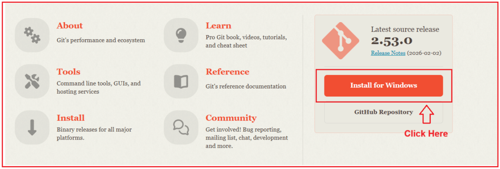

##### **انتخاب نصاب صحیح**

در صفحه دانلود، ممکن است چندین گزینه مشاهده کنید. برای یک **کامپیوتر معمولی ویندوز ۶۴ بیتی (اینتل/AMD)** ،   **گزینه Git for Windows / x64 Setup (Standalone Installer)** را انتخاب کنید . این **نصب‌کننده استاندارد و توصیه‌شده** است .

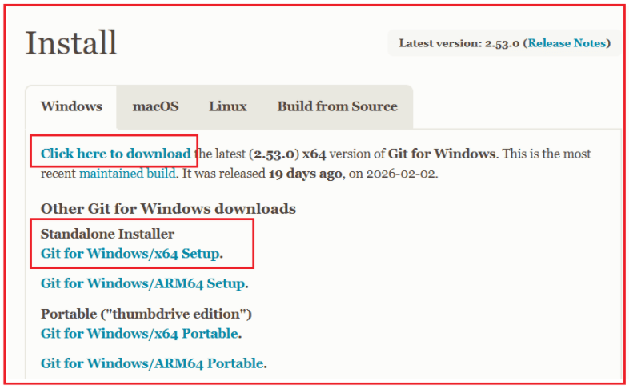

###### **این نصب کننده برای موارد زیر بهترین گزینه است:**

- ویندوز ۱۰ / ویندوز ۱۱
- کاربران ویژوال استودیو ۲۰۲۲
- مبتدیان
- کامپیوترهای رومیزی و لپ‌تاپ‌های معمولی (پردازنده‌های اینتل / ای‌ام‌دی)

##### **مرحله ۲: نصب‌کننده گیت را شروع کنید**

1. روی فایل .exe دانلود شده دوبار کلیک کنید
2. جادوگر راه‌اندازی گیت باز می‌شود
3. کلیک کنید **روی Next** روی صفحه خوشامدگویی

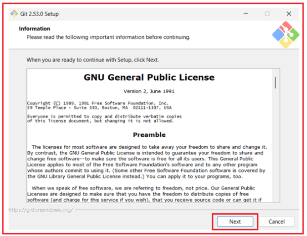

##### **مرحله 3: نکات مهم نصب**

بیشتر مبتدیان در اینجا گیج می‌شوند. این **تنظیمات پیشنهادی را** دنبال کنید .

##### **انتخاب پوشه مقصد**

مکان پیش‌فرض را نگه دارید:

- C:\\فایل‌های برنامه\\گیت
- کلیک کنید **روی بعدی**

مسیر پیش‌فرض پایدار، پرکاربرد و کاملاً سازگار با ویژوال استودیو است.

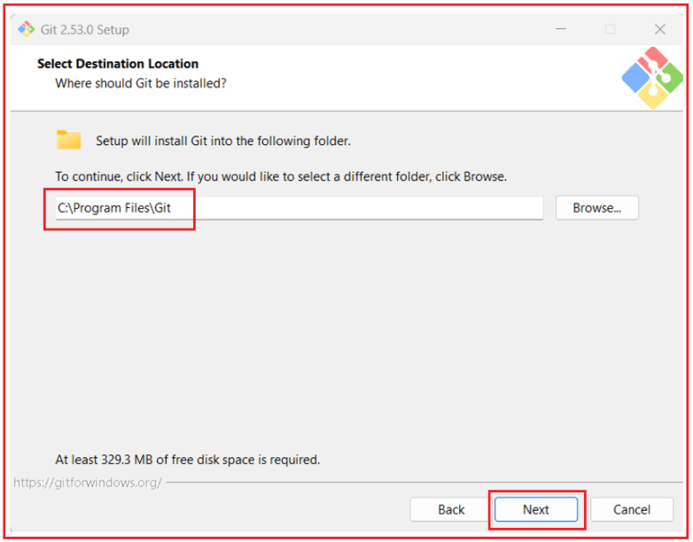

##### **انتخاب اجزا**

این گزینه‌ها تعیین می‌کنند که گیت چه ویژگی‌های اضافی را نصب کند.

**گزینه‌های زیر را تیک بزنید:**

- **ادغام ویندوز اکسپلورر**
	- - گیت بش را از اینجا باز کنید
				- رابط کاربری گرافیکی گیت را از اینجا باز کنید
- **Git LFS (پشتیبانی از فایل‌های بزرگ)**
- **فایل‌های پیکربندی ‎.git\*** ‎ را با ویرایشگر پیش‌فرض مرتبط کنید
- **مرتبط کردن فایل‌های ‎.sh‎ برای اجرا با Bash**
- **اسکالر (افزونه گیت برای مدیریت مخازن در مقیاس بزرگ)**

**گزینه‌های زیر را بدون تیک بگذارید:**

- آیکون‌های اضافی دسکتاپ
- روزانه Git را برای به‌روزرسانی‌های ویندوز بررسی کنید
- افزودن پروفایل Git Bash به ترمینال ویندوز

کلیک کنید **برای ادامه روی «بعدی»** . این تنظیمات تمام ویژگی‌های ضروری گیت را بدون شلوغ کردن سیستم شما ارائه می‌دهند.

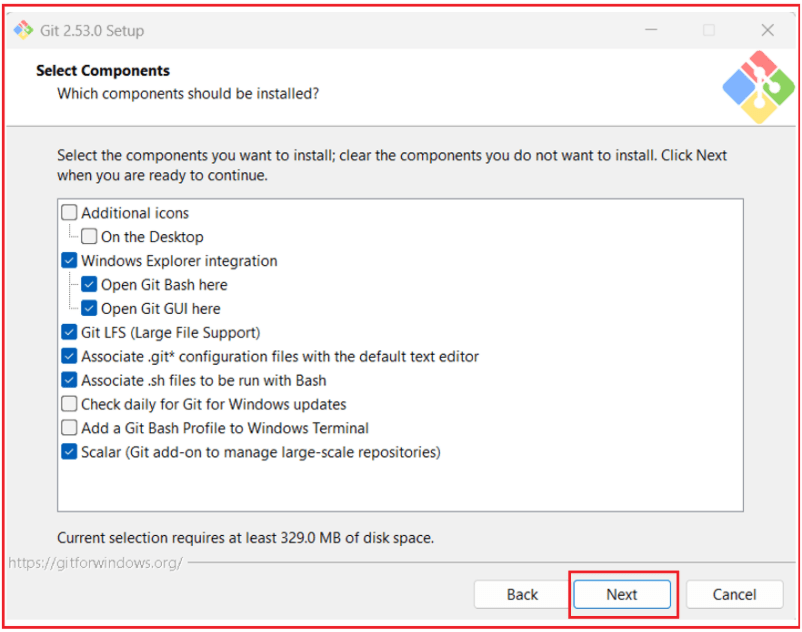

##### **پوشه منوی شروع را انتخاب کنید**

این فقط محل نمایش میانبرهای گیت را کنترل می‌کند.

- نام پوشه را همان **Git** (پیش‌فرض) نگه دارید.
- . **نزنید** گزینه «پوشه منوی شروع ایجاد نشود» را تیک
- کلیک کنید **روی بعدی**

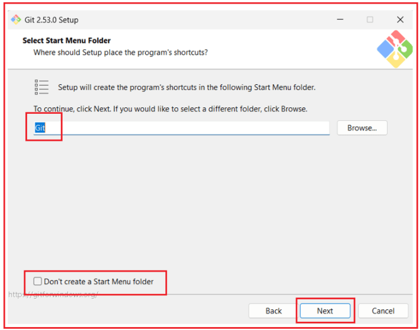

##### **انتخاب ویرایشگر پیش‌فرض**

گیت گاهی اوقات یک ویرایشگر متن برای موارد زیر باز می‌کند:

- پیام‌های commit
- فایل‌های پیکربندی

انتخاب کنید: **از Visual Studio Code به عنوان ویرایشگر پیش‌فرض Git استفاده کنید**

**چرا این انتخاب؟**

- رابط کاربری تمیز و مدرن
- مناسب برای مبتدیان
- استاندارد صنعت
- پیام‌های کامیت که به راحتی قابل فهم هستند

کلیک کنید **روی بعدی** .

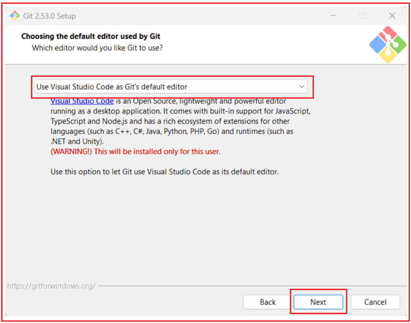

**نکته:** هشدار «این فقط برای این کاربر نصب خواهد شد» عادی و بی‌خطر است. این به این معنی است که VS Code برای حساب کاربری ویندوز شما در دسترس خواهد بود.

##### **تنظیم نام شاخه اولیه**

این نام شاخه پیش‌فرض را هنگام ایجاد مخازن جدید تعیین می‌کند.

انتخاب کنید:

- **نام شاخه پیش‌فرض را نادیده بگیرید**
- نام شاخه را روی **main تنظیم کنید.**

کلیک کنید **روی Next** . این از استانداردهای مدرن Git و GitHub پیروی می‌کند و از سردرگمی‌های بعدی جلوگیری می‌کند.

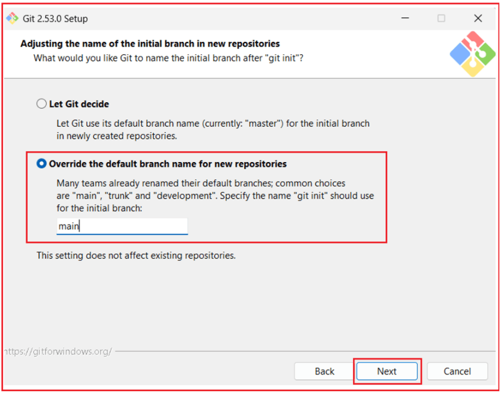

##### **تنظیم محیط PATH**

انتخاب: **گیت از خط فرمان و همچنین از نرم‌افزارهای شخص ثالث**

این گزینه:

- به Git اجازه می‌دهد با موارد زیر کار کند:
	- - گیت بش
				- خط فرمان
				- پاورشل
				- ویژوال استودیو
- ابزارهای سیستمی ویندوز را نادیده نمی‌گیرد

کلیک کنید **روی «بعدی»** . این **گزینه توصیه شده و امن‌ترین** است .

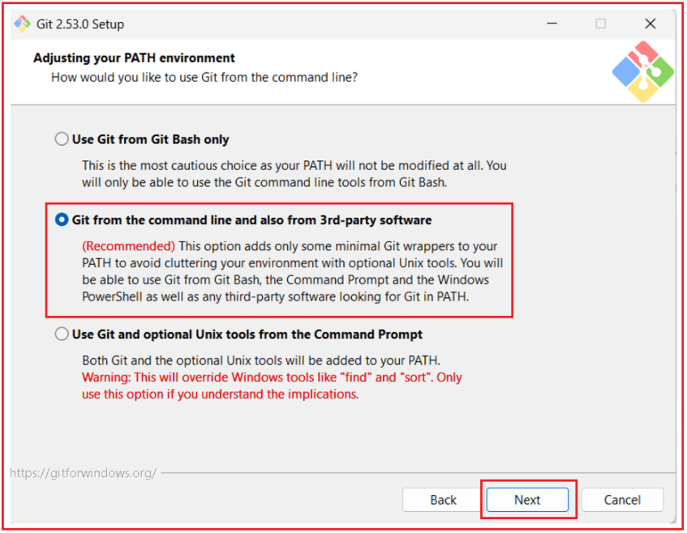

##### **انتخاب فایل اجرایی SSH**

انتخاب کنید: **از OpenSSH همراه استفاده کنید**

این به Git اجازه می‌دهد تا از کلاینت SSH همراه با Git استفاده کند.

- کلیک کنید **روی بعدی**

هیچ پیکربندی اضافی لازم نیست.

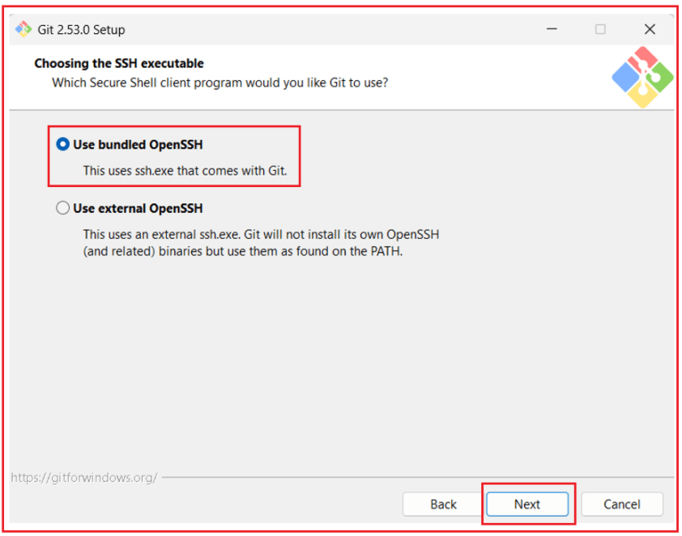

##### **انتخاب HTTPS Transport Backend**

انتخاب کنید: **از کتابخانه OpenSSL استفاده کنید**

این اجازه می‌دهد

- ارتباط امن HTTPS با GitHub و سایر سرویس‌ها.

کلیک کنید **روی بعدی** .

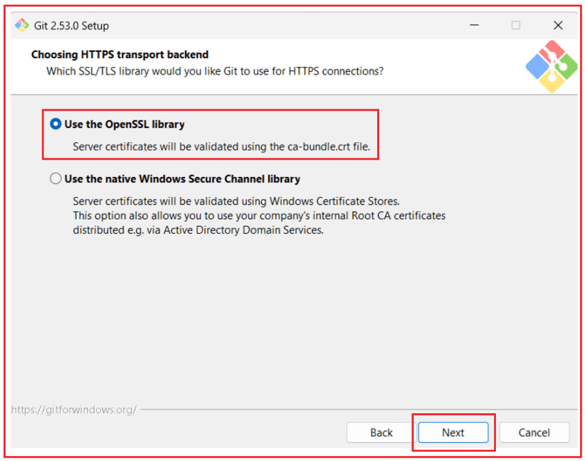

##### **پیکربندی تبدیل‌های انتهای خط**

انتخاب: **پرداخت به سبک ویندوز، کامیت کردن پایان خطوط به سبک یونیکس**

این تضمین می‌کند:

- سازگاری در ویندوز، لینوکس و macOS
- مشکلات کمتر در پایان خط در پروژه‌های تیمی

کلیک کنید **روی بعدی** .

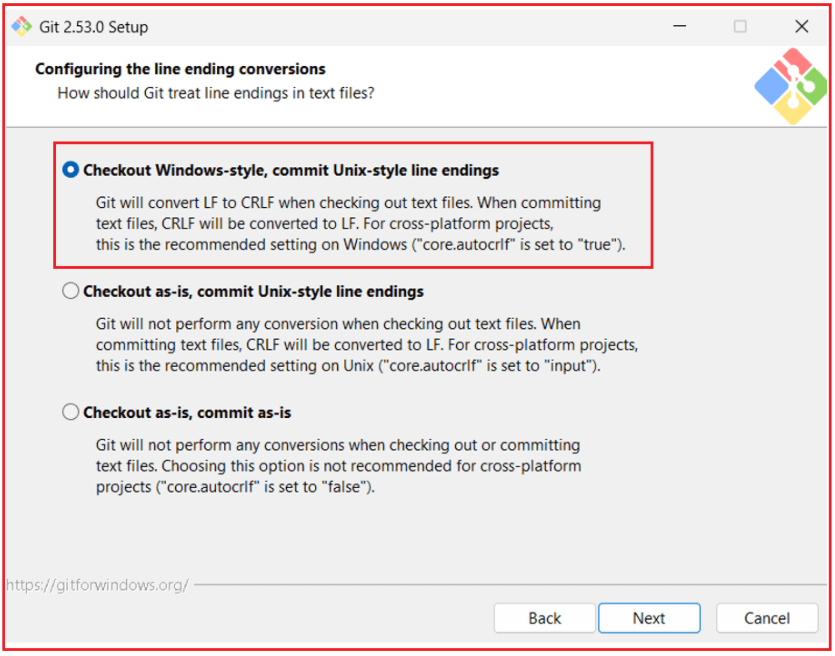

##### **پیکربندی شبیه‌ساز ترمینال برای Git Bash**

انتخاب کنید: **از MinTTY (ترمینال پیش‌فرض MSYS2) استفاده کنید**

مزایا:

- پنجره ترمینال با قابلیت تغییر اندازه
- پشتیبانی از یونیکد
- تجربه مدرن خط فرمان

روی بعدی کلیک کنید **.**

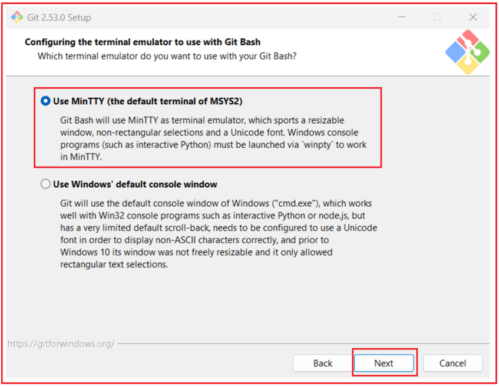

##### **رفتار پیش‌فرض git pull را انتخاب کنید**

انتخاب: **سریع به جلو یا ادغام**

این گزینه:

- تاریخ را ساده نگه می‌دارد
- برای مبتدیان خوب کار می‌کند
- از شکست‌های غیرمنتظره جلوگیری می‌کند

روی بعدی کلیک کنید **.**

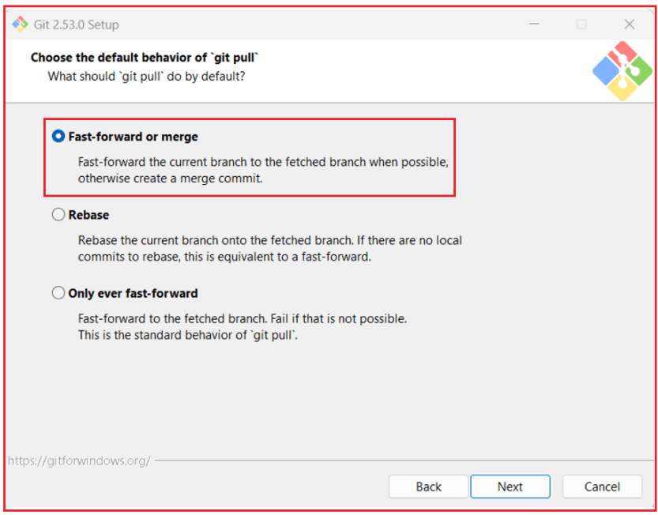

#### **یک کمک‌کننده اعتبارنامه انتخاب کنید**

انتخاب کنید: **مدیر اعتبارنامه گیت**

این به گیت اجازه می‌دهد تا:

- ذخیره امن توکن‌های احراز هویت
- از درخواست‌های مکرر ورود به سیستم خودداری کنید
- به راحتی با گیت‌هاب ادغام شوید

کلیک کنید **روی بعدی** .

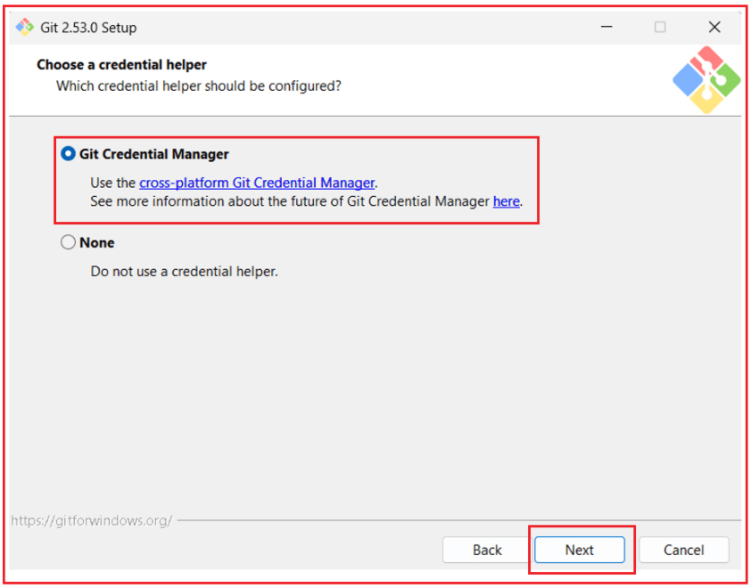

##### **پیکربندی گزینه‌های اضافی**

این صفحه به شما امکان می‌دهد **ویژگی‌های اضافی مربوط به عملکرد و سیستم را** برای Git فعال کنید.

- را انتخاب‌شده نگه دارید . **«فعال کردن ذخیره‌سازی سیستم فایل»** برای بهبود عملکرد گیت، گزینه‌ی
- را بدون علامت بگذارید **گزینه‌ی «فعال کردن پیوندهای نمادین»** ، مگر اینکه پروژه‌ی شما به‌طور خاص به پیوندهای نمادین نیاز داشته باشد.

کلیک کنید . **روی نصب** برای تکمیل تنظیمات،

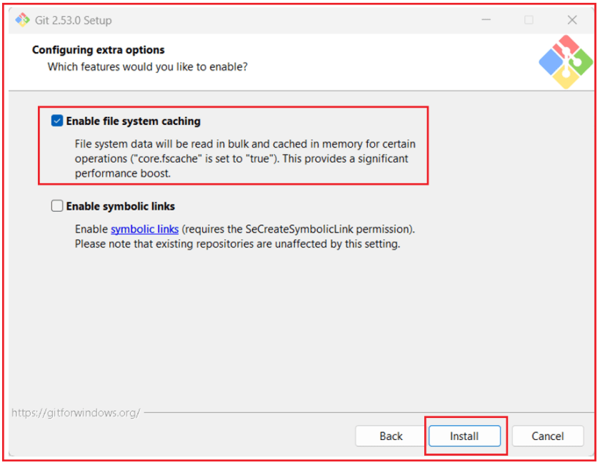

##### **تکمیل ویزارد راه‌اندازی گیت**

پس از اتمام نصب:

- تیک گزینه‌ی **«اجرای گیت بش» را بردارید**
- بردارید **علامت «مشاهده یادداشت‌های انتشار» را**
- کلیک کنید **روی پایان**

**اکنون Git با موفقیت نصب شده و آماده استفاده با Visual Studio است.**

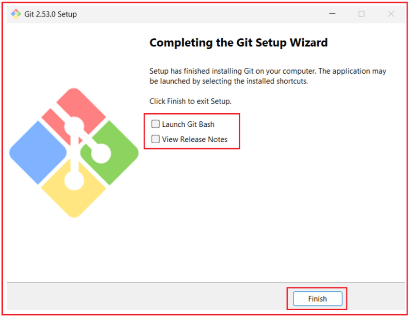

#### **چگونه نصب گیت را تأیید کنیم؟**

پس از نصب گیت، تأیید صحت نصب یک مرحله مهم است. این مرحله تضمین می‌کند که گیت به درستی روی سیستم شما نصب شده و در دسترس ابزارهایی مانند ویژوال استودیو قرار دارد. تأیید صحت می‌تواند به روش‌های مختلفی انجام شود و هر روش جنبه متفاوتی از نصب را تأیید می‌کند.

##### **روش اول: استفاده از خط فرمان**

این روش تأیید می‌کند که Git در سطح سیستم عامل نصب شده و در PATH سیستم موجود است.

**مراحل:**

- باز کنید **خط فرمان را**
- دستور زیر را تایپ کنید و Enter را فشار دهید:
	- **نسخه git**

**آنچه این موضوع را تأیید می‌کند:**

- ویندوز می‌تواند فایل اجرایی Git را پیدا کند
- گیت به درستی نصب شده است
- متغیرهای محیطی PATH به درستی پیکربندی شده‌اند

**خروجی مورد انتظار:**

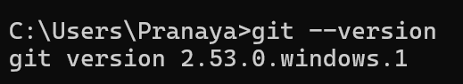

اگر شماره نسخه را مشاهده کردید، گیت به درستی نصب شده است. اگر خطایی مانند « **git is not recognized as an internal or external command** » مشاهده کردید، به این معنی است که:

- گیت به درستی نصب نشده است، **یا**
- گیت نصب شده است، اما به PATH اضافه نشده است

##### **روش دوم: استفاده از ویژوال استودیو ۲۰۲۲**

این روش تأیید می‌کند که Git نه تنها نصب شده است، بلکه **با Visual Studio نیز یکپارچه شده است** .

**مراحل:**

1. را باز کنید **ویژوال استودیو ۲۰۲۲**
2. هر کدام را باز کنید:
	- - پروژه
				- راه حل
				- یا پوشه محلی
3. پس از بارگذاری پروژه، **نوار منوی بالا را مشاهده کنید**

**چه چیزی را باید جستجو کرد:**

- منوی **گیت** بین **View** و **Project ظاهر می‌شود.**

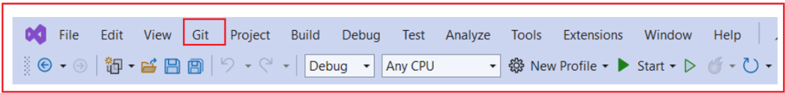

**آنچه این موضوع را تأیید می‌کند:**

- گیت روی دستگاه نصب شده است
- ویژوال استودیو گیت را شناسایی کرده است
- ویژوال استودیو می‌تواند با موفقیت با گیت ارتباط برقرار کند

مشاهده منوی Git تأیید می‌کند که Git **نصب، شناسایی و آماده استفاده در Visual Studio** است .

#### **ویژوال استودیو چگونه با گیت ادغام می‌شود؟**

ویژوال استودیو **خود گیت نیست** . گیت یک ابزار کنترل نسخه جداگانه است که روی سیستم شما نصب می‌شود. ویژوال استودیو به عنوان یک **رابط کاربری گرافیکی (UI** **)** عمل می‌کند که از طرف شما با گیت ارتباط برقرار می‌کند. وقتی اقدامات مربوط به گیت را در ویژوال استودیو انجام می‌دهید، گیت را دور نمی‌زنید - شما **به طور غیرمستقیم از گیت استفاده** می‌کنید .

پشت صحنه:

- ویژوال استودیو دستورالعمل‌ها را به گیت ارسال می‌کند
- گیت عملیات واقعی را انجام می‌دهد
- ویژوال استودیو نتایج را به صورت بصری نمایش می‌دهد

برای مثال:

- کلیک روی **Commit** → یک کامیت گیت اجرا می‌کند
- با کلیک روی **Push** →، یک Git push اجرا می‌شود.
- با کلیک روی **Create Branch** →، یک دستور Git branch اجرا می‌شود.

این به مبتدیان اجازه می‌دهد تا **بدون حفظ کردن دستورات** ، به طور مؤثر از گیت استفاده کنند ، در حالی که همچنان از تمام قدرت گیت بهره می‌برند.

#### **چرا گیت به تنهایی برای اشتراک‌گذاری کافی نیست؟**

گیت **به صورت محلی** کار می‌کند . این یعنی تغییرات را فقط روی کامپیوتر شما ردیابی می‌کند.

فقط با نصب گیت:

- مخزن شما فقط روی سیستم شما وجود دارد
- افراد دیگر نمی‌توانند به کد شما دسترسی داشته باشند
- پشتیبان گیری آنلاین وجود ندارد

گیت برای موارد زیر عالی است:

- ردیابی تغییرات
- مدیریت تاریخچه
- کار با شاخه‌ها

اما گیت **هیچ مکانیزم اشتراک‌گذاری آنلاینی ارائه نمی‌دهد** به خودی خود **. برای اشتراک‌گذاری کد با دانش‌آموزان یا تیم‌ها، به یک پلتفرم میزبانی از راه دور** نیاز است.

#### **گیت‌هاب چیست؟**

گیت‌هاب یک **پلتفرم مبتنی بر ابر** است که مخازن گیت را میزبانی می‌کند و آنها را از طریق اینترنت در دسترس قرار می‌دهد. این پلتفرم به توسعه‌دهندگان و تیم‌ها اجازه می‌دهد تا پروژه‌های مبتنی بر گیت را ذخیره، به اشتراک بگذارند و در آنها همکاری کنند.

به زبان ساده، **گیت‌هاب خانه آنلاین مخازن گیت است.** گیت‌هاب جایگزین گیت نمی‌شود. در عوض، گیت‌هاب **با گیت همکاری می‌کند** و موارد زیر را ارائه می‌دهد:

- ذخیره‌سازی از راه دور
- اشتراک‌گذاری
- ابزارهای همکاری

گیت‌هاب از هر مکانی با استفاده از یک مرورگر وب قابل دسترسی است. وب‌سایت رسمی: [**https://github.com**](https://github.com) . گیت‌هاب **نصب نشده است.** روی رایانه شما

##### **چرا از گیت‌هاب استفاده می‌شود:**

- مخازن را بصورت آنلاین ذخیره کنید
- کد را با دانش‌آموزان یا تیم‌ها به اشتراک بگذارید
- پشتیبان گیری آنلاین را حفظ کنید
- با دیگران همکاری کنید
- از ویژگی‌هایی مانند issueها، pull requestها، CI/CD استفاده کنید

##### **تفاوت بین گیت و گیت‌هاب**

این یکی از مهمترین مفاهیم برای مبتدیان است. گیت تغییرات کد را به صورت محلی مدیریت می‌کند، در حالی که گیت‌هاب میزبان مخازن گیت به صورت آنلاین برای اشتراک‌گذاری و همکاری است.

###### **گیت:**

- یک سیستم کنترل نسخه
- روی کامپیوتر شما نصب شده است
- پیگیری تغییرات و تاریخچه
- آفلاین کار می‌کند
- شاخه‌ها و کامیت‌ها را مدیریت می‌کند

###### **گیت‌هاب:**

- یک سرویس میزبانی
- روی اینترنت اجرا می‌شود
- مخازن گیت را به صورت آنلاین ذخیره می‌کند
- اشتراک‌گذاری و همکاری را فعال می‌کند
- نیاز به حساب کاربری دارد

###### **رابطه:**

- گیت می‌تواند بدون گیت‌هاب هم کار کند
- گیت‌هاب بدون گیت نمی‌تواند کار کند

#### **چگونه در گیت‌هاب ثبت‌نام کنیم؟**

برای میزبانی و اشتراک‌گذاری مخازن آنلاین، یک حساب کاربری گیت‌هاب لازم است و می‌توان آن را به صورت رایگان ایجاد کرد.

**ثبت نام مرحله به مرحله**

1. بروید [**به https://github.com**](https://github.com)
2. کلیک کنید **روی ثبت نام**
3. وارد کنید:
	- آدرس ایمیل
		- رمز عبور
		- نام کاربری
		- کشور/منطقه
4. ایمیل خود را تأیید کنید
5. سوالات مربوط به تنظیمات اولیه را کامل کنید

همین است. شما اکنون یک **حساب GitHub** دارید .

#### **چگونه از طریق ویژوال استودیو وارد گیت‌هاب شویم؟**

زمانی که گیت و گیت‌هاب آماده شدند، می‌توانید ویژوال استودیو را به حساب گیت‌هاب خود متصل کنید.

##### **مرحله ۱: باز کردن ویژوال استودیو**

رفتن به:

**فایل → تنظیمات حساب**

**مرحله ۲: ورود**

- کلیک کنید **روی افزودن حساب**
- را انتخاب کنید **گیت‌هاب**

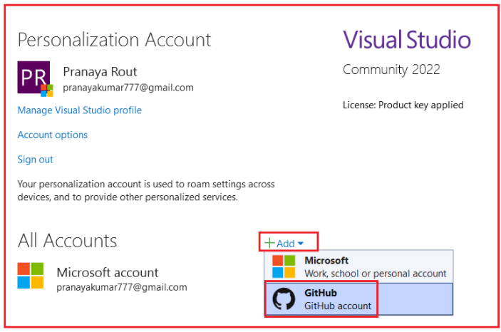

این کار مرورگر شما را باز می‌کند و شما باید با اطلاعات حساب GitHub خود وارد شوید. سپس، **صفحه GitHub Authorization** زیر باز می‌شود .

##### **صفحه مجوز گیت‌هاب**

این صفحه زمانی ظاهر می‌شود که ویژوال استودیو از طرف شما درخواست دسترسی به گیت‌هاب را می‌کند. این به ویژوال استودیو اجازه می‌دهد تا عملیات گیت را بدون درخواست مکرر اعتبارنامه انجام دهد. این فرآیند به شرح زیر است:

- امن
- رسمی
- فقط یک بار لازم است

شما **رمز عبور خود را** با ویژوال استودیو به اشتراک نمی‌گذارید.

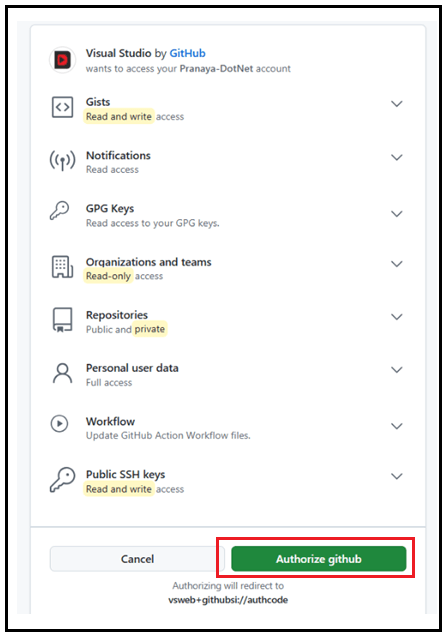

##### **واقعاً در پشت صحنه چه اتفاقی می‌افتد؟**

وقتی **روی ورود به گیت‌هاب از طریق ویژوال استودیو** کلیک کردید :

- ویژوال استودیو شما را به گیت‌هاب هدایت کرد
- گیت‌هاب در شرف ایجاد **توکن دسترسی شخصی (PAT) است** خودکار
- این توکن به صورت ایمن ذخیره شده و توسط ویژوال استودیو مورد استفاده قرار خواهد گرفت.
- گیت‌هاب دقیقاً نشان می‌دهد **که ویژوال استودیو چه مجوزهایی** خواهد داشت

شما **رمز عبور خود را به اشتراک نمی‌گذارید** .

##### **توکن دسترسی شخصی (PAT) چیست؟**

توکن **دسترسی شخصی (PAT)** یک **توکن احراز هویت امن** است که به جای رمز عبور استفاده می‌شود.

این شکلی است: ghp\_xxxxxxxxxxxxxxxxxxxxxxxx

PAT ها:

- از گیت‌هاب تولید می‌شوند
- مجوزهای محدودی دارند
- هر زمان قابل لغو است

##### **چرا از PAT به جای رمز عبور استفاده می‌شود؟**

گیت‌هاب **مجاز نمی‌داند .** دیگر احراز هویت با رمز عبور را برای عملیات گیت

دلایل:

- رمزهای عبور ناامن هستند
- توکن‌ها می‌توانند محدود و لغو شوند
- محافظت بهتر در برابر حملات

ویژوال استودیو:

- پس از ورود به سیستم، به‌طور خودکار از PAT استفاده می‌کند
- آن را با استفاده از Windows Credential Manager به طور ایمن ذخیره می‌کند.

معمولاً هنگام استفاده از ورود به سیستم ویژوال استودیو نیازی به ایجاد دستی PAT ندارید.

###### **نتیجه‌گیری:**

اکنون که گیت روی سیستم شما نصب و تأیید شده است، ویژوال استودیو ۲۰۲۲ آماده مدیریت کنترل نسخه با ویژگی‌های داخلی گیت است. با این تنظیمات، می‌توانید با اطمینان مخازن ایجاد کنید، تغییرات را ثبت کنید و هر زمان که می‌خواهید کد خود را به روشی تمیز و حرفه‌ای منتشر و با دانش‌آموزان به اشتراک بگذارید، به گیت‌هاب متصل شوید.