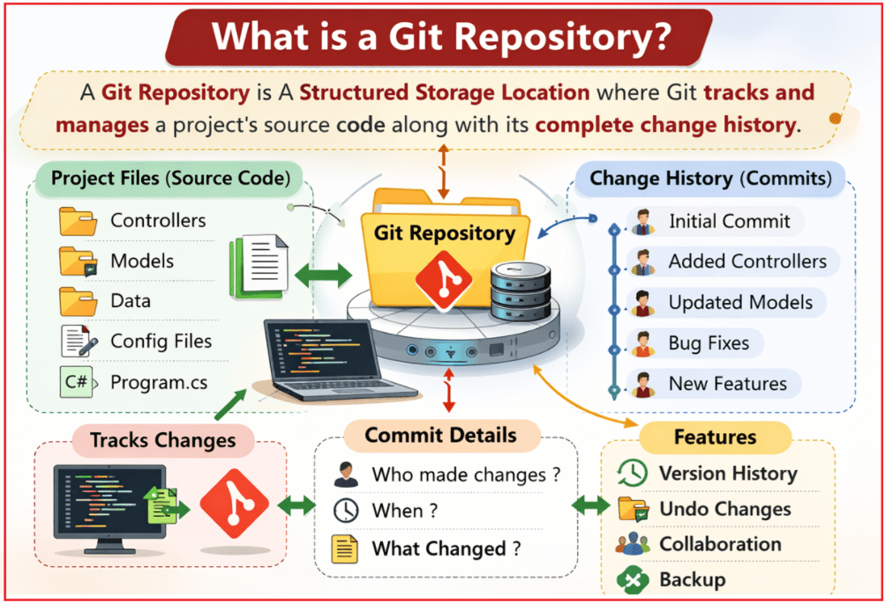
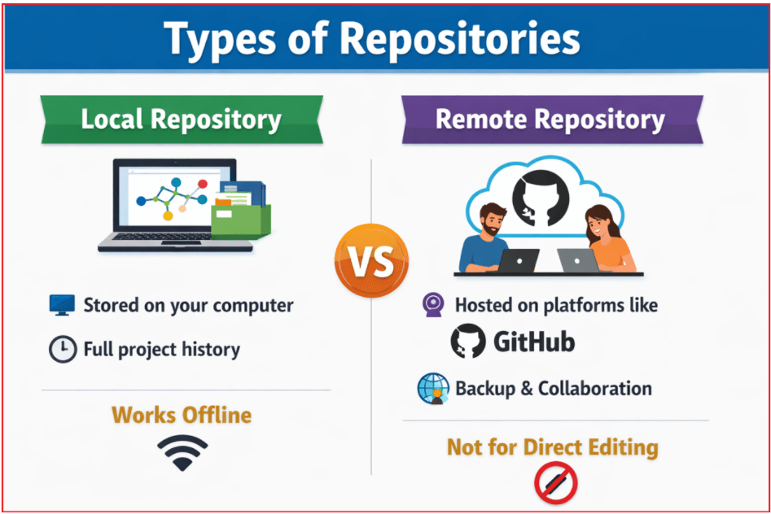
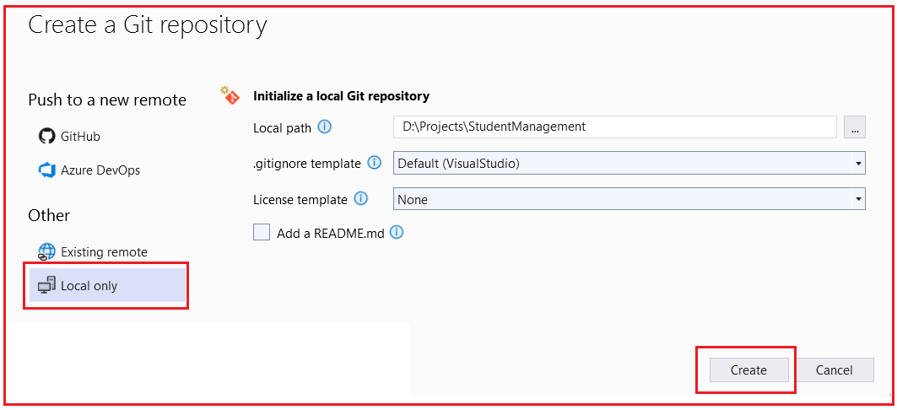
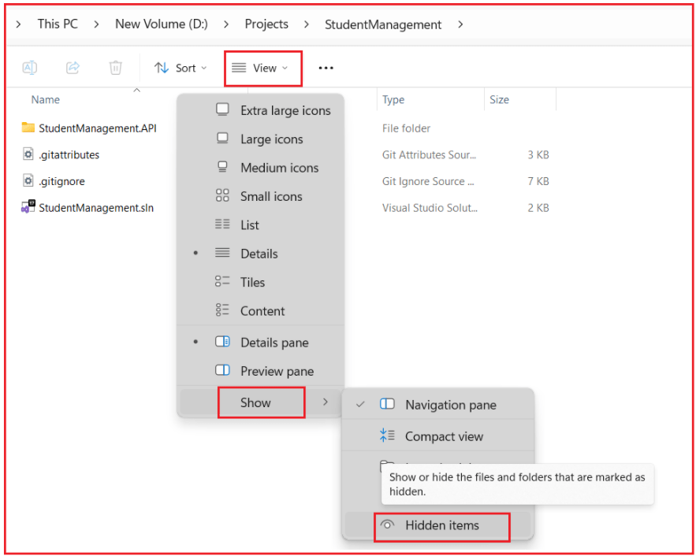
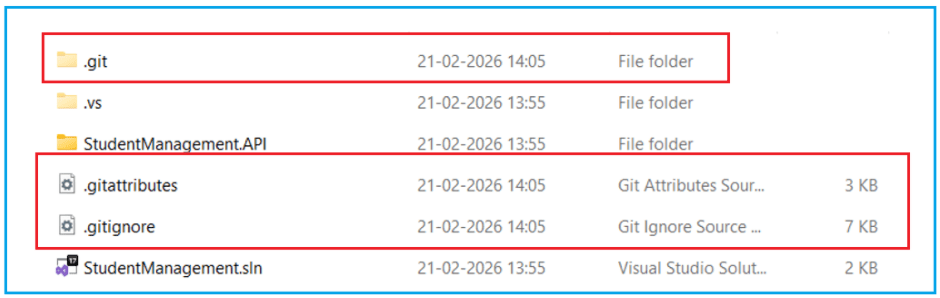

## **ایجاد یک مخزن گیت برای یک پروژه ASP.NET Core Web API**

در **بخش اول** ، ما فهمیدیم که چرا **مدیریت کد منبع (SCM)** ضروری است و در **بخش دوم** ، ما با موفقیت **Git و GitHub را با Visual Studio نصب و پیکربندی کردیم** . اکنون زمان آن رسیده است که این دانش را در یک **پروژه واقعی ASP.NET Core Web API** به کار ببریم . در این بخش، یاد خواهیم گرفت که چگونه Git در توسعه روزمره استفاده می‌شود: ایجاد مخازن، مقداردهی اولیه Git، درک آنچه باید و نباید commit شود، و انجام صحیح اولین commit.

#### **مخزن گیت چیست؟**

مخزن گیت ( **Git Repository)** است **یک مکان ذخیره‌سازی ساختاریافته** که گیت در آن کد منبع یک پروژه را به همراه تاریخچه کامل تغییرات آن ردیابی و مدیریت می‌کند. این فقط یک پوشه از فایل‌ها نیست؛ بلکه یک **محیط کنترل‌شده با نسخه** است که گیت در آن هر تغییر معناداری را که در طول زمان در پروژه ایجاد می‌شود، ثبت می‌کند.

یک مخزن نشان دهنده موارد زیر است:

- وضعیت **فعلی** یک پروژه
- تمام **وضعیت‌های قبلی** پروژه
- روابط **بین آن ایالت‌ها**

یک مخزن به گیت اجازه می‌دهد تا به سوالاتی مانند موارد زیر پاسخ دهد:

- دیروز پروژه چطور بود؟
- چه چیزی بین دو نسخه تغییر کرده است؟
- چه کسی تغییر خاصی را معرفی کرد؟

به طور خلاصه، یک مخزن، **پایه و اساس کنترل نسخه** است . بنابراین، نه تنها شامل نسخه فعلی فایل‌ها، بلکه شامل هر نسخه قبلی است که پس از شروع ردیابی Git وجود داشته است. به محض اینکه یک پروژه به مخزن Git تبدیل می‌شود، Git شروع به ضبط موارد زیر می‌کند:

- هر تغییر متعهدانه
- چه کسی تغییر را ایجاد کرد
- وقتی تغییر ایجاد شد
- چرا تغییر ایجاد شد (پیام کامیت)

##### **انواع مخازن:**

دو نوع مخزن وجود دارد. آنها به شرح زیر هستند:

1. مخزن محلی
2. مخزن از راه دور

#### **مخزن محلی چیست؟**

مخزن **محلی** ، مخزنی است که **در سیستم محلی یک توسعه‌دهنده** وجود دارد و به‌طور کامل توسط گیت در آن دستگاه مدیریت می‌شود.

- این **مخزن اصلی و فعال است.**
- جایی است که توسعه در واقع اتفاق می‌افتد.
- شامل تاریخچه کامل پروژه است.

یک مخزن محلی **مستقل** است ، به این معنی که:

- به هیچ سروری وابسته نیست.
- می‌تواند بدون اینترنت کار کند.
- می‌تواند تمام عملیات کنترل نسخه را به طور مستقل انجام دهد.

مخزن محلی شامل موارد زیر است:

- فایل‌های کاری فعلی
- تمام کامیت‌های انجام شده توسط توسعه‌دهنده
- تاریخچه کامل نسخه‌ها
- اطلاعات شاخه‌بندی و ادغام

#### **مخزن راه دور چیست؟**

یک **مخزن راه دور** ، یک مخزن گیت است که میزبانی می‌شود . این مخزن به عنوان یک مرکز متمرکز برای اشتراک‌گذاری کد، همکاری و پشتیبان‌گیری عمل می‌کند. **خارج از دستگاه محلی** ، معمولاً روی یک سرور یا یک پلتفرم مبتنی بر ابر مانند GitHub،

مخازن راه دور برای ویرایش مستقیم در نظر گرفته نشده‌اند. در عوض، توسعه‌دهندگان با اعمال تغییرات، مخازن محلی خود را با مخزن راه دور همگام‌سازی می‌کنند. این امر به چندین توسعه‌دهنده اجازه می‌دهد تا ضمن حفظ یک نسخه مشترک و معتبر از پروژه، به طور مستقل کار کنند.

یک مخزن از راه دور به عنوان موارد زیر عمل می‌کند:

- یک **نقطه مرجع مشترک** برای چندین مخزن محلی
- یک **مکانیسم همگام‌سازی**
- پشتیبان‌گیری **توزیع‌شده**

یک مخزن راه دور جایگزین مخازن محلی نمی‌شود. در عوض، به عنوان یک **لایه هماهنگی** عمل می‌کند که چندین مخزن محلی مستقل را با یکدیگر سازگار نگه می‌دارد. مخازن راه دور برای پشتیبانی **از همکاری توزیع‌شده** وجود دارند .

#### **کار با یک مخزن محلی در پروژه‌های ASP.NET Core Web API:**

در توسعه نرم‌افزار مدرن، **ایجاد برنامه و مدیریت کد منبع به عنوان دو مسئولیت جداگانه در نظر گرفته می‌شوند** . ابزارهای توسعه مانند ویژوال استودیو عمداً این نگرانی‌ها را از هم جدا می‌کنند تا توسعه‌دهندگان به وضوح بدانند *چه زمانی* یک برنامه ایجاد می‌شود و *چه زمانی* کنترل نسخه معرفی می‌شود.

به دلیل این طراحی، کار با یک **مخزن محلی** در یک پروژه ASP.NET Core Web API همیشه در **دو مرحله کاملاً مشخص** انجام می‌شود .

- ابتدا، برنامه Web API به عنوان یک پروژه معمولی ایجاد می‌شود.
- دوم، گیت برای تبدیل آن پروژه به یک مخزن محلی که می‌تواند تغییرات را در طول زمان پیگیری کند، یکپارچه شده است.

##### **مرحله 1: ایجاد یک پروژه جدید ASP.NET Core Web API**

در مرحله اول، ویژوال استودیو منحصراً بر **ایجاد برنامه** تمرکز دارد . هدف، ایجاد یک پروژه کاربردی ASP.NET Core Web API است که بتوان آن را با منطق تجاری ساخت، اجرا و گسترش داد. در این مرحله:

- هیچ سیستم کنترل نسخه‌ای درگیر نیست
- گیت هیچ فایلی را ردیابی نمی‌کند
- این پروژه صرفاً به عنوان یک **پایگاه کد معمولی وجود دارد**

این طراحی به توسعه‌دهندگان اجازه می‌دهد تا قبل از معرفی کنترل نسخه، ساختار پروژه و رفتار زمان اجرا را اعتبارسنجی کنند.

##### **فرآیند گام به گام: ایجاد پروژه**

1. را باز کنید **ویژوال استودیو**
2. کلیک کنید **روی ایجاد یک پروژه جدید**
3. انتخاب **ASP.NET Core Web API**
4. کلیک کنید **روی بعدی**
5. جزئیات زیر را ارائه دهید:
	- - **نام پروژه** : StudentManagement.API
				- **مکان**
				- **نام راهکار** : مدیریت دانشجویی
6. گزینه را بررسی کنید:
	- - **راه حل و پروژه را در یک پوشه قرار دهید**
7. کلیک کنید **روی ایجاد**

در این مرحله:

- پروژه ASP.NET Core Web API با موفقیت ایجاد شد.
- برنامه قابل ساخت و اجرا است
- کنترلرها و فایل‌های پیکربندی موجود هستند
- **گیت هنوز درگیر نشده است**

این پروژه صرفاً به عنوان یک برنامه وجود دارد، نه به عنوان یک نهاد کنترل‌شده با نسخه.

##### **مرحله ۲: ادغام گیت برای ایجاد یک مخزن محلی**

یک پروژه تنها زمانی به یک **مخزن محلی گیت** تبدیل می‌شود که گیت **به طور صریح مقداردهی اولیه شده** باشد . مقداردهی اولیه گیت به معنای دستور دادن به گیت برای شروع ردیابی فایل‌های پروژه و حفظ سابقه‌ای از تمام تغییرات آینده است. این فرآیند ماهیتاً محلی است و:

- نمی‌دهد **تغییر** کد برنامه را
- نمیکنه **آپلود** چیزی آنلاین
- نمی‌کند **درگیر** گیت‌هاب را
- کاملاً **آفلاین کار می‌کند**

نتیجه یک **مخزن محلی** است که کاملاً روی دستگاه توسعه‌دهنده قرار دارد.

##### **فرآیند گام به گام:**

##### **مرحله ۱: باز کردن پروژه در ویژوال استودیو**

- راه اندازی **ویژوال استودیو**
- پروژه StudentManagement.API را باز کنید.

در این مرحله، پروژه هنوز به عنوان یک برنامه معمولی و بدون کنترل نسخه وجود دارد.

##### **مرحله ۲: مقداردهی اولیه گیت با استفاده از ویژوال استودیو**

از منوی بالا،

- را انتخاب کنید **گیت**
- کلیک کنید **روی ایجاد مخزن گیت** .

انتخاب می‌کنید **گزینه‌ی Git → Create Git Repository را** وقتی از منوی بالای ویژوال استودیو، **، ویژوال استودیو پنجره‌ی Create a Git repository** را باز می‌کند . این پنجره به شما امکان می‌دهد تصمیم بگیرید **که گیت چگونه و کجا باید** برای پروژه‌ی شما مقداردهی اولیه شود.

###### **برای ایجاد یک مخزن محلی گیت از این صفحه، فقط این را انتخاب کنید:**

1. **پنل سمت چپ** → روی **فقط محلی کلیک کنید**
2. **پنل سمت راست** :
	- - **مسیر محلی** → همانطور که هست باقی بماند
				- **قالب ‎.gitignore** → پیش‌فرض (VisualStudio)
				- **الگوی مجوز** → هیچکدام
				- **فایل README.md را اضافه کنید** → تیک نخورده باقی بماند
3. کلیک کنید **روی ایجاد**

##### **مرحله ۳: اقدامات داخلی انجام شده توسط ویژوال استودیو**

وقتی گیت مقداردهی اولیه می‌شود، ویژوال استودیو عملیات زیر را به صورت داخلی انجام می‌دهد:

- یک پوشه مخفی **.git** در ریشه پروژه ایجاد می‌کند.
- گیت را برای ردیابی فایل‌های پروژه واجد شرایط پیکربندی می‌کند.
- یک فایل پیش‌فرض **‎.gitignore** ‎ مناسب برای پروژه‌های ‎.NET اعمال می‌کند.
- پروژه را برای ردیابی نسخه از طریق کامیت‌ها آماده می‌کند.

هیچ فایل کد منبعی تغییر نمی‌کند و هیچ مخزن ریموتی ایجاد نمی‌شود.

##### **چگونه پوشه .git و فایل .gitignore را بررسی کنیم؟**

1. باز کردن **فایل اکسپلورر**
2. به پوشه ریشه پروژه خود بروید (مثال: **D:\\Projects\\StudentManagement** )
3. کلیک کنید **روی مشاهده** (منوی بالا)
4. کلیک کنید **روی نمایش**
5. بررسی **موارد پنهان**

اکنون پوشه‌ای با نام **.git** را مشاهده خواهید کرد . اگر پوشه .git قابل مشاهده باشد، **Git با موفقیت راه‌اندازی شده است.**

##### **پوشه .git چیست؟**

پوشه **.git** است **هسته اصلی مخزن گیت** . این پوشه به طور خودکار هنگام راه‌اندازی گیت در دایرکتوری پروژه ایجاد می‌شود. این پوشه حاوی کد برنامه نیست؛ در عوض، شامل تمام **فراداده‌ها و ساختارهای داده داخلی** است که گیت برای مدیریت کنترل نسخه استفاده می‌کند. درون پوشه .git، گیت موارد زیر را ذخیره می‌کند:

- تاریخچه کامل **کامیت‌های** پروژه
- اطلاعات مربوط به **شاخه‌ها و برچسب‌ها**
- جزئیات پیکربندی که نحوه رفتار گیت را برای این مخزن تعریف می‌کند
- ارجاعاتی که به گیت اجازه می‌دهند هر نسخه قبلی از کد را بازسازی کند

وجود پوشه .git چیزی است که رسماً یک مخزن گیت را تعریف می‌کند. یک پروژه بدون این پوشه، صرف نظر از اینکه گیت روی دستگاه نصب شده باشد یا خیر، صرفاً مجموعه‌ای معمولی از فایل‌ها است.

##### **فایل .gitignore چیست؟**

فایل **.gitignore** تعریف می‌کند **که گیت باید عمداً کدام فایل‌ها و پوشه‌ها را نادیده بگیرد** و از ردیابی نسخه مستثنی کند. هدف آن اطمینان از این است که فقط کد منبع و فایل‌های پیکربندی معنادار به مخزن ارسال شوند. در یک پروژه .NET، بسیاری از فایل‌ها عبارتند از:

- به طور خودکار توسط فرآیند ساخت تولید می‌شود
- ماهیت موقت
- مختص دستگاه یا IDE توسعه‌دهنده

ردیابی چنین فایل‌هایی باعث شلوغی مخزن شده و همکاری را دشوار می‌کند. فایل .gitignore با فهرست کردن الگوهایی برای فایل‌ها و پوشه‌هایی که هرگز نباید commit شوند، از این امر جلوگیری می‌کند. در پروژه‌های ASP.NET Core، فایل .gitignore معمولاً موارد زیر را مستثنی می‌کند:

- bin/ (خروجی کامپایل شده)
- obj/ (فایل‌های ساخت میانی)
- ‎.vs/‎ (داده‌های داخلی ویژوال استودیو)
- فایل‌های موقت و کش

##### **فایل ‎.gitattributes چیست؟**

فایل **‎.gitattributes** کنترل می‌کند . این فایل عمدتاً برای تعریف قوانین مربوط به موارد زیر استفاده می‌شود: **نحوه برخورد داخلی گیت با فایل‌ها را** ‎ به جای تصمیم‌گیری در مورد ردیابی یا نادیده گرفتن فایل‌ها،

- نرمال‌سازی پایان خط در سیستم‌عامل‌های مختلف
- نحوه مقایسه فایل‌ها (رفتار diff)
- نحوه ادغام فایل‌ها

ویژوال استودیو به طور خودکار این فایل را ایجاد می‌کند تا از رفتار سازگار هنگام اشتراک‌گذاری یک پروژه در محیط‌های مختلف مانند ویندوز، لینوکس و macOS اطمینان حاصل شود. برای مبتدیان، این فایل معمولاً نیازی به هیچ تغییری ندارد. این فایل برای جلوگیری از مشکلات ظریف مربوط به قالب‌بندی فایل و مقایسه در سناریوهای مشترک وجود دارد.

##### **چه فایل‌هایی باید در یک پروژه .NET کامیت شوند؟**

فقط فایل‌های **ضروری برای درک، ساخت و اجرای** **برنامه** باید کامیت شوند. این فایل‌ها ساختار، منطق و پیکربندی پروژه را تعریف می‌کنند و امکان ایجاد مجدد برنامه روی هر دستگاهی را فراهم می‌کنند.

معمولاً فایل‌های ایمن و مورد نیاز شامل موارد زیر هستند:

- کنترل‌کننده‌ها، مدل‌ها، سرویس‌ها و DTOها (منطق برنامه)
- Program.cs و فایل‌های مربوط به راه‌اندازی
- appsettings.json (بدون اطلاعات حساس)
- فایل‌های پروژه (.csproj)
- فایل راه‌حل (.sln)
- فایل‌های مستندات مانند README.md

این فایل‌ها در کنار هم، **منبع حقیقت** برای برنامه را نشان می‌دهند.

##### **کدام فایل‌ها/پوشه‌ها هرگز نباید کامیت شوند؟**

فایل‌ها و پوشه‌هایی **که به صورت خودکار یا مختص محیط ایجاد می‌شوند،** هرگز نباید commit شوند. این فایل‌ها منطق برنامه را منعکس نمی‌کنند و ممکن است در ماشین‌های مختلف متفاوت باشند.

مثال‌های رایج عبارتند از:

- bin/ – فایل‌های باینری کامپایل شده که در طول ساخت تولید می‌شوند
- obj/ – مصنوعات ساخت میانی
- ‎.vs/ – حافظه پنهان و تنظیمات مخصوص ویژوال استودیو

این فایل‌ها:

- در هر زمانی قابل بازسازی است
- بین سیستم‌ها و توسعه‌دهندگان متفاوت است
- افزایش غیرضروری حجم مخزن
- ایجاد نویز در تاریخچه کامیت‌ها

انجام آنها یک اشتباه رایج مبتدیانه است و منجر به مخازن نامرتب می‌شود.

##### **نتیجه‌گیری**

ایجاد یک مخزن گیت فقط یک گام فنی نیست - بلکه یک **رشته حرفه‌ای** است . درک اینکه چه چیزی را باید commit کرد، چه چیزی را باید نادیده گرفت و چگونه Git را به درستی مقداردهی اولیه کرد، یک تاریخچه تمیز، همکاری بهتر و قابلیت نگهداری طولانی مدت را تضمین می‌کند. با این آموزش، اکنون می‌دانید که چگونه:

- مخازن را به درستی ایجاد کنید
- مقداردهی اولیه گیت (Git) به صورت ایمن
- محافظت از داده‌های حساس
- یک کامیت اول قوی بسازید

خواهیم پرداخت **در ادامه، به بررسی کامیت‌ها، مرحله‌بندی، ارسال، دریافت و گردش‌های کاری همکاری واقعی** .