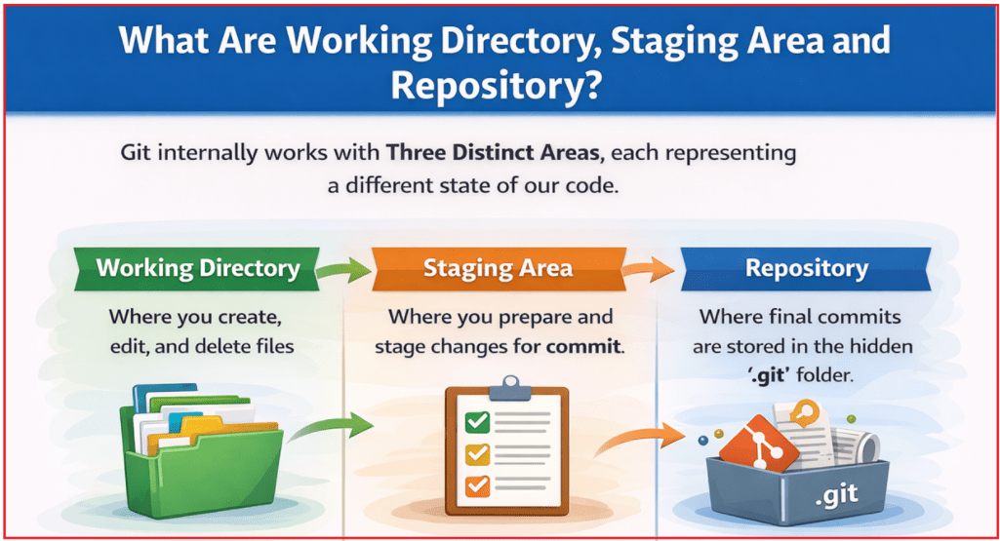
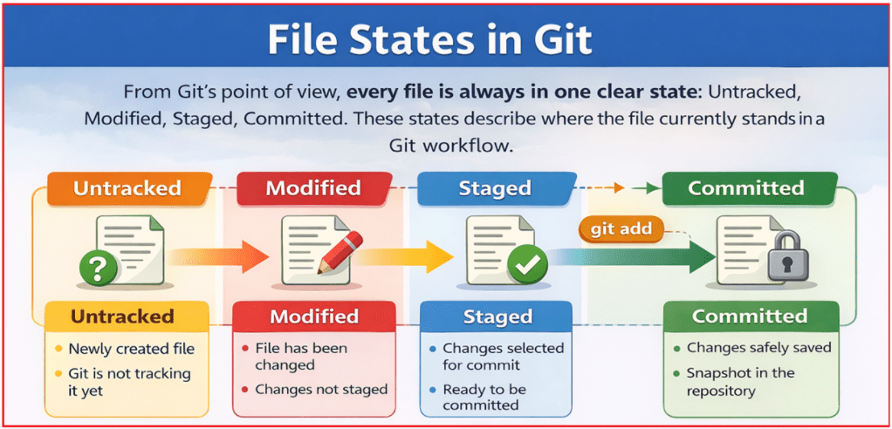
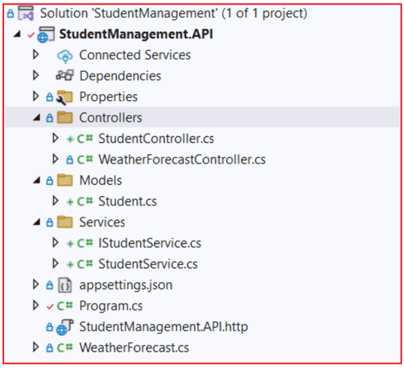
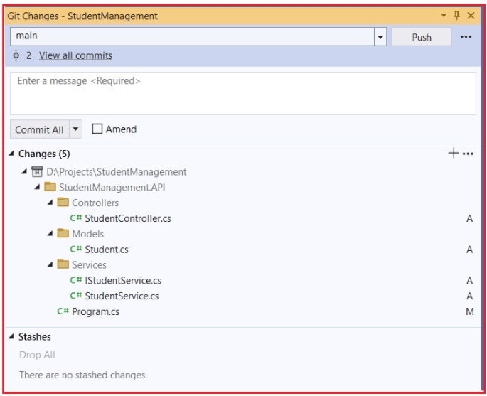
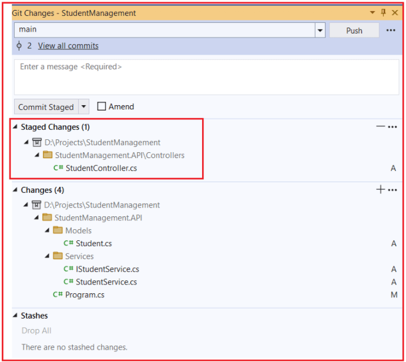
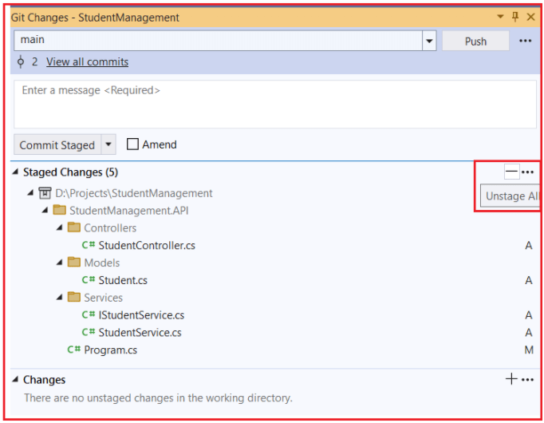

## **مفاهیم اصلی گیت به همراه مثال**

گیت فقط مجموعه‌ای از دستورات نیست؛ بلکه یک **گردش کار کاملاً تعریف‌شده** برای مدیریت تغییرات کد به صورت ایمن، واضح و حرفه‌ای است. در توسعه نرم‌افزار واقعی، کد به طور مداوم تغییر می‌کند - ویژگی‌ها اضافه می‌شوند، اشکالات برطرف می‌شوند و به مرور زمان بهبودهایی ایجاد می‌شود. گیت روشی ساختاریافته برای ردیابی این تغییرات ارائه می‌دهد تا هیچ چیز از دست نرود، رونویسی نشود یا فراموش نشود.

برای استفاده مطمئن از گیت، هر توسعه‌دهنده‌ای باید بداند **که گیت چگونه فایل‌ها را سازماندهی می‌کند** ، **چگونه تغییرات از یک مرحله به مرحله دیگر منتقل می‌شوند** و **وقتی کد را اضافه، کامیت، pull یا push می‌کنیم، در واقع چه اتفاقی در پشت صحنه می‌افتد** . وقتی این ایده‌های اصلی روشن شوند، گیت قابل پیش‌بینی و استفاده از آن آسان می‌شود.

#### **دایرکتوری کاری، ناحیه‌ی عملیاتی و مخزن چیستند؟**

گیت به صورت داخلی با **سه ناحیه‌ی متمایز** کار می‌کند که هر کدام نشان‌دهنده‌ی حالت متفاوتی از کد ما هستند. درک این سه ناحیه، کلید درک خود گیت است.



##### **دایرکتوری کاری**

دایرکتوری **کاری** ، پوشه‌ی اصلی پروژه در کامپیوتر شماست که ما به‌طور فعال روی کد خود کار می‌کنیم. این جایی است که توسعه اتفاق می‌افتد.

در دایرکتوری کاری:

- ما **فایل‌های جدید ایجاد می‌کنیم**
- ما **فایل‌های موجود را ویرایش می‌کنیم**
- ما **فایل‌ها را حذف یا تغییر نام می‌دهیم**

در این مرحله، ما صرفاً مانند ویرایش فایل معمولی عمل می‌کنیم. گیت به طور خودکار این تغییرات را در تاریخچه ذخیره نمی‌کند. دایرکتوری کاری را به عنوان **فضای کاری یا میز کار خود** در نظر بگیرید ، جایی که تغییرات هنوز انعطاف‌پذیر هستند و می‌توانند آزادانه اصلاح شوند.

##### **منطقه عملیاتی**

ناحیه‌ی **آماده‌سازی (Staging Area)** یک ناحیه‌ی نگهداری موقت است که در آن به گیت می‌گوییم **دقیقاً کدام تغییرات باید در کامیت بعدی لحاظ شوند** . این ناحیه بین موارد زیر قرار می‌گیرد:

- دایرکتوری کاری ما **.**
- مخزن **(تاریخچه کامیت‌ها)**

ناحیه‌ی مرحله‌بندی به ما اجازه می‌دهد تا تغییرات را قبل از دائمی کردن، بررسی و سازماندهی کنیم. به جای اینکه هر چیزی را که تغییر داده‌ایم، کامیت کنیم، گیت به ما اجازه می‌دهد با دقت انتخاب کنیم که اکنون چه چیزی را ثبت کنیم و چه چیزی را منتظر بمانیم. می‌توانید مرحله‌بندی را به عنوان یک **پیش‌نمایش یا چک‌لیست** برای کامیت بعدی در نظر بگیرید.

##### **مخزن**

مخزن **:** جایی است که گیت به طور دائم اسنپ‌شات‌های کامیت شده از پروژه ما را ذخیره می‌کند. پس از اینکه تغییرات در مخزن کامیت شدند، به بخشی از تاریخچه رسمی پروژه تبدیل می‌شوند. مخزن شامل موارد زیر است

- تاریخچه کامیت‌ها
- شاخه‌ها
- برچسب‌ها
- فراداده‌های مورد نیاز گیت

از نظر فنی، این داده‌ها درون پوشه مخفی .git ذخیره می‌شوند. این مخزن، **حافظه بلندمدت** پروژه ما را نشان می‌دهد.

##### **صحنه‌سازی چیست و چرا وجود دارد؟**

مرحله‌بندی وجود دارد تا کامیت‌ها به **روشی تمیز، هدفمند و حرفه‌ای** انجام شوند ، به جای اینکه هر چیزی که در حال حاضر تغییر می‌کند کامیت شود. در توسعه واقعی، دایرکتوری کاری ما اغلب شامل **تغییرات مختلطی** است ، مانند:

- رفع اشکال تکمیل شده
- برخی تغییرات قالب‌بندی
- یک اثر نیمه تمام

بدون مرحله‌بندی، همه این تغییرات با هم ثبت می‌شوند و یک تاریخچه گیج‌کننده و نامرتب ایجاد می‌کنند. مرحله‌بندی به ما این امکان را می‌دهد که:

- همین حالا فقط رفع اشکال را انجام دهید
- کارهای ناتمام یا آزمایشی را بدون تعهد رها کنید
- ایجاد کامیت‌های کوچک، معنادار و خوانا

این منجر به یک **تاریخچه کامیت واضح** می‌شود که توضیح می‌دهد چه چیزی تغییر کرده و چرا، که برای تیم‌ها و نگهداری‌های آینده بسیار ارزشمند است.

#### **وضعیت فایل‌ها در گیت: ردیابی نشده، اصلاح‌شده، مرحله‌بندی‌شده، ثبت‌شده**

از دیدگاه گیت، **هر فایلی همیشه در یک وضعیت مشخص قرار دارد** . این وضعیت‌ها، وضعیت فعلی فایل را در گردش کار گیت توصیف می‌کنند. چهار وضعیت ممکن عبارتند از:

- ردیابی نشده
- اصلاح‌شده
- صحنه‌ای
- متعهد



##### **ردیابی نشده**

- یک فایل جدید ایجاد شده است
- گیت هنوز از وجود این فایل اطلاعی ندارد.
- مثال: یک فایل .cs که به تازگی اضافه شده است

گیت فایل‌های ردیابی نشده را تا زمانی که صریحاً به گیت نگوییم که ردیابی آنها را شروع کند، کاملاً نادیده می‌گیرد. این کار از کامیت‌های تصادفی فایل‌های موقت یا ناخواسته جلوگیری می‌کند.

##### **اصلاح‌شده**

- این فایل از قبل توسط گیت ردیابی شده است.
- تغییرات اعمال شده است
- تغییرات هنوز اعمال نشده است

این وضعیت به این معنی است که **گیت این فایل را می‌شناسد، اما** **تغییرات آن آماده‌ی ثبت نیستند.** شما هنوز در حال کار، بررسی یا اصلاح تغییرات هستید.

##### **صحنه‌ای**

- تغییرات برای ثبت انتخاب می‌شوند
- با استفاده از git add اضافه شد
- آماده برای ضبط دائمی

فقط تغییرات مرحله‌بندی‌شده در کامیت بعدی لحاظ می‌شوند. این آخرین مرحله تأیید قبل از ثبت تغییرات در تاریخچه است.

##### **متعهد**

- تغییرات در تاریخچه مخزن ذخیره می‌شوند
- کامیت به یک اسنپ‌شات دائمی تبدیل می‌شود
- تغییرات می‌توانند بعداً مقایسه، برگردانده یا ادغام شوند

پس از اعمال تغییرات، آنها **رسمی، قابل ردیابی و ایمن** هستند .

#### **کامیت چیست؟**

یک **کامیت (Commit)** تصویری از کل پروژه در یک نقطه زمانی خاص است که در تاریخچه مخزن ذخیره می‌شود. یک کامیت نشان دهنده موارد زیر است:

- یک واحد کاری معنادار
- نسخه پایدار کد
- یک نقطه بازرسی که می‌توانید بعداً با خیال راحت به آن برگردید

کامیت‌ها **فقط تفاوت‌های فایل نیستند** . گیت به طور موثر اسنپ‌شات‌های کامل پروژه را ذخیره می‌کند و امکان ردیابی و بازگرداندن قابل اعتماد تاریخچه را فراهم می‌کند.

##### **یک کامیت چه اطلاعاتی را ذخیره می‌کند؟**

هر کامیت، متادیتای ضروری را ذخیره می‌کند که تغییر را به وضوح توضیح می‌دهد:

- **نویسنده** → چه کسی تغییر را ایجاد کرد
- **مهر زمان** → زمان اعمال تغییر
- **پیام کامیت** → دلیل اعمال تغییر
- **هش منحصر به فرد SHA-1** → یک شناسه منحصر به فرد برای کامیت

این اطلاعات، تاریخچه‌ی گیت را قابل فهم، قابل حسابرسی و قابل اعتماد می‌کند.

#### **اقدامات پایه گیت: افزودن، کامیت، کشیدن، فشار دادن**

این چهار اقدام، **گردش کار روزانه گیت** مورد استفاده در پروژه‌های دنیای واقعی را تشکیل می‌دهند.

##### **گیت اضافه کن**

این مرحله تغییرات را برای اعمال آماده می‌کند.

- تغییرات را از دایرکتوری کاری → ناحیه‌ی شروع عملیات منتقل می‌کند
- آنچه که قرار است ثبت شود را انتخاب می‌کند
- می‌تواند تمام تغییرات یا فقط فایل‌های انتخاب‌شده را مرحله‌بندی کند

##### **گیت کامیت**

این مرحله تغییرات را به طور دائم ثبت می‌کند.

- تغییرات مرحله‌ای را در مخزن محلی ذخیره می‌کند.
- یک تصویر لحظه‌ای جدید در تاریخ ایجاد می‌کند
- به یک پیام کامیت واضح و معنادار نیاز دارد

##### **گیت پول**

این مرحله، کار دیگران را وارد سیستم شما می‌کند.

- تغییرات را از مخزن راه دور واکشی می‌کند
- آنها را در شاخه محلی ادغام می‌کند
- کد محلی شما را به‌روز نگه می‌دارد

##### **گیت پوش**

این مرحله کار شما را منتشر می‌کند.

- کامیت‌های محلی را به مخزن راه دور ارسال می‌کند.
- کار خود را با دیگران به اشتراک می‌گذارد
- تغییرات شما را برای تیم قابل مشاهده می‌کند

#### **مثالی برای درک مفاهیم Git Core در ASP.NET Core با Visual Studio:**

را به پروژه خود اضافه می‌کنیم **در این مرحله، ما با ایجاد یک مدل، یک سرویس (رابط + پیاده‌سازی)، ثبت آن در تزریق وابستگی و در نهایت نمایش آن از طریق یک کنترلر، ویژگی Student** . در حین انجام این کار، مشاهده خواهیم کرد که چگونه Git در هر مرحله تغییرات را ردیابی می‌کند.

##### **مرحله ۱: اضافه کردن فایل‌های اولیه (تغییرات دایرکتوری کاری)**

در حال حاضر، ما **فقط در حال نوشتن کد** هستیم . هنوز به گیت نگفته‌ایم که چیزی را ذخیره کند. همه تغییرات فقط در **Working Directory** وجود دارند .

##### **ایجاد یک مدل**

یک پوشه به نام **Models** ایجاد کنید و سپس یک فایل کلاس به نام **Student.cs** را در **پوشه Models** اضافه کنید و سپس کد زیر را کپی و پیست کنید:

```csharp
namespace StudentManagement.API.Models
{
    public class Student
    {
        public int Id { get; set; }
        public string Name { get; set; } = string.Empty;
        public int Age { get; set; }
    }
}
```

###### **چیزی که گیت الان می‌بیند**

- **Student.cs** یک **فایل جدید است**
- گیت قبلاً هرگز این فایل را ندیده است
- **وضعیت فایل:** **پیگیری نشده**

**معنی به زبان ساده:** فایل روی دستگاه ما وجود دارد، اما گیت کاملاً از آن بی‌اطلاع است. اگر اکنون این فایل را حذف کنیم، گیت شکایتی نخواهد کرد زیرا هنوز بخشی از کنترل نسخه نیست.

##### **ایجاد یک سرویس**

یک پوشه به نام **Services** ایجاد کنید و سپس یک فایل کلاس به نام **IStudentService.cs** را در **پوشه Services** اضافه کنید و سپس کد زیر را کپی و جایگذاری کنید:

```csharp
using StudentManagement.API.Models;

namespace StudentManagement.API.Services
{
    public interface IStudentService
    {
        List<Student> GetAll();
        Student? GetById(int id);
        Student Add(Student student);
    }
}
```

**چیزی که گیت الان می‌بیند**

- IStudentService.cs یک **فایل جدید است.**
- گیت قبلاً هرگز این فایل را ندیده است
- **وضعیت فایل:** **پیگیری نشده**

**معنی به زبان ساده:** این رابط هنوز فقط یک فایل محلی است. گیت هنوز ردیابی آن را شروع نکرده است و هنوز بخشی از تاریخچه پروژه نیست.

##### **سرویس‌ها/StudentService.cs**

یک فایل کلاس با نام **StudentService.cs** را در **پوشه Services** اضافه کنید و سپس کد زیر را کپی و پیست کنید:

```csharp
using StudentManagement.API.Models;

namespace StudentManagement.API.Services
{
    public class StudentService : IStudentService
    {
        // In-memory list just for learning
        private static readonly List<Student> _students = new List<Student>
        {
            new Student { Id = 1, Name = "Rahul", Age = 20 },
            new Student { Id = 2, Name = "Priya", Age = 21 }
        };

        public List<Student> GetAll()
        {
            return _students;
        }
        public Student? GetById(int id)
        {
            return _students.FirstOrDefault(s => s.Id == id);
        }

        public Student Add(Student student)
        {
            var nextId = _students.Max(s => s.Id) + 1;
            student.Id = nextId;
            _students.Add(student);
            return student;
        }
    }
}
```

**چیزی که گیت الان می‌بیند**

- StudentService.cs یک **فایل جدید است**
- گیت قبلاً هرگز این فایل را ندیده است
- **وضعیت فایل:** **پیگیری نشده**

**معنی به زبان ساده:** شما منطق واقعی را اضافه کرده‌اید، اما از دیدگاه گیت، این کد هنوز **موقت و ثبت نشده** است .

##### **سرویس را در DI ثبت کنید**

را باز کنید **Program.cs** و کد زیر را اضافه کنید:

```csharp
using StudentManagement.API.Services;

namespace StudentManagement.API
{
    public class Program
    {
        public static void Main(string[] args)
        {
            var builder = WebApplication.CreateBuilder(args);

            builder.Services.AddControllers();
            builder.Services.AddEndpointsApiExplorer();
            builder.Services.AddSwaggerGen();

            builder.Services.AddSingleton<IStudentService, StudentService>();

            var app = builder.Build();

            // Configure the HTTP request pipeline.
            if (app.Environment.IsDevelopment())
            {
                app.UseSwagger();
                app.UseSwaggerUI();
            }

            app.UseHttpsRedirection();

            app.UseAuthorization();

            app.MapControllers();

            app.Run();
        }
    }
}
```

**چیزی که گیت الان می‌بیند**

- Program.cs یک **فایل ردیابی شده موجود است**
- محتوای آن تغییر کرده است
- **وضعیت فایل:** **اصلاح‌شده**

**معنی به زبان ساده:** گیت از قبل از وجود program.cs مطلع است، اما اکنون تشخیص می‌دهد که محتوای فایل در مقایسه با آخرین کامیت تغییر کرده است.

##### **ایجاد کنترلر**

یک کنترلر با نام **StudentController** در **پوشه Controllers** ایجاد کنید و کد زیر را کپی و در آن قرار دهید.

```csharp
using Microsoft.AspNetCore.Mvc;
using StudentManagement.API.Models;
using StudentManagement.API.Services;

namespace StudentManagement.API.Controllers
{
    [ApiController]
    [Route("api/[controller]")]
    public class StudentController : ControllerBase
    {
        private readonly IStudentService _studentService;

        public StudentController(IStudentService studentService)
        {
            _studentService = studentService;
        }

        // GET /api/student
        [HttpGet]
        public IActionResult GetAll()
        {
            var students = _studentService.GetAll();
            return Ok(students);
        }

        // GET /api/student/1
        [HttpGet("{id:int}")]
        public IActionResult GetById(int id)
        {
            var student = _studentService.GetById(id);
            if (student is null)
                return NotFound($"Student with Id {id} not found.");

            return Ok(student);
        }

        // POST /api/student
        [HttpPost]
        public IActionResult Add(Student student)
        {
            var created = _studentService.Add(student);
            return CreatedAtAction(nameof(GetById), new { id = created.Id }, created);
        }
    }
}
```

**چیزی که گیت الان می‌بیند**

- StudentController.cs یک **فایل جدید است.**
- گیت قبلاً هرگز این فایل را ندیده است
- **وضعیت فایل:** **پیگیری نشده**

#### **درک نمادهای گیت در ویژوال استودیو**

ویژوال استودیو با گیت ادغام می‌شود و **به‌طور مداوم فایل‌های ما را با آخرین اسنپ‌شات کامیت‌شده** در مخزن مقایسه می‌کند. بر اساس این مقایسه، آیکون‌های کوچکی را برای پاسخ به یک سوال نمایش می‌دهد: **وضعیت فعلی گیت این فایل چیست؟** این نمادها **تصادفی نیستند** و **مختص ویژوال استودیو نیستند** . آن‌ها مستقیماً نشان‌دهنده وضعیت‌های گیت هستند: **بدون ردیابی، اصلاح‌شده، بدون تغییر (کامیت‌شده)** . برای درک بهتر، لطفاً به تصویر زیر نگاه کنید.



##### **سبز پلاس (+)**

ما این فایل‌ها را ایجاد کردیم، اما گیت هنوز آنها را بخشی از تاریخچه پروژه در نظر نمی‌گیرد. اگر اکنون آنها را حذف کنید، گیت شکایتی نخواهد کرد.

**معنی آن چیست؟**

- فایل **جدید است**
- گیت **قبلاً هرگز این فایل را ردیابی نکرده است**
- **گیت فکر کرد** : من این فایل را می‌بینم، اما شما هنوز به من نگفته‌اید که آن را پیگیری کنم.
- **وضعیت فایل گیت:** **ردیابی نشده**

**مثال‌ها:**

- Student.cs
- IStudentService.cs
- StudentService.cs
- StudentController.cs

##### **علامت تیک قرمز (✓)**

گیت این فایل را به خوبی می‌شناسد، اما در مقایسه با آخرین کامیت، تفاوت‌هایی را تشخیص داده است.

**معنی آن چیست؟**

- این فایل از قبل توسط گیت ردیابی شده است.
- محتوای آن **اصلاح شده است**
- تغییرات **هنوز اعمال نشده است**
- **فکر گیت** : این فایل تغییر کرده است، اما منتظرم شما تصمیم بگیرید که با آن چه کار کنم.
- **وضعیت فایل گیت: اصلاح‌شده**

**مثال:**

- Program.cs

##### **آیکون قفل 🔒**

این فایل‌ها ایمن، بدون تغییر و از قبل در تاریخچه گیت ذخیره شده‌اند.

**معنی آن چیست؟**

- پرونده **پیگیری می‌شود**
- نداره **هیچ تغییری**
- دقیقاً با آخرین کامیت مطابقت دارد
- **وضعیت فایل گیت** : **ثبت‌شده (Commit)**
- **فکر گیت** : چیز جدیدی اینجا نیست. این فایل دقیقاً همانطور است که در آخرین کامیت بود.

**مثال‌ها:**

- WeatherForec.cs
- WeatherForcastController.cs
- تنظیمات برنامه.json
- StudentManagement.API.http

#### **چگونه فایل‌های ردیابی نشده را به گیت اضافه کنیم؟**

باز کردن **گیت → کامیت یا استش…** که باید **پنجره تغییرات گیت** را برای پروژه ما، همانطور که در زیر نشان داده شده است، باز کند:



#### **درک پنجره تغییرات گیت**

##### **بخش تغییرات (5)**

این یعنی: **گیت ۵ فایل را شناسایی کرده که هنوز کامیت نشده‌اند** . این فایل‌ها فقط در موارد زیر وجود دارند:

- دایرکتوری کاری
- (هنوز در تاریخ گیت ثبت نشده است)

##### **معنی حروف سمت راست**

###### **الف → اضافه شده (ردیابی نشده → کاندید مرحله‌ای)**

فایل‌هایی که با **A** مشخص شده‌اند عبارتند از:

- فایل‌های جدید
- گیت قبلاً هرگز آنها را ردیابی نکرده است
- در حال حاضر **ردیابی نشده است**

در مورد ما:

- StudentController.cs
- Student.cs
- IStudentService.cs
- StudentService.cs

اینها **فایل‌های جدیدی هستند که ما ایجاد کرده‌ایم** .

###### **م → اصلاح‌شده**

فایل‌هایی که با **M** مشخص شده‌اند عبارتند از:

- قبلاً توسط گیت ردیابی شده است
- بعد از آخرین کامیت اصلاح شد

در مورد ما:

- Program.cs

این فایل قبلاً وجود داشت، اما ما آن را تغییر دادیم.

##### **وضعیت فعلی گیت (قبل از انجام هر کاری)**

همین الان:

- همه فایل‌ها در **تغییرات هستند**
- هیچ چیز صحنه سازی نشده است
- هیچ چیزی تعهد نشده است

گیت اساساً می‌گوید: من تغییراتی می‌بینم. به من بگویید چه کار کنم.

##### **اضافه کردن (مرحله‌ای) فایل‌ها یکی یکی**

###### **برای اضافه کردن یک فایل تکی**

1. موس را روی یک فایل (مثلاً StudentController.cs) نگه دارید.
2. روی **آیکون +** کنار آن کلیک کنید

###### **چه اتفاقی در درون می‌افتد؟**

ویژوال استودیو دستور زیر را اجرا می‌کند: **git add Controllers/StudentController.cs**

###### **نتیجه**

- انتقال فایل‌ها از **تغییرات** → **تغییرات مرحله‌ای**
- گیت اکنون آن فایل را ردیابی می‌کند
- هنوز متعهد نشده‌ام

پس از افزودن فایل، باید **Staged Changes منتقل شود.** به بخش مطابق شکل زیر



##### **اضافه کردن (مرحله‌بندی) همه فایل‌ها به طور همزمان**

###### **برای اضافه کردن همه فایل‌ها**

1. در **تغییرات** سربرگ
2. کلیک کنید **روی آیکون +** در سمت راست

###### **چه اتفاقی در درون می‌افتد؟**

ویژوال استودیو دستور git add را اجرا می‌کند.

**نتیجه**

- منتقل شده‌اند **همه فایل‌ها به تغییرات مرحله‌ای**
- همه آماده‌ی تعهد هستند
- هنوز هیچ چیز دائمی نیست

برای درک بهتر، به تصویر زیر نگاه کنید:

 همه فایل‌ها به طور همزمان")

##### **چگونه یک فایل را در ویژوال استودیو کامیت کنیم؟**

**مرحله ۱: مطمئن شوید که فایل‌ها استیج نشده‌اند**

- گیت را باز کنید **→ تغییرات گیت**
- باشند **فایل‌ها باید در بخش تغییرات (Changes)** ، نه تغییرات مرحله‌ای (Staged Changes).
- برای انتقال تمام تغییرات مرحله به بخش تغییرات، همانطور که در تصویر زیر نشان داده شده است، روی دکمه (-) کلیک کنید.



##### **مرحله ۲: فقط یک فایل را مرحله‌بندی کنید**

- کلیک کنید . **روی +Stage** کنار فایل مورد نظرتان
- مثال: StudentController.cs

فقط این فایل به **تغییرات مرحله‌ای** منتقل می‌شود . سایر فایل‌ها در **تغییرات باقی می‌مانند.**

##### **مرحله ۳: متعهد شوید**

1. پیام کامیت را وارد کنید: StudentController اضافه شد
2. کلیک کنید **روی مرحله‌بندی‌شده‌ی کامیت**

###### **چه اتفاقی در درون می‌افتد؟**

ویژوال استودیو اجرا می‌کند: git commit -m “Added StudentController”

گیت **فقط** فایل استیج شده را کامیت می‌کند.

سایر فایل‌ها:

- متعهد نیستند
- بدون تغییر در تاریخچه گیت باقی بمانید

##### **نحوه کامیت کردن همه فایل‌ها در ویژوال استودیو**

###### **مرحله ۱: مرحله‌بندی تمام فایل‌ها**

- در **بخش تغییرات** ، روی **\+ مرحله‌بندی همه کلیک کنید**

منتقل شده‌اند **همه فایل‌ها به تغییرات مرحله‌ای**

###### **مرحله ۲: متعهد شوید**

1. پیام کامیت را وارد کنید: ویژگی Student اضافه شد
2. کلیک کنید **روی مرحله‌بندی‌شده‌ی کامیت**

###### **چه اتفاقی در درون می‌افتد؟**

ویژوال استودیو این دستور را اجرا می‌کند: git commit -m «ویژگی Student اضافه شد». گیت **هر فایل استیج‌شده را** در یک اسنپ‌شات واحد کامیت می‌کند.

##### **کامیت آل در ویژوال استودیو چیست؟**

**کامیت آل (Commit All)** یک **گزینه‌ی مناسب برای ویژوال استودیو** است که به شما امکان می‌دهد **عملیات استیج (Stage) و کامیت (Commit) را در یک مرحله انجام دهید** .

به زبان ساده:

- **کامیت کردن همه = استیج کردن همه چیز + کامیت فوری**

##### **چه زمانی می‌توان همه کامیت‌ها را مشاهده کرد؟**

شما **وقتی Commit All را** می‌بینید که:

- فهرست شده‌اند **فایل‌ها در زیر تغییرات**
- هنوز هیچ چیز (یا نه همه چیز) روی صحنه نرفته است

ویژوال استودیو فرض می‌کند: شما می‌خواهید هر چیزی را که تغییر کرده است، کامیت کنید. بنابراین، **کامیت همه (Commit All) را** به جای **کامیت مرحله‌ای،** ارائه می‌دهد .

###### **نتیجه‌گیری**

گیت (Git) زمانی ساده می‌شود که گردش کار اصلی آن درک شود. با یادگیری نحوه انتقال تغییرات از دایرکتوری کاری به ناحیه مرحله‌بندی و سپس به مخزن، کنترل روشنی بر زمان و نحوه ثبت کد خود به دست می‌آورید. مفاهیمی مانند وضعیت فایل، مرحله‌بندی و کامیت‌ها (commit) برای تمیز نگه داشتن تاریخچه و تغییرات عمدی وجود دارند. با در نظر گرفتن این اصول اولیه، گیت در توسعه روزمره جای می‌گیرد و به ابزاری قابل اعتماد برای همکاری ایمن و حرفه‌ای تبدیل می‌شود.