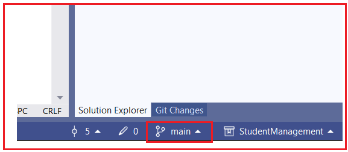
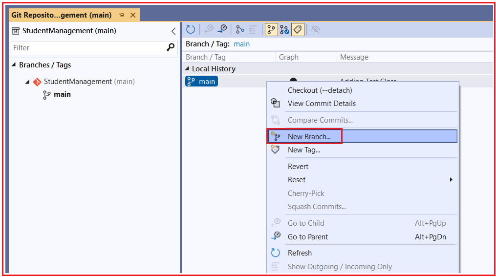
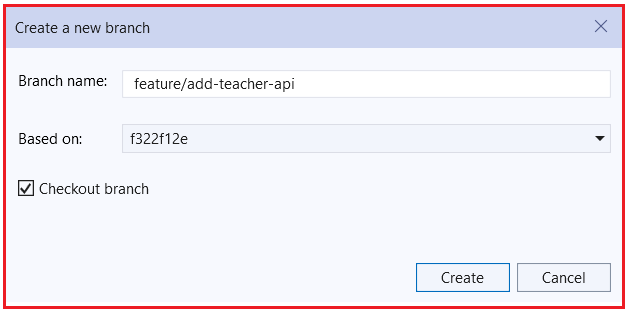
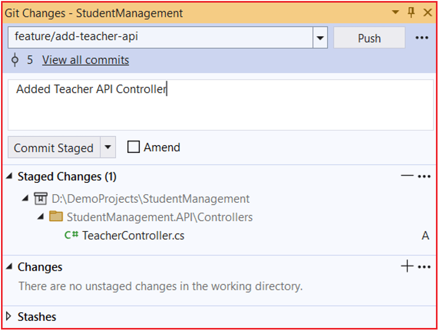

## **شاخه‌بندی مخزن گیت برای توسعه ASP.NET Core**

وقتی یک پروژه ASP.NET Core می‌سازیم، به اضافه کردن ویژگی‌ها و رفع اشکالات ادامه خواهیم داد. اگر همه چیز را در یک کدبیس واحد قرار دهیم، پروژه در حال کار ما می‌تواند در هر زمانی با مشکل مواجه شود. شاخه‌بندی با جدا نگه داشتن تغییرات تا زمان آماده شدن آنها، به ما کمک می‌کند تا با خیال راحت کار کنیم. شاخه‌بندی به ما امکان می‌دهد بدون ایجاد مشکل در کد اصلی (پایدار)، با خیال راحت روی تغییرات کار کنیم.

#### **شعبه چیست؟**

یک **شاخه** مانند ایجاد یک کپی جداگانه از مسیر کاری شماست که در آن می‌توانید بدون دست زدن به پروژه اصلی، به طور مستقل کار کنید. از نظر فنی، یک شاخه نشان دهنده یک خط توسعه جداگانه است که از نسخه فعلی کد شروع می‌شود.

می‌توانید این‌طور به آن فکر کنید: بگذارید جداگانه روی این ویژگی کار کنم. نمی‌خواهم مزاحم پروژه اصلی شوم.

در گیت، **یک شاخه فایل‌ها را کپی نمی‌کند** . در عوض، گیت به خاطر می‌سپارد **که کار شما از کجا شروع شده** و تغییرات جدید شما را جداگانه پیگیری می‌کند. می‌توانید در آن شاخه تغییرات را اعمال کنید، آنها را ثبت کنید و آزمایش کنید، در حالی که پروژه اصلی دست نخورده باقی می‌ماند.

وقتی یک شاخه ایجاد می‌کنید:

- شما از نسخه فعلی پروژه شروع می‌کنید.
- شما می‌توانید بدون دست زدن به کد اصلی، تغییرات را اعمال کنید.
- کار شما تا زمانی که تصمیم به ادغام آن نگیرید، جدا باقی می‌ماند.

##### **چرا به شعبه نیاز داریم؟**

ما به شاخه‌ها نیاز داریم زیرا **توسعه نرم‌افزار در یک مرحله انجام نمی‌شود** . توسعه به تدریج اتفاق می‌افتد:

- ما ویژگی‌های جدیدی اضافه می‌کنیم
- ما اشکالات را برطرف می‌کنیم
- ما کد را آزمایش و بهبود می‌دهیم
- ما اشتباه می‌کنیم و آنها را اصلاح می‌کنیم

همه اینها زمان می‌برد و گاهی اوقات تغییرات می‌توانند اشتباه یا ناقص باشند.

بدون شاخه:

- همه کد یکسانی را ویرایش می‌کنند
- اشتباهات می‌توانند کل پروژه را خراب کنند
- کار نیمه‌تمام به کد پایدار می‌رسد

با شاخه‌های:

- شما می‌توانید با خیال راحت در انزوا کار کنید
- می‌توانید قبل از اشتراک‌گذاری، تغییرات خود را آزمایش کنید
- سایر توسعه‌دهندگان تحت تأثیر اشتباهات شما قرار نمی‌گیرند

در ASP.NET Core، حتی یک اشتباه کوچک، مانند ثبت نادرست تزریق وابستگی یا مشکل در ترتیب میان‌افزار، می‌تواند برنامه را از کار بیندازد. شاخه‌ها به ما کمک می‌کنند **آزمایش کنیم، یاد بگیریم و مشکلات را با خیال راحت برطرف کنیم .** تا بدون ایجاد اختلال در کد پایدار،

#### **شاخه اصلی چیست؟**

شاخه **اصلی** (که معمولاً main نامیده می‌شود) **مهم‌ترین شاخه** در یک پروژه است. این شاخه شامل **نسخه پایدار و قابل اعتماد** کد است. شاخه اصلی معمولاً شامل موارد زیر است:

- کد کار
- کد تست شده
- کدی که برای اجرا یا استقرار ایمن است

همه اعضای تیم به شاخه اصلی اعتماد دارند. به همین دلیل است که باید همیشه **تمیز، پایدار و قابل اعتماد** باقی بماند . شاخه‌های دیگر از آن ایجاد می‌شوند و پس از آزمایش/بررسی مناسب، دوباره در آن ادغام می‌شوند.

#### **چرا باید از کار مستقیم روی Main اجتناب کنیم؟**

کار مستقیم روی شاخه اصلی ریسک‌پذیر و خطرناک است. شاخه اصلی بین همه مشترک است، بنابراین هر اشتباهی روی کل تیم تأثیر می‌گذارد.

اگر کسی:

- کد نیمه‌کاره را اجرا می‌کند
- یک اشکال را فشار می‌دهد
- ساخت را خراب می‌کند

سپس:

- کل پروژه می‌تواند متوقف شود
- سایر توسعه‌دهندگان بلافاصله تحت تأثیر قرار می‌گیرند
- اشکالات ممکن است به کاربران یا تولید برسند

رویکرد صحیح این است:

- همه کارها را در یک شاخه جداگانه انجام دهید
- کار را به درستی آزمایش کنید
- فقط زمانی که صحیح است، در فایل اصلی ادغام شود

**قانون:** **Main برای کد پایدار است، نه برای یادگیری یا آزمایش *.*** برای حفظ امنیت پروژه، از کار مستقیم روی main خودداری کنید.

#### **شاخه ویژگی چیست؟**

یک **شاخه ویژگی،** شاخه‌ای است که برای ساخت ایمن **یک ویژگی خاص** ایجاد شده است . این شاخه تمام کارهای مربوط به ویژگی را از شاخه اصلی جدا نگه می‌دارد.

مثال‌هایی در ASP.NET Core:

- اضافه کردن یک ماژول جدید
- اضافه کردن یک کنترلر جدید
- پیاده‌سازی ورود یا احراز هویت
- افزودن یک نقطه پایانی API جدید
- افزودن ذخیره‌سازی یا اعتبارسنجی
- رفع یک اشکال

یک ویژگی معمولاً در یک کامیت واحد پیاده‌سازی نمی‌شود. به چندین کامیت (پیشرفت گام به گام) نیاز دارد. یک شاخه ویژگی، تمام آن کامیت‌ها را در یک مکان نگه می‌دارد تا تیم بتواند ویژگی را به عنوان یک واحد کامل بررسی، آزمایش و ادغام کند.

تمام کارهای مربوط به آن ویژگی در همان شاخه ویژگی باقی می‌ماند. این کار تغییرات را سازماندهی شده و بررسی آنها را آسان نگه می‌دارد. وقتی ویژگی:

- تکمیل شده
- آزمایش شده
- درست کار کردن

سپس در فایل اصلی ادغام می‌شود.

**قانون ساده:** یک ویژگی = یک شاخه ویژگی

#### **چگونه شاخه‌بندی به توسعه‌دهندگان متعدد کمک می‌کند؟**

انشعاب به چندین توسعه‌دهنده اجازه می‌دهد تا **به‌طور همزمان روی یک کدبیس** کار کنند ، فرآیندی نامیده می‌شود **که توسعه موازی** .

مثال:

- توسعه‌دهنده A روی ویژگی/احراز هویت کار می‌کند
- توسعه‌دهنده B روی ویژگی/پرداخت کار می‌کند
- توسعه‌دهنده C روی رفع اشکال/مشکل ورود به سیستم کار می‌کند
- توسعه‌دهنده D روی ویژگی/گزارش‌دهی کار می‌کند

هر توسعه‌دهنده:

- روی شاخه‌ی خودشان کار می‌کنند
- مزاحم دیگران نمی‌شود
- با خیال راحت و مستقل متعهد می‌شود

بعداً، شاخه‌ها یکی یکی و به صورت کنترل‌شده در شاخه اصلی ادغام می‌شوند. این کار از درگیری، سردرگمی و تأخیر جلوگیری می‌کند. بنابراین، شاخه‌بندی به تیم‌ها اجازه می‌دهد تا بدون ایجاد مانع برای یکدیگر، به راحتی با هم کار کنند.

#### **قرارداد نامگذاری ساده شاخه چیست؟**

نام شاخه‌ها باید به وضوح توضیح دهد **که آن شاخه برای چیست** . این به همه کمک می‌کند تا بلافاصله هدف را درک کنند. نام‌های خوب برای شاخه‌ها، خوانایی، کار تیمی و سازماندهی پروژه را بهبود می‌بخشند، به خصوص هنگامی که مخزن بزرگ می‌شود.

قرارداد رایج و ساده:

- feature/<name> → feature/authentication, feature/payment
- bugfix/<name> → bugfix/login-error, bugfix/nullref-issue
- hotfix/<name> (فوری) → hotfix/payment-failure

پیشوندها مانند دسته‌ها عمل می‌کنند. وقتی مخزن شما شاخه‌های زیادی دارد، این پیشوندها به شما کمک می‌کنند تا به سرعت فیلتر کنید و بفهمید هر شاخه چه کاری انجام می‌دهد. آنها همچنین ارتباط در تیم‌ها را بهبود می‌بخشند، فقط با خواندن نام شاخه، افراد هدف را می‌فهمند.

#### **گردش کار شاخه‌بندی بلادرنگ در ویژوال استودیو برای پروژه Web API شما**

ما این کار را مانند یک **آزمایشگاه عملی** در ویژوال استودیو با استفاده از **دو شاخه** انجام خواهیم داد :

- **feature/add-teacher-api**
- **bugfix/student-bug**

ما **تغییرات واقعی را** در هر شاخه ایجاد خواهیم کرد، سپس یک **تداخل واقعی را** در **Program.cs** شبیه‌سازی می‌کنیم و در نهایت در main ادغام می‌کنیم.

##### **چگونه مطمئن شویم که در شعبه اصلی هستیم**

این **همیشه اولین قدم** قبل از ایجاد هر شاخه‌ای است.

- راه حل خود را در ویژوال استودیو باز کنید
- به **گوشه پایین سمت راست** ویژوال استودیو نگاه کنید
- نام شاخه فعلی را مشاهده خواهید کرد
- هر نام شاخه‌ای که آنجا می‌بینید، همان جایی است که تغییرات بعدی شما در آن اعمال خواهد شد.



##### **مطمئن شوید که تغییرات کامیت نشده (uncommit) ندارید**

1. بروید **به View → Git Changes** .
2. اگر تغییرات فایل را مشاهده کردید:
	- - یا **متعهد شوید** (اگر کار معنادار باشد، بهتر است)، یا
				- **ذخیره کنید** (اگر ناقص باشد بهتر است).

##### **چرا این مرحله مهم است:**

- ایجاد می‌شوند **شاخه‌ها از شاخه‌ی بررسی‌شده‌ی فعلی**
- اگر روی main نباشید، شاخه جدید شما بر اساس کد اشتباه خواهد بود.

#### **ایجاد شاخه API Add Teacher از main**

این شاخه برای **توسعه ویژگی‌های جدید** است ، بنابراین باید از شاخه اصلی شروع شود. مطمئن شوید که در **شاخه اصلی** هستید .

##### **مراحل: ایجاد شاخه از شاخه اصلی**

بروید **به Git → Manage Branches** کلیک راست کنید … **. سپس، روی main** → **New Branch**



جزئیات زیر را وارد کنید و شاخه را ایجاد کنید:

1. نام شعبه: **feature/add-teacher-api**
2. بررسی کنید **شعبه پرداخت را** (تا فوراً تغییر کند)
3. کلیک کنید **روی ایجاد**



##### **چه اتفاقی افتاد؟**

- گیت یک شاخه جدید ایجاد کرد که از شاخه اصلی شروع می‌شود.
- ویژوال استودیو **تغییر وضعیت داد** به طور خودکار به feature/teacher-api
- هر کدی که اکنون می‌نویسید فقط به این شاخه تعلق دارد.

##### **ایجاد یک کنترل‌کننده معلم**

هستید **شما اکنون درون** **feature/teacher-api** .

- کلیک راست کنید. **Controllers** روی پوشه
- افزودن → کنترلر → کنترلر API – خالی
- اسمش را بگذارید: TeacherController

سپس، کد زیر را کپی کرده و در TeacherController قرار دهید.

```csharp
using Microsoft.AspNetCore.Mvc;

namespace StudentManagement.API.Controllers
{
    [Route("api/[controller]")]
    [ApiController]
    public class TeachersController : ControllerBase
    {
        [HttpGet]
        public IActionResult Get()
        {
            return Ok(new[]
            {
                new { Id = 1, Name = "Teacher 1", Subject = "Math" },
                new { Id = 2, Name = "Teacher 2", Subject = "Science" }
            });
        }
    }
}
```

##### **تغییرات را اعمال کنید**

- گیت را باز کنید **→ تغییرات گیت**
- Stage **TeacherController.cs**
- پیام کامیت: **کنترلر API معلم اضافه شد**



###### **چرا ما اینجا متعهد می‌شویم؟**

- کار روی ویژگی‌ها در **کامیت‌های کوچک و معنادار پیش می‌رود**
- اصلی دست نخورده و پایدار باقی مانده است

##### **ایجاد یک شاخه رفع اشکال از شاخه اصلی**

**به صفحه اصلی اول برگردید**

- انتخابگر شاخه پایین سمت راست → انتخاب **شاخه اصلی**
- صبر کنید تا ویژوال استودیو فایل‌ها را دوباره بارگذاری کند.

**چرا:** شاخه رفع اشکال شما باید از شاخه اصلی شروع شود، نه از شاخه معلم.

##### **شاخه رفع اشکال را از شاخه اصلی ایجاد کنید**

- **گیت → مدیریت شاخه‌ها**
- کلیک راست کنید **روی شاخه اصلی** → **شاخه جدید از…**
- نام شاخه: **bugfix/student-bug**
- شعبه پرداخت
- کلیک کنید **روی ایجاد**

##### **اضافه کردن قابلیت ثبت وقایع (Logging) در کنترلر Student (رفع اشکال)**

هستید **اکنون شما در شاخه bugfix/student-bug** . **StudentController** را باز کنید و سپس کد زیر را کپی و پیست کنید. ما قابلیت ثبت وقایع (logging) را اینجا اضافه کرده‌ایم.

```csharp
using Microsoft.AspNetCore.Mvc;
using StudentManagement.API.Models;
using StudentManagement.API.Services;

namespace StudentManagement.API.Controllers
{
    [ApiController]
    [Route("api/[controller]")]
    public class StudentController : ControllerBase
    {
        private readonly ILogger<StudentController> _logger;

        private readonly IStudentService _studentService;

        public StudentController(IStudentService studentService, Logger<StudentController> logger)
        {
            _studentService = studentService;
            _logger = logger;
        }

        // GET /api/student
        [HttpGet]
        public IActionResult GetAll()
        {
            var students = _studentService.GetAll();
            return Ok(students);
        }

        // GET /api/student/1
        [HttpGet("{id:int}")]
        public IActionResult GetById(int id)
        {
            _logger.LogInformation("Fetching student with Id {Id}", id);

            var student = _studentService.GetById(id);

            if (student == null)
            {
                _logger.LogWarning("Student with Id {Id} not found", id);
                return NotFound($"Student with Id {id} not found.");
            }

            return Ok(student);
        }

        // POST /api/student
        [HttpPost]
        public IActionResult Add(Student student)
        {
            var created = _studentService.Add(student);
            return CreatedAtAction(nameof(GetById), new { id = created.Id }, created);
        }
    }
}
```

###### **تغییرات را اعمال کنید:**

- تغییرات گیت → پیام: رفع مشکل پیدا نشدن دانشجو + اضافه کردن گزارش‌گیری
- همه را کامیت کنید

حالا شاخه رفع اشکال شما یک رفع اشکال واقعی + گزارش‌گیری دارد.

##### **چگونه در ویژوال استودیو شاخه‌ها را تغییر دهیم؟  
**

تعویض شاخه بسیار ساده است.

**گام به گام**

- روی نام شعبه کلیک کنید (پایین سمت راست)
- یکی از موارد زیر را انتخاب کنید:
	- - **اصلی**
				- **feature/add-teacher-api**
				- **bugfix/student-bug**

###### **آنچه متوجه خواهید شد**

- فایل‌ها به‌طور خودکار ظاهر/ناپدید می‌شوند
- TeacherController فقط در شاخه ویژگی وجود دارد
- ثبت وقایع فقط در شاخه رفع اشکال (bugfix) وجود دارد.

##### **نتیجه‌گیری:**

شاخه‌بندی به شما کمک می‌کند تا روی ویژگی‌های جدید و رفع اشکالات بدون ایجاد اختلال در شاخه اصلی پایدار کار کنید. شما برای هر کار یک شاخه جداگانه ایجاد می‌کنید، تغییرات خود را در آنجا اعمال و ثبت می‌کنید و پس از آن همه چیز آزمایش می‌شود. با دنبال کردن این فرآیند، پروژه ASP.NET Core شما تمیز، پایدار و مدیریت آن آسان می‌ماند.