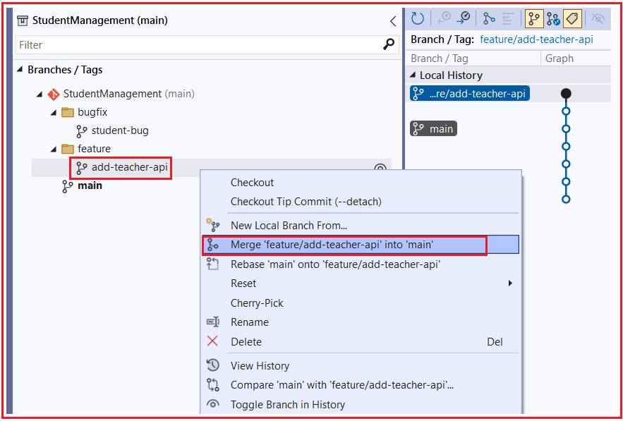
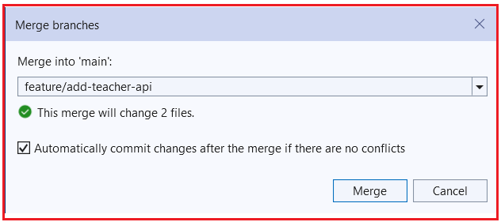
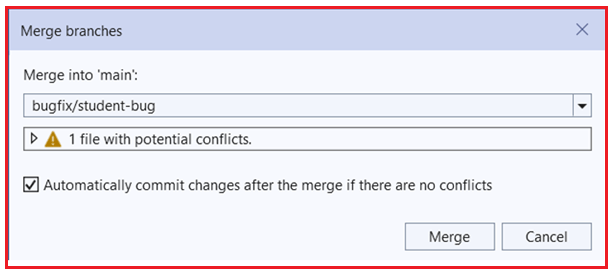
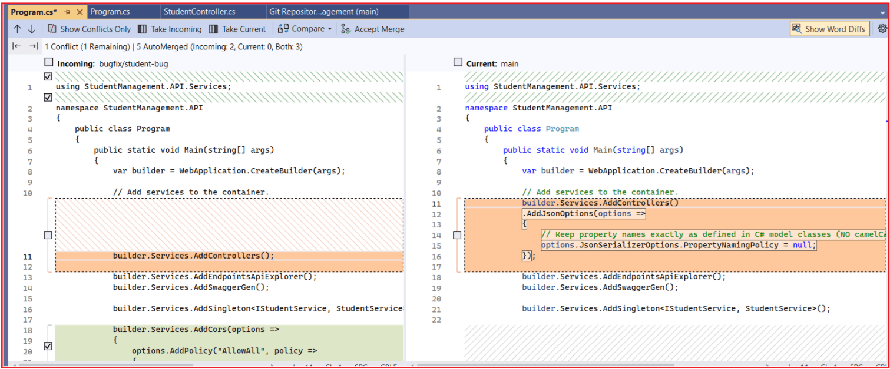

## **ادغام و حل تداخل‌ها در مخزن GIT**

در پروژه‌های ASP.NET Core در دنیای واقعی، کار تقریباً همیشه با استفاده از **چندین شاخه** انجام می‌شود . ویژگی‌ها، رفع اشکالات و آزمایش‌ها به طور جداگانه توسعه داده می‌شوند و بعداً **در یک شاخه پایدار، مانند شاخه اصلی، ادغام می‌شوند** . درک نحوه عملکرد ادغام و نحوه حل تعارضات هنگام وقوع، **مهارتی ضروری** برای هر توسعه‌دهنده است.

تداخلات ادغام **طبیعی** هستند ، نه اشتباه. آنها به سادگی به این معنی هستند که گیت برای تصمیم‌گیری در مورد اینکه کد نهایی چگونه باید باشد، به کمک شما نیاز دارد. وقتی دلیل و چگونگی آن را بفهمید، حل تداخلات به جای چیزی ترسناک، به یک فرآیند آرام و منطقی تبدیل می‌شود.

#### **ادغام چیست؟**

ادغام به معنای ترکیب کار از یک شاخه به شاخه دیگر است.

برای مثال:

- ما یک feature/add-teacher-api ایجاد می‌کنیم.
- ما یک کنترلر جدید اضافه می‌کنیم و تغییرات خود را ثبت می‌کنیم
- بعداً، آن شاخه را در شاخه اصلی ادغام می‌کنیم

پس از ادغام، شاخه هدف شامل تغییرات جدید از شاخه منبع می‌شود. بنابراین، می‌توانید ادغام را اینگونه تصور کنید: دو مسیر کاری جداگانه در یک پایگاه کد مشترک گرد هم می‌آیند.

#### **چه زمانی شاخه‌ها را ادغام می‌کنیم؟**

ما زمانی نیاز به ادغام شاخه‌ها داریم که کار در یک شاخه آماده‌ی گنجاندن در شاخه‌ی دیگر باشد. موارد زیر موقعیت‌های رایج هستند:

- یک ویژگی تکمیل و آزمایش شده است
- رفع اشکال به پایان رسید
- یک اصلاحیه فوری باید سریع اعمال شود
- یک شاخه به آخرین به‌روزرسانی‌ها از شاخه اصلی نیاز دارد

نمونه‌های معمول:

- ادغام ویژگی/احراز هویت با main پس از اتمام توسعه
- پس از رفع مشکل، فایل bugfix/login-error را در فایل اصلی ادغام کنید.
- شاخه اصلی را با شاخه ویژگی خود ادغام کنید تا آخرین تغییرات تیم اعمال شود.

بنابراین، ادغام هر زمان که نیاز به ادغام دو شاخه باشد، اتفاق می‌افتد.

#### **تعارض ادغام چیست؟**

تداخل ادغام زمانی اتفاق می‌افتد که گیت نتواند به‌طور خودکار تغییرات دو شاخه را با هم ترکیب کند. این معمولاً به این معنی است:

- هر دو شاخه یک فایل را تغییر دادند
- و تغییرات روی همان خطوط یا کدهای مجاور تأثیر می‌گذارند
- گیت مطمئن نیست کدام نسخه صحیح است

در آن مرحله، گیت ادغام را متوقف می‌کند و از شما می‌خواهد که کد صحیح نهایی را به صورت دستی انتخاب کنید. تداخل در گیت خطا نیست. گیت به سادگی می‌گوید: من چندین تغییر در اینجا پیدا کردم، اما به شما نیاز دارم تا تصمیم بگیرید نسخه نهایی چه باید باشد.

#### **چرا تداخلات ادغام رخ می‌دهد؟**

تداخل ادغام زمانی رخ می‌دهد که دو شاخه، کد یکسانی را به روش‌های مختلف تغییر دهند. دلایل رایج آن عبارتند از:

- دو شاخه، یک روش را تغییر می‌دهند
- همان فایل پیکربندی به طور متفاوتی تغییر کرد
- میان‌افزار به ترتیب دیگری اضافه شد
- ثبت خدمات در چندین شعبه تغییر کرد

گیت می‌تواند وقتی تغییرات در مکان‌های مختلف هستند، به‌طور خودکار ادغام کند. اما وقتی بخش یکسانی از یک فایل به روش‌های مختلف تغییر می‌کند، گیت به کمک دستی نیاز دارد.

#### **سناریوهای رایج تداخل در پروژه‌های Web API**

در پروژه‌های ASP.NET Core Web API، برخی از فایل‌ها مرتباً تغییر می‌کنند، بنابراین تداخل‌ها بیشتر رخ می‌دهند. نمونه‌های رایج زیر عبارتند از:

###### **Program.cs**

چندین توسعه‌دهنده سرویس‌ها، میان‌افزار، CORS، Swagger، احراز هویت، گزارش‌گیری و غیره را اضافه می‌کنند.

- تغییرات ترتیب میان‌افزار (UseCors، UseAuthentication، UseAuthorization)
- ثبت سرویس‌ها (AddControllers، AddDbContext، DI)
- گزینه‌های JSON، Swagger، تنظیمات CORS

###### **کنترل‌کننده‌ها**

دو شاخه، متد اجرایی یکسانی را ویرایش می‌کنند یا تغییرات همپوشانی ایجاد می‌کنند.

- چندین توسعه‌دهنده در حال اضافه کردن نقاط پایانی در یک فایل کنترلر هستند
- تغییرات ویژگی مسیر
- تغییرات ویژگی‌های مجوز

###### **DTOها / مدل‌ها**

یک شاخه یک ویژگی اضافه می‌کند در حالی که شاخه‌ی دیگر اعتبارسنجی یا نامگذاری را تغییر می‌دهد.

- همان DTO با ویژگی‌های متفاوت به‌روزرسانی شد
- ویژگی‌های اعتبارسنجی به صورت موازی اضافه شدند
- تغییر نام ویژگی‌ها (نادیده گرفتن انتظارات سریال‌سازی)

###### **تنظیمات برنامه.json**

شاخه‌های مختلف، مقادیر پیکربندی، تنظیمات اتصال یا پرچم‌های ویژگی را به‌روزرسانی می‌کنند.

- شاخه‌های مختلف بخش‌های پیکربندی متفاوتی را اضافه می‌کنند
- تغییرات تنظیمات ثبت وقایع
- تفاوت‌های رشته اتصال (تیم‌ها باید از افشای اطلاعات محرمانه خودداری کنند)

###### **تزریق وابستگی (ثبت سرویس‌ها)**

- یک شعبه ثبت نام سرویس جدید را اضافه می‌کند
- نام رابط یا پیاده‌سازی دیگری برای بازسازی

###### **مثالی برای درک ادغام با وجود تداخل‌ها:**

شبیه‌سازی خواهیم کرد **حالا آن را با استفاده از Program.cs** .

- **شاخه A (شاخه معلم):** سریال‌سازی JSON را تغییر دهید تا **از camelCase استفاده نکند** و نام ویژگی‌ها را **دقیقاً همانطور که در Models/DTO های ما تعریف شده‌اند،** برگرداند .
- **شاخه B (شاخه رفع اشکال):** اضافه کردن **میان‌افزار CORS** برای مجاز کردن همه مبداها.

##### **معلم شاخه: نامگذاری camelCase را نادیده بگیرید**

ابتدا، **شاخه feature/add-teacher-api** را انتخاب کنید و سپس **کلاس برنامه** را به صورت زیر تغییر دهید. در اینجا، ما تنظیمات سریال‌سازی JSON را تغییر می‌دهیم.

```csharp
using StudentManagement.API.Services;

namespace StudentManagement.API
{
    public class Program
    {
        public static void Main(string[] args)
        {
            var builder = WebApplication.CreateBuilder(args);

            // Add services to the container.
            builder.Services.AddControllers()
            .AddJsonOptions(options =>
            {
                // Keep property names exactly as defined in C# model classes (NO camelCase)
                options.JsonSerializerOptions.PropertyNamingPolicy = null;
            });

            builder.Services.AddEndpointsApiExplorer();
            builder.Services.AddSwaggerGen();

            builder.Services.AddSingleton<IStudentService, StudentService>();

            var app = builder.Build();

            // Configure the HTTP request pipeline.
            if (app.Environment.IsDevelopment())
            {
                app.UseSwagger();
                app.UseSwaggerUI();
            }

            app.UseHttpsRedirection();

            app.UseAuthorization();

            app.MapControllers();

            app.Run();
        }
    }
}
```

###### **تغییرات را ثبت کنید**

1. **مشاهده → تغییرات گیت**
2. پیام: **نام‌های ویژگی JSON را به عنوان نام‌های مدل برگردانید (غیرفعال کردن camelCase)**
3. **همه را کامیت کنید**

##### **رفع اشکالات شاخه: افزودن سیاست CORS**

ابتدا، **شاخه bugfix/student-bug** را انتخاب کنید و سپس **کلاس برنامه** اضافه می‌کنیم **را به صورت زیر تغییر دهید. در اینجا، ما یک سیاست CORS** تا همه مبداها مجاز باشند.

```csharp
using StudentManagement.API.Services;

namespace StudentManagement.API
{
    public class Program
    {
        public static void Main(string[] args)
        {
            var builder = WebApplication.CreateBuilder(args);

            // Add services to the container.
            builder.Services.AddControllers();
            
            builder.Services.AddEndpointsApiExplorer();
            builder.Services.AddSwaggerGen();

            builder.Services.AddSingleton<IStudentService, StudentService>();

            builder.Services.AddCors(options =>
            {
                options.AddPolicy("AllowAll", policy =>
                {
                    policy
                        .AllowAnyOrigin()
                        .AllowAnyMethod()
                        .AllowAnyHeader();
                });
            });

            var app = builder.Build();

            app.UseCors("AllowAll");

            // Configure the HTTP request pipeline.
            if (app.Environment.IsDevelopment())
            {
                app.UseSwagger();
                app.UseSwaggerUI();
            }

            app.UseHttpsRedirection();

            app.UseAuthorization();

            app.MapControllers();

            app.Run();
        }
    }
}
```

##### **تغییرات را ثبت کنید**

1. **تغییرات گیت**
2. **پیام: افزودن سیاست CORS برای مجاز کردن همه مبدأها**
3. **همه را کامیت کنید**

##### **دو شعبه محلی ما را در شعبه اصلی محلی ادغام کنید**

استفاده می‌کنیم **از آنجایی که ما فقط از یک مخزن محلی** (بدون GitHub/remote)، گردش کار بسیار ساده است. ما فقط باید **هر دو شاخه را یکی یکی در شاخه اصلی ادغام کنیم** و Program.cs را حل کنیم. در صورت نیاز

##### **مرحله ۱: تأیید کنید که در صفحه اصلی هستید**

1. در ویژوال استودیو، به **پایین سمت راست** (نام شاخه) نگاه کنید.
2. اگر main نیست، روی آن کلیک کنید → **main را** انتخاب کنید .

##### **مرحله ۲: مطمئن شوید که فایل اصلی هیچ تغییر در انتظاری ندارد**

1. بروید **به View → Git Changes**
2. مطمئن شوید که **0 تغییر را نشان می‌دهد**
	- اگر تغییراتی را مشاهده کردید: **Commit** ، **Stash** یا **Discard کنید .** ابتدا

###### **مرحله ۳: ادغام شاخه معلم با شاخه اصلی**

1. بروید **به View → Git Repository**
2. گسترش **شاخه‌ها**
3. روی شاخه خود کلیک راست کنید: **feature/teacher-api**
4. کلیک کنید تا وارد main شوید. **روی feature/teacher-api**



سپس، پنجره زیر باز می‌شود:



این پنجره می‌گوید:

- شما در حال حاضر در صفحه **اصلی هستید**
- شما در شرف ادغام **feature/add-teacher-api** **با main هستید.**
- تغییر خواهد داد **۲ فایل را**
- می‌شود . **وجود نداشته باشد ، به طور خودکار commit** اگر **هیچ تداخلی**

کلیک کنید **روی دکمه ادغام** . حالا یکی از دو اتفاق زیر رخ خواهد داد:

##### **مورد الف: بدون تعارض**

ویژوال استودیو:

1. ادغام شاخه با شاخه اصلی
2. ایجاد یک کامیت ادغام به صورت خودکار
3. تغییرات feature/add-teacher-api اکنون درون main قرار دارند.

##### **مورد ب: درگیری رخ می‌دهد**

1. باز خواهد شد. **ویرایشگر ادغام**
2. نتیجه ترکیبی نهایی را انتخاب کنید
3. کلیک کنید **روی پذیرش ادغام**
4. کلیک کنید **روی ادغام کامل**

در مثال ما، هیچ تداخلی وجود ندارد، بنابراین ادغام موفقیت‌آمیز است.

##### **مرحله ۴: ادغام شاخه رفع اشکال (bugfix branch) در شاخه اصلی (main branch)**

1. بمانید **در مسیر اصلی**
2. بروید **به View → Git Repository**
3. گسترش **شاخه‌ها**
4. روی شاخه‌ی خود کلیک راست کنید: bugfix/student-bug
5. روی bugfix/student-bug **در صفحه اصلی کلیک کنید**

حالا وقتی کلیک کنید، صفحه زیر باز می‌شود.



این پنجره موارد زیر را مشخص می‌کند:

- شما در حال حاضر در صفحه **اصلی هستید**
- شما در حال تلاش برای ادغام **bugfix/student-bug** در main هستید.
- ویژوال استودیو **یک فایل با تداخل‌های احتمالی شناسایی کرد.**
- این معمولاً به این معنی است که **گیت نمی‌تواند ادغام خودکار را تضمین کند** و ممکن است پس از ادامه کار، ویرایشگر پنجره تداخل را باز کند.
- این یک خطا نیست. فقط یک هشدار است.
- حالا، روی دکمه‌ی ادغام کلیک کنید.

##### **چگونه با استفاده از ویرایشگر ادغام ویژوال استودیو، تداخل‌ها را حل کنیم؟**

وقتی تداخلی رخ می‌دهد، ویژوال استودیو **ویرایشگر ادغام (Merge Editor) را** باز می‌کند . معمولاً سه گزینه مهم را مشاهده خواهید کرد:

- **فعلی** \= نسخه‌ای که در حال حاضر در شاخه‌ای از آن هستید.
- **ورودی** \= نسخه‌ای که از شاخه‌ای که ادغام می‌کنید می‌آید.
- **هر دو** \= کد را از هر دو طرف نگه دارید (اگر هر دو تغییر لازم باشد).

##### **معنی هر گزینه:**

##### **فعلی**

انتخاب کنید . **گزینه فعلی را** وقتی کد موجود در شاخه فعلی شما نسخه صحیح است و نسخه ورودی نباید جایگزین آن شود،

مثال:

- شما در مسیر اصلی هستید
- main از قبل تنظیمات JSON صحیحی دارد.
- شاخه ورودی نسخه قدیمی‌تری دارد
- باشید **به روز**

##### **ورودی**

را انتخاب کنید . **گزینه Incoming** وقتی کد جدید از شاخه‌ای که قرار است ادغام شود، نسخه صحیح است و باید جایگزین کد شاخه فعلی شود،

مثال:

- شاخه ورودی شامل رفع اشکال مناسب است
- شاخه فعلی منطق قدیمی‌تر را دارد
- ادامه **بده**

##### **هر دو**

را انتخاب کنید . **گزینه «هر دو»** وقتی هر دو مجموعه تغییرات مفید هستند و باید با هم ترکیب شوند،

مثال:

- تنظیمات فعلی JSON است
- ورودی دارای سیاست CORS است
- شما در Program.cs نهایی به هر دو نیاز دارید

##### **مهم:**

کورکورانه کلیک نکنید. کد را بخوانید و بفهمید که برنامه به چه چیزی نیاز دارد. گاهی اوقات، **هر دو** درست هستند، اما کد نهایی ممکن است هنوز نیاز به پاکسازی دستی یا مرتب‌سازی مجدد داشته باشد. پس از انتخاب نتیجه صحیح:

- فایل حل شده را ذخیره کنید
- پذیرش/تکمیل ادغام
- در صورت نیاز، نتیجه ادغام را ثبت کنید

##### **حل اختلافات:**

پنجره حل اختلاف زیر باز خواهد شد.



###### **اینجا:**

- **ورودی (سمت چپ):** bugfix/student-bug دارای **builder.Services.AddControllers(); ساده است** (و همچنین کد CORS زیر آن قرار دارد).
- **فعلی (راست):** تابع اصلی AddControllers().AddJsonOptions(…) را دارد تا **حالت camelCase را غیرفعال کند** و نام ویژگی‌های مدل را حفظ کند.

نیاز ما: **ما هر دو را می‌خواهیم**

1. AddJsonOptions(…PropertyNamingPolicy = null…) از **فایل اصلی**
2. تنظیمات CORS از **bugfix/student-bug** (و بعداً فراخوانی‌های میان‌افزار نیز)

بنابراین، برای این تداخل، باید **ثبت کنترلر فعلی (اصلی)** و کد CORS که از **شاخه bugfix/student-bug** ادغام شده است را نگه داریم . اکنون هر دو شاخه در شاخه اصلی محلی ادغام شده‌اند.

##### **چرا آزمایش پس از ادغام مهم است؟**

حل یک تداخل فقط به معنای رضایت گیت است. **تضمین نمی‌کند** که برنامه همچنان به درستی کار کند.

پس از ادغام، کد ممکن است:

- با موفقیت ساخته می‌شود، اما رفتار نادرستی دارد
- ترتیب میان‌افزار اشتباه است
- ثبت نام DI را از دست بدهید
- ایجاد خطاهای زمان اجرا
- تولید پاسخ‌های نادرست API

###### **در ASP.NET Core، این موضوع بسیار مهم است زیرا:**

- ترتیب میان‌افزار بر رفتار تأثیر می‌گذارد
- ثبت سرویس بر وضوح زمان اجرا تأثیر می‌گذارد
- تغییرات کنترلر ممکن است کامپایل شوند اما در اجرا با شکست مواجه شوند.
- اشتباهات ادغام پیکربندی می‌تواند احراز هویت، CORS یا Swagger را مختل کند.

###### **بنابراین، بعد از هر ادغام، همیشه:**

- ساخت پروژه
- برنامه را اجرا کنید
- نقاط پایانی API آسیب‌دیده را آزمایش کنید
- تأیید کنید که راه‌اندازی بدون استثنا کار می‌کند

ادغام تا زمانی که برنامه آزمایش نشود، واقعاً کامل نیست.

##### **چگونه آخرین تغییرات را از شاخه اصلی به شاخه خود بیاوریم؟**

در حالی که شما مشغول کار هستید، ممکن است سایر توسعه‌دهندگان شاخه اصلی را به‌روزرسانی کنند.

برای به‌روز ماندن:

- آخرین تغییرات را از صفحه اصلی دریافت کنید
- شاخه اصلی را در شاخه خود ادغام کنید
- در صورت وجود، اختلافات را برطرف کنید
- ادامه کار

انجام این کار به طور منظم:

- شاخه شما را سازگار نگه می‌دارد
- مشکلات ادغام را بعداً کاهش می‌دهد
- ادغام نهایی را روان می‌کند

به‌روزرسانی شاخه‌تان با main به جلوگیری از غافلگیری‌های بزرگ در پایان کار کمک می‌کند.

##### **تابع main را به شاخه feature/add-teacher-api بیاورید.**

1. به شاخه خود بروید (مثال: feature/add-teacher-api)
	- - پایین سمت راست → انتخاب ویژگی/افزودن API معلم
2. نمای باز **→ مخزن گیت**
3. در زیر **شاخه‌ها** کلیک راست کنید **، روی شاخه اصلی**
4. کلیک کنید **روی ادغام در شاخه فعلی**
5. اگر با تداخل مواجه شدید (احتمالاً Program.cs):
	- - ویرایشگر ادغام را باز کنید
				- کد ترکیبی صحیح را نگه دارید
				- **ادغام را بپذیرید**
6. بروید **به تغییرات گیت**
7. کلیک کنید **روی ادغام**

حالا feature/add-teacher-api شامل آخرین شاخه‌ی main است. و می‌توانید همین کار را برای شاخه‌ی bug انجام دهید.

#### **مثال متناقض سناریوی ۲:**

##### **شاخه ویژگی (feature/add-teacher-api)**

هدف: افزودن **اعتبارسنجی ورودی** .

تغییرات ایجاد شده:

- بررسی می‌شود که آیا Student.Name خالی است یا خیر
- اگر اعتبارسنجی با شکست مواجه شود، BadRequest را برمی‌گرداند

متد Add را به صورت زیر تغییر دهید:

```csharp
[HttpPost]
public IActionResult Add(Student student)
{
    if (string.IsNullOrWhiteSpace(student.Name))
    {
        return BadRequest("Student name is required.");
    }

    var created = _studentService.Add(student);
    return CreatedAtAction(nameof(GetById), new { id = created.Id }, created);
}
```

پس از به‌روزرسانی، لطفاً این تغییرات را اعمال کنید.

##### **شاخه رفع اشکال (رفع اشکال/اشکال دانش‌آموزی)**

هدف: اضافه کردن **مدیریت استثنائات + ثبت وقایع (logging)** .

تغییرات ایجاد شده:

- منطق پیچیده شده در try-catch
- استثنائات غیرمنتظره ثبت شده

متد Add را به صورت زیر تغییر دهید:

```csharp
[HttpPost]
public IActionResult Add(Student student)
{
    try
    {
        var created = _studentService.Add(student);
        return CreatedAtAction(nameof(GetById), new { id = created.Id }, created);
    }
    catch (Exception ex)
    {
        _logger.LogError(ex, "Error while adding student");
        return StatusCode(500, "Internal server error");
    }
}
```

پس از به‌روزرسانی، لطفاً این تغییرات را اعمال کنید.

##### **چرا درگیری ادغام رخ داد؟**

هر دو شاخه **متد یکسانی را** اصلاح کردند : public IActionResult Add(Student student)

گیت می‌بیند:

- منطق متفاوت درون یک متد
- خطوط یکسان به دو روش مختلف تغییر کردند

گیت نمی‌تواند تصمیم بگیرد: آیا باید منطق اعتبارسنجی را نگه دارم یا منطق مدیریت خطا را؟ یک **تداخل ادغام رخ می‌دهد.**

##### **روش صحیح حل اختلاف**

نیاز تجاری:

- اعتبارسنجی لازم است
- ثبت وقایع + مدیریت خطا مورد نیاز است

کد ادغام شده صحیح:

```csharp
[HttpPost]
public IActionResult Add(Student student)
{
    if (string.IsNullOrWhiteSpace(student.Name))
    {
        return BadRequest("Student name is required.");
    }

    try
    {
        var created = _studentService.Add(student);
        return CreatedAtAction(nameof(GetById), new { id = created.Id }, created);
    }
    catch (Exception ex)
    {
        _logger.LogError(ex, "Error while adding student");
        return StatusCode(500, "Internal server error");
    }
}
```

ما **هر دو را قبول داریم** ، اما به **ترتیب صحیح** .

##### **چگونه این کار را در ویرایشگر ادغام ویژوال استودیو انجام دهیم؟**

وقتی صفحه درگیری باز است:

1. **کورکورانه روی «پذیرش هر دو» کلیک نکنید.**
2. روی **پنجره نتیجه** (نهایی) کلیک کنید
3. کد را به صورت دستی مرتب کنید:
	- - اعتبارسنجی را از **ورودی کپی کنید**
				- فراخوانی سرویس را با یک try-catch از **Current جمع‌بندی کنید.**
4. اطمینان حاصل کنید که سفارش:
	- - اگر (اعتبارسنجی)
				- سعی کنید {فراخوانی سرویس}
				- گرفتن {ثبت وقایع}
5. کلیک کنید **روی پذیرش ادغام**
6. ساخت و اجرای پروژه

##### **چگونه اختلافات ادغام را در یک تیم کاهش دهیم؟**

نمی‌توان از تداخلات ادغام به طور کامل اجتناب کرد، اما می‌توان با عادات خوب تیمی آنها را تا حد زیادی کاهش داد.

**بهترین راه‌ها برای کاهش اختلافات:**

- **مرتباً آخرین نسخه اصلی را** **به شاخه خود** بکشید/ادغام کنید . این کار شاخه شما را به‌روز نگه می‌دارد و از تداخل‌های بزرگ بعدی جلوگیری می‌کند.
- **شاخه‌های کوچک و متمرکز ایجاد کنید** . ادغام شاخه‌های کوچک آسان‌تر از شاخه‌های طولانی است.
- **تغییرات منطقی کوچک را اعمال کنید** . اعمال تغییرات کوچک‌تر، درک و حل اختلافات را آسان‌تر می‌کند.
- **از ویرایش غیرضروری یک فایل خودداری کنید** . اگر یک توسعه‌دهنده از قبل به شدت روی Program.cs کار می‌کند، قبل از ایجاد تغییرات بزرگ در آنجا، هماهنگی لازم را انجام دهید.
- **با تیم ارتباط برقرار کنید** . اگر چندین توسعه‌دهنده فایل‌های مشترک را لمس می‌کنند، زودتر در مورد آن صحبت کنید.
- **کارهای تکمیل‌شده را زودتر ادغام کنید** . هر چه یک شاخه بیشتر جدا بماند، احتمال تداخل آن در آینده بیشتر می‌شود.
- **از سازماندهی واضح کد استفاده کنید** . ثبت نام سرویس‌ها، میان‌افزار و پیکربندی را به طور واضح گروه‌بندی کنید، بنابراین ترکیب ویرایش‌ها آسان‌تر است.

**قانون تیم:** همگام‌سازی مکرر، تغییرات کوچک و ارتباط = اختلافات کمتر.

##### **نتیجه‌گیری**

ادغام یک بخش عادی و ضروری از توسعه مبتنی بر گیت است. این کار، کار تکمیل‌شده را از یک شاخه به شاخه دیگر منتقل می‌کند تا پروژه بتواند به پیشرفت خود ادامه دهد. اکثر ادغام‌ها خودکار هستند، اما وقتی دو شاخه، ناحیه کد یکسانی را به طور متفاوت تغییر می‌دهند، گیت یک تداخل ایجاد می‌کند و از شما می‌خواهد که نتیجه نهایی صحیح را تعیین کنید.

در ویژوال استودیو، مدیریت تداخل‌ها آسان‌تر است زیرا ویرایشگر ادغام به وضوح **Current** ، **Incoming** و **Both** را نشان می‌دهد . پس از انتخاب کد ترکیبی صحیح، همیشه باید برنامه را بسازید و آزمایش کنید تا از صحت و پایداری نتیجه ادغام شده اطمینان حاصل شود.
