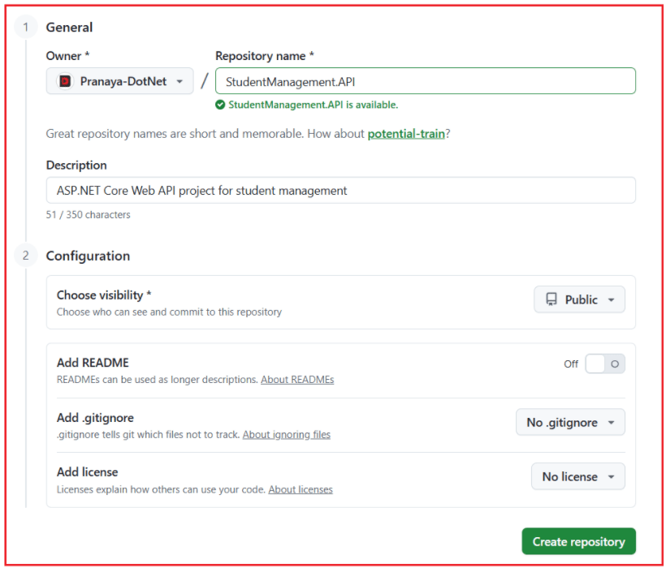
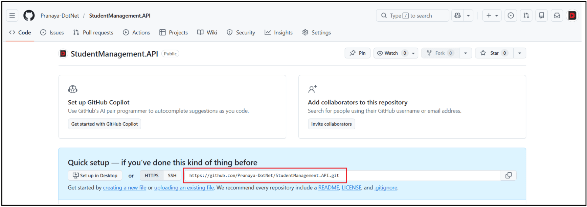
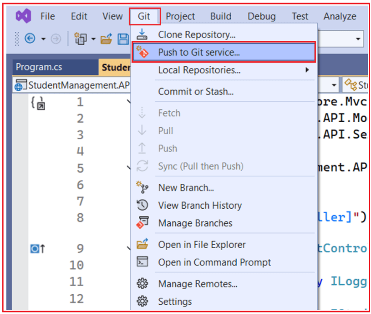
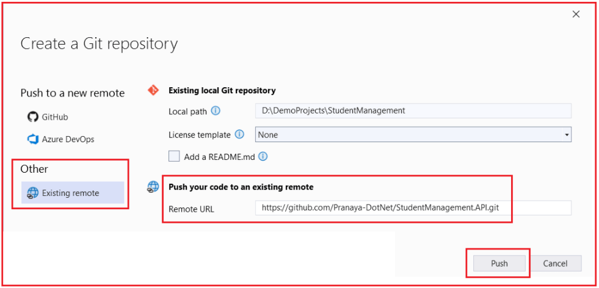
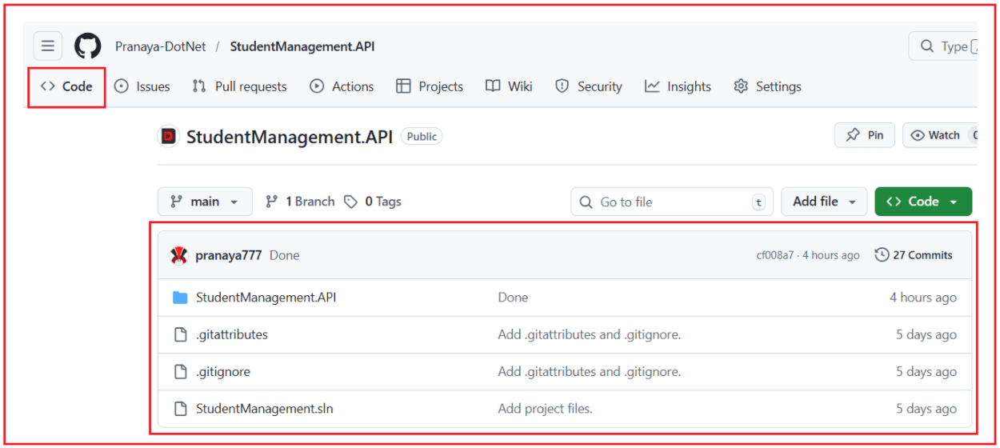
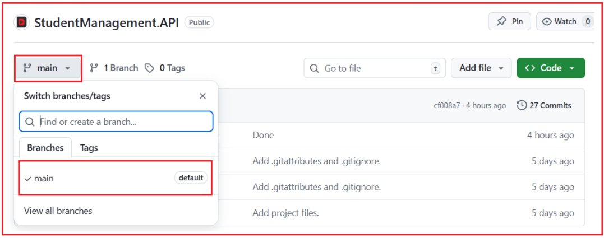

## **کار با مخازن راه دور GitHub با استفاده از Visual Studio**

وقتی تنها کار می‌کنیم، یک **مخزن محلی گیت** کافی است. اما توسعه نرم‌افزار در دنیای واقعی یک **فعالیت تیمی** است . کد باید بین چندین توسعه‌دهنده و ماشین به اشتراک گذاشته، بررسی و همگام‌سازی شود. اینجاست که **مخازن از راه دور** ، به ویژه **گیت‌هاب** ، ضروری می‌شوند.

#### **مخزن راه دور چیست و چرا تیم‌ها از آن استفاده می‌کنند؟**

مخزن **راه دور،** مخزنی است که در مکانی دیگر، معمولاً روی یک سرور یا پلتفرم ابری مانند **GitHub** ، ذخیره می‌شود . این مخزن شامل همان تاریخچه پروژه، شاخه‌ها و کامیت‌ها است، اما به صورت آنلاین در دسترس است و به چندین توسعه‌دهنده اجازه می‌دهد به آن دسترسی داشته باشند.

تیم‌ها از یک مخزن راه دور استفاده می‌کنند زیرا:

- عمل می‌کند **به عنوان پایگاه کد مشترک مرکزی**
- هر کس می‌تواند کار خود را به یک مکان مشترک منتقل کند
- همه می‌توانند آخرین به‌روزرسانی‌ها را از هم‌تیمی‌هایشان دریافت کنند
- به همکاری، بررسی کد و پشتیبان‌گیری کمک می‌کند
- از گردش‌های کاری مانند درخواست‌های pull، اشتراک‌گذاری شاخه و استقرار پشتیبانی می‌کند.

بدون مخزن راه دور:

- هر توسعه‌دهنده فقط نسخه محلی خودش را دارد
- اشتراک‌گذاری کد دستی و دشوار می‌شود
- هماهنگی تیمی کند و پرخطر می‌شود

بنابراین، در پروژه‌های واقعی:

- **مخزن محلی** \= فضای کاری شما
- **مخزن راه دور** \= فضای کاری مشترک تیم

#### **چگونه یک مخزن راه دور جدید GitHub ایجاد کنیم؟**

در گیت‌هاب، ایجاد یک مخزن جدید از منوی بالا سمت راست **\+** با انتخاب **مخزن جدید** انجام می‌شود . مستندات گیت‌هاب این را به عنوان روش استاندارد ایجاد یک مخزن از رابط کاربری وب توصیف می‌کنند.

##### **گام به گام:**

- را باز کنید [**https://github.com**](https://github.com)
- وارد حساب گیت‌هاب خود شوید
- کلیک کنید **روی آیکون +** در بالا سمت راست
- کلیک کنید **روی مخزن جدید**
- را وارد کنید **نام مخزن**
- را انتخاب کنید **عمومی** یا **خصوصی**
- کلیک کنید **روی ایجاد مخزن**

برای درک بهتر، لطفاً به تصویر زیر نگاهی بیندازید:

##### **تنظیمات:**

لطفا موارد زیر را ارائه دهید:

- **مالک:** حساب خود را نگه دارید (Pranaya-DotNet)
- **نام مخزن:** StudentManagement.API
- **توضیحات:** اختیاری. می‌توانید آن را خالی بگذارید یا چیزی شبیه به این اضافه کنید: پروژه ASP.NET Core Web API برای مدیریت دانش‌آموزان
- **انتخاب میزان دیده شدن:** **عمومی**
- **افزودن README:** **خاموش**
- **اضافه کردن .gitignore:** **خیر .gitignore**
- **افزودن مجوز:** **بدون مجوز**
- سپس روی **ایجاد مخزن** کلیک کنید . باید تصویر زیر را ببینید. لطفاً آدرس مخزن را کپی کنید.

##### **چرا این گزینه‌ها برای ما صحیح هستند؟**

زیرا:

- ما در حال حاضر این پروژه را به صورت محلی داریم.
- مخزن محلی ما از قبل فایل‌ها و تاریخچه کامیت‌ها را دارد.
- ما فقط یک **مخزن راه دور خالی** در GitHub می‌خواهیم

##### **مخازن عمومی در مقابل مخازن خصوصی**

یک مخزن گیت‌هاب می‌تواند **عمومی** یا **خصوصی** باشد . این مشخص می‌کند **چه کسی می‌تواند کد شما را در گیت‌هاب ببیند** . وقتی یک مخزن جدید ایجاد می‌کنید، گیت‌هاب از شما می‌خواهد یکی از این دو گزینه‌ی نمایش را انتخاب کنید. یک **مخزن عمومی را** هر کسی در اینترنت می‌تواند مشاهده کند. یک **مخزن خصوصی** فقط توسط شما و افرادی که صریحاً به آنها دسترسی می‌دهید، قابل مشاهده است.

##### **مخزن عمومی چیست؟**

یک **مخزن عمومی** برای مشاهده همه باز است. این به این معنی است که:

- هر کسی می‌تواند از صفحه مخزن بازدید کند
- هر کسی می‌تواند فایل‌ها، کامیت‌ها، شاخه‌ها و README شما را ببیند
- هر کسی می‌تواند مخزن را روی دستگاه خود کلون کند.

مخازن عمومی معمولاً برای موارد زیر استفاده می‌شوند:

- پروژه‌های متن‌باز
- پروژه‌های یادگیری
- پروژه‌های نمونه/دمو
- نمونه کارها
- کدی که می‌خواهید به صورت عمومی به اشتراک بگذارید

**مثال:** اگر یک پروژه عمومی ASP.NET Core Web API در GitHub ایجاد کنید، سایر توسعه‌دهندگان می‌توانند کنترلرها، سرویس‌ها و ساختار پروژه شما را مستقیماً مشاهده کنند.

##### **مخزن خصوصی چیست؟**

یک **مخزن خصوصی** محدود شده است. این یعنی:

- فقط شما می‌توانید آن را به طور پیش‌فرض ببینید
- فقط همکاران یا اعضای تیم دعوت‌شده می‌توانند به آن دسترسی داشته باشند
- افراد دیگر نمی‌توانند بدون اجازه آن را مشاهده یا کپی کنند.

مخازن خصوصی معمولاً برای موارد زیر استفاده می‌شوند:

- پروژه‌های شرکت
- کار مشتری
- پروژه‌های شخصی آماده اشتراک‌گذاری نیستند
- پروژه‌هایی که شامل منطق تجاری یا کد حساس هستند

**مثال:** اگر پروژه ASP.NET Core شما برای یک مشتری واقعی یا استفاده داخلی شرکت است، معمولاً باید خصوصی باشد.

##### **کدام یک را باید انتخاب کنید؟**

را انتخاب کنید **عمومی** اگر:

- می‌خواهید کد خود را آشکارا به اشتراک بگذارید
- این یک پروژه آموزشی/آزمایشی/متن‌باز است
- می‌خواهید دیگران کارهایتان را ببینند

را انتخاب کنید **خصوصی** اگر:

- پروژه شخصی یا محرمانه است
- این کد شرکت/مشتری است
- شما نمی‌خواهید دیگران به آن دسترسی داشته باشند

#### **چگونه مخزن محلی ویژوال استودیو موجود خود را به گیت‌هاب لینک کنیم؟**

از آنجا که ما از قبل یک مخزن محلی داریم، معمولاً **ابتدا کلون نمی‌گیریم** . در عوض، مخزن محلی موجود خود را به عنوان یک ریموت به مخزن گیت‌هاب متصل می‌کنیم.

##### **مرحله ۱: آدرس URL مخزن گیت‌هاب خود را کپی کنید**

در گیت‌هاب، مخزن جدید خود را باز کنید و **URL کلون** را کپی کنید . چیزی شبیه به این خواهد بود:

- [**https://github.com/Pranaya-DotNet/StudentManagement.API.git**](https://github.com/Pranaya-DotNet/StudentManagement.API.git)

گیت‌هاب از این URL به عنوان آدرس ریموت برای مخزن شما استفاده می‌کند.

##### **مرحله ۲: در ویژوال استودیو، روی Git → Push to Git Service… کلیک کنید.**

##### **مرحله ۳: در پنجره ایجاد مخزن گیت**

انتخاب کنید:

- **ریموت موجود**
- **الگوی مجوز:** **هیچکدام**
- **افزودن فایل README.md:** **تیک نخورده باقی بماند**
- **آدرس اینترنتی (URL) ریموت:** آدرس اینترنتی مخزن گیت‌هاب خود را همانطور که هست نگه دارید. [**https://github.com/Pranaya-DotNet/StudentManagement.API.git**](https://github.com/Pranaya-DotNet/StudentManagement.API.git) .
- شاخه (معمولاً شاخه اصلی) را تأیید کنید. به **گوشه پایین سمت راست** ویژوال استودیو نگاه کنید. نام شاخه فعلی را در آنجا خواهید دید.
- کلیک کنید، **فشار دهید**

##### **ویژوال استودیو در پشت صحنه چه می‌کند؟**

- مخزن محلی ما یک **مبدأ با نام ریموت دریافت می‌کند**
- آن مبدا به URL مخزن گیت‌هاب ما اشاره می‌کند
- پس از آن، Push/Pull بین گیت‌هاب و لوکال کار می‌کند.

#### **چگونه می‌توان Repo را در GitHub پس از Push تأیید کرد؟**

کلیک کردید **روی Push** بعد از اینکه در ویژوال استودیو ، آن را در گیت‌هاب تأیید کنید. صفحه مخزن خود را در گیت‌هاب باز کنید. **تب Code** (صفحه اصلی مخزن) را بررسی کنید. اکنون فایل‌ها و پوشه‌های پروژه شما باید در آنجا قابل مشاهده باشند.

بررسی کنید **منوی کشویی شاخه (Branch Dropdown) را** و مطمئن شوید که شاخه (branch) صحیح (معمولاً شاخه اصلی) را مشاهده می‌کنید. انتخابگر شاخه (branch selector) گیت‌هاب به شما امکان می‌دهد شاخه‌ها را از صفحه مخزن (repository page) مشاهده کنید.

کلیک کنید (یا یک فایل را باز کنید و از تاریخچه آن استفاده کنید). گیت‌هاب مستند می‌کند که می‌توانید تاریخچه commitهای یک مخزن را از صفحه commits مشاهده کنید. **برای تأیید نمایش آخرین پیام commit، روی پیوند commits/history** مربوط به مخزن

**به عبارت ساده،** مخزن گیت‌هاب را باز کنید، مطمئن شوید که فایل‌های شما در **تب Code** نمایش داده می‌شوند ، مطمئن شوید که شاخه‌ی درست انتخاب شده است و تأیید کنید که آخرین کامیت شما در تاریخچه‌ی کامیت‌ها قابل مشاهده است.

#### **پوش چیست؟**

**Push** به معنی ارسال کامیت‌های محلی ما به مخزن ریموت است. Push فقط **تغییرات کامیت شده را** ارسال می‌کند . تغییرات کامیت نشده، پوش نمی‌شوند.

بنابراین، جریان این است:

- ایجاد تغییرات
- به صورت محلی کامیت کنید
- ارسال به گیت‌هاب

وقتی فشار می دهیم:

- گیت‌هاب آخرین کامیت‌های ما را دریافت می‌کند
- سپس توسعه‌دهندگان دیگر می‌توانند تغییرات ما را دریافت کنند
- شاخه ما در گیت‌هاب به‌روزرسانی شد

**معنی ساده: Push = آپلود کامیت‌های محلی من در گیت‌هاب**

#### **چگونه کد محلی موجود خود را به GitHub ارسال کنید**

یک **push،** کامیت‌های محلی ما را به مخزن ریموت ارسال می‌کند.

**گام به گام در ویژوال استودیو:**

- ابتدا مطمئن شوید که فایل‌های شما به صورت محلی کامیت شده‌اند
- نمای باز **→ تغییرات گیت**
- اگر هنوز فایل‌ها را تغییر داده‌اید:
	- - صحنه سازی آنها
				- یک پیام کامیت وارد کنید
				- کلیک کنید **متعهد شوید**
- سپس روی **Push کلیک کنید (Git → Push)**

**چه اتفاقی می‌افتد:**

- ویژوال استودیو کامیت‌های محلی شما را آپلود می‌کند
- گیت‌هاب آنها را در شاخه‌ی لینک‌شده دریافت می‌کند.
- کد شما اکنون در مخزن گیت‌هاب ظاهر می‌شود.

**مهم:** فقط **تغییرات تایید شده** اعمال می‌شوند. ویرایش‌های تایید نشده فقط روی دستگاه شما باقی می‌مانند.

#### **پول چیست؟**

**Pull** به معنای آوردن آخرین تغییرات از مخزن راه دور به مخزن محلی شما است. هنگام pull:

- گیت ابتدا آخرین تغییرات ریموت را دریافت می‌کند
- سپس آن تغییرات را در شاخه محلی شما ادغام می‌کند

بنابراین، اگر توسعه‌دهنده‌ی دیگری کدی را به گیت‌هاب ارسال کند، شما **از Pull** برای به‌روزرسانی نسخه‌ی محلی خود استفاده می‌کنید.

**معنی ساده: Pull = دانلود آخرین تغییرات از GitHub و به‌روزرسانی شاخه محلی من**

##### **چگونه آخرین تغییرات را از GitHub دریافت کنیم**

یک **pull** آخرین تغییرات را از مخزن راه دور دریافت کرده و شاخه محلی شما را به‌روزرسانی می‌کند.

**گام به گام در ویژوال استودیو:**

- پروژه را در ویژوال استودیو باز کنید
- بروید **گیت** به منوی
- کلیک کنید **بکشید**

**چه اتفاقی می‌افتد:**

- ویژوال استودیو آخرین کامیت‌ها را از گیت‌هاب دانلود می‌کند
- سپس آنها را در شاخه محلی فعلی شما ادغام می‌کند

**از Pull در موارد زیر استفاده کنید:**

- روز کاری خود را شروع می‌کنید
- یک توسعه‌دهنده دیگر کد را ارسال کرده است
- شاخه‌ی خودتان در گیت‌هاب کامیت‌های جدیدی دارد
- قبل از اینکه کار خودت را پیش ببری

##### **تفاوت بین فشار دادن و کشیدن؟**

این دو در جهت مخالف هم هستند.

- **Push:** کامیت‌های محلی شما را **از رایانه‌تان به گیت‌هاب منتقل می‌کند.**
- **Pull:** کامیت‌های ریموت را **از گیت‌هاب به کامپیوتر شما منتقل می‌کند.**

بنابراین:

- **فشار دادن = محلی → از راه دور**
- **کشیدن = از راه دور → محلی**

#### **چرا قبل از هل دادن، بکشیم؟**

معمولاً باید **قبل از Push، Pull کنید** زیرا مخزن راه دور ممکن است از قبل حاوی تغییرات جدیدی از سوی توسعه‌دهندگان دیگر باشد. اگر بدون Pull کردن، push کنید:

- ممکن است شعبه محلی شما قدیمی باشد
- گیت‌هاب ممکن است درخواست شما را رد کند
- ممکن است بعداً تحت فشار نیاز به ادغام تغییرات داشته باشید

اگر اول بکشید:

- شما آخرین کد را از هم‌تیمی‌هایتان دریافت می‌کنید
- شما هرگونه اختلافی را به صورت محلی حل می‌کنید
- فشار شما نرم‌تر و ایمن‌تر می‌شود

**قانون ساده تیم:**

- شروع کار با دریافت آخرین تغییرات
- قبل از فشار نهایی، در صورت نیاز دوباره بکشید
- سپس کامیت‌های خود را پوش کنید

این کاهش می‌دهد:

- رد فشار
- ادغام شگفتی‌ها
- درگیری‌های تیمی

##### **چه اتفاقی می‌افتد وقتی Push رد می‌شود؟**

معمولاً زمانی که شاخه‌ی ریموت کامیت‌هایی دارد که شاخه‌ی محلی شما ندارد، یک push رد می‌شود.

این یعنی:

- گیت‌هاب تاریخچه جدیدتری دارد
- شعبه محلی شما عقب مانده است
- گیت به شما اجازه نمی‌دهد که شاخه‌ی ریموت را به‌طور خودکار بازنویسی کنید

**دلیل رایج:** یک توسعه‌دهنده‌ی دیگر قبل از شما تغییرات را اعمال کرده است.

**آنچه گیت محافظت می‌کند:** گیت از دست رفتن تصادفی کامیت‌های ریموت را جلوگیری می‌کند.

**کاری که باید انجام دهید:**

- آخرین تغییرات را از گیت‌هاب دریافت کنید
- در صورت نیاز، اختلافات را حل کنید
- ادغام را انجام دهید (در صورت لزوم)
- دوباره فشار دهید

**معنی ساده: ارسال ناموفق = شاخه محلی شما با شاخه راه دور به‌روز نیست. نگران نباشید. این یک بخش عادی از کار تیمی است.**

#### **کلون چیست؟**

**کلون کردن** به معنای ایجاد یک کپی کامل محلی از یک مخزن راه دور موجود است. وقتی یک مخزن GitHub را کلون می‌کنید:

- گیت همه فایل‌ها را دانلود می‌کند
- گیت تاریخچه‌ی کامیت‌ها را دانلود می‌کند
- گیت شاخه‌ها و اطلاعات اتصال از راه دور را دانلود می‌کند
- یک مخزن محلی Git روی دستگاه شما ایجاد می‌شود.

شما معمولاً زمانی کلون می‌کنید که:

- شما در حال پیوستن به یک پروژه موجود هستید
- این پروژه از قبل در گیت‌هاب وجود دارد
- شما یک کپی کاری محلی از آن مخزن راه دور می‌خواهید

**معنی ساده: کلون = دانلود پروژه از راه دور و راه‌اندازی آن به صورت محلی**

##### **نحوه کلون کردن مخزن GitHub**

یک **کلون** یک کپی محلی کامل از یک مخزن راه دور ایجاد می‌کند.

**گام به گام در ویژوال استودیو:**

- ویژوال استودیو را باز کنید
- بروید **به Git → Clone Repository**
- آدرس URL مخزن گیت‌هاب را جایگذاری کنید
- پوشه محلی را انتخاب کنید
- کلیک کنید **روی کلون**

**بعد از کلونینگ چه اتفاقی می‌افتد:**

- پروژه به صورت محلی دانلود می‌شود
- شما می‌توانید بلافاصله به آن مخزن pull، commit و push کنید (منوط به مجوزها)

##### **نتیجه‌گیری**

یک مخزن از راه دور برای توسعه تیمی ضروری است زیرا به همه یک نسخه مشترک و آنلاین از پروژه می‌دهد. گیت‌هاب جایی است که تیم‌ها کد را ذخیره و به اشتراک می‌گذارند، در حالی که هر توسعه‌دهنده به طور ایمن در مخزن محلی خود به کار خود ادامه می‌دهد. با درک clone، push، pull و origin، شما پایه و اساس همکاری گیت در دنیای واقعی را درک می‌کنید.

در ویژوال استودیو، همه این کارها بسیار آسان‌تر می‌شود زیرا IDE گزینه‌های داخلی برای اتصال به گیت‌هاب، انتشار مخزن، دریافت آخرین تغییرات، ارسال کامیت‌ها و حل تداخل‌ها را در اختیار شما قرار می‌دهد. هنگامی که مخزن محلی شما به گیت‌هاب متصل شود، کار روزانه شما روان‌تر، ایمن‌تر و حرفه‌ای‌تر می‌شود.