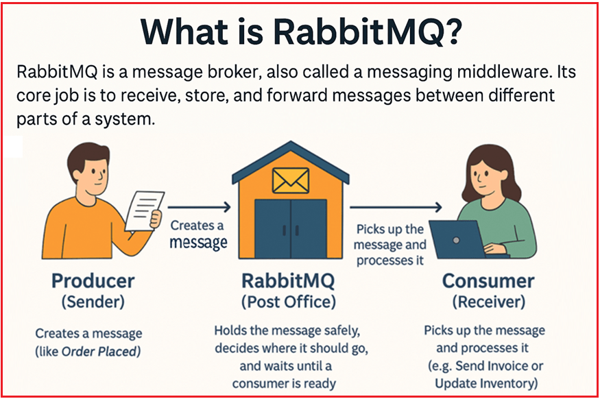
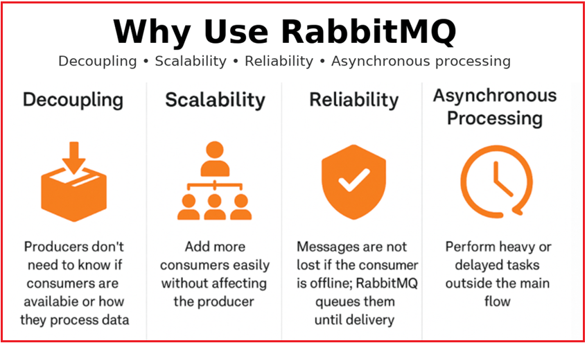
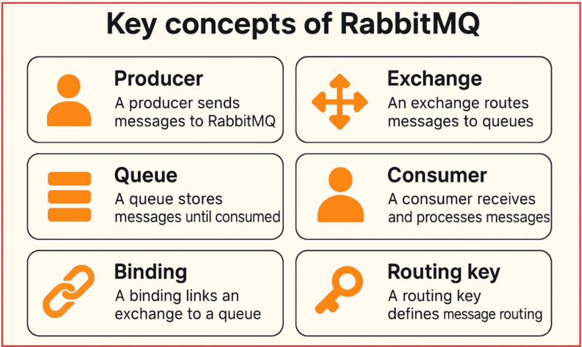
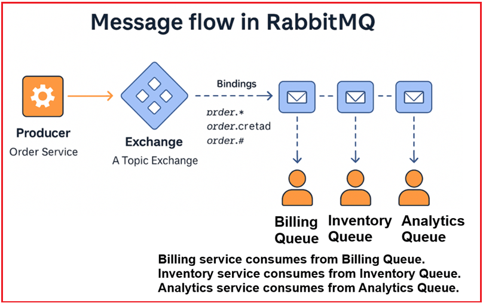

## **مقدمه‌ای بر RabbitMQ برای پیام‌رسانی ناهمگام**

RabbitMQ یک کارگزار پیام متن‌باز است که ارتباط غیرهمزمان بین برنامه‌ها و سرویس‌های مختلف را امکان‌پذیر می‌کند. به جای اینکه یک سرویس مستقیماً سرویس دیگر را فراخوانی کند، RabbitMQ به عنوان واسطه‌ای عمل می‌کند که پیام‌ها را دریافت، ذخیره و ارسال می‌کند. این تضمین می‌کند که سرویس‌ها می‌توانند بدون نگرانی در مورد اینکه آیا طرف مقابل آنلاین است، به اندازه کافی سریع است یا قادر به مدیریت چندین درخواست به طور همزمان است، به طور مستقل کار کنند. RabbitMQ با جدا کردن تولیدکنندگان و مصرف‌کنندگان، سیستم‌ها را قابل اعتمادتر، مقیاس‌پذیرتر و نگهداری آنها را آسان‌تر می‌کند.

##### **RabbitMQ چیست؟**

RabbitMQ یک **کارگزار پیام** است که به آن **میان‌افزار پیام‌رسانی متن‌باز** نیز گفته می‌شود. وظیفه اصلی آن **دریافت، ذخیره و ارسال پیام‌ها** بین بخش‌های مختلف یک سیستم است. به جای اینکه یک سرویس، سرویس دیگر را مستقیماً فراخوانی کند (که باعث وابستگی شدید و احتمال خرابی در صورت از کار افتادن سرویس دیگر می‌شود)، RabbitMQ به عنوان یک **واسطه** عمل می‌کند.

- تولیدکننده **(فرستنده)** پیامی را به RabbitMQ ارسال می‌کند.
- RabbitMQ پیام را در یک صف **ذخیره می‌کند**.
- مصرف‌کننده **(گیرنده)** هر زمان که پیام آماده باشد، آن را دریافت می‌کند.

این رویکرد **از ارتباط غیرهمزمان** پشتیبانی می‌کند، به این معنی که تولیدکننده لازم نیست قبل از ارسال منتظر آماده شدن مصرف‌کننده بماند.

##### **چرا به یک کارگزار پیام نیاز است؟**

در سیستم‌های بزرگ (مانند تجارت الکترونیک، بانکداری، اینترنت اشیا و پلتفرم‌های رسانه‌های اجتماعی)، چندین سرویس مستقل باید با هم کار کنند. ارتباط مستقیم (مثلاً یک سرویس که API سرویس دیگر را به صورت همزمان فراخوانی می‌کند) می‌تواند در صورت وجود موارد زیر مشکلاتی ایجاد کند:

- گیرنده از کار افتاده است.
- گیرنده کند است.
- چندین گیرنده به یک پیام یکسان نیاز دارند.

RabbitMQ **این مشکلات** را با معرفی یک **واسطه‌ی قابل اعتماد** حل می‌کند.

##### **نحوه کار به زبان ساده**

- **تولیدکننده (فرستنده)** → پیامی ایجاد می‌کند (مانند **سفارش ثبت شده**).
- **RabbitMQ (اداره پست)** → پیام را با خیال راحت نگه می‌دارد، تصمیم می‌گیرد که کجا باید برود و منتظر می‌ماند تا یک مصرف‌کننده آماده شود.
- **مصرف‌کننده (گیرنده)** → پیام را دریافت و پردازش می‌کند (مثلاً **ارسال فاکتور** یا **به‌روزرسانی موجودی**).

##### **RabbitMQ به عنوان یک اداره پست (قیاس)**

RabbitMQ را مانند یک **اداره پست** در نظر بگیرید که ارتباط قابل اعتمادی را تضمین می‌کند:

1. **فرستنده نامه‌ای را ارسال می‌کند (تولیدکننده → پیام)**
   - شما یک نامه می‌نویسید و آن را به اداره پست تحویل می‌دهید.
   - به طور مشابه، یک برنامه‌ی تولیدکننده پیامی به RabbitMQ ارسال می‌کند.
2. **اداره پست نامه را ذخیره می‌کند (RabbitMQ → صف)**
   - نامه در صندوق پستی **منتظر می‌ماند** تا زمانی که گیرنده آن را تحویل بگیرد.
   - **RabbitMQ** پیام را در یک صف **ذخیره می‌کند** تا زمانی که مصرف‌کننده‌ای در دسترس قرار گیرد.
3. **گیرنده نامه را جمع‌آوری می‌کند (مصرف‌کننده → پیام را پردازش می‌کند)**
   - گیرنده می‌تواند نامه را هر زمان که بخواهد دریافت کند.
   - به همین ترتیب، مصرف‌کنندگان وقتی آماده باشند، پیام‌ها را دریافت و پردازش می‌کنند.

فرستنده نیازی ندارد بداند که آیا گیرنده در خانه است، با چه سرعتی نامه را خوانده است یا اینکه آیا چندین گیرنده وجود دارد یا خیر؛ **اداره پست تحویل ایمن را تضمین می‌کند.**

##### **چرا از RabbitMQ استفاده کنیم؟**

بیایید بفهمیم که چرا باید از RabbitMQ و مزایای آن استفاده کنیم.

##### **جداسازی**

جداسازی به این معنی است که **سرویس‌های تولیدکننده و مصرف‌کننده نیازی به دانستن یکدیگر ندارند**. تولیدکننده پیامی را ارسال می‌کند و آن را فراموش می‌کند. اهمیتی نمی‌دهد **که چه کسی، چه زمانی یا چگونه پیام را پردازش می‌کند**.

- در سیستم‌های سنتی، اگر سرویس A به سرویس B نیاز داشته باشد، A باید دقیقاً بداند B کجاست، آیا B آنلاین است و B چگونه داده‌ها را پردازش می‌کند. این امر باعث ایجاد اتصال محکم می‌شود.
- با RabbitMQ، یک تولیدکننده فقط یک پیام به RabbitMQ ارسال می‌کند. برایش مهم نیست چه کسی (مصرف‌کننده) آن را پردازش می‌کند، چند مصرف‌کننده وجود دارد یا حتی اینکه آیا آنها موقتاً آفلاین هستند یا خیر.

###### **چرا اهمیت دارد**:

- بین اجزا را تقویت می‌کند **اتصال سست**.
- تشویق می‌کند **توسعه و استقرار مستقل** سرویس‌ها را.
- وابستگی‌ها و پیچیدگی‌ها را کاهش می‌دهد.
- تغییرات در یک سرویس، سرویس دیگر را خراب نمی‌کند.

**قیاس در دنیای واقعی**: مانند **انداختن یک بسته در جعبه پیک**. برای شما مهم نیست که فرد تحویل‌دهنده کیست یا از کدام مسیر استفاده می‌کند. شما فقط بسته را می‌اندازید و اجازه می‌دهید سیستم آن را مدیریت کند.

###### **مثال**:

- یک **سرویس سفارش**، پیام **OrderCreated** را ثبت می‌کند.
- سرویس **ایمیل**، **سرویس صورتحساب** و **سرویس موجودی**، همگی آن را مصرف می‌کنند، بدون اینکه سرویس سفارش از آنها مطلع باشد یا با آنها هماهنگی داشته باشد.

##### **مقیاس‌پذیری**

RabbitMQ شما را قادر می‌سازد تا **مصرف‌کنندگان** (کارگران) بیشتری را برای مدیریت بار افزایش‌یافته **بدون تغییر منطق تولیدکننده** اضافه کنید.

- با افزایش تقاضا، می‌توانید به سادگی مصرف‌کنندگان (کارگران) بیشتری را بدون تغییر تولیدکننده یا خود RabbitMQ اضافه کنید.
- چندین مصرف‌کننده می‌توانند پیام‌ها را از یک صف دریافت کرده و به صورت موازی آنها را پردازش کنند.

###### **چرا اهمیت دارد**:

- با اجرای نمونه‌های بیشتری از یک سرویس مصرفی، به راحتی مقیاس‌پذیر شوید.
- حجم کار بین چندین مصرف‌کننده توزیع می‌شود (مقیاس‌بندی افقی).
- سیستم‌ها را تحت بار زیاد، پاسخگوتر می‌کند.
- این سیستم به راحتی و به طور موثر حجم کاری بالاتر را مدیریت می‌کند.

**قیاس در دنیای واقعی**: یک **مرکز تماس** را تصور کنید: تماس‌های بیشتری دریافت می‌شود؟ آیا می‌توان کارشناسان بیشتری اضافه کرد؟ تماس‌گیرنده (تولیدکننده) نمی‌داند چند کارشناس در دسترس هستند و فقط یک درخواست می‌گذارد.

###### **مثال**:

- یک **سرویس پردازش ویدیو** ۱۰۰۰ درخواست آپلود دریافت می‌کند.
- به جای اینکه یک دستگاه تمام ویدیوها را تبدیل کند، RabbitMQ به شما امکان می‌دهد تا ۱۰ کارگر را فعال کنید که هر کدام پیام‌ها را از صف دریافت کرده و همزمان یک ویدیو را پردازش می‌کنند.

##### **قابلیت اطمینان**

RabbitMQ **تضمین می‌کند که هیچ داده‌ای از دست نرود** با **حفظ پیام‌ها** در صف‌ها، حتی اگر مصرف‌کننده **آفلاین باشد یا از کار افتاده باشد**.

###### **چرا اهمیت دارد**:

- **صف‌های پایدار** → پیام‌ها پس از راه‌اندازی مجدد RabbitMQ دوام می‌آورند.
- **تأییدیه‌ها (ACK)** → تأیید می‌کنند که مصرف‌کنندگان پیام‌ها را با موفقیت پردازش کرده‌اند.
- **صف‌های تلاش مجدد / Dead-letter** → شکست‌ها را به طرز ماهرانه‌ای مدیریت می‌کنند.

**قیاس در دنیای واقعی**: مانند یک **سیستم پست صوتی**، حتی اگر تلفن شما خاموش باشد، پیام‌ها ذخیره می‌شوند تا زمانی که دوباره آنلاین شوید و به آنها گوش دهید.

###### **مثال**:

- یک **سرویس پرداخت** باید پیام «پرداخت دریافت شد» را پردازش کند.
- اگر سرویس برای تعمیر و نگهداری آفلاین باشد، RabbitMQ پیام را در صف نگه می‌دارد و پس از آنلاین شدن مجدد سرویس، آن را ارسال می‌کند و تضمین می‌کند که هیچ داده پرداختی از دست نرود.

##### **پردازش ناهمزمان**

RabbitMQ **از مدیریت پیام‌های ناهمزمان** پشتیبانی می‌کند، به این معنی که **کارهایی که زمان‌بر هستند می‌توانند در پس‌زمینه انجام شوند** و جریان اصلی برنامه را آزاد کنند.

- همه وظایف نباید بلافاصله در جریان اصلی کاربر اجرا شوند، به خصوص آن‌هایی که سنگین، کند یا برای پاسخ فوری غیرحیاتی هستند.
- با قرار دادن آنها در RabbitMQ، سیستم سریع‌تر به کاربر پاسخ می‌دهد در حالی که کار اصلی در پس‌زمینه انجام می‌شود.

###### **چرا اهمیت دارد**:

- عملیات اصلی کاربرپسند را **سریع و پاسخگو** نگه می‌دارد.
- ایده‌آل برای **گردش‌های کاری زمان‌بر** یا **غیر بحرانی**.
- عملکرد و **تجربه کاربری** را بهبود می‌بخشد.

**قیاس در دنیای واقعی**: تصور کنید که در یک رستوران غذا سفارش می‌دهید. سفارش را می‌دهید و به مکالمه خود ادامه می‌دهید. در آشپزخانه منتظر آماده شدن غذا نمی‌مانید؛ این یک فرآیند ناهمزمان است.

###### **مثال**:

- یک کاربر عکس پروفایل آپلود می‌کند.
- به جای تغییر اندازه و ذخیره تصویر به صورت همزمان (که ممکن است زمان ببرد)، سیستم:
  - تصویر را ذخیره می‌کند
  - یک پیام ResizeImage به RabbitMQ ارسال می‌کند.
  - بلافاصله به کاربر پاسخ می‌دهد
  - یک کارگر پس‌زمینه تصویر را پردازش می‌کند و بعداً تأییدیه ارسال می‌کند یا فراداده را به‌روزرسانی می‌کند.

##### **مفاهیم کلیدی RabbitMQ**

بیایید مفاهیم کلیدی مرتبط با RabbitMQ را درک کنیم.

##### **تولیدکننده**

یک **تولیدکننده** بخشی از سیستم شما (معمولاً یک میکروسرویس یا برنامه) است که مسئول **ایجاد و ارسال پیام‌ها** به RabbitMQ است.

- تولیدکننده را به عنوان شخصی در نظر بگیرید که نامه‌ای را می‌نویسد و پست می‌کند. شما نامه را مستقیماً به گیرنده تحویل نمی‌دهید؛ ابتدا آن را به اداره پست تحویل می‌دهید.
- تولیدکننده نیازی ندارد بداند چه کسی یا چه زمانی پیام را می‌خواند، بلکه **آن را به سادگی در RabbitMQ قرار می‌دهد**.
- مسئولیت آن زمانی پایان می‌یابد که پیام به RabbitMQ تحویل داده شود. برایش مهم نیست چه کسی یا چه زمانی پیام را مصرف خواهد کرد.

###### **مثال**

- یک **سیستم تجارت الکترونیک**: وقتی مشتری سفارشی ثبت می‌کند، سرویس سفارش (تولیدکننده) پیامی مانند *«سفارش ایجاد شد»* را به RabbitMQ ارسال می‌کند.
- RabbitMQ تضمین می‌کند که پیام به مصرف‌کننده(گان) صحیح برسد.

##### **مصرف‌کننده**

یک **مصرف‌کننده** بخشی از سیستم شماست که **پیام‌های RabbitMQ را دریافت و پردازش می‌کند**. این بخش پیام را دریافت کرده و کار مفیدی با آن انجام می‌دهد. مصرف‌کننده‌ها می‌توانند برای مقیاس‌پذیری به صورت موازی کار کنند.

- مصرف‌کننده مانند شخصی است که نامه‌ای را از صندوق پستی خود دریافت می‌کند. اداره پست (RabbitMQ) تضمین می‌کند که نامه درست به صندوق پستی او برسد.
- این پیام‌ها را **به صورت غیرهمزمان** پردازش می‌کند، به این معنی که تولیدکننده می‌تواند بدون انتظار به کار خود ادامه دهد.

###### **مثال**:

ادامه روند تجارت الکترونیک:

- یک **سرویس موجودی**، پیام‌های OrderPlaced را برای کسر موجودی مصرف می‌کند.
- یک **سرویس اعلان** از همان پیام برای ارسال ایمیل تأیید استفاده می‌کند.

##### **صف**

صف **(Queue)** یک **بافر موقت** درون **RabbitMQ** است که پیام‌ها تا زمان تحویل به مصرف‌کنندگان در آن ذخیره می‌شوند.

- صف را مانند صندوق پستی جلوی خانه خود در نظر بگیرید. اداره پست نامه‌ها را داخل آن قرار می‌دهد و شما (مصرف‌کننده) در زمان مناسب آنها را برمی‌دارید.
- پیام‌ها به ترتیب رسیدن (FIFO - **اولین ورودی، اولین خروجی**) ذخیره می‌شوند.
- صف‌ها تولیدکننده و مصرف‌کننده را از هم جدا می‌کنند و به آنها اجازه می‌دهند مستقل عمل کنند.

**مثال**: صفی به نام OrderQueue ممکن است تمام سفارش‌های جدید را برای پردازش یکی‌یکی در خود نگه دارد.

**نکته:** **در یک صف واحد، یک پیام فقط به یک مصرف‌کننده تحویل داده می‌شود**، اما با چندین صف متصل به یک تبادل، یک پیام می‌تواند به چندین مصرف‌کننده برسد.

##### **تبادل**

یک تبادل، **کنترل‌کننده ترافیک** در RabbitMQ است. تولیدکننده پیام‌ها را مستقیماً به یک صف ارسال نمی‌کند؛ بلکه آنها را به یک تبادل می‌فرستد. وظیفه تبادل این است که **کلید مسیریابی** روی پیام و **اتصالات** (قوانینی) که می‌شناسد را بررسی کند و سپس تصمیم بگیرد که پیام باید به کدام صف(ها) برود. سپس تبادل **بر اساس موارد زیر تصمیم می‌گیرد که هر پیام را به کجا ارسال کند**:

1. **اتصال‌ها** (قوانینی که تبادلات را به صف‌ها متصل می‌کنند)
2. **کلیدهای مسیریابی** (برچسب‌هایی که توسط تولیدکنندگان به پیام‌ها الصاق می‌شوند)

###### **نکته کلیدی:**

- پیام‌ها را ذخیره نمی‌کند؛ تنها وظیفه‌اش **مسیریابی** آنهاست.
- اگر هیچ قانون تطبیقی وجود نداشته باشد، پیام‌ها می‌توانند یا **نادیده گرفته شوند** یا به یک کنترل‌کننده‌ی خاص «غیرقابل مسیریابی» ارسال شوند.

###### **قیاس در دنیای واقعی: یک مرکز مرتب‌سازی پستی را تصور کنید:**

- نامه خود را در مرکز (Exchange) می‌اندازید.
- مرکز به آدرس (کلید مسیریابی) نگاه می‌کند.
- بر اساس قوانین مسیریابی (Bindings)، نامه شما را به صندوق پستی صحیح (Queue) ارسال می‌کند.
- مرکز مرتب‌سازی **هرگز نامه‌ها را** به‌طور دائم نگه نمی‌دارد؛ فقط آنها را ارسال می‌کند.

##### **انواع صرافی‌ها:**

چهار نوع صرافی وجود دارد که به شرح زیر هستند:

###### **۱. تبادل مستقیم**

- پیام‌ها را به **صف‌هایی هدایت می‌کند که دقیقاً با کلید مسیریابی مطابقت دارند**.
- مثال: **کلید مسیریابی = “PAYMENT.SUCCESS”** → فقط صفی که با **“PAYMENT.SUCCESS”** محدود شده است، پیام را دریافت می‌کند.

###### **۲. تبادل فن‌آوت**

- پیام‌ها را به **تمام صف‌های متصل به آن** هدایت می‌کند.
- کلید مسیریابی **نادیده گرفته می‌شود**.
- مثال: پخش یک اعلان سراسری سیستم مانند «سرور ساعت ۲ بامداد راه‌اندازی مجدد می‌شود» به همه سرویس‌ها.

###### **۳. تبادل موضوع**

- از **تطبیق الگو** در کلیدهای مسیریابی با کاراکترهای جایگزین استفاده می‌کند:
  - \* → **دقیقاً با یک کلمه مطابقت دارد**
  - \# → با **صفر یا چند کلمه مطابقت دارد**
- مثال:
  - صفِ مقید به **user.\*.activity** → با user.login.activity یا user.logout.activity مطابقت دارد.
  - صف با **order.#** → مرتبط می‌شود با order.created، order.updated.payment و غیره.
  - صف با **payment.#** → با payment.success، payment.failed و غیره مطابقت دارد.

###### **۴. تبادل هدرها**

- کلیدهای مسیریابی را کاملاً نادیده می‌گیرد.
- از **هدرها (جفت‌های کلید-مقدار)** در پیام استفاده می‌کند.
- مثال:
  - پیامی با سربرگ‌های {format=pdf, type=report}
  - صفِ متصل به هدرهای {format=pdf, type=report} آن را دریافت می‌کند.

##### **صحافی**

یک اتصال، **قاعده‌ای است که یک تبادل را به یک صف متصل می‌کند**. این اتصال به تبادل می‌گوید که اگر پیامی با یک کلید مسیریابی (یا هدر) خاص وارد شود، آن را در این صف قرار دهد. هر اتصال می‌تواند موارد زیر را مشخص کند:

- یک **کلید مسیریابی** (برای تبادل مستقیم/موضوعی)، یا
- مجموعه‌ای **از سربرگ‌ها** (برای تبادل سربرگ).

به یک **دستورالعمل تحویل در اداره پست** فکر کنید:

- اگر آدرس «اداره امور مالی» است، آن را در صندوق پستی امور مالی بیندازید.
- اگر با عنوان «اطلاعیه فوری» علامت‌گذاری شده است، برای همه بخش‌ها کپی تهیه کنید.

###### **مثال**:

- **صرافی: دایرکت اکسچنج**
- **صف: صف فاکتور**
- **اتصال: کلید مسیریابی = invoice.generated**
- **معنی:** فقط پیام‌هایی که کلید مسیریابی **invoice.generated** دارند به InvoiceQueue تحویل داده می‌شوند.

##### **کلید مسیریابی**

کلید مسیریابی **رشته‌ای است که توسط تولیدکننده به پیام متصل می‌شود**. این «آدرسی» است که مبادله‌کننده برای تصمیم‌گیری در مورد ارسال پیام، آن را می‌خواند.

**تشبیه**: مانند **آدرسی که روی پاکت نوشته شده است**:

- «خانه شماره ۱۲، خیابان فایننس» (آدرس دقیق برای صرافی مستقیم).
- «تمام خانه‌های خیابان فایننس» (الگوی تبادل موضوع).
- «پخش - نادیده گرفتن آدرس» (تبادل فن‌آوت).
- «نحوه رسیدگی ویژه: محرمانه، PDF» (تبادل سربرگ‌ها).

###### **رفتار با انواع تبادل**:

- **تبادل مستقیم** → کلید مسیریابی باید **دقیقاً** با کلید اتصال مطابقت داشته باشد. مثال: key=payment.success → فقط به صفی که با payment.success محدود شده است می‌رود.
- **تبادل خروجی** → کلید مسیریابی **نادیده گرفته** می‌شود. هر صف متصل پیام را دریافت می‌کند.
- **تبادل موضوع** → کلید مسیریابی **با استفاده از \* (یک کلمه) و # (صفر یا چند کلمه) با الگو تطبیق داده** می‌شود. مثال: user.\*.activity با user.login.activity مطابقت دارد اما با user.activity مطابقت ندارد.
- **تبادل سرآیندها** → کلید مسیریابی **استفاده نمی‌شود**؛ در عوض سرآیندها بررسی می‌شوند.

##### **جریان پیام در RabbitMQ**

برای درک بهتر جریان پیام در RabbitMQ، لطفاً به تصویر زیر نگاهی بیندازید.

###### **تولیدکننده → تبادل → [از طریق کلید مسیریابی + اتصالات] → صف → مصرف‌کننده**

- یک **تولیدکننده** پیامی را به یک **صرافی** ارسال می‌کند.
- این **تبادل** از اتصالات و کلیدهای مسیریابی برای تعیین اینکه کدام **صف(ها)** باید پیام را دریافت کنند، استفاده می‌کند.
- یک یا چند **مصرف‌کننده** پیام را از صف دریافت می‌کنند.

##### **مثال: یک سیستم تجارت الکترونیک را تصور کنید:**

1. **تولیدکننده**: سرویس سفارش → پیام «سفارش ثبت شد» را ارسال می‌کند.
2. **تبادل**: یک تبادل موضوعی → به بررسی کلید مسیریابی order.created می‌پردازد.
3. **صحافی‌ها**:
   - صف پرداخت، صف را به ترتیب مقید می‌کند.\* (مطابقت می‌دهد).
   - موجودی صف با order.created (مطابقت‌ها) مقید شده است.
   - تحلیل صف، صف را با order.# (مطابقت می‌دهد) محدود می‌کند.
4. **صف‌ها**: پیام در هر سه صف ذخیره می‌شود.
5. **مصرف‌کنندگان**:
   - سرویس صورتحساب از BillingQueue استفاده می‌کند.
   - سرویس موجودی از InventoryQueue مصرف می‌کند.
   - سرویس Analytics از AnalyticsQueue استفاده می‌کند.

یک رویداد → چندین مصرف‌کننده → پردازش مستقل.

##### **سوالات متداول**

##### **RabbitMQ چیست و چگونه کار می‌کند؟**

RabbitMQ یک **کارگزار پیام متن‌باز** است که **ارتباط ناهمزمان** بین برنامه‌ها، سرویس‌ها یا کامپوننت‌ها را امکان‌پذیر می‌کند.

- یک **تولیدکننده** پیام‌هایی را به یک **صرافی** ارسال می‌کند.
- این **اکسچنج**، قوانین مسیریابی (اتصالات + کلیدهای مسیریابی) را برای ارسال پیام‌ها به **صف‌ها** اعمال می‌کند.
- **مصرف‌کنندگان** پیام‌ها را از صف‌ها دریافت کرده و آنها را پردازش می‌کنند.
- این امر تولیدکنندگان و مصرف‌کنندگان را از هم جدا می‌کند، قابلیت اطمینان را بهبود می‌بخشد و از مقیاس‌پذیری پشتیبانی می‌کند.

**قیاس**: مانند **اداره پست** - فرستنده نامه را می‌اندازد، اداره پست آن را مرتب می‌کند و گیرنده آن را پس از آماده شدن جمع‌آوری می‌کند.

##### **تفاوت بین صف (Queue) و تبادل (Exchange) را در RabbitMQ توضیح دهید.**

- **صف**:
  1. یک **بافر ذخیره‌سازی** که پیام‌ها را تا زمانی که توسط مصرف‌کننده پردازش شوند، نگه می‌دارد.
  2. مانند یک صندوق پستی یا لیست وظایف عمل می‌کند.
- **تبادل**:
  1. یک **مسیریاب** که تصمیم می‌گیرد پیام‌های دریافتی را به کجا ارسال کند.
  2. پیام‌ها را ذخیره نمی‌کند، بلکه آنها را بر اساس **اتصالات** و **کلیدهای مسیریابی** به صف‌ها ارسال می‌کند.

تفاوت کلیدی:

- صف = **جایی که پیام‌ها ذخیره می‌شوند**.
- تبادل = **نحوه‌ی مسیریابی پیام‌ها به صف‌ها**.

##### **انواع صرافی‌ها چیست و چه تفاوتی با هم دارند؟**

RabbitMQ از چهار نوع تبادل پشتیبانی می‌کند:

1. **تبادل مستقیم**
   - مسیرهایی که بر اساس تطابق دقیق کلید مسیریابی تعیین می‌شوند.
   - مثال: کلید «order.created» → فقط به صف‌هایی می‌رود که با «order.created» محدود شده‌اند.
2. **تبادل فنوت**
   - به **تمام صف‌های** متصل به آن، بدون در نظر گرفتن کلیدهای مسیریابی، پخش می‌شود.
   - مثال: اعلان در سطح سیستم.
3. **تبادل موضوع**
   - مسیرهای مبتنی بر **تطبیق الگو** با کاراکترهای جایگزین:
     - \* با یک کلمه مطابقت دارد.
     - \# با صفر یا چند کلمه مطابقت دارد.
   - مثال: کلید «order.payment.success» با «order.#» مطابقت دارد.
4. **تبادل هدرها**
   - از **هدرهای پیام** (جفت‌های کلید-مقدار) به جای کلیدهای مسیریابی استفاده می‌کند.
   - مثال: سرآیند {type=pdf, format=report} به صف‌های منطبق مسیر می‌دهد.

##### **چگونه RabbitMQ به دستیابی به مقیاس‌پذیری در میکروسرویس‌ها کمک می‌کند؟**

- چندین **مصرف‌کننده** می‌توانند از یک صف واحد بخوانند و این امکان **پردازش موازی را** فراهم می‌کند.
- با افزایش بار، می‌توان مصرف‌کنندگان جدید را بدون تغییر تولیدکننده اضافه کرد.
- RabbitMQ به طور خودکار پیام‌ها را بین مصرف‌کنندگانی که به یک صف مشترک متصل هستند، **متعادل می‌کند**.
- تولیدکنندگان از افزایش یا کاهش مصرف‌کنندگان بی‌تأثیر می‌مانند.
- **امکان مقیاس‌پذیری افقی را** فراهم می‌کند: با افزایش ترافیک، بدون اینکه به تولیدکننده آسیبی برسد، کارگران بیشتری را به کار بگیرید.

**مثال**: یک صف پردازش ویدیو می‌تواند به جای ۱ سرویس کارگر، توسط ۱۰ سرویس کارگر اشغال شود و سرعت پردازش را افزایش دهد.

##### **اگر یک مصرف‌کننده هنگام پردازش پیام از کار بیفتد، چه اتفاقی می‌افتد؟**

- RabbitMQ منتظر **تاییدیه مصرف‌کننده (ACK)** می‌ماند.
- اگر مصرف‌کننده **قبل از ارسال ACK** از کار بیفتد:
  - پیام به صف ارسال بازگردانده می‌شود (دوباره در صف قرار می‌گیرد).
  - مصرف‌کننده دیگری می‌تواند بعداً آن را تحویل بگیرد.
- اگر مصرف‌کننده **پس از پردازش، تأیید اعتبار (ACK) کند**، RabbitMQ آن را به‌طور دائم حذف می‌کند.

این تضمین می‌کند که **هیچ پیامی** در هنگام خرابی مصرف‌کننده از بین نمی‌رود.

##### **نقش کلیدهای مسیریابی در RabbitMQ چیست؟**

کلید **مسیریابی**، یک شناسه رشته‌ای است که توسط تولیدکننده به یک پیام متصل می‌شود. **تبادل از آن برای تصمیم‌گیری در مورد اینکه کدام صف(ها)** باید پیام را دریافت کنند، استفاده می‌کند. رفتار آن به نوع تبادل بستگی دارد:

- **تبادل مستقیم** → تطابق دقیق.
- **تبادل موضوع** → تطبیق الگو با کاراکترهای عمومی.
- **تبادل فن‌آوت** → نادیده گرفته شد.
- **تبادل سرآیندها** → استفاده نشده است (در عوض سرآیندها تیک خورده‌اند).

**قیاس**: مانند **آدرس روی پاکت** در سیستم پستی.

##### **صف‌های Dead Letter در RabbitMQ چگونه کار می‌کنند؟**

صف **نامه‌های معوق (DLQ)** یک صف ویژه است که در آن پیام‌ها زمانی که نمی‌توانند پردازش شوند، ارسال می‌شوند.

پیام‌ها می‌توانند به دلایل زیر در DLQ قرار بگیرند:

- توسط مصرف‌کننده **رد** می‌شود.
- **منقضی می‌شود** (TTL از حد مجاز عبور کرده است).
- از **حداکثر تعداد تلاش برای تحویل** فراتر رفته است.

DLQها به توسعه‌دهندگان اجازه می‌دهند پیام‌های ناموفق را تجزیه و تحلیل کرده و مشکلات را برطرف کنند.

**مثال**: یک صف پرداخت، پیام‌های پردازش نشده (مانند درخواست‌های پرداخت نامعتبر) را به Payment\_DLQ ارسال می‌کند.

##### **چگونه از ماندگاری پیام در RabbitMQ اطمینان حاصل می‌کنید؟**

RabbitMQ چندین ویژگی دوام ارائه می‌دهد:

- **صف‌های بادوام**: صف را به عنوان صف بادوام علامت‌گذاری کنید تا در صورت راه‌اندازی مجدد کارگزار، دوام بیاورد.
- **پیام‌های ماندگار**: هر پیام را به عنوان ماندگار علامت‌گذاری کنید تا روی دیسک نوشته شود.
- **تأیید ناشر**: تأیید از RabbitMQ را برای تأیید ماندگاری پیام فعال کنید.

این موارد در کنار هم تضمین می‌کنند که پیام‌ها حتی اگر RabbitMQ از کار بیفتد، از بین نمی‌روند.

##### **آیا RabbitMQ می‌تواند پیام یکسانی را به چندین مصرف‌کننده ارسال کند؟ اگر چنین است، چگونه؟**

بله، از دو جهت:

1. **تبادل خروجی** → پیام یکسانی را به همه صف‌های متصل پخش می‌کند و مصرف‌کنندگان هر صف آن را پردازش می‌کنند.
2. **چندین صف با کلید مسیریابی یکسان به هم متصل شده‌اند** → اگر صف‌های مختلف با یک اتصال یکسان به یک تبادل متصل باشند، همه یک کپی دریافت می‌کنند.

اما در یک **صف واحد**، RabbitMQ تضمین می‌کند که یک پیام فقط به یک مصرف‌کننده تحویل داده شود (متعادل‌سازی بار، نه تکثیر).

RabbitMQ یک واسط پیام‌رسانی قوی، قابل اعتماد و پرکاربرد است که ارتباط غیرهمزمان، جدا و مقیاس‌پذیر بین سرویس‌ها را با استفاده از تولیدکنندگان، صرافی‌ها، صف‌ها و مصرف‌کنندگان امکان‌پذیر می‌کند. چه در حال مدیریت سفارشات در تجارت الکترونیک، پردازش پرداخت‌ها یا ارسال اعلان‌ها باشید، RabbitMQ ارتباط روان و کارآمد بین سرویس‌ها را تضمین می‌کند.