## **دانلود، نصب و پیکربندی RabbitMQ به صورت محلی روی سیستم عامل ویندوز**

RabbitMQ یک کارگزار پیام متن‌باز قدرتمند است که ارتباط قابل اعتماد بین بخش‌های مختلف یک برنامه توزیع‌شده را امکان‌پذیر می‌کند. این کارگزار به عنوان واسطه‌ای برای مدیریت پیام‌ها بین تولیدکنندگان (فرستندگان) و مصرف‌کنندگان (گیرندگان) عمل می‌کند و تضمین می‌کند که حتی اگر یک طرف موقتاً در دسترس نباشد، هیچ پیامی از دست نرود.

برای راه‌اندازی RabbitMQ به صورت محلی روی سیستم عامل ویندوز، دو جزء اساسی مورد نیاز است:

1. **Erlang OTP**، که زمان اجرایی است که RabbitMQ به آن وابسته است.
2. **سرور RabbitMQ**، که خود برنامه‌ی کارگزار است.

اکنون، مراحل گام به گام دانلود، نصب و پیکربندی RabbitMQ در ویندوز برای اهداف توسعه، از جمله فعال کردن داشبورد مدیریت برای دسترسی مبتنی بر مرورگر را بررسی خواهیم کرد.

##### **برای نصب RabbitMQ به چه چیزهایی نیاز داریم و چرا؟**

RabbitMQ با زبان Erlang نوشته شده است، بنابراین ابتدا باید Erlang را نصب کنید. سپس RabbitMQ را نصب کنید که از Erlang برای اجرا و پردازش پیام‌های شما استفاده می‌کند. هر دو ضروری هستند. نسخه Erlang اشتباه = RabbitMQ شروع به کار نمی‌کند. برای **اجرای RabbitMQ به صورت محلی در ویندوز**، باید **دو مؤلفه** را نصب کنید:

##### **ارلانگ OTP (64 بیتی)**

###### **چرا به ارلانگ نیاز داریم؟**

- **RabbitMQ با استفاده از زبان برنامه‌نویسی Erlang ساخته شده است**.
- عملکرد آن به **محیط زمان اجرای ارلانگ** بستگی دارد، درست مانند یک برنامه .NET که به زمان اجرای .NET نیاز دارد، یا یک برنامه جاوا که به محیط زمان اجرای جاوا (JRE) نیاز دارد.

###### **نکات مهم:**

- شما **باید Erlang را قبل از RabbitMQ نصب کنید**.
- همچنین باید **نسخه‌ای را نصب کنید که با نسخه RabbitMQ شما سازگار باشد**.

###### **برای RabbitMQ 4.1.x:**

- از **Erlang OTP 26.x** یا **Erlang OTP 27.x** استفاده کنید.
- **ارلانگ ۲۸ را نصب نکنید** (در حال حاضر پشتیبانی نمی‌شود).

**مرجع:** می‌توانید نمودار سازگاری رسمی RabbitMQ را اینجا بررسی کنید.

##### **سرور RabbitMQ**

###### **این چیست؟**

- این **کارگزار پیام واقعی RabbitMQ** است.
- این سیستم، پیام‌رسانی، صف‌ها، تبادلات، مسیریابی و سایر وظایف مرتبط را مدیریت می‌کند.
- این برنامه به عنوان یک سرویس ویندوز در پس‌زمینه اجرا می‌شود.

###### **روش‌های نصب (یکی را انتخاب کنید):**

- **نصب‌کننده رسمی .exe** (برای مبتدیان توصیه می‌شود)
- نصب با دستور choco (برای کاربران حرفه‌ای که از Chocolatey استفاده می‌کنند)
- قابل حمل .zip (استفاده دستی، برای مبتدیان توصیه نمی‌شود)

##### **دانلود Erlang OTP**

فایل نصب ویندوز ۶۴ بیتی (.exe) را دانلود کنید. لطفاً از صفحه دانلود رسمی Erlang/OTP دیدن کنید.

روی **دکمه‌ی دانلود** **نصب‌کننده‌ی ویندوز** کلیک کنید. لطفاً همانطور که در تصویر زیر نشان داده شده است، من Erlang/OTP 26.2.5.14 را انتخاب کرده‌ام. RabbitMQ در حال حاضر از Erlang 28 پشتیبانی نمی‌کند.

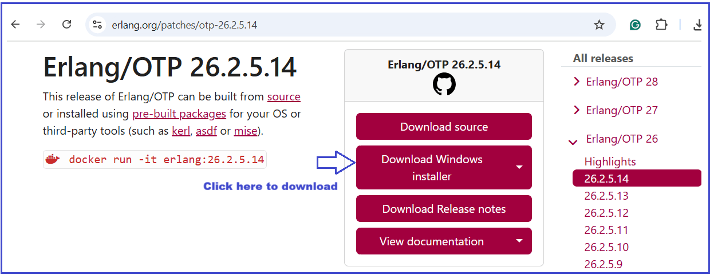

##### **نصب ارلانگ**

حالا، برای شروع نصب، روی فایل .exe دوبار کلیک کنید. پنجره‌ی Choose Component زیر باز می‌شود. لطفاً تمام اجزا را انتخاب کرده و مطابق تصویر زیر روی دکمه‌ی Next کلیک کنید.

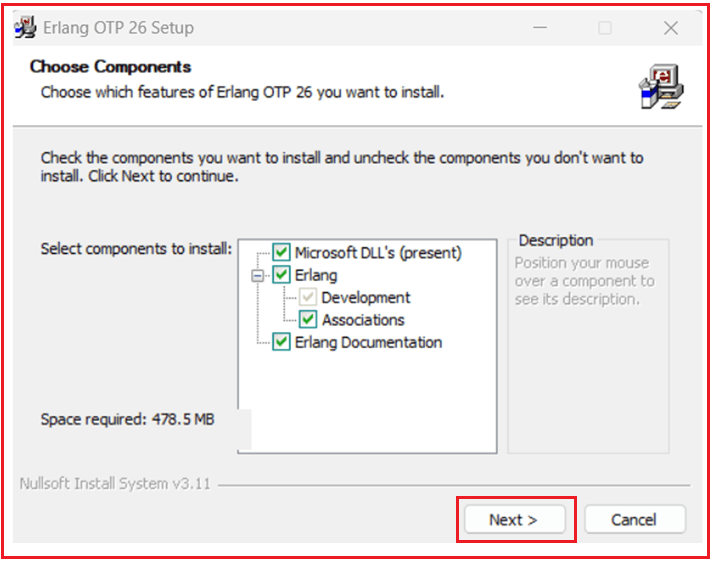

##### **انتخاب محل نصب:**

از پنجره Choose Install Location، مسیر نصب پیش‌فرض (مثلاً C:\\Program Files\\Erlang OTP) را انتخاب کرده و مطابق تصویر زیر، روی Next کلیک کنید.

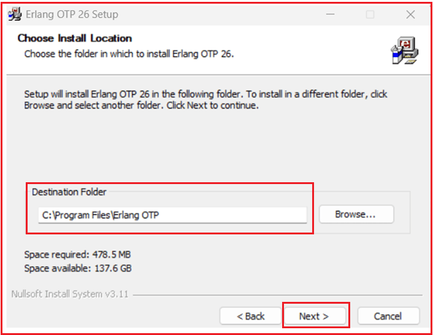

##### **پوشه منوی شروع را انتخاب کنید:**

سپس، پوشه پیش‌فرض منوی استارت را انتخاب کنید و مطابق تصویر زیر، روی دکمه نصب کلیک کنید.

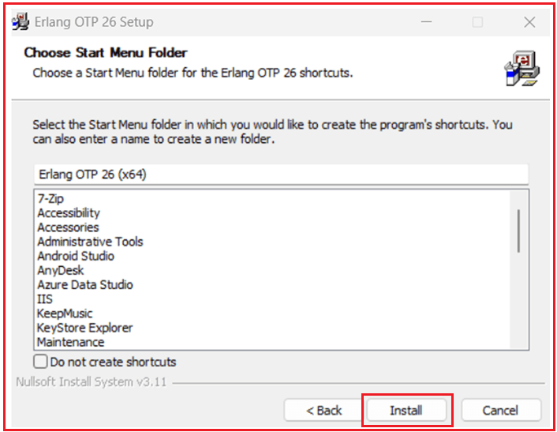

##### **پذیرش مجوز:**

سپس، شرایط و ضوابط مجوز را بپذیرید و مطابق تصویر زیر، روی دکمه نصب کلیک کنید:

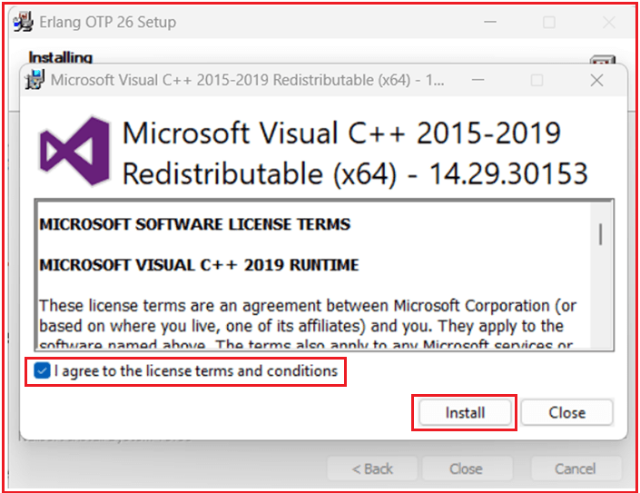

##### **نصب کامل شد:**

پس از اتمام نصب، پیام زیر را دریافت خواهید کرد. کافیست روی دکمه بستن کلیک کنید.

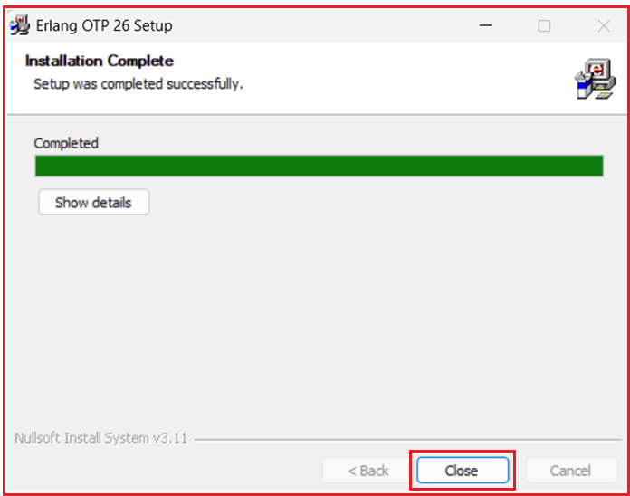

##### **اضافه کردن پوشه bin ارلانگ به مسیر سیستم**

**PATH** یک متغیر محیطی است که مکانی را که ویندوز به دنبال فایل‌های اجرایی می‌گردد، مشخص می‌کند. اگر پوشه bin ارلنگ در PATH نباشد، نمی‌توانید `erl` را از هر ترمینالی تایپ کنید؛ باید هر بار با **cd** به پوشه آن بروید. خود RabbitMQ نیاز دارد که فایل‌های اجرایی ارلنگ قابل شناسایی باشند. این **اجباری** است. اگر در PATH نباشند، ممکن است سرویس RabbitMQ شروع به کار نکند. بنابراین، برای عملکرد صحیح RabbitMQ، این کار ضروری است.

##### **نحوه اضافه کردن Erlang به PATH (ویندوز 10/11)**

**متغیرهای محیطی باز**:

- کلیدهای Win + R را فشار دهید، عبارت `sysdm.cpl` را تایپ کنید و Enter را بزنید.
- به برگه **پیشرفته** بروید.
- روی **متغیرهای محیطی** کلیک کنید.

##### **متغیر مسیر را ویرایش کنید**:

در قسمت **متغیرهای سیستم**، مسیر را پیدا کنید → روی **ویرایش** کلیک کنید، همانطور که در تصویر زیر نشان داده شده است.

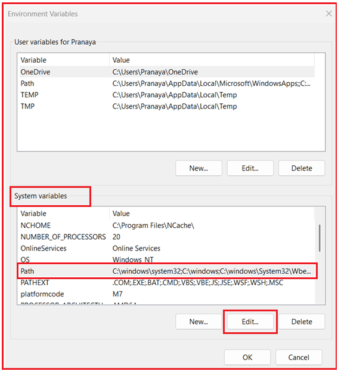

سپس، روی **New** کلیک کنید، مسیر سطل زباله Erlang را در **C:\\Program Files\\Erlang OTP\\bin** قرار دهید و روی دکمه **OK** کلیک کنید تا تغییرات مطابق تصویر زیر ذخیره شوند:

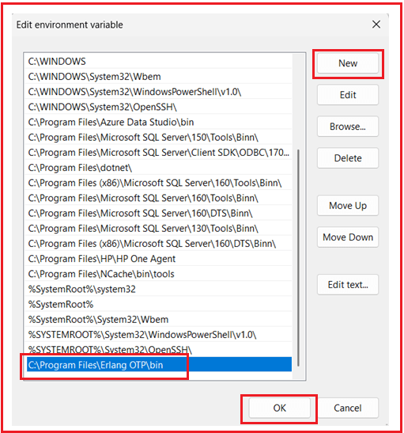

سپس، روی دکمه‌ی OK در پنجره‌ی مربوطه کلیک کنید. پنجره‌های Command Prompt/PowerShell را ببندید و دوباره باز کنید.

##### **تأیید ارلانگ**

پس از نصب، تأیید کنید که Erlang نصب شده است. برای تأیید، **خط فرمان (cmd)** را باز کنید. دستور `erl` را اجرا کنید. اگر به درستی نصب شده باشد، همانطور که در تصویر زیر نشان داده شده است، یک پوسته Erlang را مشاهده خواهید کرد که با `Eshell V...` شروع می‌شود.

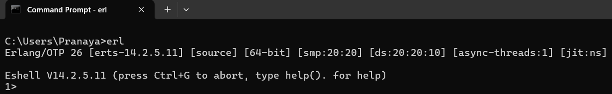

سپس، `q().` را تایپ کنید و برای خروج، Enter را فشار دهید.

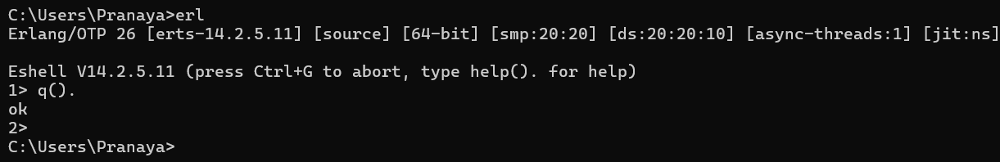

##### **دانلود RabbitMQ برای ویندوز**

به صفحه دانلود رسمی RabbitMQ بروید.

به **بخش نصب ویندوز** بروید.

- چیزی شبیه به این خواهید دید: `rabbitmq-server-4xx.x.exe` (آخرین نسخه)
- فایل نصب .exe را دانلود کنید (ساده‌ترین راه برای ویندوز).

لطفا تصویر زیر را بررسی کنید:

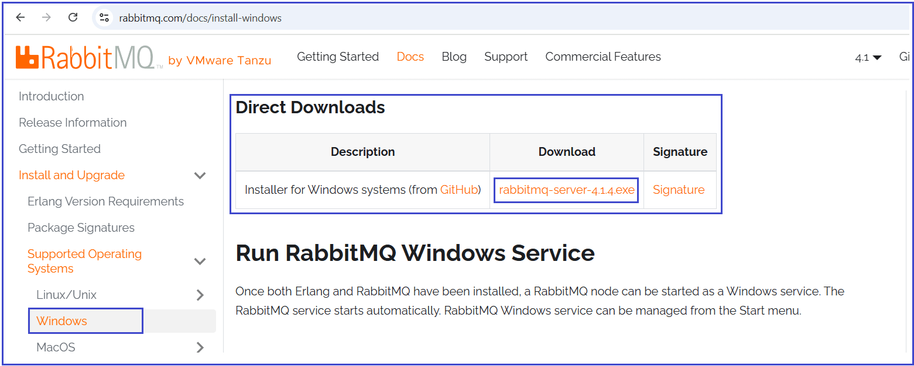

##### **نصب RabbitMQ**

فایل `rabbitmq-server-4.1.4.exe` را اجرا کنید. دستورالعمل‌های نصب را دنبال کنید:

##### **انتخاب اجزا:**

پنجره‌ی «انتخاب اجزا» باز می‌شود. لطفاً تمام اجزا را انتخاب کرده و مطابق تصویر زیر روی دکمه‌ی «بعدی» کلیک کنید:

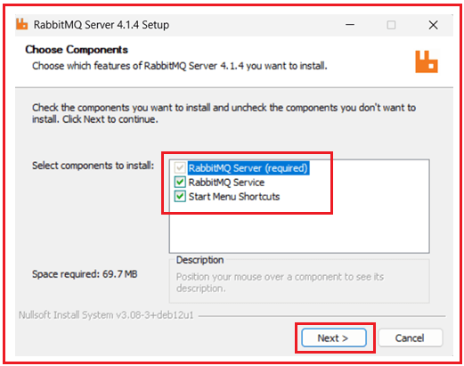

##### **انتخاب محل نصب:**

از پنجره‌ی Choose Install Location، مسیر نصب پیش‌فرض (مثلاً C:\\Program Files\\RabbitMQ Server) را انتخاب کنید و مطابق تصویر زیر، روی دکمه‌ی Next کلیک کنید.

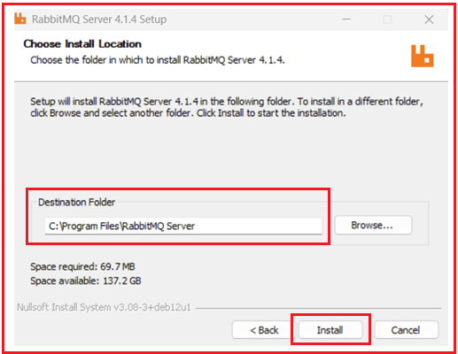

سپس، نصب خواهد شد و پنجره‌ی Installation Complete را مشاهده خواهید کرد، و از اینجا، روی دکمه‌ی Next کلیک کنید.

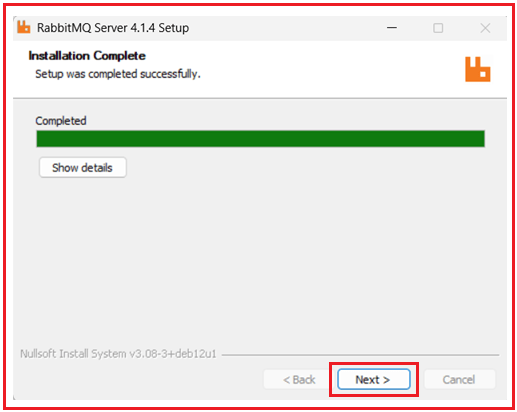

##### **نصب را تمام کنید.**

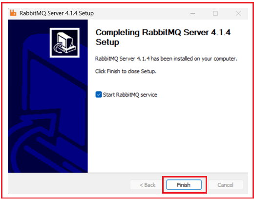

##### **پوشه sbin مربوط به RabbitMQ را به مسیر سیستم اضافه کنید.**

###### **مسیر نصب RabbitMQ را پیدا کنید**

معمولاً، RabbitMQ در مسیر زیر نصب می‌شود: `C:\Program Files\RabbitMQ Server\rabbitmq_server-4.1.4\sbin`

(اگر نسخه دیگری نصب کرده‌اید، نسخه را تنظیم کنید.)

###### **متغیرهای محیطی باز**:

- کلیدهای Win + R را فشار دهید، عبارت `sysdm.cpl` را تایپ کنید و Enter را بزنید.
- به برگه **پیشرفته** بروید.
- روی **متغیرهای محیطی** کلیک کنید.

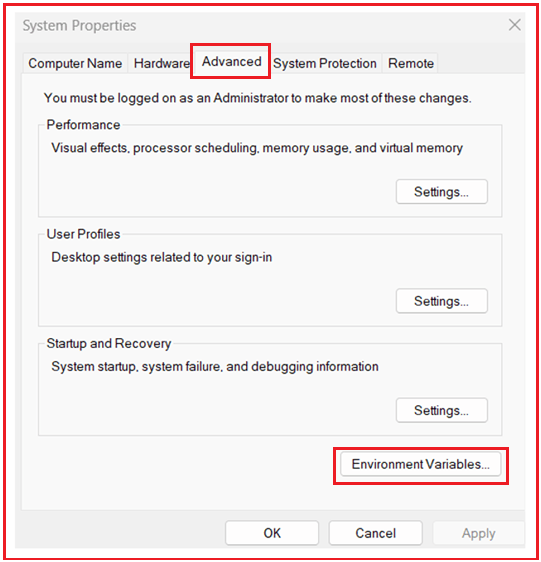

##### **متغیر مسیر را ویرایش کنید**:

در قسمت **متغیرهای سیستم**، مسیر را پیدا کنید → روی **ویرایش** کلیک کنید، همانطور که در تصویر زیر نشان داده شده است.

سپس، روی **New** کلیک کنید، مسیر سطل زباله Erlang را وارد کنید: `C:\Program Files\RabbitMQ Server\rabbitmq_server-4.1.4\sbin`، و روی **دکمه OK** کلیک کنید تا تغییرات همانطور که در تصویر زیر نشان داده شده است، ذخیره شوند:

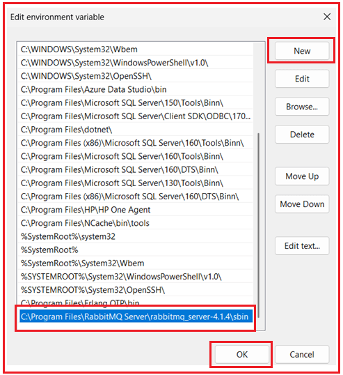

سپس، روی دکمه‌ی OK در پنجره‌ی مربوطه کلیک کنید. پنجره‌های Command Prompt/PowerShell را ببندید و دوباره باز کنید.

##### **سرویس RabbitMQ را شروع کنید**

###### **گزینه الف: استفاده از سرویس‌های ویندوز**

- کلید ترکیبی Win + R را فشار دهید، عبارت `services.msc` را تایپ کنید.
- **RabbitMQ** را در لیست پیدا کنید.
- کلیک راست → شروع.

###### **گزینه ب: استفاده از خط فرمان**

خط فرمان را به عنوان **Administrator** باز کنید، سپس دستور زیر را اجرا کنید: **`net start RabbitMQ`**

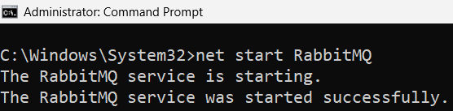

برای متوقف کردن سرویس RabbitMQ، از دستور **`net stop RabbitMQ`** استفاده کنید.

##### **چگونه RabbitMQ را در مرورگر مشاهده کنیم؟**

شما می‌توانید RabbitMQ را در مرورگر خود از طریق **رابط کاربری مدیریتی** مشاهده کنید، اما این ویژگی فقط در صورتی کار می‌کند که افزونه مدیریتی را فعال کنید.

##### **فعال کردن افزونه مدیریت RabbitMQ**

خط فرمان (cmd) را به عنوان **مدیر سیستم** باز کنید. این دستور را اجرا کنید: **`rabbitmq-plugins enable rabbitmq_management`**

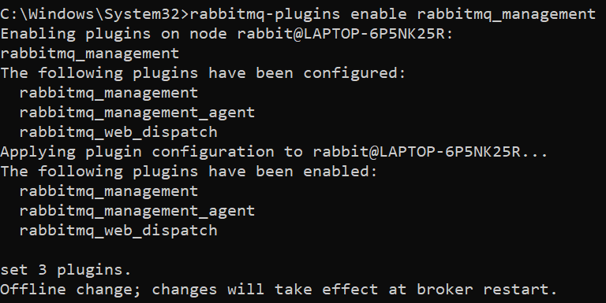

سرویس RabbitMQ را مجدداً راه‌اندازی کنید تا افزونه بارگیری شود:

1. **`net stop RabbitMQ`**
2. **`net start RabbitMQ`**

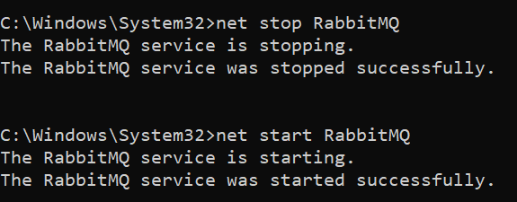

##### **داشبورد RabbitMQ را باز کنید**

- مرورگر خود را باز کنید.
- به آدرس زیر بروید: **`http://localhost:15672`**

این **آدرس پیش‌فرض رابط کاربری مدیریت** است.

##### **ورود**

اعتبارنامه‌های پیش‌فرض:

- **نام کاربری:** `guest`
- **رمز عبور:** `guest`

اینها فقط از طریق **localhost** کار می‌کنند (نه از راه دور).

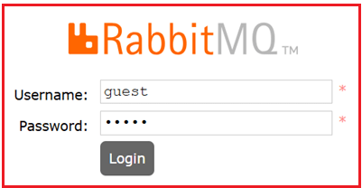

##### **آنچه در رابط کاربری می‌بینید**

پس از ورود، موارد زیر را مشاهده خواهید کرد:

- **برگه نمای کلی** → وضعیت کارگزار، نرخ پیام.
- **اتصالات** → کلاینت‌های متصل.
- **کانال‌ها** → کانال‌های ارتباطی باز.
- **تبادلات** → مسیرهای پیام‌ها.
- **صف‌ها** → فهرست صف‌ها با پیام‌های در انتظار/آماده/تأیید نشده.
- **مدیریت** → مدیریت کاربران، مجوزها و میزبان‌های مجازی.

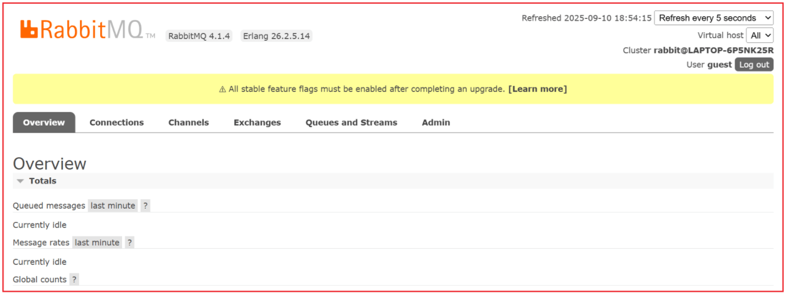

با نصب Erlang/OTP و RabbitMQ Server، اضافه کردن آنها به PATH سیستم و فعال کردن افزونه مدیریت، اکنون یک کارگزار RabbitMQ کاملاً کاربردی داریم که به صورت محلی روی سیستم عامل ویندوز شما اجرا می‌شود.

ما می‌توانیم به داشبورد مدیریت در **آدرس http://localhost:15672** دسترسی پیدا کنیم، تبادلات، صف‌ها و اتصال‌ها را ایجاد کنیم و شروع به آزمایش با تولیدکنندگان و مصرف‌کنندگان کنیم. در جلسه بعدی به این موارد خواهیم پرداخت.

با تکمیل این تنظیمات، ما آماده‌ایم تا RabbitMQ را در پروژه‌های خود، مانند سیستم میکروسرویس‌های تجارت الکترونیک خود، ادغام کنیم و از پیام‌رسانی غیرهمزمان و قابل اعتماد به صورت عملی بهره ببریم.