## **تست سرتاسری RabbitMQ با استفاده از رابط کاربری مدیریت**

در این پست، نحوه انجام تست سرتاسری RabbitMQ با استفاده از رابط کاربری مدیریت را توضیح خواهم داد. لطفاً مقاله قبلی ما را که در مورد نحوه دانلود، نصب و پیکربندی RabbitMQ به صورت محلی در سیستم عامل ویندوز به صورت گام به گام بحث می‌کند، مطالعه کنید.

RabbitMQ یک کارگزار پیام متن‌باز قدرتمند است که به برنامه‌ها اجازه می‌دهد تا از طریق تبادلات، صف‌ها و اتصال‌ها به صورت غیرهمزمان با یکدیگر ارتباط برقرار کنند. در حالی که بسیاری از توسعه‌دهندگان از طریق برنامه‌نویسی با RabbitMQ تعامل دارند، رابط کاربری مدیریت در **http://localhost:15672** روشی بصری برای بررسی مفاهیم اصلی و جریان پیام آن ارائه می‌دهد.

- **مبانی معماری RabbitMQ - تولیدکننده‌ها، تبادل‌ها، صف‌ها، اتصال‌ها، مصرف‌کننده‌ها**
- **نحوه ایجاد صف‌ها و پیکربندی دوام، TTL، حداکثر طول، DLX**
- **نحوه ایجاد تبادلات (مستقیم، موضوعی، خروجی، هدرها) و درک رفتار مسیریابی آنها**
- **نحوه اتصال تبادلات به صف‌ها با استفاده از کلیدها و قوانین مسیریابی**
- **چگونه پیام‌ها را در صرافی‌ها منتشر کنیم؟**
- **نحوه‌ی استفاده از پیام‌ها از طریق رابط کاربری مدیریت و آزمایش رفتارهای ACK/NACK**
- **چه اتفاقی می‌افتد وقتی پیام‌ها غیرقابل مسیریابی هستند و چگونه می‌توان با تبادلات جایگزین آنها را مدیریت کرد؟**
- **نحوه تنظیم تبادل نامه‌های منقضی شده (DLX) برای پیام‌های منقضی شده، رد شده یا سرریز شده**
- **نحوه ایجاد و استفاده از میزبان‌های مجازی (vhosts) برای جداسازی برنامه/محیط**
- **نحوه اختصاص مجوزهای کاربر (پیکربندی، نوشتن، خواندن) با الگوهای مبتنی بر regex**

#### **معماری RabbitMQ**

برای درک بهتر جریان پیام در RabbitMQ، لطفاً به تصویر زیر نگاهی بیندازید.

##### **تولیدکننده → تبادل → [از طریق کلید مسیریابی + اتصالات] → صف → مصرف‌کننده**

- یک **تولیدکننده** پیامی را به یک **صرافی** ارسال می‌کند.
- این **تبادل** از **Bindings و Routing Keys** برای تعیین اینکه کدام **صف (صف‌ها)** باید پیام را دریافت کنند، استفاده می‌کند.
- یک یا چند **مصرف‌کننده** پیام را از صف دریافت می‌کنند.

#### **مرحله ۱: ایجاد یک صف جدید – TestQueue**

##### **صف چیست؟**

صف **(Queue)** یک بافر است که پیام‌ها تا زمان مصرف در آن ذخیره می‌شوند.

- تولیدکنندگان پیام‌ها را ارسال می‌کنند → صف‌ها آنها را نگه می‌دارند → مصرف‌کنندگان آنها را بازیابی می‌کنند.
- صف‌ها **از ترتیب FIFO** (اولین ورودی-اولین خروجی) پشتیبانی می‌کنند.
- پیام‌ها در صف انتظار باقی می‌مانند تا زمانی که یا تأیید و حذف شوند یا منقضی شوند.

##### **مراحل ایجاد صف در رابط کاربری RabbitMQ:**

1. وارد رابط کاربری مدیریت RabbitMQ شوید (http://localhost:15672)
2. به **برگه صف‌ها و جریان‌ها** بروید.
3. روی **افزودن صف جدید** کلیک کنید.
4. فرم را پر کنید:
   - **نام:** TestQueue
   - **دوام:** بادوام (توصیه می‌شود)
   - هر چیز دیگری را به صورت پیش‌فرض بگذارید.
5. روی **افزودن صف** کلیک کنید.

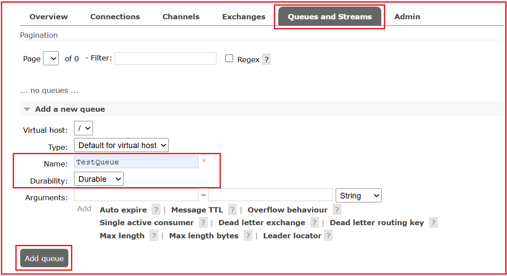

##### **توضیح تنظیمات صف**

- **میزبان مجازی (vhost)** : میزبان مجازی (vhost) یک فضای نام است. می‌توانید آن را به عنوان یک زمینه ایزوله در RabbitMQ در نظر بگیرید. هر میزبان مجازی صف‌ها، تبادلات، اتصالات و غیره خاص خود را دارد. چندین برنامه می‌توانند از میزبان‌های مجازی مختلف برای جلوگیری از تداخل استفاده کنند. این به ایزوله کردن برنامه‌ها (مانند /dev، /prod) کمک می‌کند. پیش‌فرض / است.
- **نوع** : پیاده‌سازی صف. برای آزمایش، «کلاسیک» پیش‌فرض است. انواع رایج:
  1. **کلاسیک** (پیش‌فرض؛ همه منظوره).
  2. **حد نصاب** (تکرار شده، مبتنی بر اجماع، HA؛ ایده‌آل برای دوام).
  3. **استریم** (موارد استفاده استریمینگ فقط-افزودنی با توان عملیاتی بالا).
- **نام** : نام منحصر به فرد صف (مثلاً TestQueue).
- **دوام** :
  1. **صف‌های پایدار** از راه‌اندازی مجدد کارگزار جان سالم به در می‌برند (فراداده‌ها حفظ می‌شوند).
  2. **صف‌های گذرا** از راه‌اندازی مجدد جان سالم به در نمی‌برند.
- **آرگومان‌ها** : رفتارهای پیشرفته اختیاری، برای مثال:
  - x-message-ttl (پیام‌ها پس از N میلی‌ثانیه منقضی می‌شوند)
  - x-expires (حذف خودکار **صف** پس از N میلی‌ثانیه عدم فعالیت)
  - x-max-length / x-max-length-bytes (اندازه حروف بزرگ)
  - تبادل نامه‌های منقضی‌شده/ردشده (به کجا ارسال شود)
  - x-queue-mode=lazy (پیام‌ها را روی دیسک ذخیره کنید تا RAM کمتری مصرف شود)

##### **انواع صف با مثال ساده:**

1. **کلاسیک:** یک پیشخوان تحویل غذا در یک رستوران را در نظر بگیرید. سفارش‌ها (پیام‌ها) روی پیشخوان قرار می‌گیرند و به محض اینکه تحویل‌دهنده (مصرف‌کننده) آنها را تحویل می‌گیرد، دیگر وجود ندارند. هیچ چیز برای بعد نگه داشته نمی‌شود. این یک سیستم ساده‌ی عبور کالا است که در آن اقلام تا زمان جمع‌آوری منتظر می‌مانند.
2. **Quorum:** مانند ذخیره فایل‌ها در گوگل درایو. اگرچه شما فقط یک کپی می‌بینید، گوگل چندین کپی را در سرورهای مختلف نگهداری می‌کند. اگر یک سرور از کار بیفتد، فایل شما ایمن و قابل بازیابی از سرور دیگر باقی می‌ماند و قابلیت اطمینان را با کمی تلاش بیشتر فراهم می‌کند.
3. **پخش زنده:** مانند پخش آنلاین یک فیلم در نتفلیکس. می‌توانید شروع به تماشای زنده کنید، به ابتدا برگردید یا همان محتوا را چند روز بعد دوباره تماشا کنید، در حالی که دیگران با سرعت خودشان تماشا می‌کنند. ضبط در دسترس می‌ماند تا چندین نفر بتوانند آن را به طور مستقل مشاهده کنند.

#### **مرحله ۲: ایجاد یک Exchange جدید – TestExchange (نوع: direct)**

##### **صرافی چیست؟**

یک **Exchange** یک موتور مسیریابی است که پیام‌ها را از یک **تولیدکننده (ناشر)** دریافت می‌کند و بر اساس نوع Exchange ( **مستقیم، خروجی، موضوع، سرآیندها** )، **کلید مسیریابی و قوانین اتصال** تعیین می‌کند که پیام‌ها را به کدام صف(ها) ارسال کند.

- تولیدکنندگان هرگز مستقیماً به صف‌ها ارسال نمی‌کنند.
- تولیدکنندگان پیام‌هایی را به صرافی‌ها ارسال می‌کنند که آنها را بر اساس قوانین (نوع صرافی، اتصالات و کلیدها) به صف‌ها هدایت می‌کنند.

##### **مثال تبادل مستقیم:**

**تبادلات مستقیم** زمانی ایده‌آل هستند که شما **مسیریابی دقیق پیام** را می‌خواهید. پیام‌ها فقط در صورتی به صف‌ها تحویل داده می‌شوند **که کلید مسیریابی دقیقاً با** کلید اتصال صف مطابقت داشته باشد. از این مورد زمانی استفاده کنید که هر پیام برای یک صف خاص در نظر گرفته شده است.

##### **مراحل ایجاد یک Exchange در رابط کاربری RabbitMQ:**

1. به **برگه صرافی‌ها** بروید.
2. روی **افزودن صرافی جدید** کلیک کنید.
3. فرم را پر کنید:
   - **نام:** TestExchange
   - **نوع:** مستقیم
   - **دوام:** بادوام
   - سایر گزینه‌ها را بدون تیک بگذارید.
4. روی **افزودن صرافی** کلیک کنید.

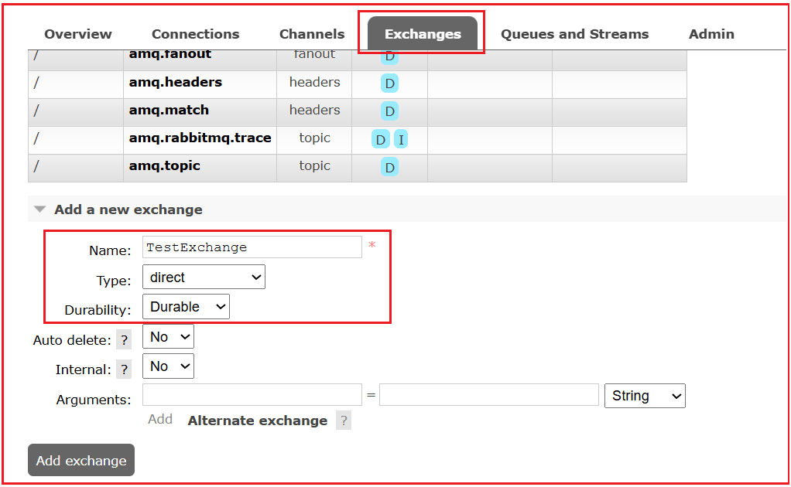

##### **توضیح فیلدهای تبادلی**

- **نام** : نام منحصر به فرد صرافی (مثلاً TestExchange).
- **نوع** : **رفتار مسیریابی** را تعریف می‌کند:
  1. **مستقیم:** پیام‌ها را با یک **کاملاً منطبق به صف‌ها هدایت می‌کند.** کلید مسیریابی
  2. **fanout:** به **تمام صف‌های محدود** ارسال می‌کند، کلید مسیریابی را نادیده می‌گیرد.
  3. **موضوع:** مسیریابی با استفاده از تطبیق الگو (\* و # کاراکترهای جایگزین).
  4. **هدرها:** مسیرهایی که از مقادیر هدر استفاده می‌کنند.
- **دوام** : پایدار یا گذرا. دوام با راه‌اندازی مجدد دوام می‌آورد، گذرا نه.
- **حذف خودکار** : وقتی هیچ صفی به تبادل متصل نباشد، آن را حذف می‌کند.
- **داخلی** : فقط توسط RabbitMQ استفاده می‌شود؛ برای انتشار خارجی مناسب نیست. این بدان معناست که اگر علامت زده شود، فقط سایر صرافی‌ها می‌توانند در این صرافی منتشر کنند. معمولاً این گزینه را **بدون علامت** نگه دارید.
- **آرگومان‌ها** : پیکربندی‌های پیشرفته مانند تبادلات جایگزین، TTL و غیره. در صورت نیاز، خالی بگذارید.

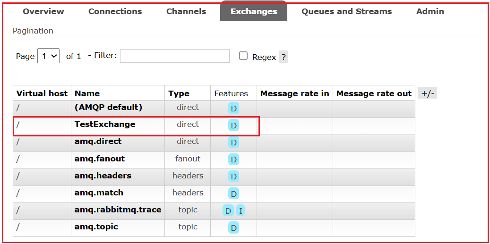

##### **ویژگی‌ها (D)، نرخ ورودی پیام، نرخ خروجی پیام چیست؟**

- **ویژگی‌ها (D)** → نشان می‌دهد که آیا مبادله بادوام است یا خیر (D).
- **نرخ پیام در** → چند پیام در ثانیه در صرافی منتشر می‌شود؟
- **نرخ ارسال پیام** → چند پیام به صف‌ها ارسال می‌شوند؟
- **ویژگی‌ها (I)** → **پرچم I** به معنی **داخلی بودن تبادل است**.

#### **مرحله 3: ایجاد یک اتصال از Exchange → Queue**

##### **صحافی چیست؟**

یک اتصال، قاعده‌ای است که یک تبادل را به یک صف متصل می‌کند و به صورت اختیاری شامل یک **کلید مسیریابی** (برای **مستقیم/موضوعی** **تبادلات** ) یا یک **تطابق سرآیند** (برای تبادلات سرآیند ) است. این قاعده‌ای است که **نحوه مسیریابی پیام‌ها** را تعریف می‌کند. بدون یک اتصال، پیام‌ها جایی برای رفتن ندارند.

##### **مراحل ایجاد یک اتصال در رابط کاربری RabbitMQ:**

روی TestExchange کلیک کنید تا صفحه جزئیات TestExchange باز شود.

1. به **بخش اتصال‌ها** بروید.
2. در قسمت **Bind to** ، موارد زیر را پر کنید:
   - **صف:** TestQueue
   - **کلید مسیریابی:** test
3. روی **Bind** کلیک کنید.

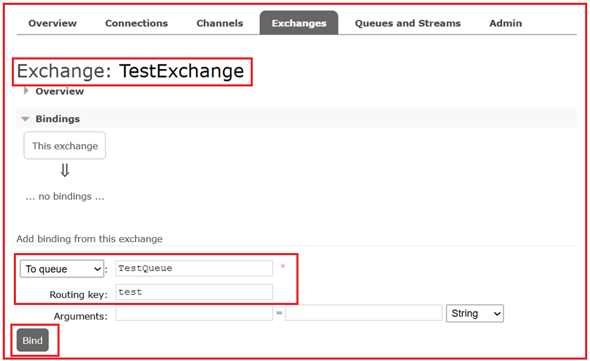

##### **پارامترهای اتصال:**

- **به صف** : کدام صف برای اتصال (مثلاً TestQueue).
- **کلید مسیریابی** : رشته‌ای که توسط تبادلات مستقیم/موضوعی برای تطبیق پیام‌ها (مثلاً test) استفاده می‌شود.
- **آرگومان‌ها** : معمولاً برای دایرکت/موضوع خالی هستند. آن‌ها برای تبادل هدر مهم هستند.

اکنون این اتصال را مشاهده خواهید کرد: **TestExchange —[test]→ TestQueue.** این اجازه می‌دهد تا پیام‌های منتشر شده با **کلید مسیریابی test** به TestQueue تحویل داده شوند. بدون اتصال، تبادل نمی‌تواند پیام‌ها را به صف تحویل دهد.

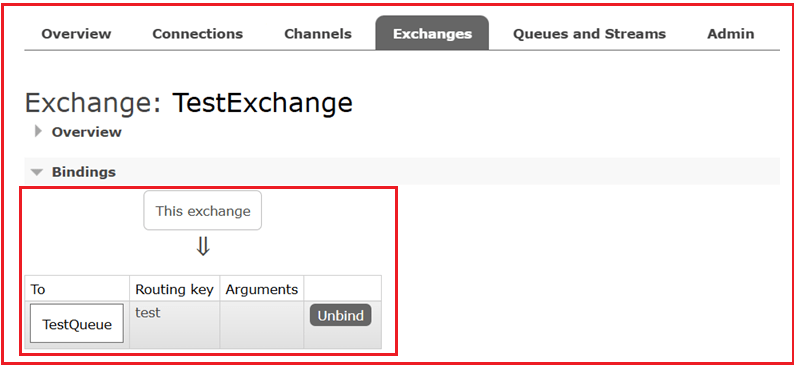

#### **مرحله ۴: انتشار پیام در صرافی**

##### **«انتشار پیام» به چه معناست؟**

این به معنای **ارسال یک پیام** (با هدرها و فراداده‌های اختیاری) به یک تبادل با **کلید مسیریابی** است. تبادل آن را بر اساس اتصالات به یک صف منطبق هدایت می‌کند.

##### **مراحل انتشار پیام به یک Exchange در RabbitMQ**

1. در صفحه TestExchange، به پایین اسکرول کنید تا به **گزینه Publish message برسید.**
2. فرم را پر کنید:
   - **کلید مسیریابی:** test *(باید دقیقاً با کلید اتصال مطابقت داشته باشد)*
   - **بار مفید:** مثلاً، سلام RabbitMQ!
   - (اختیاری) ملک را به حال خود رها کنید.
3. روی **انتشار پیام** کلیک کنید.

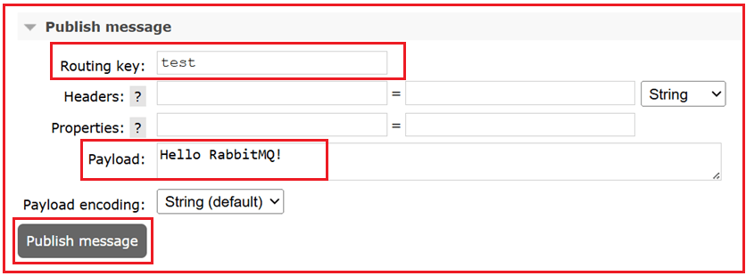

##### **فیلدهای فرم انتشار پیام**

- **کلید مسیریابی:** برچسبی که برای مسیریابی استفاده می‌شود. در **تبادلات مستقیم** ، باید دقیقاً با یک کلید اتصال (مثلاً test) مطابقت داشته باشد.
- **هدرها:** فراداده‌های کلید-مقدار سفارشی. عمدتاً با **تبادل هدر** برای مسیریابی استفاده می‌شود، اما برای منطق برنامه شما نیز مفید است.
- **خواص:** نمونه‌های خواص استاندارد شامل موارد زیر است:
  - نوع\_محتوا (برنامه/json، متن/ساده)، کدگذاری\_محتوا (gzip و غیره)
  - حالت تحویل: **۱** (غیرپایدار) یا **۲** (پایدار)
  - اولویت (0-9)، انقضا (TTL برای هر پیام)، مهر زمانی و غیره.
- **بار مفید:** بدنه اصلی پیام.
- **کدگذاری بار مفید:** به رابط کاربری نحوه نمایش/کدگذاری بدنه را نشان می‌دهد؛ «خودکار» برای اکثر تست‌ها مناسب است.

پس از کلیک روی **«انتشار پیام** »، رابط کاربری عبارت «پیام منتشر شد» را تأیید می‌کند.

#### **مرحله ۵: دریافت پیام از صف (به عنوان مصرف‌کننده عمل کنید)**

در RabbitMQ، گزینه « **دریافت پیام»** در رابط کاربری مدیریت، **روشی دستی برای دریافت پیام‌ها** از یک صف است. معمولاً برنامه‌ها (مصرف‌کنندگان) به RabbitMQ متصل می‌شوند و از طریق یک اشتراک، پیوسته منتظر پیام‌های جدید هستند. با این حال، در رابط کاربری، شما یک مصرف‌کننده در حال اجرا ندارید؛ در عوض، می‌توانید پیام‌ها را به صورت دستی و با کلیک روی **«دریافت پیام(ها)»** دریافت کنید.

##### **مراحل خواندن پیام از صف:**

به **برگه صف‌ها و جریان‌ها** → روی TestQueue کلیک کنید.

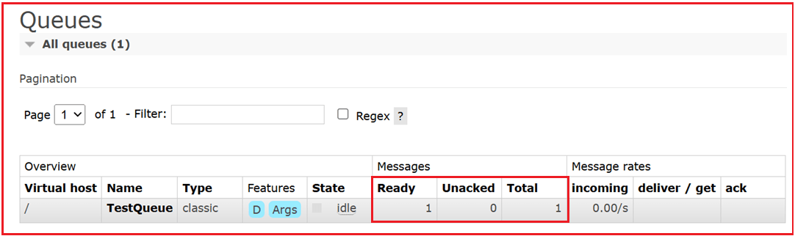

##### **جزئیات پنل صف:**

- **نوع** : نوع صف (کلاسیک، حد نصاب، جریان).
- **وضعیت** : در حال اجرا یا بیکار.
- **آماده** : پیام‌های آماده برای تحویل.
- **پیام‌های تاییدنشده** : پیام‌هایی که قبلاً به مصرف‌کنندگان تحویل داده شده‌اند اما هنوز تایید نشده‌اند.
- **مجموع** : مجموع آماده و تایید نشده.
- **نرخ پیام** : نرخ انتشار/تحویل/تایید برای این صف. این نرخ‌ها به شما کمک می‌کنند تا حجم‌های انباشته (آماده↑) یا مصرف‌کنندگان گیر کرده (عدم تایید همچنان بالا است) را تشخیص دهید.

##### **مراحل دریافت پیام‌ها در RabbitMQ:**

برای **دریافت پیام‌ها به پایین اسکرول کنید.**

1. گزینه‌ها را تنظیم کنید:
   - **حالت تأیید:** پیام تأیید (توصیه می‌شود)
   - **تعداد پیام‌ها:** ۱
   - **رمزگذاری:** خودکار
2. روی **دریافت پیام(ها)** کلیک کنید.

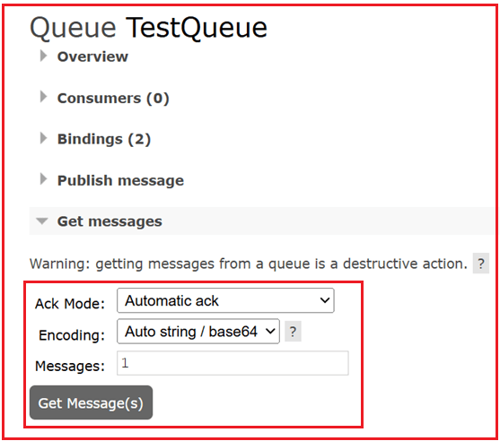

##### **فرم دریافت پیام‌ها**

- **حالت تایید:**
  1. **تأیید خودکار** → پیام فوراً حذف شد.
  2. **ناک requeue true** → پیام رد شد اما به صف بازگشت.
  3. **رد درخواست درست** → پیام رد شد، دوباره در صف قرار گرفت (مانند ناک برای یک پیام).
  4. **رد درخواست نادرست** → پیام رد شد، کنار گذاشته شد (یا به DLX ارسال شد).
- **تعداد پیام‌ها:** چه تعداد پیام باید دریافت شود.
- **کدگذاری:** نحوه نمایش بدنه.

##### **حالت‌های ACK/NACK در RabbitMQ**

###### **ACK (تصدیق)**

- معنی: «این پیام را با موفقیت پردازش کردم، آن را از صف دریافت حذف کنید.»
- پس از ارسال ACK، پیام به طور دائم حذف می‌شود (در صورت عدم پیکربندی DLX).
- اگر یک مصرف‌کننده قبل از دریافت ACK از کار بیفتد، RabbitMQ پیام را دوباره در صف انتظار قرار می‌دهد (با فرض اینکه autoAck=false باشد).

###### **ناک (تصدیق منفی)**

- معنی: «من نتوانستم این پیام را پردازش کنم.»
- می‌تواند با requeue true/false استفاده شود:
  1. **صف انتظار درست است:** پیام برای ارسال مجدد به صف ارسال می‌شود.
  2. **درخواست نادرست:** پیام حذف می‌شود (یا در صورت پیکربندی به DLX ارسال می‌شود).

##### **برای دریافت، روی دریافت پیام(ها) کلیک کنید.**

موارد زیر را مشاهده خواهید کرد:

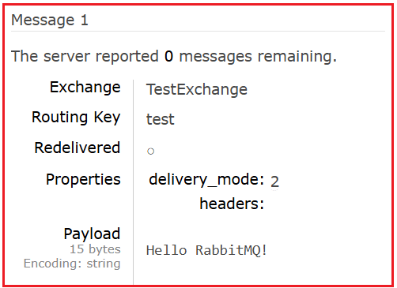

##### **ویژگی‌های پیام**

وقتی روی **«دریافت پیام‌ها»** در یک صف کلیک می‌کنید، RabbitMQ نه تنها **محتوای** پیام، بلکه فراداده‌های مربوط به آن را نیز نمایش می‌دهد. در اینجا معنی هر فیلد آمده است:

###### **تبادل**

- نام صرافی **که** این پیام را به صف ارسال کرده است.
- اگر پیام از طریق **تبادل پیش‌فرض** (رشته خالی "") آمده باشد، فیلد "" را نشان می‌دهد.
- این نشان دهنده محل مبدا پیام در داخل کارگزار است.

###### **کلید مسیریابی**

- کلید **مسیریابی** مورد استفاده هنگام انتشار پیام.
- تعیین می‌کند که پیام به کدام صف(ها) مسیریابی شده است (برای تبادل مستقیم/موضوع).
- در صورت استفاده از **تبادل خروجی** ، کلید مسیریابی نادیده گرفته می‌شود اما همچنان در فراداده نمایش داده می‌شود.

###### **تحویل مجدد**

- **درست** → پیام قبلاً تحویل داده شده بود، اما مصرف‌کننده آن را تأیید نکرد. RabbitMQ **آن را دوباره درخواست کرد** و دوباره تحویل داد.
- **نادرست** → پیام برای اولین بار ارسال می‌شود.

##### **ویژگی‌ها / حالت تحویل**

این **سطح ماندگاری** پیام را تعریف می‌کند:

- **۱: گذرا**
  - پیام فقط در حافظه باقی می‌ماند.
  - اگر RabbitMQ دوباره راه‌اندازی شود یا از کار بیفتد، از دست می‌رود.
  - بهترین گزینه برای حجم کاری سریع و غیر بحرانی (مثلاً پیام‌های لاگ).
- **۲: مداوم**
  - پیام روی دیسک نوشته می‌شود (اگر خود صف بادوام باشد).
  - از راه‌اندازی مجدد کارگزار جان سالم به در می‌برد.
  - برای کارهای مهم مانند سفارش‌ها، پرداخت‌ها و تراکنش‌ها بهترین گزینه است.

##### **نکته‌ای در مورد پیش‌فرض‌ها در رابط کاربری مدیریت**

وقتی پیامی را از طریق رابط کاربری مدیریت RabbitMQ (http://localhost:15672) منتشر می‌کنید:

1. اگر صراحتاً هیچ ویژگی پیامی را تنظیم نکنید، RabbitMQ به‌طور خودکار مقادیر پیش‌فرض را تعیین می‌کند و به‌طور پیش‌فرض، ناشر رابط کاربری **delivery_mode=2 (persistent)** را تنظیم می‌کند.
2. به همین دلیل است که ممکن است در پیام‌های آزمایشی خود عبارت delivery_mode=2 را ببینید، **حتی اگر آن را به صورت دستی تنظیم نکرده باشید**.
3. برای سیستم‌های عملیاتی، بهتر است **برای جلوگیری از ابهام ، delivery_mode را به طور صریح تنظیم کنید**.

###### **سربرگ‌ها**

- جفت‌های کلید-مقدار فراداده که در حین انتشار پیوست شده‌اند.
- برخلاف ویژگی‌ها (که فیلدهای ثابتی هستند)، هدرها کاملاً **قابل تنظیم** هستند.
- اغلب در **تبادلات هدر** (تصمیمات مسیریابی بر اساس مقادیر هدر) استفاده می‌شود.

##### **دوام در مقابل پایداری**

در RabbitMQ، **دوام** و **پایداری** با هم کار می‌کنند اما یکسان نیستند:

###### **صف بادوام**

- صف **پایدار** به این معنی است که **تعریف صف** (نام، نوع، آرگومان‌های آن) در دیسک ذخیره می‌شود.
- اگر RabbitMQ دوباره راه‌اندازی شود، خود صف **هنوز وجود دارد**.
- اما اگر پیام‌های داخل آن به صورت مداوم علامت‌گذاری نشده باشند، از بین خواهند **رفت**.

###### **پیام ماندگار**

- یک **پیام پایدار** (که توسط delivery_mode=2 تنظیم شده است) قبل از اینکه RabbitMQ آن را تأیید کند، روی دیسک نوشته می‌شود.
- اگر RabbitMQ دوباره راه‌اندازی شود، آن پیام **می‌تواند بازیابی شود**.
- با این حال، اگر صفی که آن را در خود نگه داشته، بادوام نباشد، خود صف پس از راه‌اندازی مجدد وجود نخواهد داشت و پیام نیز از بین می‌رود.

تنها زمانی که **هر دو شرط برقرار باشند،** می‌توانید به RabbitMQ برای جلوگیری از خرابی‌ها/راه‌اندازی‌های مجدد بدون از دست دادن پیام‌ها تکیه کنید.

##### **جریان پیام تأیید شد!**

ناشر → TestExchange (مستقیم) → TestQueue → مصرف‌کننده دستی (دریافت پیام)

اگر همه چیز درست کار کند، RabbitMQ موارد زیر را دارد:

- پیام را در صف **ذخیره کرد**
- در صورت درخواست دستی، آن را **تحویل داد**
- **آن را تأیید کردم** (از صف حذف شد)

##### **چگونه یک تبادل یا صف را ویرایش کنیم؟**

در **RabbitMQ** ، **تبادل‌ها و صف‌ها پس از ایجاد قابل ویرایش نیستند**. این یک **محدودیت طراحی** در معماری RabbitMQ است تا **ثبات و سازگاری مسیریابی پیام** تضمین شود.

##### **مسیریابی مبتنی بر الگو با استفاده از تبادل موضوع:**

**تبادلات موضوعی** زمانی ایده‌آل هستند که شما **به مسیریابی انعطاف‌پذیر و مبتنی بر الگو** با استفاده از wildcardها نیاز دارید. این روش معمولاً برای **سیستم‌های ثبت وقایع (log)، رویدادهای منطقه‌ای یا معماری‌های ماژولار** استفاده می‌شود، جایی که چندین صف باید از الگوهایی مانند log.\* یا order.# پیروی کنند.

##### **مرحله ۱: ایجاد یک تبادل موضوع**

1. به **برگه صرافی‌ها** بروید.
2. روی **افزودن صرافی جدید** کلیک کنید.
3. فرم را پر کنید:
   - **نام:** PatternExchange
   - **نوع:** موضوع
   - **دوام:** (پایدار)
   - سایر کادرهای انتخاب را **بدون علامت** بگذارید.
4. روی **افزودن صرافی** کلیک کنید.

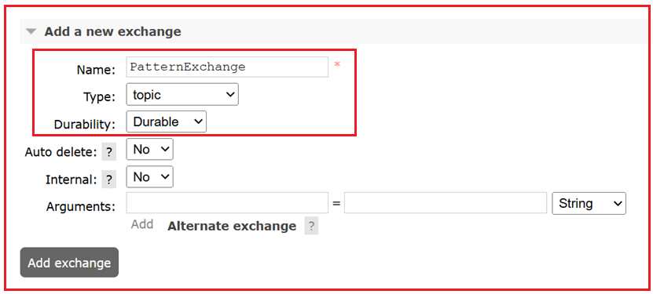

تبادل موضوع، پیام‌ها را به صف‌هایی هدایت می‌کند که کلیدهای اتصال آنها با **الگوی کلید مسیریابی** مطابقت دارد.

##### **مرحله ۲: ایجاد صف‌ها**

ما دو صف نمونه ایجاد خواهیم کرد:

###### **صف ۱: ErrorQueue**

1. به **برگه صف‌ها و جریان‌ها** بروید.
2. روی **افزودن صف جدید** کلیک کنید.
3. فرم را پر کنید:
   - **نام:** ErrorQueue
   - **دوام:** **بادوام**
4. روی **افزودن صف** کلیک کنید.

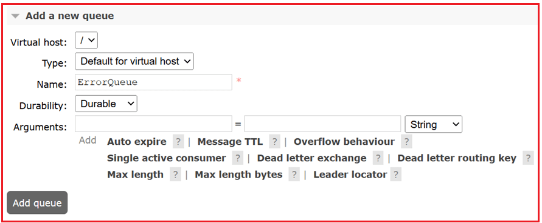

##### **صف ۲: AllLogsQueue**

تکرار موارد بالا:

- **نام:** AllLogsQueue
- **دوام:** **بادوام**

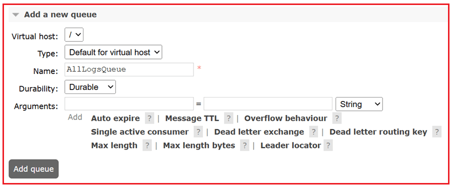

##### **مرحله 3: اتصال صف‌ها با الگوها به Exchange**

حالا هر صف را با یک الگوی مسیریابی به PatternExchange متصل کنید.

##### **اتصال ErrorQueue به PatternExchange**

1. به **برگه Exchanges** بروید → روی PatternExchange کلیک کنید.
2. به پایین اسکرول کنید تا به **بخش Bindings** برسید → در زیر بخش **«Bind to»** ، موارد زیر را وارد کنید:
   - **به صف:** ErrorQueue
   - **کلید مسیریابی:** log.error *(مطابقت دقیق)*
3. روی **Bind** کلیک کنید.

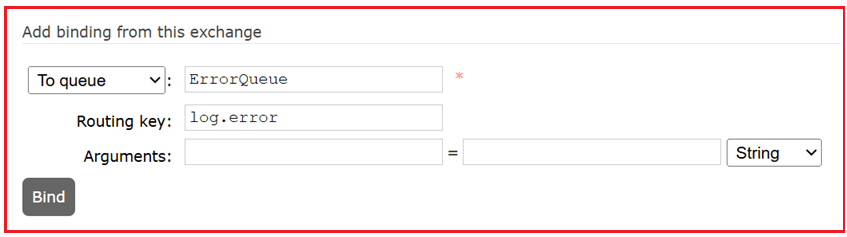

این صف فقط پیام‌هایی را دریافت می‌کند که کلید مسیریابی آنها log.error باشد.

##### **اتصال AllLogsQueue با الگوی wildcard**

1. در **PatternExchange** بمانید.
2. دوباره، در قسمت **«Bind to»** ، موارد زیر را وارد کنید:
   - **به صف:** AllLogsQueue
   - **کلید مسیریابی:** log.\* *(تطبیق با کاراکترهای جایگزین)*
3. روی **Bind** کلیک کنید.

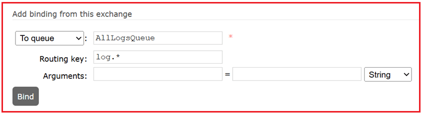

این صف **هر پیامی را** که کلید مسیریابی آن با log شروع شود و **یک کلمه** بعد از آن داشته باشد (مثلاً log.info، log.error، log.warn) دریافت خواهد کرد.

##### **مرحله ۴: انتشار پیام‌ها برای آزمایش مسیریابی**

1. در صفحه PatternExchange → به **انتشار پیام** بروید.
2. فرم را پر کنید:
   - **کلید مسیریابی:** log.error
   - **بار مفید:** خطایی رخ داد
3. روی **انتشار پیام** کلیک کنید.

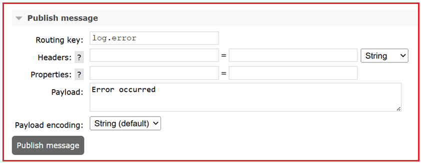

**حالا برو به:**

- **ErrorQueue** → روی **دریافت پیام‌ها** کلیک کنید → پیام را مشاهده خواهید کرد.
- **AllLogsQueue** → روی **Get Messages** کلیک کنید → شما نیز همین پیام را مشاهده خواهید کرد.

پیام به **هر دو صف** ارسال شد زیرا log.error با هر دو مطابقت دارد:

- log.error تطابق دقیق
- الگوی log.\*

##### **یک تست دیگر را امتحان کنید:**

**کلید مسیریابی:** log.info
**بار مفید:** گزارش اطلاعات

→ فقط AllLogsQueue آن را دریافت خواهد کرد
→ ErrorQueue **نخواهد کرد** آن را دریافت

**توجه:** پس از اتمام آزمایش، صف‌ها و تبادل را از برگه‌های مربوطه حذف کنید.

#### **مسیریابی مبتنی بر هدر با استفاده از تبادل هدر:**

**تبادلات هدر** زمانی ایده‌آل هستند که قوانین مسیریابی **مبتنی بر فراداده** به جای کلیدهای مسیریابی ثابت باشند. هدرها منطق مسیریابی پیچیده و چند شرطی را فعال می‌کنند و آنها را برای سیستم‌های بزرگی که تصمیمات مسیریابی به ویژگی‌های پیام مانند برنامه، محیط یا منطقه بستگی دارد، مناسب می‌کنند.

بنابراین، یک **تبادل هدر** ایجاد کنید، **صف‌ها را** با شرایط هدر خاص (مانند app=mobile) پیوست کنید و پیام‌ها را با هدرها منتشر کنید تا بر اساس آن مسیریابی شوند.

##### **مرحله 1: ایجاد یک تبادل هدر**

1. به **برگه صرافی‌ها** بروید.
2. روی **افزودن صرافی جدید** کلیک کنید.
3. فرم را پر کنید:
   - **نام:** HeadersExchange
   - **نوع:** سربرگ‌ها
   - **دوام:** بادوام
   - سایر کادرهای انتخاب را **بدون علامت بگذارید**
4. روی **افزودن صرافی** کلیک کنید.

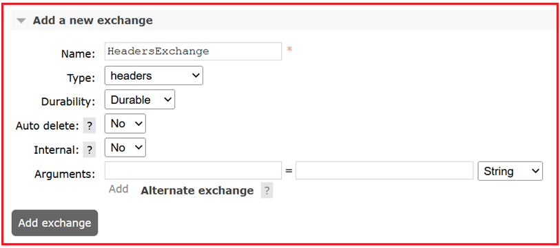

تبادل هدر، پیام‌ها را **بر اساس هدرهای پیام**، و نه کلیدهای مسیریابی، مسیریابی می‌کند.

##### **مرحله ۲: ایجاد صف‌ها**

بیایید دو صف نمونه ایجاد کنیم.

##### **صف ۱: MobileQueue**

1. به **برگه صف‌ها و جریان‌ها** بروید.
2. روی **«افزودن صف جدید»** کلیک کنید.
3. فرم را پر کنید:
   - **نام:** MobileQueue
   - **دوام:** بادوام
4. روی **افزودن صف** کلیک کنید.

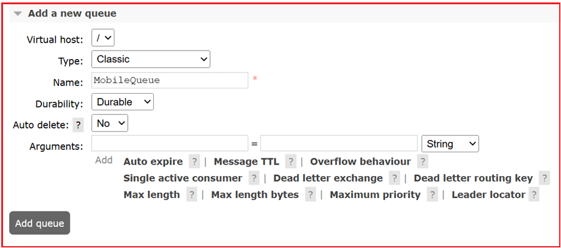

##### **صف ۲: WebQueue**

تکرار:

- **نام:** WebQueue
- **دوام:** بادوام

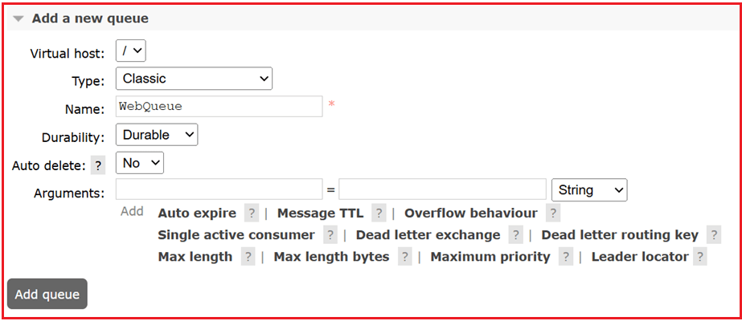

##### **مرحله ۳: اتصال صف‌ها به تبادل هدرها با استفاده از شرایط هدر**

حالا هر صف را با استفاده از قوانین تطبیق هدر به HeadersExchange متصل کنید.

##### **اتصال MobileQueue با هدر app=mobile**

1. به **برگه Exchanges** بروید → روی HeadersExchange کلیک کنید.
2. به **بخش اتصال‌ها** بروید.
3. زیر عنوان **Bind to** :
   - **صف:** MobileQueue
   - **کلید مسیریابی:** (خالی بگذارید - در تبادل هدرها استفاده نمی‌شود)
   - روی **+افزودن آرگومان** کلیک کنید.
     - کلید: app → مقدار: mobile
     - کلید: x-match → مقدار: all (مطابقت بدون حساسیت به حروف بزرگ و کوچک)
4. روی **Bind** کلیک کنید.

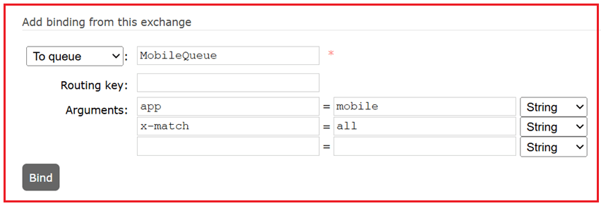

این یک قانون ایجاد می‌کند: فقط پیام‌هایی که **سربرگ آن‌ها app=mobile** باشد به MobileQueue ارسال می‌شوند.

##### **اتصال WebQueue با هدر app=web**

1. مراحل بالا را تکرار کنید.
2. برای **صف:** WebQueue را انتخاب کنید.
3. آرگومان‌ها:
   - app → web
   - x-match → all
4. روی **Bind** کلیک کنید.

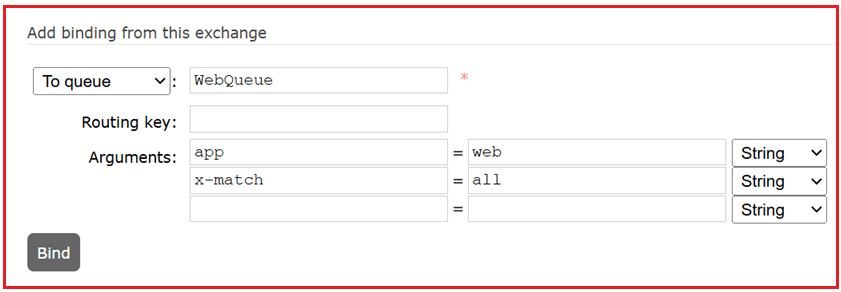

##### **درک تطابق x**

- all: همه هدرها باید دقیقاً مطابقت داشته باشند
- any: حداقل یک هدر باید مطابقت داشته باشد

**مثال:** اگر x-match را برابر با any و headers را برابر با app=mobile و env=prod قرار دهید، پیامی که شامل هر یک از این موارد باشد، مسیریابی خواهد شد.

##### **مرحله ۴: انتشار پیام‌ها با سربرگ‌ها**

1. به صفحه HeadersExchange بروید.
2. به **انتشار پیام** بروید.
3. فرم را پر کنید:
   - **کلید مسیریابی:** (خالی بگذارید - توسط تبادل هدرها نادیده گرفته می‌شود)
   - **سربرگ‌ها:**
     - کلید: app → مقدار: mobile
   - **بار مفید:** پیام برای برنامه تلفن همراه
4. روی **انتشار پیام** کلیک کنید.

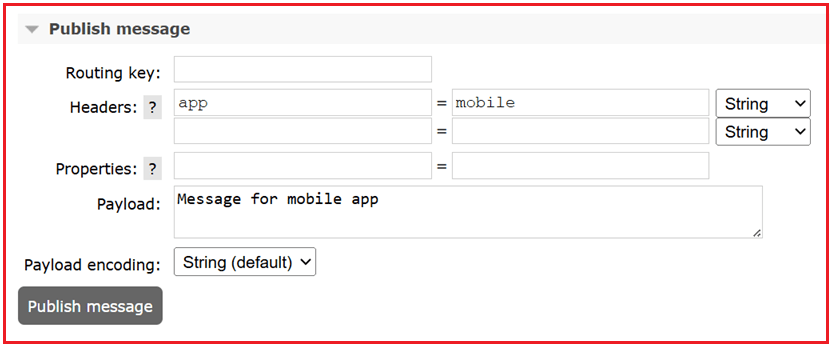

##### **مرحله ۵: دریافت پیام‌ها از صف‌ها**

**به MobileQueue بروید:**

- روی **دریافت پیام‌ها** کلیک کنید.
- باید پیام را ببینید.

**به WebQueue بروید:**

- روی **دریافت پیام‌ها** کلیک کنید.
- هیچ پیامی نباید وجود داشته باشد (هدرها مطابقت نداشتند).

**یک تست دیگر را امتحان کنید:**

- پیام دیگری با این عنوان منتشر کنید:
  - سربرگ: app=web
  - بار مفید: پیام برای برنامه وب

فقط WebQueue آن را دریافت خواهد کرد.

#### **ایجاد تبادل Fanout و الصاق صف‌ها**

**تبادلات Fanout** زمانی بهترین گزینه هستند که می‌خواهید **پیامی را به تمام صف‌های علاقه‌مند ارسال کنید**. تبادلات Fanout کلیدهای مسیریابی را به طور کامل نادیده می‌گیرند و برای **هشدارها، گزارش‌ها یا سیستم‌های اعلان بلادرنگ** که در آن‌ها هر مشترک باید پیام را دریافت کند، ایده‌آل هستند. این تبادلات **کلیدهای مسیریابی را به طور کامل نادیده می‌گیرند** و **هر پیام را به تمام صف‌های متصل به آن ارسال می‌کنند**.

ما یک تبادل Fanout ایجاد خواهیم کرد، چندین صف را پیوست می‌کنیم و پیام‌ها را منتشر می‌کنیم. هر صف محدود، **هر** پیام منتشر شده را، **صرف نظر از کلید مسیریابی** دریافت خواهد کرد.

##### **مرحله 1: ایجاد یک تبادل Fanout**

1. به **برگه صرافی‌ها** بروید.
2. روی **افزودن صرافی جدید** کلیک کنید.
3. فرم را پر کنید:
   - **نام:** FanoutExchange
   - **نوع:** خروجی فن
   - **دوام:** بادوام
   - سایر کادرهای انتخاب را **بدون علامت بگذارید**
4. روی **افزودن صرافی** کلیک کنید.

**Fanout** پیام‌های پخش را به **تمام صف‌های محدود** مبادله می‌کند و کلیدهای مسیریابی را نادیده می‌گیرد.

##### **مرحله ۲: ایجاد صف‌ها**

ما دو صف برای آزمایش رفتار پخش ایجاد خواهیم کرد.

##### **صف ۱: EmailQueue**

1. به **برگه صف‌ها و جریان‌ها** بروید.
2. روی **افزودن صف جدید** کلیک کنید.
3. فرم را پر کنید:
   - **نام:** EmailQueue
   - **دوام:** بادوام
4. روی **افزودن صف** کلیک کنید.

##### **صف ۲: SMSQueue**

تکرار موارد بالا:

- **نام:** SMSQueue
- **دوام:** بادوام

##### **مرحله 3: اتصال صف‌ها به تبادل Fanout**

تبادل Fanout **کلیدهای مسیریابی را نادیده می‌گیرد**، بنابراین آن را خالی بگذارید.

##### **اتصال EmailQueue به FanoutExchange**

1. به **Exchanges** بروید → روی FanoutExchange کلیک کنید.
2. به **بخش اتصال‌ها** بروید.
3. زیر عنوان **Bind to** :
   - **صف:** EmailQueue
   - **کلید مسیریابی:** (خالی بگذارید!)
4. روی **Bind** کلیک کنید.

##### **اتصال SMSQueue به FanoutExchange**

تکرار:

- **صف:** SMSQueue
- **کلید مسیریابی:** (خالی بگذارید)
- روی **Bind** کلیک کنید.

اکنون هر دو صف به FanoutExchange متصل شده‌اند.

##### **مرحله ۴: انتشار پیام**

1. در صفحه FanoutExchange بمانید.
2. به **انتشار پیام** بروید.
3. فرم را پر کنید:
   - **کلید مسیریابی:** (خالی بگذارید - در هر صورت نادیده گرفته می‌شود)
   - **بار مفید:** مثلاً، سلام به همه مشترکین!
4. روی **انتشار پیام** کلیک کنید.

خواهید دید: پیام منتشر شد.

##### **مرحله ۵: تأیید تحویل به هر دو صف**

###### **بررسی EmailQueue**

- به برگه صف‌ها بروید → روی EmailQueue کلیک کنید.
- روی **دریافت پیام** کلیک کنید.
- حجم بار را خواهید دید.

###### **بررسی SMSQueue**

- موارد بالا را تکرار کنید → همان پیام را خواهید دید.

همه صف‌های متصل، پیام را دریافت کردند!

##### **چرا فانوت مفید است؟**

از تبادل فن‌آوت در موارد زیر استفاده کنید:

- شما می‌خواهید پیام‌ها را برای **همه مشترکین** پخش کنید.
- شما نیازی به فیلتر کردن بر اساس کلیدهای مسیریابی ندارید.
- برای **گزارش‌ها، اعلان‌ها و داشبوردهای بلادرنگ** مفید است.

##### **چه اتفاقی برای پیامی که بدون هیچ اتصالی در یک صرافی منتشر می‌شود، می‌افتد؟**

**اگر Exchange هیچ Binding نداشته باشد (و هیچ Exchange جایگزینی پیکربندی نشده باشد):**

- RabbitMQ **پیام را بی‌صدا ارسال می‌کند**.
- توی هیچ صفی نمی‌رود **،** چون جایی برای تحویلش نیست.
- هیچ خطایی به ناشر برگردانده نمی‌شود، مگر اینکه صریحاً درخواست کنید.

**اگر ناشر از پرچم اجباری استفاده کند:**

- پروتکل AMQP یک **پرچم اجباری** در هنگام انتشار دارد.
- اگر **Mandatory = True را تنظیم کنید** : هنگام انتشار،
  - اگر پیام **نتواند به هیچ صفی مسیریابی شود** ، RabbitMQ **آن را از طریق یک تابع فراخوانی basic.return به ناشر برمی‌گرداند** (به جای اینکه به طور مخفیانه آن را حذف کند).
  - اگر اجباری = نادرست (پیش‌فرض)، پیام بدون هیچ اطلاعی حذف می‌شود.

رابط کاربری مدیریت، **پرچم اجباری را نمایش نمی‌دهد** ، بنابراین در تست رابط کاربری، اگر هیچ اتصالی وجود نداشته باشد، همیشه رفتار «قطع بی‌صدا» را مشاهده خواهید کرد.

##### **چرا این مهم است؟**

- بدون اتصال یا یک **تبادل جایگزین (AE)** ، کلیدهای مسیریابی نادرست پیکربندی شده یا اشتباه تایپ شده باعث **از دست رفتن پیام** می‌شوند.
- به همین دلیل است که یک **AE یا پرچم اجباری** در تولید مهم است:
  - **AE** → پیام‌های غیرقابل مسیریابی را به‌طور خودکار به یک صف نامه‌های از رده خارج «catch-all» تغییر مسیر می‌دهد.
  - **پرچم اجباری** → به ناشر اطلاع می‌دهد که پیامی قابل ارسال نیست.

##### **AMQP (پروتکل پیشرفته صف‌بندی پیام) چیست؟**

AMQP مخفف عبارت **Advanced Message Queuing Protocol** است. این یک **پروتکل لایه کاربردی استاندارد باز** برای میان‌افزار پیام‌محور است. آن را به عنوان «زبانی» در نظر بگیرید که سیستم‌های پیام‌رسان (مانند RabbitMQ) برای تبادل مطمئن داده‌ها بین تولیدکنندگان و مصرف‌کنندگان از آن استفاده می‌کنند.

##### **مثالی برای درک صرافی جایگزین**

یک **تبادل جایگزین (AE)** یک **مسیر جایگزین** برای پیام‌هایی است که **به دلایل زیر قابل تحویل نیستند**:

- صرافی **هیچ اتصال تطبیقی ندارد**، یا
- کلید **مسیریابی با هیچ یک از مقادیر اتصال مطابقت نداشت**.

RabbitMQ به جای حذف چنین پیام‌هایی، **آنها را به AE ارسال می‌کند**.

##### **مرحله ۱: ایجاد صرافی جایگزین (AE)**

این همان **مرکز تبادلی است که پیام‌های غیرقابل مسیریابی را دریافت خواهد کرد**.

1. به **صرافی‌ها** → روی **افزودن صرافی جدید** کلیک کنید.
2. فرم را پر کنید:
   - **نام** : UnroutableExchange
   - **نوع** : fanout *(بنابراین صرف نظر از کلید مسیریابی، به تمام صف‌های محدود ارسال می‌شود)*
   - **دوام** : بادوام
3. روی **افزودن صرافی** کلیک کنید.

##### **مرحله ۲: ایجاد صف برای صرافی جایگزین**

1. به **صف‌ها و جریان‌ها** → روی **افزودن صف جدید** کلیک کنید.
2. فرم را پر کنید:
   - **نام** : UnroutableQueue
   - **دوام** : بادوام
3. روی **افزودن صف** کلیک کنید.
4. حالا این صف را به UnroutableExchange **متصل کنید**:
   - به **Exchanges** بروید → روی UnroutableExchange کلیک کنید.
   - به **بخش اتصال‌ها** بروید.
   - با استفاده از کلید Routing **UnroutableQueue** را متصل کنید: (خالی بگذارید) → روی **Bind کلیک کنید**.

اکنون، هر پیامی که به این مرکز تبادل ارسال شود، به صف غیرقابل مسیریابی (UnroutableQueue) می‌رود.

##### **مرحله ۳: ایجاد یک اکسچنج اصلی با پیکربندی یک اکسچنج جایگزین**

این تبادل اصلی **بدون هیچ گونه اتصالی** است، به طوری که می‌توانیم مسیریابی پیام را مجبور به شکست کنیم و شاهد بازگشت به حالت اولیه باشیم.

1. به **صرافی‌ها** → روی **افزودن صرافی جدید** کلیک کنید.
2. فرم را پر کنید:
   - **نام** : MainExchangeWithAE
   - **نوع** : مستقیم
   - **دوام** : بادوام
   - **آرگومان‌ها** :
     - کلید: alternate-exchange
     - مقدار: UnroutableExchange
3. روی **افزودن صرافی** کلیک کنید.

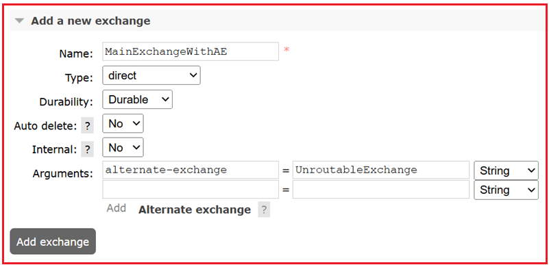

این، MainExchangeWithAE را به عنوان **مبادله‌ی جایگزین** به UnroutableExchange متصل می‌کند.

##### **مرحله ۴: هیچ صفی را به MainExchangeWithAE متصل نکنید**

ما می‌خواهیم پیام **غیرقابل مسیریابی** باشد، بنابراین این **کار عمدی** است.

##### **مرحله ۵: انتشار پیامی با کلید مسیریابی (که با هیچ چیز مطابقت ندارد)**

1. به **Exchanges** بروید → روی MainExchangeWithAE کلیک کنید.
2. به پایین اسکرول کنید تا **به انتشار پیام برسید**.
3. فرم را پر کنید:
   - **کلید مسیریابی** : nonexistent.key
   - **بار مفید** : سلام تست AE!
4. روی **انتشار پیام** کلیک کنید.

پیام **به تبادل جایگزین هدایت** می‌شود زیرا MainExchangeWithAE **هیچ اتصالی** ندارد، بنابراین نمی‌تواند آن را مستقیماً هدایت کند.

##### **مرحله ۶: دریافت پیام از صف جایگزین**

1. به **صف‌ها و جریان‌ها** → روی UnroutableQueue کلیک کنید.
2. به **دریافت پیام‌ها** بروید.
3. انتخاب کنید:
   - **حالت تأیید** : تأیید خودکار
   - **تعداد پیام‌ها** : ۱
   - **رمزگذاری** : خودکار
4. روی **دریافت پیام(ها)** کلیک کنید.

اکنون پیام "سلام تست AE!" را مشاهده خواهید کرد، حتی اگر تبادل اصلی **هیچ اتصالی** نداشته باشد.

**نکته:** RabbitMQ معمولاً **پیام‌های غیرقابل مسیریابی را بی‌صدا حذف می‌کند**. با استفاده از یک **Alternate Exchange** ، می‌توانید **چنین پیام‌هایی را دریافت و ثبت کنید**. این قابلیت در سیستم‌های عملیاتی برای تشخیص پیکربندی‌های نادرست، صف‌های مرده یا اشکالات سمت کلاینت بسیار مفید است.

##### **مثالی برای درک تبادل نامه‌های معوق (DLX)**

تبادل **نامه‌های معوق (DLX)** یک تبادل ویژه است که پیام‌هایی را که **نمی‌توانند به طور معمول تحویل داده شوند،** دریافت می‌کند. پیام‌ها *به نامه‌های معوق تبدیل می‌شوند* در این موارد:

- پیامی **رد شده** (NACK) و دوباره درخواست نشده است.
- پیام **منقضی می‌شود** (TTL از حد مجاز عبور کرده است).
- یک صف به **حداکثر طول یا حداکثر اندازه** خود می‌رسد.

به جای اینکه این پیام‌ها را بی‌سروصدا حذف کند، RabbitMQ می‌تواند آنها را برای ثبت وقایع، تلاش مجدد یا تجزیه و تحلیل به یک DLX ارسال کند.

اکنون، یک صف اصلی ایجاد می‌کنیم که حروف مرده را در یک DLX + DLQ قرار می‌دهد، سپس DLX را به سه روش فعال می‌کند: **انقضای TTL** ، **رد صریح** و **سرریز حداکثر طول**.

1. **انقضای TTL** (پیام‌ها به‌طور خودکار منقضی می‌شوند).
2. **رد صریح** (رد درخواست = نادرست).
3. **سرریز حداکثر طول** (به حد مجاز اندازه صف رسیده است)

##### **مرحله ۱: ایجاد یک DLX (تبادل نامه‌های از کار افتاده)**

1. به **برگه صرافی‌ها** بروید.
2. روی **افزودن صرافی جدید** کلیک کنید.
3. فرم را پر کنید:
   - **نام:** DLXExchange
   - **نوع:** fanout (بنابراین به همه صف‌های محدود ارسال می‌کند)
   - **دوام:** بادوام
4. روی **افزودن صرافی** کلیک کنید.

**چرا fanout؟** چون ما به کلیدهای مسیریابی اهمیتی نمی‌دهیم، فقط می‌خواهیم *همه حروف بی‌استفاده* به جایی بروند.

##### **مرحله 2: ایجاد یک صف DLX**

1. به **صف‌ها و جریان‌ها** → روی **افزودن صف جدید** کلیک کنید.
2. فرم را پر کنید:
   - **نام:** DLXQueue
   - **دوام:** بادوام
3. روی **افزودن صف** کلیک کنید.

حالا آن را ببندید:

1. به **Exchanges** بروید → روی DLXExchange کلیک کنید.
2. به **بخش « اتصالات** » بروید:
   - **صف:** DLXQueue
   - **کلید مسیریابی:** (خالی بگذارید)
   - روی **«بستن»** کلیک کنید.

اکنون، هر پیام با حروف مرده که به DLXExchange مسیریابی شود، در DLXQueue قرار خواهد گرفت.

##### **مرحله 3: ایجاد صرافی اصلی**

1. به **برگه صرافی‌ها** → **یک صرافی جدید اضافه کنید**.
2. فرم را پر کنید:
   - **نام:** MainExchange
   - **نوع:** مستقیم
   - **دوام:** بادوام
3. روی **افزودن صرافی** کلیک کنید.

این تبادل اصلی برنامه ما خواهد بود.

##### **مرحله ۴: ایجاد صف اصلی با DLX، TTL و Max-Length**

1. به **صف‌ها و جریان‌ها** → **یک صف جدید اضافه کنید**.
2. فرم را پر کنید:
   - **نام:** MainQueue
   - **دوام:** بادوام
   - **آرگومان‌ها:**
     - x-dead-letter-exchange → DLXExchange
     - x-message-ttl → 10000 (برای انقضای خودکار پس از 10 ثانیه)
     - x-max-length → ۳ (صف حداکثر سه پیام را در خود جای می‌دهد؛ پیام‌های اضافی با حروف مرده مشخص می‌شوند)
3. روی **افزودن صف** کلیک کنید.

اکنون، پیام‌های منقضی شده یا رد شده از MainQueue به DLXExchange منتقل می‌شوند.

##### **مرحله 5: اتصال صف اصلی به تبادل اصلی**

1. به **Exchanges** بروید → روی MainExchange کلیک کنید.
2. به **بخش «اتصالات»** بروید.
3. فرم را پر کنید:
   - **صف:** MainQueue
   - **کلید مسیریابی:** work.key
4. روی **«بستن»** کلیک کنید.

پیام‌هایی که با work.key منتشر می‌شوند، به MainQueue می‌روند.

##### **مرحله ۶: انتشار پیام**

1. به **Exchanges** بروید → روی MainExchange کلیک کنید.
2. به **انتشار پیام** بروید.
3. فرم را پر کنید:
   - **کلید مسیریابی:** work.key
   - **بار مفید:** سلام DLX با Exchange!
4. روی **انتشار پیام** کلیک کنید.

پیام اکنون در MainQueue قرار دارد.

##### **مرحله 7: فعال کردن Dead-Lettering**

گزینه الف - **تاریخ انقضا (TTL):**

- ۱۰ ثانیه صبر کنید → پیام منقضی می‌شود → به‌طور خودکار به DLX منتقل می‌شود.

گزینه ب - **رد دستی:**

1. به **MainQueue** بروید → به پایین بروید → **دریافت پیام‌ها**.
2. در **حالت Ack** ، گزینه‌ی Reject requeue = false را انتخاب کنید.
3. روی **دریافت پیام(ها)** کلیک کنید.

پیام با حروف نامشخص (dead-letter) به DLXExchange ارسال خواهد شد.

##### **مرحله ۸: دریافت پیام با حروف مرده**

1. به **صف‌ها و جریان‌ها** بروید → روی DLXQueue کلیک کنید.
2. به **دریافت پیام‌ها** بروید.
3. **حالت تأیید (Ack Mode) را برابر با تأیید خودکار (Automatic ack)** و **عدد (Number) را برابر با ۱** انتخاب کنید.
4. روی **دریافت پیام(ها)** کلیک کنید.

شما عبارت "سلام DLX با Exchange!" را درون DLXQueue خواهید دید.

ما یک **MainExchange → MainQueue** برای جریان عادی ایجاد کردیم و یک **DLXExchange → DLXQueue** را برای مدیریت خطاها پیوست کردیم. وقتی پیامی منقضی می‌شد، رد می‌شد یا صف به حداکثر ظرفیت می‌رسید، RabbitMQ به طور خودکار آن را به DLX هدایت می‌کرد.

#### **ایجاد یک میزبان مجازی جدید (vhost) در رابط کاربری مدیریت RabbitMQ**

##### **میزبان مجازی چیست؟**

یک **میزبان مجازی (vhost)** یک **فضای نام (namespace)** در RabbitMQ است:

- **هر میزبان مجازی صف‌ها، تبادلات، اتصال‌ها، کاربران و مجوزهای** خاص خود را دارد.
- برنامه‌های متصل به vhost های مختلف **کاملاً ایزوله** هستند، مانند پایگاه‌های داده جداگانه روی یک سرور.
- میزبان **مجازی پیش‌فرض** / (root) است.

به طور پیش‌فرض، RabbitMQ با یک vhost ارائه می‌شود: /. اما در پروژه‌های واقعی، **شما vhostهای جداگانه‌ای برای توسعه، آزمایش، تولید یا برنامه‌های مختلف ایجاد می‌کنید** تا از تداخل جلوگیری کنید.

##### **مرحله ۱: باز کردن تب مدیریت**

1. به **رابط کاربری مدیریت RabbitMQ** (http://localhost:15672) وارد شوید.
2. در منوی بالا، روی **«مدیر»** کلیک کنید.

##### **مرحله 2: اضافه کردن یک میزبان مجازی جدید**

1. در پنل سمت چپ، در زیر **Virtual Hosts** ، روی **Add a new virtual host** کلیک کنید.
2. فرم را پر کنید:
   - **نام:** test_vhost (می‌توانید dev_vhost، prod_vhost و غیره را انتخاب کنید.)
   - **شرح:** (اختیاری) - مثلاً «برای آزمایش توسعه»
   - **برچسب‌ها / گره:** معمولاً پیش‌فرض را رها کنید، مگر اینکه بخواهید تنظیمات پیشرفته‌تری داشته باشید.
3. روی **افزودن میزبان مجازی** کلیک کنید.

 در رابط کاربری مدیریت RabbitMQ")

اکنون یک vhost جدید ایجاد شده است.

##### **مرحله ۳: اختصاص مجوزهای کاربری**

یک vhost **به طور پیش‌فرض خالی** است - هیچ کاربری نمی‌تواند به آن دسترسی داشته باشد تا زمانی که مجوزها را اختصاص دهید.

1. به **بخش مدیریت → کاربران** بروید.
2. روی کاربری که می‌خواهید به او دسترسی بدهید (مثلاً مهمان یا کاربر سفارشی) کلیک کنید.
3. به **تنظیم** **مجوزها** بروید.
4. در قسمت **پیکربندی مجوزهای میزبان مجازی** :
   - میزبان مجازی خود (test_vhost) را انتخاب کنید.
   - الگوهای regex را برای موارد زیر تنظیم کنید:
     - **پیکربندی عبارت منظم:** .* (به معنی اجازه پیکربندی هر منبعی).
     - **نوشتن** **عبارت منظم:** .* (اجازه انتشار پیام‌ها).
     - **خواندن عبارت منظم:** .* (اجازه می‌دهد پیام‌ها مصرف شوند).
   - برای سادگی در آزمایش، می‌توانید هر سه را روی .* (به معنی دسترسی کامل) تنظیم کنید.
5. روی **تنظیم مجوز** کلیک کنید.

 در رابط کاربری مدیریت RabbitMQ")

اکنون کاربر می‌تواند تبادلات/صف‌ها را ایجاد کند، منتشر کند و در آن میزبان مجازی مصرف کند.

##### **مرحله ۴: استفاده از میزبان مجازی جدید**

- هنگام اتصال از یک برنامه (یا رابط کاربری مدیریت)، **میزبان مجازی (vhost)** را مشخص کنید.
- در **رابط کاربری مدیریت** ، میزبان مجازی (vhost) را از منوی کشویی در گوشه بالا سمت راست انتخاب کنید.
- تمام تبادلات، صف‌ها و پیوندهایی که ایجاد می‌کنید، اکنون فقط به آن میزبان مجازی تعلق خواهند داشت.

##### **مرحله ۵: تأیید در رابط کاربری**

1. به **برگه صف‌ها** یا **تبادلات** بروید.
2. در گوشه بالا سمت راست، گزینه **Virtual host = test_vhost** را انتخاب کنید.
3. یک **لیست خالی** خواهید دید (چون ایزوله است).
4. صف‌ها/مبادلات را اینجا اضافه کنید بدون اینکه روی میزبان پیش‌فرض / تأثیر بگذارد.

##### **مجوزهای RabbitMQ**

هر مجوز سه بخش دارد (همه با regex):

1. **پیکربندی** \- کاربر چه منابعی را می‌تواند **ایجاد/تغییر/حذف کند**.
2. **نوشتن** \- جایی که کاربر می‌تواند **پیام‌ها را منتشر کند**.
3. **خواندن** \- از جایی که کاربر می‌تواند **پیام‌ها را بخواند**.

##### **نمونه‌هایی از الگوهای مجوز**

###### **دسترسی کامل (همه چیز)**

`.*`

- همه چیز (همه صف‌ها و تبادلات) را مطابقت می‌دهد.
- معادل دسترسی ادمین در داخل آن میزبان مجازی.

###### **فقط صف‌هایی که با پیشوند شروع می‌شوند**

`^orders.*`

- کاربر فقط می‌تواند به صف‌ها/صرافی‌هایی دسترسی داشته باشد که نام آنها با orders شروع می‌شود.
- مثال: orders.new، orders.pending، orders_archive.
- برای دسترسی دادن به یک ماژول از یک برنامه (مثلاً سرویس سفارشات) مفید است.

###### **تطابق دقیق**

`^payments_queue$`

- فقط صف/مبادله‌ای را مجاز می‌داند که دقیقاً نام payments_queue را داشته باشد.
- برای کنترل دقیق خوبه.

###### **مجاز کردن چندین نام خاص**

`^(payments|invoices|refunds).*$`

- با نام‌هایی که با «پرداخت‌ها»، «فاکتورها» یا «بازپرداخت‌ها» شروع می‌شوند، مطابقت دارد.
- کاربر فقط می‌تواند به آن سه دسته از منابع دسترسی داشته باشد.

###### **مصرف‌کننده فقط خواندنی**

- **پیکربندی:** «» (عبارت منظم خالی → بدون دسترسی پیکربندی).
- **بنویسید:** «» (قابل انتشار نیست).
- **خواندن:** .* (می‌تواند تمام صف‌ها را بخواند).

این باعث می‌شود کاربر **فقط یک مصرف‌کننده** باشد.

###### **تهیه‌کننده فقط نوشتنی**

- **پیکربندی:** «»
- **بنویسید:** .* (می‌تواند همه جا منتشر شود).
- **بخوانید:** «» (نمی‌توانید مصرف کنید).

این باعث می‌شود کاربر **فقط یک ناشر** باشد.

###### **بدون دسترسی**

«»

- یعنی کاربر هیچ مجوزی برای آن عمل ندارد.

##### **محدودیت‌های رابط کاربری مدیریت چیست؟**

اگرچه رابط کاربری مدیریت RabbitMQ برای یادگیری، اشکال‌زدایی و آزمایش در مقیاس کوچک عالی است، اما محدودیت‌های متعددی دارد که آن را برای گردش‌های کاری عملیاتی نامناسب می‌کند:

##### **برای حجم کار تولیدی مناسب نیست**

- رابط کاربری برای **بازرسی و آزمایش دستی** طراحی شده است، نه برای مدیریت حجم کار واقعی و مداوم.
- ویژگی **«دریافت پیام‌ها»** فقط به صورت دستی کار می‌کند و نمی‌تواند مصرف‌کنندگان مبتنی بر اشتراک (basic.consume) را شبیه‌سازی کند.
- شما نمی‌توانید اقدامات مصرف‌کننده/تولیدکننده را از طریق رابط کاربری مقیاس‌بندی یا خودکارسازی کنید.

##### **ویژگی‌های محدود ناشر**

- فرم **انتشار پیام،** فرمی ساده است و برای آزمایش ساده در نظر گرفته شده است.
- ویژگی‌های پیشرفته انتشار مانند:
  - **تأیید ناشر** (اذعان کارگزار مبنی بر تداوم)،
  - **تراکنش‌ها**،
  - **انتشارات با توان عملیاتی بالا**،

نمی‌توان آن را به طور واقع‌بینانه از رابط کاربری آزمایش کرد.

##### **بدون اتوماسیون بلادرنگ یا تست بار**

- شما می‌توانید پیام‌ها را به صورت دستی منتشر کنید، اما نمی‌توانید موارد زیر را شبیه‌سازی کنید:
  - چندین تولیدکننده/مصرف‌کننده‌ی همزمان،
  - انتشار پیام با حجم بالا،
  - معیار سنجش توان عملیاتی یا تأخیر.
- برای تست عملکرد، باید از کتابخانه‌های کلاینت یا ابزارهای اختصاصی (PerfTest، اسکریپت‌های سفارشی) استفاده کنید.

##### **فقط اقدامات دستی مصرف‌کننده**

- گزینه‌ی **«دریافت پیام‌ها»** مانند یک دریافت‌کننده‌ی دستی عمل می‌کند.
- شما نمی‌توانید **مصرف مبتنی بر اشتراک (push)** ، گروه‌های مصرف‌کننده یا منطق پیشرفته مدیریت خطا را آزمایش کنید.
- این باعث می‌شود رابط کاربری برای اعتبارسنجی گردش‌های کاری واقعی مصرف‌کننده نامناسب باشد.

##### **نمی‌توان صف‌ها/مبادلات را ویرایش کرد**

- پس از ایجاد، صف‌ها و تبادلات را **نمی‌توان** از طریق رابط کاربری تغییر داد.
- ویژگی‌هایی مانند نوع، دوام یا آرگومان‌ها فقط با **حذف و ایجاد مجدد** آنها قابل تغییر هستند که در محیط‌های عملیاتی عملی نیست.

##### **خطرات امنیتی و کنترل دسترسی**

- هر کسی که به رابط کاربری دسترسی داشته باشد می‌تواند صف‌ها، تبادلات و اتصال‌ها را ایجاد یا حذف کند.
- **در حالی که vhostها و نقش‌های کاربری مقداری کنترل ارائه می‌دهند، خود رابط کاربری از اقدامات مخرب تصادفی** جلوگیری نمی‌کند (مثلاً حذف صفی پر از پیام).
- افشای رابط کاربری از طریق اینترنت یک **ریسک امنیتی** است، مگر اینکه کاملاً ایمن‌سازی شده باشد.

##### **سربار عملکرد**

- فعال کردن افزونه مدیریت، **سربار عملکردی کوچک اما قابل توجهی** را اضافه می‌کند.
- در سیستم‌های با توان عملیاتی بالا، نظارت مداوم از طریق رابط کاربری می‌تواند تأثیر کمی بر عملکرد RabbitMQ داشته باشد.

رابط کاربری مدیریتی برای **یادگیری، اشکال‌زدایی و تست‌های دستی تک‌مرحله‌ای مناسب‌تر است. با این حال**، برای سیستم‌های عملیاتی، اتوماسیون، نظارت و پردازش پیام در مقیاس بالا باید به **رابط خط فرمان (CLI)، رابط‌های برنامه‌نویسی کاربردی (API) یا کتابخانه‌های کلاینت** متکی باشد.

با تکمیل این آزمون سرتاسری با استفاده از رابط کاربری مدیریت RabbitMQ، اکنون درک روشنی از جریان داخلی پیام‌ها، از ناشر تا تبادل، از تبادل تا صف و در نهایت تا مصرف‌کننده، دارید. این آزمون بصری بدون کد، معماری اصلی RabbitMQ را نشان می‌دهد و مفاهیم اساسی، از جمله کلیدهای مسیریابی، اتصال‌ها، تأییدیه‌ها و تبادلات جایگزین را معرفی می‌کند. با این دانش بنیادی، اکنون آماده پیاده‌سازی و اشکال‌زدایی پیام‌های مبتنی بر RabbitMQ در سیستم‌های توزیع‌شده یا برنامه‌های میکروسرویس خود هستید.