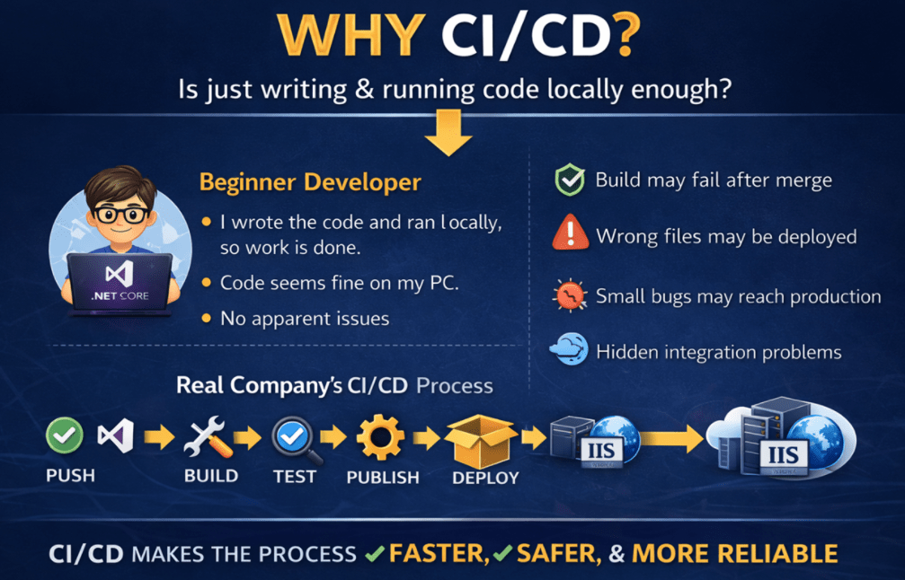
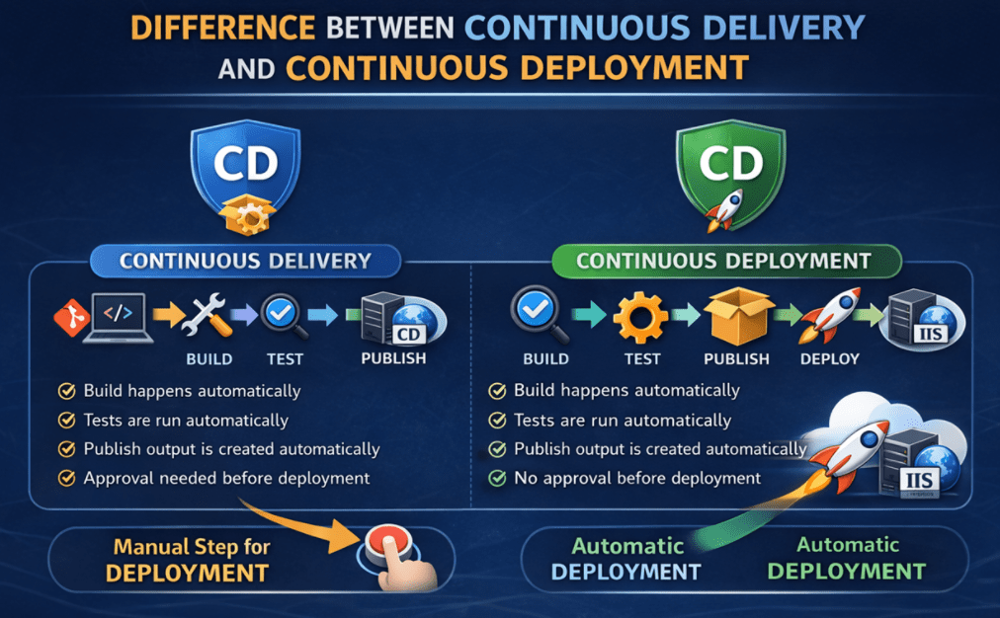
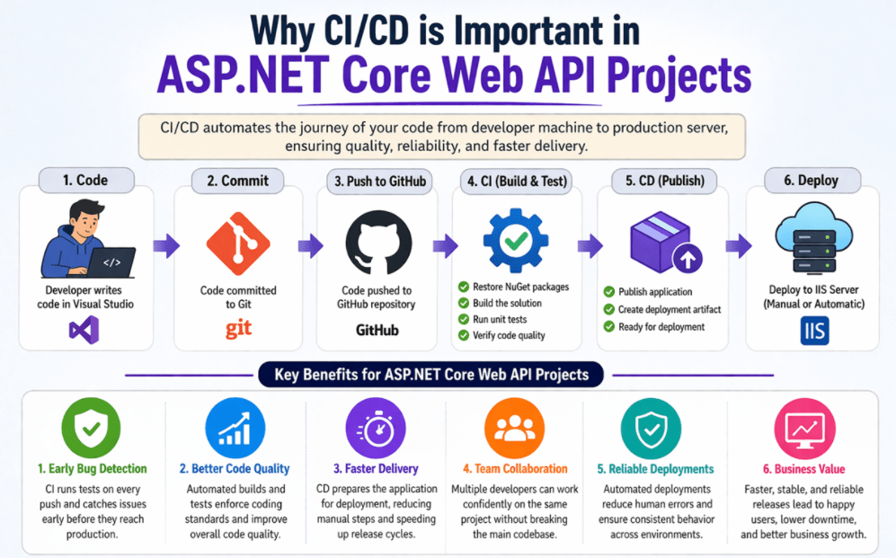
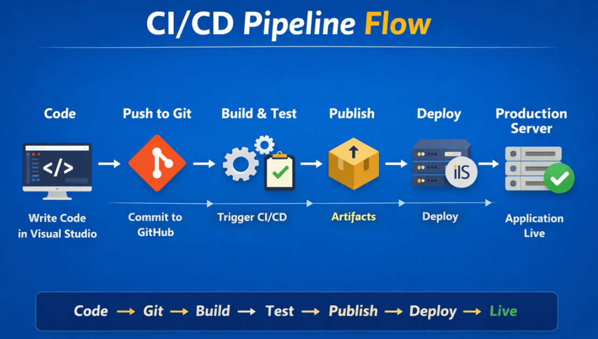

## **مقدمه‌ای بر خطوط لوله CI/CD در .NET**

وقتی مبتدیان شروع به یادگیری توسعه دات‌نت می‌کنند، معمولاً فقط روی نوشتن کد در ویژوال استودیو تمرکز می‌کنند. آنها کنترلرها، مدل‌ها، سرویس‌ها و APIها را ایجاد می‌کنند، برنامه را به صورت محلی اجرا می‌کنند و احساس می‌کنند که کار تمام شده است. اما در توسعه نرم‌افزار در دنیای واقعی، نوشتن کد تنها بخشی از کار است. پس از نوشتن کد، ما همچنین باید آن را بسازیم، آزمایش کنیم، منتشر کنیم و روی یک سرور مستقر کنیم تا کاربران بتوانند به آن دسترسی داشته باشند.

اینجاست که CI/CD بسیار مهم می‌شود. CI/CD به ما کمک می‌کند تا فرآیند انتقال کد از دستگاه توسعه‌دهنده به سرور زنده را خودکار کنیم. به جای انجام همه کارها به صورت دستی و بارها و بارها، ما یک گردش کار مناسب ایجاد می‌کنیم. این گردش کار باعث می‌شود فرآیند در پروژه‌های واقعی سریع‌تر، ایمن‌تر، حرفه‌ای‌تر و مدیریت آن بسیار آسان‌تر شود.

#### **چرا CI/CD؟**

یک مبتدی ممکن است اینطور فکر کند:

- من کد را نوشتم، آن را به صورت محلی اجرا کردم و کار می‌کند. بنابراین، کار تمام است.

اما در یک شرکت واقعی، این کافی نیست. کد باید به یک مخزن ارسال شود، به درستی بررسی شود، آزمایش شود، منتشر شود و سپس مستقر شود. اگر این فرآیند به درستی انجام نشود، مشکلات زیادی ممکن است رخ دهد. ممکن است برنامه روی سرور از کار بیفتد، فایل‌های اشتباه مستقر شوند، ممکن است ساخت پس از ادغام کد با شکست مواجه شود، یا ممکن است یک اشکال کوچک به مرحله تولید برسد زیرا هیچ کس آن را به درستی آزمایش نکرده است. برای درک بهتر، لطفاً به تصویر زیر نگاهی بیندازید.

##### **یک قیاس ساده در زمان واقعی**

بیایید CI/CD را با یک تشبیه ساده به رستوران درک کنیم. فرض کنید مشتری در یک رستوران سفارشی ثبت می‌کند.

غذا بلافاصله پس از دریافت سفارش سرو نمی‌شود. ابتدا آشپزخانه آن را آماده می‌کند، بررسی می‌کند که آیا همه مواد اولیه موجود است یا خیر، آن را می‌پزد، کیفیت آن را تأیید می‌کند، به درستی بسته‌بندی می‌کند و سپس برای مشتری ارسال می‌کند.

تحویل نرم‌افزار نیز به همین شکل عمل می‌کند.

- نوشتن کد مثل آماده کردن غذاست.
- ساخت پروژه مانند بررسی این است که آیا همه چیز برای پخت و پز آماده است یا خیر.
- آزمایش مانند بررسی کیفیت است.
- انتشار کتاب مثل بسته‌بندی غذاست.
- استقرار مانند تحویل آن به مشتری است.

CI/CD به خودکارسازی کل این جریان کمک می‌کند تا هر سفارش به روشی استاندارد و قابل اعتماد مدیریت شود.

#### **ادغام مداوم (CI) چیست؟**

ادغام مداوم یا CI، روشی است که به طور منظم تغییرات کد را به یک مخزن مشترک اضافه می‌کند و به طور خودکار بررسی می‌کند که آیا پروژه هنوز به درستی کار می‌کند یا خیر. به زبان ساده، هر زمان که یک توسعه‌دهنده کدی می‌نویسد و آن را به GitHub ارسال می‌کند، سیستم باید به طور خودکار موارد مهمی مانند موارد زیر را تأیید کند:

- آیا کد به درستی کامپایل می‌شود؟
- آیا همه بسته‌های مورد نیاز موجود است؟
- آیا پروژه با موفقیت در حال ساخت است؟
- آیا آزمون‌ها با موفقیت پشت سر گذاشته می‌شوند؟
- آیا برنامه هنوز در وضعیت سالمی است؟

اگر این بررسی‌ها هر زمان که تغییرات کد اعمال می‌شوند، به‌طور خودکار انجام شوند، به آن ادغام مداوم می‌گویند.

 چیست؟")

این بسیار مهم است زیرا در پروژه‌های واقعی، ممکن است چندین توسعه‌دهنده روی یک برنامه کار کنند. یک توسعه‌دهنده ممکن است یک کلاس سرویس را تغییر دهد، دیگری ممکن است یک مدل را به‌روزرسانی کند و دیگری ممکن است پیکربندی را تغییر دهد. حتی اگر همه چیز روی دستگاه یک نفر کار کند، کد ترکیبی نهایی ممکن است با شکست مواجه شود. CI به ما کمک می‌کند تا این مشکلات را زود تشخیص دهیم.

##### **مثال بلادرنگ از CI در .NET**

فرض کنید روی یک پروژه ASP.NET Core Web API کار می‌کنید. تغییرات زیر را اعمال می‌کنید:

- اضافه کردن یک کنترلر جدید
- اصلاح یک DTO
- به‌روزرسانی یک متد سرویس
- تغییر منطق اعتبارسنجی

این پروژه روی دستگاه محلی شما به خوبی اجرا می‌شود.

حالا کد را به گیت‌هاب ارسال می‌کنید. در آن لحظه، یک خط لوله CI می‌تواند به طور خودکار موارد زیر را انجام دهد:

- بازیابی بسته‌های NuGet
- راه حل را بسازید
- اجرای تست‌های واحد
- بررسی کنید که آیا انتشار امکان‌پذیر است یا خیر

اگر هر یک از این مراحل با شکست مواجه شود، خط لوله متوقف شده و به شما اطلاع می‌دهد که مشکلی وجود دارد. این خیلی بهتر از آن است که بعداً در حین استقرار، مشکل کشف شود.

##### **چرا CI مهم است؟**

هوش رقابتی (CI) مهم است زیرا بازخورد سریعی ارائه می‌دهد. به جای اینکه تا آخرین لحظه برای کشف مشکل منتظر بمانیم، سیستم بلافاصله به ما اطلاع می‌دهد. این باعث صرفه‌جویی در زمان و کاهش ریسک می‌شود.

بدون CI:

- توسعه‌دهندگان ممکن است کد ناقص را منتشر کنند
- مشکلات ادغام ممکن است پنهان بمانند
- ممکن است اشکالات به مراحل بعدی منتقل شوند
- انتشارها استرس‌زا می‌شوند

با سی آی:

- مشکلات زود تشخیص داده می‌شوند
- کیفیت کد بهبود می‌یابد
- پروژه سالم‌تر باقی می‌ماند
- تیم اعتماد به نفس بیشتری پیدا می‌کند

#### **تحویل مداوم (CD) چیست؟**

تحویل مداوم به این معنی است که پس از ساخت و آزمایش موفقیت‌آمیز کد، به طور خودکار آماده و برای استقرار آماده نگه داشته می‌شود. این بدان معناست که برنامه همیشه در حالت قابل استقرار است.

به زبان ساده:

- **CI بررسی می‌کند که آیا برنامه سالم است یا خیر.**
- **CD تضمین می‌کند که برنامه آماده انتشار است.**

در یک پروژه .NET، این معمولاً به این معنی است که پس از اتمام موفقیت‌آمیز مراحل ساخت و آزمایش، برنامه منتشر شده و خروجی آماده برای استقرار تولید می‌شود.

 چیست؟")

**توجه:** این همیشه به این معنی نیست که استقرار به طور خودکار اتفاق می‌افتد. گاهی اوقات استقرار پس از تأیید، همچنان به صورت دستی آغاز می‌شود. به همین دلیل است که باید درک کنید که CD بیشتر در مورد **آمادگی برای استقرار** است تا خود استقرار.

##### **مثال بلادرنگ از CD در .NET**

فرض کنید ASP.NET Core Web API شما مراحل CI را پشت سر گذاشته است. اکنون سیستم مرحله انتشار را انجام می‌دهد و خروجی نهایی را که می‌تواند در IIS مستقر شود، ایجاد می‌کند. این خروجی منتشر شده ممکن است شامل موارد زیر باشد:

- فایل‌های برنامه کامپایل شده
- وابستگی‌های مورد نیاز
- فایل‌های آماده پیکربندی
- بسته یا مصنوع قابل گسترش

اکنون برنامه آماده انتقال به سرور است. این آمادگی، ایده اصلی پشت تحویل مداوم (Continuous Delivery) است.

#### **تفاوت بین تحویل مداوم و استقرار مداوم**

این دو اصطلاح بسیاری از مبتدیان را گیج می‌کند؛ بیایید آنها را به روشنی درک کنیم. برای درک بهتر، لطفاً به تصویر زیر نگاهی بیندازید:

##### **تحویل مداوم**

در تحویل مداوم:

- ساخت به طور خودکار اتفاق می‌افتد
- تست‌ها به صورت خودکار اجرا می‌شوند
- انتشار خروجی به طور خودکار ایجاد می‌شود
- برنامه برای استقرار آماده نگه داشته می‌شود
- استقرار نهایی محصول ممکن است هنوز نیاز به تأیید دستی داشته باشد

##### **استقرار مداوم**

در استقرار مداوم:

- ساخت به طور خودکار اتفاق می‌افتد
- تست‌ها به صورت خودکار انجام می‌شوند
- انتشار به صورت خودکار اتفاق می‌افتد
- استقرار نیز به صورت خودکار و بدون تأیید دستی انجام می‌شود.

**بنابراین** :

- **تحویل مداوم** می‌گوید: همه چیز آماده است. هر زمان که شما تأیید کنید، مستقر شوید.
- **استقرار مداوم** می‌گوید: همه چیز آماده است، پس فوراً مستقر شوید.

##### **درک بلادرنگ**

در بسیاری از شرکت‌های واقعی:

- محیط توسعه یا آزمایش ممکن است از استقرار خودکار استفاده کند.
- محیط تولید ممکن است قبل از استقرار، نیاز به تأیید دستی داشته باشد.

به همین دلیل است که تحویل مداوم در مجموعه‌های تولید حرفه‌ای رایج‌تر است.

#### **تفاوت بین استقرار دستی و استقرار خودکار**

بیایید بفهمیم استقرار دستی چیست، مشکلات مرتبط با استقرار دستی چیست و چگونه می‌توان با استقرار خودکار بر مشکل غلبه کرد.

##### **استقرار دستی**

در استقرار دستی، توسعه‌دهنده تمام مراحل را با دست انجام می‌دهد. برای مثال:

- پروژه را در ویژوال استودیو باز کنید
- ساخت پروژه
- پروژه را منتشر کنید
- کپی کردن فایل‌ها در پوشه سرور
- در صورت نیاز، سایت یا برنامه IIS را متوقف کنید
- فایل‌های قدیمی را جایگزین کنید
- IIS را مجدداً راه اندازی کنید
- API را به صورت دستی تست کنید

این رویکرد ممکن است برای پروژه‌های کوچک جواب بدهد، اما مشکلات زیادی دارد.

##### **مشکلات مربوط به نصب دستی**

اگر از رویکرد استقرار دستی استفاده می‌کنید، ممکن است با مشکلات زیر روبرو شوید:

- ممکن است کسی یک مرحله را فراموش کند
- ممکن است فایل‌های اشتباه کپی شده باشند
- خروجی اشکال‌زدایی ممکن است به جای انتشار، مستقر شود.
- ممکن است فایل‌های پیکربندی از دست رفته باشند
- توسعه‌دهندگان مختلف ممکن است مراحل متفاوتی را دنبال کنند
- استقرار کند و مستعد خطا می‌شود
- بازگشت به حالت اولیه دشوار می‌شود

حال، بیایید بفهمیم که چگونه می‌توانیم با استقرار خودکار، که رویکرد پیشنهادی در توسعه نرم‌افزار امروزی است، بر مشکلات فوق غلبه کنیم.

##### **استقرار خودکار**

در استقرار خودکار، مراحل یک بار در یک خط لوله تعریف می‌شوند و سپس هر بار به همان روش اجرا می‌شوند. برای مثال:

- کد به گیت‌هاب ارسال می‌شود
- خط لوله به طور خودکار شروع می شود
- ساخت پروژه به صورت خودکار
- اجرای تست به صورت خودکار
- انتشار خروجی ایجاد شده است
- اسکریپت استقرار، فایل‌ها را در IIS یا هر وب‌سروری که برنامه خود را در آن میزبانی می‌کنید، کپی می‌کند.
- در صورت نیاز، IIS یا وب سرور مجدداً راه‌اندازی می‌شود.
- اعتبارسنجی پس از استقرار اجرا می‌شود

این رویکرد خطاهای انسانی را کاهش داده و ثبات ایجاد می‌کند.

#### **چرا CI/CD در پروژه‌های ASP.NET Core Web API مهم است؟**

پروژه‌های ASP.NET Core Web API اغلب به عنوان backend برنامه‌های وب، برنامه‌های تلفن همراه، پنل‌های مدیریتی، سیستم‌های سازمانی و میکروسرویس‌ها استفاده می‌شوند. این برنامه‌ها معمولاً به دلیل اضافه شدن ویژگی‌های جدید، اصلاحات و به‌روزرسانی‌ها به طور مرتب، مرتباً تغییر می‌کنند. اگر هر تغییر باید به صورت دستی اعمال شود، این فرآیند دردناک می‌شود.

CI/CD به این دلیل اهمیت پیدا می‌کند که به روش‌های زیر کمک می‌کند:

- به طور خودکار بررسی می‌کند که آیا کد معتبر است یا خیر.
- این کار تلاش دستی را کاهش می‌دهد.
- روند آزادسازی را سرعت می‌بخشد.
- قبل از استقرار، اعتماد ایجاد می‌کند.
- این باعث می‌شود فرآیند توسعه حرفه‌ای‌تر شود.

برای درک بهتر، لطفاً به تصویر زیر نگاهی بیندازید.

##### **سناریوی بلادرنگ**

تصور کنید تیم شما در حال ساخت یک رابط برنامه‌نویسی کاربردی وب برای تجارت الکترونیک است. یک توسعه‌دهنده منطق محصول را به‌روزرسانی می‌کند. دیگری پردازش سفارش را به‌روزرسانی می‌کند. دیگری تغییرات احراز هویت را اضافه می‌کند. اکنون همه این تغییرات در گیت‌هاب ادغام می‌شوند. بدون CI/CD، تیم ممکن است فقط در زمان استقرار، مشکلات را کشف کند.

###### **با CI/CD:**

- پروژه به صورت خودکار ساخته می‌شود.
- تست‌ها به صورت خودکار اجرا می‌شوند.
- خروجی انتشار تولید می‌شود.
- استقرار می‌تواند به روشی استاندارد اتفاق بیفتد.

این باعث می‌شود که نگهداری پروژه بسیار آسان‌تر شود.

#### **جریان سرتاسری CI/CD: کد → گیت‌هاب → ساخت → تست → انتشار → استقرار**

این مهم‌ترین تصویرسازی در خط لوله CI/CD است. کد → گیت‌هاب → ساخت → تست → انتشار → استقرار. بیایید ادامه دهیم و جریان را با جزئیات درک کنیم.

##### **مرحله ۱: کدنویسی**

همه چیز با کدی که در ویژوال استودیو نوشته شده شروع می‌شود. این کد می‌تواند شامل موارد زیر باشد:

- کنترل‌کننده‌ها
- خدمات
- مخازن
- مدل‌ها
- DTO ها
- میان‌افزار
- پیکربندی
- آزمایش‌ها

##### **مرحله ۲: گیت**

پس از انجام کار، توسعه‌دهنده تغییرات را با استفاده از Git ثبت می‌کند. Git یک سیستم کنترل نسخه است که به عنوان مخزن محلی نیز عمل می‌کند و به ردیابی تغییرات و حفظ تاریخچه نسخه پروژه کمک می‌کند.

##### **مرحله ۳: گیت‌هاب**

کد به گیت‌هاب ارسال می‌شود. گیت‌هاب یک مخزن از راه دور است که به عنوان مخزن مرکزی نیز عمل می‌کند و کدها در آن ذخیره و بین تیم‌ها به اشتراک گذاشته می‌شوند.

##### **مرحله ۴: ساخت**

پس از اینکه کد به گیت‌هاب ارسال شد، پایپ‌لاین شروع می‌شود. مرحله ساخت در پایپ‌لاین بررسی می‌کند که آیا پروژه با موفقیت کامپایل شده است یا خیر. اگر پروژه ساخته نشود، پایپ‌لاین بلافاصله با شکست مواجه می‌شود.

##### **مرحله ۵: آزمایش**

اگر ساخت با موفقیت انجام شود، تست‌های خودکار اجرا می‌شوند. این کار تأیید می‌کند که برنامه هنوز به درستی کار می‌کند.

##### **مرحله ۶: انتشار**

اگر هر دو مرحله ساخت و آزمایش با موفقیت پشت سر گذاشته شوند، برنامه منتشر می‌شود. در دات‌نت، انتشار به معنای تولید فایل‌های نهایی مورد نیاز برای استقرار است.

##### **مرحله 7: استقرار**

فایل‌های منتشر شده سپس در سرور هدف، مانند IIS یا Microsoft Azure، مستقر می‌شوند. پس از استقرار، کاربران می‌توانند به برنامه‌ی به‌روزرسانی‌شده دسترسی داشته باشند.

#### **ابزارهای مورد استفاده در راه‌اندازی CI/CD ما**

ابزارهای اصلی که در راه‌اندازی CI/CD خود استفاده خواهیم کرد عبارتند از Visual Studio، Git، GitHub، GitHub Actions و IIS.

##### **ویژوال استودیو: ایجاد، نوشتن، اجرا و اشکال‌زدایی یک برنامه**

ویژوال استودیو جایی است که ما برنامه ASP.NET Core Web API خود را ایجاد، می‌نویسیم، اجرا و اشکال‌زدایی می‌کنیم. این ابزار توسعه اصلی ما است.

##### **گیت: مخزن محلی**

گیت (Git) یک سیستم کنترل نسخه (Version Control System) است، نرم‌افزاری که باید روی دستگاه خود نصب کنیم. این نرم‌افزار به ما کمک می‌کند تا تغییرات کد منبع را با استفاده از عملیاتی مانند موارد زیر مدیریت کنیم:

- متعهد شدن
- فشار دهید
- بکشید
- شعبه
- ادغام

##### **گیت‌هاب: مخزن از راه دور**

گیت‌هاب یک مخزن از راه دور است که ما مخزن پروژه را به صورت آنلاین در آن میزبانی می‌کنیم. این مکانی است که توسعه‌دهندگان کد را ارسال می‌کنند و گردش‌های کاری اتوماسیون می‌توانند از آنجا شروع شوند.

##### **اقدامات گیت‌هاب: خودکارسازی گردش کار**

GitHub Actions ابزاری برای اتوماسیون در GitHub است که برای ایجاد گردش‌های کاری CI/CD استفاده می‌شود. این ابزار می‌تواند به طور خودکار:

- بازیابی وابستگی‌ها
- ساخت پروژه
- اجرای تست‌ها
- انتشار خروجی
- مراحل استقرار تریگر

##### **IIS: میزبان برنامه**

IIS سروری است که ما ASP.NET Core Web API خود را در آن میزبانی خواهیم کرد. اکنون، ما از IIS به عنوان هدف نهایی استقرار استفاده می‌کنیم. بعداً، از Azure استفاده خواهیم کرد.

#### **مشکلات رایج بلادرنگ که توسط CI/CD حل می‌شوند**

برخی از مشکلات بسیار رایج که توسط CI/CD حل می‌شوند عبارتند از:

- روی سیستم خودم کار می‌کنه، ولی روی سرور نه.
- کسی فراموش کرد که آزمایش‌ها را انجام دهد.
- فایل‌های اشتباه مستقر شدند.
- این پروژه پس از ادغام کد با شکست مواجه شد.
- مراحل استقرار هر بار متفاوت بود.
- یک اشکال به مرحله تولید رسید زیرا هیچ کس به درستی بررسی نکرد.
- تیم با انجام کارهای دستی مکرر، زمان زیادی را تلف کرد.

اینها اشتباهات انسانی عادی در استقرار دستی هستند. CI/CD با ایجاد یک گردش کار خودکار استاندارد، چنین مشکلاتی را کاهش می‌دهد.

##### **یک مثال ساده بلادرنگ .NET**

بگذارید یک مثال ساده بزنیم. فرض کنید شما در حال توسعه یک پروژه مدیریت دانش‌آموزی با استفاده از ASP.NET Core Web API هستید. شما تغییراتی در موارد زیر ایجاد می‌کنید:

- کنترل‌کننده دانشجویی
- خدمات دانشجویی
- کلاس‌های DTO

سپس کد را به GitHub ارسال می‌کنید.

اکنون خط لوله شروع به کار می‌کند و این مراحل را به طور خودکار انجام می‌دهد:

- بازیابی بسته‌ها
- راه حل را بسازید
- اجرای تست‌ها
- پروژه را منتشر کنید
- استقرار در IIS
- بررسی کنید که آیا API پاسخ می‌دهد یا خیر

اگر مشکلی پیش بیاید، سیستم دقیقاً به شما می‌گوید که مشکل از کجا رخ داده است. این خیلی بهتر از این است که همه چیز را به صورت دستی اجرا کنید و بعداً متوجه مشکلات شوید.

##### **نتیجه‌گیری:**

در این فصل، ایده اولیه CI/CD را به روشی بسیار کاربردی درک کردیم. یاد گرفتیم که توسعه نرم‌افزار پس از نوشتن کد به پایان نمی‌رسد. کد همچنین باید به درستی تأیید، بسته‌بندی و مستقر شود. یکپارچه‌سازی مداوم به ما کمک می‌کند تا تغییرات کد را به طور خودکار اعتبارسنجی کنیم، در حالی که تحویل مداوم به ما کمک می‌کند تا برنامه را برای انتشار آماده نگه داریم.

ما همچنین تفاوت بین استقرار دستی و استقرار خودکار، اهمیت CI/CD در پروژه‌های ASP.NET Core Web API، شکل کلی گردش کار، ابزارهای مورد نیاز و مشکلات رایجی که CI/CD در پروژه‌های واقعی حل می‌کند را درک کردیم. این فصل پایه و اساس هر آنچه در ادامه این دوره می‌آید را بنا می‌کند.