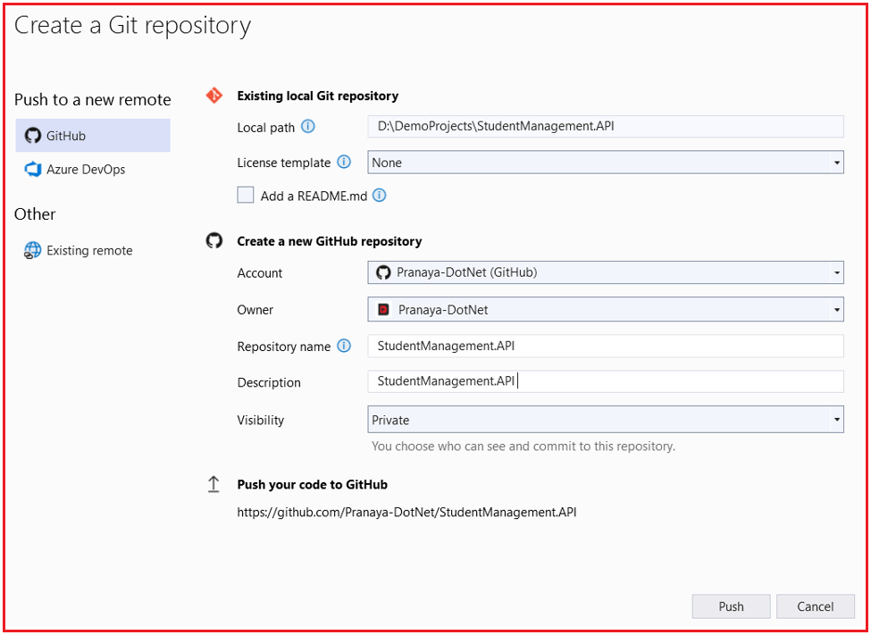

## **آماده‌سازی پروژه ASP.NET Core Web API برای CI/CD**

در این فصل، ما یک پروژه واقعی ASP.NET Core Web API را آماده خواهیم کرد که در طول فصل‌های باقی‌مانده مورد استفاده قرار خواهد گرفت. هدف اصلی در اینجا هنوز اتوماسیون نیست. هدف ایجاد یک پروژه پایه تمیز، درک جریان اولیه پروژه، اتصال آن به Git و GitHub و ابتدا انتشار و استقرار دستی آن است. هنگامی که ما به وضوح فرآیند دستی را درک کنیم، درک CI/CD بسیار آسان‌تر می‌شود.

#### **آنچه در این فصل خواهیم ساخت**

ایجاد خواهیم کرد **حالا، یک پروژه ساده به نام StudentManagement.API** . این پروژه عمداً کوچک خواهد بود. ما در اینجا به پیچیدگی پایگاه داده نیاز نداریم، زیرا تمرکز روی آماده‌سازی CI/CD است، نه منطق کسب و کار. ما فقط به یک پروژه تمیز نیاز داریم که بتواند:

- با موفقیت در ویژوال استودیو اجرا شود
- چند نقطه پایانی API را افشا کنید
- داده های برگشتی
- پشتیبانی از بررسی سلامت
- به گیت متعهد باشید
- به گیت‌هاب منتقل شوید
- منتشر شود
- در IIS مستقر شود

این پروژه به پروژه پایه برای فصل‌های بعدی تبدیل خواهد شد.

#### **مرحله 1: ایجاد پروژه ASP.NET Core Web API در ویژوال استودیو**

را باز کنید **ویژوال استودیو** و مراحل زیر را دنبال کنید:

- کلیک کنید **روی ایجاد یک پروژه جدید**
- انتخاب **ASP.NET Core Web API**
- کلیک کنید **روی بعدی**
- نام پروژه: **StudentManagement.API**
- یک مکان مناسب انتخاب کنید
- کلیک کنید **روی بعدی**
- چارچوب: **دات نت ۸**
- نوع احراز هویت: **هیچکدام**
- پیکربندی برای HTTPS: **علامت زده شده**
- فعال کردن پشتیبانی OpenAPI: **علامت زده شده**
- استفاده از کنترلرها: **علامت زده شده**
- کلیک کنید **روی ایجاد**

#### **مرحله 2: قالب پیش‌فرض را تمیز کنید و پروژه پایه خود را آماده کنید**

بیشتر قالب‌های Web API با یک کنترلر نمونه WeatherForecast ارائه می‌شوند. همیشه بهتر است آن را با چیزی معنادار جایگزین کنید.

##### **فایل‌های پیش‌فرض را حذف کنید**

در صورت وجود فایل‌های پیش‌فرض زیر، آنها را حذف کنید:

- WeatherForec.cs
- WeatherForcastController.cs

حالا ساختار پروژه ساده خودمان را ایجاد خواهیم کرد.

##### **پوشه‌های زیر را ایجاد کنید**

داخل پروژه، این پوشه‌ها را اضافه کنید:

- کنترل‌کننده‌ها، اگر قبلاً ایجاد نشده باشند.
- مدل‌ها
- خدمات

#### **مرحله ۳: اضافه کردن کلاس مدل**

یک کلاس جدید در **Models** پوشه **با نام Student.cs** ایجاد کنید . ما مدل را بسیار ساده نگه می‌داریم زیرا هدف پیچیدگی دامنه نیست. ما فقط به عملکرد کافی نیاز داریم تا تأیید کنیم که API می‌تواند به درستی ساخته، اجرا، منتشر و مستقر شود.

```csharp
namespace StudentManagement.API.Models
{
    public class Student
    {
        public int Id { get; set; }
        public string Name { get; set; } = string.Empty;
        public string Email { get; set; } = string.Empty;
        public string Course { get; set; } = string.Empty;
    }
}
```

#### **مرحله ۴: رابط سرویس را اضافه کنید**

درون **پوشه Services** ، یک رابط به نام **IStudentService.cs** اضافه کنید . این رابط، عملیاتی را که سرویس ما پشتیبانی خواهد کرد، تعریف می‌کند.

```csharp
using StudentManagement.API.Models;

namespace StudentManagement.API.Services
{
    public interface IStudentService
    {
        List<Student> GetAll();
        Student? GetById(int id);
        Student Add(Student student);
    }
}
```

#### **مرحله 5: پیاده‌سازی سرویس را اضافه کنید**

داخل **پوشه Services** ، یک کلاس به نام **StudentService.cs** اضافه کنید . ما هنوز SQL Server را اضافه نمی‌کنیم زیرا تمرکز ما در اینجا آماده‌سازی پروژه برای CI/CD است. ما به یک برنامه کوچک اما کاربردی نیاز داریم.

```csharp
using StudentManagement.API.Models;

namespace StudentManagement.API.Services
{
    public class StudentService : IStudentService
    {
        private static readonly List<Student> Students = new()
        {
            new Student { Id = 1, Name = "Anil", Email = "anil@example.com", Course = "ASP.NET Core" },
            new Student { Id = 2, Name = "Rina", Email = "rina@example.com", Course = "C#" }
        };

        public List<Student> GetAll()
        {
            return Students;
        }

        public Student? GetById(int id)
        {
            return Students.FirstOrDefault(x => x.Id == id);
        }

        public Student Add(Student student)
        {
            // محاسبه Id جدید با در نظر گرفتن خالی بودن لیست
            student.Id = Students.Any() ? Students.Max(x => x.Id) + 1 : 1;
            Students.Add(student);
            return student;
        }
    }
}
```

#### **مرحله 6: اضافه کردن کنترلر دانشجویان**

داخل **پوشه Controllers** ، یک کنترلر به نام **StudentsController.cs** اضافه کنید . این کار قابلیت API کافی برای تست صحیح پروژه را فراهم می‌کند.

```csharp
using Microsoft.AspNetCore.Mvc;
using StudentManagement.API.Models;
using StudentManagement.API.Services;

namespace StudentManagement.API.Controllers
{
    [Route("api/[controller]")]
    [ApiController]
    public class StudentsController : ControllerBase
    {
        private readonly IStudentService _studentService;

        public StudentsController(IStudentService studentService)
        {
            _studentService = studentService;
        }

        [HttpGet]
        public IActionResult GetAll()
        {
            var students = _studentService.GetAll();
            return Ok(students);
        }

        [HttpGet("{id}")]
        public IActionResult GetById(int id)
        {
            var student = _studentService.GetById(id);

            if (student == null)
            {
                return NotFound($"Student with Id {id} not found.");
            }

            return Ok(student);
        }

        [HttpPost]
        public IActionResult Create(Student student)
        {
            var createdStudent = _studentService.Add(student);
            return CreatedAtAction(nameof(GetById), new { id = createdStudent.Id }, createdStudent);
        }
    }
}
```

#### **مرحله 7: یک نقطه پایانی سلامت برای اعتبارسنجی استقرار آینده اضافه کنید**

بعداً، وقتی از طریق CI/CD مستقر می‌شویم، به یک نقطه پایانی ساده برای تأیید فعال بودن API پس از استقرار نیاز خواهیم داشت. یک کنترلر جدید با نام **HealthController.cs** در پوشه Controllers ایجاد کنید.

```csharp
using Microsoft.AspNetCore.Mvc;

namespace StudentManagement.API.Controllers
{
    [Route("api/[controller]")]
    [ApiController]
    public class HealthController : ControllerBase
    {
        [HttpGet]
        public IActionResult Get()
        {
            return Ok(new
            {
                Status = "Healthy",
                Message = "Student Management API is running successfully."
            });
        }
    }
}
```

#### **مرحله ۸: به‌روزرسانی Program.cs**

حالا **Program.cs** را باز کنید و آن را به صورت زیر به‌روزرسانی کنید:

```csharp
using StudentManagement.API.Services;

namespace StudentManagement.API
{
    public class Program
    {
        public static void Main(string[] args)
        {
            var builder = WebApplication.CreateBuilder(args);

            // Add services to the container.
            builder.Services.AddControllers()
                .AddJsonOptions(options =>
                {
                    // This will use the property names as defined in the C# model
                    options.JsonSerializerOptions.PropertyNamingPolicy = null;
                });

            builder.Services.AddEndpointsApiExplorer();
            builder.Services.AddSwaggerGen();

            // Register application services
            builder.Services.AddSingleton<IStudentService, StudentService>();

            var app = builder.Build();

            // Configure the HTTP request pipeline.
            if (app.Environment.IsDevelopment())
            {
                app.UseSwagger();
                app.UseSwaggerUI();
            }

            app.UseHttpsRedirection();

            app.UseAuthorization();

            app.MapControllers();

            app.Run();
        }
    }
}
```

#### **مرحله ۹: اجرا و آزمایش پروژه**

پروژه را اجرا کنید و نقاط پایانی زیر را آزمایش کنید:

- دریافت /api/دانشجویان
- دریافت /api/students/1
- پست /api/students
- دریافت /api/health

می‌توانید آنها را با استفاده از موارد زیر آزمایش کنید:

- رابط کاربری سواگر
- پستچی
- مرورگر برای درخواست‌های GET

###### **مثال بدنه درخواست POST**

```json
{
  "Name": "Suman",
  "Email": "suman@example.com",
  "Course": "CI/CD with .NET"
}
```

#### **مرحله 10: درک مفاهیم ساخت، بازسازی، انتشار و استقرار**

##### **ساختن**

**دستور Build** کد را کامپایل می‌کند و بررسی می‌کند که آیا برنامه خطایی در زمان کامپایل دارد یا خیر. در ویژوال استودیو:

- کلیک کنید **روی ساخت**
- سپس روی **ساخت راهکار کلیک کنید**
- اگر خطای نحوی وجود داشته باشد، ساخت با شکست مواجه می‌شود.
- اگر همه چیز درست باشد، ساخت و ساز موفقیت آمیز خواهد بود

بنابراین، Build به این معنی است که ویژوال استودیو کد را کامپایل می‌کند و بررسی می‌کند که آیا پروژه می‌تواند به خروجی اجرایی تبدیل شود یا خیر.

##### **بازسازی**

**دستور Rebuild** ابتدا فایل‌های کامپایل شده قدیمی را پاک می‌کند و سپس دوباره از ابتدا راه‌حل را می‌سازد. در ویژوال استودیو:

- کلیک کنید **روی ساخت**
- سپس **روی بازسازی راهکار کلیک کنید**

وقتی می‌خواهید یک کامپایل جدید انجام دهید و نمی‌خواهید به فایل‌های تولید شده قدیمی وابسته باشید، از Rebuild استفاده کنید.

##### **منتشر کردن**

**انتشار،** خروجی قابل استقرار پروژه را ایجاد می‌کند. این خروجی با ساخت صرف متفاوت است. این خروجی فایل‌های مورد نیاز برای اجرای برنامه در محیط هدف را آماده می‌کند.

##### **استقرار**

**استقرار** به معنای قرار دادن خروجی منتشر شده روی سرور هدف، مانند IIS، است.

#### **مرحله 11: مقداردهی اولیه گیت برای پروژه**

حالا پروژه را تحت کنترل نسخه گیت (Git Version Control) قرار می‌دهیم. ما قبلاً گیت (GIT) را روی دستگاه خود نصب کرده‌ایم. حالا، برای اضافه کردن پروژه به گیت، در ویژوال استودیو، از منوی بالا،

- را انتخاب کنید **گیت**
- کلیک کنید **روی ایجاد مخزن گیت** .

اکنون، ویژوال استودیو **پنجره‌ی «ایجاد یک مخزن گیت»** را باز می‌کند . این پنجره به شما امکان می‌دهد تصمیم بگیرید **که چگونه و کجا گیت را** برای پروژه‌ی خود مقداردهی اولیه کنید.

##### **ایجاد یک مخزن محلی:**

**برای ایجاد یک مخزن محلی گیت، فقط این را انتخاب کنید:**

1. **پنل سمت چپ** → روی **فقط محلی کلیک کنید**
2. **پنل سمت راست** :
	- - **مسیر محلی** → همانطور که هست باقی بماند
				- **قالب ‎.gitignore** → پیش‌فرض (VisualStudio)
				- **الگوی مجوز** → هیچکدام
				- **فایل README.md را اضافه کنید** → تیک نخورده باقی بماند
3. کلیک کنید **روی ایجاد**

#### **مرحله ۱۲: درک Clone، Commit، Push و Pull**

- **کلون: کلون** به معنای دانلود یک مخزن از گیت‌هاب به دستگاه محلی شماست. از این مورد زمانی استفاده کنید که مخزن از قبل به صورت آنلاین وجود دارد و می‌خواهید به صورت محلی روی آن کار کنید.
- **کامیت (Commit): کامیت** به معنای ذخیره یک اسنپ‌شات از تغییرات محلی شما در تاریخچه گیت است.
- **Push: Push** به معنای ارسال تغییرات ثبت‌شده محلی به گیت‌هاب است.
- **کشیدن (Pull): کشیدن** به معنای دریافت آخرین تغییرات از گیت‌هاب به دستگاه محلی شماست.

#### **مرحله ۱۳: اتصال پروژه ویژوال استودیو به گیت‌هاب**

حالا، پروژه‌مان را به یک مخزن GitHub Remote متصل می‌کنیم. می‌توانیم این کار را به یکی از دو روش زیر انجام دهیم:

##### **گزینه ۱: ایجاد مخزن از ویژوال استودیو**

- پروژه را در ویژوال استودیو باز کنید
- بروید **Git → Push to Git Service** به گزینه
- ایجاد یک مخزن جدید گیت
- گیت‌هاب را به عنوان ریموت انتخاب کنید
- در صورت نیاز وارد شوید
- مخزن را ایجاد کنید
- کد را فشار دهید

برای درک بهتر، لطفاً به تصویر زیر نگاه کنید:



##### **گزینه ۲: ابتدا یک مخزن خالی در گیت‌هاب ایجاد کنید**

- گیت‌هاب را در مرورگر باز کنید
- یک مخزن خالی جدید با نام StudentManagement.API ایجاد کنید.
- اگر می‌خواهید اولین استفاده از ویژوال استودیو را تمیز انجام دهید، README، .gitignore یا license را اضافه نکنید.
- در ویژوال استودیو، مخزن محلی گیت را به آن مخزن راه دور متصل کنید
- کد را فشار دهید

#### **مرحله ۱۴: درک پیکربندی توسعه و تولید**

در توسعه‌ی اپلیکیشن، محیط‌های مختلفی مانند توسعه (Development)، مرحله‌بندی (Staging) و تولید (Production) داریم. به طور مشابه، برای محیط‌های مختلف، پیکربندی‌های متفاوتی نیز می‌خواهیم. برای این منظور، ASP.NET Core فایل‌های پیکربندی مختلفی را ارائه می‌دهد. آن‌ها به شرح زیر هستند:

- **appsettings.json:** این فایل پیکربندی رایج مورد استفاده در محیط‌های مختلف است.
- **appsettings.Development.json:** زمانی که برنامه در محیط توسعه (Development environment) اجرا می‌شود، استفاده می‌شود.
- **appsettings.Production.json:** زمانی که برنامه در محیط Production اجرا می‌شود، استفاده می‌شود.

##### **سناریوی بلادرنگ:**

در یک برنامه‌ی بلادرنگ، تنظیمات رایج را در فایل appsettings.json و تنظیمات مختص به محیط را در فایل محیط متناظر نگه می‌داریم. برای مثال:

###### **تنظیمات برنامه.json**

تنظیمات یا پیکربندی‌های رایج اینجا قرار می‌گیرند.

```json
{
  "ApplicationSettings": {
    "ApplicationName": "Student Management API"
  },
  "Logging": {
    "LogLevel": {
      "Default": "Information",
      "Microsoft.AspNetCore": "Warning"
    }
  },
  "AllowedHosts": "*"
}
```

###### **appsettings.Development.json**

تنظیمات یا پیکربندی محیط توسعه در اینجا قرار دارد.

```json
{
  "ApplicationSettings": {
    "ApplicationName": "Student Management API - Development"
  }
}
```

###### **appsettings.Production.json**

تنظیمات یا پیکربندی محیط تولید اینجا قرار دارد.

```json
{
  "ApplicationSettings": {
    "ApplicationName": "Student Management API - Production"
  }
}
```

##### **چرا تنظیمات مختلف برای محیط‌های مختلف:**

محیط‌های توسعه و تولید یکسان نیستند.

در حال توسعه:

- ما ممکن است از ثبت وقایع دقیق استفاده کنیم
- ما ممکن است از مقادیر محلی استفاده کنیم
- ممکن است Swagger را فعال کنیم

در حال تولید:

- ثبت وقایع کنترل می‌شود
- اسرار نباید به صورت کد ثابت باشند
- رفتار محدودتر و ایمن‌تر است

#### **مرحله 15: انتشار دستی پروژه از ویژوال استودیو**

بیایید مراحل انتشار دستی کد در ویژوال استودیو را بررسی کنیم.

##### **مراحل**

1. روی پروژه در **Solution Explorer کلیک راست کنید**
2. کلیک کنید **روی انتشار**
3. را انتخاب کنید **پوشه**
4. یک مکان انتشار را انتخاب کنید، برای مثال: **D:\\Deploy\\StudentManagement.API\\publish**
5. را انتخاب کنید **انتشار** پیکربندی
6. کلیک کنید **روی انتشار**

پس از انتشار، به آن پوشه بروید و فایل‌های خروجی را مشاهده کنید. این خروجی قابل استقرار واقعی است. اینها فایل‌هایی هستند که به IIS می‌روند. بعداً، خط لوله CI/CD به طور خودکار همان نوع خروجی را تولید می‌کند.

#### **مرحله 16: پیش نیازهای IIS برای استقرار ASP.NET Core را درک کنید**

قبل از استقرار در IIS، دستگاه محلی باید آماده باشد.

- IIS باید در ویندوز فعال باشد.
- بسته میزبانی وب .NET 8 باید روی دستگاه IIS نصب شود.
- ماژول ASP.NET Core باید در دسترس باشد
- پوشه استقرار باید مجوزهای لازم را داشته باشد

اگر این پیش‌نیازها وجود نداشته باشند، برنامه ممکن است با موفقیت منتشر شود اما در IIS اجرا نشود.

#### **مرحله 17: فایل‌های منتشر شده را به صورت دستی در IIS محلی مستقر کنید**

اکنون فعالیت استقرار را به صورت دستی انجام خواهیم داد.

###### **مرحله الف: ایجاد پوشه استقرار**

یک پوشه مانند **C:\\inetpub\\StudentManagement.API** ایجاد کنید و سپس فایل‌های منتشر شده را از پوشه publish به این پوشه IIS کپی کنید.

###### **مرحله ب: باز کردن IIS Manager**

باز کنید **مدیر IIS را** .

###### **مرحله ج: ایجاد یک Application Pool**

یک Application Pool جدید با این تنظیمات ایجاد کنید:

- نام: **StudentManagementAPIAppPool**
- نسخه .NET CLR: **بدون کد مدیریت‌شده**

###### **چرا کد مدیریت‌شده وجود ندارد؟**

ASP.NET Core با استفاده از ماژول ASP.NET Core و Kestrel در پشت IIS اجرا می‌شود، بنابراین IIS نیازی به مدیریت آن به عنوان کد کلاسیک .NET Framework ندارد.

###### **مرحله D: ایجاد سایت IIS**

ایجاد یک سایت جدید:

- نام سایت: **StudentManagement.API**
- مسیر فیزیکی: **C:\\inetpub\\StudentManagement.API**
- اتصال: پورتی مانند ۸۰۸۰ را انتخاب کنید
- آن را به مجموعه برنامه‌هایی که در مرحله قبل ایجاد کردیم، اختصاص دهید.

###### **مرحله E: راه‌اندازی سایت**

حالا سایت را مرور کنید. این آدرس‌ها را امتحان کنید:

- http://localhost:8080/api/health
- http://localhost:8080/api/students

اگر همه چیز درست باشد، API باید پاسخ دهد.

##### **مرحله ۱۸: تنظیم محیط در نمایه انتشار**

فایل نمایه انتشار خود را در داخل پروژه باز کنید: **Properties\\PublishProfiles\\YourProfileName.pubxml** و سپس این را اضافه کنید:

```xml
<Project>
  <PropertyGroup>
    <EnvironmentName>Development</EnvironmentName>
  </PropertyGroup>
</Project>
```

هنگام انتشار، ASPNETCORE\_ENVIRONMENT به طور خودکار به web.config تولید شده اضافه می‌شود.

#### **مرحله ۱۹: تأیید کنید که استقرار محلی کار می‌کند**

پس از ایجاد سایت در IIS، صرفاً فرض نکنید که استقرار موفقیت‌آمیز بوده است. همیشه چک لیست زیر را بررسی کنید.

- این سایت در IIS آغاز به کار کرد.
- از پورت صحیح استفاده شده است
- ‎/api/health موفقیت را برمی‌گرداند
- /api/students داده‌ها را برمی‌گرداند
- هیچ خطایی از سمت سرور ظاهر نمی‌شود
- فایل‌های منتشر شده در پوشه صحیح قرار دارند

این عادت تأیید بسیار مهم است زیرا خط لوله CI/CD ما بعداً همین کار را به طور خودکار انجام خواهد داد.

##### **نتیجه‌گیری:**

در این فصل، ما یک پروژه ساده ASP.NET Core Web API با .NET 8 ایجاد و آماده کردیم که در فصل‌های آینده برای پیاده‌سازی CI/CD مورد استفاده قرار خواهد گرفت. همچنین نحوه اجرا، ساخت، انتشار، اتصال آن به Git و GitHub و استقرار دستی آن در IIS را آموختیم. این به ما یک پایه عملی قوی می‌دهد، بنابراین وقتی بعداً همین فرآیند را خودکار کنیم، درک و پیاده‌سازی آن بسیار آسان‌تر خواهد بود.