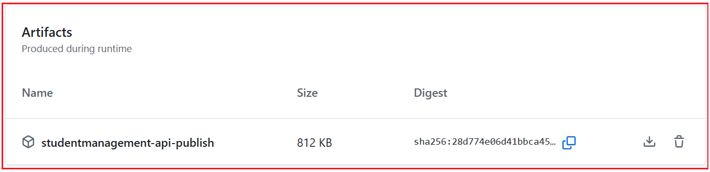
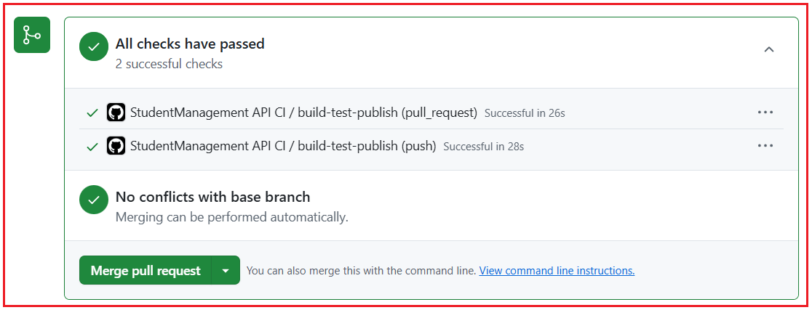
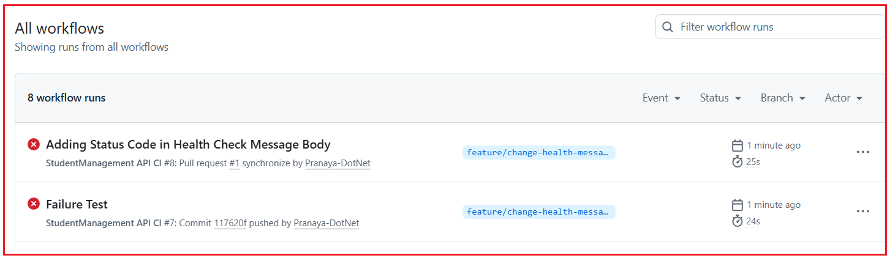

## **مقدمه‌ای بر خطوط لوله CI/CD در .NET**

وقتی مبتدیان شروع به یادگیری توسعه دات‌نت می‌کنند، معمولاً فقط روی نوشتن کد در ویژوال استودیو تمرکز می‌کنند. آنها کنترلرها، مدل‌ها، سرویس‌ها و APIها را ایجاد می‌کنند، برنامه را به صورت محلی اجرا می‌کنند و احساس می‌کنند که کار تمام شده است. اما در توسعه نرم‌افزار در دنیای واقعی، نوشتن کد تنها بخشی از کار است. پس از نوشتن کد، ما همچنین باید آن را بسازیم، آزمایش کنیم، منتشر کنیم و روی یک سرور مستقر کنیم تا کاربران بتوانند به آن دسترسی داشته باشند.

اینجاست که CI/CD بسیار مهم می‌شود. CI/CD به ما کمک می‌کند تا فرآیند انتقال کد از دستگاه توسعه‌دهنده به سرور زنده را خودکار کنیم. به جای انجام همه کارها به صورت دستی و بارها و بارها، ما یک گردش کار مناسب ایجاد می‌کنیم. این گردش کار باعث می‌شود فرآیند در پروژه‌های واقعی سریع‌تر، ایمن‌تر، حرفه‌ای‌تر و مدیریت آن بسیار آسان‌تر شود.

#### **چرا CI/CD؟**

یک مبتدی ممکن است اینطور فکر کند:

- من کد را نوشتم، آن را به صورت محلی اجرا کردم و کار می‌کند. بنابراین، کار تمام است.

اما در یک شرکت واقعی، این کافی نیست. کد باید به یک مخزن ارسال شود، به درستی بررسی شود، آزمایش شود، منتشر شود و سپس مستقر شود. اگر این فرآیند به درستی انجام نشود، مشکلات زیادی ممکن است رخ دهد. ممکن است برنامه روی سرور از کار بیفتد، فایل‌های اشتباه مستقر شوند، ممکن است ساخت پس از ادغام کد با شکست مواجه شود، یا ممکن است یک اشکال کوچک به مرحله تولید برسد زیرا هیچ کس آن را به درستی آزمایش نکرده است. برای درک بهتر، لطفاً به تصویر زیر نگاهی بیندازید.


##### **یک قیاس ساده در زمان واقعی**

بیایید CI/CD را با یک تشبیه ساده به رستوران درک کنیم. فرض کنید مشتری در یک رستوران سفارشی ثبت می‌کند.

غذا بلافاصله پس از دریافت سفارش سرو نمی‌شود. ابتدا آشپزخانه آن را آماده می‌کند، بررسی می‌کند که آیا همه مواد اولیه موجود است یا خیر، آن را می‌پزد، کیفیت آن را تأیید می‌کند، به درستی بسته‌بندی می‌کند و سپس برای مشتری ارسال می‌کند.

تحویل نرم‌افزار نیز به همین شکل عمل می‌کند.

- نوشتن کد مثل آماده کردن غذاست.
- ساخت پروژه مانند بررسی این است که آیا همه چیز برای پخت و پز آماده است یا خیر.
- آزمایش مانند بررسی کیفیت است.
- انتشار کتاب مثل بسته‌بندی غذاست.
- استقرار مانند تحویل آن به مشتری است.

CI/CD به خودکارسازی کل این جریان کمک می‌کند تا هر سفارش به روشی استاندارد و قابل اعتماد مدیریت شود.

#### **ادغام مداوم (CI) چیست؟**

ادغام مداوم یا CI، روشی است که به طور منظم تغییرات کد را به یک مخزن مشترک اضافه می‌کند و به طور خودکار بررسی می‌کند که آیا پروژه هنوز به درستی کار می‌کند یا خیر. به زبان ساده، هر زمان که یک توسعه‌دهنده کدی می‌نویسد و آن را به GitHub ارسال می‌کند، سیستم باید به طور خودکار موارد مهمی مانند موارد زیر را تأیید کند:

- آیا کد به درستی کامپایل می‌شود؟
- آیا همه بسته‌های مورد نیاز موجود است؟
- آیا پروژه با موفقیت در حال ساخت است؟
- آیا آزمون‌ها با موفقیت پشت سر گذاشته می‌شوند؟
- آیا برنامه هنوز در وضعیت سالمی است؟

اگر این بررسی‌ها هر زمان که تغییرات کد اعمال می‌شوند، به‌طور خودکار انجام شوند، به آن ادغام مداوم می‌گویند.

 چیست؟")

این بسیار مهم است زیرا در پروژه‌های واقعی، ممکن است چندین توسعه‌دهنده روی یک برنامه کار کنند. یک توسعه‌دهنده ممکن است یک کلاس سرویس را تغییر دهد، دیگری ممکن است یک مدل را به‌روزرسانی کند و دیگری ممکن است پیکربندی را تغییر دهد. حتی اگر همه چیز روی دستگاه یک نفر کار کند، کد ترکیبی نهایی ممکن است با شکست مواجه شود. CI به ما کمک می‌کند تا این مشکلات را زود تشخیص دهیم.

##### **مثال بلادرنگ از CI در .NET**

فرض کنید روی یک پروژه ASP.NET Core Web API کار می‌کنید. تغییرات زیر را اعمال می‌کنید:

- اضافه کردن یک کنترلر جدید
- اصلاح یک DTO
- به‌روزرسانی یک متد سرویس
- تغییر منطق اعتبارسنجی

این پروژه روی دستگاه محلی شما به خوبی اجرا می‌شود.

حالا کد را به گیت‌هاب ارسال می‌کنید. در آن لحظه، یک خط لوله CI می‌تواند به طور خودکار موارد زیر را انجام دهد:

- بازیابی بسته‌های NuGet
- راه حل را بسازید
- اجرای تست‌های واحد
- بررسی کنید که آیا انتشار امکان‌پذیر است یا خیر

اگر هر یک از این مراحل با شکست مواجه شود، خط لوله متوقف شده و به شما اطلاع می‌دهد که مشکلی وجود دارد. این خیلی بهتر از آن است که بعداً در حین استقرار، مشکل کشف شود.

##### **چرا CI مهم است؟**

هوش رقابتی (CI) مهم است زیرا بازخورد سریعی ارائه می‌دهد. به جای اینکه تا آخرین لحظه برای کشف مشکل منتظر بمانیم، سیستم بلافاصله به ما اطلاع می‌دهد. این باعث صرفه‌جویی در زمان و کاهش ریسک می‌شود.

بدون CI:

- توسعه‌دهندگان ممکن است کد ناقص را منتشر کنند
- مشکلات ادغام ممکن است پنهان بمانند
- ممکن است اشکالات به مراحل بعدی منتقل شوند
- انتشارها استرس‌زا می‌شوند

با سی آی:

- مشکلات زود تشخیص داده می‌شوند
- کیفیت کد بهبود می‌یابد
- پروژه سالم‌تر باقی می‌ماند
- تیم اعتماد به نفس بیشتری پیدا می‌کند

#### **تحویل مداوم (CD) چیست؟**

تحویل مداوم به این معنی است که پس از ساخت و آزمایش موفقیت‌آمیز کد، به طور خودکار آماده و برای استقرار آماده نگه داشته می‌شود. این بدان معناست که برنامه همیشه در حالت قابل استقرار است.

به زبان ساده:

- **CI بررسی می‌کند که آیا برنامه سالم است یا خیر.**
- **CD تضمین می‌کند که برنامه آماده انتشار است.**

در یک پروژه .NET، این معمولاً به این معنی است که پس از اتمام موفقیت‌آمیز مراحل ساخت و آزمایش، برنامه منتشر شده و خروجی آماده برای استقرار تولید می‌شود.

 چیست؟")

**توجه:** این همیشه به این معنی نیست که استقرار به طور خودکار اتفاق می‌افتد. گاهی اوقات استقرار پس از تأیید، همچنان به صورت دستی آغاز می‌شود. به همین دلیل است که باید درک کنید که CD بیشتر در مورد **آمادگی برای استقرار** است تا خود استقرار.

##### **مثال بلادرنگ از CD در .NET**

فرض کنید ASP.NET Core Web API شما مراحل CI را پشت سر گذاشته است. اکنون سیستم مرحله انتشار را انجام می‌دهد و خروجی نهایی را که می‌تواند در IIS مستقر شود، ایجاد می‌کند. این خروجی منتشر شده ممکن است شامل موارد زیر باشد:

- فایل‌های برنامه کامپایل شده
- وابستگی‌های مورد نیاز
- فایل‌های آماده پیکربندی
- بسته یا مصنوع قابل گسترش

اکنون برنامه آماده انتقال به سرور است. این آمادگی، ایده اصلی پشت تحویل مداوم (Continuous Delivery) است.

#### **تفاوت بین تحویل مداوم و استقرار مداوم**

این دو اصطلاح بسیاری از مبتدیان را گیج می‌کند؛ بیایید آنها را به روشنی درک کنیم. برای درک بهتر، لطفاً به تصویر زیر نگاهی بیندازید:


##### **تحویل مداوم**

در تحویل مداوم:

- ساخت به طور خودکار اتفاق می‌افتد
- تست‌ها به صورت خودکار اجرا می‌شوند
- انتشار خروجی به طور خودکار ایجاد می‌شود
- برنامه برای استقرار آماده نگه داشته می‌شود
- استقرار نهایی محصول ممکن است هنوز نیاز به تأیید دستی داشته باشد

##### **استقرار مداوم**

در استقرار مداوم:

- ساخت به طور خودکار اتفاق می‌افتد
- تست‌ها به صورت خودکار انجام می‌شوند
- انتشار به صورت خودکار اتفاق می‌افتد
- استقرار نیز به صورت خودکار و بدون تأیید دستی انجام می‌شود.

**بنابراین** :

- **تحویل مداوم** می‌گوید: همه چیز آماده است. هر زمان که شما تأیید کنید، مستقر شوید.
- **استقرار مداوم** می‌گوید: همه چیز آماده است، پس فوراً مستقر شوید.

##### **درک بلادرنگ**

در بسیاری از شرکت‌های واقعی:

- محیط توسعه یا آزمایش ممکن است از استقرار خودکار استفاده کند.
- محیط تولید ممکن است قبل از استقرار، نیاز به تأیید دستی داشته باشد.

به همین دلیل است که تحویل مداوم در مجموعه‌های تولید حرفه‌ای رایج‌تر است.

#### **تفاوت بین استقرار دستی و استقرار خودکار**

بیایید بفهمیم استقرار دستی چیست، مشکلات مرتبط با استقرار دستی چیست و چگونه می‌توان با استقرار خودکار بر مشکل غلبه کرد.

##### **استقرار دستی**

در استقرار دستی، توسعه‌دهنده تمام مراحل را با دست انجام می‌دهد. برای مثال:

- پروژه را در ویژوال استودیو باز کنید
- ساخت پروژه
- پروژه را منتشر کنید
- کپی کردن فایل‌ها در پوشه سرور
- در صورت نیاز، سایت یا برنامه IIS را متوقف کنید
- فایل‌های قدیمی را جایگزین کنید
- IIS را مجدداً راه اندازی کنید
- API را به صورت دستی تست کنید

این رویکرد ممکن است برای پروژه‌های کوچک جواب بدهد، اما مشکلات زیادی دارد.

##### **مشکلات مربوط به نصب دستی**

اگر از رویکرد استقرار دستی استفاده می‌کنید، ممکن است با مشکلات زیر روبرو شوید:

- ممکن است کسی یک مرحله را فراموش کند
- ممکن است فایل‌های اشتباه کپی شده باشند
- خروجی اشکال‌زدایی ممکن است به جای انتشار، مستقر شود.
- ممکن است فایل‌های پیکربندی از دست رفته باشند
- توسعه‌دهندگان مختلف ممکن است مراحل متفاوتی را دنبال کنند
- استقرار کند و مستعد خطا می‌شود
- بازگشت به حالت اولیه دشوار می‌شود

حال، بیایید بفهمیم که چگونه می‌توانیم با استقرار خودکار، که رویکرد پیشنهادی در توسعه نرم‌افزار امروزی است، بر مشکلات فوق غلبه کنیم.

##### **استقرار خودکار**

در استقرار خودکار، مراحل یک بار در یک خط لوله تعریف می‌شوند و سپس هر بار به همان روش اجرا می‌شوند. برای مثال:

- کد به گیت‌هاب ارسال می‌شود
- خط لوله به طور خودکار شروع می شود
- ساخت پروژه به صورت خودکار
- اجرای تست به صورت خودکار
- انتشار خروجی ایجاد شده است
- اسکریپت استقرار، فایل‌ها را در IIS یا هر وب‌سروری که برنامه خود را در آن میزبانی می‌کنید، کپی می‌کند.
- در صورت نیاز، IIS یا وب سرور مجدداً راه‌اندازی می‌شود.
- اعتبارسنجی پس از استقرار اجرا می‌شود

این رویکرد خطاهای انسانی را کاهش داده و ثبات ایجاد می‌کند.

#### **چرا CI/CD در پروژه‌های ASP.NET Core Web API مهم است؟**

پروژه‌های ASP.NET Core Web API اغلب به عنوان backend برنامه‌های وب، برنامه‌های تلفن همراه، پنل‌های مدیریتی، سیستم‌های سازمانی و میکروسرویس‌ها استفاده می‌شوند. این برنامه‌ها معمولاً به دلیل اضافه شدن ویژگی‌های جدید، اصلاحات و به‌روزرسانی‌ها به طور مرتب، مرتباً تغییر می‌کنند. اگر هر تغییر باید به صورت دستی اعمال شود، این فرآیند دردناک می‌شود.

CI/CD به این دلیل اهمیت پیدا می‌کند که به روش‌های زیر کمک می‌کند:

- به طور خودکار بررسی می‌کند که آیا کد معتبر است یا خیر.
- این کار تلاش دستی را کاهش می‌دهد.
- روند آزادسازی را سرعت می‌بخشد.
- قبل از استقرار، اعتماد ایجاد می‌کند.
- این باعث می‌شود فرآیند توسعه حرفه‌ای‌تر شود.

برای درک بهتر، لطفاً به تصویر زیر نگاهی بیندازید.


##### **سناریوی بلادرنگ**

تصور کنید تیم شما در حال ساخت یک رابط برنامه‌نویسی کاربردی وب برای تجارت الکترونیک است. یک توسعه‌دهنده منطق محصول را به‌روزرسانی می‌کند. دیگری پردازش سفارش را به‌روزرسانی می‌کند. دیگری تغییرات احراز هویت را اضافه می‌کند. اکنون همه این تغییرات در گیت‌هاب ادغام می‌شوند. بدون CI/CD، تیم ممکن است فقط در زمان استقرار، مشکلات را کشف کند.

###### **با CI/CD:**

- پروژه به صورت خودکار ساخته می‌شود.
- تست‌ها به صورت خودکار اجرا می‌شوند.
- خروجی انتشار تولید می‌شود.
- استقرار می‌تواند به روشی استاندارد اتفاق بیفتد.

این باعث می‌شود که نگهداری پروژه بسیار آسان‌تر شود.

#### **جریان سرتاسری CI/CD: کد → گیت‌هاب → ساخت → تست → انتشار → استقرار**

این مهم‌ترین تصویرسازی در خط لوله CI/CD است. کد → گیت‌هاب → ساخت → تست → انتشار → استقرار. بیایید ادامه دهیم و جریان را با جزئیات درک کنیم.


##### **مرحله ۱: کدنویسی**

همه چیز با کدی که در ویژوال استودیو نوشته شده شروع می‌شود. این کد می‌تواند شامل موارد زیر باشد:

- کنترل‌کننده‌ها
- خدمات
- مخازن
- مدل‌ها
- DTO ها
- میان‌افزار
- پیکربندی
- آزمایش‌ها

##### **مرحله ۲: گیت**

پس از انجام کار، توسعه‌دهنده تغییرات را با استفاده از Git ثبت می‌کند. Git یک سیستم کنترل نسخه است که به عنوان مخزن محلی نیز عمل می‌کند و به ردیابی تغییرات و حفظ تاریخچه نسخه پروژه کمک می‌کند.

##### **مرحله ۳: گیت‌هاب**

کد به گیت‌هاب ارسال می‌شود. گیت‌هاب یک مخزن از راه دور است که به عنوان مخزن مرکزی نیز عمل می‌کند و کدها در آن ذخیره و بین تیم‌ها به اشتراک گذاشته می‌شوند.

##### **مرحله ۴: ساخت**

پس از اینکه کد به گیت‌هاب ارسال شد، پایپ‌لاین شروع می‌شود. مرحله ساخت در پایپ‌لاین بررسی می‌کند که آیا پروژه با موفقیت کامپایل شده است یا خیر. اگر پروژه ساخته نشود، پایپ‌لاین بلافاصله با شکست مواجه می‌شود.

##### **مرحله ۵: آزمایش**

اگر ساخت با موفقیت انجام شود، تست‌های خودکار اجرا می‌شوند. این کار تأیید می‌کند که برنامه هنوز به درستی کار می‌کند.

##### **مرحله ۶: انتشار**

اگر هر دو مرحله ساخت و آزمایش با موفقیت پشت سر گذاشته شوند، برنامه منتشر می‌شود. در دات‌نت، انتشار به معنای تولید فایل‌های نهایی مورد نیاز برای استقرار است.

##### **مرحله 7: استقرار**

فایل‌های منتشر شده سپس در سرور هدف، مانند IIS یا Microsoft Azure، مستقر می‌شوند. پس از استقرار، کاربران می‌توانند به برنامه‌ی به‌روزرسانی‌شده دسترسی داشته باشند.

#### **ابزارهای مورد استفاده در راه‌اندازی CI/CD ما**

ابزارهای اصلی که در راه‌اندازی CI/CD خود استفاده خواهیم کرد عبارتند از Visual Studio، Git، GitHub، GitHub Actions و IIS.

##### **ویژوال استودیو: ایجاد، نوشتن، اجرا و اشکال‌زدایی یک برنامه**

ویژوال استودیو جایی است که ما برنامه ASP.NET Core Web API خود را ایجاد، می‌نویسیم، اجرا و اشکال‌زدایی می‌کنیم. این ابزار توسعه اصلی ما است.

##### **گیت: مخزن محلی**

گیت (Git) یک سیستم کنترل نسخه (Version Control System) است، نرم‌افزاری که باید روی دستگاه خود نصب کنیم. این نرم‌افزار به ما کمک می‌کند تا تغییرات کد منبع را با استفاده از عملیاتی مانند موارد زیر مدیریت کنیم:

- متعهد شدن
- فشار دهید
- بکشید
- شعبه
- ادغام

##### **گیت‌هاب: مخزن از راه دور**

گیت‌هاب یک مخزن از راه دور است که ما مخزن پروژه را به صورت آنلاین در آن میزبانی می‌کنیم. این مکانی است که توسعه‌دهندگان کد را ارسال می‌کنند و گردش‌های کاری اتوماسیون می‌توانند از آنجا شروع شوند.

##### **اقدامات گیت‌هاب: خودکارسازی گردش کار**

GitHub Actions ابزاری برای اتوماسیون در GitHub است که برای ایجاد گردش‌های کاری CI/CD استفاده می‌شود. این ابزار می‌تواند به طور خودکار:

- بازیابی وابستگی‌ها
- ساخت پروژه
- اجرای تست‌ها
- انتشار خروجی
- مراحل استقرار تریگر

##### **IIS: میزبان برنامه**

IIS سروری است که ما ASP.NET Core Web API خود را در آن میزبانی خواهیم کرد. اکنون، ما از IIS به عنوان هدف نهایی استقرار استفاده می‌کنیم. بعداً، از Azure استفاده خواهیم کرد.

#### **مشکلات رایج بلادرنگ که توسط CI/CD حل می‌شوند**

برخی از مشکلات بسیار رایج که توسط CI/CD حل می‌شوند عبارتند از:

- روی سیستم خودم کار می‌کنه، ولی روی سرور نه.
- کسی فراموش کرد که آزمایش‌ها را انجام دهد.
- فایل‌های اشتباه مستقر شدند.
- این پروژه پس از ادغام کد با شکست مواجه شد.
- مراحل استقرار هر بار متفاوت بود.
- یک اشکال به مرحله تولید رسید زیرا هیچ کس به درستی بررسی نکرد.
- تیم با انجام کارهای دستی مکرر، زمان زیادی را تلف کرد.

اینها اشتباهات انسانی عادی در استقرار دستی هستند. CI/CD با ایجاد یک گردش کار خودکار استاندارد، چنین مشکلاتی را کاهش می‌دهد.

##### **یک مثال ساده بلادرنگ .NET**

بگذارید یک مثال ساده بزنیم. فرض کنید شما در حال توسعه یک پروژه مدیریت دانش‌آموزی با استفاده از ASP.NET Core Web API هستید. شما تغییراتی در موارد زیر ایجاد می‌کنید:

- کنترل‌کننده دانشجویی
- خدمات دانشجویی
- کلاس‌های DTO

سپس کد را به GitHub ارسال می‌کنید.

اکنون خط لوله شروع به کار می‌کند و این مراحل را به طور خودکار انجام می‌دهد:

- بازیابی بسته‌ها
- راه حل را بسازید
- اجرای تست‌ها
- پروژه را منتشر کنید
- استقرار در IIS
- بررسی کنید که آیا API پاسخ می‌دهد یا خیر

اگر مشکلی پیش بیاید، سیستم دقیقاً به شما می‌گوید که مشکل از کجا رخ داده است. این خیلی بهتر از این است که همه چیز را به صورت دستی اجرا کنید و بعداً متوجه مشکلات شوید.

##### **نتیجه‌گیری:**

در این فصل، ایده اولیه CI/CD را به روشی بسیار کاربردی درک کردیم. یاد گرفتیم که توسعه نرم‌افزار پس از نوشتن کد به پایان نمی‌رسد. کد همچنین باید به درستی تأیید، بسته‌بندی و مستقر شود. یکپارچه‌سازی مداوم به ما کمک می‌کند تا تغییرات کد را به طور خودکار اعتبارسنجی کنیم، در حالی که تحویل مداوم به ما کمک می‌کند تا برنامه را برای انتشار آماده نگه داریم.

ما همچنین تفاوت بین استقرار دستی و استقرار خودکار، اهمیت CI/CD در پروژه‌های ASP.NET Core Web API، شکل کلی گردش کار، ابزارهای مورد نیاز و مشکلات رایجی که CI/CD در پروژه‌های واقعی حل می‌کند را درک کردیم. این فصل پایه و اساس هر آنچه در ادامه این دوره می‌آید را بنا می‌کند.
```

```markdown
## **ساخت خط لوله ادغام مداوم (CI) با اقدامات GitHub**

در این فصل، ما فرآیند ساخت و آزمایش پروژه ASP.NET Core Web API خود را با استفاده از GitHub Actions خودکار خواهیم کرد. به جای ساخت و آزمایش دستی پروژه هر بار، یک pipeline ایجاد خواهیم کرد که هر زمان کد به GitHub ارسال می‌شود، به طور خودکار اجرا می‌شود. این اولین گام واقعی در اتوماسیون است. هر کاری که در فصل قبل به صورت دستی انجام دادیم (ساخت، آزمایش، انتشار) اکنون به طور خودکار در GitHub انجام خواهد شد.

##### **آنچه در این فصل انجام خواهیم داد**

در پایان این فصل، مخزن گیت‌هاب ما هر زمان که کد ارسال شود، کارهای زیر را به طور خودکار انجام خواهد داد:

- آخرین کد منبع را دانلود کنید
- نصب SDK مورد نیاز .NET 8
- بازیابی بسته‌های NuGet
- راه حل را بسازید
- اجرای تست‌ها
- انتشار API وب
- خروجی انتشار را به عنوان یک محصول گردش کار بارگذاری کنید

#### **گردش کار ادغام مداوم با GitHub Action:**

برای درک بهتر، لطفاً به تصویر زیر نگاهی بیندازید.

 با اقدامات GitHub")

##### **گردش کار را فعال کنید**

این خط لوله زمانی شروع می‌شود که یکی از این رویدادها اتفاق بیفتد:

- یک توسعه‌دهنده **کد را به صفحه اصلی ارسال می‌کند**
- یک توسعه‌دهنده **کد را به شاخه ویژگی ارسال می‌کند**
- یک توسعه‌دهنده یک **درخواست pull ایجاد یا به‌روزرسانی می‌کند که هدف آن صفحه اصلی است.**

این نقطه شروع در سمت چپ تصویر نشان داده شده است.

##### **گیت‌هاب تغییر کد را دریافت می‌کند**

پس از یک رویداد درخواست push یا pull، **GitHub Actions** عامل را تشخیص داده و به طور خودکار گردش کار را آغاز می‌کند . این بدان معناست که هر بار که کد تغییر می‌کند، نیازی به ساخت دستی نیست.

##### **کد تسویه حساب**

در این مرحله، گیت‌هاب آخرین فایل‌های مخزن را در دستگاه اجراکننده دانلود می‌کند. این مهم است زیرا اجراکننده به عنوان یک دستگاه خالی شروع می‌شود، بنابراین فایل‌های پروژه قبل از هر اتفاق دیگری باید ابتدا در آنجا کپی شوند.

##### **راه‌اندازی .NET SDK**

پس از آماده شدن کد، گیت‌هاب **.NET SDK را** روی runner نصب یا آماده می‌کند. این به دستگاه اجازه می‌دهد تا دستوراتی مانند dotnet restore، dotnet build، dotnet test و dotnet publish را درک و اجرا کند.

##### **بازیابی بسته‌های NuGet**

در مرحله بعد، گردش کار تمام **وابستگی‌های NuGet** مورد نیاز که توسط راهکار استفاده می‌شوند را دانلود می‌کند. بدون این مرحله، پروژه ممکن است شکست بخورد زیرا کتابخانه‌ها و بسته‌های مورد نیاز وجود نخواهند داشت.

##### **ساخت راهکار**

پس از بازیابی بسته‌ها، گیت‌هاب راه‌حل را کامپایل می‌کند. این مرحله بررسی می‌کند که آیا کد از نقطه نظر زمان کامپایل معتبر است یا خیر، مانند:

- خطاهای نحوی
- منابع گمشده
- نام‌های کلاس یا متد نامعتبر
- خرابی‌های کلی در ساخت و ساز

##### **انتشار API وب**

پس از موفقیت در ساخت، گردش کار **خروجی انتشار را** برای پروژه Web API ایجاد می‌کند. این نسخه آماده استقرار برنامه است که شامل فایل‌های کامپایل شده و محتوای زمان اجرا مورد نیاز برای استقرار بعدی است.

##### **مصنوع**

در نهایت، گیت‌هاب خروجی منتشر شده را به عنوان یک **مصنوع** ذخیره می‌کند . یک مصنوع صرفاً یک خروجی ذخیره شده است که توسط گردش کار تولید می‌شود. از آنجایی که دستگاه اجراکننده موقتی است و پس از اجرا از بین می‌رود، ذخیره خروجی به عنوان یک مصنوع تضمین می‌کند که بعداً می‌توانید:

- دانلودش کن
- آن را بررسی کنید
- استفاده مجدد از آن برای استقرار در مراحل بعدی

#### **اصطلاحات پایه‌ای اقدامات گیت‌هاب**

قبل از اینکه شروع به ساخت یک خط لوله CI/CD با GitHub Actions کنیم، باید چند اصطلاح مهم را به روشنی درک کنیم. به عبارت ساده، GitHub Actions مانند یک سیستم خودکار کوچک در مخزن GitHub ما کار می‌کند. ما تعریف می‌کنیم **که چه اتفاقی باید بیفتد** ، **چه زمانی باید بیفتد** و **کجا باید اجرا شود** . چهار اصطلاح مهمی که باید بدانیم **Workflow، Job، Step و Runner** هستند .

##### **گردش کار - فایل کامل اتوماسیون**

یک **گردش کار،** فایل اصلی اتوماسیون است که به گیت‌هاب می‌گوید چه وظایفی را انجام دهد. این فایل با **فرمت YAML** نوشته شده و در **پوشه .github/workflows/** مخزن ذخیره می‌شود.

می‌توانید یک گردش کار را به عنوان **تعریف کامل خط لوله** در نظر بگیرید . این به GitHub می‌گوید:

- چه زمانی شروع کنیم
- چه شغل‌هایی را اداره کنیم
- هر کار باید چه مراحلی را انجام دهد

برای مثال، یک گردش کار می‌تواند به گیت‌هاب بگوید:

- اجرا شدن زمانی که کد به صفحه اصلی ارسال می‌شود
- ساخت پروژه
- اجرای تست‌ها
- انتشار برنامه

##### **شغل - گروهی از وظایف مرتبط**

یک **کار** مجموعه‌ای از مراحل است که با هم در یک اجراکننده اجرا می‌شوند. درون یک گردش کار، می‌توانیم یک یا چند کار را بسته به نیازهایمان تعریف کنیم. یک کار به سازماندهی کار در بخش‌های منطقی کمک می‌کند.

برای مثال، یک گردش کار ممکن است شامل موارد زیر باشد:

- یک **کار ساختمانی**
- یک **کار آزمایشی**
- یک **کار استقرار**

کارها می‌توانند اجرا شوند:

- **یکی پس از دیگری** ، وقتی یک شغل به شغل دیگر وابسته است
- **به طور موازی** ، وقتی مشاغل مستقل هستند

##### **مرحله - یک اقدام واحد در داخل یک کار**

یک **مرحله** کوچکترین واحد کاری در داخل یک کار است. هر مرحله یک عمل خاص را انجام می‌دهد. یک کار از چندین مرحله تشکیل شده است که به ترتیب انجام می‌شوند.

برای مثال، یک کار ممکن است شامل مراحلی مانند موارد زیر باشد:

- کد منبع پرداخت
- نصب .NET SDK
- بازیابی بسته‌های NuGet
- راه حل را بسازید
- اجرای تست‌ها
- انتشار برنامه

هر مرحله فقط یک بخش از کار کلی را انجام می‌دهد. به زبان ساده، یک مرحله یک **دستورالعمل یا فرمان واحد** است که به تکمیل کار کمک می‌کند.

##### **دونده - دستگاهی که گردش کار را اجرا می‌کند**

یک **اجراکننده (runner)** ماشینی است که در واقع وظیفه گردش کار (workflow job) در آن اجرا می‌شود. گیت‌هاب (GitHub) برای اجرای دستوراتی مانند dotnet restore، dotnet build یا dotnet test به یک ماشین نیاز دارد. آن ماشین، اجراکننده (runner) نامیده می‌شود.

- استفاده خواهیم کرد . **در مورد ما، از یک runner میزبانی شده توسط GitHub** به نام ubuntu-latest
- این یعنی گیت‌هاب به‌طور خودکار یک ماشین لینوکس موقت برای ما فراهم می‌کند.
- آن ماشین با شروع گردش کار ایجاد می‌شود و برای اجرای مراحل کار مورد استفاده قرار می‌گیرد.

##### **درک ساده و بلادرنگ**

برای اینکه راحت‌تر بشه، اینجوری در نظر بگیرید:

- **گردش کار** \= طرح کامل
- **شغل** \= یکی از بخش‌های اصلی طرح
- **مرحله** \= یک کار در داخل آن طرح
- **دونده** \= دستگاه یا کارگری که کار را انجام می‌دهد

بنابراین، وقتی GitHub Actions اجرا می‌شود:

- گردش **کار** شروع می‌شود
- انجام می‌دهد **یک یا چند کار را**
- هر کار شامل چندین **مرحله است**
- آن شغل‌ها با **سرعتی بالا اجرا می‌شوند**

#### **مرحله ۱: ابتدا یک پروژه آزمایشی بسیار کوچک اضافه کنید**

از آنجایی که خط لوله CI ما تست‌ها را اجرا خواهد کرد، بهتر است حداقل یک تست واحد ساده ایجاد کنیم.

##### **ایجاد پروژه تست xUnit در ویژوال استودیو**

درون همان راهکار:

- روی راه حل کلیک راست کنید
- کلیک کنید **روی افزودن**
- کلیک کنید **روی پروژه جدید**
- را انتخاب کنید **پروژه تست xUnit**
- نام آن را **StudentManagement.API.Tests بگذارید.**
- را انتخاب کنید **دات نت ۸**
- کلیک کنید **روی ایجاد**

حالا یک مرجع پروژه اضافه کنید:

- کلیک راست کنید. **روی StudentManagement.API.Tests**
- کلیک کنید **روی افزودن**
- کلیک کنید **روی مرجع پروژه**
- را انتخاب کنید . **StudentManagement.API**
- کلیک کنید **روی تأیید**

این باعث می‌شود پروژه آزمایشی بتواند به StudentService دسترسی داشته باشد.

##### **مرحله ۲: اضافه کردن یک تست واحد ساده**

یک فایل آزمایشی در پروژه آزمایشی ایجاد یا به‌روزرسانی کنید، برای مثال، **StudentServiceTests.cs** . این آزمایش عمداً ساده است. هدف ما در اینجا آزمایش پیشرفته نیست. هدف ما این است که مطمئن شویم خط لوله CI می‌تواند تأیید کند که ساخت سالم است و آزمایش‌ها در حال اجرا هستند.

```csharp
using StudentManagement.API.Services;

namespace StudentManagement.API.Tests
{
    public class StudentServiceTests
    {
        [Fact]
        public void GetAll_ShouldReturnSeededStudents()
        {
            // Arrange
            var service = new StudentService();

            // Act
            var students = service.GetAll();

            // Assert
            Assert.NotNull(students);
            Assert.NotEmpty(students);
            Assert.True(students.Count >= 2);
        }
    }
}
```

#### **مرحله ۳: کامیت کردن و ارسال پروژه آزمایشی**

قبل از ایجاد گردش کار، پروژه آزمایشی جدید را در GitHub ثبت کنید. از یک پیام ثبت مانند زیر استفاده کنید: **پروژه آزمایشی xUnit برای خط لوله CI اضافه شد**

تغییرات را به GitHub ارسال کنید تا مخزن شامل موارد زیر باشد:

- پروژه API
- پروژه آزمایشی
- فایل راه حل

#### **مرحله ۴: ایجاد پوشه و فایل گردش کار GitHub Actions**

در مخزن گیت‌هاب خود، ساختار پوشه زیر را ایجاد کنید: **.github/workflows/ci.yml** . این فایل شامل گردش کار خط لوله CI ما خواهد بود. لطفاً برای ایجاد فایل و پوشه، مراحل زیر را دنبال کنید:

در صفحه نمایش خود (قسمت بالا سمت راست)، موارد زیر را خواهید دید:

- **فایل را اضافه کنید** (کنار دکمه سبز «کد»). روی آن کلیک کنید.

سپس انتخاب کنید:

- **ایجاد فایل جدید**

حالا یک کادر برای وارد کردن نام فایل خواهید دید. دقیقاً تایپ کنید:

- **.github/workflows/ci.yml**

###### **چه اتفاقی به طور خودکار رخ می‌دهد**

وقتی اینو تایپ کردی:

- پوشه .github ایجاد خواهد شد.
- پوشه workflows درون آن ایجاد خواهد شد.
- فایل ci.yml ایجاد خواهد شد.

لازم نیست پوشه‌ها را جداگانه ایجاد کنید

#### **مرحله ۵: تصمیم بگیرید که گردش کار چه زمانی باید اجرا شود**

ما می‌خواهیم خط لوله CI در دو موقعیت رایج اجرا شود:

- وقتی کد به صفحه اصلی ارسال می‌شود
- وقتی یک درخواست pull، هدف اصلی را هدف قرار می‌دهد

#### **مرحله 6: ایجاد اولین گردش کار CI**

فایل YAML چیزی جز مجموعه‌ای از دستورالعمل‌ها نیست که گیت‌هاب هر زمان که یک رویداد خاص در مخزن رخ دهد، به طور خودکار از آنها پیروی می‌کند. می‌توانید آن را مانند این تصور کنید که به گیت‌هاب می‌گویید: هر زمان که من کدی را ارسال می‌کنم یا یک درخواست Pull ایجاد/به‌روزرسانی می‌کنم، کد پروژه من را بگیر، بسته‌های NuGet مورد نیاز را دانلود کن، آن را بساز، آزمایش کن، منتشر کن و خروجی را برای من آماده نگه دار. بنابراین، لطفاً YAML زیر را در فایل .github/workflows/ci.yml اضافه کنید، سپس کد را خواهیم فهمید:

```yaml
# Name of the workflow. You can give any name
name: StudentManagement API CI

on:
  # Run CI when code is pushed to main or any feature branch
  push:
    branches:
      - main
      - feature/**
  
  # Run CI when a pull request is created or updated for main
  pull_request:
    branches:
      - main

# A job is a group of steps. its internal key name is: build-test-publish
# display name is Build, Test, and Publish which is visible to user
# it will run on a machine which is a Linux machine ubuntu
jobs:
  build-test-publish:
    name: Build, Test, and Publish
    runs-on: ubuntu-latest

    # steps are the works or tasks done inside a job
    steps:
      # Step 1: Download the repository code 
      - name: Checkout source code
        uses: actions/checkout@v5

      # Step 2: Install .NET 8 SDK
      - name: Setup .NET 8 SDK
        uses: actions/setup-dotnet@v5
        with:
          dotnet-version: '8.0.x'

      # Step 3: Restore NuGet packages
      - name: Restore dependencies
        run: dotnet restore StudentManagement.API.sln

      # Step 4: Build the solution in Release mode
      - name: Build solution
        run: dotnet build StudentManagement.API.sln --configuration Release --no-restore

      # Step 5: Run unit tests
      - name: Run tests
        run: dotnet test StudentManagement.API.sln --configuration Release --no-build --verbosity normal

      # Step 6: Publish the API project
      - name: Publish Web API
        run: dotnet publish StudentManagement.API/StudentManagement.API.csproj --configuration Release --output ./publish --no-build

      # Step 7: Store the publish output as an artifact
      - name: Upload publish artifact
        uses: actions/upload-artifact@v6
        with:
          name: studentmanagement-api-publish
          path: ./publish
```

#### **مرحله ۷: درک YAML**

حالا، بیایید روند کار را خط به خط بررسی کنیم.

##### **۱: نام**

**نام: StudentManagement API CI**

این نام نمایشی است که در تب GitHub **Actions** ظاهر می‌شود . این نام شبیه به نامگذاری یک پوشه، سند یا پروژه است، بنابراین می‌توانید به راحتی آن را شناسایی کنید.

##### **۲: روشن**

**on:  
  push:  
    branches:  
      - main  
      - feature/**  
  pull_request:  
    branches:  
      - main**

این یکی از مهم‌ترین بخش‌ها است. این به گیت‌هاب می‌گوید: **این گردش کار چه زمانی باید شروع شود؟** بنابراین، **on** به معنای **شرط شروع** است . این گردش کار در دو حالت شروع می‌شود.

###### **مورد ۱: فشار دادن**

**push:  
  branches:  
    - main  
    - feature/***

این یعنی، وقتی کد به مسیر زیر ارسال شد، گردش کار را اجرا کن:

- main
- هر شاخه‌ای که با feature/ شروع شود

مثال‌ها:

- feature/add-health-endpoint
- feature/fix-student-service-issue
- feature/change-health-message

همه این موارد با feature/** مطابقت دارند.

###### **مورد ۲: درخواست pull**

**pull_request:  
  branches:  
    - main**

ایجاد یا به‌روزرسانی می‌شود، گردش کار را اجرا کن **این یعنی وقتی یک درخواست pull برای شاخه اصلی** .

مثال:

- شاخه منبع = feature/change-health-message
- شاخه هدف = شاخه اصلی

سپس گردش کار اجرا می‌شود.

##### **۳: مشاغل**

**jobs:  
  build-test-publish:**

یک کار (job) گروهی از مراحل است. گردش کار ما در حال حاضر **یک کار (job)** دارد و نام کلید داخلی آن **build-test-publish است.**

این چیزی نیست که کاربران عمدتاً روی صفحه نمایش می‌بینند. بیشتر شبیه شناسه داخلی شغل است. اگر کل گردش کار یک امتحان کامل باشد، پس هر شغل یک برگه از آن امتحان است. درون آن برگه، سوالات زیادی وجود دارد. آن سوالات، مراحل شما هستند.

##### **۴: نام شغل**

**name: Build, Test, and Publish**

این نام نمایشی کار است. وقتی اجرای گردش کار را در GitHub Actions باز می‌کنیم، این نام را روی صفحه خواهیم دید.

بنابراین:

- build-test-publish = شناسه‌ی داخلی کار
- ساخت، آزمایش و انتشار = نمایش نام در رابط کاربری

##### **۵: اجرا می‌شود**

**runs-on: ubuntu-latest**

این به گیت‌هاب می‌گوید که کدام دستگاه باید کار گردش کار ما را اجرا کند. گیت‌هاب یک دستگاه موقت برای اجرای مراحل در اختیار ما قرار می‌دهد. در اینجا، آن دستگاه **ubuntu-latest** است . این بدان معناست که گیت‌هاب یک دستگاه لینوکس ایجاد می‌کند و گردش کار ما را روی آن اجرا می‌کند.

###### **چرا ماشین؟**

کد ما در گیت‌هاب ذخیره شده است، اما گیت‌هاب هنوز برای اجرای دستوراتی مانند موارد زیر به یک دستگاه نیاز دارد:

- dotnet restore
- dotnet build
- dotnet test

می‌گویند **به آن دستگاه، دونده** .

##### **۶: بخش مراحل**

**steps:**

این یعنی، درون این کار، این وظایف را یکی یکی انجام دهید. هر وظیفه با - name: شروع می‌شود. بنابراین، از این نقطه به بعد، گیت‌هاب هر مرحله را به ترتیب انجام می‌دهد. نام مراحل **ثابت نیست** . آنها فقط برای نمایش و خوانایی در GitHub Actions هستند.

###### **نکته بسیار مهم**

این مراحل به ترتیب اجرا می‌شوند. بنابراین، اگر یک مرحله با شکست مواجه شود، مرحله بعدی معمولاً ادامه نمی‌یابد.

مثال:

- اگر ساخت با شکست مواجه شود، تست‌ها اجرا نخواهند شد
- اگر تست‌ها با شکست مواجه شوند، انتشار اجرا نخواهد شد

این دقیقاً همان چیزی است که ما در CI می‌خواهیم.

##### **مرحله اول کار: بررسی کد منبع**

**- name: Checkout source code  
  uses: actions/checkout@v5**

این مرحله کد مخزن را در دستگاه اجراکننده دانلود می‌کند. وقتی گیت‌هاب گردش کار را شروع می‌کند، دستگاه اجراکننده خالی است. این دستگاه به طور خودکار حاوی فایل‌های پروژه نیست. بنابراین، ابتدا، گیت‌هاب باید محتوای مخزن را در آن دستگاه کپی کند. این کاری است که **actions/checkout** انجام می‌دهد.

##### **مرحله دوم کار: راه‌اندازی .NET 8 SDK**

**- name: Setup .NET 8 SDK  
  uses: actions/setup-dotnet@v5  
  with:  
    dotnet-version: '8.0.x'**

این مرحله، .NET SDK مورد نیاز برای اجرای دستورات .NET را نصب یا آماده می‌کند. پروژه ما یک پروژه .NET 8 است. بنابراین، قبل از اینکه GitHub بتواند دستوراتی مانند موارد زیر را اجرا کند:

- dotnet restore
- dotnet build
- dotnet test
- dotnet publish

دستگاه اجراکننده باید .NET SDK صحیح را داشته باشد. این مرحله تضمین می‌کند که .NET 8 در دسترس است.

###### **چرا ۸.۰.x؟**

یعنی از دات‌نت ۸ استفاده کنید و آخرین نسخه پچ را نصب کنید.

مثال:

- ۸.۰.۱۰۰
- ۸.۰.۲۰۴
- ۸.۰.۳۰۰

بنابراین، ما می‌گوییم: من دات‌نت ۸ می‌خواهم، نه دات‌نت ۷ یا دات‌نت ۹.

##### **مرحله ۳ کار: بازیابی وابستگی‌ها**

**- name: Restore dependencies  
  run: dotnet restore StudentManagement.API.sln**

این مرحله تمام بسته‌های NuGet مورد نیاز برای راه‌حل را دانلود می‌کند. پروژه ما ممکن است به بسته‌هایی مانند موارد زیر وابسته باشد:

- Swashbuckle
- xUnit
- سایر بسته‌های NuGet

این بسته‌ها همیشه در مخزن ما ذخیره نمی‌شوند. در عوض، در صورت نیاز دانلود می‌شوند. این کاری است که dotnet restore انجام می‌دهد. بدون restore، ممکن است پروژه ما ساخته نشود زیرا بسته‌های مورد نیاز وجود ندارند.

##### **مرحله چهارم کار: ساخت راهکار**

**- name: Build solution  
  run: dotnet build StudentManagement.API.sln --configuration Release --no-restore**

این مرحله کد ما را کامپایل می‌کند. حالا گیت‌هاب بررسی می‌کند که آیا کل راه‌حل ما می‌تواند با موفقیت کامپایل شود یا خیر. این موارد را تأیید می‌کند:

- خطاهای نحوی
- منابع گمشده
- نام کلاس‌های اشتباه
- مشکلات زمان کامپایل

اگر خطای کامپایل وجود داشته باشد، این مرحله با شکست مواجه می‌شود.

###### **چرا - configuration Release؟**

زیرا در CI/CD، معمولاً می‌خواهیم پروژه را در **حالت Release** اعتبارسنجی کنیم ، که به حالت آماده برای استقرار نزدیک‌تر است.

###### **چرا – no-restore؟**

چون بازیابی در مرحله قبل انجام شده است. بنابراین، به گیت‌هاب می‌گوییم: دوباره بسته‌ها را دانلود نکن. همین الان بساز.

##### **مرحله ۵ کار: اجرای تست‌ها**

**- name: Run tests  
  run: dotnet test StudentManagement.API.sln --configuration Release --no-build --verbosity normal**

این مرحله تست‌های واحد ما را اجرا می‌کند. پس از اینکه کد با موفقیت ساخته شد، گیت‌هاب بررسی می‌کند که آیا به درستی عمل می‌کند یا خیر. اگر هر تستی با شکست مواجه شود، گردش کار با شکست مواجه می‌شود.

یک پروژه می‌تواند با موفقیت ساخته شود، اما همچنان دارای مشکلات منطقی باشد. مثال:

- API به درستی ساخته می‌شود
- اما یک متد سرویس، داده‌های اشتباه را برمی‌گرداند
- یا انتظار آزمون برآورده نشده است

بنابراین، ساخت، کامپایل را بررسی می‌کند، اما تست، رفتار را بررسی می‌کند.

###### **چرا - no-build؟**

چون راه‌حل در مرحله قبل ساخته شده است. بنابراین اینجا می‌گوییم، دوباره نسازید. فقط تست‌ها را اجرا کنید.

###### **verbosity normal چیست؟**

این مقدار، میزان اطلاعات نمایش داده شده در لاگ‌ها را کنترل می‌کند. مقدار normal خروجی خوانا و بدون جزئیات زیاد یا بیش از حد کوتاه ارائه می‌دهد.

##### **مرحله ششم کار: انتشار API وب**

**- name: Publish Web API  
  run: dotnet publish StudentManagement.API/StudentManagement.API.csproj --configuration Release --output ./publish --no-build**

این مرحله فایل‌های نهایی آماده برای استقرار برای Web API را ایجاد می‌کند.

- Build کد کامپایل شده ایجاد می‌کند.
- Publish یک قدم فراتر می‌رود و فایل‌هایی را که در واقع برای استقرار استفاده می‌شوند، آماده می‌کند.
- این فایل‌ها در داخل ‎./publish‎ قرار می‌گیرند.

بنابراین، گیت‌هاب پوشه‌ای به نام publish ایجاد می‌کند و خروجی استقرار را در آنجا ذخیره می‌کند.

###### **چرا ما فقط فایل ‎.csproj‎ را منتشر می‌کنیم و کل راه‌حل را منتشر نمی‌کنیم؟**

زیرا استقرار فقط برای **پروژه API** مورد نیاز است ، نه برای پروژه آزمایشی. به همین دلیل است که دستور انتشار، مسیر زیر را هدف قرار می‌دهد: **StudentManagement.API/StudentManagement.API.csproj**

###### **چرا - no-build؟**

زیرا پروژه قبلاً در مرحله قبل ساخته شده بود.

##### **مرحله 7 کار: آپلود و انتشار مصنوعات**

**- name: Upload publish artifact  
  uses: actions/upload-artifact@v6  
  with:  
    name: studentmanagement-api-publish  
    path: ./publish**

این مرحله، خروجی منتشر شده را پس از اتمام گردش کار در گیت‌هاب ذخیره می‌کند. دستگاه اجراکننده موقت است. پس از اتمام گردش کار، آن دستگاه از بین می‌رود. بنابراین، اگر پوشه انتشار را در جایی ذخیره نکنیم، از بین خواهد رفت. این مرحله به گیت‌هاب می‌گوید: لطفاً محتویات ./publish را نگه دارید و آنها را به عنوان یک مصنوع ذخیره کنید.

###### **مصنوع چیست؟**

یک مصنوع به سادگی یک فایل یا پوشه خروجی ذخیره شده است که توسط گردش کار تولید می‌شود. در مورد ما، مصنوع شامل موارد زیر است:

- فایل‌های API منتشر شده
- خروجی آماده برای استقرار

###### **چرا این مفید است؟**

زیرا بعداً می‌توانید:

- آن را از گیت‌هاب دانلود کنید
- خروجی را بررسی کنید
- از آن برای استقرار در فصل‌های بعدی استفاده کنید

##### **مرحله ۸: کامیت و پوش کردن فایل گردش کار**

اگر این فایل را در مخزن محلی خود ایجاد می‌کنید، آن را به GitHub ارسال کنید. از یک پیام commit مانند زیر استفاده کنید:

- اولین گردش کار GitHub Actions CI اضافه شد.
- آن را به گیت‌هاب ارسال کنید.

به محض اینکه فایل به GitHub در یک شاخه منطبق ارسال شود، GitHub Actions باید به طور خودکار گردش کار را آغاز کند.

**نکته:** در مورد ما، ما فایل را در گیت‌هاب ایجاد می‌کنیم، بنابراین تغییرات را اعمال می‌کنیم.

##### **مرحله ۹: اجرای گردش کار در گیت‌هاب را تماشا کنید**

مخزن خود را در گیت‌هاب باز کنید.

سپس:

- کلیک کنید **روی اقدامات**
- نام گردش کار را انتخاب کنید
- آخرین اجرا را باز کنید
- مراحل را یکی یکی اجرا کنید

#### **مرحله 10: دانلود و نمایش مصنوع منتشر شده**

پس از موفقیت‌آمیز بودن گردش کار، خلاصه اجرای گردش کار را باز کنید و به دنبال بخش مصنوعات بگردید. در آنجا باید عبارت **studentmanagement-api-publish را ببینید.**

گیت‌هاب مصنوعات حاصل از اجرای گردش کار را ذخیره می‌کند و امکان دانلود آنها را بعداً فراهم می‌کند.



فایل مصنوع را دانلود کنید، که باید شامل فایل‌های منتشر شده باشد. این همان نوع خروجی است که ما در فصل ۲ به صورت دستی ایجاد کردیم. تفاوت این است که اکنون GitHub Actions آن را به صورت خودکار ایجاد کرده است.

#### **مرحله 11: درخواست pull**

حالا، ماشه دوم را نشان خواهیم داد.

##### **مرحله الف: ایجاد یک شاخه جدید**

برای مثال، یک **شاخه feature/change-health-message** از شاخه اصلی محلی ایجاد کنید.

##### **مرحله ب: ایجاد یک تغییر کوچک در کد**

لطفا **کنترل کننده سلامت را** به شرح زیر اصلاح کنید:

```csharp
using Microsoft.AspNetCore.Mvc;

namespace StudentManagement.API.Controllers
{
    [Route("api/[controller]")]
    [ApiController]
    public class HealthController : ControllerBase
    {
        [HttpGet]
        public IActionResult Get()
        {
            return Ok(new
            {
                Code = 200,
                Status = "Healthy",
                Message = "Student Management API is running successfully."
            });
        }
    }
}
```

##### **مرحله ج: ثبت ویژگی در ویژوال استودیو**

حالا فقط این ویژگی را کامیت کنید تا کار کند.

**مراحل**

1. گیت را باز کنید **→ تغییرات گیت**
2. شما باید ببینید:
	- - کنترلرها **HealthController.cs** /
3. آنها را مرور کنید
4. مرحله بندی فایل ها
5. در کادر پیام کامیت، عبارت زیر را وارد کنید: **Adding Status Code in Health Check Message Body**
6. کلیک کنید **روی مرحله‌بندی‌شده‌ی کامیت**

##### **مرحله D: قرار دادن شاخه ویژگی‌ها در گیت‌هاب**

تا زمانی که شاخه در گیت‌هاب موجود نباشد، نمی‌توان PR (درخواست Pull) ایجاد کرد.

1. در شاخه بمانید: **feature/change-health-message**
2. بروید **به گیت**
3. کلیک کنید، **فشار دهید**

اگر این اولین ارسال به شاخه باشد، ویژوال استودیو آن را در گیت‌هاب منتشر می‌کند. پس از ارسال، شاخه اکنون در گیت‌هاب قابل مشاهده است.

##### **مرحله E: ایجاد یک درخواست Pull در گیت‌هاب**

حالا به گیت‌هاب بروید.

1. گیت‌هاب را در مرورگر باز کنید
2. مخزن را باز کنید: StudentManagement.API

##### **مرحله F:** باز کردن PR (Pull Request ) **صفحه ایجاد درخواست**

گیت‌هاب معمولاً بنری مانند «مقایسه و درخواست pull» را نشان می‌دهد. روی آن کلیک کنید.

##### **مرحله G: انتخاب شاخه‌ها**

تنظیم:

- **پایه** \= main
- **مقایسه** \= **feature/change-health-message**

این یعنی:

- کد را از **feature/change-health-message بگیرید**
- آن را در صفحه اصلی ادغام کنید

##### **مرحله هشتم: عنوان و توضیحات PR را وارد کنید**

حالا فرم Pull Request را به درستی پر کنید.

**عنوان روابط عمومی**

**افزودن کد وضعیت در متن پیام بررسی سلامت**

**توضیحات روابط عمومی**

این PR یک کد وضعیت به بدنه پیام بررسی سلامت اضافه می‌کند.

سپس **روی ایجاد درخواست pull کلیک کنید.** گردش کار باید اجرا شود و شما باید موارد زیر را مشاهده کنید.



گردش کار باید دوباره اجرا شود زیرا YAML شامل یک ماشه درخواست کشش (Pull Request) برای شاخه اصلی است. به این ترتیب تیم‌ها از ورود کد معیوب به شاخه اصلی جلوگیری می‌کنند. ساخت و آزمایش‌ها قبل از ادغام اجرا می‌شوند. این یکی از بزرگترین مزایای CI در دنیای واقعی است.

##### **مرحله ۱۲: درک شرایط موفقیت و شکست**

اجرای یک گردش کار تنها در صورتی موفقیت‌آمیز است که تمام مراحل مورد نیاز با موفقیت انجام شوند. در گردش کار CI ما:

- اگر بازیابی با شکست مواجه شود، کار متوقف می‌شود
- اگر ساخت با شکست مواجه شود، کار متوقف می‌شود
- اگر تست‌ها با شکست مواجه شوند، کار متوقف می‌شود
- اگر انتشار با شکست مواجه شود، کار متوقف می‌شود

این دقیقاً همان چیزی است که ما می‌خواهیم، ​​زیرا CI باید کدهای بد را زود مسدود کند. **در CI، خرابی مشکل نیست. خرابی پنهان مشکل واقعی است.**

##### **مرحله ۱۵: یک شکست عمدی ایجاد کنید**

را باز کنید **StudentController.cs** و یک خطای کامپایل کوچک مانند زیر ایجاد کنید:

- حذف نقطه ویرگول
- نام کلاس را اشتباه بنویسید
- استفاده از یک متغیر گمشده

حالا تغییر را کامیت کنید و به گیت‌هاب ارسال کنید. گردش کار باید در **مرحله ساخت راهکار** با شکست مواجه شود .



سپس لاگ‌ها را باز کنید، و باید خطا را ببینید. پس از آن، خطا را برطرف کنید و دوباره فشار دهید. خط لوله باید عبور کند.

##### **نتیجه‌گیری:**

در این فصل، ما اولین خط لوله ادغام مداوم خود را با استفاده از GitHub Actions برای پروژه .NET 8 ASP.NET Core Web API ایجاد کردیم. ما فهمیدیم که چگونه GitHub به طور خودکار بسته‌ها را بازیابی می‌کند، راه‌حل را می‌سازد، تست‌ها را اجرا می‌کند، برنامه را منتشر می‌کند و خروجی را به عنوان یک مصنوع هر زمان که کد ارسال می‌شود یا درخواست pull به‌روزرسانی می‌شود، ذخیره می‌کند. این به ما یک پایه عملی قوی برای فصل‌های بعدی می‌دهد، جایی که از ادغام مداوم به سمت اتوماسیون استقرار و پیاده‌سازی کامل CI/CD حرکت خواهیم کرد.
```

```markdown
## **مدیریت اسرار و پیکربندی در CI/CD**

در فصل قبل، ما یک خط لوله CI ساختیم که به طور خودکار برنامه ما را می‌سازد، آزمایش می‌کند و منتشر می‌کند. اکنون به یک موضوع بسیار مهم در دنیای واقعی می‌رسیم: **امنیت و مدیریت پیکربندی** . در پروژه‌های واقعی، ما هرگز اطلاعات حساس مانند رمزهای عبور پایگاه داده، کلیدهای API یا اعتبارنامه‌های استقرار را مستقیماً در کد یا فایل‌های YAML ذخیره نمی‌کنیم. در عوض، ما از مکانیسم‌های امنی مانند GitHub Secrets و پیکربندی مبتنی بر محیط استفاده می‌کنیم.

#### **در این فصل چه خواهیم کرد؟**

در پایان این فصل، کارهای عملی زیر را انجام خواهیم داد:

- بخش‌های پیکربندی تمیزی را به پروژه ASP.NET Core Web API خود اضافه کنید.
- تنظیمات غیر حساس را در فایل appsettings.json نگه دارید.
- مقادیر مختص به محیط را در فایل‌های appsettings.Development.json و appsettings.Production.json نگه دارید.
- متغیرهای گیت‌هاب را برای مقادیر CI/CD غیر حساس ایجاد کنید.
- برای مقادیر حساس، GitHub Secrets ایجاد کنید.
- ایجاد محیط‌های گیت‌هاب مانند توسعه و تولید
- متغیرها و رمزهای خاص محیط‌های گیت‌هاب را ایجاد کنید.
- گردش کار GitHub Actions را به‌روزرسانی کنید تا متغیرها و رمزها را با خیال راحت بخوانید.

این به ما یک پایه و اساس واضح برای اتوماسیون استقرار در فصل بعدی می‌دهد.

#### **مرحله ۱: ابتدا، بفهمید چه چیزی کجا می‌رود**

تنظیمات عادی در فایل‌های پیکربندی قرار می‌گیرند. مقادیر حساس در فایل‌های مخفی قرار می‌گیرند. مقادیر غیر حساس که فقط در خط لوله قرار دارند در متغیرها قرار می‌گیرند. قانون ساده:

- **appsettings.json** \= پیکربندی عادی برنامه.
- **appsettings.Development.json** \= مقادیر مخصوص توسعه.
- **appsettings.Production.json** \= مقادیر فقط برای تولید.
- **متغیرهای گیت‌هاب** \= مقادیر غیر حساس در خط لوله.
- **اسرار گیت‌هاب** \= مقادیر حساس پایپ‌لاین مانند رمزهای عبور، توکن‌ها، کلیدهای API و رشته‌های اتصال.
- **محیط‌های گیت‌هاب** \= رازها و متغیرهای مختص محیط.

#### **مرحله ۲: افزودن پیکربندی برنامه پاک به appsettings.json**

حالا، بیایید پیکربندی پروژه خود را بهبود بخشیم. appsettings.json را باز کنید و آن را به صورت زیر به‌روزرسانی کنید:

```json
{
  "ApplicationSettings": {
    "ApplicationName": "Student Management API",
    "SupportEmail": "support@demoapp.com"
  },
  "ExternalServices": {
    "StudentPortalBaseUrl": "https://localhost:7001"
  },
  "Logging": {
    "LogLevel": {
      "Default": "Information",
      "Microsoft.AspNetCore": "Warning"
    }
  },
  "AllowedHosts": "*"
}
```

این فایل باید فقط شامل مقادیر پیکربندی ایمن و عادی باشد. ذخیره مواردی مانند نام برنامه، آدرس اینترنتی پایه یا ایمیل پشتیبانی در اینجا اشکالی ندارد، به شرطی که مقادیر حساس نباشند.

#### **مرحله ۳: اضافه کردن پیکربندی مخصوص توسعه**

حالا **appsettings.Development.json** را باز کنید و مقادیری را اضافه کنید که هنگام اجرای محلی متفاوت باشند.

```json
{
  "ApplicationSettings": {
    "ApplicationName": "Student Management API - Development",
    "SupportEmail": "devsupport@demoapp.com"
  },
  "ExternalServices": {
    "StudentPortalBaseUrl": "https://dev-studentportal.local"
  }
}
```

این فایل زمانی استفاده می‌شود که برنامه در محیط توسعه اجرا شود. ASP.NET Core از فایل‌های پیکربندی مختص محیط، مانند appsettings.Development.json، پشتیبانی می‌کند که مقادیر مربوطه را در appsettings.json اصلی نادیده می‌گیرند.

بنابراین اکنون:

- appsettings.json مقدار پیش‌فرض را می‌دهد.
- appsettings.Development.json آن مقدار را در Development لغو می‌کند.

##### **مرحله ۴: اضافه کردن پیکربندی مخصوص تولید**

حالا، appsettings.Production.json را به این صورت ایجاد یا به‌روزرسانی کنید:

```json
{
  "ApplicationSettings": {
    "ApplicationName": "Student Management API - Production",
    "SupportEmail": "support@studentmanagement.com"
  },
  "ExternalServices": {
    "StudentPortalBaseUrl": "https://studentmanagement.com"
  }
}
```

وقتی برنامه در محیط تولید اجرا می‌شود، این مقادیر می‌توانند پیش‌فرض‌ها را نادیده بگیرند. توسعه و تولید نباید همیشه از مقادیر یکسانی استفاده کنند. به همین دلیل است که فایل‌های مختص محیط وجود دارند.

#### **مرحله ۵: خواندن پیکربندی درون API**

حالا، بیایید ببینیم که پیکربندی واقعاً کار می‌کند. وقتی برنامه را به صورت محلی در Development اجرا می‌کنیم، endpoint مقادیر Development را نشان می‌دهد. بعداً، وقتی برنامه در Production اجرا می‌شود، endpoint می‌تواند به جای آن مقادیر Production را نشان دهد. **HealthController.cs** را باز کنید و آن را به این صورت به‌روزرسانی کنید:

```csharp
using Microsoft.AspNetCore.Mvc;

namespace StudentManagement.API.Controllers
{
    [Route("api/[controller]")]
    [ApiController]
    public class HealthController : ControllerBase
    {
        private readonly IConfiguration _configuration;

        public HealthController(IConfiguration configuration)
        {
            _configuration = configuration;
        }

        [HttpGet]
        public IActionResult Get()
        {
            return Ok(new
            {
                Status = "Healthy",
                ApplicationName = _configuration["ApplicationSettings:ApplicationName"],
                SupportEmail = _configuration["ApplicationSettings:SupportEmail"],
                StudentPortalBaseUrl = _configuration["ExternalServices:StudentPortalBaseUrl"]
            });
        }
    }
}
```

ASP.NET Core پیکربندی را از طریق IConfiguration در معرض نمایش قرار می‌دهد و کلیدهای پیکربندی را می‌توان با استفاده از مسیرهای سلسله مراتبی مانند Section:ChildKey خواند.

##### **مرحله 6: اجرای پروژه و آزمایش پیکربندی**

پروژه را از ویژوال استودیو اجرا کنید و آدرس https://localhost:xxxx/api/health را فراخوانی کنید.

اگر برنامه در حال توسعه (Development) است، باید مقادیر توسعه (Development) را از appsettings.Development.json ببینید.

#### **مرحله 7: ایجاد یک راز مخزن GitHub**

حالا، بیایید یک مرحله واقعی در گیت‌هاب انجام دهیم. مخزن گیت‌هاب خود را باز کنید و به مسیر زیر بروید:

- **تنظیمات**
- **رازها و متغیرها**
- **اقدامات**
- **راز مخزن جدید**

یک نمونه مخفی مانند این ایجاد کنید:

- نام: **DEMO_API_KEY**
- مقدار: **هر نمونه مقدار مخفی**
- سپس روی **افزودن رمز کلیک کنید** دکمه

اسرار مخزن گیت‌هاب می‌توانند در محدوده مخزن ذخیره شوند و گردش‌های کاری می‌توانند با استفاده از زمینه اسرار به آنها دسترسی داشته باشند.

#### **مرحله ۸: ایجاد یک متغیر از مخزن گیت‌هاب**

حالا، یک متغیر غیر حساس ایجاد کنید. در همان قسمت گیت‌هاب:

- **تنظیمات**
- **رازها و متغیرها**
- **اقدامات**
- **متغیرها**
- **متغیر مخزن جدید**

چیزی شبیه به این ایجاد کنید:

- نام: **APP_ENVIRONMENT**
- ارزش: **توسعه**
- سپس روی دکمه افزودن متغیر کلیک کنید

متغیرهای گیت‌هاب برای مقادیر پیکربندی غیرحساس در نظر گرفته شده‌اند و گردش‌های کاری می‌توانند با استفاده از زمینه vars به ​​آنها دسترسی داشته باشند.

#### **مرحله ۹: استفاده از راز و متغیر در گردش کار**

ایجاد یک متغیر یا راز در گیت‌هاب فقط آن را در گیت‌هاب ذخیره می‌کند. این متغیر به طور خودکار در هر مرحله از گردش کار در دسترس قرار نمی‌گیرد **.** گیت‌هاب می‌گوید متغیرها از طریق زمینه vars قابل دسترسی هستند و رازها فقط زمانی در یک گردش کار قابل خواندن هستند که آنها را صریحاً وارد کنید.

بیایید با یک قیاس ساده آن را درک کنیم. گیت‌هاب را به عنوان یک رختکن در نظر بگیرید.

- یک **متغیر** یا **راز** مانند یک آیتم ذخیره شده در یک کمد است.
- شما **گردش کار** مانند کارگری است که وارد اتاق می‌شود.
- کارگر **نمی‌کند .** به طور خودکار هر وسیله‌ای را از هر کمد حمل
- شما باید صریحاً بگویید که کدام مورد را بردارید و کجا از آن استفاده کنید.

**نحو:** **${{ vars.APP_ENVIRONMENT** **}}** یا **${{ secrets.DEMO_API_KEY }}** در گردش کار.

##### **مثال استفاده از متغیرها در یک گردش کار:**

**- name: Show repository variable  
  run: echo "Workflow environment is ${{ vars.APP_ENVIRONMENT }}"**

در اینجا، **APP_ENVIRONMENT** یک **متغیر** GitHub است ، بنابراین ما با استفاده از دستور زیر به آن دسترسی پیدا می‌کنیم: **${{ vars.APP_ENVIRONMENT }}**

گیت‌هاب مقدار APP_ENVIRONMENT را می‌خواند و قبل از اجرای دستور، آن را جایگزین می‌کند. بنابراین، اگر این متغیر را در گیت‌هاب ایجاد کرده‌اید:

- APP_ENVIRONMENT = توسعه

سپس این خط مانند زیر رفتار می‌کند:

- run: echo "Workflow environment is Development."

بنابراین، گزارش نشان می‌دهد: محیط گردش کار در حال توسعه است.

##### **مثال استفاده از Secret در یک گردش کار:**

**- name: Check repository secret  
  env:  
    DEMO_API_KEY: ${{ secrets.DEMO_API_KEY }}  
  run: |  
    if [ -z "$DEMO_API_KEY" ]; then  
      echo "Repository secret DEMO_API_KEY is missing."  
      exit 1  
    fi  
    echo "Repository secret is available."**

##### **توضیح کد:**

این بخشی است که بیشترین وضوح را نیاز دارد.

###### **مرحله الف: secrets.DEMO_API_KEY**

این بخش: **${{ secrets.DEMO_API_KEY }}** به معنی خواندن مقدار مخفی ذخیره شده از GitHub است.

###### **مرحله ب: چرا آن را داخل env قرار دهیم؟**

**env:  
  DEMO_API_KEY: ${{ secrets.DEMO_API_KEY }}**

این یعنی برای این مرحله یک متغیر محیطی با نام **DEMO_API_KEY** ایجاد کنید و آن را با مقدار مخفی GitHub پر کنید.

گیت‌هاب اجازه می‌دهد تا رمزها (secrets) با استفاده از env به عنوان یک متغیر محیطی به یک مرحله (step) ارسال شوند. به همین دلیل است که در داخل اسکریپت پوسته **از $DEMO_API_KEY** استفاده می‌کنیم و نه از **${{ secrets.DEMO_API_KEY }}**

بنابراین، جریان این است:

1. گیت‌هاب راز را می‌خواند
2. گیت‌هاب آن را در متغیر محیطیِ مرحله قرار می‌دهد
3. اسکریپت پوسته از آن متغیر محیطی استفاده می‌کند

###### **مرحله ج: این بررسی چه کاری انجام می‌دهد؟**

**if [ -z "$DEMO_API_KEY" ]; then  
  echo "Repository secret DEMO_API_KEY is missing."  
  exit 1  
fi**

اینجا:

‎-z یعنی آیا این رشته خالی است؟

بنابراین، این منطق می‌گوید:

- اگر مقدار مخفی خالی باشد، عبارت «راز گم شده است» را چاپ کن.
- سپس گردش کار را با exit 1 متوقف کنید.

از آنجا که گیت‌هاب وقتی یک راز وجود ندارد، یک رشته خالی برمی‌گرداند، این یک روش امن برای تأیید وجود راز است.

#### **مرحله 10: ایجاد محیط‌های گیت‌هاب**

اکنون، از تنظیمات سراسری یا سراسری مخزن به تنظیمات مختص محیط حرکت خواهیم کرد.

در گیت‌هاب، به مسیر زیر بروید:

- **تنظیمات**
- **محیط‌ها**
- **محیط جدید**

ایجاد کنید:

- توسعه
- تولید

محیط‌های گیت‌هاب (GitHub Environments) برای گروه‌بندی کنترل‌های استقرار مختص به محیط، مانند اسرار و متغیرهای محیط، استفاده می‌شوند.

##### **چرا این مهم است؟**

رازها و متغیرهای سطح مخزن به طور گسترده اعمال می‌شوند. رازها و متغیرهای سطح محیط به شما این امکان را می‌دهند که بگویید:

- توسعه از یک ارزش استفاده می‌کند
- تولید از ارزش دیگری استفاده می‌کند

این دقیقاً همان چیزی است که ما در CI/CD واقعی می‌خواهیم.

#### **مرحله 11: اضافه کردن رمز و متغیر مختص محیط**

حالا، داخل **محیط توسعه** ، اضافه کنید:

- راز: **DEPLOY_API_KEY** **\= dev-deploy-key-123**
- متغیر: **TARGET_SERVER_NAME** **\= Dev-IIS-Server**

در **محیط تولید** ، موارد زیر را اضافه کنید:

- راز: **DEPLOY_API_KEY = prod-deploy-key-456**
- متغیر: **TARGET_SERVER_NAME = Prod-IIS-Server**

#### **مرحله ۱۲: اتصال یک کار به یک محیط**

حالا Workflow Job را به این صورت به‌روزرسانی کنید:

**jobs:  
  build-test-publish:  
    name: Build, Test, and Publish  
    runs-on: ubuntu-latest  
    environment:  
      name: Development  
      deployment: false**

این به گیت‌هاب می‌گوید:

- این کار را با استفاده از **محیط توسعه اجرا کنید**
- اعمال هرگونه قوانین پیکربندی شده در آن محیط
- قرار دهید **رازها و متغیرهای محیط توسعه** را در دسترس این کار
- اما **آن را به عنوان یک رکورد استقرار واقعی در نظر نگیرید** زیرا مقدار deployment: false تنظیم شده است. این به طور خاص برای CI یا کارهای آزمایشی که بدون استقرار واقعی به اسرار محیطی نیاز دارند، مفید است.

##### **مرحله ۱۳: مثال نهایی گردش کار**

نسخه زیر به وضوح از هر چهار مورد استفاده می‌کند:

- **متغیر مخزن** : APP_ENVIRONMENT
- **راز مخزن** : DEMO_API_KEY
- **متغیر محیطی** : TARGET_SERVER_NAME
- **راز محیط** : DEPLOY_API_KEY
- **شغل مرتبط با محیط توسعه**

لطفا **ci.yml** را به شرح زیر به‌روزرسانی کنید.

```yaml
name: StudentManagement API CI

on:
  # Run CI when code is pushed to main or any feature branch
  push:
    branches:
      - main
      - feature/**
  
  # Run CI when a pull request is created or updated for main
  pull_request:
    branches:
      - main

jobs:
  build-test-publish:
    name: Build, Test, and Publish
    runs-on: ubuntu-latest

    # Attach this job to the Development environment
    # So, it can use environment-level variables and secrets
    environment:
      name: Development
      deployment: false

    steps:
      # Step 1: Download the repository code
      - name: Checkout source code
        uses: actions/checkout@v5

      # Step 2: Install .NET 8 SDK
      - name: Setup .NET 8 SDK
        uses: actions/setup-dotnet@v5
        with:
          dotnet-version: '8.0.x'

      # Step 3: Show repository-level variable
      - name: Show repository variable
        run: echo "Workflow environment is ${{ vars.APP_ENVIRONMENT }}"

      # Step 4: Show environment-level variable
      - name: Show environment variable
        run: echo "Target server is ${{ vars.TARGET_SERVER_NAME }}"

      # Step 5: Check repository-level secret
      - name: Check repository secret
        env:
          DEMO_API_KEY: ${{ secrets.DEMO_API_KEY }}
        run: |
          if [ -z "$DEMO_API_KEY" ]; then
            echo "Repository secret DEMO_API_KEY is missing."
            exit 1
          fi
          echo "Repository secret is available."

      # Step 6: Check environment-level secret
      - name: Check environment secret
        env:
          DEPLOY_API_KEY: ${{ secrets.DEPLOY_API_KEY }}
        run: |
          if [ -z "$DEPLOY_API_KEY" ]; then
            echo "Environment secret DEPLOY_API_KEY is missing."
            exit 1
          fi
          echo "Environment secret is available."

      # Step 7: Restore NuGet packages
      - name: Restore dependencies
        run: dotnet restore StudentManagement.API.sln

      # Step 8: Build the solution in Release mode
      - name: Build solution
        run: dotnet build StudentManagement.API.sln --configuration Release --no-restore

      # Step 9: Run unit tests
      - name: Run tests
        run: dotnet test StudentManagement.API.sln --configuration Release --no-build --verbosity normal

      # Step 10: Publish the API project
      - name: Publish Web API
        run: dotnet publish StudentManagement.API/StudentManagement.API.csproj --configuration Release --output ./publish --no-build

      # Step 11: Store the publish output as an artifact
      - name: Upload publish artifact
        uses: actions/upload-artifact@v6
        with:
          name: studentmanagement-api-publish
          path: ./publish
```

##### **نتیجه‌گیری**

خود را برای بهبود ایمنی CI/CD با جداسازی پیکربندی عادی از مقادیر حساس آماده کردیم **در این فصل، پروژه StudentManagement.API** . تنظیمات عادی برنامه را در appsettings.json ذخیره کردیم، از فایل‌های JSON مختص محیط برای توسعه و تولید استفاده کردیم، متغیرهای GitHub را برای مقادیر غیر حساس pipeline ایجاد کردیم، اسرار GitHub را برای مقادیر حساس ایجاد کردیم و GitHub Environments را برای کنترل در سطح محیط معرفی کردیم.
