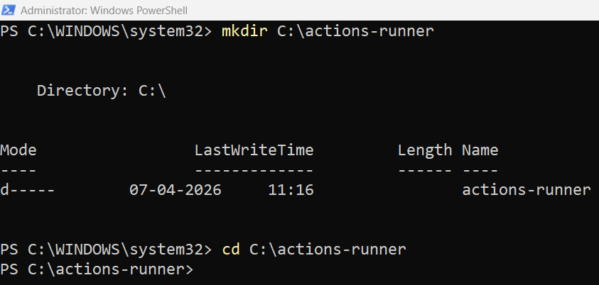
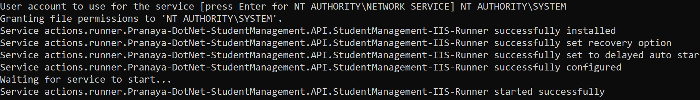
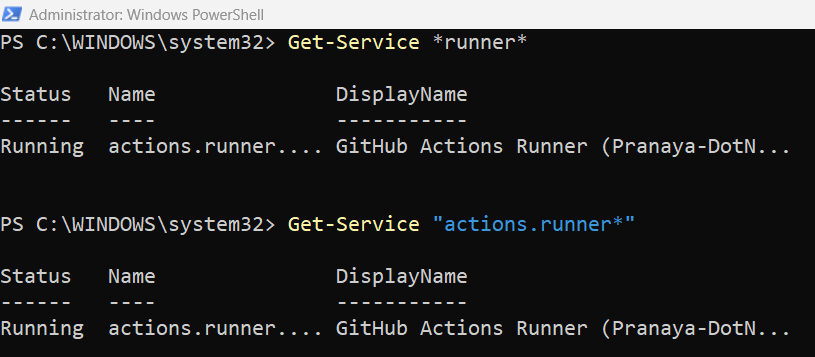
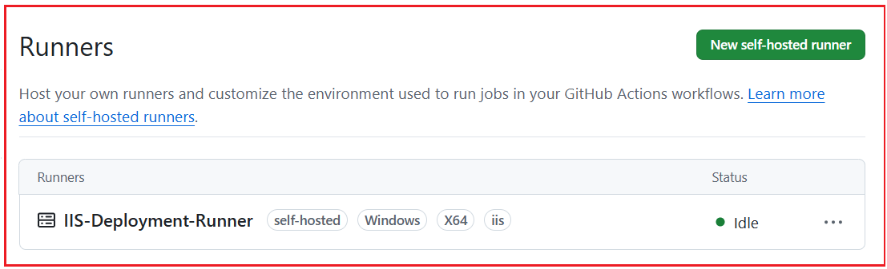

## **خودکارسازی استقرار در IIS با CI/CD Pipeline با استفاده از GitHub Actions**

در فصل‌های قبلی، ما مهم‌ترین کارهای پایه را انجام داده‌ایم:

- ما پروژه ASP.NET Core Web API را ایجاد کردیم و **آن را به صورت دستی در IIS مستقر کردیم.**
- سپس، ما خط لوله CI را در GitHub خودکارسازی کردیم. اقدامات **: ساخت، آزمایش، انتشار**
- و پیکربندی‌های امن با استفاده از **اسرار و متغیرها**

این یعنی پروژه ما اکنون برای مرحله بعدی در دنیای واقعی آماده است: **اتوماسیون استقرار** .

#### **آنچه در این فصل خواهیم ساخت**

موجود و گردش کار CI آن را به یک خط لوله استقرار واقعی گسترش خواهیم داد **در این فصل، پروژه StudentManagement.API** . گردش کار استقرار ما به این شکل خواهد بود:

**توسعه‌دهنده کد را ارسال می‌کند → اقدامات GitHub CI را اجرا می‌کند → خروجی Publish تولید می‌شود → کار CD روی اجراکننده Self-Hosted اجرا می‌شود → فایل‌ها در پوشه IIS کپی می‌شوند → App Pool/Site IIS مجدداً راه‌اندازی می‌شود → سلامت Endpoint آزمایش می‌شود**

بنابراین، از این فصل به بعد، ما دیگر در ساخت و انتشار متوقف نمی‌شویم. ما به سمت **اتوماسیون استقرار واقعی** حرکت می‌کنیم .

#### **تحویل مداوم در پروژه ما چیست؟**

تا الان، خط لوله ما به طور خودکار کارهای زیر را انجام می‌داد:

- دانلود کد مخزن
- نصب .NET SDK
- بازیابی بسته‌ها
- راه حل را بسازید
- اجرای تست‌های واحد
- انتشار API وب
- خروجی منتشر شده را به عنوان یک مصنوع ذخیره کنید

این بخش مربوط به CI بود.

حالا، در این فصل، بخش CD را اضافه می‌کنیم. در پروژه ما، **تحویل مداوم** به این معنی است:

- فایل‌های آماده برای استقرار به صورت خودکار تولید می‌شوند.
- فرآیند استقرار در IIS نیز به صورت خودکار اجرا خواهد شد.
- استقرار باید فقط پس از ساخت و موفقیت در آزمایش انجام شود.
- پس از استقرار، برنامه باید بررسی شود تا از عملکرد صحیح آن اطمینان حاصل شود.

بنابراین، به عبارت خیلی ساده:

- **CI بررسی می‌کند که آیا کد خوب است یا خیر.**
- **CD کد مناسب را به سرور IIS منتقل می‌کند.**

#### **چرا اتوماسیون استقرار مورد نیاز است؟**

قبل از اتوماسیون، استقرار معمولاً به این شکل بود:

- ویژوال استودیو را باز کنید
- انتشار پروژه به صورت دستی
- پوشه انتشار را باز کنید
- فایل‌ها را به صورت دستی کپی کنید
- آنها را در پوشه استقرار IIS قرار دهید
- متوقف کردن دستی مجموعه سایت یا برنامه
- جایگزین کردن فایل‌های قدیمی
- دوباره سایت رو راه اندازی کنید
- یک مرورگر یا Postman باز کنید و نقاط پایانی را آزمایش کنید

این فرآیند دستی برای یادگیری جواب می‌دهد، اما در کار واقعی، مشکلات زیادی ایجاد می‌کند:

- ممکن است یک مرحله فراموش شود
- ممکن است فایل‌های اشتباه کپی شده باشند
- ممکن است فایل‌های قدیمی در پوشه باقی مانده باشند
- ممکن است سردرگمی در انتشار و اشکال‌زدایی رخ دهد
- استقرار هر بار زمان می‌برد
- افراد مختلف ممکن است به طور متفاوتی مستقر شوند

دقیقاً به همین دلیل است که اتوماسیون استقرار مهم است. وقتی مراحل را در یک خط لوله تعریف کنیم، هر بار همان فرآیند صحیح اجرا می‌شود.

#### **ما می‌خواهیم به چه چیزی دست یابیم؟**

در پایان این فصل، وقتی کد را به شاخه انتخاب شده ارسال می‌کنیم:

- CI باید اول اجرا شود
- ساخت، آزمایش و انتشار باید کامل شود
- سی دی باید در مرحله بعد اجرا شود
- فایل‌ها باید به‌طور خودکار در IIS مستقر شوند.
- IIS باید آخرین نسخه را ارائه دهد
- ‎/api/health باید سلامت برنامه را تأیید کند.

این دقیقاً همان نوع جریانی است که ما در CI/CD پیاده‌سازی می‌کنیم.

#### **بخش ۱: درک کنید که چرا به یک دونده‌ی خود-میزبان نیاز داریم**

##### **دونده میزبانی شده توسط گیت‌هاب در مقابل دونده میزبانی شده توسط خود**

در فصل قبل، از موارد زیر استفاده کردیم:

- **اجرا می‌شود: اوبونتو-آخرین نسخه**

این یعنی گیت‌هاب یک ماشین لینوکس موقت برای اجرای دستورات ساخت و آزمایش به ما داده است. این برای CI عالی است، اما **برای استقرار IIS محلی مناسب نیست** .

###### **چرا؟**

زیرا دونده میزبان GitHub:

- نمی‌توانیم مستقیماً به دستگاه IIS محلی خود دسترسی پیدا کنیم
- نمی‌توانیم به پوشه محلی C:\\inetpub\\… دسترسی پیدا کنیم.
- نمی‌توانیم مجموعه برنامه‌های کاربردی محلی IIS خود را متوقف کنیم
- نمی‌توانیم سرویس‌ها را روی دستگاه ویندوز خودمان کنترل کنیم

بنابراین، برای استقرار IIS، ما نیاز داریم که گردش کار **روی خود دستگاه IIS** استفاده می‌کنیم **اجرا شود. به همین دلیل است که از یک اجراکننده خود-میزبان** .

#### **یک دونده خود میزبان چیست؟**

یک **اجراکننده‌ی خود-میزبان** است که **، ماشینی**   **ما کنترل می‌کنیم** و GitHub Actions از آن برای اجرای کار استفاده می‌کند.

در مورد ما:

- خود دستگاه IIS به اجراکننده تبدیل خواهد شد.
- گیت‌هاب کار استقرار را به آن دستگاه ارسال خواهد کرد.
- آن دستگاه دستورات PowerShell را به صورت محلی اجرا خواهد کرد
- این دستورات فایل‌ها را در پوشه استقرار IIS کپی کرده و برنامه را مجدداً راه‌اندازی می‌کنند.

بنابراین ایده مهم این است:

- **CI می‌تواند روی runner میزبانی‌شده توسط GitHub اجرا شود.**
- **هنگام استقرار در IIS محلی، CD باید روی یک اجراکننده ویندوزی خود-میزبان اجرا شود.**

###### **درک بلادرنگ**

به این شکل فکر کنید:

- دونده‌ی میزبانی‌شده توسط گیت‌هاب = کارگر موقت اجاره‌ای.
- دونده خود میزبان = کارمند دائمی خودتان در دفتر خودتان.

اگر کار فقط ساخت/آزمایش باشد، هر کارگر می‌تواند آن را انجام دهد. اما اگر کار:

- دسترسی به IIS محلی
- کپی در مسیر C:\\inetpub
- مجموعه برنامه‌ها را مجدداً راه‌اندازی کنید
- تأیید استقرار localhost

سپس کارگر باید از نظر فیزیکی روی آن دستگاه باشد.

#### **بخش دوم: آماده‌سازی ماشین IIS برای استقرار خودکار**

قبل از اتصال دستگاه به عنوان یک اجراکننده‌ی خود-میزبان، ابتدا مطمئن می‌شویم که دستگاه IIS آماده است.

##### **مرحله 1: تأیید کنید که IIS نصب شده است**

را باز کنید **Windows Features** و مطمئن شوید که IIS فعال است. حداقل، IIS باید از قبل کار کند زیرا در فصل 2 ما API را به صورت دستی در IIS مستقر کردیم. این پایه استقرار دستی در اینجا مهم است زیرا این فصل به سادگی همان فرآیند را خودکار می‌کند.

##### **مرحله ۲: تأیید کنید که بسته میزبانی .NET نصب شده است**

از آنجایی که این یک برنامه ASP.NET Core Web API است که پشت IIS اجرا می‌شود، دستگاه IIS باید **بسته میزبانی .NET** صحیح را نصب کرده باشد.

بدون بسته میزبانی:

- IIS ممکن است سایت را راه‌اندازی کند
- اما ممکن است یک برنامه ASP.NET Core اجرا نشود.
- ممکن است خطاهای HTTP 500.30 یا خطاهای مربوط به راه‌اندازی را مشاهده کنید

بنابراین، همیشه مطمئن شوید که دستگاه IIS هدف، زمان اجرا و بسته میزبانی صحیح برای نسخه .NET مورد استفاده پروژه را نصب کرده باشد. در مورد ما، پروژه مبتنی بر **.NET 8** است ، بنابراین دستگاه IIS باید از میزبانی .NET 8 پشتیبانی کند.

##### **مرحله 3: سایت IIS موجود را تأیید کنید**

از فصل قبلی استقرار دستی، ما می‌دانیم که چگونه موارد زیر را ایجاد کنیم:

- پوشه استقرار
- مجموعه برنامه‌ها
- سایت IIS
- اتصال پورت

از همان تنظیمات اینجا استفاده کنید. برای مثال:

- **پوشه‌ی استقرار** : C:\\inetpub\\StudentManagement.API
- **مجموعه برنامه‌های کاربردی** : StudentManagementAPIAppPool
- **نام سایت** : StudentManagement.API
- **پورت** : ۸۰۸۰

##### **مرحله ۴: تأیید کنید که سایت دستی هنوز کار می‌کند**

قبل از خودکارسازی، همیشه مطمئن شوید که سایت فعلی به صورت دستی کار می‌کند.

آزمون:

- http://localhost:8080/api/health
- http://localhost:8080/api/students

اگر استقرار دستی از قبل مشکل داشته باشد، اتوماسیون آن را برطرف نمی‌کند. اتوماسیون فقط فرآیند را سریع‌تر تکرار می‌کند؛ اما تنظیمات نادرست سرور را اصلاح نمی‌کند.

#### **بخش 3: درک نقش web.config در میزبانی IIS**

وقتی ASP.NET Core در IIS منتشر می‌شود، خروجی انتشار معمولاً شامل یک **فایل web.config** است . این فایل بسیار مهم است زیرا IIS از آن برای درک نحوه شروع برنامه ASP.NET Core از طریق ماژول ASP.NET Core استفاده می‌کند.

بنابراین، در طول استقرار:

- فایل web.config را به صورت تصادفی حذف نکنید.
- آن را با محتوای نامرتبط جایگزین نکنید
- مطمئن شوید که خروجی منتشر شده شامل web.config صحیح است.

اگر فایل web.config وجود نداشته باشد یا خراب باشد، ممکن است سایت حتی با وجود اتمام موفقیت‌آمیز استقرار، اجرا نشود. به همین دلیل است که فرآیند استقرار ما باید **خروجی منتشر شده را به همان شکلی که هست** ، مستقر کند ، نه فایل‌های تصادفی را به صورت دستی.

#### **بخش ۴: ساختار پوشه پیشنهادی برای استقرار**

برای خودکارسازی استقرار تمیز، فایل‌ها را مستقیماً از پوشه‌های تصادفی کپی نکنید. از یک ساختار مناسب استفاده کنید. **ساختار پوشه پیشنهادی در دستگاه IIS** به شرح زیر است .

- **C:\\actions-runner\\:** این جایی است که دونده‌ی خود-میزبان نصب خواهد شد.
- **C:\\apps\\StudentManagement.API\\temp\\publish\\:** این پوشه‌ی موقت برای آماده‌سازی است که مصنوع منتشر شده‌ی دانلود شده از GitHub Actions قبل از استقرار در آن ذخیره می‌شود.
- **C:\\apps\\StudentManagement.API\\current\\:** این پوشه‌ی اصلیِ استقرار IIS است که توسط سایت استفاده می‌شود. IIS برنامه را از این پوشه اجرا خواهد کرد.
- **C:\\apps\\StudentManagement.API\\backup\\:** این پوشه پشتیبان، محل کپی فایل‌های نصب IIS فعلی قبل از نصب نسخه جدید است. اگر بررسی سلامت یا تست دود پس از نصب با شکست مواجه شود، از این فایل‌های پشتیبان برای بازگرداندن نسخه قبلی استفاده خواهد شد.

این ساختار، فایل‌های اجراکننده، فایل‌های استقرار موقت، فایل‌های پشتیبان و فایل‌های IIS زنده را جدا نگه می‌دارد. در نتیجه، استقرار تمیزتر، قابل فهم‌تر و ایمن‌تر می‌شود.

#### **بخش ۵: راه‌اندازی دونده‌ی خود-میزبان روی دستگاه IIS**

حالا ما دستگاه IIS را به عنوان یک اجراکننده‌ی خود-میزبان به GitHub متصل خواهیم کرد.

##### **تنظیمات مخزن گیت‌هاب را باز کنید**

در مخزن گیت‌هاب شما:

- بروید **به تنظیمات**
- کلیک کنید **روی اقدامات**
- کلیک **دونده‌ها**
- کلیک کنید **روی دونده خود-میزبان جدید**

انتخاب کنید:

- **سیستم عامل** : ویندوز
- **معماری** : x64

گیت‌هاب دستورات را نشان خواهد داد.

##### **کاری که الان باید انجام دهید**

این دستورات را روی **همان دستگاه ویندوزی که IIS روی آن نصب شده است،** اجرا کنید .

##### **۱: پاورشل را به عنوان ادمین باز کنید**

اگر می‌خواهید این اجراکننده به عنوان یک سرویس ویندوز نصب شود، این موضوع اهمیت دارد. بنابراین، لطفاً Windows PowerShell را در حالت ادمین باز کنید.

##### **۲: پوشه runner را ایجاد کنید**

لطفا دستور زیر را در PowerShell اجرا کنید.

- **mkdir C:\\actions-runner**
- **سی دی C:\\actions-runner**



##### **۳: فایل اجرایی را دانلود و استخراج کنید**

از نسخه دقیقی که گیت‌هاب روی صفحه شما نشان می‌دهد استفاده کنید. لطفاً موارد زیر را یکی یکی اجرا کنید.

###### **اولین اجرا: آخرین بسته‌ی runner را دانلود کنید**

```powershell
Invoke-WebRequest -Uri https://github.com/actions/runner/releases/download/v2.333.1/actions-runner-win-x64-2.333.1.zip -OutFile actions-runner-win-x64-2.333.1.zip
```

###### **اجرای دوم: اعتبارسنجی هش**

```powershell
if((Get-FileHash -Path actions-runner-win-x64-2.333.1.zip -Algorithm SHA256).Hash.ToUpper() -ne 'd0c4fcb91f8f0754d478db5d61db533bba14cad6c4676a9b93c0b7c2a3969aa0'.ToUpper()){ throw 'جمع کنترلی محاسبه‌شده مطابقت نداشت' }
```

###### **اجرای سوم: استخراج فایل نصب**

```powershell
Add-Type -AssemblyName System.IO.Compression.FileSystem ; [System.IO.Compression.ZipFile]::ExtractToDirectory("$PWD/actions-runner-win-x64-2.333.1.zip", "$PWD")
```

##### **۴: دونده را پیکربندی کنید**

حالا، کد زیر را در PowerShell اجرا کنید. این کار runner را ایجاد کرده و پیکربندی را آغاز می‌کند. لطفاً RUNNER_REGISTRATION_TOKEN را با توکن واقعی نشان داده شده در GitHub جایگزین کنید.

```powershell
./config.cmd --url https://github.com/Pranaya-DotNet/StudentManagement.API --token <RUNNER_REGISTRATION_TOKEN>
```

بعد از اجرا، گیت‌هاب چندین سوال از شما خواهد پرسید.

##### **وارد گروه دونده شوید**

گروه دونده را وارد کنید (برای پیش‌فرض، Enter را فشار دهید): فقط **Enter را فشار دهید،** که از پیش‌فرض استفاده می‌کند.

##### **نام دونده را وارد کنید (بسیار مهم)**

نام دونده را وارد کنید:

یک **نام معنادار** انتخاب کنید . **نام‌های پیشنهادی (برای پروژه ما)**

- **اجرای کننده‌ی استقرار IIS**
- StudentManagement-IIS-Runner
- CD-Runner محلی IIS
- Prod-IIS-Runner (در صورت تولید)

را می‌دهم **من IIS-Deployment-Runner** .

##### **برچسب‌ها را وارد کنید**

هرگونه برچسب اضافی را وارد کنید: iis

گیت‌هاب از قبل برچسب‌های پیش‌فرض self-hosted را برای سیستم عامل و معماری اعمال می‌کند و برچسب‌های سفارشی برای هدف‌گیری شخصی شما در نظر گرفته شده‌اند. گردش کار شما از قبل از این موارد استفاده می‌کند: runs-on: [self-hosted, windows, iis]. بنابراین، اضافه کردن iis برچسب سفارشی مهمی در اینجا است.

##### **پوشه کار را وارد کنید**

نام پوشه کار را وارد کنید:

کلید Enter را فشار دهید (پیش‌فرض: \_work)

##### **به عنوان یک سرویس اجرا می‌شود؟ (بسیار مهم)**

آیا می‌خواهید runner را به عنوان یک سرویس اجرا کنید؟ (بله/خیر)

**پاسخ پیشنهادی: بله (Y)**

##### **سرویس runner باید تحت کدام حساب ویندوز اجرا شود؟**

**دقیقاً این را تایپ کنید: NT AUTHORITY\SYSTEM**

شما باید پیام زیر را ببینید:



##### **نام سرویس چه باید باشد؟**

**الگو:** **actions.runner.<Owner>-<Repo>.<RunnerName>**

**مثال: actions.runner.Pranaya-DotNet-StudentManagement.API.IIS-Deployment-Runner**

##### **چگونه از اجرای سرویس Runner مطمئن شویم؟**

باز کنید **PowerShell را به عنوان Administrator** و دستور زیر را اجرا کنید: **Get-Service \*runner\***

سپس دستور زیر را نیز اجرا کنید: **Get-Service "actions.runner\*"**

اگر وجود داشته باشد، باید نتیجه‌ای با وضعیتی مانند در حال اجرا یا متوقف شده دریافت کنید.



##### **چگونه سرویس را متوقف، شروع و مجدداً راه‌اندازی کنیم؟**

###### **سرویس را شروع کنید**

```powershell
Start-Service "actions.runner.Pranaya-DotNet-StudentManagement.API.IIS-Deployment-Runner"
```

###### **سرویس را متوقف کنید**

```powershell
Stop-Service "actions.runner.Pranaya-DotNet-StudentManagement.API.IIS-Deployment-Runner"
```

###### **سرویس را مجدداً راه اندازی کنید**

```powershell
Restart-Service "actions.runner.Pranaya-DotNet-StudentManagement.API.IIS-Deployment-Runner"
```

##### **تأیید کنید که دونده آنلاین است**

برگردید **به مخزن GitHub → تنظیمات → اقدامات → اجراکنندگان** ببینید **. اکنون باید اجراکننده را به صورت بیکار (Idle)** یا **آنلاین (Online)** . این بدان معناست که GitHub اکنون می‌تواند کارهای استقرار را به این دستگاه IIS ارسال کند. بیکار (Idle) به این معنی است که اجراکننده آنلاین است اما در حال حاضر هیچ کاری انجام نمی‌دهد.



###### **معنی ساده**

- **آنلاین / بیکار** → آماده پذیرش شغل
- **مشغول** → در حال حاضر یک خط لوله در حال اجرا است
- **آفلاین** → متصل نیست / سرویس متوقف شده است

#### **بخش ششم: آماده‌سازی محیط‌های گیت‌هاب و متغیرهای استقرار**

در فصل قبل، ما با موارد زیر کار کردیم:

- متغیرهای گیت‌هاب
- اسرار گیت‌هاب
- محیط‌هایی مانند توسعه و تولید

حالا ما از همین مفهوم برای استقرار استفاده خواهیم کرد.

##### **ایجاد یا استفاده مجدد از محیط توسعه**

را ایجاد کرده‌اید ، به استفاده از آن ادامه دهید. در داخل آن محیط، متغیرهای مربوط به استقرار مانند موارد زیر را اضافه کنید: **توسعه** اگر در فصل قبل محیط

- **IIS_APP_POOL = StudentManagementAPIAppPool**
- **TEMP_PUBLISH_PATH = C:\apps\StudentManagement.API\temp\publish\**
- **BACKUP_PATH = C:\apps\StudentManagement.API\backup\**
- **DEPLOY_PATH = C:\apps\StudentManagement.API\current\**
- **API_HEALTH_URL = http://localhost:8080/api/health**
- **SMOKE_TEST_URL = http://localhost:8080/api/students**

اینها مقادیر غیر حساس هستند، بنابراین متغیرها مناسب هستند. اگر بعداً به مقادیر حساس نیاز داشتید، می‌توانید آنها را مخفی کنید.

#### **بخش ۷: تدوین استراتژی استقرار**

قبل از نوشتن YAML، ابتدا اجازه دهید ترتیب استقرار را به روشنی تعریف کنیم.

##### **توالی استقراری که استفاده خواهیم کرد**

کار CD ما موارد زیر را انجام خواهد داد:

1. مصنوع منتشر شده تولید شده توسط CI را دانلود کنید
2. سایت یا مجموعه برنامه‌های IIS را متوقف کنید
3. فایل‌های منتشر شده را در پوشه‌ی استقرار IIS کپی کنید.
4. سایت یا مجموعه برنامه‌های IIS را شروع کنید
5. چند ثانیه صبر کنید
6. با نقطه پایانی سلامت تماس بگیرید
7. اگر بررسی سلامت با موفقیت انجام نشود، خط لوله با شکست مواجه می‌شود

##### **چرا باید IIS را در حین استقرار متوقف کنیم؟**

گاهی اوقات، IIS فایل‌ها را قفل نگه می‌دارد. اگر فایل‌ها قفل شده باشند:

- کپی ممکن است ناموفق باشد
- ممکن است برخی از فایل‌ها رونویسی نشوند
- استقرار (یا استقرار) ناپایدار می‌شود

بنابراین، در حین استقرار، بهتر است ابتدا Application Pool یا Site را متوقف کنید، فایل‌ها را جایگزین کنید و سپس دوباره آن را راه‌اندازی کنید.

#### **بخش ۸: ایجاد گردش کار چند مرحله‌ای CI/CD**

اکنون گردش کار موجود خود را از فصل 3 گسترش خواهیم داد. پیش از این، گردش کار CI ما یک کار داشت:

- ساخت، آزمایش و انتشار

حالا دو تا job ایجاد می‌کنیم:

- **ci-build-test-publish**
- **cd-deploy-to-iis**

کار دوم فقط در صورتی باید اجرا شود که کار اول با موفقیت انجام شود.

##### **مثال گردش کار کامل**

ایجاد یا به‌روزرسانی کنید . کد زیر نیاز به توضیح ندارد، بنابراین لطفاً برای درک بهتر، خطوط کامنت را مطالعه کنید. **فایل .github/workflows/cicd.yml** را با YAML زیر

```yaml
# This is the display name of the workflow in GitHub Actions
name: StudentManagement API CI-CD

# Trigger section
# This workflow will run whenever code is pushed to main
# Example:
#   Code push to main
#   feature branch -> merged into main -> workflow runs
on:
  push:
    branches:
      - main

jobs:
  # ---------------------------------------------------
  # JOB 1: CONTINUOUS INTEGRATION (CI)
  # This job runs on GitHub's hosted Ubuntu machine
  # Steps:
  #   1. Download source code
  #   2. Install .NET 8 SDK on the runner
  #   3. Restore NuGet packages
  #   4. Build the solution
  #   5. Run Unit tests
  #   6. Publish the application
  #   7. Upload published output as artifact
  # ---------------------------------------------------
  ci-build-test-publish:
    name: CI - Build, Test, and Publish
    runs-on: ubuntu-latest

    steps:
      # Step 1: Download the latest repository code
      # actions/checkout pulls your GitHub repository content
      # into the runner machine
      - name: Checkout source code
        uses: actions/checkout@v5

      # Step 2: Install .NET 8 SDK on the runner
      # This is required because dotnet restore/build/test/publish
      # commands need the .NET SDK
      - name: Setup .NET 8 SDK
        uses: actions/setup-dotnet@v5
        with:
          dotnet-version: '8.0.x'

      # Step 3: Restore NuGet packages for the solution
      # This downloads all package dependencies referenced
      # by the solution/project
      - name: Restore dependencies
        run: dotnet restore StudentManagement.API.sln

      # Step 4: Build the solution in Release mode
      # --configuration Release -> build optimized release version
      # --no-restore -> do not restore again because already done above
      - name: Build solution
        run: dotnet build StudentManagement.API.sln --configuration Release --no-restore

      # Step 5: Run tests in Release mode
      # --no-build -> do not build again because build already happened
      # --verbosity normal -> show normal level test logs
      - name: Run tests
        run: dotnet test StudentManagement.API.sln --configuration Release --no-build --verbosity normal

      # Step 6: Publish the Web API project
      # Publish creates deployment-ready files
      # Output goes into ./publish folder on the runner
      - name: Publish Web API
        run: dotnet publish StudentManagement.API/StudentManagement.API.csproj --configuration Release --output ./publish --no-build

      # Step 7: Upload the published output as an artifact
      # Artifact = packaged files stored by GitHub Actions
      # Later, the CD job will download this artifact
      - name: Upload publish artifact
        uses: actions/upload-artifact@v4
        with:
          name: studentmanagement-api-publish
          path: ./publish

  # ----------------------------------------------------------
  # JOB 2: CONTINUOUS DEPLOYMENT (CD)
  # This job runs on your self-hosted Windows IIS machine
  # Steps:
  #   1. Download published artifact
  #   2. Prepare folders
  #   3. Backup current live deployment
  #   4. Stop IIS App Pool
  #   5. Copy new files
  #   6. Start IIS App Pool
  #   7. Run health check
  #   8. Run smoke test
  #   9. Rollback if something fails
  # ----------------------------------------------------------
  cd-deploy-to-iis:
    name: CD - Deploy to IIS

    # needs means:
    # Run this deployment job only after the CI job succeeds
    # If build/test/publish fails, deployment will not run
    needs: ci-build-test-publish

    # This job should run only on your self-hosted IIS machine
    # self-hosted -> Your own runner
    # windows     -> Runner is Windows based
    # iis         -> Custom label added while configuring runner
    runs-on: [self-hosted, windows, iis]

    # Development environment in GitHub
    # This lets the workflow read environment variables like:
    #   TEMP_PUBLISH_PATH
    #   BACKUP_PATH
    #   DEPLOY_PATH
    #   IIS_APP_POOL
    #   API_HEALTH_URL
    #   SMOKE_TEST_URL
    environment:
      name: Development

    steps:
      # Step 1: Make sure all required folders exist
      # Why needed?
      # Because deployment will fail if these folders are missing
      - name: Ensure deployment folders exist
        shell: powershell
        run: |
          # Read folder paths from GitHub environment variables
          # These values are configured in GitHub -> Settings -> Environments -> Development
          $tempPath = "${{ vars.TEMP_PUBLISH_PATH }}"
          $backupPath = "${{ vars.BACKUP_PATH }}"
          $deployPath = "${{ vars.DEPLOY_PATH }}"

          # If temp folder does not exist, create it
          # TEMP_PUBLISH_PATH stores downloaded artifact files temporarily
          if (!(Test-Path $tempPath)) {
              New-Item -ItemType Directory -Path $tempPath -Force | Out-Null
          }

          # If backup folder does not exist, create it
          # BACKUP_PATH stores the previous live version for rollback
          if (!(Test-Path $backupPath)) {
              New-Item -ItemType Directory -Path $backupPath -Force | Out-Null
          }

          # If deployment folder does not exist, create it
          # DEPLOY_PATH is the live IIS physical folder
          if (!(Test-Path $deployPath)) {
              New-Item -ItemType Directory -Path $deployPath -Force | Out-Null
          }

          Write-Host "Required folders verified successfully."

      # Step 2: Download the artifact created in CI job
      # The published files are downloaded to TEMP_PUBLISH_PATH
      - name: Download publish artifact
        uses: actions/download-artifact@v5
        with:
          name: studentmanagement-api-publish
          path: ${{ vars.TEMP_PUBLISH_PATH }}

      # Step 3: Backup the current deployment
      # Why?
      # If the new deployment fails, we can restore old working files
      - name: Backup current IIS deployment
        shell: powershell
        run: |
          # Current live deployment folder
          $source = "${{ vars.DEPLOY_PATH }}"

          # Backup folder where current live version will be stored
          $backup = "${{ vars.BACKUP_PATH }}"

          Write-Host "Preparing backup..."

          # Clean old backup contents first
          # This ensures backup folder contains only the latest backup
          if (Test-Path $backup) {
              Get-ChildItem -Path $backup -Force -ErrorAction SilentlyContinue | Remove-Item -Recurse -Force -ErrorAction SilentlyContinue
          }

          # If current deployment exists, backup it
          if (Test-Path $source) {

              # robocopy is a robust Windows file copy command
              # /MIR = mirror source to destination
              #        copies new files and removes extra files in destination
              # /R:2 = retry 2 times on failure
              # /W:5 = wait 5 seconds between retries
              robocopy $source $backup /MIR /R:2 /W:5

              # Store robocopy exit code in a variable
              $exitCode = $LASTEXITCODE

              # Important:
              # Robocopy does NOT follow normal success/failure pattern
              # 0 to 7  = acceptable/success-like results
              # 8 or more = actual failure
              if ($exitCode -ge 8) {
                  throw "Backup failed. Robocopy exit code: $exitCode"
              }

              Write-Host "Backup completed successfully. Robocopy exit code: $exitCode"

              # exit 0 means explicitly finish step as success
              # This is useful because robocopy may return non-zero codes even on success
              exit 0
          }
          else {
              # First deployment case: no existing live deployment
              Write-Host "Deployment path does not exist yet. Skipping backup."
          }

      # Step 4: Stop IIS App Pool before deployment
      # Why stop?
      # Because IIS may lock DLLs/files while app is running
      - name: Stop IIS App Pool
        shell: powershell
        run: |
          # Import IIS PowerShell module
          # Without this, commands like Get-WebAppPoolState and Stop-WebAppPool won't work
          Import-Module WebAdministration

          # Read app pool name from GitHub variable
          $appPool = "${{ vars.IIS_APP_POOL }}"

          # Check current state of app pool
          # Value can be Started, Stopped, etc.
          $state = (Get-WebAppPoolState -Name $appPool).Value

          # Stop only if not already stopped
          if ($state -ne "Stopped") {
              Stop-WebAppPool -Name $appPool
              Write-Host "IIS App Pool stopped successfully."
          }
          else {
              Write-Host "IIS App Pool is already stopped."
          }

      # Step 5: Wait a few seconds after stopping app pool
      # Why wait?
      # To give IIS time to fully release files and locks
      - name: Wait after stopping app pool
        shell: powershell
        run: Start-Sleep -Seconds 5

      # Step 6: Confirm artifact is really present
      # Why needed?
      # If artifact download failed or folder is empty,
      # deployment should stop immediately
      - name: Clean deployment temp folder check
        shell: powershell
        run: |
          # Temp folder where artifact was downloaded
          $source = "${{ vars.TEMP_PUBLISH_PATH }}"

          # Ensure temp path exists
          if (!(Test-Path $source)) {
              throw "Temp publish path does not exist: $source"
          }

          # Get files from temp folder
          $files = Get-ChildItem -Path $source -Force -ErrorAction SilentlyContinue

          # If folder is empty, deployment should not continue
          if ($null -eq $files -or $files.Count -eq 0) {
              throw "Temp publish path is empty. Deployment artifact was not downloaded correctly."
          }

          Write-Host "Publish artifact is available for deployment."

      # Step 7: Deploy the new published files
      # This is the actual file copy from temp folder to live IIS folder
      - name: Deploy published files to IIS folder
        shell: powershell
        run: |
          # Source = temp folder containing published files downloaded from artifact
          $source = "${{ vars.TEMP_PUBLISH_PATH }}"

          # Destination = actual IIS live deployment folder
          $destination = "${{ vars.DEPLOY_PATH }}"

          # Create destination folder if it does not exist
          if (!(Test-Path $destination)) {
              New-Item -ItemType Directory -Path $destination -Force | Out-Null
          }

          # Copy files from temp folder to IIS live folder
          robocopy $source $destination /MIR /R:2 /W:5

          # Capture robocopy exit code
          $exitCode = $LASTEXITCODE

          # Only fail when exit code is 8 or above
          if ($exitCode -ge 8) {
              throw "Deployment failed during file copy. Robocopy exit code: $exitCode"
          }

          Write-Host "Deployment copy completed successfully. Robocopy exit code: $exitCode"

          # Mark step successful explicitly
          exit 0

      # Step 8: Start IIS App Pool again after deployment
      # This makes IIS serve the newly deployed version
      - name: Start IIS App Pool
        shell: powershell
        run: |
          # Load IIS PowerShell module
          Import-Module WebAdministration

          # Read app pool name
          $appPool = "${{ vars.IIS_APP_POOL }}"

          # Check current app pool state
          $state = (Get-WebAppPoolState -Name $appPool).Value

          # Start only if not already started
          if ($state -ne "Started") {
              Start-WebAppPool -Name $appPool
              Write-Host "IIS App Pool started successfully."
          }
          else {
              Write-Host "IIS App Pool is already started."
          }

      # Step 9: Wait for app startup
      # Why?
      # After app pool starts, app still needs some time to boot
      - name: Wait for application startup
        shell: powershell
        run: Start-Sleep -Seconds 10

      # Step 10: Health check
      # Purpose:
      # Confirm the API is alive and responding with HTTP 200
      - name: Run health check
        shell: powershell
        run: |
          # Read health check URL from GitHub variable
          $url = "${{ vars.API_HEALTH_URL }}"

          Write-Host "Running health check: $url"

          try {
              # Invoke-WebRequest sends HTTP request
              # -TimeoutSec 30 means wait up to 30 seconds
              $response = Invoke-WebRequest -Uri $url -UseBasicParsing -TimeoutSec 30
          }
          catch {
              # If request itself fails, stop pipeline
              throw "Health check request failed. Error: $($_.Exception.Message)"
          }

          # If API did not return HTTP 200, deployment should fail
          if ($response.StatusCode -ne 200) {
              throw "Health check failed. Status code: $($response.StatusCode)"
          }

          Write-Host "Health check passed successfully."

      # Step 11: Smoke test
      # Purpose:
      # Confirm one actual business/API endpoint also works
      # Health endpoint proves app is alive
      # Smoke test proves app functionality is alive
      - name: Run smoke test
        shell: powershell
        run: |
          # Read smoke test URL from GitHub variable
          $url = "${{ vars.SMOKE_TEST_URL }}"

          Write-Host "Running smoke test: $url"

          try {
              # Invoke-RestMethod is better when expecting JSON/API data
              $response = Invoke-RestMethod -Uri $url -Method Get -TimeoutSec 30
          }
          catch {
              throw "Smoke test request failed. Error: $($_.Exception.Message)"
          }

          # If response is null, something is wrong
          if ($null -eq $response) {
              throw "Smoke test failed. No data returned."
          }

          # If API returns an array/list, make sure it has data
          if ($response -is [System.Array]) {
              if ($response.Count -lt 1) {
                  throw "Smoke test failed. Response array is empty."
              }
          }

          Write-Host "Smoke test passed successfully."

      # Step 12: Rollback on failure
      # This step runs only if any earlier step in this job fails
      # Example failures:
      #   - file copy fails
      #   - health check fails
      #   - smoke test fails
      - name: Rollback deployment on failure
        if: ${{ failure() }}
        shell: powershell
        run: |
          # Load IIS management commands
          Import-Module WebAdministration

          # Read variables used during rollback
          $appPool = "${{ vars.IIS_APP_POOL }}"
          $backup = "${{ vars.BACKUP_PATH }}"
          $destination = "${{ vars.DEPLOY_PATH }}"
          $rollbackHealthUrl = "${{ vars.API_HEALTH_URL }}"

          Write-Host "Deployment validation failed. Starting rollback..."

          # Check whether backup folder exists
          # If backup folder itself is missing, rollback cannot continue
          if (!(Test-Path $backup)) {
              throw "Rollback failed. Backup path does not exist: $backup"
          }

          # Get files from backup folder
          $backupFiles = Get-ChildItem -Path $backup -Force -ErrorAction SilentlyContinue

          # If backup folder is empty, rollback cannot restore anything
          if ($null -eq $backupFiles -or $backupFiles.Count -eq 0) {
              throw "Rollback failed. Backup folder is empty."
          }

          # Stop app pool before restoring backup files
          $state = (Get-WebAppPoolState -Name $appPool).Value
          if ($state -ne "Stopped") {
              Stop-WebAppPool -Name $appPool
              Write-Host "IIS App Pool stopped for rollback."
          }
          else {
              Write-Host "IIS App Pool already stopped."
          }

          # Wait a few seconds to release file locks
          Start-Sleep -Seconds 5

          # Ensure destination folder exists before restoring files
          if (!(Test-Path $destination)) {
              New-Item -ItemType Directory -Path $destination -Force | Out-Null
          }

          # Copy backup files back to live deployment folder
          robocopy $backup $destination /MIR /R:2 /W:5

          # Capture rollback robocopy exit code
          $exitCode = $LASTEXITCODE

          # Fail only if real robocopy error occurs
          if ($exitCode -ge 8) {
              throw "Rollback file restore failed. Robocopy exit code: $exitCode"
          }

          Write-Host "Rollback copy completed successfully. Robocopy exit code: $exitCode"

          # Start app pool again after rollback
          $state = (Get-WebAppPoolState -Name $appPool).Value
          if ($state -ne "Started") {
              Start-WebAppPool -Name $appPool
              Write-Host "IIS App Pool started after rollback."
          }
          else {
              Write-Host "IIS App Pool already started."
          }

          # Wait for rolled back application to start
          Start-Sleep -Seconds 10

          # Run health check again on restored version
          try {
              $rollbackResponse = Invoke-WebRequest -Uri $rollbackHealthUrl -UseBasicParsing -TimeoutSec 30
          }
          catch {
              throw "Rollback completed, but health check request failed after rollback. Error: $($_.Exception.Message)"
          }

          # If rollback version is still unhealthy, rollback is not considered successful
          if ($rollbackResponse.StatusCode -ne 200) {
              throw "Rollback completed, but health check after rollback failed. Status code: $($rollbackResponse.StatusCode)"
          }

          Write-Host "Rollback completed successfully."

          # Explicitly mark rollback step successful
          exit 0

      # Step 13: Mark workflow as failed after rollback
      # Why do this?
      # Because even if rollback succeeded, the new deployment failed
      # So GitHub Actions should still show the workflow as failed
      - name: Mark workflow as failed after rollback
        if: ${{ failure() }}
        shell: powershell
        run: |
          throw "Deployment failed. Rollback was executed."
```

##### **چگونه محیط را در IIS به عنوان توسعه تنظیم کنیم؟**

لطفا گروه ویژگی زیر را به فایل .csproj اضافه کنید.

```xml
<PropertyGroup>
  <EnvironmentName>Development</EnvironmentName>
</PropertyGroup>
```

##### **نتیجه‌گیری**

این فصل، استقرار ASP.NET Core Web API ما را در IIS با استفاده از یک اجراکننده GitHub Actions خود-میزبان، یک گردش کار CI/CD چند مرحله‌ای، مراحل استقرار مبتنی بر PowerShell و اعتبارسنجی سلامت پس از استقرار، خودکارسازی کرد.
