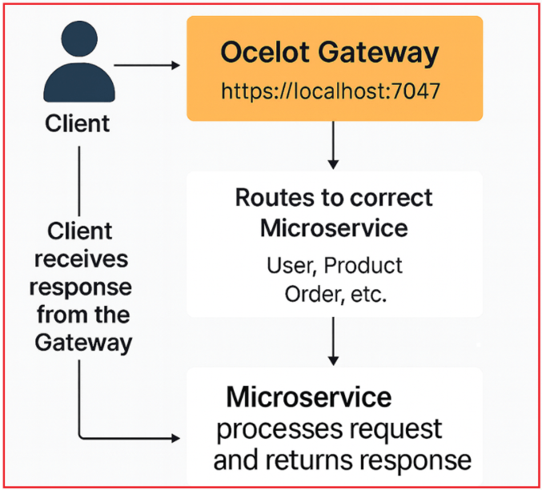

## **دروازه API Ocelot برای ASP.NET Core Web API**

در معماری میکروسرویس‌ها با چندین سرویس بک‌اند، مانند کاربر، محصول، سفارش، پرداخت و اعلان، کلاینت‌ها با چالش‌هایی روبرو هستند. بدون یک نقطه ورود متمرکز، کلاینت‌ها باید چندین URL را بشناسند، روش‌های احراز هویت مختلفی را مدیریت کنند و منطق مسیریابی را مدیریت کنند. اینجاست که **Ocelot** سبک و متن‌باز **، یک API Gateway** برای .NET ، وارد عمل می‌شود.

#### **آسلات چیست؟**

**Ocelot** .NET-Native و متن‌باز است **متن‌باز، سبک** ، **یک API Gateway** و **Reverse Proxy** که به‌طور خاص برای میکروسرویس‌های ساخته‌شده با استفاده از **اکوسیستم .NET** ساخته شده است . این ابزار در جلوی **میکروسرویس‌های** شما قرار می‌گیرد و یک **نقطه ورود واحد را** در اختیار **کلاینت‌ها** قرار می‌دهد . این ابزار به‌عنوان یک **Reverse Proxy** عمل می‌کند که درخواست‌های کلاینت‌ها را پذیرفته و آن‌ها را به **سرویس‌های پایین‌دستی** مناسب (مثلاً ProductService، OrderService) ارسال می‌کند. همچنین مسائل مرتبط با یکدیگر مانند **Transforming** ، **Authenticating** ، **Rate-Limiting** ، **Caching** و **Load-Balancing** را متمرکز می‌کند ، بنابراین میکروسرویس‌های شما می‌توانند روی منطق کسب‌وکار متمرکز بمانند.

##### **چرا از Ocelot در میکروسرویس‌های ASP.NET Core استفاده کنیم؟**

در یک محیط میکروسرویس، ما اغلب چندین سرویس بک‌اند (مثلاً UserService، ProductService، PaymentService) داریم. بدون یک دروازه، کلاینت‌ها باید هر سرویس را مستقیماً فراخوانی کنند، چندین URL را مدیریت کنند، احراز هویت کنند و نسخه‌بندی کنند. Ocelot این پیچیدگی را با موارد زیر از بین می‌برد:

- ارائه **یک نقطه پایانی واحد** برای همه تعاملات مشتری.
- مدیریت **مسیریابی، تجمیع و** تبدیل
- به عنوان یک **لایه امنیتی** عمل می‌کند و احراز هویت و مجوزدهی یکپارچه را تضمین می‌کند.
- ادغام یکپارچه با **ابزارهای کشف سرویس** مانند **Consul** یا **Eureka** برای مسیریابی پویا.

##### **ویژگی‌های کلیدی Ocelot**

- **مسیریابی:** درخواست‌های ورودی را به ریزسرویس‌های مناسب در پایین‌دست هدایت می‌کند.
- **احراز هویت و مجوز:** توکن‌ها را اعتبارسنجی کرده و سیاست‌های دسترسی را اعمال می‌کند.
- **محدودیت نرخ:** کنترل می‌کند که کلاینت‌ها در یک بازه زمانی مشخص چه تعداد درخواست می‌توانند ارسال کنند.
- **متعادل‌سازی بار:** درخواست‌ها را بین چندین نمونه سرویس توزیع می‌کند.
- **ذخیره سازی:** با ذخیره سازی پاسخ ها، تماس‌های اضافی backend را کاهش می‌دهد.
- **تجمیع درخواست:** نتایج چندین میکروسرویس را در یک میکروسرویس ترکیب می‌کند.

##### **وقتی آسلات منطقی عمل می‌کند**

- شما در حال ساخت میکروسرویس‌ها در **ASP.NET Core** هستید و می‌خواهید یک **دروازه (gateway) مبتنی بر C# داشته** باشید .
- شما **رویکرد فایل پیکربندی ساده** (JSON) را با حجم کم در زمان اجرا ترجیح می‌دهید.
- شما باید سریع شروع کنید، اما همچنان **گزینه‌های Rate Limits** ، **QoS** ، **JWT** و **Service Discovery** (مثلاً با Consul/Kubernetes) را می‌خواهید.

#### **ادغام گام به گام Ocelot API Gateway در ASP.NET Core Web API**

بیایید به راهنمای گام به گام ادغام Ocelot API Gateway در یک پروژه ASP.NET Core Web API بپردازیم.

##### **ایجاد یک پروژه جدید دروازه**

- راه حل خود را در ویژوال استودیو باز کنید.
- یک پوشه‌ی جدید به نام **Gateway** برای ایزوله نگه داشتن gateway ایجاد کنید.
- درون این پوشه، یک **پروژه خالی ASP.NET Core** جدید با نام **APIGateway** ایجاد کنید .
- این پروژه به عنوان نقطه ورود برای تمام درخواست‌های ورودی مشتری عمل خواهد کرد.

##### **اضافه کردن بسته Ocelot**

- باز کنید . **کنسول مدیریت بسته‌ها (Package Manager Console) را** در ویژوال استودیو
- انتخاب کنید . **پروژه APIGateway** را به عنوان پروژه پیش‌فرض
- دستور زیر را اجرا کنید: **Install-Package Ocelot**
- این دستور تمام وابستگی‌های لازم Ocelot را برای پروکسی معکوس و مسیریابی نصب می‌کند.

##### **اضافه کردن ocelot.json به ریشه پروژه**

1. در ریشه پروژه APIGateway، فایل جدیدی با نام **ocelot.json** اضافه کنید .
2. این فایل JSON تمام قوانین مسیریابی را تعریف می‌کند و ****مسیرهای بالادستی (رو به کلاینت)** را به **مسیرهای خودی** (ریزسرویس داخلی)** نگاشت می‌کند .
3. ویژگی فایل را تنظیم کنید **کپی در فهرست خروجی → اگر جدیدتر است کپی کنید** .

پس از ایجاد **فایل ocelot.json** ، کد زیر را کپی و جایگذاری کنید.

```json
{
  // Global configuration: Defines base settings for the entire Ocelot Gateway.
  "GlobalConfiguration": {
    // The external base URL of your API Gateway.
    // This is the single public entry point that external clients will use.
    // All requests from frontend or external APIs should go through this URL.
    // the Gateway will route it to the corresponding downstream microservice internally.
    "BaseUrl": "https://localhost:7047"
  },

  // Routes: Each entry defines how an incoming client request (Upstream)
  // should be forwarded to the correct backend microservice (Downstream).
  "Routes": [

    // USER SERVICE ROUTE
    {
      // The incoming URL pattern that clients use to access user-related APIs.
      // Example: GET https://localhost:7047/users/api/login → forwards to User microservice.
      "UpstreamPathTemplate": "/users/{everything}",

      // Allowed HTTP methods for this route.
      // Specifying them explicitly ensures better control and clarity.
      "UpstreamHttpMethod": [ "Get", "Post", "Put", "Delete", "Patch" ],

      // The internal path pattern used by the User microservice.
      // "/api/{everything}" means it will forward the same trailing path
      // to the UserService API (e.g., /api/login, /api/register, etc.).
      "DownstreamPathTemplate": "/api/{everything}",

      // The communication scheme used between Gateway and microservice.
      // Using HTTPS ensures encrypted communication internally.
      "DownstreamScheme": "https",

      // Host and port where the actual UserService is running.
      // This is not publicly accessible — it's the private internal URL.
      "DownstreamHostAndPorts": [
        {
          "Host": "localhost",
          "Port": 7269
        }
      ]
    },

    //  PRODUCT SERVICE ROUTE
    {
      // Gateway route for all product-related endpoints.
      // Example: GET https://localhost:7047/products/list → forwards internally.
      "UpstreamPathTemplate": "/products/{everything}",
      "UpstreamHttpMethod": [ "Get", "Post", "Put", "Delete", "Patch" ],

      // Downstream path mapping to your ProductService API.
      "DownstreamPathTemplate": "/api/{everything}",
      "DownstreamScheme": "https",

      // The internal host and port for ProductService
      "DownstreamHostAndPorts": [
        {
          "Host": "localhost",
          "Port": 7234
        }
      ]
    },

    // ORDER SERVICE ROUTE
    {
      // Handles all requests related to orders (create, cancel, fetch, etc.).
      // Example: POST https://localhost:7047/orders/create → OrderService.
      "UpstreamPathTemplate": "/orders/{everything}",
      "UpstreamHttpMethod": [ "Get", "Post", "Put", "Delete", "Patch" ],

      // Downstream path mapping to your OrderService API.
      "DownstreamPathTemplate": "/api/{everything}",
      "DownstreamScheme": "https",

      // The internal host and port for OrderService
      "DownstreamHostAndPorts": [
        {
          "Host": "localhost",
          "Port": 7082
        }
      ]
    },

    // PAYMENT SERVICE ROUTE
    {
      // Routes payment-related API requests (initiate, confirm, refund, etc.)
      // Example: POST https://localhost:7047/payments/initiate → PaymentService.
      "UpstreamPathTemplate": "/payments/{everything}",
      "UpstreamHttpMethod": [ "Get", "Post", "Put", "Delete", "Patch" ],

      // Internal mapping for PaymentService APIs.
      "DownstreamPathTemplate": "/api/{everything}",
      "DownstreamScheme": "https",

      // PaymentService host and port.
      "DownstreamHostAndPorts": [
        {
          "Host": "localhost",
          "Port": 7154
        }
      ]
    },

    // NOTIFICATION SERVICE ROUTE
    {
      // Manages all notification-related APIs (send, fetch, status, etc.)
      // Example: POST https://localhost:7047/notifications/send → NotificationService.
      "UpstreamPathTemplate": "/notifications/{everything}",
      "UpstreamHttpMethod": [ "Get", "Post", "Put", "Delete", "Patch" ],

      // Downstream route for NotificationService.
      "DownstreamPathTemplate": "/api/{everything}",
      "DownstreamScheme": "https",

      // Internal endpoint for NotificationService.
      "DownstreamHostAndPorts": [
        {
          "Host": "localhost",
          "Port": 7192
        }
      ]
    }
  ]
}
```

##### **توضیح:**

- **UpstreamPathTemplate** → الگوی URL عمومی که کلاینت‌ها فراخوانی می‌کنند (مثلاً /users/login).
- **DownstreamPathTemplate** → نقطه پایانی داخلی میکروسرویس (مثلاً /api/login).
- **DownstreamScheme** → مشخص می‌کند که آیا سرویس‌های پایین‌دستی از HTTP یا HTTPS استفاده می‌کنند یا خیر.
- **DownstreamHostAndPorts** → میزبان و پورت میکروسرویس هدف را تعریف می‌کند.
- **{everything}** → جایگذاری Wildcard که امکان مسیریابی انعطاف‌پذیر را بدون تعریف صریح هر نقطه پایانی فراهم می‌کند.

**توجه:** لطفاً پورت را با شماره پورت واقعی که میکروسرویس‌های شما در آن اجرا می‌شوند، به‌روزرسانی کنید.

##### **ثبت Ocelot در Program.cs**

فایل Program.cs از API Gateway را مطابق شکل زیر تغییر دهید تا Ocelot را پیکربندی کنید:

```csharp
using Ocelot.DependencyInjection;
using Ocelot.Middleware;

namespace APIGateway
{
    public class Program
    {
        public async static Task Main(string[] args)
        {
            var builder = WebApplication.CreateBuilder(args);

            // Load Ocelot Configuration
            // Ocelot uses a JSON file (ocelot.json) that defines all routes —
            // mapping between client-facing (Upstream) URLs and internal microservice (Downstream) URLs.
            //
            // optional:false → ensures ocelot.json must exist; app won't start without it.
            // reloadOnChange:true → allows automatic route updates during development
            //                       without restarting the API Gateway.
            builder.Configuration.AddJsonFile(
                "ocelot.json",
                optional: false,
                reloadOnChange: true
            );

            // Register Ocelot Services
            // This adds all required Ocelot services (middleware, configuration providers,
            // route matching, downstream request handling, etc.) to the DI container.
            //
            // Passing builder.Configuration allows Ocelot to access the ocelot.json content.
            builder.Services.AddOcelot(builder.Configuration);

            var app = builder.Build();

            app.UseHttpsRedirection();

            // Register Ocelot Middleware (Core Gateway Logic)
            // Ocelot middleware is the heart of the API Gateway.
            // It intercepts every incoming client request and:
            //   - Matches it to a configured route in ocelot.json
            //   - Forwards it to the corresponding downstream microservice
            //   - Returns the downstream response to the client
            // IMPORTANT: This MUST be the LAST middleware in the pipeline,
            // because once Ocelot handles a request, it won't pass it to any subsequent middleware.
            await app.UseOcelot();

            app.Run();
        }
    }
}
```

###### **اینجا چه اتفاقی می‌افتد:**

- **AddJsonFile** → تعاریف مسیر شما را از ocelot.json بارگذاری می‌کند.
- **AddOcelot()** → سرویس‌های Ocelot را ثبت می‌کند.
- **UseOcelot()** → منطق رهگیری و مسیریابی درخواست Ocelot را فعال می‌کند (باید آخرین میان‌افزار باشد).

##### **اجرا و آزمایش درگاه API**

پروژه میکروسرویس‌ها و **API Gateway** خود را شروع کنید . مثال‌هایی از تست‌ها با استفاده از Postman:

##### **ورود به سیستم با درگاه API**

**روش: پست**

**آدرس اینترنتی: https://localhost:7204/users/User/login**

**متن درخواست:**

```json
{
  "EmailOrUserName": "pranayakumar777@gmail.com",
  "Password": "Test@12345",
  "ClientId": "web"
}
```

به صورت داخلی به → **https://localhost:7269/api/user/login مسیردهی می‌شود.**

##### **ایجاد نقطه پایانی سفارش با API Gateway**

**روش: پست**

**آدرس اینترنتی: https://localhost:7047/orders/order**

**سربرگ: حامل <JWT Token>**

**متن درخواست:**

```json
{
  "UserId": "40112CDE-DE93-487E-B2C1-6B6BA8E5FE62",
  "PaymentMethod": "COD",
  "ShippingAddressId": "0fd56334-7fbb-4431-b727-4752ac9f051b",
  "BillingAddressId": "0fd56334-7fbb-4431-b727-4752ac9f051b",
  "Items": [
    {
      "ProductId": "E2F3D4C5-7A8B-4B23-8D9E-3C456789ABCD",
      "Quantity": 2
    },
    {
      "ProductId": "A4B5C6D7-9C0D-4D45-AF10-5E6789ABCDEF",
      "Quantity": 1
    }
  ]
}
```

به صورت داخلی به → https://localhost:7082/api/order مسیردهی می‌شود

##### **جریان درخواست از طریق Ocelot API Gateway در ASP.NET Core**

نمودار زیر نحوه **مسیریابی و پردازش درخواست‌های کلاینت** از طریق **Ocelot API Gateway** در معماری میکروسرویس‌های ASP.NET Core را نشان می‌دهد. هر مرحله تضمین می‌کند که کلاینت با یک نقطه پایانی واحد و یکپارچه تعامل دارد در حالی که Gateway مسیریابی به چندین سرویس backend را مدیریت می‌کند.



##### **مشتری درخواست ارسال می‌کند**

- کلاینت **.** (مانند یک برنامه وب، برنامه موبایل یا Postman) درخواستی را به یک URL عمومی واحد، https://localhost:7047 (Ocelot Gateway) آغاز می‌کند
- کلاینت **نیازی ندارد** بداند هر میکروسرویس کجا میزبانی می‌شود یا روی کدام پورت اجرا می‌شود.

##### **Ocelot Gateway درخواست را دریافت می‌کند**

- دروازه **Ocelot** عمل می‌کند . **به عنوان نقطه ورود مرکزی** برای تمام تعاملات کلاینت
- این ابزار درخواست ورودی را بر اساس **مسیر بالادستی (Upstream Path** ) (برای مثال، /users/login یا /orders/create) تجزیه و تحلیل می‌کند.
- با استفاده از پیکربندی ocelot.json، Ocelot تعیین می‌کند که کدام میکروسرویس (کاربر، محصول، سفارش و غیره) باید درخواست را مدیریت کند.

##### **مسیریابی به میکروسرویس صحیح**

- پس از تطبیق مسیر، دروازه **درخواست را** میکروسرویس مربوطه **به مسیر پایین‌دستی (Downstream Path)** ارسال می‌کند .
- مثال:
  - فراخوانی‌های کلاینت → https://localhost:7047/users/login
  - مسیرهای داخلی دروازه → https://localhost:7082/api/User/login (UserService)
- Ocelot این مسیریابی را به صورت شفاف مدیریت می‌کند، بنابراین کلاینت از جزئیات پایین‌دستی بی‌اطلاع می‌ماند.

##### **میکروسرویس درخواست را پردازش می‌کند**

- میکروسرویس مربوطه (مثلاً کاربر، محصول یا سفارش) درخواست ارسال شده را دریافت می‌کند.
- این سیستم، منطق کسب و کار مانند احراز هویت، ایجاد سفارش یا بازیابی محصول را انجام می‌دهد.
- پس از اتمام پردازش، میکروسرویس **پاسخی** (موفق یا ناموفق) را به Ocelot Gateway ارسال می‌کند.

##### **Gateway پاسخ را به کلاینت برمی‌گرداند**

- Ocelot پاسخ سرویس پایین‌دستی را دریافت کرده و آن را به کلاینت ارسال می‌کند.
- کلاینت همیشه فقط با **نقطه پایانی دروازه** ارتباط برقرار می‌کند و از این طریق، ثبات، امنیت و منطق کلاینت ساده‌شده را تضمین می‌کند.

##### **نتیجه‌گیری**

ادغام **Ocelot API Gateway** در یک سیستم میکروسرویس ASP.NET Core، یک **نقطه ورود متمرکز، قابل نگهداری و امن** برای همه تعاملات کلاینت فراهم می‌کند. به جای مدیریت چندین URL، پورت و جریان احراز هویت، کلاینت‌های شما اکنون می‌توانند از طریق یک نقطه پایانی یکپارچه ارتباط برقرار کنند.

Ocelot نه تنها مسیریابی درخواست‌ها را ساده می‌کند، بلکه پایه و اساس ویژگی‌های پیشرفته‌ای مانند **احراز هویت، محدود کردن سرعت، ذخیره‌سازی و کشف سرویس** را نیز فراهم می‌کند که همگی از طریق رویکرد انعطاف‌پذیر مبتنی بر JSON قابل تنظیم هستند.

با دنبال کردن این تنظیمات، API Gateway شما اکنون آماده است تا درخواست‌ها را به طور کارآمد مدیریت کند، در حالی که میکروسرویس‌های شما را تمیز، مستقل و صرفاً متمرکز بر منطق کسب‌وکار نگه می‌دارد.
