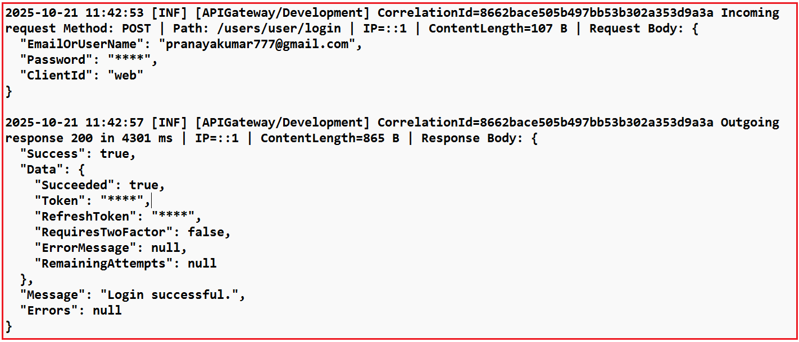
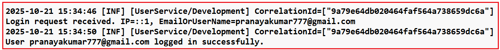

## **لاگ گیری با Ocelot API Gateway در ASP.NET Core Web API**

در معماری میکروسرویس‌ها، Ocelot API Gateway نقش کلیدی در مدیریت درخواست‌های ورودی و هدایت آنها به سرویس‌های مناسب ایفا می‌کند. برای قابل اعتماد و آسان‌تر کردن نظارت بر این فرآیند، ثبت صحیح وقایع ضروری است.

را توضیح خواهیم داد **اکنون، نحوه پیاده‌سازی گزارش‌گیری ساختاریافته با استفاده از Serilog** در Ocelot API Gateway منحصر به فرد استفاده کنیم **. همچنین یاد خواهیم گرفت که چگونه از میان‌افزار سفارشی برای ردیابی هر درخواست با یک شناسه همبستگی** ، که به ما کمک می‌کند به راحتی یک درخواست واحد را در چندین سرویس ردیابی کنیم .

#### **Serilog در ASP.NET Core چیست؟**

Serilog یک **محبوب، با کارایی بالا و ساختارمند برای ثبت وقایع (logging)** **کتابخانه شخص ثالث** برای برنامه‌های .NET، از جمله ASP.NET Core Web API است که روشی قدرتمند و انعطاف‌پذیر برای ضبط، ذخیره و تجزیه و تحلیل داده‌های گزارش (log) در اختیار توسعه‌دهندگان قرار می‌دهد.

برخلاف لاگینگ سنتی (که متن ساده را ذخیره می‌کند)، Serilog لاگ‌ها را به صورت **داده‌های ساختاریافته** ذخیره می‌کند ، به این معنی که لاگ‌ها در قالب کلید-مقدار ذخیره می‌شوند و این امر باعث می‌شود که **به راحتی** در ابزارهایی مانند **Seq** ، **Elasticsearch/Kibana** یا حتی **SQL Server** قابل جستجو، فیلتر و پرس‌وجو باشند .

##### **مثال**

لاگ سنتی (بدون ساختار):

**کاربر جان سفارشی با شناسه ۷۸۹ ثبت کرد**

لاگ ساختاریافته Serilog:

```json
{
  "Timestamp": "2025-10-21T08:00:12Z",
  "UserName": "John",
  "Action": "OrderPlaced",
  "OrderId": 789
}
```

این ساختار، فیلترهایی مانند OrderId = 789 یا UserName = 'John' را مستقیماً از داشبوردها امکان‌پذیر می‌کند.

#### **چرا از Serilog در میکروسرویس‌ها (به‌ویژه API Gateway) استفاده کنیم؟**

در یک اکوسیستم میکروسرویس‌ها، **API Gateway** برای همه درخواست‌های کلاینت است **نقطه ورود واحد** . بنابراین، بسیار مهم است که **ثبت وقایع متمرکز، ساختاریافته و همبسته‌ای** داشته باشیم تا هر درخواست از کلاینت → دروازه → میکروسرویس → پاسخ را ردیابی کنیم.

##### **مزایای کلیدی**

- **ثبت وقایع متمرکز** : ثبت هر درخواستی که از دروازه عبور می‌کند.
- **خروجی ساختاریافته** : ادغام آسان با Seq، **Elasticsearch/Kibana** یا Azure Application Insights.
- **حداقل تغییرات کد** : پیکربندی از طریق appsettings.json انجام می‌شود.
- **عملکرد مناسب** : ثبت وقایع ناهمگام با دسته‌بندی.
- **ردیابی درخواست/پاسخ** : به اشکال‌زدایی مسیریابی یا مشکلات عملکرد در Ocelot کمک می‌کند.

##### **سینک‌های سریلاگ رایج**

یک سینک جایی است که Serilog داده‌های لاگ خود را در آن می‌نویسد. می‌توانید یک یا چند سینک را با هم پیکربندی کنید.

- **کنسول:** گزارش‌ها در کنسول (ایده‌آل برای توسعه).
- **فایل:** گزارش‌ها را در فایل‌های متنی متحرک یا JSON ذخیره می‌کند.
- **Seq:** گزارش‌ها را در داشبورد Seq (نمایشگر قدرتمند گزارش‌های ساختاریافته) ذخیره می‌کند.
- **Elasticsearch:** برای تجزیه و تحلیل با پشته ELK ادغام می‌شود.
- **SQL Server / PostgreSQL:** لاگ‌های ساختاریافته را در پایگاه‌های داده ذخیره می‌کند.
- **بینش‌های کاربردی / گرافانا لوکی:** قابلیت مشاهده بومی ابر و کانتینر.

**مثال:** شما می‌توانید همزمان برای اشکال‌زدایی محلی و بررسی مداوم تاریخچه، به کنسول و فایل لاگین کنید.

##### **نصب بسته‌های مورد نیاز Serilog NuGet**

قبل از شروع کدنویسی، باید بسته‌های لازم Serilog را نصب کنیم. این بسته‌ها از ثبت وقایع در چندین مقصد (sink) پشتیبانی می‌کنند و امکان پیکربندی از طریق JSON را فراهم می‌کنند. این بسته‌ها عبارتند از:

- **Serilog.AspNetCore:** Serilog را با ASP.NET Core ادغام می‌کند و جایگزین ارائه‌دهنده‌ی گزارش‌گیری پیش‌فرض می‌شود.
- **Serilog.Sinks.Console:** خروجی لاگ را به کنسول فعال می‌کند، که در طول توسعه برای نظارت بر لاگ‌ها در زمان واقعی بسیار مفید است.
- **Serilog.Sinks.File:** ثبت وقایع در فایل‌های روی دیسک را فعال می‌کند. این برای ذخیره‌سازی پایدار، حسابرسی و تحلیل پس از رویداد مفید است.
- **Serilog.Settings.Configuration:** به Serilog اجازه می‌دهد تا از طریق appsettings.json پیکربندی شود، بنابراین می‌توانید تنظیمات گزارش را بدون تغییر کد تغییر دهید.
- **Serilog.Sinks.Async:** سینک‌های ثبت وقایع را با قابلیت ناهمزمان در بر می‌گیرد تا با انتقال پردازش وقایع به یک نخ پس‌زمینه، عملکرد را بهبود بخشد.

شما می‌توانید این بسته‌ها را با استفاده از NuGet Package Manager یا با اجرای دستورات زیر در Visual Studio Package Manager Console نصب کنید:

- **نصب بسته Serilog.AspNetCore**
- **نصب بسته Serilog.Sinks.Console**
- **نصب بسته Serilog.Sinks.File**
- **نصب بسته Serilog.Settings.Configuration**
- **نصب بسته Serilog.Sinks.Async**

#### **پیکربندی Serilog در appsettings.json برای ثبت وقایع متمرکز**

فایل appsettings.json پیکربندی متمرکز Serilog را در خود جای داده و نحوه تولید، قالب‌بندی و ذخیره لاگ‌ها را تعریف می‌کند. این فایل با اجازه دادن به توسعه‌دهندگان برای کنترل سطوح لاگ و خروجی‌ها به طور مستقیم از پیکربندی، نیاز به منطق لاگ‌گیری کدنویسی‌شده در برنامه را از بین می‌برد.

این پیکربندی تعیین می‌کند:

- کدام لاگ‌ها ثبت می‌شوند (MinimumLevel).
- جایی که ارسال می‌شوند (سینک‌های WriteTo مانند Console یا File).
- چه فراداده‌ای پیوست شده است (ویژگی‌ها).
- نحوه نمایش هر ورودی لاگ (outputTemplate).

این امر باعث می‌شود ثبت وقایع Serilog **انعطاف‌پذیر، قابل نگهداری و مستقل از محیط باشد** . لطفاً فایل appsettings.json را به صورت زیر تغییر دهید تا تمام تنظیمات Serilog را شامل شود. پیکربندی زیر نیازی به توضیح ندارد؛ لطفاً برای درک بهتر، خطوط توضیحات را مطالعه کنید.

```json
{
  // ASP.NET Core Host Configuration.
  // Allows the application to accept requests from any host.
  "AllowedHosts": "*",

  // SERILOG CONFIGURATION SECTION
  "Serilog": {

    // Minimum Log Levels
    "MinimumLevel": {
      "Default": "Information", // Global minimum level. Only logs of this level or higher will be written.
      // Levels: Verbose < Debug < Information < Warning < Error < Fatal

      // Override rules to reduce noise from framework-level logs.
      "Override": {
        // Logs from Microsoft.* namespaces (e.g., ASP.NET internals) will be shown only
        // when they are "Error" or higher.
        "Microsoft": "Error",

        // Same as above, but for System.* namespaces (e.g., BCL libraries).
        "System": "Error",

        // Restrict Ocelot gateway logs to "Error" level and above.
        "Ocelot": "Error"
      }
    },

    // Global metadata automatically attached to every log entry.
    // These help identify which app/environment produced the log
    // when aggregating logs from multiple services.
    "Properties": {
      "Application": "APIGateway", // Custom tag for application name.
      "Environment": "Development" // Useful when running multiple environments (Dev/Staging/Prod).
    },

    // OUTPUT (SINK) CONFIGURATIONS - Where Logs Are Written
    "WriteTo": [

      // ---------------- CONSOLE SINK ----------------
      {
        // Writes logs to the terminal (console window). It is handy during development
        "Name": "Console",

        "Args": {
          // Defines how each log line is formatted in the console.
          // Tokens in braces are placeholders replaced by property values at runtime.
          //
          // {Timestamp}   → When the log was created. Date and time of the log event
          // [{Level:u3}]  → Shortened Log level abbreviation (INF, WRN, ERR, etc.).
          // [{Application}/{Environment}] → Custom app/environment identifiers from Properties.
          // CorrelationId={CorrelationId} → Displays the correlation ID for tracing a request end-to-end.
          // {Message:lj}  → Main log message (with structured data if present, JSON Data).
          // {NewLine}{Exception} → Adds a newline and exception details (if any).
          "outputTemplate": "{Timestamp:yyyy-MM-dd HH:mm:ss} [{Level:u3}] [{Application}/{Environment}] CorrelationId={CorrelationId} {Message:lj}{NewLine}{Exception}"
        }
      },

      // ---------------- FILE SINK ----------------
      {
        // Writes logs to disk files for persistence and later analysis.
        "Name": "File",

        "Args": {
          // Log file path and naming convention. 
          // The '-' will be replaced with the date when using rolling log files.
          // Example: logs/APIGateway-2025-10-21.log
          "path": "logs/APIGateway-.log",

          // Creates a new log file daily (helps keep files smaller and organized).
          "rollingInterval": "Day",

          // Keeps the last 30 log files and deletes older ones automatically.
          "retainedFileCountLimit": 30,

          // Allows multiple processes (if any) to write to the same log file safely.
          "shared": true,

          // Uses the same log format as the console output for consistency.
          "outputTemplate": "{Timestamp:yyyy-MM-dd HH:mm:ss} [{Level:u3}] [{Application}/{Environment}] CorrelationId={CorrelationId} {Message:lj}{NewLine}{Exception}"
        }
      }
    ]
  }
}
```

###### **نکات کلیدی برای به خاطر سپردن:**

- **راه‌اندازی متمرکز:** برای تغییر قالب‌ها یا سینک‌های لاگ، نیازی به اصلاح کد نیست.
- **ثبت لاگ‌های ساختاریافته:** لاگ‌ها را به صورت جفت‌های کلید-مقدار ثبت می‌کند تا قابلیت جستجو در ابزارهایی مانند Kibana یا Seq فراهم شود.
- **خروجی‌های چندگانه:** گزارش‌ها را همزمان در **کنسول** روزانه **و فایل‌های گزارش** می‌نویسد .
- **کنترل سطح:** با تنظیم آستانه‌های بالاتر (مایکروسافت، سیستم، Ocelot تا خطا)، نویز چارچوب را فیلتر می‌کند.
- **اطلاعات زمینه‌ای:** ابرداده‌هایی مانند برنامه و محیط را به هر گزارش پیوست می‌کند.
- **آماده برای همبستگی:** قالب‌های گزارش شامل متغیرهایی برای CorrelationId هستند که امکان ردیابی سرتاسری را فراهم می‌کنند.

#### **ایجاد یک میان‌افزار CorrelationId:**

این میان‌افزار تضمین می‌کند که هر درخواست ورودی یک **شناسه همبستگی منحصر به فرد** دارد که برای ردیابی درخواست در چندین میکروسرویس استفاده می‌شود. اگر درخواستی از قبل شامل هدر **X-Correlation-ID** باشد ، از آن دوباره استفاده می‌کند؛ در غیر این صورت، یک GUID جدید تولید می‌کند. سپس شناسه همبستگی به موارد زیر اضافه می‌شود:

1. هدر درخواست (برای ریزسرویس‌های پایین‌دستی)،
2. هدر پاسخ (برای مرجع کلاینت)،
3. Serilog **LogContext** ، بنابراین تمام ورودی‌های لاگ به طور خودکار آن را شامل می‌شوند.

این پایه و اساس **ردیابی توزیع‌شده‌ی سرتاسری** در میکروسرویس‌ها است. بنابراین، ابتدا پوشه‌ای به نام **Middlewares** در دایرکتوری ریشه پروژه ایجاد کنید. سپس، درون **پوشه Middlewares** ، یک فایل کلاس به نام **CorrelationIdMiddleware.cs** ایجاد کنید و کد زیر را کپی و پیست کنید:

```csharp
using Serilog.Context;

namespace APIGateway.Middlewares
{
    // Middleware that ensures every incoming request has a unique Correlation ID.
    // This ID is used to trace a request end-to-end across multiple microservices
    // and is automatically attached to all Serilog log entries.
    public class CorrelationIdMiddleware
    {
        // The next middleware in the request pipeline.
        private readonly RequestDelegate _next;

        // The HTTP header name used to carry the correlation ID.
        private const string HeaderName = "X-Correlation-ID";

        // Constructor injects the next delegate in the pipeline.
        public CorrelationIdMiddleware(RequestDelegate next)
        {
            _next = next;
        }

        // Invoked once per HTTP request. 
        // Responsible for generating or reusing a Correlation ID and injecting it into:
        //      1. The request header (for downstream services)
        //      2. The response header (for clients)
        //      3. The Serilog log context (for structured logging)
        public async Task InvokeAsync(HttpContext context)
        {
            // Try to retrieve the correlation ID from the incoming request headers.
            // If not present, generate a new one.
            if (!context.Request.Headers.TryGetValue(HeaderName, out var cid) || string.IsNullOrWhiteSpace(cid))
            {
                // Generate a new GUID (without hyphens for compactness)
                cid = Guid.NewGuid().ToString("N");

                // Add the newly generated correlation ID to the request header
                // so that downstream services (like other microservices) can reuse it.
                context.Request.Headers[HeaderName] = cid;
            }

            // Ensure the same correlation ID is returned to the client
            // in the response header, so API consumers can match request/response.
            context.Response.Headers[HeaderName] = cid;

            // LogContext.PushProperty temporarily adds a property to Serilog’s log context.
            // Every log created during this request will automatically include CorrelationId.
            // Example log output:
            // 2025-10-21 10:05:12 [INF] [APIGateway/Development] CorrelationId=8e2f94a9c2d74f7d9bcedff2a742f847
            using (LogContext.PushProperty("CorrelationId", cid.ToString()))
            {
                // Continue request processing by invoking the next middleware.
                await _next(context);
            }
        }
    }

    // Extension method for registering the CorrelationIdMiddleware
    // in a fluent and readable way inside Program.cs (app.UseCorrelationId()).
    public static class CorrelationIdMiddlewareExtensions
    {
        // Adds the CorrelationIdMiddleware to the ASP.NET Core request pipeline.
        public static IApplicationBuilder UseCorrelationId(this IApplicationBuilder builder)
        {
            // This allows easy, self-documenting registration in Program.cs:
            // app.UseCorrelationId();
            return builder.UseMiddleware<CorrelationIdMiddleware>();
        }
    }
}
```

###### **نکات کلیدی**

- **انتشار سرآیند:** تضمین می‌کند که X-Correlation-ID در کل زنجیره درخواست حرکت کند.
- **تولید خودکار:** اگر کلاینت شناسه منحصر به فرد جدیدی ارائه ندهد، این شناسه را ایجاد می‌کند.
- **غنی‌سازی لاگ:** شناسه را در متن Serilog قرار می‌دهد تا به طور خودکار در تمام ورودی‌های لاگ ظاهر شود.
- **انعکاس هدر پاسخ:** با نمایش شناسه یکسان در پاسخ‌های کلاینت، اشکال‌زدایی را آسان‌تر می‌کند.
- **قابلیت استفاده مجدد:** شامل یک متد افزونه UseCorrelationId() برای ثبت نام تمیز در Program.cs است.

#### **یک RequestResponseLoggingMiddleware ایجاد کنید:**

این میان‌افزار هر درخواست ورودی و پاسخ خروجی را با جزئیات ثبت می‌کند. این میان‌افزار موارد زیر را ثبت می‌کند:

- روش HTTP، مسیر و IP کلاینت.
- متن درخواست و متن پاسخ (تا ۶۴ کیلوبایت) با قابلیت پوشش داده‌های حساس.
- زمان اجرا بر حسب میلی ثانیه.

همچنین **قبل از ورود به سیستم، اطلاعات حساس مانند رمزهای عبور و توکن‌ها را پنهان می‌کند** . این میان‌افزار، **امنیت** و **قابلیت مشاهده را** در محیط‌های عملیاتی تضمین می‌کند.

##### **چگونه کار می‌کند:**

1. بدنه درخواست را با خیال راحت می‌خواند (با فعال بودن بافرینگ).
2. پاسخ را به طور موقت در MemoryStream برای بررسی ذخیره می‌کند.
3. تمام فراداده‌ها، شامل بارهای داده، زمان اجرا و وضعیت پاسخ را ثبت می‌کند.
4. از یک روش پوشش مبتنی بر regex برای پنهان کردن مقادیر محرمانه استفاده می‌کند.
5. پاسخ را بدون تغییر، برای کلاینت کپی می‌کند.

بنابراین، یک فایل کلاس با نام **RequestResponseLoggingMiddleware.cs** در پوشه Middlewares ایجاد کنید و سپس کد زیر را کپی و جایگذاری کنید:

```csharp
using Serilog;
using System.Text;
using System.Text.Json;
using System.Text.RegularExpressions;

namespace APIGateway.Middlewares
{
    // Middleware for logging detailed information about every incoming request
    // and outgoing response in the ASP.NET Core API Gateway.
    // Responsibilities:
    //      1. Logs HTTP Method, URL Path, QueryString, IP Address, Request Body.
    //      2. Measure and log total request-processing time.
    //      3. Logs response status code, response time, and response body.
    //      4. Masks sensitive fields like passwords, tokens, and secrets.
    public class RequestResponseLoggingMiddleware
    {
        // List of sensitive key names that should be masked in logs.
        // Add or remove entries as needed for your application security needs.
        private static readonly string[] DefaultSensitiveKeys = new[]
        {
            "password", "pwd", "token", "secret", "api_key", "apikey", "token",
            "accesstoken", "refreshtoken", "access_token", "refresh_token"
        };

        // Delegate reference to invoke the next middleware in the request pipeline.
        private readonly RequestDelegate _next;

        // Limit how much data can be logged from a request or response body (in bytes).
        // This protects the gateway from memory overuse if clients send very large payloads.
        private const int MaxBodySize = 64 * 1024; // 64 KB

        // Constructor injection of the pipeline delegate.
        public RequestResponseLoggingMiddleware(RequestDelegate next)
        {
            _next = next;
        }

        // Primary Entry Point for Every HTTP Request
        public async Task InvokeAsync(HttpContext context)
        {
            // Stopwatch to measure total request processing time.
            var stopWatch = System.Diagnostics.Stopwatch.StartNew();

            // Variable to hold request body content (if captured).
            string requestBody = string.Empty;

            try
            {
                // CAPTURE REQUEST BODY (only for JSON POST/PUT/PATCH requests)
                if (ShouldCaptureRequest(context.Request))
                {
                    // EnableBuffering allows us to read the body stream multiple times
                    // (without consuming it permanently).
                    context.Request.EnableBuffering();

                    // Read the full request body as a string.
                    using var reader = new StreamReader(context.Request.Body, Encoding.UTF8, leaveOpen: true);
                    var raw = await reader.ReadToEndAsync();

                    // Reset the body stream position so downstream middleware can still read it.
                    context.Request.Body.Position = 0;

                    // If the request body is within allowed size, log it safely (after masking sensitive data)
                    requestBody = raw.Length <= MaxBodySize
                        ? MaskSensitiveData(raw)
                        : $"[Request body too large: {raw.Length / 1024} KB truncated]";
                }

                // PREPARE TO CAPTURE RESPONSE BODY

                // Original Response Stream: Keep a reference to the original stream
                var originalBody = context.Response.Body;

                //  Temporary Response Stream: Temporary buffer to hold response.
                await using var memoryStream = new MemoryStream();

                // Replace the response stream.
                context.Response.Body = memoryStream;

                // Gather request metadata for structured logging
                var requestPath = context.Request.Path.Value ?? "/";
                var queryString = context.Request.QueryString.HasValue ? context.Request.QueryString.Value : string.Empty;
                var clientIp = context.Connection.RemoteIpAddress?.ToString() ?? "-";
                var reqLenText = context.Request.ContentLength.HasValue ? $"{context.Request.ContentLength.Value} B" : "-";

                // Build a human-readable request log message with pipe-separated fields
                var reqSegments = new List<string>
                {
                    $"Incoming request Method: {context.Request.Method}",
                    $"Path: {requestPath}{queryString}",
                    $"IP={clientIp}",
                    $"ContentLength={reqLenText}"
                };

                // Add the request body if available
                if (!string.IsNullOrEmpty(requestBody))
                    reqSegments.Add($"Request Body: {requestBody}");

                // Log the final combined request details
                Log.Information(string.Join(" | ", reqSegments));

                // INVOKE NEXT MIDDLEWARE (Actual API Execution)
                await _next(context);

                // Stop the stopwatch as soon as response is generated
                stopWatch.Stop();

                // CAPTURE RESPONSE BODY CONTENT
                // Reset the memory stream's position to the beginning
                // because downstream middleware has already written the full response
                // into this temporary stream. We now need to read it from the start.
                memoryStream.Position = 0;

                // Variable that will store the final response body text.
                string responseBody;

                // Create a StreamReader to read text from the memoryStream (the captured response).
                // leaveOpen: true keeps the memoryStream usable later when we copy it back to the original stream.
                using (var reader = new StreamReader(memoryStream, Encoding.UTF8, leaveOpen: true))
                {
                    // Read the entire response stream into a raw string.
                    // This gives us the exact JSON/text returned by the downstream service.
                    var raw = await reader.ReadToEndAsync();

                    // Reset the position back to zero again so that the stream can be
                    // copied to the original Response.Body later for client delivery.
                    memoryStream.Position = 0;

                    // Only process the body if it's within the configured maximum capture size (64 KB)
                    if (raw.Length <= MaxBodySize)
                    {
                        // Attempt to format the body as indented JSON.
                        // This makes the logged response human-readable instead of a
                        // compact single-line JSON string. If the content is not JSON,
                        // parsing will throw and we'll fall back to plain text.
                        try
                        {
                            // Parse the raw string into a structured JsonDocument.
                            using var jsonDoc = JsonDocument.Parse(raw);

                            // Serialize the JsonDocument back to text but with indentation.
                            // WriteIndented = true adds line breaks and spacing for readability.
                            var pretty = JsonSerializer.Serialize(
                                jsonDoc,
                                new JsonSerializerOptions { WriteIndented = true }
                            );

                            // Apply masking to hide sensitive fields (passwords, tokens, etc.)
                            // before including the content in logs.
                            responseBody = MaskSensitiveData(pretty);
                        }
                        catch
                        {
                            // Fallback path when parsing fails.
                            // If the response isn't valid JSON (for example plain text,
                            // XML, or binary data), skip formatting and just mask sensitive
                            // values using Regex on the raw string.
                            responseBody = MaskSensitiveData(raw);
                        }
                    }
                    else
                    {
                        // Handle large payloads.
                        // When the response body exceeds MaxBodySize (64 KB),
                        // don't log its contents. Instead, record a truncated note.
                        responseBody = $"[Response body too large: {raw.Length / 1024} KB truncated]";
                    }
                }

                // Copy the captured response back to the original stream
                await memoryStream.CopyToAsync(originalBody);

                // BUILD & LOG RESPONSE DETAILS
                // Response size in bytes
                var resLenText = $"{memoryStream.Length} B";

                // Build a human-readable response log
                var resSegments = new List<string>
                {
                    $"Outgoing response {context.Response.StatusCode} in {stopWatch.ElapsedMilliseconds} ms",
                    $"IP={clientIp}",
                    $"ContentLength={resLenText}"
                };

                // Include body if available.
                if (!string.IsNullOrEmpty(responseBody))
                    resSegments.Add($"Response Body: {responseBody}");

                // Log the final combined response details
                Log.Information(string.Join(" | ", resSegments));
            }
            catch (Exception ex)
            {
                // HANDLE UNEXPECTED ERRORS
                // Stop timer if exception occurs
                stopWatch.Stop();

                // Log error with full exception stack trace for debugging
                Log.Error(ex, "Error in RequestResponseLoggingMiddleware");

                // Re-throw to allow global exception handlers to act
                throw; 
            }
        }

        // Determines whether the request body should be captured based on:
        //      1. Content-Type being JSON.
        //      2. HTTP Method being POST, PUT, or PATCH.
        // Avoids unnecessary logging for GET requests or binary content.
        private static bool ShouldCaptureRequest(HttpRequest request)
        {
            if (string.IsNullOrWhiteSpace(request.ContentType))
                return false;

            return request.ContentType.Contains("application/json", StringComparison.OrdinalIgnoreCase)
                   && (request.Method == HttpMethods.Post
                       || request.Method == HttpMethods.Put
                       || request.Method == HttpMethods.Patch);
        }

        // Masks sensitive values (like passwords, tokens, or secrets) from JSON-formatted
        // strings before they are logged. This ensures that confidential information
        // never appears in log files.
        // Example transformation:
        // Input:  {"user":"admin","password":"mypwd","token":"abcd123"}
        // Output: {"user":"admin","password":"****","token":"****"}
        private static string MaskSensitiveData(string body)
        {
            try
            {
                // STEP 1: Build a single regex pattern that includes all sensitive keys.
                // DefaultSensitiveKeys = ["password", "pwd", "token", "secret", ...]
                //
                // The `string.Join("|", ...)` joins all items using the '|' character,
                // which in regex means "OR".
                //
                // Example output pattern:
                //     password|pwd|token|secret|api_key|apikey|access_token|refresh_token
                //
                // `Regex.Escape()` ensures that special characters (like underscores)
                // in key names are treated literally, not as regex operators.
                var pattern = string.Join("|", DefaultSensitiveKeys.Select(Regex.Escape));

                // STEP 2: Construct the actual regex expression.
                // The constructed regex will look like this:
                //   (?i)("(?:(password|pwd|token|...))"\\s*:\\s*")\[^"\]*(")
                //
                // Explanation of each piece:
                //   (?i)                  → Enables case-insensitive matching (so "Password" or "TOKEN" also match).
                //   \\"(?:{pattern})\\"     → Matches any property name in double quotes whose name is in our key list.
                //   \\s*:\\s*               → Matches the colon separating the key from its value, with optional spaces.
                //   \\"\[^\\"\]*\\"            → Matches the quoted string value (everything between the next pair of quotes).
                //
                // Combined, this finds JSON fragments like:
                //     "password": "myp@ss"
                //     "api_key" : "12345"
                // and captures them in groups for replacement.

                var regex = new Regex($"(?i)(\\"(?:{pattern})\\"\\s*:\\s*\\")\[^\\"\]*(\\")");

                // STEP 3: Replace all captured sensitive values with "****"
                // $1 and $2 are backreferences to the first and second capture groups:
                //   $1 → everything before the sensitive value (e.g., "password":")
                //   $2 → the closing double quote after the value
                //
                // The sensitive content between $1 and $2 gets replaced with "****".
                //
                // Example:
                //   Before:  "token":"abcd1234"
                //   After :  "token":"****"
                return regex.Replace(body, "$1****$2");
            }
            catch
            {
                // STEP 4: Fallback for unexpected situations.
                // If:
                //   - The input isn't valid JSON,
                //   - The regex construction fails, or
                //   - The body contains special encodings that break parsing,
                // ...then we simply return the original text without modification.
                //
                // This ensures logging continues safely instead of crashing the app.
                return body;
            }
        }

    }

    // Extension method for easily adding this middleware
    // to the ASP.NET Core pipeline via app.UseRequestResponseLogging().
    public static class RequestResponseLoggingMiddlewareExtensions
    {
        public static IApplicationBuilder UseRequestResponseLogging(this IApplicationBuilder builder)
        {
            // Enables a clean, self-explanatory registration in Program.cs:
            // app.UseRequestResponseLogging();
            return builder.UseMiddleware<RequestResponseLoggingMiddleware>();
        }
    }
}
```

##### **نکات کلیدی**

- **قابلیت مشاهده کامل درخواست:** روش گزارش‌ها، URL، هدرها و بدنه (در صورت وجود).
- **ردیابی پاسخ:** محتوای پاسخ، اندازه و زمان پردازش را ثبت می‌کند.
- **ثبت وقایع با رویکرد امنیتی:** از پوشش مبتنی بر regex برای پنهان کردن داده‌های حساس (رمز عبور، توکن و غیره) استفاده می‌کند.
- **محافظت از اندازه:** برای جلوگیری از بارگذاری بیش از حد گزارش، حجم ثبت اطلاعات را به ۶۴ کیلوبایت محدود می‌کند.
- **Pretty-Printing:** پاسخ‌های JSON را قالب‌بندی می‌کند تا خواندن لاگ‌ها آسان‌تر شود.
- **افزونه‌ی قابل استفاده‌ی مجدد:** به راحتی با استفاده از app.UseRequestResponseLogging() ثبت می‌شود.

#### **پیکربندی Serilog و میان‌افزار سفارشی در Program.cs**

این **نقطه ورود برنامه** است که تمام اجزا، مانند پیکربندی Serilog، ثبت میان‌افزار و راه‌اندازی خط لوله Ocelot، در آن مونتاژ می‌شوند. این نقطه موارد زیر را انجام می‌دهد:

- Serilog را از appsettings.json مقداردهی اولیه می‌کند.
- گزارش‌گیری پیش‌فرض .NET را با Serilog جایگزین می‌کند.
- پیکربندی مسیریابی Ocelot را از ocelot.json بارگذاری می‌کند.
- میان‌افزارهای سفارشی (CorrelationId و RequestResponseLogging) را اضافه می‌کند.
- میان‌افزار Ocelot gateway را به عنوان آخرین مرحله ثبت و اجرا می‌کند.

این فایل تضمین می‌کند که **Serilog** ، **Ocelot** و **Custom Logging Middlewares** در یک خط لوله یکپارچه با هم کار کنند. بنابراین، لطفاً **کلاس Program.cs** را به صورت زیر تغییر دهید. کد زیر نیازی به توضیح ندارد؛ لطفاً برای درک بهتر، خطوط کامنت را مطالعه کنید.

```csharp
using APIGateway.Middlewares;
using Ocelot.DependencyInjection;
using Ocelot.Middleware;
using Serilog;

namespace APIGateway
{
    public class Program
    {
        public async static Task Main(string[] args)
        {
            var builder = WebApplication.CreateBuilder(args);

            // Configure Serilog as the application's main logging provider.
            //
            // The LoggerConfiguration() object defines how logs are captured,
            // formatted, and written to sinks (e.g., console, file).
            //
            // Serilog supports structured logging, so every log entry can include
            // custom properties (like CorrelationId, Environment, RequestPath, etc.)
            // that make log analysis easier in tools like Seq, Kibana, or Grafana.
            //
            // 1️ .ReadFrom.Configuration(builder.Configuration)
            //     → Reads all Serilog settings (sinks, templates, overrides, etc.)
            //       directly from appsettings.json. This allows configuration
            //       without recompiling code.
            //
            // 2️ .Enrich.FromLogContext()
            //     → Captures context-specific properties pushed via LogContext
            //       (for example, CorrelationId from your custom middleware).
            //
            // 3️ .CreateLogger()
            //     → Finalizes the logger and assigns it to Log.Logger,
            //       making it globally available via Serilog's static Log class.
            Log.Logger = new LoggerConfiguration()
                 .ReadFrom.Configuration(builder.Configuration)
                 .Enrich.FromLogContext()
                 .CreateLogger();

            // Replace the default .NET logging system with Serilog.
            //
            // By default, ASP.NET Core uses Microsoft.Extensions.Logging
            // which outputs unstructured text logs.
            //
            // The call below tells the host to pipe all framework and application
            // logs through Serilog instead. This ensures consistent, structured
            // log output everywhere.
            builder.Host.UseSerilog();

            // Load Ocelot Configuration
            // Ocelot uses a JSON file (ocelot.json) that defines all routes —
            // mapping between client-facing (Upstream) URLs and internal microservice (Downstream) URLs.
            //
            // optional:false  → ensures ocelot.json must exist; app won't start without it.
            // reloadOnChange:true → allows automatic route updates during development
            //                       without restarting the API Gateway.
            builder.Configuration.AddJsonFile(
                "ocelot.json",
                optional: false,
                reloadOnChange: true
            );

            // Register Ocelot Services
            // This adds all required Ocelot services (middleware, configuration providers,
            // route matching, downstream request handling, etc.) to the DI container.
            //
            // Passing builder.Configuration allows Ocelot to access the ocelot.json content.
            builder.Services.AddOcelot(builder.Configuration);

            var app = builder.Build();

            app.UseHttpsRedirection();

            // Add custom middleware before Ocelot.
            //
            // UseCorrelationId()
            //    → Attaches a unique correlation ID (X-Correlation-ID) to every request.
            //      This value is pushed into Serilog's LogContext so you can trace
            //      the same request across multiple microservices easily.
            //
            // UseRequestResponseLogging()
            //    → Logs the request and response bodies, masking sensitive fields
            //      (passwords, tokens, etc.), and includes timing metrics.
            app.UseCorrelationId();
            app.UseRequestResponseLogging();

            // Register Ocelot Middleware (Core Gateway Logic)
            // Ocelot middleware is the heart of the API Gateway.
            // What Ocelot Middleware Does:
            //   - Inspects incoming HTTP requests.
            //   - Matches it to a configured route defined in ocelot.json.
            //   - Forwards the request to the correct downstream microservice.
            //   - Collects the downstream response and returns it to the client.
            //
            // IMPORTANT:
            // This MUST be the LAST middleware in the pipeline,
            // Once Ocelot handles a request, no other middleware executes afterward.

            await app.UseOcelot();

            app.Run();
        }
    }
}
```

###### **نکات کلیدی**

- **فعال‌سازی ثبت وقایع متمرکز:** Serilog را از پیکربندی مقداردهی اولیه می‌کند.
- **غنی‌سازی زمینه:** داده‌های زمینه‌ای، مانند CorrelationId، را از طریق Enrich.FromLogContext() فعال می‌کند.
- **کنترل کامل خط لوله:** میان‌افزارهای سفارشی را قبل از Ocelot قرار می‌دهد تا از ثبت تمام درخواست‌ها اطمینان حاصل شود.

#### **منظور از ثبت وقایع ناهمزمان چیست؟**

ثبت وقایع ناهمزمان به این معنی است که Serilog رویدادهای گزارش را در sinkها ( مانند فایل‌ها یا کنسول) **در پس‌زمینه** می‌نویسد ، بدون اینکه thread اصلی شما را مسدود کند. این امر باعث بهبود **توان عملیاتی برنامه** ، **زمان پاسخ** و **جلوگیری از تأخیرهای I/O می‌شود** \- به خصوص زمانی که موارد زیر را دارید:

- ثبت وقایع با فرکانس بالا (مانند میان‌افزار یا کارهای پس‌زمینه)
- سینک‌های فایل یا شبکه (مثلاً Seq، Elasticsearch)
- ثبت وقایع درون APIهای حیاتی از نظر عملکرد

بدون سینک‌های ناهمزمان، فراخوانی‌های ثبت وقایع مانند \_logger.LogInformation() هنوز خیلی سریع انجام می‌شوند، اما شامل یک **عملیات Small Synchronous Disk Write** یا خروجی کنسول در thread درخواست می‌شود. appsettings.json ما دو سینک دارد:

```json
"WriteTo": [
  { "Name": "Console", "Args": { "outputTemplate": "..." } },
  { "Name": "File", "Args": { "path": "logs/UserService-.log", ... } }
]
```

این سینک‌ها **به طور پیش‌فرض همگام** هستند ، بنابراین Serilog مستقیماً روی کنسول و فایل **روی همان نخی** که درخواست HTTP را مدیریت می‌کند، می‌نویسد. این بدان معناست که اگرچه Serilog بسیار کارآمد است، اما همچنان **یک نوشتن مسدودکننده انجام می‌دهد.** برای هر ورودی لاگ،

#### **نحوه فعال کردن گزارش‌گیری ناهمزمان**

برای **ناهمگام‌سازی** ثبت وقایع ، باید هر sink را با **AsyncSinkWrapper** ارائه شده توسط بسته Serilog.Sinks.Async که قبلاً نصب کرده‌ایم، بپوشانید.

سپس، باید بخش WriteTo را طوری تغییر دهیم که از «Async» به عنوان نام sink استفاده کند و sink واقعی خود (مانند File یا Console) را درون بلوک Args.configure آن قرار دهیم. لطفاً فایل appsettings.json را به صورت زیر تغییر دهید تا ثبت وقایع async فعال شود.

```json
{
  "AllowedHosts": "*",
  "Serilog": {
    "MinimumLevel": {
      "Default": "Information",
      "Override": {
        "Microsoft": "Error",
        "System": "Error",
        "Ocelot": "Error"
      }
    },

    "Properties": {
      "Application": "APIGateway",
      "Environment": "Development"
    },

    "WriteTo": [
      {
        "Name": "Async",
        "Args": {
          "configure": [
            {
              "Name": "Console",
              "Args": {
                "outputTemplate": "{Timestamp:yyyy-MM-dd HH:mm:ss} [{Level:u3}] [{Application}/{Environment}] CorrelationId={CorrelationId} {Message:lj}{NewLine}{Exception}"
              }
            }
          ]
        }
      },
      {
        "Name": "Async",
        "Args": {
          "configure": [
            {
              "Name": "File",
              "Args": {
                "path": "logs/UserService-.log",
                "rollingInterval": "Day",
                "retainedFileCountLimit": 30,
                "shared": true,
                "outputTemplate": "{Timestamp:yyyy-MM-dd HH:mm:ss} [{Level:u3}] [{Application}/{Environment}] CorrelationId={CorrelationId} {Message:lj}{NewLine}{Exception}"
              }
            }
          ]
        }
      }
    ]
  }
}
```

##### **چه اتفاقی در پشت صحنه می‌افتد؟**

- بسته‌بندی Async یک **صف پس‌زمینه** معرفی می‌کند .
- وقتی \_logger.LogInformation() فراخوانی می‌شود، Serilog **پیام لاگ را بلافاصله در صف قرار می‌دهد** و برمی‌گرداند.
- یک کارگر پس‌زمینه، گزارش‌ها را به صورت ناهمگام در فایل یا کنسول شما می‌نویسد.
- نخ اصلی (که درخواست HTTP را ارائه می‌دهد) بلافاصله به اجرا ادامه می‌دهد و زمان پاسخ را بهبود می‌بخشد.

##### **چگونه از Serilog در سایر میکروسرویس‌ها استفاده کنیم و چگونه هنگام ثبت وقایع، شناسه همبستگی (Correlation ID) را دریافت کنیم؟**

بیایید گام به گام پیش برویم و **نحوه استفاده از Serilog در سایر میکروسرویس‌ها** و **نحوه درج خودکار همان Correlation ID** در گزارش‌های آنها را هنگام عبور درخواست از طریق Ocelot Gateway بررسی کنیم.

وقتی درخواست کلاینت از **Ocelot API Gateway** سفارشی ما **ما عبور می‌کند، CorrelationIdMiddleware** یک هدر منحصر به فرد تزریق می‌کند: **X-Correlation-ID: <GUID>.** این شناسه سپس با درخواست به تمام میکروسرویس‌های پایین‌دستی (مانند UserService، OrderService، PaymentService و غیره) ارسال می‌شود.

هر میکروسرویس نیاز دارد:

1. **هدر X-Correlation-ID را** از درخواست ورودی بخوانید.
2. **آن را به LogContext مربوط به Serilog متصل کنید** تا هر خط لاگ به طور خودکار حاوی مقدار همبستگی یکسانی باشد.

این به شما **امکان ردیابی سرتاسری (End-To-End)** در سراسر سرویس‌ها در سیستم توزیع‌شده‌تان را می‌دهد.

##### **پیکربندی Serilog در هر میکروسرویس**

هر میکروسرویس باید پیکربندی Serilog مخصوص به خود را داشته باشد، که معمولاً در Program.cs و appsettings.json قرار دارد. من تنظیمات مربوط به میکروسرویس کاربر را نشان می‌دهم؛ شما باید همین کار را در تمام میکروسرویس‌ها انجام دهید.

##### **پیکربندی Serilog در میکروسرویس کاربر:**

لطفا بسته‌های زیر را با استفاده از NuGet Package Manager یا با اجرای دستورات زیر در Visual Studio Package Manager Console نصب کنید. لطفا هنگام اجرای دستورات زیر، UserService.API Project را انتخاب کنید.

- **نصب بسته Serilog.AspNetCore**
- **نصب بسته Serilog.Sinks.Console**
- **نصب بسته Serilog.Sinks.File**
- **نصب بسته Serilog.Settings.Configuration**
- **نصب بسته Serilog.Sinks.Async**

**توجه:** هر میکروسرویس (مثلاً UserService، OrderService، PaymentService) باید Serilog را به همان روشی که API Gateway نصب و پیکربندی می‌کند، نصب و پیکربندی کند. این بسته‌ها امکان ثبت وقایع کنسول + فایل، پیکربندی JSON و ثبت وقایع ناهمزمان و با کارایی بالا را فراهم می‌کنند.

##### **پیکربندی appsettings.json در هر میکروسرویس**

هر میکروسرویس باید شامل یک بخش Serilog باشد که از نظر ساختار با API Gateway یکسان باشد. من بخش Serilog زیر را در فایل appsettings.json پروژه UserService.API اضافه می‌کنم.

```json
{
  "ConnectionStrings": {
    "UserDbConnection": "Server=LAPTOP-6P5NK25R\\SQLSERVER2022DEV;Database=UserServiceDB;Trusted_Connection=True;TrustServerCertificate=True;"
  },

  "JwtSettings": {
    "Issuer": "UserService.API",
    "SecretKey": "fPXxcJw8TW5sA+S4rl4tIPcKk+oXAqoRBo+1s2yjUS4=",
    "AccessTokenExpirationMinutes": 120
  },

  "AllowedHosts": "*",
  "Serilog": {
    "MinimumLevel": {
      "Default": "Information",
      "Override": {
        "Microsoft": "Error",
        "System": "Error",
        "Ocelot": "Error"
      }
    },
    "Properties": {
      "Application": "UserService",
      "Environment": "Development"
    },
    "WriteTo": [
      {
        "Name": "Async",
        "Args": {
          "configure": [
            {
              "Name": "Console",
              "Args": {
                "outputTemplate": "{Timestamp:yyyy-MM-dd HH:mm:ss} [{Level:u3}] [{Application}/{Environment}] CorrelationId={CorrelationId} {Message:lj}{NewLine}{Exception}"
              }
            }
          ]
        }
      },
      {
        "Name": "Async",
        "Args": {
          "configure": [
            {
              "Name": "File",
              "Args": {
                "path": "logs/UserService-.log",
                "rollingInterval": "Day",
                "retainedFileCountLimit": 30,
                "shared": true,
                "outputTemplate": "{Timestamp:yyyy-MM-dd HH:mm:ss} [{Level:u3}] [{Application}/{Environment}] CorrelationId={CorrelationId} {Message:lj}{NewLine}{Exception}"
              }
            }
          ]
        }
      }
    ]
  }
}
```

**توجه:** لطفاً پیکربندی‌های Serilog فوق را در فایل appsettings.json هر لایه API اعمال کنید.

##### **اضافه کردن میان‌افزار همبستگی در هر میکروسرویس**

هر میکروسرویس به یک میان‌افزار سبک نیاز دارد که:

- هدر X-Correlation-ID را (در صورت وجود) می‌خواند.
- در صورت عدم وجود (برای تماس‌های داخلی)، یکی تولید می‌کند.
- آن را برای ثبت خودکار گزارش، به **LogContext مربوط به Serilog** وارد می‌کند .

##### **میان‌افزار CorrelationId**

ابتدا، پوشه‌ای به نام **Middlewares** در ریشه پروژه **لایه UserService** **.API** ایجاد کنید . سپس، درون **پوشه Middlewares** ، یک فایل کلاس به نام **CorrelationIdMiddleware.cs** اضافه کنید و کد زیر را کپی و جایگذاری کنید.

```csharp
using Serilog.Context;

namespace UserService.API.Middlewares
{
    public class CorrelationIdMiddleware
    {
        private readonly RequestDelegate _next;
        private const string CorrelationHeader = "X-Correlation-ID";

        public CorrelationIdMiddleware(RequestDelegate next)
        {
            _next = next;
        }

        public async Task InvokeAsync(HttpContext context)
        {
            // Try to get the existing Correlation ID from headers
            if (!context.Request.Headers.TryGetValue(CorrelationHeader, out var correlationId))
            {
                // If not found, create a new one
                correlationId = Guid.NewGuid().ToString("N");
                context.Request.Headers[CorrelationHeader] = correlationId;
            }

            // Make it available in the response header too
            context.Response.Headers[CorrelationHeader] = correlationId;

            // Push into Serilog's context for automatic inclusion in logs
            using (LogContext.PushProperty("CorrelationId", correlationId))
            {
                await _next(context);
            }
        }
    }

    // Extension for easy registration
    public static class CorrelationIdMiddlewareExtensions
    {
        public static IApplicationBuilder UseCorrelationId(this IApplicationBuilder builder)
        {
            return builder.UseMiddleware<CorrelationIdMiddleware>();
        }
    }
}
```

**توجه:** لطفاً میان‌افزار فوق را در هر پروژه لایه API ایجاد کنید.

##### **تنظیمات Serilog را در Program.cs هر میکروسرویس اضافه کنید**

هر میکروسرویس باید تنظیمات Serilog مخصوص به خود را داشته باشد. بنابراین، در فایل کلاس Program.cs، باید سرویس Serilog و همچنین کامپوننت Custom Middleware را ثبت کنیم. لطفاً کد زیر را به کلاس Program اضافه کنید.

```csharp
// Configure Serilog from appsettings.json
Log.Logger = new LoggerConfiguration()
    .ReadFrom.Configuration(builder.Configuration)
    .Enrich.FromLogContext()  
    .CreateLogger();

builder.Host.UseSerilog();

// Add Correlation Middleware before MapControllers
app.UseCorrelationId();
```

هر سرویس تنظیمات Serilog را از appsettings.json می‌خواند و از .Enrich.FromLogContext() برای درج خودکار شناسه همبستگی در هر گزارش، پس از ارسال آن به متن، استفاده می‌کند.

#### **استفاده از Logger در کنترل‌کننده کاربر:**

ابتدا، باید ILogger<T> را تزریق کنیم که در آن T نام کلاس است. T می‌تواند یک کنترلر، کلاس سرویس، مخزن و غیره باشد. بنابراین، ابتدا ILogger<UserController> را به صورت زیر از طریق سازنده کلاس UserController تزریق می‌کنیم.

```csharp
public class UserController : ControllerBase
{
    private readonly IUserService _userService;
    private readonly ILogger<UserController> _logger;

    public UserController(IUserService userService, ILogger<UserController> logger)
    {
        _userService = userService;
        _logger = logger;
    }
}
```

**نکته:** هر جا که می‌خواهید گزارش‌گیری کنید، کافیست ILogger<T> را تزریق کنید و پیام‌ها را گزارش‌گیری کنید.

#### **اصلاح متد اکشن ورود به سیستم با استفاده از گزارش‌گیری:**

در مرحله بعد، لطفاً متد اکشن Login از کنترلر کاربر را به صورت زیر تغییر دهید.

```csharp
[HttpPost("login")]
public async Task<IActionResult> Login([FromBody] LoginDTO dto)
{
    var ipAddress = HttpContext.Connection.RemoteIpAddress?.ToString() ?? "Unknown";
    var userAgent = GetNormalizedUserAgent();

    _logger.LogInformation($"Login request received. IP={ipAddress}, EmailOrUserName={dto.EmailOrUserName}");

    try
    {
        var loginResponse = await _userService.LoginAsync(dto, ipAddress, userAgent);

        if (!string.IsNullOrEmpty(loginResponse.ErrorMessage))
        {
            _logger.LogWarning($"Login failed for {dto.EmailOrUserName}. Reason: {loginResponse.ErrorMessage}");

            loginResponse.Succeeded = false;
            return Unauthorized(ApiResponse<LoginResponseDTO>.FailResponse(
                loginResponse.ErrorMessage, null, loginResponse));
        }

        loginResponse.Succeeded = true;
        _logger.LogInformation(loginResponse.RequiresTwoFactor
                ? $"2FA required for {dto.EmailOrUserName}"
                : $"User {dto.EmailOrUserName} logged in successfully.");

        return Ok(ApiResponse<LoginResponseDTO>.SuccessResponse(
            loginResponse,
            loginResponse.RequiresTwoFactor
                ? "Two-factor authentication required."
                : "Login successful."));
    }
    catch (Exception ex)
    {
        _logger.LogError(ex, $"Unexpected error occurred during login for {dto.EmailOrUserName}");
        return StatusCode(500, ApiResponse<LoginResponseDTO>.FailResponse($"Unexpected error occurred during login for {dto.EmailOrUserName}", new List<string> { ex.Message }));
    }
}
```

##### **تست گزارش‌گیری با Login Endpoint**

اکنون، تمام میکروسرویس‌ها را اجرا کنید و سپس نقطه پایانی ورود را به شرح زیر آزمایش کنید:

**روش: پست**

**آدرس اینترنتی: https://localhost:7047/users/user/login**

**متن درخواست:**

```json
{
  "EmailOrUserName": "pranayakumar777@gmail.com",
  "Password": "Test@12345",
  "ClientId": "web"
}
```

##### **دستور لاگ در فایل لاگ API Gateway:**

دستور لاگ در فایل لاگ API Gateway برای درخواست فوق به شرح زیر است:



##### **عبارت لاگ در فایل لاگ سرویس کاربر:**

عبارت لاگ در فایل لاگ سرویس کاربر برای درخواست فوق به شرح زیر است.



با ادغام **Serilog** با **Ocelot API Gateway** ، می‌توانیم گزارش‌های واضح و منسجمی را برای هر درخواست و پاسخ حفظ کنیم. استفاده از Correlation IDها، ردیابی روان و بی‌نقص سرتاسری را در تمام سرویس‌ها تضمین می‌کند. این رویکرد، اشکال‌زدایی، نظارت و نگهداری میکروسرویس‌ها را بسیار آسان‌تر می‌کند و در عین حال قابلیت اطمینان و شفافیت کلی سیستم را بهبود می‌بخشد.
