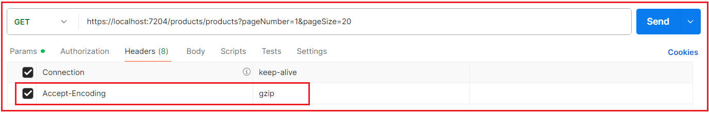
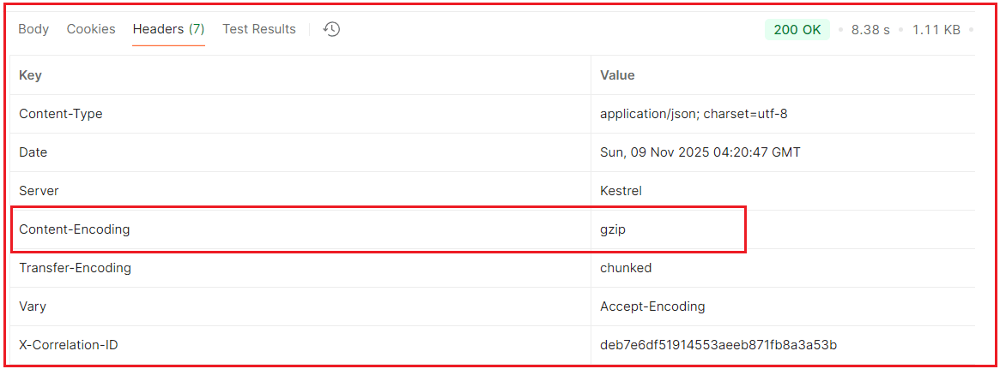
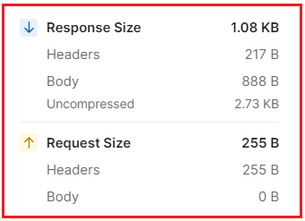

## **فشرده‌سازی پاسخ‌ها در API Gateway**

فشرده‌سازی پاسخ یکی از ساده‌ترین و در عین حال قدرتمندترین بهینه‌سازی‌هایی است که می‌توانید در یک API Gateway فعال کنید. این فشرده‌سازی، اندازه پاسخ‌های ارسالی از سرور به کلاینت‌ها را کاهش می‌دهد و منجر به زمان پاسخ سریع‌تر، استفاده کمتر از پهنای باند و تجربه کاربری بهتر می‌شود، همه اینها بدون تغییر منطق برنامه موجود شما.

#### **فشرده‌سازی پاسخ چیست؟**

**فشرده‌سازی پاسخ** فرآیندی است که در آن **API Gateway اندازه داده‌هایی (پاسخ) را** که به کلاینت ارسال می‌کند، کاهش می‌دهد. هر زمان که کاربری چیزی را از سیستم میکروسرویس شما درخواست کند، backend داده‌ها را در قالب‌هایی مانند JSON، XML یا HTML برمی‌گرداند. اگر آن داده‌ها بزرگ باشند، زمان بیشتری برای انتقال در شبکه، به خصوص در اتصالات اینترنتی کندتر، طول می‌کشد.

فشرده‌سازی پاسخ این مشکل را با **کاهش اندازه داده‌ها قبل از ارسال آنها** برطرف می‌کند. محتوای داده‌ها ثابت می‌ماند، فقط نحوه بسته‌بندی آنها تغییر می‌کند.

می‌توانید آن را درست مانند فشرده‌سازی یک فایل در رایانه خود به فرمت .zip در نظر بگیرید. فایل هنوز حاوی همان اطلاعات است، اما حجم کمتری دارد و سریع‌تر به اشتراک گذاشته می‌شود. وقتی کلاینت (مانند مرورگر وب یا برنامه تلفن همراه) این داده‌های فشرده‌شده را دریافت می‌کند، **از حالت فشرده خارج می‌کند.** قبل از نمایش به کاربر، به‌طور خودکار آن را

به طور خلاصه، **آنها، سریع‌تر، سبک‌تر و کارآمدتر می‌کند.** فشرده‌سازی پاسخ، API های شما را بدون تغییر محتوا یا منطق تجاری

#### **چرا به فشرده‌سازی پاسخ نیاز داریم؟**

در یک **سیستم میکروسرویس**، APIها دائماً داده‌ها را بین سرور و کلاینت ارسال و دریافت می‌کنند. بیشتر این داده‌ها در **قالب JSON** هستند، یک قالب مبتنی بر متن که می‌تواند بسیار بزرگ شود. بیایید چند مثال واقعی از **معماری میکروسرویس‌های تجارت الکترونیک** خود بزنیم:

- وقتی مشتری کاتالوگ محصول را باز می‌کند، **سرویس محصول** ممکن است صدها رکورد محصول، نام، قیمت، تصویر و اطلاعات موجودی را ارسال کند.
- وقتی مشتری سابقه سفارش خود را بررسی می‌کند، **سرویس سفارش**، جزئیات سفارش متعددی را ارسال می‌کند که هر کدام شامل اقلام، وضعیت پرداخت و پیگیری تحویل است.
- وقتی یک مدیر گزارش‌های فروش یا داشبورد ایجاد می‌کند، **سرویس تحلیلی** مجموعه داده‌های ساختاریافته بزرگی را ارسال می‌کند.
- حتی در حین جستجوی محصول، سیستم ممکن است هزاران مورد منطبق را ارسال کند.

همه این پاسخ‌ها می‌توانند تا **مگابایت داده** جمع شوند. پاسخ‌های API بزرگ افزایش می‌یابند:

- زمان صرف شده برای انتقال داده از طریق شبکه،
- استفاده از پهنای باند،
- زمان بارگذاری به ویژه در شبکه‌های تلفن همراه یا برای هر کسی که اتصال اینترنت ضعیفی دارد، کند است.

فشرده‌سازی پاسخ، **اندازه پاسخ را** کاهش **۷۰ تا ۹۰ درصد** می‌دهد. این بدان معناست که داده‌هایی که معمولاً انتقال آنها ۲ ثانیه طول می‌کشد، ممکن است در ۰.۴ ثانیه برسند. این امر چندین مزیت عمده به همراه دارد:

- **زمان بارگذاری سریع‌تر صفحه:** داده‌های کمتر به معنای تحویل سریع‌تر است.
- **کاهش زمان پاسخ:** زمان بین یک درخواست و پاسخ آن کاهش می‌یابد.
- **استفاده کمتر از پهنای باند:** در منابع سرور و شبکه صرفه‌جویی می‌شود.
- **تجربه کاربری بهتر:** برنامه‌ها روان‌تر و واکنش‌گراتر به نظر می‌رسند.

بنابراین، فشرده‌سازی پاسخ، پاسخ یا APIها را تغییر نمی‌دهد. بلکه «اندازه» داده‌ها را کاهش می‌دهد تا سرعت انتقال را افزایش دهد.

#### **فشرده‌سازی پاسخ چگونه کار می‌کند؟**

این فرآیند ساده اما هوشمندانه است. هر زمان که یک کلاینت (مرورگر یا برنامه تلفن همراه) درخواستی را به **API Gateway** ما ارسال می‌کند، معمولاً شامل یک هدر ویژه است:

- **رمزگذاری پذیرفته‌شده: gzip، br**

این هدر به Gateway می‌گوید که کلاینت **از پاسخ‌های فشرده** پشتیبانی می‌کند، به این معنی که می‌تواند فرمت‌هایی مانند **Gzip** یا **Brotli** را درک و از حالت فشرده خارج کند. هنگامی که API Gateway این درخواست را دریافت می‌کند، بررسی می‌کند که آیا فشرده‌سازی پاسخ در پیکربندی آن فعال شده است یا خیر.

اگر فعال باشد، مراحل به صورت زیر انجام می‌شود:

1. میکروسرویس (مانند ProductService یا OrderService) پاسخ JSON خام معمولی خود را به API Gateway ارسال می‌کند.
2. قبل از ارسال داده‌ها به کلاینت، **API Gateway** **داده‌ها را** با استفاده از یک الگوریتم فشرده‌سازی مانند **Gzip یا Brotli،** بر اساس هدر Accept-Encoding، فشرده می‌کند.
3. سپس Gateway یک هدر HTTP پاسخ دیگر اضافه می‌کند:
   - **رمزگذاری محتوا: gzip**
   - این به کلاینت می‌گوید که داده‌ها با استفاده از **Gzip یا Brotli** فشرده شده‌اند.
4. کلاینت به طور خودکار هدر را تشخیص می‌دهد و قبل از نمایش داده‌ها، محتوا را از حالت فشرده خارج می‌کند.

کل این فرآیند به صورت خودکار انجام می‌شود:

- بدون نیاز به کدنویسی اضافی در بخش فرانت‌اند،
- بدون تغییر در قالب داده پاسخ،
- هیچ تغییری در قرارداد API ایجاد نشده است.

کل این فرآیند در عرض چند میلی‌ثانیه اتفاق می‌افتد و کاملاً برای کاربر شفاف است. تنها تفاوت قابل مشاهده این است که **پاسخ بسیار سریع‌تر می‌رسد.**

##### **الگوریتم‌های فشرده‌سازی رایج**

چند الگوریتم رایج برای فشرده‌سازی پاسخ‌ها وجود دارد:

###### **جی‌زیپ**

- پرکاربردترین فرمت فشرده‌سازی برای APIهای وب.
- این روش، **کاهش ۶۰ تا ۸۰ درصدی** در حجم داده‌ها را ارائه می‌دهد و تقریباً در همه مرورگرها و کلاینت‌های API به طور یکپارچه کار می‌کند.
- این انتخاب پیش‌فرض برای اکثر سیستم‌های میکروسرویس است.
- ایده‌آل برای فشرده‌سازی JSON، XML یا متن ساده.

###### **بروتلی**

- گوگل الگوریتم جدیدتر و کارآمدتری را توسعه داد.
- می‌تواند **به کاهش ۷۰ تا ۹۰ درصدی** دست یابد، خروجی کوچکتری نسبت به Gzip دارد، اما از زمان CPU کمی بیشتر برای فشرده‌سازی استفاده می‌کند.
- ایده‌آل برای فایل‌های استاتیک مانند HTML، CSS یا JS.

###### **باد کردن**

- یک روش فشرده‌سازی قدیمی‌تر و سبک‌تر.
- هنوز هم توسط بسیاری از سیستم‌ها پشتیبانی می‌شود، اما امروزه کمتر مورد استفاده قرار می‌گیرد زیرا **Gzip** و **Brotli** عملکرد بهتری دارند.

در اکثر دروازه‌های API مدرن .NET Core، **از Gzip** استفاده می‌شود زیرا بهترین **تعادل را بین سرعت، استفاده از CPU و سازگاری** ارائه می‌دهد.

#### **مثالی برای درک فشرده‌سازی پاسخ در API Gateway:**

ما می‌خواهیم **API Gateway** ما (Ocelot) موارد زیر را داشته باشد:

1. قبل از ارسال پاسخ‌ها به مشتریان (مثلاً لیست محصولات، خلاصه سفارشات) آنها را فشرده کنید.
2. فقط زمانی فشرده‌سازی کنید که:
   - کلاینت **می‌گوید که** از آن کدگذاری (Accept-Encoding) پشتیبانی می‌کند.
   - پاسخ **به اندازه کافی بزرگ است** (بالاتر از یک آستانه قابل تنظیم).
   - نوع **محتوا قابل فشرده‌سازی است** (JSON/text و غیره).
3. بتوانید **فشرده‌سازی را فعال/غیرفعال کنید** و **آستانه را** از طریق appsettings.json تنظیم کنید.
4. از تکیه بر هر میکروسرویسی خودداری کنید؛ این کار را یک بار در دروازه (بهینه‌سازی لبه) انجام دهید.

#### **بسته فشرده‌سازی پاسخ را اضافه کنید**

در ویژوال استودیو، **کنسول مدیریت بسته‌ها (Package Manager Console) را** باز کنید و **پروژه API Gateway** خود را انتخاب کنید (نه میکروسرویس‌های جداگانه). دستور زیر را اجرا کنید:

- **نصب بسته فشرده‌سازی پاسخ مایکروسافت (Microsoft.AspNetCore.ResponseCompression)**

این میان‌افزار داخلی .NET Core را اضافه می‌کند که **Gzip** و **Brotli پشتیبانی می‌کند.** از ارائه‌دهندگان فشرده‌سازی

#### **پیکربندی Gzip در Program.cs**

در **پروژه API Gateway** ، Program.cs را باز کنید و فشرده‌سازی پاسخ را پیکربندی کنید. لطفاً کلاس Program را به صورت زیر تغییر دهید. این پیکربندی تضمین می‌کند که فقط داده‌های متنی، مانند JSON، متن ساده یا HTML، فشرده شوند.

```csharp
using APIGateway.Middlewares;
using APIGateway.Services;
using Microsoft.AspNetCore.Authentication.JwtBearer;
using Microsoft.IdentityModel.Tokens;
using Newtonsoft.Json.Serialization;
using Ocelot.DependencyInjection;
using Ocelot.Middleware;
using Serilog;
using System.Text;
using Microsoft.AspNetCore.ResponseCompression;
using System.IO.Compression;

namespace APIGateway
{
    public class Program
    {
        public static async Task Main(string[] args)
        {
            var builder = WebApplication.CreateBuilder(args);

            // Add Response Compression Services
            builder.Services.AddResponseCompression(options =>
            {
                // Enable compression for HTTPS as well
                options.EnableForHttps = true;

                // Use Gzip as the compression provider
                options.Providers.Add<GzipCompressionProvider>();

                // Compress only textual responses (JSON, text, HTML)
                options.MimeTypes = ResponseCompressionDefaults.MimeTypes.Concat(new[]
                {
                    "application/json",
                    "text/plain",
                    "text/html"
                });
            });

            // Configure Gzip Compression Level
            builder.Services.Configure<GzipCompressionProviderOptions>(options =>
            {
                // Optimal = higher compression ratio (slightly more CPU)
                options.Level = CompressionLevel.Optimal;
            });

            // MVC Controllers + Newtonsoft JSON Configuration
            builder.Services
                .AddControllers()
                .AddNewtonsoftJson(options =>
                {
                    // Newtonsoft.Json used instead of System.Text.Json
                    // because it provides finer control over property naming
                    // and serialization behavior.
                    options.SerializerSettings.ContractResolver = new DefaultContractResolver
                    {
                        // Preserve property names as defined in the DTOs.
                        // No camelCasing or snake_casing transformation.
                        NamingStrategy = new DefaultNamingStrategy()
                    };

                    // Optional: Uncomment if you want Enum values serialized as strings
                    // options.SerializerSettings.Converters.Add(new Newtonsoft.Json.Converters.StringEnumConverter());
                });

            // Ocelot Configuration (API Gateway Routing Layer)
            builder.Configuration.AddJsonFile("ocelot.json", optional: false, reloadOnChange: true);
            builder.Services.AddOcelot(builder.Configuration);

            // Structured Logging Setup (Serilog)
            Log.Logger = new LoggerConfiguration()
                .ReadFrom.Configuration(builder.Configuration)
                .Enrich.FromLogContext()
                .CreateLogger();

            builder.Host.UseSerilog(); // Replace default .NET logger with Serilog.

            builder.Services.AddEndpointsApiExplorer();
            builder.Services.AddSwaggerGen();

            // JWT Authentication (Bearer Token Validation)
            builder.Services
                .AddAuthentication(options =>
                {
                    // Define the default authentication scheme as Bearer
                    options.DefaultAuthenticateScheme = JwtBearerDefaults.AuthenticationScheme;
                    options.DefaultChallengeScheme = JwtBearerDefaults.AuthenticationScheme;
                })
                .AddJwtBearer(options =>
                {
                    // Token validation configuration
                    options.TokenValidationParameters = new TokenValidationParameters
                    {
                        ValidateIssuer = true,
                        ValidIssuer = builder.Configuration["JwtSettings:Issuer"],
                        // We’re not validating audience because microservices share same gateway.
                        ValidateAudience = false,
                        // Enforce token expiry check
                        ValidateLifetime = true,
                        // Ensure token signature integrity using secret key
                        ValidateIssuerSigningKey = true,
                        IssuerSigningKey = new SymmetricSecurityKey(
                            Encoding.UTF8.GetBytes(builder.Configuration["JwtSettings:SecretKey"]!)
                        ),
                        // No extra grace period for expired tokens
                        ClockSkew = TimeSpan.Zero
                    };
                });

            builder.Services.AddAuthorization(); // Enables [Authorize] attributes.

            // Downstream Microservice Clients (typed HttpClientFactory)
            var urls = builder.Configuration.GetSection("ServiceUrls");

            builder.Services.AddHttpClient("OrderService", c =>
            {
                c.BaseAddress = new Uri(urls["OrderService"]!);
            });

            builder.Services.AddHttpClient("UserService", c =>
            {
                c.BaseAddress = new Uri(urls["UserService"]!);
            });

            builder.Services.AddHttpClient("ProductService", c =>
            {
                c.BaseAddress = new Uri(urls["ProductService"]!);
            });

            builder.Services.AddHttpClient("PaymentService", c =>
            {
                c.BaseAddress = new Uri(urls["PaymentService"]!);
            });

            // Custom Aggregation Service Registration
            builder.Services.AddScoped<IOrderSummaryAggregator, OrderSummaryAggregator>();

            var app = builder.Build();

            // Swagger (API Explorer for development/debugging)
            if (app.Environment.IsDevelopment())
            {
                app.UseSwagger();
                app.UseSwaggerUI();
            }

            app.UseHttpsRedirection();

            // Enable Response Compression middleware
            // Response Compression should be applied early
            // UseResponseCompression() must run before anything that writes the response body (controllers, reverse proxy, Ocelot/YARP).
            app.UseResponseCompression();

            // Global Cross-Cutting Middleware
            app.UseCorrelationId();
            app.UseRequestResponseLogging();

            // BRANCH 1: Custom Aggregated Endpoints (/gateway/*)
            app.MapWhen(
                ctx => ctx.Request.Path.StartsWithSegments("/gateway", StringComparison.OrdinalIgnoreCase),
                gatewayApp =>
                {
                    // Enable endpoint routing for this sub-pipeline
                    gatewayApp.UseRouting();

                    // Apply authentication & authorization
                    gatewayApp.UseAuthentication();
                    gatewayApp.UseAuthorization();

                    // Register controller actions under this branch
                    gatewayApp.UseEndpoints(endpoints =>
                    {
                        endpoints.MapControllers();
                    });
                });

            // BRANCH 2: Ocelot Reverse Proxy
            app.UseAuthentication();

            // Middleware for pre-validation of Bearer tokens (optional)
            app.UseGatewayBearerValidation();

            // Ocelot middleware handles routing, transformation, and load-balancing
            await app.UseOcelot();

            // Start the Application
            app.Run();
        }
    }
}
```

##### **چرا در API Gateway و نه میکروسرویس‌ها؟**

زیرا فشرده‌سازی در حالت ایده‌آل باید **فقط یک بار**، درست قبل از اینکه پاسخ از مرز شبکه شما خارج شود، اتفاق بیفتد. اگر فشرده‌سازی را درون هر میکروسرویس و سپس دوباره در Gateway انجام دهید، CPU را هدر می‌دهد و حتی ممکن است تأخیر (زمان پاسخ) را افزایش دهد.

##### **با مرورگر یا پستچی تأیید کنید**

###### **دریافت محصولات:**

**روش: دریافت**

**آدرس اینترنتی: {{gateway_base}}/products/products?pageNumber=1&pageSize=20**

**هدر: پذیرش - کدگذاری: gzip**



شما باید **Content-Encoding: gzip را ببینید:** در پاسخ، هدر



این تأیید می‌کند که API Gateway با موفقیت پاسخ‌های خروجی را فشرده می‌کند.

##### **درک اندازه پاسخ در Postman:**



اینجا،

- **اندازه پاسخ:** اندازه پاسخ فشرده‌شده (۱.۰۸ کیلوبایت). این اندازه واقعی دانلود شده توسط کلاینت، شامل هدرها + بدنه فشرده‌شده است.
- **هدرهای پاسخ:** اندازه هدرهای HTTP (217 B). فراداده (وضعیت، نوع محتوا، کدگذاری و غیره) به همراه بدنه ارسال می‌شود.
- **بدنه پاسخ:** حجم فشرده‌شده (۸۸۸ B). نسخه فشرده‌شده با Gzip از پاسخ JSON/text.
- **فشرده نشده:** اندازه اصلی فایل قبل از فشرده‌سازی (۲.۷۳ کیلوبایت). Postman به طور خودکار آن را از حالت فشرده خارج می‌کند تا نشان دهد که بدون فشرده‌سازی چقدر بزرگ می‌شد.

#### **چرا از فشرده‌سازی پاسخ‌های کوچک یا دودویی اجتناب کنیم؟**

##### **پاسخ‌های کوچک (کمتر از ۱ کیلوبایت)**

- فشرده‌سازی خودش چرخه‌های CPU را مصرف می‌کند.
- برای حجم‌های متنی بسیار کوچک، هزینه فشرده‌سازی و رفع فشار برای پردازنده اغلب **بیشتر از صرفه‌جویی در پهنای باند** است.
- در بسیاری از موارد، خروجی فشرده‌شده حتی **از خروجی اصلی بزرگ‌تر** است (به دلیل هدرهای Gzip و فراداده‌ها).
- مثال: فشرده‌سازی یک فایل JSON با حجم ۵۰۰ بایت ممکن است یک فایل Gzip با حجم ۶۰۰ بایت تولید کند.

##### **فایل‌های دودویی / تصویری / از قبل فشرده‌شده**

- فرمت‌هایی مانند .jpg، .png، .mp4، .zip و .pdf **از قبل فشرده شده‌اند**.
- فشرده‌سازی مجدد آنها:
  - سربار CPU را افزایش می‌دهد.
  - صرفه‌جویی ناچیز (یا منفی) در اندازه ایجاد می‌کند.
  - حتی ممکن است **حجم فایل را کمی افزایش دهد.** به دلیل سربار بسته‌بندی،
- ارزشمند است **بنابراین، فشرده‌سازی عمدتاً برای قالب‌های مبتنی بر متن** (JSON، XML، HTML، CSV و غیره)

#### **فعال کردن فشرده‌سازی شرطی پیشرفته**

برای اینکه فشرده‌سازی **قابل تنظیم باشد** (فعال/غیرفعال کردن، اندازه آستانه و اولویت کدگذاری)، یک میان‌افزار سفارشی و بخش پیکربندی اضافه خواهیم کرد.

##### **بخش پیکربندی فشرده‌سازی را در appsettings.json اضافه کنید**

لطفا **فایل appsettings.json** را به صورت زیر تغییر دهید:

```json
{
  "AllowedHosts": "*",

  "JwtSettings": {
    "Issuer": "UserService.API",
    "SecretKey": "fPXxcJw8TW5sA+S4rl4tIPcKk+oXAqoRBo+1s2yjUS4="
  },

  "Serilog": {
    "MinimumLevel": {
      "Default": "Information",
      "Override": {
        "Microsoft": "Error",
        "System": "Error",
        "Ocelot": "Error"
      }
    },

    "Properties": {
      "Application": "APIGateway",
      "Environment": "Development"
    },

    "WriteTo": [
      {
        "Name": "Async",
        "Args": {
          "configure": [
            {
              "Name": "Console",
              "Args": {
                "outputTemplate": "{Timestamp:yyyy-MM-dd HH:mm:ss} [{Level:u3}] [{Application}/{Environment}] CorrelationId={CorrelationId} {Message:lj}{NewLine}{Exception}"
              }
            }
          ]
        }
      },
      {
        "Name": "Async",
        "Args": {
          "configure": [
            {
              "Name": "File",
              "Args": {
                "path": "logs/UserService-.log",
                "rollingInterval": "Day",
                "retainedFileCountLimit": 30,
                "shared": true,
                "outputTemplate": "{Timestamp:yyyy-MM-dd HH:mm:ss} [{Level:u3}] [{Application}/{Environment}] CorrelationId={CorrelationId} {Message:lj}{NewLine}{Exception}"
              }
            }
          ]
        }
      }
    ]
  },

  "ServiceUrls": {
    "OrderService": "https://localhost:7082",
    "UserService": "https://localhost:7269",
    "ProductService": "https://localhost:7234",
    "PaymentService": "https://localhost:7154"
  },

  "CompressionSettings": {
    "Enabled": true,
    "CompressionThresholdBytes": 1024,
    "SupportedEncodings": [ "br", "gzip" ],
    "DefaultEncoding": "gzip"
  }
}
```

###### **توضیح کد**

- **فعال:** سوئیچ سراسری برای فعال/غیرفعال کردن فشرده‌سازی.
- **CompressionThresholdBytes:** حداقل اندازه پاسخ (بایت) قبل از فشرده‌سازی.
- **رمزگذاری‌های پشتیبانی‌شده:** الگوریتم‌هایی که توسط درگاه API شما پشتیبانی می‌شوند.
- **DefaultEncoding:** اگر کلاینت به طور واضح کدگذاری را مشخص نکند، کدگذاری جایگزین اعمال می‌شود.

#### **ایجاد یک کلاس پیکربندی Strongly-Typed**

ابتدا، پوشه‌ای به نام Models ایجاد کنید. سپس، یک فایل کلاس به نام **CompressionSettings.cs** در **پوشه Models** در هر کجای برنامه تزریق کنیم **ایجاد کنید و کد زیر را کپی و پیست کنید. این به ما امکان می‌دهد تنظیمات فشرده‌سازی را از طریق الگوی Options** .

```csharp
namespace APIGateway.Models
{
    public class CompressionSettings
    {
        public bool Enabled { get; set; } = true;
        public int CompressionThresholdBytes { get; set; } = 1024; // Default 1 KB
        public string[] SupportedEncodings { get; set; } = new[] { "br", "gzip" };
        public string DefaultEncoding { get; set; } = "gzip";
    }
}
```

#### **ایجاد یک کلاس Middleware سفارشی**

یک فایل کلاس با نام **ConditionalResponseCompressionMiddleware.cs** در **پوشه Middlewares** پروژه API Gateway ایجاد کنید و سپس کد زیر را کپی و جایگذاری کنید. این middleware هر پاسخ خروجی را بررسی می‌کند و بر اساس نوع محتوا، اندازه و قابلیت کلاینت تصمیم می‌گیرد که آیا آن را فشرده کند یا خیر.

```csharp
using System.IO;
using System.IO.Compression;
using Microsoft.Extensions.Options;
using APIGateway.Models;

namespace APIGateway.Middlewares
{
    // Middleware for conditional response compression at the API Gateway level.
    // - Uses a memory buffer to inspect the generated response.
    // - Applies Brotli or Gzip based on:
    //     * Client capabilities (Accept-Encoding)
    //     * Response size threshold
    //     * Allowed content types
    // - Respects dynamic settings via IOptionsMonitor (no restart needed for config changes).
    public class ConditionalResponseCompressionMiddleware
    {
        private readonly RequestDelegate _next;
        private readonly IOptionsMonitor<CompressionSettings> _settingsMonitor;

        public ConditionalResponseCompressionMiddleware(RequestDelegate next, IOptionsMonitor<CompressionSettings> settings)
        {
            _next = next;
            _settingsMonitor = settings;
        }

        public async Task InvokeAsync(HttpContext context)
        {
            // Always read the latest config so changes in appsettings (with reloadOnChange) are honored.
            var settings = _settingsMonitor.CurrentValue;

            // 1. Global toggle:
            // If compression is disabled via configuration, short-circuit and let the pipeline continue as-is.
            if (!settings.Enabled)
            {
                await _next(context);
                return;
            }

            // 2. Swap the response body with an in-memory buffer:
            // We let downstream components write to this buffer so we can:
            // - Inspect size
            // - Inspect content type
            // - Decide whether and how to compress
            var originalBody = context.Response.Body;
            using var buffer = new MemoryStream();
            context.Response.Body = buffer;

            // 3. Execute the rest of the pipeline:
            // Controllers / endpoints run here and write their response into "buffer".
            await _next(context);

            // 4. Capture response metadata after execution.
            // At this point, the response body is fully available in the buffer.
            var contentType = context.Response.ContentType;
            var acceptEncoding = context.Request.Headers["Accept-Encoding"].ToString();

            // 5. Skip compression if:
            // - Client did not send "Accept-Encoding" header (meaning it can’t handle compressed data)
            // - Or the response content type is not suitable for compression (e.g., images, PDFs, videos)
            if (string.IsNullOrEmpty(acceptEncoding) ||
                !IsCompressibleContentType(contentType))
            {
                // Restore original stream and flush the uncompressed response.
                buffer.Position = 0;
                context.Response.Body = originalBody;
                await buffer.CopyToAsync(context.Response.Body);
                return;
            }

            // 6. Compress only if the response size exceeds the configured threshold
            // (e.g., 1 KB or 2 KB as specified in appsettings.json)
            if (buffer.Length > settings.CompressionThresholdBytes)
            {
                // Resolve which encoding to use based on:
                // - Client's Accept-Encoding header.
                // - SupportedEncodings + DefaultEncoding from configuration.
                var encoding = SelectEncoding(acceptEncoding, settings);

                // Ensure we read from the beginning.
                buffer.Position = 0;
                using var compressed = new MemoryStream();

                // 7. Perform the actual compression into the "compressed" stream.
                // Brotli: more efficient, preferred by modern clients.
                if (encoding.Equals("br", StringComparison.OrdinalIgnoreCase))
                {
                    using (var brotli = new BrotliStream(compressed, CompressionLevel.Optimal, leaveOpen: true))
                    {
                        await buffer.CopyToAsync(brotli);
                    }
                }
                // Gzip: widely supported, safe fallback.
                else if (encoding.Equals("gzip", StringComparison.OrdinalIgnoreCase))
                {
                    using (var gzip = new GZipStream(compressed, CompressionLevel.Optimal, leaveOpen: true))
                    {
                        await buffer.CopyToAsync(gzip);
                    }
                }
                else
                {
                    // If we end up with an encoding we don't handle,
                    // fall back to sending the original uncompressed response.
                    buffer.Position = 0;
                    context.Response.Body = originalBody;
                    await buffer.CopyToAsync(context.Response.Body);
                    return;
                }

                // 8. Update response headers:
                // Inform client which encoding is used and set Content-Length accordingly.
                context.Response.Headers["Content-Encoding"] = encoding;
                context.Response.ContentLength = compressed.Length;

                // 9. Write compressed payload to the real response stream.
                compressed.Position = 0;
                context.Response.Body = originalBody;
                await compressed.CopyToAsync(context.Response.Body);
            }
            else
            {
                // 10. Below threshold: send as-is without compression.
                // Restores original stream and copies buffered content.
                buffer.Position = 0;
                context.Response.Body = originalBody;
                await buffer.CopyToAsync(context.Response.Body);
            }
        }

        // Determines the preferred compression encoding based on the client’s Accept-Encoding header
        // and supported encodings defined in appsettings.json.
        private string SelectEncoding(string acceptEncoding, CompressionSettings settings)
        {
            // Prefer Brotli when:
            // - Client accepts "br"
            // - And "br" is enabled in configuration.
            if (acceptEncoding.Contains("br", StringComparison.OrdinalIgnoreCase) &&
                settings.SupportedEncodings.Contains("br", StringComparer.OrdinalIgnoreCase))
            {
                return "br";
            }

            // Otherwise, try Gzip under the same conditions.
            if (acceptEncoding.Contains("gzip", StringComparison.OrdinalIgnoreCase) &&
                settings.SupportedEncodings.Contains("gzip", StringComparer.OrdinalIgnoreCase))
            {
                return "gzip";
            }

            // As a safety net, use whatever DefaultEncoding is configured.
            return settings.DefaultEncoding;
        }

        // Determines whether a given content type is suitable for compression.
        // We compress only textual formats (JSON, XML, HTML, JavaScript, etc.)
        // and skip binary formats (images, PDFs, audio, video, etc.).
        private static bool IsCompressibleContentType(string? contentType)
        {
            if (string.IsNullOrEmpty(contentType))
                return false;

            // Allow only compressible MIME types
            return contentType.StartsWith("application/json", StringComparison.OrdinalIgnoreCase) ||
                   contentType.StartsWith("text/", StringComparison.OrdinalIgnoreCase) ||
                   contentType.StartsWith("application/xml", StringComparison.OrdinalIgnoreCase) ||
                   contentType.StartsWith("application/javascript", StringComparison.OrdinalIgnoreCase) ||
                   contentType.StartsWith("application/xhtml+xml", StringComparison.OrdinalIgnoreCase);
        }
    }
}
```

##### **ثبت میان‌افزار در Program.cs**

در فایل کلاس API Gateway Program.cs، باید **ConditionalResponseCompressionMiddleware** را ثبت کنیم. بنابراین، لطفاً فایل کلاس Program را به صورت زیر تغییر دهید. ما دیگر به AddResponseCompression() یا UseResponseCompression() که به صورت پیش‌فرض وجود دارند، نیازی نداریم، زیرا میان‌افزار ما یک نسخه هوشمندتر و قابل تنظیم ارائه می‌دهد که از Brotli و Gzip پشتیبانی می‌کند.

```csharp
using APIGateway.Middlewares;
using APIGateway.Models;
using APIGateway.Services;
using Microsoft.AspNetCore.Authentication.JwtBearer;
using Microsoft.AspNetCore.ResponseCompression;
using Microsoft.IdentityModel.Tokens;
using Newtonsoft.Json.Serialization;
using Ocelot.DependencyInjection;
using Ocelot.Middleware;
using Serilog;
using System.IO.Compression;
using System.Text;

namespace APIGateway
{
    public class Program
    {
        public static async Task Main(string[] args)
        {
            var builder = WebApplication.CreateBuilder(args);

            // MVC Controllers + Newtonsoft JSON Configuration
            builder.Services
                .AddControllers()
                .AddNewtonsoftJson(options =>
                {
                    options.SerializerSettings.ContractResolver = new DefaultContractResolver
                    {
                        NamingStrategy = new DefaultNamingStrategy()
                    };
                });

            // Bind CompressionSettings section to our model using options pattern
            builder.Services.Configure<CompressionSettings>(
                builder.Configuration.GetSection("CompressionSettings"));

            // Ocelot Configuration (API Gateway Routing Layer)
            builder.Configuration.AddJsonFile("ocelot.json", optional: false, reloadOnChange: true);
            builder.Services.AddOcelot(builder.Configuration);

            // Structured Logging Setup (Serilog)
            Log.Logger = new LoggerConfiguration()
                .ReadFrom.Configuration(builder.Configuration)
                .Enrich.FromLogContext()
                .CreateLogger();

            builder.Host.UseSerilog(); // Replace default .NET logger with Serilog.

            builder.Services.AddEndpointsApiExplorer();
            builder.Services.AddSwaggerGen();

            // JWT Authentication (Bearer Token Validation)
            builder.Services
                .AddAuthentication(options =>
                {
                    // Define the default authentication scheme as Bearer
                    options.DefaultAuthenticateScheme = JwtBearerDefaults.AuthenticationScheme;
                    options.DefaultChallengeScheme = JwtBearerDefaults.AuthenticationScheme;
                })
                .AddJwtBearer(options =>
                {
                    // Token validation configuration
                    options.TokenValidationParameters = new TokenValidationParameters
                    {
                        ValidateIssuer = true,
                        ValidIssuer = builder.Configuration["JwtSettings:Issuer"],
                        // We’re not validating audience because microservices share same gateway.
                        ValidateAudience = false,
                        // Enforce token expiry check
                        ValidateLifetime = true,
                        // Ensure token signature integrity using secret key
                        ValidateIssuerSigningKey = true,
                        IssuerSigningKey = new SymmetricSecurityKey(
                            Encoding.UTF8.GetBytes(builder.Configuration["JwtSettings:SecretKey"]!)
                        ),
                        // No extra grace period for expired tokens
                        ClockSkew = TimeSpan.Zero
                    };
                });

            builder.Services.AddAuthorization(); // Enables [Authorize] attributes.

            // Downstream Microservice Clients (typed HttpClientFactory)
            var urls = builder.Configuration.GetSection("ServiceUrls");

            builder.Services.AddHttpClient("OrderService", c =>
            {
                c.BaseAddress = new Uri(urls["OrderService"]!);
            });

            builder.Services.AddHttpClient("UserService", c =>
            {
                c.BaseAddress = new Uri(urls["UserService"]!);
            });

            builder.Services.AddHttpClient("ProductService", c =>
            {
                c.BaseAddress = new Uri(urls["ProductService"]!);
            });

            builder.Services.AddHttpClient("PaymentService", c =>
            {
                c.BaseAddress = new Uri(urls["PaymentService"]!);
            });

            // Custom Aggregation Service Registration
            builder.Services.AddScoped<IOrderSummaryAggregator, OrderSummaryAggregator>();

            var app = builder.Build();

            // Swagger (API Explorer for development/debugging)
            if (app.Environment.IsDevelopment())
            {
                app.UseSwagger();
                app.UseSwaggerUI();
            }

            app.UseHttpsRedirection();

            // Custom conditional compression middleware
            app.UseMiddleware<ConditionalResponseCompressionMiddleware>();

            // Global Cross-Cutting Middleware
            app.UseCorrelationId();
            app.UseRequestResponseLogging();

            // BRANCH 1: Custom Aggregated Endpoints (/gateway/*)
            app.MapWhen(
                ctx => ctx.Request.Path.StartsWithSegments("/gateway", StringComparison.OrdinalIgnoreCase),
                gatewayApp =>
                {
                    // Enable endpoint routing for this sub-pipeline
                    gatewayApp.UseRouting();

                    // Apply authentication & authorization
                    gatewayApp.UseAuthentication();
                    gatewayApp.UseAuthorization();

                    // Register controller actions under this branch
                    gatewayApp.UseEndpoints(endpoints =>
                    {
                        endpoints.MapControllers();
                    });
                });

            // BRANCH 2: Ocelot Reverse Proxy
            app.UseAuthentication();

            // Middleware for pre-validation of Bearer tokens (optional)
            app.UseGatewayBearerValidation();

            // Ocelot middleware handles routing, transformation, and load-balancing
            await app.UseOcelot();

            // Start the Application
            app.Run();
        }
    }
}
```

##### **چه زمانی باید از فشرده‌سازی پاسخ استفاده کنید؟**

فشرده‌سازی پاسخ باید **به طور پیش‌فرض** در اکثر دروازه‌های API مدرن فعال باشد، اما در شرایط زیر اهمیت ویژه‌ای پیدا می‌کند:

- وقتی API های شما **پاسخ های JSON بزرگی** (لیست محصولات، گزارش ها، داده های تحلیلی) برمی گردانند.
- وقتی کاربران شما بیشتر از **موبایل یا شبکه‌های با پهنای باند کم** استفاده می‌کنند.
- وقتی می‌خواهید **انتقال داده** بین Gateway و کلاینت را بهینه کنید.
- وقتی API Gateway شما یک **نقطه ورود عمومی** است که به بسیاری از کاربران در سراسر جهان خدمات ارائه می‌دهد.

در این موارد، فشرده‌سازی می‌تواند بدون اضافه کردن سربار زیاد، عملکرد را به طرز چشمگیری بهبود بخشد.

##### **چه زمانی باید از فشرده‌سازی اجتناب کنید**

فشرده‌سازی همیشه مفید نیست. چند موقعیت وجود دارد که باید خاموش شود:

1. **فایل‌های از قبل فشرده‌شده** : محتوایی مانند تصاویر، ویدیوها، فایل‌های ZIP یا PDF را فشرده نکنید. آن‌ها از قبل فشرده شده‌اند؛ فشرده‌سازی مجدد آن‌ها باعث اتلاف وقت CPU می‌شود و حتی می‌تواند حجم فایل را افزایش دهد.
2. **پاسخ‌های کوچک (کمتر از ۱ کیلوبایت)** : فایل‌های JSON یا متنی کوچک از فشرده‌سازی سود زیادی نمی‌برند. زمان صرف شده برای فشرده‌سازی آنها می‌تواند از صرفه‌جویی حاصل از آن بیشتر باشد.
3. **انتقال فایل‌های دودویی** : فرمت‌های دودویی (مانند .exe، .jpg، .mp4) برای فشرده‌سازی ایده‌آل نیستند و می‌توانند به جای افزایش سرعت، سرعت را کاهش دهند.

یک قانون کلی خوب این است: **داده‌های متنی بزرگ را فشرده کنید، از فایل‌های باینری یا کوچک صرف نظر کنید.**

#### **سناریوهای بلادرنگ در میکروسرویس‌های تجارت الکترونیک**

##### **API فهرست محصولات**

نقطه پایانی /api/products اغلب صدها یا هزاران رکورد محصول، نام، قیمت، تصویر و جزئیات را برمی‌گرداند.

- بدون فشرده‌سازی، این حجم به راحتی می‌تواند از چندین مگابایت فراتر رود.
- با فعال کردن Gzip در API Gateway، همان پاسخ ممکن است تا **80٪** کاهش یابد و سرعت پاسخ را برای کاربران نهایی به طرز چشمگیری بهبود بخشد.

##### **API تاریخچه سفارش**

وقتی مشتری سفارش‌های قبلی خود را بررسی می‌کند:

- سرویس **سفارش**، چندین سفارش را برمی‌گرداند که هر کدام حاوی اطلاعات محصول و پرداخت هستند.
- حجم کل بار داده ممکن است به ۵۰۰ کیلوبایت یا بیشتر برسد.

با فعال کردن فشرده‌سازی، API Gateway حجم داده را به ۱۰۰ تا ۱۵۰ کیلوبایت کاهش می‌دهد که منجر به تجربه روان‌تر موبایل و کاهش مصرف شبکه می‌شود.

##### **رابط برنامه‌نویسی کاربردی گزارش‌های مدیریتی**

داشبوردهای مدیریتی معمولاً داده‌های تحلیلی حجیم، کل فروش، اقلام پرفروش، فعالیت کاربر، بازپرداخت‌ها و غیره را درخواست می‌کنند. از آنجایی که این گزارش‌ها متن زیادی دارند (JSON)، فشرده‌سازی آنها قبل از ارسال، سرعت بارگذاری را افزایش داده و عملکرد داشبورد را بهبود می‌بخشد.

##### **API جستجو و فیلتر**

نقاط پایانی جستجو اغلب داده‌های پویا را با فیلترهای متعدد اعمال شده برمی‌گردانند. فشرده‌سازی پاسخ به اطمینان از این امر کمک می‌کند که حتی وقتی نتایج جستجوی بزرگی بازگردانده می‌شوند، کاربران نتایج را به سرعت و بدون تأخیر مشاهده کنند.

##### **نتیجه‌گیری**

فشرده‌سازی پاسخ در API Gateway یک **بهینه‌سازی ساده** **اما قدرتمند** است که عملکرد و کارایی API را بهبود می‌بخشد ما، که در آن بارهای داده بزرگ JSON مرتباً بین سرویس‌ها و کلاینت‌ها منتقل می‌شوند، مفید است **. این امر به ویژه در سیستم‌هایی مانند معماری میکروسرویس‌های تجارت الکترونیک** .

فعال کردن فشرده‌سازی، Gateway شما را هوشمندتر می‌کند. این امر باعث می‌شود **بارهای کاری کوچک‌تر، پاسخ‌های سریع‌تر و تجربیات کاربری روان‌تری** بدون تغییر منطق کسب‌وکار اصلی ارائه شود.
