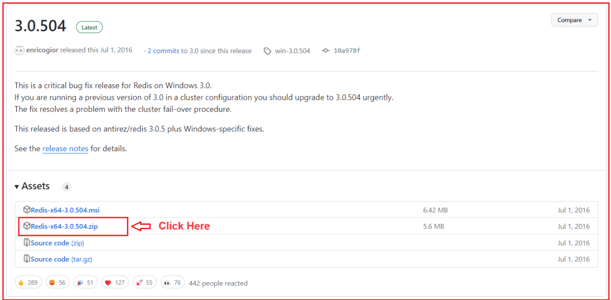
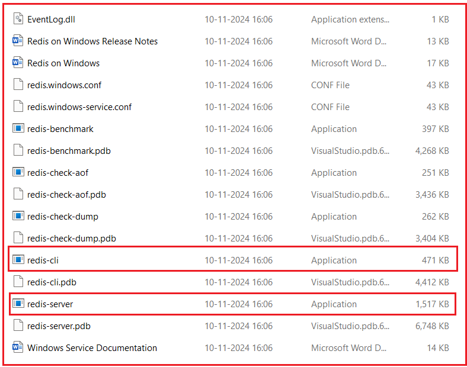
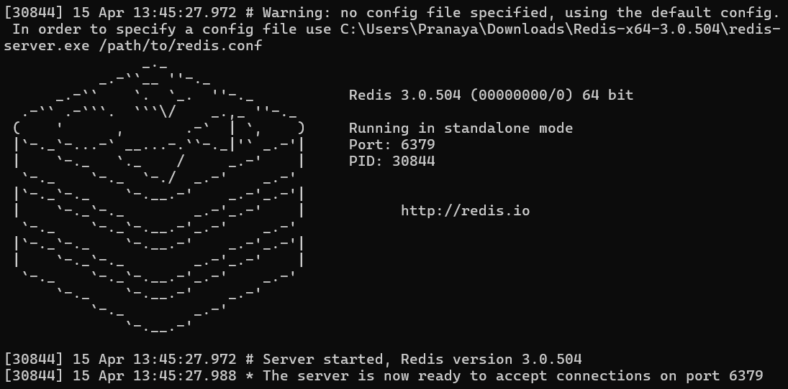
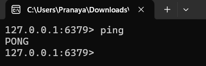
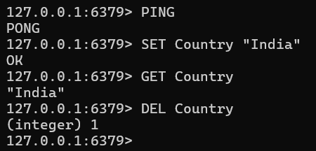

## **ذخیره سازی پاسخ در API Gateway با استفاده از Redis Distributed Cache**

ذخیره‌سازی پاسخ در یک API Gateway یک تکنیک بهینه‌سازی عملکرد است که نتایج داده‌های درخواست‌شده‌ی مکرر را در یک حافظه‌ی پنهان (حافظه‌ی موقت) ذخیره می‌کند تا درخواست‌های مشابه بعدی بتوانند بسیار سریع‌تر و بدون نیاز به بارگذاری مکرر میکروسرویس‌های backend، ارائه شوند.

در معماری میکروسرویس‌ها، چندین سرویس بک‌اند، مانند محصول، سفارش و کاربر، مرتباً توسط کلاینت درخواست می‌شوند. بسیاری از این پاسخ‌ها اغلب تغییر نمی‌کنند، مانند:

- لیست محصولات
- فهرست دسته‌بندی‌ها
- کشور، ایالت و شهرها
- پیکربندی استاتیک

فراخوانی مکرر این سرویس‌ها، بار شبکه را افزایش می‌دهد، زمان پاسخگویی کلی را افزایش می‌دهد و فشار غیرضروری بر میکروسرویس‌ها وارد می‌کند. اینجاست که **Response Caching در API Gateway** بسیار ارزشمند می‌شود. به جای فراخوانی سرویس‌های پایین‌دستی هر بار، API Gateway:

1. بررسی می‌کند که آیا داده‌ها در حافظه پنهان وجود دارند یا خیر
2. اگر بله → پاسخ ذخیره شده را فوراً برمی‌گرداند
3. اگر خیر → سرویس پایین‌دستی را فراخوانی می‌کند → پاسخ را در Redis ذخیره می‌کند → پاسخ را برمی‌گرداند

API Gateway به یک **لایه ذخیره‌سازی هوشمند** تبدیل می‌شود و نتایج ذخیره‌سازی شده را فوراً و بدون نیاز به میکروسرویس‌های پایین‌دستی برمی‌گرداند. این مکانیزم ذخیره‌سازی هنگامی که با **Redis**، یک حافظه پنهان توزیع‌شده در حافظه، ترکیب شود، در چندین نمونه API Gateway قوی، مقیاس‌پذیر و مقاوم در برابر خطا می‌شود.

#### **ذخیره سازی پاسخ چیست؟**

ذخیره پاسخ (Response caching) به این معنی است که API Gateway **یک کپی از پاسخ میکروسرویس را** در یک **حافظه با دسترسی سریع (cache) ذخیره می‌کند.** وقتی همان درخواست دوباره (با پارامترهای یکسان) می‌آید، Gateway به جای ارسال پاسخ به میکروسرویس، آن را در حافظه پنهان (cache) برمی‌گرداند. این کار موارد زیر را کاهش می‌دهد:

- بارگذاری روی سرویس‌های بک‌اند
- تأخیر
- بازدیدهای پایگاه داده
- استفاده از شبکه
- میزان استفاده از پردازنده

را به کاربر ارائه می دهد **ذخیره سازی، تجربه ای سریعتر، روان تر و با کارایی بالا**. برای مثال:

- یک درخواست GET برای /api/products/electronics مکرراً فراخوانی می‌شود.
- Gateway پاسخ را به مدت 60 ثانیه ذخیره می‌کند.
- هرگونه درخواست مشابه بعدی در آن بازه زمانی ۶۰ ثانیه‌ای، مستقیماً از حافظه پنهان (cache) ارائه می‌شود و فراخوانی ProductService به طور کامل نادیده گرفته می‌شود.

#### **چرا از ذخیره‌سازی پاسخ در لایه دروازه استفاده کنیم؟**

اگرچه میکروسرویس‌های منفرد می‌توانند ذخیره‌سازی خود را پیاده‌سازی کنند، متمرکز کردن آن در **API Gateway** مزایای متعددی را ارائه می‌دهد:

- **کنترل یکپارچه:** تمام سیاست‌های حافظه پنهان (مدت زمان، نامعتبرسازی، اندازه) به صورت مرکزی مدیریت می‌شوند.
- **کاهش بار بک‌اند:** از فراخوانی‌های مکرر داده‌های مشابه در پایین‌دست جلوگیری می‌کند.
- **بهبود تأخیر:** پاسخ‌های ذخیره‌شده فوراً ارائه می‌شوند.
- **عملکرد مقیاس‌پذیر:** Redis از ذخیره‌سازی توزیع‌شده در چندین گره دروازه پشتیبانی می‌کند.
- **تجربه کاربری بهتر:** زمان پاسخگویی سریع‌تر منجر به تعامل روان‌تر با مشتری می‌شود.

برای مثال، داده‌های کاتالوگ محصولات یا نقاط پایانی با حجم بالای خواندن مانند /api/categories، /api/offers یا /api/trending از ذخیره‌سازی در سطح دروازه (gateway) سود زیادی می‌برند.

#### **کجا باید از ذخیره‌سازی پاسخ (Response Caching) استفاده کنیم؟**

اعمال شود **ذخیره سازی فقط باید برای درخواست‌های ایمن و خود-فعال**، که در درجه اول عبارتند از:

- **درخواست‌ها را دریافت کنید**.
- پاسخ‌هایی که مرتباً تغییر نمی‌کنند (داده‌های ایستا یا نیمه‌ایستا).

مثال‌ها:

- دریافت لیست محصولات
- جزئیات محصول را دریافت کنید
- دریافت لیست دسته‌بندی‌ها
- صفحات خلاصه سفارش GET
- مکان‌ها / ایالت‌ها / کشورها را دریافت کنید
- محصولات پرطرفدار را دریافت کنید
- دریافت محتوای صفحه اصلی

نکنید **ذخیره**:

- نقاط پایانی POST/PUT/DELETE.
- داده‌های خاص کاربر یا پویا.
- داده‌های حساس.

مثال‌ها:

- وضعیت پرداخت
- تولید OTP
- ایجاد سفارش
- به‌روزرسانی سبد خرید
- ورود / ثبت نام

#### **نحوه‌ی کار ذخیره‌سازی پاسخ (Response Caching)**

نحوه کار به این صورت است.

##### **مرحله ۱: کلاینت به درگاه API متصل می‌شود**

کلاینت درخواستی را به درگاه API ارسال می‌کند. مثال: GET /products/list

##### **مرحله ۲: Gateway، Redis را برای یافتن پاسخ ذخیره‌شده بررسی می‌کند.**

Gateway بررسی می‌کند که آیا از قبل پاسخی برای کلید آن درخواست در حافظه پنهان (cache) وجود دارد یا خیر.

- کلید Redis بر اساس **URL + پارامترهای پرس و جو + هدرها (اختیاری) است**
- در صورت یافتن → **پاسخ ذخیره شده را فوراً برگردانید**

##### **مرحله ۳: اگر حافظه پنهان (cache) گم شده است**

- دروازه درخواست را به سرویس پایین‌دستی ارسال می‌کند
- میکروسرویس پاسخ را به API Gateway برمی‌گرداند.
- Gateway آن را با یک زمان انقضا در Redis ذخیره می‌کند.

##### **مرحله ۴: درخواست‌های آینده**

- درخواست‌های آینده با همان کلید تا زمان انقضا در حافظه پنهان ذخیره می‌شوند.
- میکروسرویس‌ها برای عملیات سنگین واقعی رایگان باقی می‌مانند

#### **راه‌اندازی Redis در ویندوز ۱۰/۱۱**

Redis یک **مخزن ساختار داده متن‌باز و درون حافظه‌ای** با کارایی بالا استفاده می‌شود **است که اغلب به عنوان یک حافظه پنهان (cache**)، **پایگاه داده** یا **کارگزار پیام**. اگرچه Redis در ابتدا برای سیستم‌های شبه یونیکس (لینوکس و macOS) طراحی شده بود، اما هنوز هم می‌توان آن را با استفاده از یک نسخه سازگار یا زیرسیستم ویندوز برای لینوکس (WSL) روی ویندوز اجرا کرد. در اینجا، نحوه راه‌اندازی آن را با استفاده از **نسخه سازگار با ویندوز که توسط مایکروسافت نگهداری می‌شود،** بررسی خواهیم کرد.

##### **نسخه سازگار با ویندوز Redis را دانلود کنید:**

برای دانلود نسخه سازگار با ویندوز Redis که توسط مایکروسافت پشتیبانی می‌شود، لطفاً از آدرس GitHub زیر دیدن کنید:

[**https://github.com/microsoftarchive/redis/releases/tag/win-3.0.504**](https://github.com/microsoftarchive/redis/releases/tag/win-3.0.504)

پس از مراجعه به آدرس بالا، صفحه زیر باز خواهد شد. از این صفحه، **فایل Redis-x64-3.0.504.zip** را از مخزن گیت‌هاب دستگاه خود دانلود کنید، همانطور که در صفحه زیر نشان داده شده است.



**توجه:** این نسخه قدیمی‌تر و سازگار با ویندوز است، اما برای توسعه و آزمایش به طور قابل اعتمادی کار می‌کند. برای استفاده در محیط عملیاتی، بهتر است Redis را روی لینوکس یا از طریق Docker اجرا کنید.

##### **فایل زیپ را استخراج کنید:**

پس از کلیک روی **لینک Redis-x64-3.0.504.zip** از صفحه GitHub، فایل زیپ شروع به دانلود شدن در سیستم شما می‌کند. پس از اتمام دانلود، به پوشه‌ای که فایل در آن ذخیره شده است، مثلاً **Downloads** پوشه **استخراج کنید.** خود، بروید و آن را در مکانی دلخواه مانند C:\\Redis

برای استخراج:

1. روی فایل زیپ کلیک راست کرده و گزینه **«Extract All…»** را انتخاب کنید، یا از ابزاری مانند **WinRAR** یا **7-Zip** استفاده کنید.
2. یک پوشه مقصد، مثلاً C:\\Redis، انتخاب کنید و روی **Extract** کلیک کنید.
3. پس از اتمام استخراج، پوشه C:\\Redis که به تازگی ایجاد شده است را باز کنید.

اکنون باید چندین فایل مشابه آنچه در تصویر زیر نشان داده شده است را مشاهده کنید:



##### **پوشه‌ی Redis استخراج شده:**

این پوشه شامل تمام اجزای مورد نیاز برای اجرای Redis در ویندوز است. در میان این اجزا، دو فایل اجرایی از همه مهم‌تر هستند:

- **redis-server.exe** → این **برنامه Redis Server** است. وقتی روی آن دوبار کلیک می‌کنید، سرویس Redis واقعی که روی پورت پیش‌فرض ۶۳۷۹ گوش می‌دهد، اجرا می‌شود. این فرآیند، پایگاه داده Redis شما را در حافظه در حال اجرا نگه می‌دارد و آماده پذیرش اتصالات و ذخیره داده‌ها است.
- **redis-cli.exe** → این **رابط خط فرمان (CLI) ردیس** است. این یک ابزار سبک است که به شما امکان می‌دهد با یک سرور Redis در حال اجرا ارتباط برقرار کنید. می‌توانید از آن برای آزمایش اتصال، اجرای دستورات و بررسی داده‌های ذخیره شده در Redis استفاده کنید.

سایر فایل‌های موجود در پوشه (مانند فایل‌های .conf، .pdb و .dll) از پیکربندی، اشکال‌زدایی و نصب سرویس پشتیبانی می‌کنند:

- فایل‌های .conf تنظیمات پیکربندی سرور (مانند شماره پورت‌ها، مسیرهای گزارش و محدودیت‌های حافظه) را تعریف می‌کنند.
- فایل‌های .pdb حاوی نمادهای اشکال‌زدایی هستند که عمدتاً برای توسعه استفاده می‌شوند.
- فایل‌های .dll کتابخانه‌های پویایی هستند که Redis برای اجرا به آنها وابسته است.

##### **سرور Redis را شروع کنید:**

پس از استخراج Redis، به پوشه‌ای که آن را در آن قرار داده‌اید، مثلاً C:\\Redis، بروید. در داخل این پوشه، فایل اجرایی با نام **redis-server.exe** را پیدا خواهید کرد که مسئول راه‌اندازی موتور پایگاه داده Redis است.

برای شروع سرور Redis:

1. دوبار کلیک کنید **روی redis-server.exe**.
2. یک پنجره خط فرمان جدید باز خواهد شد که پیام‌های مقداردهی اولیه Redis را نمایش می‌دهد.
3. شما یک لوگوی ASCII Redis، جزئیات نسخه، شناسه فرآیند (PID) و شماره پورتی که Redis به آن گوش می‌دهد را مشاهده خواهید کرد.

وقتی Redis با موفقیت شروع می‌شود، پنجره کنسول به این شکل خواهد بود:



وقتی این پیام را می‌بینید: **سرور اکنون آماده پذیرش اتصالات روی پورت ۶۳۷۹ است،** تأیید می‌کند که Redis با موفقیت شروع به کار کرده و آماده رسیدگی به درخواست‌ها است.

Redis به طور پیش‌فرض در **حالت مستقل** اجرا می‌شود و به **پورت ۶۳۷۹** گوش می‌دهد، که پورت ارتباطی استاندارد مورد استفاده اکثر کلاینت‌ها و برنامه‌های Redis است. تا زمانی که این پنجره باز باشد، سرور Redis به اجرا و پذیرش اتصالات از کلاینت‌هایی مانند **redis-cli.exe** شما **یا از ASP.NET Core Web API** ادامه خواهد داد.

**نکته مهم:** هنگام آزمایش یا توسعه برنامه خود، این پنجره کنسول را نبندید؛ بستن آن بلافاصله سرور Redis را متوقف خواهد کرد.

در نهایت، **شماره پورت (6379)** را به خاطر بسپارید زیرا ما از آن در برنامه ASP.NET Core خود برای ارتباط با سرور Redis استفاده خواهیم کرد.

##### **سرور Redis را آزمایش کنید:**

پس از راه‌اندازی و اجرای سرور Redis (پس از اجرای **redis-server.exe** صحت عملکرد آن را تأیید کنید. **)، می‌توانید با استفاده از ابزار رابط خط فرمان (CLI) Redis**، redis-cli.exe،

برای انجام این کار:

1. پوشه‌ای که Redis در آن استخراج شده است را باز کنید (برای مثال، C:\\Redis).
2. دوبار کلیک کنید **روی redis-cli.exe** برای اجرای رابط خط فرمان،
3. به طور پیش‌فرض، به طور خودکار به سرور Redis که روی **localhost (127.0.0.1)** و پورت پیش‌فرض **6379** اجرا می‌شود، متصل می‌شود.

وقتی پنجره CLI باز می‌شود، پیامی مشابه این خواهید دید:

- **۱۲۷.۰.۰.۱:۶۳۷۹>**

این یعنی رابط خط فرمان (CLI) به نمونه Redis که روی دستگاه محلی شما با پورت ۶۳۷۹ در حال اجرا است، متصل شده است. اکنون، برای بررسی اینکه آیا سرور Redis فعال است و دستورات را می‌پذیرد، دستور زیر را تایپ کرده و **Enter را** فشار دهید:

- **پینگ**

اگر همه چیز به درستی تنظیم شده باشد، باید پاسخ را ببینید:

- **پونگ**

این موضوع تایید می‌کند که:

- سرور Redis **با موفقیت در حال اجرا** است.
- کلاینت (redis-cli) می‌تواند **ارتباط برقرار کند.** با سرور
- پورت پیش‌فرض (۶۳۷۹) باز و قابل دسترسی است.

برای درک بهتر، لطفاً به تصویر زیر نگاهی بیندازید.



اینجا:

- **۱۲۷.۰.۰.۱** شما **نشان دهنده آدرس loopback دستگاه محلی** (معادل localhost) است.
- **۶۳۷۹** پورت ارتباطی پیش‌فرض Redis است.
- دستور PING سرعت پاسخگویی سرور را بررسی می‌کند.
- پاسخ PONG نشان می‌دهد که سرور سالم و آماده دریافت دستورات بعدی است.

#### **دستورات پایه ردیس:**

پس از اجرای موفقیت‌آمیز Redis، می‌توانید با استفاده از رابط خط فرمان آن ( **redis-cli.exe** ) با آن تعامل داشته باشید. Redis از یک **مدل ذخیره‌سازی داده کلید-مقدار** پیروی می‌کند، مشابه یک دیکشنری در برنامه‌نویسی، که در آن شما یک مقدار را تحت یک کلید خاص ذخیره می‌کنید و بعداً با استفاده از همان کلید آن را بازیابی یا حذف می‌کنید. بیایید برخی از مهمترین دستورات اساسی را با یک مثال واقعی بررسی کنیم.

##### **تنظیم مقدار**

**فرماندهی: کشور «هند»**

این دستور یک مقدار ("هند") را در Redis تحت کلید Country ذخیره می‌کند. اگر این کلید از قبل وجود داشته باشد، Redis مقدار موجود را با مقدار جدید جایگزین می‌کند. پس از فشردن **Enter**، Redis پاسخ می‌دهد:

- **باشه**

این نشان می‌دهد که مقدار با موفقیت در حافظه ذخیره شده است. به صورت داخلی، Redis این جفت کلید-مقدار را در RAM نگه می‌دارد و خواندن و نوشتن آن را بسیار سریع می‌کند. می‌توانید این را به عنوان ذخیره یک متغیر در حافظه برای استفاده‌های بعدی در نظر بگیرید.

##### **یک مقدار دریافت کنید**

**دستور: دریافت کشور**

این دستور مقدار ذخیره شده در زیر کلید Country را بازیابی می‌کند. از آنجایی که قبلاً "India" را با دستور SET ذخیره کرده بودیم، Redis با این دستور پاسخ خواهد داد:

- **«هند»**

این تأیید می‌کند که Redis با موفقیت ذخیره شده و می‌تواند داده‌ها را بازیابی کند. اگر سعی کنید کلیدی را که وجود ندارد دریافت کنید، Redis به سادگی برمی‌گرداند:

- **(صفر)**

یعنی هیچ داده‌ای با آن کلید مرتبط نیست.

##### **حذف یک کلید**

**فرماندهی: کشور DEL**

این دستور کلید Country و مقدار مرتبط با آن را از Redis حذف می‌کند. پس از حذف، دیگر نمی‌توانید آن را با استفاده از دستور GET بازیابی کنید. Redis پاسخ می‌دهد:

- **(عدد صحیح) ۱**

عدد ۱ نشان می‌دهد که **یک کلید** با موفقیت حذف شده است. اگر سعی کنید کلیدی را که وجود ندارد حذف کنید، Redis عدد صحیح ۰ را برمی‌گرداند، به این معنی که هیچ کلیدی حذف نشده است.

برای درک بهتر، لطفاً به تصویر زیر نگاهی بیندازید.



##### **لیست کردن تمام کلیدها**

**دستور: کلیدها \***

این دستور تمام کلیدهای ذخیره شده در Redis را برمی‌گرداند. این دستور به بررسی داده‌های موجود کمک می‌کند.
با این حال، این دستور فقط باید برای آزمایش یا اشکال‌زدایی استفاده شود، نه در محیط عملیاتی، زیرا کل پایگاه داده را اسکن می‌کند که در صورت وجود کلیدهای زیاد، می‌تواند سرعت Redis را کاهش دهد.

برای مثال، پس از اجرای دستور SET Country “India”، دستور **KEYS \*** خروجی زیر را خواهد داشت:

- **«کشور»**

#### **ادغام Redis Cache در ASP.NET Core Web API:**

پس از نصب و اجرای موفقیت‌آمیز Redis، مرحله بعدی **ادغام آن در پروژه API Gateway شما** برای ذخیره پاسخ‌ها از میکروسرویس‌های پایین‌دستی است. این کار باعث بهبود عملکرد، کاهش بار روی APIهای backend و زمان پاسخگویی سریع‌تر برای درخواست‌های مکرر می‌شود.

##### **مرحله ۱: نصب بسته‌های مورد نیاز**

برای اتصال پروژه ASP.NET Core خود به Redis، باید **پکیج Microsoft.Extensions.Caching.StackExchangeRedis** را نصب کنید. این کتابخانه، یکپارچه‌سازی ارائه‌دهنده کش رسمی Redis را برای انتزاع ذخیره‌سازی توزیع‌شده .NET (IDistributedCache) فراهم می‌کند.

لطفاً دستور زیر را در کنسول Visual Studio Package Manager اجرا کنید. هنگام اجرای دستور، لطفاً API Gateway Project را انتخاب کنید.

- **نصب بسته Microsoft.Extensions.Caching.StackExchangeRedis**

این بسته، .NET Core را قادر می‌سازد تا از **StackExchange.Redis** استفاده کند، که کارآمدترین و پرکاربردترین کتابخانه کلاینت Redis برای .NET است. پس از نصب، می‌توانید IDistributedCache را در هر کجای پروژه خود، از جمله میان‌افزارها و سرویس‌های سفارشی، تزریق و استفاده کنید.

##### **مرحله ۲: اضافه کردن پیکربندی Redis در appsettings.json**

در مرحله بعد، باید جزئیات اتصال Redis و پیکربندی ذخیره‌سازی را در فایل appsettings.json پروژه API Gateway خود ارائه دهید. لطفاً بخش زیر را به فایل appsettings.json پروژه API Gateway خود اضافه کنید.

```json
"RedisCacheSettings": {
  "Enabled": true,
  "ConnectionString": "localhost:6379",
  "InstanceName": "APIGatewayCache:",
  "DefaultCacheDurationInSeconds": 60,
  // Endpoint-level cache durations
  "CachePolicies": {
    "/products/products": 180,
    "/products/products/": 0
  }
}
```

###### **توضیح:**

- **فعال:** ذخیره سازی را به صورت کلی فعال یا غیرفعال می‌کند. وقتی روی true تنظیم شده باشد، ذخیره سازی فعال است؛ وقتی false باشد، تمام منطق ذخیره سازی نادیده گرفته می‌شود.
- **ConnectionString:** محل قرارگیری سرور Redis و نحوه اتصال را تعریف می‌کند. برای مثال، "localhost:6379" به یک نمونه محلی Redis متصل می‌شود.
- **InstanceName:** یک پیشوند به تمام کلیدهای حافظه پنهان ایجاد شده توسط این برنامه اضافه می‌کند. برای جلوگیری از تداخل کلیدها زمانی که چندین برنامه از یک سرور Redis مشترک استفاده می‌کنند، مفید است.
- **DefaultCacheDurationInSeconds:** طول عمر پیش‌فرض (TTL) را برای پاسخ‌های ذخیره‌شده در حافظه پنهان، زمانی که مدت زمان خاصی در CachePolicies تعریف نشده باشد، تنظیم می‌کند.
- **سیاست‌های حافظه پنهان (CachePolicies):** مشخص می‌کند که کدام نقاط پایانی باید ذخیره شوند و برای چه مدت. هر کلید یک مسیر نقطه پایانی است و هر مقدار، مدت زمان ذخیره آن (به ثانیه) است. نقاط پایانی که در اینجا فهرست نشده‌اند، ذخیره نخواهند شد.

##### **مرحله ۳: ثبت Redis Cache در Program.cs:**

پس از تعریف پیکربندی، سرویس کش Redis را در **فایل Program.cs** ثبت کنید. این به برنامه اجازه می‌دهد تا با Redis ارتباط برقرار کند و داده‌ها را به صورت مرکزی و نه در حافظه ذخیره کند. بنابراین، لطفاً کد زیر را به کلاس Program اضافه کنید.

```csharp
// Register Redis as the distributed caching provider for the API Gateway.
// This allows our middleware (and any service) to store and retrieve cache data
// in a centralized Redis instance instead of in-memory cache.
builder.Services.AddStackExchangeRedisCache(options =>
{
    // The connection string defines how our app connects to the Redis server.
    // Example format: "localhost:6379" (for local Redis)
    // or "redis:6379,password=yourpassword,ssl=False,abortConnect=False" (for containerized/remote setup)
    // The value is read from appsettings.json → "RedisCacheSettings:ConnectionString".
    options.Configuration = builder.Configuration["RedisCacheSettings:ConnectionString"];

    // The instance name is an optional logical prefix used to differentiate keys
    // when multiple applications share the same Redis server.
    // Example: If InstanceName = "ApiGateway_", all cache keys will start with that prefix.
    // This helps prevent key collisions between different microservices or environments.
    options.InstanceName = builder.Configuration["RedisCacheSettings:InstanceName"];
});
```

این پیکربندی، **سرویس IDistributedCache** را در سراسر برنامه ما در دسترس قرار می‌دهد. اکنون هر کامپوننتی، از جمله میان‌افزار سفارشی، می‌تواند از آن برای تنظیم، دریافت یا حذف پاسخ‌های ذخیره‌شده مستقیماً از Redis استفاده کند.

##### **مرحله ۴: ایجاد یک ResponseCachingMiddleware**

اکنون که Redis ثبت شده است، یک **میان‌افزار سفارشی** ایجاد کنید که درخواست‌های HTTP ورودی را رهگیری کند، بررسی کند که آیا نسخه ذخیره‌شده‌ای در Redis وجود دارد یا خیر، و یا آن را فوراً برگرداند یا پاسخ را برای درخواست‌های آینده ذخیره کند.

این میان‌افزار تضمین می‌کند که Gateway شما به‌طور خودکار و بدون تغییر کنترلرها یا سرویس‌های خاص، ذخیره‌سازی را مدیریت می‌کند. بنابراین، یک فایل کلاس جدید با نام **ResponseCachingMiddleware.cs** در پوشه Middlewares ایجاد کنید و کد زیر را کپی و پیست کنید.

```csharp
using Microsoft.Extensions.Caching.Distributed;

namespace APIGateway.Middlewares
{
    // Custom middleware responsible for handling response caching
    // at the API Gateway level using Redis Distributed Cache.
    public class ResponseCachingMiddleware
    {
        private readonly RequestDelegate _next;
        private readonly IDistributedCache _cache;
        private readonly IConfiguration _config;
        private readonly ILogger<ResponseCachingMiddleware> _logger;

        public ResponseCachingMiddleware(RequestDelegate next, IDistributedCache cache, IConfiguration config, ILogger<ResponseCachingMiddleware> logger)
        {
            _next = next;
            _cache = cache;
            _config = config;
            _logger = logger;
        }

        public async Task InvokeAsync(HttpContext context)
        {
            // STEP 1: Check if caching is applicable for this request
            // Caching applies only to GET requests and only when globally enabled in appsettings.json.
            if (context.Request.Method != HttpMethods.Get ||
                !_config.GetValue<bool>("RedisCacheSettings:Enabled"))
            {
                // Move to the next middleware if conditions not met (no caching for POST/PUT/DELETE)
                await _next(context);
                return;
            }

            // STEP 2: Load per-endpoint cache configuration
            // CachePolicies defines which endpoints are cacheable and their TTL (in seconds).
            var cachePolicies = _config
                .GetSection("RedisCacheSettings:CachePolicies")
                .Get<Dictionary<string, int>>() ?? new();

            // Convert current request path to lowercase for case-insensitive matching
            var requestPath = context.Request.Path.Value?.ToLowerInvariant() ?? string.Empty;

            // STEP 3: Identify if current endpoint is explicitly configured for caching
            // We use StartsWith() to allow prefix matches (e.g., /products/products/123 → /products/products/)
            var matchedPolicy = cachePolicies
                .FirstOrDefault(p => requestPath.StartsWith(p.Key.ToLowerInvariant()));

            if (matchedPolicy.Key == null)
            {
                // If the route isn’t listed in CachePolicies → skip caching logic completely
                await _next(context);
                return;
            }

            // STEP 4: Determine the cache duration (TTL)
            // If a TTL is defined in CachePolicies, use it. Otherwise, fall back to DefaultCacheDurationInSeconds.
            var cacheDuration = matchedPolicy.Value > 0
                ? matchedPolicy.Value
                : _config.GetValue<int>("RedisCacheSettings:DefaultCacheDurationInSeconds");

            // STEP 5: Generate a unique and deterministic cache key
            // Key format → METHOD:/route/path?sortedQueryParameters
            var cacheKey = GenerateCacheKey(context);

            // STEP 6: Attempt to fetch the cached response from Redis
            string? cachedResponse = null;
            try
            {
                cachedResponse = await _cache.GetStringAsync(cacheKey);
            }
            catch (Exception ex)
            {
                // Important: swallow Redis errors, just log and treat as cache miss
                _logger.LogWarning(ex,
                    $"Redis GET failed for key {cacheKey}. Proceeding without cached response.");
            }

            if (!string.IsNullOrEmpty(cachedResponse))
            {
                // If found → directly return cached content to client (bypass microservice call)
                context.Response.ContentType = "application/json";
                await context.Response.WriteAsync(cachedResponse);
                return;
            }

            // STEP 7: Capture the downstream (microservice) response for caching
            // Temporarily replace the response stream to intercept output
            var originalBodyStream = context.Response.Body;
            using var memoryStream = new MemoryStream();
            context.Response.Body = memoryStream;

            // Call the next middleware (which will eventually invoke the microservice)
            await _next(context);

            // STEP 8: Cache the response only if the request succeeded (HTTP 200 OK)
            if (context.Response.StatusCode == StatusCodes.Status200OK)
            {
                // Read response content from the memory stream
                memoryStream.Seek(0, SeekOrigin.Begin);
                var responseBody = await new StreamReader(memoryStream).ReadToEndAsync();

                // Store response in Redis with the computed TTL
                try
                {
                    await _cache.SetStringAsync(cacheKey, responseBody, new DistributedCacheEntryOptions
                    {
                        AbsoluteExpirationRelativeToNow = TimeSpan.FromSeconds(cacheDuration)
                    });
                }
                catch (Exception ex)
                {
                    // Important: Fail-open, just log and continue
                    _logger.LogWarning(ex,
                        "Redis SET failed for key {CacheKey}. Response will not be cached.", cacheKey);
                }

                // Reset the stream and copy response back to the original output stream
                memoryStream.Seek(0, SeekOrigin.Begin);
                await memoryStream.CopyToAsync(originalBodyStream);
            }

            // STEP 9: Restore the original response stream to continue pipeline execution
            context.Response.Body = originalBodyStream;
        }

        // Generates a normalized cache key based on HTTP method, path, and sorted query parameters.
        // Example:
        //   Request:  GET /products/products?pageSize=20&pageNumber=1
        //   CacheKey: GET:/products/products?pagenumber=1&pagesize=20
        private static string GenerateCacheKey(HttpContext context)
        {
            var request = context.Request;
            var method = request.Method.ToUpperInvariant();
            var path = request.Path.Value?.ToLowerInvariant() ?? string.Empty;

            // Sort and encode query parameters to ensure consistent key generation
            var query = request.Query
                .OrderBy(q => q.Key)
                .Select(q =>
                    $"{Uri.EscapeDataString(q.Key.ToLowerInvariant())}={Uri.EscapeDataString(q.Value)}");

            var queryString = string.Join("&", query);

            // Include query string only if present (avoid trailing '?')
            return string.IsNullOrEmpty(queryString)
                ? $"{method}:{path}"
                : $"{method}:{path}?{queryString}";
        }
    }
}
```

##### **مرحله 5: ایجاد یک ResponseCachingMiddlewareExtensions**

برای اینکه ثبت میان‌افزار شما تمیزتر و قابل استفاده مجدد باشد، یک **متد افزونه** برای IApplicationBuilder ایجاد کنید. بنابراین، یک فایل کلاس جدید با نام **ResponseCachingMiddlewareExtensions.cs** در پوشه Extensions ایجاد کنید و کد زیر را کپی و جایگذاری کنید:

```csharp
using APIGateway.Middlewares;

namespace APIGateway.Extensions
{
    // Provides a clean and reusable extension method
    // to register the custom Response Caching Middleware
    // into the ASP.NET Core request processing pipeline.
    public static class ResponseCachingMiddlewareExtensions
    {
        public static IApplicationBuilder UseRedisResponseCaching(this IApplicationBuilder builder)
        {
            // Register the custom middleware in the pipeline.
            // When invoked, ASP.NET Core will automatically create and inject
            // all required dependencies (IDistributedCache, IConfiguration, etc.)
            // for the ResponseCachingMiddleware constructor.
            return builder.UseMiddleware<ResponseCachingMiddleware>();
        }
    }
}
```

##### **مرحله 6: ثبت میان‌افزار در Program.cs**

در نهایت، میان‌افزار خود را در خط لوله درخواست ASP.NET Core فعال کنید. میان‌افزار را **قبل از** Ocelot اما **بعد از** ثبت وقایع قرار دهید:

```csharp
// Enable Redis-based Response Caching
app.UseRedisResponseCaching();
```

حالا برنامه‌ها را اجرا کنید و نقاط پایانی Get All products را آزمایش کنید؛ باید مطابق انتظار کار کند.

بنابراین، ادغام Redis در ASP.NET Core API Gateway امکان ذخیره‌سازی کارآمد پاسخ‌ها را فراهم می‌کند و عملکرد و مقیاس‌پذیری را به طور قابل توجهی بهبود می‌بخشد. با ذخیره داده‌های پرکاربرد در Redis، Gateway می‌تواند درخواست‌های مکرر را سریع‌تر پاسخ دهد، بار روی میکروسرویس‌های پایین‌دستی را کاهش دهد و تجربه کاربری روان‌تری را ارائه دهد. این تنظیمات، ذخیره‌سازی متمرکز و توزیع‌شده‌ای را تضمین می‌کند که هم قابل اعتماد است و هم مدیریت آن در چندین سرویس آسان است.
