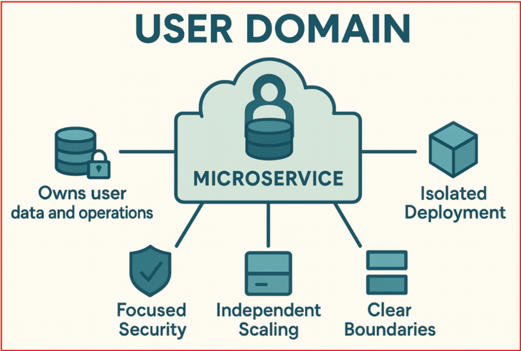
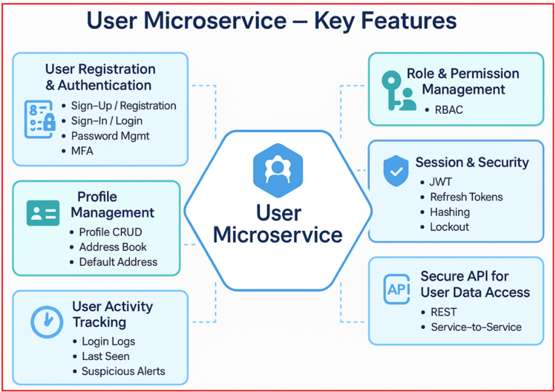
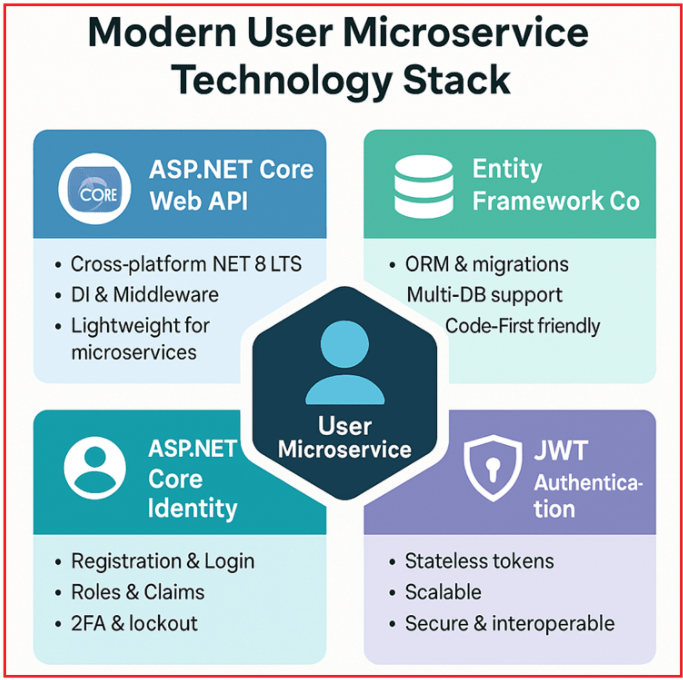

## **میکروسرویس کاربر با ASP.NET Core Web API**

یک **میکروسرویس کاربر** سرویس مستقل است که کل چرخه حیات کاربر، ثبت نام، احراز هویت، مجوز، پروفایل و مدیریت آدرس را در یک معماری میکروسرویس در اختیار دارد. این سرویس داده‌های کاربر، قوانین کسب و کار و قراردادهای API را در یک مکان نگه می‌دارد تا بتوانید آن را مستقل از بقیه سیستم خود مستقر، مقیاس‌بندی و ایمن کنید. این جداسازی، قابلیت نگهداری را بهبود می‌بخشد و تکامل ویژگی‌های کاربر را بدون تأثیر بر سایر دامنه‌ها آسان می‌کند.

این میکروسرویس از طراحی لایه‌ای و ماژولار پیروی می‌کند که تفکیک دغدغه‌ها را ارتقا می‌دهد و با بهترین شیوه‌ها در توسعه برنامه‌های سازمانی همسو است. ویژگی‌های کلیدی عبارتند از:

- ثبت نام و ورود امن با استفاده از **NET Core** Identity
- **احراز هویت مبتنی بر JWT** برای مدیریت نشست بدون وضعیت و مقیاس‌پذیر.
- **کنترل دسترسی مبتنی بر نقش** برای پشتیبانی از نقش‌های مدیر، مشتری و فروشنده.
- مدیریت پروفایل‌های کاربری، آدرس‌های چندگانه و تأیید ایمیل/تلفن.
- ادغام با سرویس‌های خارجی از طریق APIهای امن REST.

میکروسرویس کاربر که با **ASP.NET Core Web API** ، **Entity Framework Core** و **JWT** ساخته شده است ، به عنوان دروازه هویت و دسترسی برای کل اکوسیستم برنامه شما عمل می‌کند.

##### **دامنه کاربری چیست؟**

دامنه **کاربری (User Domain** ) ناحیه‌ای از سیستم شماست که تمام جنبه‌های چرخه حیات کاربر، از جمله ایجاد، احراز هویت، مجوزدهی، مدیریت پروفایل، آدرس‌ها، امنیت و موارد دیگر را مدیریت می‌کند. در معماری میکروسرویس‌ها، ما یک سیستم بزرگ را به سرویس‌های متمرکز و مستقل تقسیم می‌کنیم. میکروسرویس کاربر:

- **مالک تمام داده‌ها و عملیات مرتبط با کاربر است.**
- مخصوص به خود را دارد . **پایگاه داده** ، API و قوانین تجاری
- می‌تواند **مستقر، مقیاس‌پذیر و به‌روزرسانی شود .** مستقل از سایر بخش‌های سیستم،

برای درک بهتر، لطفاً به تصویر زیر مراجعه کنید.

****

##### **مزایا:**

- **مقیاس‌پذیری مستقل:** عملیات مرتبط با کاربر (ورود به سیستم، ثبت‌نام) ممکن است الگوهای ترافیکی و نیازهای عملکردی متفاوتی داشته باشد. جداسازی دامنه به شما امکان می‌دهد سرویس را به طور مستقل مقیاس‌بندی کنید.
- **امنیت متمرکز:** داده‌های کاربر حساس هستند و نیاز به کنترل‌های امنیتی سختگیرانه دارند. جداسازی به اعمال مکانیسم‌های امنیتی و انطباق اختصاصی کمک می‌کند.
- **استقرار ایزوله:** ویژگی‌ها یا اصلاحات جدید در مدیریت کاربر می‌توانند بدون تأثیر بر سایر سرویس‌های تجاری، پیاده‌سازی شوند.
- **مرزهای مشخص:** تفکیک شفاف دغدغه‌ها را تشویق می‌کند، قابلیت نگهداری و وضوح مسئولیت‌ها را بهبود می‌بخشد.

##### **ویژگی‌های کلیدی میکروسرویس کاربر**

دامنه میکروسرویس کاربر شامل زیردامنه‌ها و مسئولیت‌های مختلفی است که برای مدیریت ایمن، قابل اعتماد و انعطاف‌پذیر کاربر ضروری هستند:

##### **ثبت نام و احراز هویت کاربر**

- **ثبت نام/ثبت نام:** کاربران جدید می‌توانند با استفاده از جزئیاتی مانند نام کاربری، ایمیل و رمز عبور ثبت نام کنند. میکروسرویس داده‌ها را اعتبارسنجی می‌کند تا از یکپارچگی داده‌ها اطمینان حاصل شود و از ایجاد حساب‌های کاربری تکراری جلوگیری شود و ممکن است مراحل تأیید را آغاز کند.
- **ورود / ثبت نام:** کاربران با ارائه اعتبارنامه‌های معتبر (ایمیل، نام کاربری، شماره موبایل و رمز عبور) احراز هویت می‌شوند. در صورت موفقیت، سرویس توکن‌های JWT را برای مدیریت نشست بدون وضعیت (stateless session) صادر می‌کند.
- **مدیریت رمز عبور:** پشتیبانی از تنظیم مجدد رمز عبور، رمزهای عبور فراموش شده و تغییر رمز عبور، معمولاً از طریق OTP های ایمیل یا لینک های امن. همیشه رمزهای عبور را با استفاده از الگوریتم های هشینگ امن (مثلاً bcrypt) ذخیره کنید.
- **احراز هویت چند عاملی (MFA):** به صورت اختیاری امنیت ورود به سیستم را با الزام مراحل تأیید اضافی، مانند رمزهای یکبار مصرف ارسال شده از طریق پیامک/ایمیل یا برنامه‌های تأیید هویت (Google Authenticator، Authy) افزایش می‌دهد.

##### **مدیریت پروفایل کاربر**

- **عملیات CRUD:** کاربران (یا مدیران) می‌توانند اطلاعات پروفایل کاربر را ایجاد، مشاهده، به‌روزرسانی و حذف کنند.
- **داده‌های پروفایل:** اطلاعات کاربر، شامل نام، ایمیل، شماره تلفن، عکس پروفایل، تنظیمات برگزیده و سایر فراداده‌ها را ذخیره می‌کند.
- **دفترچه آدرس:** ذخیره چندین آدرس برای هر کاربر (ارسال، صورتحساب و غیره)، با امکان اضافه کردن، ویرایش یا حذف آنها.
- **انتخاب آدرس پیش‌فرض:** کاربران می‌توانند آدرس‌های خاصی را به عنوان آدرس پیش‌فرض خود علامت‌گذاری کنند تا پرداخت یا ارتباط سریع‌تر انجام شود.

##### **مدیریت نقش‌ها و مجوزها**

- **تعریف نقش:** نقش‌ها، کاربران را بر اساس مجوزها دسته‌بندی می‌کنند، به عنوان مثال، مدیران دسترسی کامل دارند، مشتریان مجوزهای مربوط به خرید را دارند و فروشندگان می‌توانند محصولات را مدیریت کنند. نقش‌های معمول: مدیر، مشتری، فروشنده، هر کدام مجموعه مجوزهای خاص خود را دارند.
- **کنترل دسترسی مبتنی بر نقش (RBAC):** این سرویس دسترسی به نقاط انتهایی را بر اساس نقش تعیین‌شده کاربر محدود می‌کند. به عنوان مثال، فقط مدیران می‌توانند سایر کاربران را مدیریت کنند.
- **سیاست‌های مجوزدهی:** سیاست‌های تجاری مانند اینکه چه کسی می‌تواند پروفایل‌ها را ویرایش کند، داده‌های حساس را مشاهده کند یا وظایف مدیریتی را انجام دهد را تعریف کنید و امنیت و انعطاف‌پذیری را افزایش دهید.

##### **مدیریت جلسه و امنیت**

1. **احراز هویت JWT:** پس از ورود به سیستم، یک توکن JWT تولید و به کلاینت ارسال می‌شود که در درخواست‌های بعدی از آن استفاده می‌کند. این امر احراز هویت بدون وضعیت (stateless) را امکان‌پذیر می‌کند (نیازی به ذخیره اطلاعات جلسه در سمت سرور نیست).
2. **توکن‌های تازه‌سازی:** از مکانیسم‌های تازه‌سازی توکن پشتیبانی می‌کند تا جلسات کاربر را بدون نیاز به ورود مکرر، به طور ایمن تمدید کند.
3. **هش کردن رمز عبور:** از الگوریتم‌های هش قوی و یک‌طرفه برای ذخیره ایمن رمزهای عبور استفاده می‌کند.
4. **قفل حساب کاربری:** اگر چندین تلاش ناموفق برای ورود به سیستم شناسایی شود، حساب کاربری به طور موقت قفل می‌شود تا از حملات جستجوی فراگیر جلوگیری شود.

##### **ردیابی فعالیت کاربر**

- **ردیابی ورود:** سابقه‌ای از ورودهای کاربر به سیستم را به همراه فراداده، شامل زمان ورود، آدرس‌های IP، اطلاعات دستگاه و جزئیات مرورگر، نگهداری می‌کند تا الگوهای غیرمعمول یا نقض‌های احتمالی را شناسایی کند. این قابلیت برای حسابرسی و هشدار به کاربران در مورد ورودهای مشکوک مفید است.
- **آخرین بازدید:** آخرین زمان‌های فعالیت را ردیابی می‌کند، که برای ویژگی‌هایی مانند نشانگرهای «آخرین حضور» یا اعمال محدودیت زمانی جلسه مفید است.
- **هشدارهای فعالیت مشکوک:** فعالیت‌های مشکوک (مثلاً چندین ورود ناموفق، ورود از مکان‌های جدید) را شناسایی و به کاربران و مدیران اطلاع دهید.

##### **تأیید حساب**

- **تأیید ایمیل:** پس از ثبت نام یا به‌روزرسانی ایمیل، یک ایمیل تأیید برای تأیید آدرس از طریق OTP یا لینک تأیید ارسال کنید و در نتیجه اعتبار حساب را افزایش دهید.
- **تأیید شماره تلفن:** برای تأیید شماره تلفن همراه، یک OTP (رمز عبور یکبار مصرف) از طریق پیامک ارسال کنید.
- **وضعیت فعال‌سازی:** کاربران فقط زمانی می‌توانند به پلتفرم دسترسی داشته باشند که حساب کاربری‌شان تأیید و فعال شده باشد. وضعیت حساب کاربری (فعال/غیرفعال/مسدود) را برای کنترل دسترسی حفظ می‌کند.

##### **API برای دسترسی به داده‌های کاربر**

- **APIهای امن:** سایر میکروسرویس‌ها (مانند سفارش، پرداخت و اعلان) می‌توانند اطلاعات کاربر را برای پردازش تراکنش‌ها، شخصی‌سازی تجربیات یا تأیید هویت درخواست کنند. بنابراین، این امر نقاط پایانی REST را با احراز هویت و مجوز مناسب برای سایر میکروسرویس‌ها فراهم می‌کند تا داده‌های لازم کاربر را بازیابی کنند (به عنوان مثال، میکروسرویس سفارش که اطلاعات حمل و نقل را دریافت می‌کند).

##### **پشته فناوری پیشنهادی برای ساخت یک میکروسرویس کاربری مدرن**

بیایید بهترین پشته فناوری برای پیاده‌سازی یک میکروسرویس کاربر امن و مقیاس‌پذیر را درک کنیم. این رویکرد، ASP.NET Core Web API، Entity Framework Core، ASP.NET Core Identity و احراز هویت JWT را ترکیب می‌کند تا مدیریت قوی کاربر، دسترسی یکپارچه به داده‌ها و امنیت بدون وضعیت را ارائه دهد و معماری میکروسرویس شما را مدرن، کارآمد و آماده برای تولید کند.

****

##### **چارچوب: ASP.NET Core Web API**

- **ASP.NET Core Web API** چارچوب مدرن و چند پلتفرمی مایکروسافت است که برای ساخت APIهای RESTful طراحی شده است.
- این برنامه از آخرین نسخه‌های .NET پشتیبانی می‌کند (در حال حاضر، .NET 8 LTS آخرین نسخه با پشتیبانی بلندمدت است)، که عملکرد، امنیت و پشتیبانی مداوم را تضمین می‌کند.
- ASP.NET Core Web API تزریق وابستگی داخلی، خطوط لوله میان‌افزار، سیستم‌های پیکربندی، گزارش‌گیری و ادغام عالی با مکانیسم‌های احراز هویت و مجوز را ارائه می‌دهد.
- به دلیل طراحی سبک، ماژولار و مقیاس‌پذیر، برای میکروسرویس‌ها ایده‌آل است.

**مزیت در دنیای واقعی:** شما می‌توانید سرویس خود را روی ویندوز، لینوکس یا کانتینرها (Docker، Kubernetes) با پشتیبانی کامل مایکروسافت و یک اکوسیستم پویا اجرا کنید.

##### **ORM: هسته Entity Framework (EF Core)**

- **Entity Framework Core** ، نگاشت‌دهنده‌ی رابطه‌ای-شیئی (ORM) رسمی مایکروسافت برای برنامه‌های دات‌نت است.
- EF Core به توسعه‌دهندگان این امکان را می‌دهد که با استفاده از اشیاء Strongly Typed .NET با پایگاه‌های داده رابطه‌ای (مانند SQL Server، PostgreSQL، MySQL و SQLite) تعامل داشته باشند.
- این برنامه از رویکردهای Code-First و Database-First پشتیبانی می‌کند و آن را برای نیازهای مختلف پروژه انعطاف‌پذیر می‌سازد.
- EF Core به طور خودکار ایجاد طرحواره پایگاه داده، مهاجرت‌ها و روابط بین موجودیت‌ها را مدیریت می‌کند.
- در میکروسرویس کاربر، EF Core داده‌های کاربر، نقش‌ها، ادعاها و اطلاعات پروفایل مرتبط را به صورت ایمن و کارآمد ذخیره می‌کند.

**مزیت در دنیای واقعی:** EF Core توسعه را تسریع می‌کند، کدهای تکراری را کاهش می‌دهد و کد شما را با تکامل مدل داده‌تان قابل نگهداری نگه می‌دارد.

##### **مدیریت عضویت: هویت ASP.NET Core**

ASP.NET Core Identity **چارچوب استانداردی** برای مدیریت تمام قابلیت‌های مرتبط با کاربر است:

- **ثبت نام کاربر:** این سیستم مکانیزم‌های داخلی برای ثبت نام کاربران، از جمله اعتبارسنجی نام‌های کاربری و ایمیل‌های منحصر به فرد، فراهم می‌کند.
- **مدیریت ورود و رمز عبور:** عملیات ورود و رمز عبور ایمن کاربر، از جمله تنظیم مجدد رمز عبور را مدیریت می‌کند.
- **هش کردن رمز عبور:** از الگوریتم‌های هش استاندارد صنعتی (مثلاً PBKDF2) برای ذخیره ایمن رمزهای عبور استفاده می‌کند و از افشای رمز عبور جلوگیری می‌کند.
- **مدیریت نقش‌ها و ادعاها:** امکان انتساب کاربران به نقش‌ها (مثلاً مدیر، مشتری) و الصاق ادعاها (مجوزها یا ویژگی‌ها) به کاربران را فراهم می‌کند.
- **بهترین شیوه‌های امنیتی:** ویژگی‌هایی مانند قفل کردن حساب پس از چندین تلاش ناموفق، احراز هویت دو مرحله‌ای (2FA) و گردش‌های کاری تأیید ایمیل را پیاده‌سازی کنید.
- **توسعه‌پذیری:** می‌توانید کلاس IdentityUser را طوری توسعه دهید که فیلدهای پروفایل کاربر سفارشی، مانند آدرس، شماره تلفن و تصاویر پروفایل را نیز شامل شود.

**مزیت در دنیای واقعی:** شما یک سیستم امنیتی بالغ و آزمایش‌شده دریافت می‌کنید که با نیازهای کسب‌وکار شما قابل تنظیم است، با توسعه سریع و بهترین شیوه‌های اثبات‌شده.

##### **احراز هویت: JWT (توکن‌های وب JSON) برای احراز هویت بدون تابعیت**

JWT یک فرمت توکن فشرده و ایمن برای URL است که ادعاهای مربوط به کاربر (مانند هویت، نقش‌ها و مجوزها) را رمزگذاری می‌کند و برای جلوگیری از دستکاری، به صورت دیجیتالی امضا شده است.

به جای احراز هویت سنتی مبتنی بر کوکی (مناسب برای برنامه‌های وب)، APIها احراز هویت توکن بدون وضعیت را ترجیح می‌دهند. پس از ورود موفقیت‌آمیز، ASP.NET Core Identity می‌تواند طوری پیکربندی شود که یک **توکن دسترسی JWT تولید کند،** که کلاینت‌ها (برنامه‌های وب/موبایل) برای فراخوانی‌های بعدی API از آن استفاده می‌کنند.

###### **خواص کلیدی:**

- **بی‌تابعیت بودن:** توکن‌های JWT شامل تمام ادعاهای لازم کاربر هستند و نیازی به ذخیره‌سازی نشست سمت سرور ندارند و امکان مقیاس‌پذیری افقی آسان را فراهم می‌کنند.
- **مقیاس‌پذیری:** چندین میکروسرویس می‌توانند توکن‌های JWT را به‌طور مستقل و بدون نیاز به یک منبع ذخیره‌سازی مرکزی اعتبارسنجی کنند.
- **قابلیت همکاری:** JWTها به طور گسترده در پلتفرم‌های مختلف پشتیبانی می‌شوند و می‌توانند به راحتی از طریق هدرهای HTTP منتقل شوند.
- **امنیت:** توکن‌ها امضا شده‌اند (و به صورت اختیاری رمزگذاری شده‌اند) که یکپارچگی و اصالت داده‌ها را تضمین می‌کند.
- **سازگاری:** با ارسال امن توکن‌ها برای احراز هویت، به خوبی با درگاه‌های API و ارتباطات بین سرویس‌ها کار می‌کند.
- **استاندارد:** در همه جا، وب، موبایل، دسکتاپ، اینترنت اشیا پشتیبانی می‌شود.

**مزیت در دنیای واقعی:** با JWT، میکروسرویس کاربر شما می‌تواند یک بار کاربران را احراز هویت کند، یک توکن صادر کند و به هر میکروسرویسی (سفارش، پرداخت و غیره) اجازه دهد تا کاربر را تنها با بررسی توکن تأیید کند؛ هیچ ذخیره سشن مرکزی یا فراخوانی پایگاه داده لازم نیست.