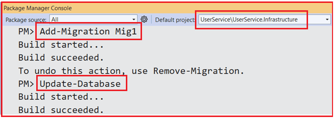
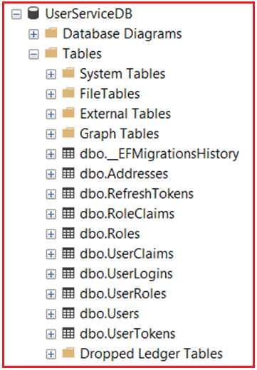

## **پیاده‌سازی لایه API میکروسرویس کاربر**

دروازه‌ای **لایه API** است که از طریق آن کلاینت‌ها با میکروسرویس کاربر تعامل دارند. این لایه، نقاط پایانی تمیز، نسخه‌بندی‌شده و امنی را برای مدیریت تمام عملیات کاربر-محور، از جمله ثبت‌نام، ورود به سیستم، به‌روزرسانی پروفایل و مدیریت آدرس، تعریف می‌کند.

اجزای کلیدی شامل موارد زیر است:

- **کنترل‌کننده‌هایی** (مثلاً UserController) که درخواست‌های HTTP را مدیریت می‌کنند، سرویس‌های برنامه را فراخوانی می‌کنند و پاسخ‌های استاندارد شده را برمی‌گردانند.
- **بسته‌بندی‌های پاسخ** (ApiResponse\<T>) که فرمت خروجی API ثابتی را تضمین می‌کنند.
- **میان‌افزار امنیتی** که توکن‌های JWT را اعتبارسنجی کرده و قوانین مجوزدهی را اعمال می‌کند.
- **فایل‌های پیکربندی** (appsettings.json، Program.cs) که اتصالات پایگاه داده، تنظیمات JWT و ثبت سرویس‌ها را تعریف می‌کنند.

لایه API:

- درخواست‌های ورودی را با استفاده از اتصال مدل و حاشیه‌نویسی داده‌ها اعتبارسنجی می‌کند.
- لایه برنامه را برای اجرای گردش‌های کاری فراخوانی می‌کند.
- قالب‌بندی پاسخ، مدیریت خطا و کدهای وضعیت HTTP را مدیریت می‌کند.
- ارتباط امن را از طریق احراز هویت و مجوز مبتنی بر نقش تضمین می‌کند.

##### **نصب بسته‌های مورد نیاز**

در **پروژه UserService.API** ، لطفاً بسته ASP.NET Core Identity را نصب کنید. موارد زیر پشتیبانی از تولید و اعتبارسنجی JWT Token را فراهم می‌کند. **بسته UAParser** برای تجزیه عامل کاربر مورد نیاز است.

- **نصب بسته Microsoft.AspNetCore.Authentication.JwtBearer**
- **نصب بسته UAParser**

ابتدا، پوشه‌ای با نام DTOs در دایرکتوری ریشه پروژه ایجاد کنید.

##### **ایجاد نوع عمومی ApiResponse\<T> برای پاسخ استاندارد**

کلاس عمومی ApiResponse\<T> به گونه‌ای طراحی شده است که ساختاری یکسان برای همه پاسخ‌های API ارائه دهد، که شامل کپسوله‌سازی موفقیت‌آمیز بودن درخواست، داده‌های پاسخ (در صورت وجود)، رشته پیام و لیستی از پیام‌های خطا می‌شود. این کلاس با متدهای کمکی استاتیک برای تولید آسان پاسخ‌های موفقیت یا شکست، سازگاری را در تمام نقاط انتهایی API ارتقا می‌دهد. ایجاد کنید **یک فایل کلاس به نام ApiResponse.cs** در **پوشه DTOs** خود **پروژه UserService.API** و کد زیر را کپی و جایگذاری کنید:

```csharp
namespace UserService.API.DTOs
{
    public class ApiResponse<T>
    {
        public bool Success { get; set; }
        public T? Data { get; set; }
        public string? Message { get; set; }
        public List<string>? Errors { get; set; }

        public static ApiResponse<T> SuccessResponse(T data, string? message = null)
        {
            return new ApiResponse<T> { Success = true, Data = data, Message = message };
        }

        public static ApiResponse<T> FailResponse(string message, List<string>? errors = null, T? data = default)
        {
            return new ApiResponse<T> { Success = false, Data = data, Message = message, Errors = errors };
        }
    }
}
```

##### **ایجاد کنترل‌کننده کاربر**

کلاس UserController، کنترل‌کننده‌ی API مرکزی است که مسئول مدیریت تمام درخواست‌های HTTP مربوط به عملیات کاربر در میکروسرویس کاربر است. این کلاس، متدهای نقطه‌ی پایانی برای ثبت‌نام کاربر، ورود به سیستم، به‌روزرسانی JWT، تأیید ایمیل، مدیریت رمز عبور (فراموش/تنظیم مجدد/تغییر)، بازیابی و به‌روزرسانی پروفایل و همچنین مدیریت آدرس (CRUD) را تعریف می‌کند.

هر متد عملیاتی، DTOها را به عنوان ورودی دریافت می‌کند، منطق کسب‌وکار را به IUserService تزریق‌شده واگذار می‌کند و پاسخ‌ها را در قالبی استاندارد بسته‌بندی می‌کند و هم موارد موفقیت و هم خطا را مدیریت می‌کند. این کنترلر به عنوان رابط عمومی سرویس شما عمل می‌کند، درخواست‌های کلاینت را به عملیات سرویس تبدیل می‌کند و اعتبارسنجی، امنیت و سازگاری پاسخ در سطح API را اعمال می‌کند.

یک کنترلر API خالی با نام **UserController.cs** در **پوشه Controllers** خود **پروژه UserService.API** ایجاد کنید و کد زیر را کپی و جایگذاری کنید:

```csharp
using Microsoft.AspNetCore.Authorization;
using Microsoft.AspNetCore.Mvc;
using System.Net;
using System.Security.Claims;
using UAParser;
using UserService.API.DTOs;
using UserService.Application.DTOs;
using UserService.Application.Services;

namespace UserService.API.Controllers
{
    [ApiController]
    [Route("api/[controller]")]
    public class UserController : ControllerBase
    {
        private readonly IUserService _userService;

        public UserController(IUserService userService)
        {
            _userService = userService;
        }

        [HttpPost("register")]
        [ProducesResponseType(typeof(ApiResponse<string>), (int)HttpStatusCode.OK)]
        [ProducesResponseType(typeof(ApiResponse<string>), (int)HttpStatusCode.BadRequest)]
        public async Task<IActionResult> Register([FromBody] RegisterDTO dto)
        {
            try
            {
                var result = await _userService.RegisterAsync(dto);
                if (!result)
                    return BadRequest(ApiResponse<string>.FailResponse("Registration failed. Email or username might already exist."));

                return Ok(ApiResponse<string>.SuccessResponse("User registered successfully."));
            }
            catch (Exception ex)
            {
                return StatusCode(500, ApiResponse<string>.FailResponse("Error during registration.", new List<string> { ex.Message }));
            }
        }

        [HttpPost("send-confirmation-email")]
        [ProducesResponseType(typeof(ApiResponse<EmailConfirmationTokenResponseDTO>), (int)HttpStatusCode.OK)]
        public async Task<IActionResult> SendConfirmationEmail([FromBody] EmailDTO dto)
        {
            try
            {
                var emailTokenResponse = await _userService.SendConfirmationEmailAsync(dto.Email);
                if (emailTokenResponse == null)
                    return NotFound(ApiResponse<string>.FailResponse("User with this email not found"));

                return Ok(ApiResponse<EmailConfirmationTokenResponseDTO>.SuccessResponse(emailTokenResponse, "Email confirmation token generated successfully."));
            }
            catch (Exception ex)
            {
                return StatusCode(500, ApiResponse<string>.FailResponse("Error generating confirmation token.", new List<string> { ex.Message }));
            }
        }

        [HttpPost("verify-email")]
        [ProducesResponseType(typeof(ApiResponse<string>), 200)]
        [ProducesResponseType(typeof(ApiResponse<string>), 400)]
        public async Task<IActionResult> VerifyConfirmationEmailAsync([FromBody] ConfirmEmailDTO dto)
        {
            try
            {
                var success = await _userService.VerifyConfirmationEmailAsync(dto);
                if (!success)
                    return BadRequest(ApiResponse<string>.FailResponse("Invalid confirmation token or user."));

                return Ok(ApiResponse<string>.SuccessResponse("Email confirmed successfully."));
            }
            catch (Exception ex)
            {
                return StatusCode(500, ApiResponse<string>.FailResponse("Error confirming email.", new List<string> { ex.Message }));
            }
        }

        [HttpPost("login")]
        public async Task<IActionResult> Login([FromBody] LoginDTO dto)
        {
            var IPAddress = HttpContext.Connection.RemoteIpAddress?.ToString() ?? "";
            var UserAgent = GetNormalizedUserAgent();
            var loginResponse = await _userService.LoginAsync(dto, IPAddress, UserAgent);

            if (!string.IsNullOrEmpty(loginResponse.ErrorMessage))
            {
                loginResponse.Succeeded = false;
                return Unauthorized(ApiResponse<LoginResponseDTO>.FailResponse(loginResponse.ErrorMessage, errors: null, data: loginResponse));
            }

            loginResponse.Succeeded = true;
            return Ok(ApiResponse<LoginResponseDTO>.SuccessResponse(loginResponse,
                loginResponse.RequiresTwoFactor ? "Two-factor authentication required." : "Login successful."));
        }

        [HttpPost("refresh-token")]
        public async Task<IActionResult> RefreshToken([FromBody] RefreshTokenRequestDTO dto)
        {
            var IPAddress = HttpContext.Connection.RemoteIpAddress?.ToString() ?? "";
            var UserAgent = GetNormalizedUserAgent();

            var refreshTokenResponse = await _userService.RefreshTokenAsync(dto, IPAddress, UserAgent);

            if (!string.IsNullOrEmpty(refreshTokenResponse.ErrorMessage))
                return Unauthorized(ApiResponse<string>.FailResponse(refreshTokenResponse.ErrorMessage));

            return Ok(ApiResponse<RefreshTokenResponseDTO>.SuccessResponse(refreshTokenResponse, "Token refreshed successfully."));
        }

        [HttpPost("revoke-token")]
        [ProducesResponseType(typeof(ApiResponse<string>), (int)HttpStatusCode.OK)]
        [ProducesResponseType(typeof(ApiResponse<string>), (int)HttpStatusCode.BadRequest)]
        public async Task<IActionResult> RevokeToken([FromBody] RefreshTokenRequestDTO dto)
        {
            try
            {
                var success = await _userService.RevokeRefreshTokenAsync(dto.RefreshToken, HttpContext.Connection.RemoteIpAddress?.ToString() ?? "");
                if (!success)
                    return BadRequest(ApiResponse<string>.FailResponse("Invalid token or token already revoked."));

                return Ok(ApiResponse<string>.SuccessResponse("Token revoked successfully."));
            }
            catch (Exception ex)
            {
                return StatusCode(500, ApiResponse<string>.FailResponse("Error revoking token.", new List<string> { ex.Message }));
            }
        }

        [HttpGet("profile/{userId}")]
        [ProducesResponseType(typeof(ApiResponse<ProfileDTO>), (int)HttpStatusCode.OK)]
        [ProducesResponseType(typeof(ApiResponse<string>), (int)HttpStatusCode.NotFound)]
        public async Task<IActionResult> GetProfile(Guid userId)
        {
            try
            {
                var profile = await _userService.GetProfileAsync(userId);
                if (profile == null)
                    return NotFound(ApiResponse<string>.FailResponse("User profile not found."));

                return Ok(ApiResponse<ProfileDTO>.SuccessResponse(profile));
            }
            catch (Exception ex)
            {
                return StatusCode(500, ApiResponse<string>.FailResponse("Error fetching profile.", new List<string> { ex.Message }));
            }
        }

        [HttpPut("profile")]
        [ProducesResponseType(typeof(ApiResponse<string>), (int)HttpStatusCode.OK)]
        [ProducesResponseType(typeof(ApiResponse<string>), (int)HttpStatusCode.BadRequest)]
        public async Task<IActionResult> UpdateProfile([FromBody] UpdateProfileDTO dto)
        {
            try
            {
                var success = await _userService.UpdateProfileAsync(dto);
                if (!success)
                    return BadRequest(ApiResponse<string>.FailResponse("Failed to update profile."));

                return Ok(ApiResponse<string>.SuccessResponse("Profile updated successfully."));
            }
            catch (Exception ex)
            {
                return StatusCode(500, ApiResponse<string>.FailResponse("Error updating profile.", new List<string> { ex.Message }));
            }
        }

        [HttpPost("forgot-password")]
        [ProducesResponseType(typeof(ApiResponse<string>), (int)HttpStatusCode.OK)]
        [ProducesResponseType(typeof(ApiResponse<string>), (int)HttpStatusCode.BadRequest)]
        public async Task<IActionResult> ForgotPassword([FromBody] EmailDTO dto)
        {
            try
            {
                var forgotPassword = await _userService.ForgotPasswordAsync(dto.Email);
                if (forgotPassword == null)
                    return NotFound(ApiResponse<string>.FailResponse("Email not found."));

                return Ok(ApiResponse<ForgotPasswordResponseDTO>.SuccessResponse(forgotPassword, "Password reset token sent to email."));
            }
            catch (Exception ex)
            {
                return StatusCode(500, ApiResponse<string>.FailResponse("Error in forgot password process.", new List<string> { ex.Message }));
            }
        }

        [HttpPost("reset-password")]
        [ProducesResponseType(typeof(ApiResponse<string>), 200)]
        [ProducesResponseType(typeof(ApiResponse<string>), 400)]
        public async Task<IActionResult> ResetPassword([FromBody] ResetPasswordDTO dto)
        {
            try
            {
                var success = await _userService.ResetPasswordAsync(dto.UserId, dto.Token, dto.NewPassword);
                if (!success)
                    return BadRequest(ApiResponse<string>.FailResponse("Invalid token or user."));

                return Ok(ApiResponse<string>.SuccessResponse("Password reset successfully."));
            }
            catch (Exception ex)
            {
                return StatusCode(500, ApiResponse<string>.FailResponse("Error resetting password.", new List<string> { ex.Message }));
            }
        }

        [Authorize]
        [HttpPost("change-password")]
        [ProducesResponseType(typeof(ApiResponse<string>), 200)]
        [ProducesResponseType(typeof(ApiResponse<string>), 400)]
        [ProducesResponseType(typeof(ApiResponse<string>), 401)]
        public async Task<IActionResult> ChangePassword([FromBody] ChangePasswordDTO dto)
        {
            try
            {
                var userIdClaim = User.FindFirst(ClaimTypes.NameIdentifier)?.Value;
                if (string.IsNullOrEmpty(userIdClaim) || !Guid.TryParse(userIdClaim, out var userId))
                    return Unauthorized(ApiResponse<string>.FailResponse("Invalid user token."));

                var success = await _userService.ChangePasswordAsync(userId, dto.CurrentPassword, dto.NewPassword);
                if (!success)
                    return BadRequest(ApiResponse<string>.FailResponse("Password change failed."));

                return Ok(ApiResponse<string>.SuccessResponse("Password changed successfully."));
            }
            catch (Exception ex)
            {
                return StatusCode(500, ApiResponse<string>.FailResponse("Error changing password.", new List<string> { ex.Message }));
            }
        }

        [HttpPost("addresses")]
        [ProducesResponseType(typeof(ApiResponse<string>), (int)HttpStatusCode.OK)]
        [ProducesResponseType(typeof(ApiResponse<string>), (int)HttpStatusCode.BadRequest)]
        public async Task<IActionResult> AddOrUpdateAddress([FromBody] AddressDTO dto)
        {
            var addressId = await _userService.AddOrUpdateAddressAsync(dto);
            if (addressId == Guid.Empty)
                return BadRequest(ApiResponse<string>.FailResponse("Failed to add or update address."));

            return Ok(ApiResponse<Guid>.SuccessResponse(addressId, "Address saved successfully."));
        }

        [HttpGet("{userId}/addresses")]
        [ProducesResponseType(typeof(ApiResponse<IEnumerable<AddressDTO>>), (int)HttpStatusCode.OK)]
        [ProducesResponseType(typeof(ApiResponse<string>), (int)HttpStatusCode.NotFound)]
        public async Task<IActionResult> GetAddresses(Guid userId)
        {
            try
            {
                var addresses = await _userService.GetAddressesAsync(userId);
                return Ok(ApiResponse<IEnumerable<AddressDTO>>.SuccessResponse(addresses));
            }
            catch (Exception ex)
            {
                return StatusCode(500, ApiResponse<string>.FailResponse("Error fetching addresses.", new List<string> { ex.Message }));
            }
        }

        [ProducesResponseType(typeof(ApiResponse<string>), (int)HttpStatusCode.OK)]
        [ProducesResponseType(typeof(ApiResponse<string>), (int)HttpStatusCode.NotFound)]
        [HttpPost("delete-address")]
        public async Task<IActionResult> DeleteAddress([FromBody] DeleteAddressDTO dto)
        {
            try
            {
                var deleted = await _userService.DeleteAddressAsync(dto.UserId, dto.AddressId);
                if (!deleted)
                    return BadRequest(ApiResponse<string>.FailResponse("Address not found or deletion failed."));

                return Ok(ApiResponse<string>.SuccessResponse("Address deleted successfully."));
            }
            catch (Exception ex)
            {
                return StatusCode(500, ApiResponse<string>.FailResponse("Error deleting address.", new List<string> { ex.Message }));
            }
        }

        [HttpGet("{userId}/exists")]
        public async Task<IActionResult> UserExists(Guid userId)
        {
            bool exists = await _userService.IsUserExistsAsync(userId);

            var response = new ApiResponse<bool>
            {
                Success = true,
                Data = exists,
                Message = exists ? "User exists." : "User does not exist."
            };

            return Ok(response);
        }

        [HttpGet("{userId}/address/{addressId}")]
        [ProducesResponseType(typeof(ApiResponse<AddressDTO>), (int)HttpStatusCode.OK)]
        [ProducesResponseType(typeof(ApiResponse<string>), (int)HttpStatusCode.NotFound)]
        public async Task<IActionResult> GetUserAddress(Guid userId, Guid addressId)
        {
            try
            {
                var address = await _userService.GetAddressByUserIdAndAddressIdAsync(userId, addressId);
                if(address != null)
                    return Ok(ApiResponse<AddressDTO>.SuccessResponse(address));

                return NotFound(ApiResponse<string>.FailResponse("Address not found."));
            }
            catch (Exception ex)
            {
                return StatusCode(500, ApiResponse<string>.FailResponse("Error fetching addresses.", new List<string> { ex.Message }));
            }
        }

        private string GetNormalizedUserAgent()
        {
            var userAgentRaw = HttpContext.Request.Headers["User-Agent"].ToString();

            if (string.IsNullOrWhiteSpace(userAgentRaw))
                return "Unknown";

            try
            {
                var uaParser = Parser.GetDefault();
                ClientInfo clientInfo = uaParser.Parse(userAgentRaw);

                var browser = clientInfo.UA.Family ?? "UnknownBrowser";
                var browserVersion = clientInfo.UA.Major ?? "0";
                var os = clientInfo.OS.Family ?? "UnknownOS";

                return $"{browser}-{browserVersion}_{os}";
            }
            catch
            {
                return "Unknown";
            }
        }
    }
}
```

##### **فایل AppSettings.json:**

فایل appsettings.json فایل پیکربندی اصلی برای میکروسرویس کاربر است که تنظیمات ضروری را در قالب ساختاریافته JSON ذخیره می‌کند. این فایل شامل رشته اتصال مورد نیاز Entity Framework Core برای اتصال به پایگاه داده SQL Server، تنظیمات احراز هویت JWT مانند صادرکننده، کلید مخفی و زمان انقضای توکن، پیکربندی ثبت وقایع و سیاست میزبان‌های مجاز است.

این تنظیمات در زمان اجرا توسط برنامه خوانده می‌شوند و در صورت نیاز تزریق می‌شوند و به شما امکان می‌دهند اطلاعات حساس، جزئیات خاص محیط و پارامترهای عملیاتی را بدون نیاز به کدگذاری مجدد در کد منبع خود مدیریت کنید. بنابراین، لطفاً **appsetings.json** را به شرح زیر از **پروژه UserService.API** ما تغییر دهید :

```json
{
  "ConnectionStrings": {
    "UserDbConnection": "Server=LAPTOP-6P5NK25R\\SQLSERVER2022DEV;Database=UserServiceDB;Trusted_Connection=True;TrustServerCertificate=True;"
  },
  "JwtSettings": {
    "Issuer": "UserService.API",
    "SecretKey": "fPXxcJw8TW5sA+S4rl4tIPcKk+oXAqoRBo+1s2yjUS4=",
    "AccessTokenExpirationMinutes": 15
  },
  "Logging": {
    "LogLevel": {
      "Default": "Information",
      "Microsoft.AspNetCore": "Warning"
    }
  },
  "AllowedHosts": "*"
}
```

##### **Program.cs (پیکربندی API)**

کلاس Program به عنوان نقطه ورود برای برنامه ASP.NET Core Web API شما عمل می‌کند. در زمینه میکروسرویس کاربر، پشتیبانی از کنترلر، مستندات Swagger/OpenAPI، زمینه پایگاه داده Entity Framework Core، ASP.NET Core Identity برای احراز هویت و مجوزدهی، و امنیت مبتنی بر JWT با تنظیمات اعتبارسنجی توکن که از پیکربندی گرفته شده است را پیکربندی می‌کند.

همچنین تمام سرویس‌ها و مخازن مورد نیاز (مانند IUserRepository و IUserService) را ثبت می‌کند، میان‌افزار امنیتی را اعمال می‌کند و کنترلرها را به مسیرها نگاشت می‌کند. این کلاس تضمین می‌کند که برنامه آماده پذیرش و پردازش درخواست‌های HTTP مطابق با طراحی و بهترین شیوه‌های سرویس شما است. بنابراین، لطفاً فایل کلاس Program را برای **UserService.API خود به صورت زیر تغییر دهید:** پروژه

```csharp
using Microsoft.AspNetCore.Authentication.JwtBearer;
using Microsoft.AspNetCore.Identity;
using Microsoft.EntityFrameworkCore;
using Microsoft.IdentityModel.Tokens;
using System.Text;
using UserService.Application.Services;
using UserService.Domain.Repositories;
using UserService.Infrastructure.Identity;
using UserService.Infrastructure.Persistence;
using UserService.Infrastructure.Repositories;

namespace UserService.API
{
    public class Program
    {
        public static void Main(string[] args)
        {
            var builder = WebApplication.CreateBuilder(args);

            // Add services to the container.
            builder.Services.AddControllers()
                .AddJsonOptions(options =>
                {
                    options.JsonSerializerOptions.PropertyNamingPolicy = null;
                });

            builder.Services.AddEndpointsApiExplorer();
            builder.Services.AddSwaggerGen();

            builder.Services.AddDbContext<UserDbContext>(options =>
                options.UseSqlServer(builder.Configuration.GetConnectionString("UserDbConnection")));

            builder.Services.AddIdentity<ApplicationUser, ApplicationRole>(options =>
            {
                // Password policy
                options.Password.RequireDigit = true;
                options.Password.RequiredLength = 8;
                options.Password.RequireNonAlphanumeric = false;
                options.Password.RequireUppercase = true;
                options.Password.RequireLowercase = true;

                // Lockout settings
                options.Lockout.DefaultLockoutTimeSpan = TimeSpan.FromMinutes(15);
                options.Lockout.MaxFailedAccessAttempts = 5;
                options.Lockout.AllowedForNewUsers = true;

                // User settings (optional)
                options.User.RequireUniqueEmail = true;
            })
            .AddEntityFrameworkStores<UserDbContext>()
            .AddDefaultTokenProviders();

            // Configure token lifespan (e.g., password reset, email confirmation)
            builder.Services.Configure<DataProtectionTokenProviderOptions>(opt =>
            {
                opt.TokenLifespan = TimeSpan.FromHours(3); // Set token validity duration
            });

            // Adding JWT Authentication
            builder.Services.AddAuthentication(options =>
            {
                options.DefaultAuthenticateScheme = JwtBearerDefaults.AuthenticationScheme;
                options.DefaultChallengeScheme = JwtBearerDefaults.AuthenticationScheme;
            })
            .AddJwtBearer(options =>
            {
                options.TokenValidationParameters = new TokenValidationParameters
                {
                    ValidateIssuer = true,
                    ValidateAudience = false,
                    ValidateLifetime = true,
                    ValidateIssuerSigningKey = true,
                    ValidIssuer = builder.Configuration["JwtSettings:Issuer"],
                    IssuerSigningKey = new SymmetricSecurityKey(Encoding.UTF8.GetBytes(builder.Configuration["JwtSettings:SecretKey"]!))
                };
            });

            builder.Services.AddScoped<IUserRepository, UserRepository>();
            builder.Services.AddScoped<IUserService, UserService.Application.Services.UserService>();

            var app = builder.Build();

            // Configure the HTTP request pipeline.
            if (app.Environment.IsDevelopment())
            {
                app.UseSwagger();
                app.UseSwaggerUI();
            }

            app.UseHttpsRedirection();

            app.UseAuthentication();
            app.UseAuthorization();

            app.MapControllers();

            app.Run();
        }
    }
}
```

##### **بسته Microsoft.EntityFrameworkCore.Design را در پروژه API نصب کنید:**

در برنامه ما،

- DbContext **در پروژه Infrastructure قرار دارد** .
- رشته **اتصال و appsettings.json در پروژه API (پروژه راه‌اندازی) قرار دارند** .
- پروژه **API به عنوان پروژه آغازین در طول دستورات مهاجرت استفاده می‌شود** ، بنابراین ابزارهای EF Core می‌توانند پیکربندی و تنظیمات تزریق وابستگی را به درستی انجام دهند.

برای انجام این کار، باید **بسته Microsoft.EntityFrameworkCore.Design را در پروژه API** (پروژه اولیه شما) نصب کنیم. این بسته شامل ابزارهای زمان طراحی است که EF Core برای اجرای مهاجرت‌ها و چارچوب‌بندی به آنها نیاز دارد.

- **نصب بسته Microsoft.EntityFrameworkCore.Design**

##### **ایجاد و اعمال مهاجرت پایگاه داده:**

در ویژوال استودیو، کنسول Package Manager را باز کنید و **دستورات Add-Migration** و **Update-Database** را به شرح زیر اجرا کنید تا فایل Migration تولید شود و سپس فایل Migration را برای ایجاد پایگاه داده و جداول مورد نیاز اعمال کنید. لطفاً این دستورات را در پروژه Infrastructure که شامل کلاس DbContext است، اجرا کنید.



پس از اجرای دستورات فوق، پایگاه داده را بررسی کنید تا مطمئن شوید که شامل پایگاه داده UserServiceDB با جداول مورد نیاز است، همانطور که در تصویر زیر نشان داده شده است.



لایه API به عنوان **چهره عمومی** میکروسرویس کاربر عمل می‌کند و درخواست‌های خارجی را به عملیات کنترل‌شده، اعتبارسنجی‌شده و ایمن تبدیل می‌کند. این لایه، جدایی کاملی از منطق کسب‌وکار زیربنایی ایجاد می‌کند و تضمین می‌کند که تغییرات داخلی بر ادغام‌های کلاینت تأثیری نگذارد.

میکروسرویس کاربر **با ارائه یک راه‌حل امن، مقیاس‌پذیر و قابل نگهداری برای تمام عملیات مرتبط با کاربر، نقش حیاتی** در معماری میکروسرویس‌ها ایفا می‌کند. جداسازی آن به عنوان یک سرویس مستقل، موارد زیر را امکان‌پذیر می‌سازد:

- مدیریت متمرکز داده‌های کاربر و امنیت.
- ادغام یکپارچه با سایر میکروسرویس‌ها از طریق APIهای امن.
- امنیت پیشرفته از طریق JWT، احراز هویت مبتنی بر نقش و احراز هویت چند عاملی.
- مدیریت کاربر انعطاف‌پذیر و قابل توسعه که از ورود به سیستم از طریق شبکه‌های اجتماعی و ردیابی فعالیت‌ها پشتیبانی می‌کند.

ساخت دقیق میکروسرویس کاربر با معماری تمیز و بهترین شیوه‌های امنیتی، یک ستون فقرات قوی برای کل اکوسیستم میکروسرویس‌ها تشکیل می‌دهد و یک تجربه کاربری سازگار و قابل اعتماد را تضمین می‌کند.