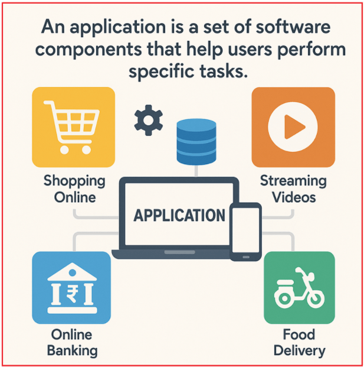
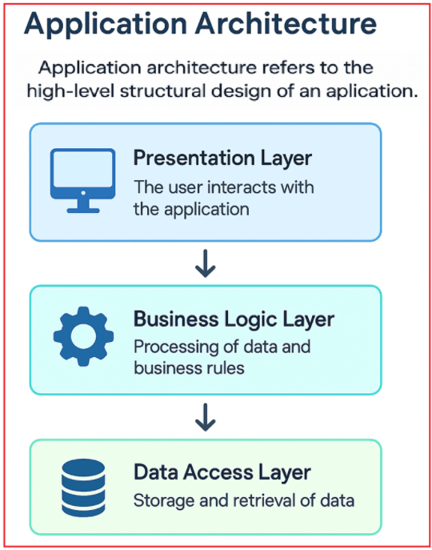
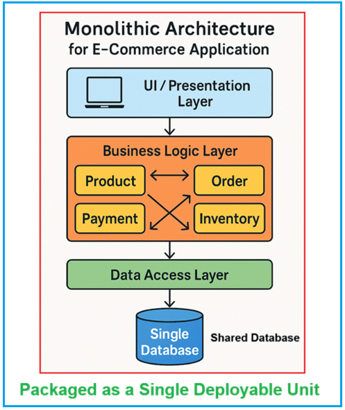
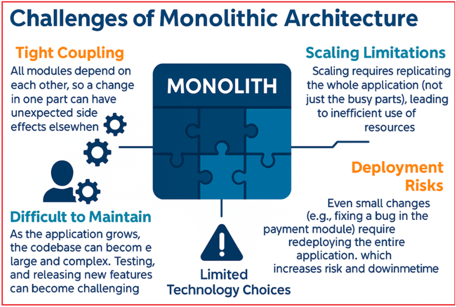
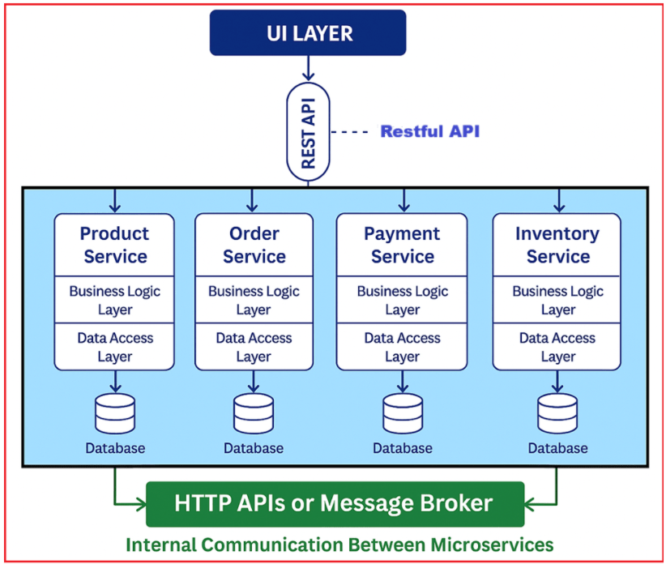
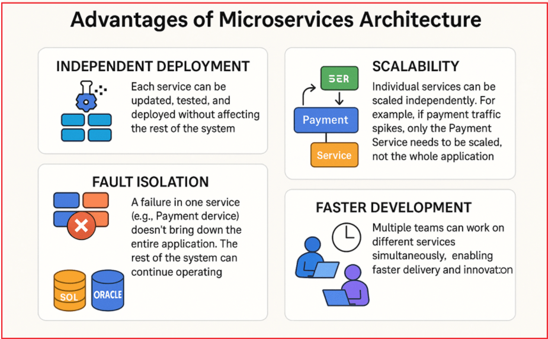
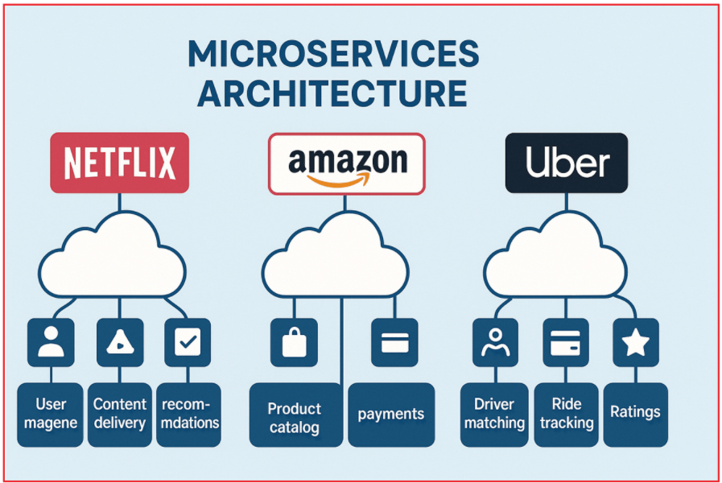
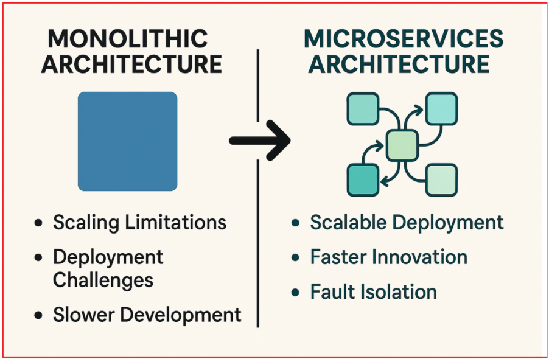

## **مقدمه‌ای بر معماری میکروسرویس‌ها**

ارائه خواهم ، توضیح مختصری از **معماری میکروسرویس‌ها** با مقایسه آن با **معماری یکپارچه** تجارت الکترونیک در این پست، با استفاده از یک مثال از صنعت داد . این پست موارد زیر را پوشش می‌دهد:

- چه برنامه‌هایی هستند و چگونه در لایه‌های مختلف ساختار یافته‌اند.
- انواع اپلیکیشن‌ها (وب، موبایل، دسکتاپ) و مثال‌های واقعی آنها.
- معماری یکپارچه، ساختار لایه‌ای، مزایا و چالش‌های آن، با یک مثال تجارت الکترونیک نشان داده شده است.
- معماری میکروسرویس‌ها، نحوه‌ی کارکرد، مزایا و چالش‌های آن، دوباره با سناریوهای عملی تجارت الکترونیک توضیح داده شده است.
- مطالعات موردی دنیای واقعی از شرکت‌هایی مانند نتفلیکس، آمازون و اوبر نشان می‌دهد که چرا سازمان‌ها از سیستم‌های یکپارچه به سمت میکروسرویس‌ها حرکت می‌کنند.
- راهنمایی در مورد انتخاب بین معماری‌های یکپارچه و میکروسرویس، بسته به تیم شما، پیچیدگی برنامه و نیازهای تجاری.

در پایان این پست، شما درک کاملی از زمان و دلیل پذیرش معماری میکروسرویس‌ها و همچنین نحوه قرارگیری آن در توسعه نرم‌افزار مدرن خواهید داشت.

##### **اپلیکیشن‌ها چه هستند؟**

یک برنامه کاربردی مجموعه‌ای هماهنگ از اجزای نرم‌افزاری، شامل برنامه‌ها، پایگاه‌های داده و سرویس‌ها است که با هم کار می‌کنند تا به کاربران در انجام وظایف خاص به صورت کارآمد و مؤثر کمک کنند. برای درک بهتر، لطفاً به تصویر زیر مراجعه کنید.

کاربردها از ابزارهای ساده‌ای مانند ماشین‌حساب‌ها تا پلتفرم‌های بسیار پیچیده، از جمله سیستم‌های بانکداری آنلاین و سایت‌های تجارت الکترونیک جهانی مانند آمازون، متغیر هستند. برخی از نمونه‌های رایج عبارتند از:

- **خرید آنلاین:** پلتفرم‌های تجارت الکترونیک مانند آمازون و فلیپکارت به کاربران این امکان را می‌دهند که محصولات را مرور، خریداری و پیگیری کنند.
- **ویدیوهای استریمینگ:** سرویس‌هایی مانند آمازون پرایم، نتفلیکس یا یوتیوب که به کاربران اجازه می‌دهند ویدیوها را به صورت درخواستی تماشا کنند.
- **بانکداری آنلاین:** اپلیکیشن‌های بانکداری و پورتال‌های وب که به کاربران امکان بررسی موجودی، انتقال وجه و پرداخت قبوض را می‌دهند.
- **تحویل غذا:** اپلیکیشن‌هایی مثل Swiggy یا Zomato برای سفارش غذا از رستوران‌های محلی.

برنامه‌ها با در نظر گرفتن نیازهای کاربر طراحی می‌شوند و هدف آنها ساده‌سازی عملیات پیچیده با ارائه رابط‌های کاربری آسان و خودکارسازی فرآیندها در پشت صحنه است.

##### **معماری برنامه کاربردی چیست؟**

معماری برنامه به طراحی ساختاری سطح بالای یک برنامه اشاره دارد. این معماری نحوه ارتباط و همکاری بخش‌های مختلف سیستم را برای انجام عملکردهای مورد نیاز تعریف می‌کند. به طور خاص، موارد زیر را تعریف می‌کند:

- نحوه ساختاردهی کدبیس،
- نحوه پیاده‌سازی قوانین و منطق کسب‌وکار،
- نحوه پردازش و جریان داده‌ها در سیستم،
- نحوه تعامل کاربران با برنامه.

اکثر برنامه‌های مدرن، صرف نظر از پیچیدگی آنها، در سه لایه اساسی سازماندهی شده‌اند. برای درک بهتر، لطفاً به تصویر زیر مراجعه کنید:

##### **درک هر لایه:**

- **لایه ارائه (رابط کاربری/UI):** این لایه نمایانگر هر چیزی است که کاربر مستقیماً با آن تعامل دارد، مانند صفحات وب در مرورگر، صفحات برنامه‌های تلفن همراه یا رابط‌های گرافیکی دسکتاپ. این لایه ورودی کاربر را مدیریت می‌کند و داده‌ها و بازخورد را به وضوح ارائه می‌دهد.
- **لایه منطق کسب و کار:** این لایه شامل قوانین اصلی کسب و کار، محاسبات و گردش‌های کاری است که نحوه مدیریت داده‌ها را تعریف می‌کنند. این لایه ورودی‌ها را از لایه ارائه پردازش می‌کند، قوانین کسب و کار را اعمال می‌کند و نتایج یا پاسخ‌ها را تعیین می‌کند. این لایه به عنوان پلی بین رابط کاربری و داده‌ها عمل می‌کند.
- **لایه دسترسی به داده‌ها:** این لایه، لایه پشتی است که مسئول ذخیره، بازیابی و مدیریت مداوم داده‌ها می‌باشد. این لایه شامل پایگاه‌های داده، سیستم‌های فایل یا سیستم‌های ذخیره‌سازی است که تضمین می‌کند داده‌ها در صورت نیاز، سازگار، ایمن و در دسترس باقی می‌مانند.

##### **سبک‌های معماری برنامه کاربردی**

اگرچه هر برنامه‌ای عموماً از این ساختار سه لایه به صورت مفهومی پیروی می‌کند، اما نحوه بسته‌بندی، استقرار و مدیریت این لایه‌ها می‌تواند به طور قابل توجهی متفاوت باشد. امروزه، دو سبک معماری غالب برای ساخت برنامه‌های مدرن وجود دارد:

- **معماری یکپارچه** .
- **معماری میکروسرویس‌ها**

##### **انواع کاربردها**

برنامه‌ها را می‌توان به‌طور کلی بر اساس پلتفرمی که روی آن اجرا می‌شوند و نحوه دسترسی کاربران به آنها طبقه‌بندی کرد. برای درک بهتر، لطفاً به تصویر زیر مراجعه کنید:

##### **درک هر نوع برنامه:**

- **برنامه‌های کاربردی وب:** این برنامه‌ها از طریق مرورگرهای وب از طریق اینترنت قابل دسترسی هستند. نمونه‌هایی از آن شامل سایت‌های خرید آنلاین، پورتال‌های بانکی و پلتفرم‌های رسانه‌های اجتماعی است. آنها نیازی به نصب ندارند و مستقل از پلتفرم هستند.
- **اپلیکیشن‌های موبایل:** اپلیکیشن‌هایی که به‌طور خاص برای گوشی‌های هوشمند و تبلت‌ها طراحی شده‌اند، می‌توانند بومی (برای یک پلتفرم خاص مانند اندروید یا iOS ساخته شده‌اند) یا چند پلتفرمی (برای اجرا روی چندین پلتفرم با استفاده از چارچوب‌هایی مانند Flutter یا React Native ساخته شده‌اند) باشند. از جمله این موارد می‌توان به واتس‌اپ، اوبر و اپلیکیشن‌های بانکداری موبایل اشاره کرد.
- **برنامه‌های دسکتاپ:** این برنامه‌ها مستقیماً روی رایانه‌های شخصی نصب می‌شوند. آن‌ها اغلب قابلیت‌های قوی و آفلاین ارائه می‌دهند. نمونه‌هایی از آن‌ها شامل مایکروسافت ورد، ادوبی فتوشاپ و Tally ERP هستند.

برخی از برنامه‌های پیچیده، مانند **پلتفرم‌های رسانه‌های اجتماعی** (مانند فیس‌بوک، توییتر)، **سرویس‌های پخش ویدئو** (مانند نتفلیکس، یوتیوب) یا **سیستم‌های برنامه‌ریزی منابع سازمانی (ERP)** ، برای پشتیبانی از میلیون‌ها کاربر و پردازش حجم عظیمی از داده‌ها به صورت بلادرنگ، به معماری‌های بسیار مقیاس‌پذیر و توزیع‌شده نیاز دارند.

#### **معماری یکپارچه:**

در این رویکرد سنتی، کل برنامه، شامل رابط کاربری (UI)، منطق کسب‌وکار و دسترسی به داده‌ها، به صورت یک واحد واحد بسته‌بندی و مستقر می‌شود. همه لایه‌ها و اجزا کاملاً یکپارچه هستند که می‌تواند در ابتدا توسعه را ساده کند، اما ممکن است با رشد برنامه، چالش‌هایی را در مقیاس‌بندی و نگهداری ایجاد کند.

##### **توضیح معماری یکپارچه با یک مثال تجارت الکترونیک**

یک برنامه تجارت الکترونیک (مانند یک آمازون یا فلیپکارت ساده‌شده) را در نظر بگیرید که با استفاده از معماری یکپارچه پیاده‌سازی شده است.

- این برنامه به صورت یک سیستم تک لایه ساخته شده است، که در آن همه ماژول‌ها، از جمله احراز هویت کاربر، کاتالوگ محصولات، سبد خرید، پردازش سفارش و پردازش پرداخت، در یک کدبیس واحد وجود دارند.
- همه این ماژول‌ها از یک پایگاه داده مشترک برای ذخیره و بازیابی داده‌ها استفاده می‌کنند و یک سیستم کاملاً یکپارچه را تشکیل می‌دهند.
- به دلیل یکپارچگی تنگاتنگ، تغییرات در یک جزء می‌تواند مستقیماً بر سایر اجزا تأثیر بگذارد.

همانطور که در نمودار زیر نشان داده شده است، در معماری یکپارچه، همه اجزا به شدت به هم متصل هستند و یک پایگاه داده واحد را به اشتراک می‌گذارند.

##### **درک لایه‌ها در معماری یکپارچه**

##### **لایه رابط کاربری (لایه ارائه):**

این بالاترین لایه‌ای است که کاربران از طریق صفحات وب، رابط‌های کاربری موبایل یا رابط‌های کاربری گرافیکی دسکتاپ با سیستم تعامل دارند.

- در یک سیستم یکپارچه، لایه رابط کاربری اغلب ارتباط تنگاتنگی با لایه‌های منطق تجاری و داده دارد و گاهی اوقات حتی توابع منطق تجاری را مستقیماً فراخوانی می‌کند.
- به دلیل این ادغام تنگاتنگ، تغییرات در قوانین کسب‌وکار یا مدیریت داده‌ها اغلب نیاز به به‌روزرسانی‌های متناظر در رابط کاربری دارد که منجر به وابستگی‌های تنگاتنگ می‌شود.

##### **لایه منطق تجاری:**

این لایه شامل قوانین و عملیات اصلی کسب و کار است که نحوه رفتار و پردازش داده‌ها در برنامه را تعریف می‌کند. برای مثال تجارت الکترونیک، این لایه ممکن است به صورت منطقی به ماژول‌هایی مانند موارد زیر تقسیم شود:

- **ماژول محصول:** افزودن، به‌روزرسانی، جستجو و نمایش محصولات را مدیریت می‌کند.
- **ماژول سفارش:** چرخه حیات سفارش را از سبد خرید تا پرداخت و ارسال مدیریت می‌کند.
- **ماژول پرداخت:** پردازش پرداخت، بازپرداخت‌ها و صدور صورتحساب را مدیریت می‌کند.
- **ماژول موجودی:** سطح موجودی محصول را پیگیری می‌کند و موجودی را در فروش یا مرجوعی‌ها به‌روزرسانی می‌کند.

در معماری‌های یکپارچه، این ماژول‌ها اغلب به شدت به هم وابسته هستند، به این معنی که تغییرات در یک ماژول (مثلاً منطق موجودی) می‌تواند بر سایر ماژول‌ها (مثلاً اجرای سفارش) تأثیر بگذارد و نگهداری سیستم را با رشد آن دشوارتر کند.

##### **لایه دسترسی به داده:**

این لایه مسئول تمام تعاملات با پایگاه داده، از جمله پرس و جو اطلاعات محصول، به‌روزرسانی وضعیت سفارش و ثبت پرداخت‌ها است.

- در یک سیستم یکپارچه، همه ماژول‌های تجاری اغلب به این لایه دسترسی دارند و منطق آن به شدت با بقیه برنامه یکپارچه شده است.
- برای مثال، وقتی سفارش جدیدی ثبت می‌شود، ماژول سفارش، ماژول پرداخت و ماژول موجودی، همگی از مجموعه‌ای یکسان از روال‌های دسترسی به پایگاه داده استفاده می‌کنند. این ادغام تنگاتنگ، خطر تأثیر تغییرات در طرحواره داده‌ها یا الگوهای دسترسی بر سایر بخش‌های سیستم را افزایش می‌دهد.

##### **پایگاه داده مشترک:**

این پایگاه داده واحد، تمام داده‌های مورد نیاز هر ماژول، از جمله کاربران، محصولات، سفارشات، پرداخت‌ها، موجودی و موارد دیگر را ذخیره می‌کند.

- تمام لایه‌ها (رابط کاربری، منطق کسب‌وکار، دسترسی به داده‌ها) به این پایگاه داده مرکزی متکی هستند.
- اگر نیاز به مقیاس‌بندی برنامه دارید، معمولاً باید کل نمونه برنامه، از جمله اتصال به همان پایگاه داده مشترک را تکرار کنید. این امر می‌تواند با افزایش بار کاربر، منجر به ایجاد گلوگاه شود.

##### **چالش‌های معماری یکپارچه**

برای درک چالش‌های مرتبط با معماری یکپارچه، لطفاً به تصویر زیر مراجعه کنید:

****

##### **درک هر محدودیت:**

- **اتصال محکم:** همه ماژول‌ها به یکدیگر وابسته هستند، بنابراین تغییر در یک قسمت می‌تواند عوارض جانبی غیرمنتظره‌ای در سایر قسمت‌ها داشته باشد.
- **محدودیت‌های مقیاس‌پذیری:** مقیاس‌پذیری نیاز به تکثیر کل برنامه (نه فقط بخش‌های شلوغ) دارد که منجر به استفاده ناکارآمد از منابع می‌شود.
- **ریسک‌های استقرار:** حتی تغییرات کوچک (مثلاً رفع یک اشکال در ماژول پرداخت) نیاز به استقرار مجدد کل برنامه دارد که ریسک و زمان از کارافتادگی را افزایش می‌دهد.
- **نگهداری دشوار:** با رشد برنامه، کدبیس می‌تواند بزرگ و پیچیده شود. جذب توسعه‌دهندگان جدید، آزمایش و انتشار ویژگی‌های جدید می‌تواند چالش‌برانگیز شود.
- **گزینه‌های محدود فناوری:** از آنجایی که همه اجزا به هم متصل هستند، اتخاذ یک فناوری یا زبان برنامه‌نویسی جدید برای یک بخش از سیستم دشوار است.

#### **معماری میکروسرویس‌ها:**

در این سبک معماری مدرن، برنامه به سرویس‌های کوچک‌تر و مستقل قابل استقرار تقسیم می‌شود که هر کدام مسئول بخش خاصی از عملکرد (مانند احراز هویت کاربر، پردازش پرداخت یا ارسال اعلان) هستند. این سرویس‌ها از طریق شبکه، معمولاً از طریق رابط‌های برنامه‌نویسی کاربردی (API)، با یکدیگر ارتباط برقرار می‌کنند. معماری‌های میکروسرویس از نظر طراحی پیچیده‌تر هستند، اما انعطاف‌پذیری، مقیاس‌پذیری و سهولت نگهداری بیشتری را ارائه می‌دهند.

##### **معماری میکروسرویس‌ها با مثال تجارت الکترونیک:**

یک پلتفرم تجارت الکترونیک (مانند آمازون یا فلیپکارت) را تصور کنید که با استفاده از معماری میکروسرویس‌ها ساخته شده است. به جای توسعه کل سیستم به عنوان یک برنامه واحد و یکپارچه، این پلتفرم به چندین سرویس مستقل تقسیم می‌شود که هر کدام بر یک عملکرد تجاری خاص متمرکز هستند. همانطور که در نمودار زیر نشان داده شده است، با معماری میکروسرویس‌ها، همه اجزا از هم جدا می‌شوند و هر جزء کدبیس و پایگاه داده مخصوص به خود را دارد.

##### **لایه رابط کاربری (لایه ارائه)**

این بالاترین لایه‌ای است که کاربران از طریق مرورگرهای وب، برنامه‌های تلفن همراه یا سایر رابط‌های کاربری با برنامه تعامل دارند.

- در معماری میکروسرویس‌ها، رابط کاربری مستقیماً با منطق کسب‌وکار در یک کدبیس واحد تعامل ندارد. در عوض، از طریق APIها با میکروسرویس‌های مختلف (مانند محصول، سفارش، پرداخت و موجودی) ارتباط برقرار می‌کند.
- این به رابط کاربری اجازه می‌دهد تا عملکردهای خاص (مثلاً جزئیات محصول، پردازش سفارش) را مستقیماً از میکروسرویس مربوطه و بدون نیاز به گذر از یک بک‌اند واحد و یکپارچه درخواست کند.

##### **میکروسرویس‌ها (خدمات محصول، سفارش، پرداخت، موجودی):**

هر میکروسرویس یک برنامه مستقل و خودکفا با کدبیس، منطق تجاری و پایگاه داده مخصوص به خود است که مسئول یک عملکرد تجاری متمایز است:

- **خدمات محصول:** تمام داده‌های مربوط به محصول، مانند افزودن، به‌روزرسانی و نمایش فهرست محصولات، دسته‌بندی‌ها و جزئیات محصول را مدیریت می‌کند.
- **سرویس سفارش:** کل چرخه حیات سفارش، ایجاد سفارش، به‌روزرسانی وضعیت سفارش و مدیریت تاریخچه سفارش‌ها را مدیریت می‌کند.
- **خدمات پرداخت:** پردازش پرداخت‌ها، ادغام با درگاه‌های پرداخت، مدیریت صورتحساب‌ها و رسیدگی به بازپرداخت‌ها.
- **سرویس موجودی:** موجودی محصول را پیگیری می‌کند، سطوح موجودی را مدیریت می‌کند و در دسترس بودن محصول را در سراسر پلتفرم تضمین می‌کند.

هر میکروسرویس مستقل است. تیم‌ها می‌توانند آنها را به طور مستقل توسعه، استقرار، مقیاس‌بندی و نگهداری کنند. هر سرویس از دو بخش کلیدی تشکیل شده است:

- **لایه منطق تجاری:** قوانین و عملیات خاص برای آن سرویس (مثلاً نحوه به‌روزرسانی موجودی هنگام ثبت سفارش).
- **لایه دسترسی به داده:** منطقی برای تعامل با پایگاه داده خود آن سرویس.

هر میکروسرویس پایگاه داده ایزوله شده خود را دارد. پایگاه داده سرویس محصول، داده‌های محصول، داده‌های سفارش را توسط پایگاه داده سرویس سفارش و غیره مدیریت می‌کند. این ایزوله‌سازی از عوارض جانبی ناخواسته و اتصال محکمی که در طراحی‌های یکپارچه دیده می‌شود، جلوگیری می‌کند.

##### **ارتباط بین سرویس‌ها (HTTP API و Message Broker):**

برای هماهنگی عملیات، میکروسرویس‌ها از طریق موارد زیر با یکدیگر ارتباط برقرار می‌کنند:

###### **رابط‌های برنامه‌نویسی HTTP:**

- اکثر سرویس‌ها APIهای RESTful را در معرض نمایش قرار می‌دهند و به سایر سرویس‌ها یا رابط کاربری اجازه می‌دهند تا درخواست‌هایی را برای عملیات خاص (مانند دریافت اطلاعات محصول، ثبت سفارش یا پردازش پرداخت) ارسال کنند.

###### **کارگزار پیام:**

- برای ارتباط داخلی بین میکروسرویس‌ها، از واسطه‌های پیام (مثلاً RabbitMQ، Kafka) استفاده می‌کند. این برای لایه رابط کاربری نیست.
- برای مثال، وقتی سفارشی ثبت می‌شود، سرویس سفارش می‌تواند رویداد OrderCreated را از طریق کارگزار ارسال کند. سرویس موجودی این رویداد را دریافت کرده و سطح موجودی را به‌روزرسانی می‌کند؛ سرویس پرداخت می‌تواند برای شروع پردازش پرداخت مطلع شود.

این امر سرویس‌ها را از هم جدا می‌کند، قابلیت اطمینان را افزایش می‌دهد و از گردش‌های کاری پیچیده تجاری بدون فراخوانی مستقیم API برای هر تراکنش پشتیبانی می‌کند.

##### **مزایای معماری میکروسرویس‌ها**

برای درک مزایای مرتبط با معماری میکروسرویس‌ها، لطفاً به تصویر زیر مراجعه کنید:

****

##### **درک هر مزیت**

- **استقرار مستقل:** هر سرویس می‌تواند بدون تأثیر بر بقیه سیستم، به‌روزرسانی، آزمایش و مستقر شود.
- **مقیاس‌پذیری:** سرویس‌های منفرد را می‌توان به طور مستقل مقیاس‌بندی کرد. به عنوان مثال، اگر ترافیک پرداخت افزایش یابد، فقط سرویس پرداخت نیاز به مقیاس‌بندی دارد، نه کل برنامه.
- **جداسازی خطا:** خرابی در یک سرویس (مثلاً سرویس پرداخت) کل برنامه را از کار نمی‌اندازد. بقیه سیستم می‌تواند به کار خود ادامه دهد.
- **تنوع فناوری:** تیم‌ها می‌توانند از مناسب‌ترین فناوری، زبان یا پایگاه داده برای هر میکروسرویس استفاده کنند. یک سرویس می‌تواند از اوراکل استفاده کند در حالی که سرویس دیگر می‌تواند از SQL Server استفاده کند.
- **توسعه سریع‌تر:** چندین تیم می‌توانند به طور همزمان روی سرویس‌های مختلف کار کنند و این امر باعث تحویل سریع‌تر و نوآوری می‌شود.

##### **نمونه‌های واقعی از معماری میکروسرویس‌ها**

در ادامه برخی از برنامه‌های بلادرنگ که از معماری میکروسرویس استفاده می‌کنند، آورده شده است.

- **نتفلیکس:** نتفلیکس که در ابتدا به عنوان یک سیستم یکپارچه ساخته شده بود، برای برآورده کردن نیازهای مقیاس‌پذیری جهانی به میکروسرویس‌ها روی آورد. اکنون، نتفلیکس صدها میکروسرویس را در فضای ابری اجرا می‌کند تا مدیریت کاربر، تحویل محتوا، توصیه‌ها و پخش جریانی را مدیریت کند.
- **آمازون:** آمازون برای پشتیبانی از پلتفرم گسترده و رو به رشد خود، از معماری یکپارچه به میکروسرویس‌ها روی آورد. این تغییر به آمازون این امکان را داد که سرویس‌های مجزا (مانند کاتالوگ محصولات یا پرداخت‌ها) را به طور مستقل مقیاس‌بندی کند و ویژگی‌های جدید را سریع‌تر ارائه دهد.
- **اوبر:** برای مدیریت عملیات پیچیده‌ای مانند تطبیق راننده، ردیابی سفر، پرداخت‌ها و رتبه‌بندی‌ها، اوبر از میکروسرویس‌ها استفاده کرد. این رویکرد به اوبر اجازه داد تا بخش‌های خاصی از سیستم را مقیاس‌بندی کند و به سرعت با نیازهای بازار سازگار شود.

برای درک واضح‌تر، لطفاً به تصویر زیر مراجعه کنید.

****

##### **چرا شرکت‌ها از معماری یکپارچه به میکروسرویس‌ها روی می‌آورند؟**

برای درک بهتر، لطفاً به تصویر زیر مراجعه کنید.

****

با رشد شرکت‌ها، برنامه‌های کاربردی آنها پیچیده‌تر شده و پایگاه کاربران آنها در سطح جهانی گسترش می‌یابد. معماری‌های یکپارچه اغلب با موارد زیر دست و پنجه نرم می‌کنند:

- **محدودیت‌های مقیاس‌پذیری:** کل برنامه باید مقیاس‌پذیر باشد، حتی اگر فقط یک بخش به منابع بیشتری نیاز داشته باشد.
- **چالش‌های استقرار:** استقرار ویژگی‌های جدید یا رفع اشکالات، ریسک تأثیرگذاری بر بخش‌های نامرتبط برنامه را به همراه دارد.
- **توسعه کندتر:** نگهداری پایگاه‌های کد بزرگ دشوارتر می‌شود و بهره‌وری تیم را کاهش می‌دهد.

میکروسرویس‌ها با فعال کردن موارد زیر به غلبه بر این چالش‌ها کمک می‌کنند:

- **استقرار مقیاس‌پذیر:** سرویس‌ها می‌توانند به‌طور مستقل مستقر شوند.
- **نوآوری سریع‌تر:** تیم‌های کوچک‌تر و متمرکز می‌توانند به صورت مستقل کار کنند.
- **جداسازی خطا:** خطا در یک سرویس مهار می‌شود و تأثیر آن در کل سیستم به حداقل می‌رسد.

##### **انتخاب بین معماری یکپارچه و میکروسرویس‌ها:**

تصمیم‌گیری در مورد استفاده از معماری یکپارچه یا میکروسرویس به چندین عامل کلیدی بستگی دارد، از جمله اندازه و پیچیدگی برنامه، الزامات تجاری و قابلیت‌های توسعه سازمان. معماری یکپارچه برای برنامه‌های کوچک و ساده و تیم‌های کوچک به خوبی کار می‌کند، در حالی که میکروسرویس‌ها برای برنامه‌های بزرگ و پیچیده‌ای که نیاز به مقیاس‌پذیری و انعطاف‌پذیری دارند، مناسب‌تر هستند.

معماری میکروسرویس‌ها با تقسیم عملکرد به سرویس‌های کوچک‌تر و مستقل، روشی مدرن و انعطاف‌پذیر برای ساخت برنامه‌های پیچیده ارائه می‌دهد. این رویکرد، مقیاس‌پذیری و جداسازی خطا را افزایش می‌دهد و تیم‌ها را قادر می‌سازد تا ویژگی‌ها را سریع‌تر توسعه داده و مستقر کنند.