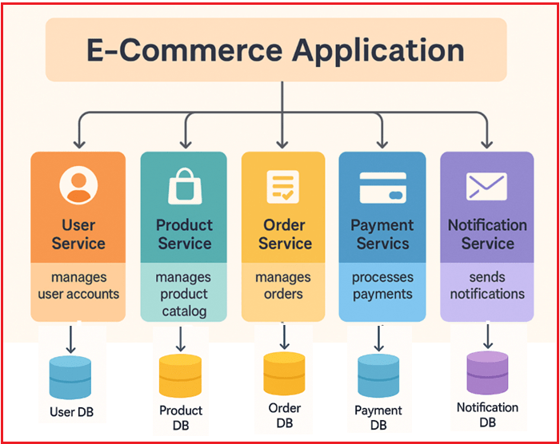
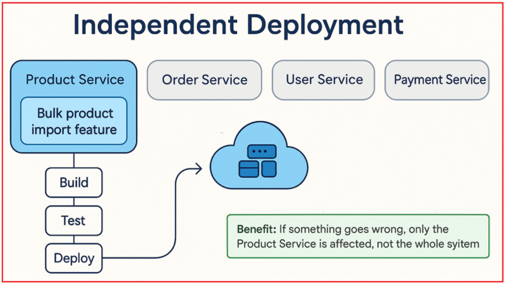
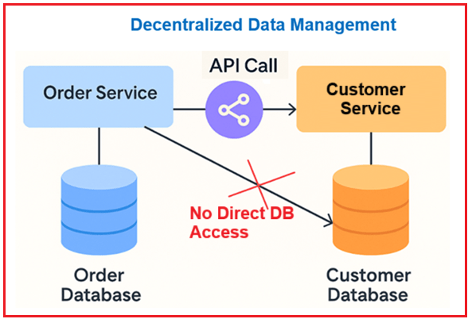
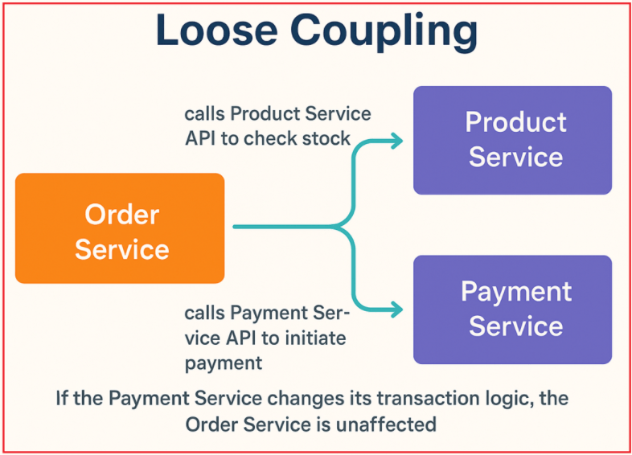
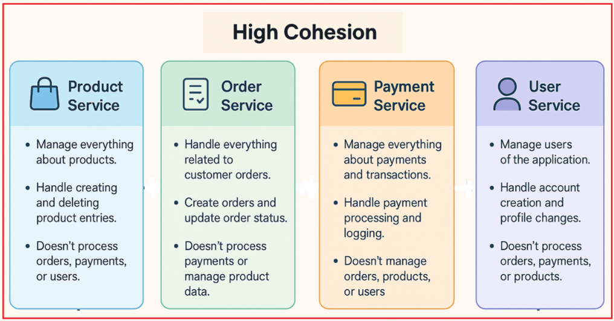
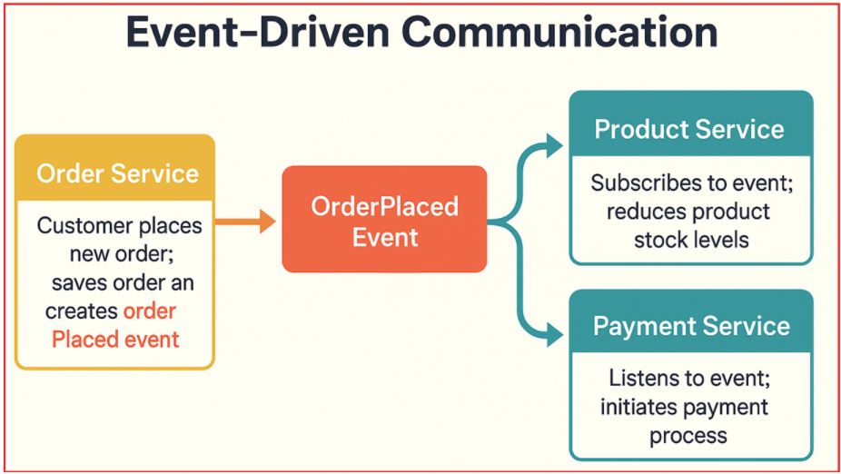
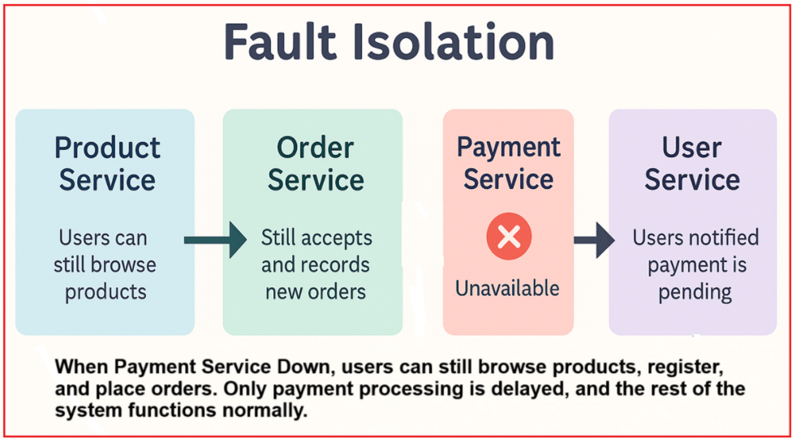
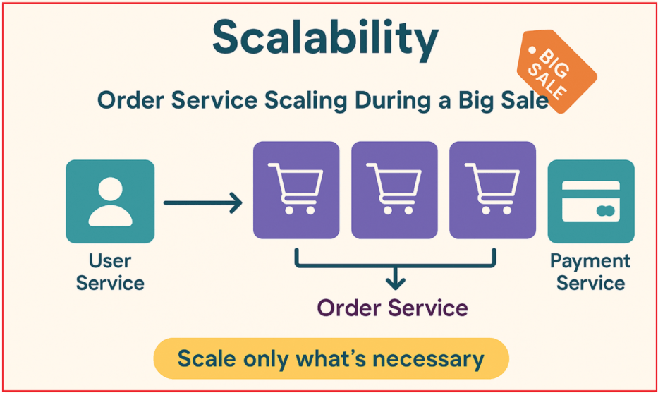
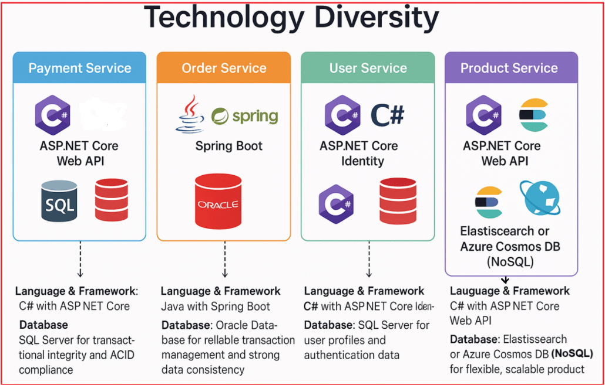

## **اصول طراحی میکروسرویس‌ها**

در این مقاله، اصول اصلی طراحی میکروسرویس‌ها، از جمله اصل مسئولیت واحد، استقرار مستقل، مدیریت داده‌های غیرمتمرکز، اتصال سست، انسجام بالا، ارتباط مبتنی بر رویداد، جداسازی خطا، مقیاس‌پذیری و تنوع فناوری را با مثال‌های عملی مبتنی بر یک برنامه تجارت الکترونیک در دنیای واقعی بررسی خواهیم کرد.

درک و به‌کارگیری این اصول تضمین می‌کند که میکروسرویس‌ها قابل نگهداری، انعطاف‌پذیر و آماده برای پشتیبانی از رشد آینده باقی بمانند. تمرکز بر این است که اطمینان حاصل شود هر سرویس مسئولیت مشخصی دارد، می‌تواند به‌طور مستقل مستقر شود، داده‌های خود را مدیریت کند و از طریق ارتباطات آزادانه و رویدادمحور با دیگران تعامل داشته باشد.

##### **مروری بر برنامه‌های تجارت الکترونیک و میکروسرویس‌ها**

یک پلتفرم تجارت الکترونیک مدرن را تصور کنید که برای مدیریت هزاران کاربر روزانه، یک کاتالوگ غنی از محصولات، پرداخت‌های امن و پردازش سفارش در لحظه ساخته شده است. برای دستیابی به انعطاف‌پذیری، مقیاس‌پذیری و تکامل سریع، این پلتفرم به صورت مجموعه‌ای از میکروسرویس‌های تخصصی معماری شده است. هر سرویس مسئول یک عملکرد تجاری واحد است، از طریق رابط‌های تعریف‌شده ارتباط برقرار می‌کند و داده‌های خود را مدیریت می‌کند. برای درک بهتر، لطفاً به نمودار زیر نگاهی بیندازید:

##### **خدمات کاربر**

مدیریت ثبت نام کاربر، احراز هویت، مدیریت پروفایل و امنیت را بر عهده دارد.

- **عملکرد:** ثبت نام کاربر، ورود به سیستم، به‌روزرسانی پروفایل، بازنشانی رمز عبور و بهبودهای امنیتی مانند احراز هویت دو مرحله‌ای را مدیریت می‌کند.
- **مالکیت داده‌ها:** ذخیره داده‌های کاربر در پایگاه داده خود، مانند SQL Server.
- **تعامل:** رابط‌های برنامه‌نویسی کاربردی (API) را که سایر سرویس‌ها (مانند سفارش یا پرداخت) برای بازیابی اطلاعات مرتبط با کاربر استفاده می‌کنند، در معرض نمایش قرار می‌دهد.

##### **خدمات محصول**

کاتالوگ محصولات، شامل جزئیات محصول، موجودی و دسته‌بندی را مدیریت می‌کند.

- **عملکرد:** امکان ایجاد، به‌روزرسانی و حذف محصولات، مدیریت سطح موجودی و پشتیبانی از قابلیت‌های جستجو و فیلترینگ را فراهم می‌کند.
- **مالکیت داده‌ها:** دارای یک پایگاه داده اختصاصی بهینه شده برای داده‌های محصول، مانند NoSQL برای انعطاف‌پذیری و عملکرد است.
- **تعامل:** رابط‌های برنامه‌نویسی کاربردی (API) را برای پرس‌وجوی اطلاعات محصول مورد استفاده توسط سرویس سفارش یا برنامه‌های کلاینت کاربر-محور فراهم می‌کند.

##### **خدمات سفارش**

چرخه عمر کامل سفارش، از ایجاد تا ارسال را مدیریت می‌کند.

- **عملکرد:** ثبت سفارش، پیگیری وضعیت (در انتظار، بسته‌بندی شده، ارسال شده، تحویل داده شده) و اعتبارسنجی سفارش را مدیریت می‌کند.
- **مالکیت داده‌ها:** پایگاه داده رابطه‌ای خود را برای ذخیره سوابق سفارش، وضعیت‌ها و فراداده‌های مرتبط نگهداری می‌کند.
- **تعامل:** با سرویس کاربر برای دریافت اطلاعات مشتری، با سرویس محصول برای تأیید موجودی و قیمت، و با سرویس پرداخت برای شروع پردازش پرداخت تماس می‌گیرد.

##### **خدمات پرداخت**

مدیریت پردازش پرداخت، اعتبارسنجی تراکنش، بازپرداخت‌ها و پیگیری وضعیت پرداخت.

- **عملکرد:** از چندین درگاه پرداخت پشتیبانی می‌کند، تراکنش‌های امن را مدیریت می‌کند و بازپرداخت‌ها را پردازش می‌کند.
- **مالکیت داده‌ها:** یک پایگاه داده امن و تراکنشی برای ثبت تاریخچه و وضعیت پرداخت‌ها نگهداری می‌کند.
- **تعامل:** APIها را برای شروع پرداخت از سرویس سفارش در معرض نمایش قرار می‌دهد و رویدادهای موفقیت یا شکست پرداخت را که سایر سرویس‌ها از آنها استفاده می‌کنند، منتشر می‌کند.

##### **سرویس اعلان**

مدیریت تمام اعلان‌ها و پیام‌های سیستم (ایمیل، پیامک، اعلان‌های فوری).

- **عملکرد:** به رویدادهای دامنه مانند UserRegistered، OrderPlaced یا PaymentSuccessful گوش می‌دهد و پیام‌های مناسب را به صورت غیرهمزمان ارسال می‌کند.
- **مالکیت داده‌ها:** قالب‌ها و گزارش‌های اعلان را در پایگاه داده خود مدیریت می‌کند.
- **تعامل:** از جریان اصلی جدا شده است؛ به رویدادهای ایجاد شده توسط سایر سرویس‌ها واکنش نشان می‌دهد.

حال، بیایید با بررسی مثال تجارت الکترونیک فوق با چندین میکروسرویس، اصول طراحی هسته میکروسرویس‌ها را درک کنیم.

##### **اصل مسئولیت واحد (SRP)**

SRP به این معنی است که هر میکروسرویس باید فقط یک کار یا مسئولیت واضح و مشخص داشته باشد.

- باید تمام منطق، داده‌ها و رفتارهای مربوط به آن کار را در اختیار داشته باشد.
- نباید وظایف نامرتبط یا چندین عملکرد تجاری را در یک سرویس واحد ترکیب کند.

برای درک بهتر، لطفاً به تصویر زیر نگاهی بیندازید:

")

##### **مثال‌ها:**

- خدمات کاربران فقط بر کاربران تمرکز دارد. سفارشات یا پرداخت‌ها را مدیریت نمی‌کند.
- خدمات محصول فقط بر روی محصولات تمرکز دارد. سفارشات را پردازش یا پرداخت‌ها را مدیریت نمی‌کند.
- سرویس سفارش، کل چرخه حیات سفارش را مدیریت می‌کند، اما احراز هویت کاربر یا پردازش پرداخت را انجام نمی‌دهد.
- سرویس پرداخت صرفاً با پرداخت‌ها سروکار دارد. جزئیات سفارش یا پروفایل کاربران را مدیریت نمی‌کند.

##### **اگر SRP نقض شود چه؟**

تصور کنید که سرویس سفارش، ثبت نام کاربر و پردازش پرداخت را نیز مدیریت کند:

- سرویس پیچیده و نگهداری آن دشوار می‌شود و تغییرات در یک بخش (مانند ورود کاربر) ممکن است پردازش سفارش را مختل کند.
- مقیاس‌بندی سرویس ناکارآمد خواهد بود زیرا عملکردهای مختلف کسب‌وکار، بار و نیازهای منابع متفاوتی دارند.
- چرخه‌های استقرار کندتر خواهند بود زیرا تغییرات نامرتبط نیاز به استقرار مجدد کل سرویس دارند.

##### **استقرار مستقل**

استقرار مستقل به این معنی است که هر میکروسرویس می‌تواند:

- توسعه یافته،
- آزمایش شده،
- مستقر شده، و
- به‌روزرسانی‌شده

جدا از بقیه. این یعنی شما می‌توانید بدون نیاز به استقرار مجدد یا تغییر هیچ سرویس دیگری، در یک سرویس تغییرات ایجاد کنید یا اشکالات را برطرف کنید. نمودار زیر این مفهوم را به وضوح نشان می‌دهد.

##### **خدمات محصول**

فرض کنید یک ویژگی جدید، یعنی وارد کردن انبوه محصولات، به سرویس محصول اضافه می‌کنید (که به مدیران اجازه می‌دهد فایل CSV محصولات جدید را آپلود کنند). در اینجا، استقرار مستقل به این معنی است:

- شما می‌توانید این ویژگی جدید را فقط در سرویس محصول بسازید، آزمایش کنید و مستقر کنید.
- نیازی به لمس یا تغییر تنظیمات سفارش، کاربر یا سرویس‌های پرداخت نیست.

**مزیت:** اگر مشکلی پیش بیاید، فقط سرویس محصول تحت تأثیر قرار می‌گیرد، نه کل سیستم.

##### **خدمات سفارش**

فرض کنید شما یک اشکال در نحوه ردیابی سفارشات را برطرف می‌کنید (مثلاً اصلاح به‌روزرسانی‌های وضعیت سفارش). در اینجا، استقرار مستقل به این معنی است:

- فقط سرویس سفارش به‌روزرسانی و مجدداً مستقر می‌شود.
- سرویس‌های پرداخت، کاربر و محصول همچنان به کار خود ادامه می‌دهند.

**مزایا:** رفع سریع اشکالات، عدم خرابی سیستم و عدم نیاز به هماهنگی بین تیمی.

##### **خدمات پرداخت**

فرض کنید یک روش پرداخت جدید اضافه می‌کنید (مثلاً پرداخت‌های UPI را فعال می‌کنید). در اینجا، استقرار مستقل به این معنی است:

- تیم خدمات پرداخت، به‌روزرسانی را توسعه، آزمایش و مستقر می‌کند.
- تا زمانی که قرارداد API مورد استفاده سایر سرویس‌ها تغییر نکند، هیچ چیز دیگری تحت تأثیر قرار نمی‌گیرد.

**مزیت:** کاربران می‌توانند بلافاصله، بدون تأخیر و بدون انتظار برای تیم‌های دیگر به گزینه پرداخت جدید دسترسی پیدا کنند.

##### **خدمات کاربر**

فرض کنید با اضافه کردن احراز هویت دو مرحله‌ای، امنیت کاربر را بهبود می‌بخشید. در اینجا، استقرار مستقل به معنای:

- شما می‌توانید جریان ورود جدید را فقط به سرویس کاربر اعمال کنید.
- خدمات سفارش، پرداخت و محصول دست نخورده و بدون تغییر باقی می‌مانند.

**مزیت:** بهبودهای امنیتی به سرعت و بدون توقف یا هماهنگی با تیم‌های غیرمرتبط اعمال می‌شوند.

##### **مدیریت داده‌های غیرمتمرکز**

در معماری میکروسرویس‌ها، مدیریت داده‌های غیرمتمرکز به معنای:

- هر میکروسرویس، مالک و مدیر مخزن داده خصوصی خود است (که می‌تواند یک پایگاه داده، حافظه پنهان یا ذخیره‌سازی فایل باشد).
- هیچ سرویسی مستقیماً داده‌ها را از پایگاه داده سرویس دیگر نمی‌خواند یا نمی‌نویسد.
- وقتی یک سرویس به داده‌های متعلق به سرویس دیگری نیاز دارد، فقط از طریق APIهای تعریف‌شده یا کارگزاران پیام به آن دسترسی پیدا می‌کند.

این امر مالکیت شفاف داده‌ها را تضمین می‌کند، وابستگی‌ها را کاهش می‌دهد و از اتصال محکم از طریق پایگاه‌های داده مشترک جلوگیری می‌کند. بیایید این را با یک نمودار ساده تجسم کنیم.

****

##### **خدمات سفارش**

سرویس سفارش، پایگاه داده سفارش‌های خود (مثلاً SQL) را نگهداری می‌کند و جزئیات سفارش مانند شناسه سفارش، شناسه محصول، شناسه کاربر، وضعیت سفارش و مهرهای زمانی را ذخیره می‌کند. این سرویس همه چیز مربوط به خود سفارش، از جمله زمان ثبت آن، محصولات موجود در سفارش و وضعیت فعلی آن (در انتظار، ارسال شده، تحویل داده شده) را ذخیره می‌کند.

- **دسترسی به اطلاعات کاربر** **:** وقتی سرویس سفارش به نام یا آدرس مشتری نیاز دارد، رابط برنامه‌نویسی کاربردی سرویس کاربر را برای بازیابی آن اطلاعات فراخوانی می‌کند؛ مستقیماً از پایگاه داده سرویس کاربر پرس‌وجو نمی‌کند.
- **دسترسی به اطلاعات محصول** **:** برای تأیید قیمت یا موجودی محصول، سرویس سفارش، API سرویس محصول را فراخوانی می‌کند، نه پایگاه داده محصول را.

##### **خدمات کاربر**

سرویس کاربر، پایگاه داده کاربری مخصوص به خود (مثلاً NoSQL یا رابطه‌ای) را دارد که اعتبارنامه‌ها، پروفایل‌ها، آدرس‌ها و تنظیمات کاربر را ذخیره می‌کند. این سرویس، ثبت نام، احراز هویت و به‌روزرسانی‌های پروفایل کاربر را مدیریت می‌کند.

- این APIهایی را در معرض نمایش قرار می‌دهد که به سایر سرویس‌ها (مانند سفارش یا پرداخت) اجازه می‌دهد تا جزئیات کاربر را به صورت ایمن درخواست کنند.
- هیچ سرویس دیگری نمی‌تواند مستقیماً داده‌ها را در این پایگاه داده بخواند یا بنویسد؛ آنها باید از طریق APIهای سرویس کاربر این کار را انجام دهند.

##### **خدمات محصول**

سرویس محصول، پایگاه داده محصول مخصوص به خود را دارد (مثلاً یک پایگاه داده NoSQL که برای داده‌های کاتالوگ بهینه شده است) که شامل توضیحات محصول، سطح موجودی، دسته‌بندی‌ها و قیمت‌ها است. این پایگاه داده، اضافه و حذف محصولات و همچنین به‌روزرسانی تعداد موجودی را مدیریت می‌کند.

- اطلاعات محصول را بنا به درخواست از طریق APIها در معرض نمایش قرار می‌دهد.
- سرویس‌های دیگر (مانند سرویس سفارش) هرگز مستقیماً به این پایگاه داده دسترسی ندارند؛ در عوض، آنها به API متکی هستند.

##### **خدمات پرداخت**

سرویس پرداخت، پایگاه داده پرداخت خود را نگهداری می‌کند که تراکنش‌های پرداخت، وضعیت‌ها و رسیدها را ذخیره می‌کند. این سرویس، پرداخت‌ها را پردازش، بازپرداخت‌ها را مدیریت و تاریخچه تراکنش‌ها را ثبت می‌کند.

- وقتی پرداخت با موفقیت انجام می‌شود، یک رویداد ایجاد می‌کند یا پیامی با عنوان «پرداخت انجام شد» برای سرویس سفارش ارسال می‌کند تا آن را مصرف کند.
- این سرویس مستقیماً پایگاه داده سفارشات یا اطلاعات کاربر را به‌روزرسانی نمی‌کند؛ فقط نتایج پرداخت را از طریق APIها/رویدادها به اشتراک می‌گذارد.

##### **کوپلینگ شل**

اتصال سست به این معنی است که هر میکروسرویس می‌تواند به طور مستقل و با حداقل دانش از عملکرد داخلی سایر سرویس‌ها کار کند. آنها:

- فقط از طریق رابط‌های کاربری مشخص مانند APIها یا Message Brokerها ارتباط برقرار کنید (نه با اشتراک‌گذاری پایگاه‌های داده یا کد).
- اطمینان حاصل کنید که تغییرات در یک سرویس، تغییرات را در سایر سرویس‌ها تحمیل نکند.
- می‌تواند به طور مستقل و بدون ایجاد اختلال در کل سیستم، توسعه داده شود، مستقر شود یا مقیاس‌پذیر شود.

برای درک بهتر، لطفاً به تصویر زیر مراجعه کنید.

##### **مثال ۱: سفارش خدمات**

سرویس سفارش، ثبت، به‌روزرسانی و پیگیری سفارش‌ها را انجام می‌دهد. بیایید ببینیم که چگونه با سایر سرویس‌ها تعامل دارد:

- وقتی سفارش جدیدی ثبت می‌شود، API سرویس محصول را فراخوانی می‌کند تا بررسی کند که آیا اقلام موجود هستند یا خیر.
- سپس API سرویس پرداخت را برای شروع پرداخت فراخوانی می‌کند.
- به طور مستقیم به پایگاه‌های داده سرویس‌های دیگر یا منطق داخلی دسترسی ندارد.

**اتصال سست در عمل:** اگر سرویس پرداخت نحوه پردازش تراکنش‌ها را تغییر دهد (مثلاً دروازه‌های پرداخت جدیدی اضافه کند)، تا زمانی که قرارداد API آن ثابت بماند، سرویس سفارش نیازی به تغییر ندارد.

##### **مثال ۲: سرویس پرداخت**

پرداخت‌ها و بازپرداخت‌ها را پردازش می‌کند. بیایید ببینیم چگونه با دیگران تعامل دارد:

- این یک API به نام POST /payments را به همراه جزئیات سفارش و کاربر مورد نیاز ارائه می‌دهد.
- لازم نیست بداند سفارش‌ها چگونه ایجاد می‌شوند یا محصولات چگونه مدیریت می‌شوند؛ فقط کافی است درخواست پرداخت از طریق API ارسال شود.

**اتصال سست در عمل:** اگر سرویس پرداخت منطق داخلی خود را به‌روزرسانی کند (مثلاً بررسی‌های کلاهبرداری را بهبود بخشد)، سرویس سفارش و سرویس کاربر بدون تغییر باقی می‌مانند.

##### **مثال ۳: خدمات محصول**

اطلاعات محصول را مدیریت می‌کند (اضافه کردن، حذف کردن، به‌روزرسانی محصولات). بیایید ببینیم که چگونه با دیگران تعامل دارد:

- یک API برای بازیابی جزئیات محصول و اطلاعات موجودی ارائه می‌دهد.
- سرویس‌های دیگر (مانند سرویس سفارش) با استفاده از این API درخواست داده می‌کنند.
- اگر سرویس محصول، پایگاه داده یا پشته فنی خود را تغییر دهد، تا زمانی که قرارداد API ثابت بماند، سایر سرویس‌ها بدون تغییر به کار خود ادامه خواهند داد.

**اتصال سست در عمل:** سرویس محصول می‌تواند از MySQL به MongoDB تغییر کند، اما سایر سرویس‌ها اهمیتی نمی‌دهند؛ آنها از API استفاده می‌کنند.

##### **مثال ۴: سرویس کاربر**

ثبت نام، احراز هویت و پروفایل کاربران را مدیریت می‌کند. بیایید ببینیم که چگونه با دیگران تعامل دارد:

- APIهایی را برای ایجاد حساب کاربری و دریافت جزئیات کاربر ارائه می‌دهد.
- سایر سرویس‌ها (سفارش، پرداخت) کاربران را با شناسه یا توکن آنها ارجاع می‌دهند، اما مستقیماً داده‌های کاربر را مدیریت نمی‌کنند.

**اتصال سست در عمل:** اگر سرویس کاربری، احراز هویت دو مرحله‌ای را اضافه کند، سایر سرویس‌ها همچنان می‌توانند جزئیات کاربر را از طریق همان API دریافت کنند.

##### **انسجام بالا**

انسجام بالا به این معنی است که توابع (اعمال) و داده‌های درون یک میکروسرویس ارتباط نزدیکی با هم دارند و بر روی یک مسئولیت یا حوزه دامنه واحد متمرکز هستند. به عبارت دیگر:

- همه چیز در داخل سرویس به طور منطقی به هم مربوط است.
- این سرویس یک کار مشخص انجام می‌دهد و تمام بخش‌های آن از آن کار پشتیبانی می‌کنند.
- از ترکیب وظایف یا داده‌های نامرتبط در یک سرویس واحد جلوگیری می‌کند.

نمودار زیر این مفهوم را به وضوح نشان می‌دهد.

##### **خدمات محصول:**

همه چیز را در مورد محصولات مدیریت کنید.

- وقتی یک مدیر می‌خواهد یک تلفن یا پیراهن جدید به فروشگاه آنلاین اضافه کند، این میکروسرویس ایجاد ورودی محصول به همراه جزئیات آن (نام، قیمت، توضیحات، دسته‌بندی و غیره) را مدیریت می‌کند.
- اگر محصولی برای همیشه متوقف شود یا موجود نباشد، این سرویس آن را حذف یا غیرفعال می‌کند.
- این سیستم ثبت نام کاربر، پردازش پرداخت یا پیگیری سفارش را انجام نمی‌دهد.

##### **خدمات سفارش:**

انجام کلیه امور مربوط به سفارشات مشتریان.

- وقتی مشتری روی «همین حالا بخر» کلیک می‌کند، این سرویس یک رکورد سفارش ایجاد می‌کند، اقلام را رزرو می‌کند و آنها را به عنوان سفارش داده شده علامت‌گذاری می‌کند.
- همزمان با طی مراحل سفارش (قرار داده شده → بسته بندی شده → ارسال شده → تحویل داده شده)، این سرویس وضعیت را به‌روزرسانی می‌کند.
- این سرویس پرداخت‌ها، داده‌های محصول یا پروفایل‌های کاربران را پردازش نمی‌کند.

##### **خدمات پرداخت:**

مدیریت همه چیز در مورد پرداخت‌ها و تراکنش‌ها.

- وقتی مشتری هزینه سفارش خود را پرداخت می‌کند، سرویس پرداخت، درگاه پرداخت را مدیریت می‌کند، از موفقیت‌آمیز بودن تراکنش اطمینان حاصل می‌کند و جزئیات تراکنش را ثبت می‌کند.
- فقط به عملیات پرداخت اختصاص داده شده است.
- این برنامه محصولات خریداری شده را ردیابی نمی‌کند، سفارشات را مدیریت نمی‌کند یا حساب کاربری ایجاد نمی‌کند.

##### **خدمات کاربر:**

مدیریت کاربران برنامه.

- وقتی یک کاربر جدید ثبت‌نام می‌کند، سرویس کاربری، ایجاد حساب کاربری را مدیریت می‌کند و بعداً اگر کاربر آدرس یا رمز عبور خود را به‌روزرسانی کند، این سرویس تغییرات پروفایل را مدیریت می‌کند.
- فقط با داده‌های کاربر و احراز هویت سروکار دارد.
- این سرویس، سفارش‌ها را پردازش نمی‌کند، پرداخت‌ها را مدیریت نمی‌کند یا محصولات را مدیریت نمی‌کند.

##### **ارتباطات مبتنی بر رویداد**

در یک معماری رویداد محور، میکروسرویس‌ها به جای برقراری تماس‌های مستقیم همزمان، با استفاده از رویدادهای غیرهمزمان یا ارسال پیام ارتباط برقرار می‌کنند. این امر هر سرویس را قادر می‌سازد تا به تغییرات سیستم به طور مستقل و غیرهمزمان پاسخ دهد و در نتیجه مقیاس‌پذیری را بهبود بخشد. بیایید این را با یک نمودار ساده تجسم کنیم.

##### **مثال ۱: سرویس سفارش یک رویداد OrderPlaced ایجاد می‌کند**

- **سرویس سفارش:** وقتی مشتری سفارش جدیدی ثبت می‌کند، سرویس سفارش، سفارش را ذخیره کرده و یک رویداد OrderPlaced حاوی جزئیات سفارش ایجاد می‌کند.
- **خدمات محصول:** در رویداد OrderPlaced ثبت می‌شود. پس از دریافت، سطح موجودی محصول را به طور متناسب کاهش می‌دهد (اقلام را رزرو می‌کند).
- **سرویس پرداخت:** به همان رویداد OrderPlaced گوش می‌دهد. پس از دریافت، فرآیند پرداخت آن سفارش را آغاز می‌کند.

سرویس‌های محصول و پرداخت، رویداد را به صورت مستقل و غیرهمزمان پردازش می‌کنند، بنابراین سرویس سفارش مجبور نیست منتظر اتمام به‌روزرسانی‌های پرداخت یا موجودی بماند و این امر باعث بهبود پاسخگویی و مقیاس‌پذیری می‌شود.

##### **مثال ۲: سرویس پرداخت، رویداد PaymentSuccessful را ایجاد می‌کند**

- **سرویس پرداخت:** پس از پردازش موفقیت‌آمیز پرداخت، رویداد PaymentSuccessful را منتشر می‌کند.
- **سرویس سفارش:** در رویداد PaymentSuccessful مشترک می‌شود. پس از دریافت، وضعیت سفارش را به «پرداخت شده» به‌روزرسانی می‌کند و پردازش‌های بعدی، مانند ارسال، را آغاز می‌کند.
- **خدمات کاربر:** به رویداد PaymentSuccessful گوش می‌دهد و سپس امتیاز وفاداری اعطا می‌کند یا تأیید پرداخت را برای کاربر ارسال می‌کند.

پردازش پرداخت از مدیریت سفارش و اعلان‌های کاربر جدا شده است. هر واکنش به طور مستقل اتفاق می‌افتد.

##### **مثال ۳: سرویس کاربر و سرویس اعلان**

- **سرویس کاربر:** وقتی کاربر ثبت‌نام را تکمیل می‌کند، سرویس کاربر یک رویداد UserRegistered منتشر می‌کند.
- **سرویس اعلان:** یک سرویس اعلان جداگانه به این رویداد گوش می‌دهد و یک ایمیل یا پیامک خوشامدگویی برای کاربر جدید ارسال می‌کند.

به این ترتیب، سرویس کاربری به دلیل پردازش ایمیل دچار تأخیر نمی‌شود و یک تجربه ثبت‌نام روان برای کاربر تضمین می‌شود.

##### **ایزوله سازی اشتباه**

در معماری میکروسرویس‌ها، ایزوله‌سازی خطا به این معنی است که اگر یک میکروسرویس از کار بیفتد یا با مشکل مواجه شود، این خرابی در همان سرویس مهار شده و باعث از کار افتادن سایر سرویس‌ها یا کل سیستم نمی‌شود. این امر باعث بهبود انعطاف‌پذیری و در دسترس بودن کلی سیستم می‌شود. برای درک بهتر، لطفاً به تصویر زیر مراجعه کنید.

##### **مثال ۱: اختلال در سرویس پرداخت، سفارش‌ها را متوقف نمی‌کند**

سرویس پرداخت از دسترس خارج می‌شود (به دلیل وجود اشکال، قطعی درگاه شخص ثالث و غیره). در این حالت:

- سرویس سفارشات همچنان سفارش‌های جدید را می‌پذیرد و ثبت می‌کند.
- هنگامی که سرویس سفارش سعی در برقراری ارتباط با سرویس پرداخت دارد، یک قطع کننده مدار یا الگوی تلاش مجدد، شکست‌های مکرر را تشخیص داده و درخواست‌های پرداخت بیشتر را موقتاً متوقف می‌کند.
- سیستم به کاربران اطلاع می‌دهد که پرداخت در حال انجام است و به محض آنلاین شدن مجدد سرویس پرداخت، پردازش خواهد شد.

**نتیجه:** کاربران همچنان می‌توانند محصولات را مرور کنند، ثبت‌نام کنند و سفارش دهند. فقط پردازش پرداخت با تأخیر مواجه می‌شود و بقیه سیستم به طور عادی کار می‌کند.

##### **مثال ۲: شکست خدمات محصول**

پایگاه داده خدمات محصول از کار می‌افتد یا بسیار کند می‌شود. در این مورد:

- سرویس سفارش هنگام درخواست اطلاعات محصول از الگوی مهلت زمانی و تلاش مجدد استفاده می‌کند.
- اگر سرویس محصول همچنان در دسترس نباشد، سرویس سفارش خطایی برای جستجوی محصول نشان می‌دهد اما همچنان به کاربران اجازه می‌دهد به سفارش‌های قبلی یا اطلاعات حساب خود دسترسی داشته باشند.
- سرویس‌های کاربری و پرداخت به طور عادی به کار خود ادامه می‌دهند (مثلاً ورود به سیستم، مشاهده پروفایل و بررسی وضعیت پرداخت در سفارش‌های گذشته).

**نتیجه:** فقط ویژگی‌های مرتبط با محصول تحت تأثیر قرار می‌گیرند؛ کاربران همچنان می‌توانند ثبت‌نام کنند، وارد سیستم شوند و سفارشات را مشاهده کنند.

##### **مثال ۳: مشکل سرویس سفارش ایزوله است**

- سرویس سفارش با مشکلی مواجه شده و قادر به ایجاد سفارش‌های جدید نیست. در این مورد:
- بخش خدمات محصول همچنان به روز رسانی موجودی یا اطلاعات محصول را ادامه می‌دهد.
- سرویس پرداخت همچنان به پردازش پرداخت‌های در حال انتظار برای سفارش‌های قبلی ادامه می‌دهد.
- سرویس کاربران همچنان کاملاً عملیاتی است.

**نتیجه:** فقط ایجاد سفارش متوقف می‌شود؛ سایر فعالیت‌ها مسدود نمی‌شوند.

##### **مثال ۴: سرویس کاربر در دسترس نیست**

فرض کنید سرویس کاربر در حین درخواست ورود کاربر یا به‌روزرسانی پروفایل از کار افتاده باشد. در این حالت:

- سرویس‌های دیگر، مانند سفارش یا پرداخت، که به فراخوانی‌های رابط برنامه‌نویسی کاربردی سرویس کاربر متکی هستند، تلاش‌های مجدد را با پاسخ‌های برگشتی یا جایگزین نمایی پیاده‌سازی می‌کنند.
- مرور محصولات، افزودن اقلام به سبد خرید و بررسی وضعیت پرداخت برای سفارش‌های موجود، همچنان برای کاربران وارد شده به سیستم، قابل اجرا است.
- کاربران جدید تا زمان بازیابی سرویس کاربری نمی‌توانند ثبت‌نام کنند یا وارد سیستم شوند، اما جلسات و سرویس‌های موجود بدون تغییر باقی می‌مانند.

**نتیجه:** این کار از خرابی در کل سیستم جلوگیری می‌کند در حالی که سرویس کاربر در حال بازیابی است.

##### **مقیاس‌پذیری**

در معماری میکروسرویس‌ها، مقیاس‌پذیری به این معنی است که هر میکروسرویس می‌تواند به طور مستقل (یا افزایش مقیاس یا کاهش مقیاس) بر اساس نیازهای منابع و حجم کار خود، به جای مقیاس‌بندی کل برنامه به عنوان یک واحد بزرگ، مقیاس‌بندی شود. این امر امکان استفاده کارآمد از منابع و بهبود عملکرد را تحت بارهای متغیر فراهم می‌کند. این امر همچنین برنامه شما را مقرون به صرفه‌تر و پاسخگوتر می‌کند. نمودار زیر این مفهوم را به وضوح نشان می‌دهد.

##### **مثال ۱: مقیاس‌بندی خدمات سفارش در طول یک فروش بزرگ**

در دوره‌های فروش بالا (فروش‌های جشنواره‌ای یا جمعه سیاه)، سرویس سفارش به دلیل ثبت همزمان سفارش توسط بسیاری از مشتریان، ترافیک سنگینی را تجربه می‌کند. در این مورد:

- فقط سرویس سفارش باید این افزایش ناگهانی ترافیک را مدیریت کند.
- شما می‌توانید چندین نمونه (سرور یا کانتینر) از سرویس سفارش را برای پاسخگویی به تقاضا راه‌اندازی کنید.
- پرداخت، محصول و خدمات کاربری طبق معمول اجرا می‌شوند و فقط تا حد نیاز قابل تغییر هستند.

**نتیجه:** با مقیاس‌بندی فقط موارد ضروری، از هدر رفتن منابع جلوگیری می‌کنید و هزینه‌ها و پیچیدگی را تحت کنترل نگه می‌دارید.

##### **مثال ۲: مقیاس‌پذیری خدمات پرداخت برای فروش‌های لحظه‌ای**

یک فروش ویژه با مدت زمان محدود باعث افزایش پرداخت‌های آنلاین می‌شود. در این مورد:

- به دلیل حجم بالای تراکنش‌ها، سرویس پرداخت به یک گلوگاه تبدیل می‌شود.
- شما منابع یا نمونه‌های بیشتری را فقط برای سرویس پرداخت اضافه می‌کنید (مثلاً، کارگران پرداخت بیشتر).
- سرویس‌های دیگر، مانند کاربر یا محصول، ممکن است به ظرفیت اضافی نیاز نداشته باشند.

**نتیجه:** پرداخت‌ها به سرعت پردازش می‌شوند، کاربران با تأخیر مواجه نمی‌شوند و شما خدمات نامرتبط را بیش از حد ارائه نمی‌دهید.

##### **مثال ۳: مقیاس‌بندی خدمات محصول در طول به‌روزرسانی‌های کاتالوگ**

هنگام معرفی بسیاری از محصولات جدید (برای مثال، یک فروشنده جدید هزاران کالا را آپلود می‌کند). در این مورد:

- شما به طور موقت سرویس محصول را برای مدیریت واردات و فهرست‌بندی انبوه، مقیاس‌بندی می‌کنید.
- خدمات سفارش، پرداخت و کاربری همچنان با ظرفیت عادی خود باقی می‌مانند.

**نتیجه:** سیستم همچنان پاسخگو باقی می‌ماند و هیچ تاثیری بر ثبت سفارش یا پرداخت‌ها در طول به‌روزرسانی‌های محصول ندارد.

##### **مثال ۴: مقیاس‌بندی خدمات کاربر برای بازاریابی ویروسی**

پس از یک کمپین تبلیغاتی موفق، هزاران کاربر جدید همزمان ثبت نام می‌کنند. در این مورد:

- شما سرویس کاربری را برای مدیریت موج ثبت‌نام و ورود به سیستم، ارتقا می‌دهید.
- سرویس‌های سفارش، محصول و پرداخت نیازی به مقیاس‌پذیری ندارند، مگر اینکه ترافیک آنها نیز افزایش یابد.

**نتیجه:** کاربران جدید می‌توانند به سرعت و بدون تأثیر بر سفارش، پرداخت یا مرور محصول، ثبت‌نام کنند.

##### **تنوع فناوری**

معماری میکروسرویس‌ها تیم‌ها را قادر می‌سازد تا مناسب‌ترین پشته فناوری، زبان برنامه‌نویسی، پایگاه داده و ابزارها را برای هر میکروسرویس به صورت جداگانه انتخاب کنند. این انعطاف‌پذیری امکان بهینه‌سازی هر سرویس را بر اساس الزامات عملکردی و غیرعملکردی منحصر به فرد آن فراهم می‌کند. این انعطاف‌پذیری به هر سرویس کمک می‌کند تا به عملکرد، مقیاس‌پذیری و بهره‌وری بهینه توسعه‌دهنده دست یابد. بیایید این را با یک نمودار ساده تجسم کنیم.

##### **مثال ۱: سرویس پرداخت**

پردازش پرداخت نیاز به قابلیت اطمینان، امنیت و ثبات داده‌ها دارد که SQL Server و ASP.NET Core به خوبی از عهده آن بر می‌آیند.

- **زبان و فریم‌ورک:** سی‌شارپ با رابط برنامه‌نویسی کاربردی وب ASP.NET Core
- **پایگاه داده:** SQL Server برای یکپارچگی تراکنش‌ها و انطباق با ACID

##### **مثال ۲: سفارش خدمات**

پردازش سفارش نیازمند گردش‌های کاری پیچیده و ردیابی وضعیت با ذخیره‌سازی داده‌های رابطه‌ای است که از قابلیت‌های پیشرفته اوراکل و اکوسیستم قوی جاوا بهره می‌برد.

- **زبان و چارچوب:** جاوا با Spring Boot
- **پایگاه داده:** پایگاه داده اوراکل برای مدیریت تراکنش‌های قابل اعتماد و ثبات قوی داده‌ها

##### **مثال ۳: سرویس کاربر**

سرویس کاربر نیازمند مدیریت کاربر ایمن و مقیاس‌پذیر، همراه با مدیریت سریع نشست‌ها است.

- **زبان و چارچوب:** سی شارپ با هویت ASP.NET Core
- **پایگاه داده:** SQL Server برای پروفایل‌های کاربری و داده‌های احراز هویت

##### **مثال ۴: خدمات محصول**

یک کاتالوگ محصول نیاز به یک طرحواره انعطاف‌پذیر و قابلیت‌های جستجوی قدرتمند دارد که پایگاه‌های داده رابطه‌ای ممکن است به طور مؤثر از آنها پشتیبانی نکنند.

- **زبان و فریم‌ورک:** سی‌شارپ با رابط برنامه‌نویسی کاربردی وب ASP.NET Core
- **پایگاه داده:** Elasticsearch یا Azure Cosmos DB (NoSQL) برای کاتالوگ محصولات انعطاف‌پذیر و مقیاس‌پذیر و جستجوی سریع متن کامل.

طراحی میکروسرویس‌ها حول اصول واضحی مانند اصل مسئولیت واحد، استقرار مستقل، مدیریت داده‌های غیرمتمرکز، اتصال سست و ارتباطات مبتنی بر رویداد، سیستم‌هایی را ایجاد می‌کند که انعطاف‌پذیر، مقیاس‌پذیر و قابل نگهداری هستند. مثال برنامه تجارت الکترونیک به وضوح نشان می‌دهد که چگونه تفکیک دغدغه‌ها به میکروسرویس‌های اختصاصی، مانند کاربر، محصول، سفارش، پرداخت و اعلان، امکان توسعه و تکامل مستقل را فراهم می‌کند.