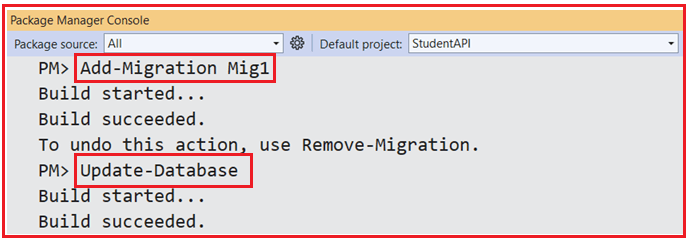
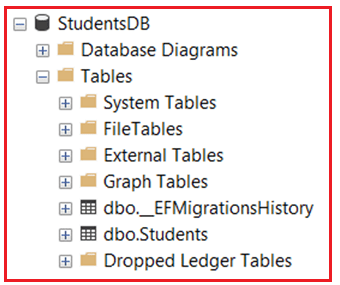

## **اصول اولیه API وب ASP.NET Core**

در این پست، مفاهیم بنیادی ASP.NET Core Web API را با استفاده از Entity Framework Core (EF Core) و SQL Server که برای ساخت سرویس‌های وب مدرن و میکروسرویس‌ها استفاده می‌شود، درک خواهیم کرد. لطفاً مقاله قبلی ما را که در مورد مفهوم اساسی معماری میکروسرویس‌ها بحث می‌کند، مطالعه کنید. در این مقاله، اجزای کلیدی مانند کنترلرها، مدل‌ها، DTOها و DbContext را درک خواهیم کرد. با استفاده از رویکرد Entity Framework Core Code First، ما همچنین یک پروژه ASP.NET Core Web API را از ابتدا ایجاد کرده و عملیات CRUD را روی یک موجودیت Student، از جمله seeding داده‌های آزمایشی، پیاده‌سازی خواهیم کرد. در پایان این پست، شما قادر خواهید بود:

- **تفاوت بین .NET Core و .NET Framework را درک کنید.**
- **بفهمید که ASP.NET Core Web API چیست.**
- **درباره کنترلرها، مدل‌ها، DTOها و DbContext اطلاعات کسب کنید.**
- **یک پروژه کامل ASP.NET Core Web API با Entity Framework Core (رویکرد Code First) راه‌اندازی کنید.**
- **عملیات CRUD را روی یک موجودیت دانشجویی انجام دهید.**

##### **تفاوت بین .NET Core و .NET Framework**

قبل از توسعه یک برنامه با استفاده از ASP.NET Core Web API، درک تفاوت‌های کلیدی بین .NET Core و .NET Framework ضروری است:

##### **هسته دات نت:**

- **کراس پلتفرم:** می‌تواند روی ویندوز، لینوکس و macOS اجرا شود.
- **متن‌باز:** کاملاً متن‌باز و توسط مایکروسافت و جامعه پشتیبانی می‌شود.
- **سبک و ماژولار:** فضای اجرا کمتر که می‌تواند متناسب با نیازهای برنامه شما تنظیم شود.
- **مدرن:** به‌روزرسانی‌های منظم با ویژگی‌های جدید، بهبود عملکرد و پشتیبانی از میکروسرویس‌ها و کانتینرسازی (Docker، Kubernetes).
- **پشتیبانی از API وب:** طراحی شده برای پشتیبانی از ساخت APIهای REST و میکروسرویس‌ها.

##### **چارچوب دات نت:**

- **فقط ویندوز:** فقط روی ویندوز قابل اجرا است.
- **متن‌باز:** عمدتاً اختصاصی، با مشارکت‌های کمتر از سوی جامعه.
- **یکپارچه:** چارچوب بزرگ‌تری دارد و حتی اگر فقط به زیرمجموعه کوچکی از سیستم نیاز باشد، نیاز به نصب کل سیستم دارد.
- **میراث:** اگرچه چارچوب دات‌نت همچنان حفظ می‌شود، اما برای پروژه‌های توسعه وب جدیدتر به عنوان میراث در نظر گرفته می‌شود.

**توجه:** .NET Core انتخاب ارجح برای ساخت برنامه‌های مدرن، مقیاس‌پذیر و چند پلتفرمی، از جمله APIهای وب، است.

##### **ASP.NET Core Web API چیست؟**

**ASP.NET Core Web API** چارچوبی برای ساخت APIهای مبتنی بر HTTP برای برنامه‌های وب و موبایل است. این یک چارچوب سبک و با کارایی بالا است که به توسعه‌دهندگان اجازه می‌دهد تا از طریق متدهای HTTP (GET، POST، PUT، DELETE) عملکرد خود را ارائه دهند. این یک ابزار ضروری برای ساخت سرویس‌های backend برای برنامه‌های مختلف کلاینت، مانند:

- **برنامه‌های کاربردی وب**
- **اپلیکیشن‌های موبایل**
- **میکروسرویس‌ها**

برخی از ویژگی‌های کلیدی **ASP.NET Core Web API** :

- **کراس پلتفرم** : روی ویندوز، macOS یا لینوکس اجرا می‌شود.
- **سبک** : با حداقل سربار و کارایی بالا.
- **متن‌باز** : کاملاً متن‌باز و به‌طور فعال توسط مایکروسافت توسعه داده شده است.
- **یکپارچه با تزریق وابستگی** : تزریق وابستگی داخلی برای قابلیت نگهداری و تست‌پذیری بهتر.
- **پشتیبانی از Swagger** : تولید خودکار مستندات API.

##### **راه‌اندازی محیط توسعه**

برای شروع توسعه ASP.NET Core Web API به ابزارها و محیط مناسب نیاز خواهید داشت.

- **IDE** : برای توسعه، می‌توانید از **Visual Studio 2022** یا **Visual Studio Code** استفاده کنید . Visual Studio یک محیط توسعه یکپارچه و غنی با ویژگی‌هایی مانند اشکال‌زدایی، آزمایش و ابزارهای استقرار ارائه می‌دهد.
- **SDK** : مطمئن شوید که **.NET 8 SDK** برای کامپایل و اجرای برنامه شما نصب شده است. این برای کار با برنامه‌های .NET Core ضروری است.

##### **ایجاد یک پروژه جدید ASP.NET Core Web API**

ویژوال استودیو را باز کنید و یک پروژه جدید ASP.NET Core Web API با نام StudentAPI ایجاد کنید.

##### **نصب هسته Entity Framework**

ما باید بسته‌های لازم را برای استفاده از Entity Framework Core با SQL Server نصب کنیم. بنابراین، لطفاً دستورات زیر را در خط فرمان ویژوال استودیو اجرا کنید.

- **نصب بسته Microsoft.EntityFrameworkCore.SqlServer**
- **نصب بسته Microsoft.EntityFrameworkCore.Tools**

##### **ایجاد مدل‌ها**

مدل‌ها کلاس‌هایی هستند که ساختار داده مورد استفاده در برنامه شما را تعریف می‌کنند. آن‌ها نمایانگر موجودیتی هستند که به پایگاه داده شما نگاشت می‌شود. در مثال ما، یک مدل Student تعریف خواهیم کرد. بنابراین، ابتدا پوشه‌ای به نام Models در دایرکتوری ریشه پروژه ایجاد کنید. سپس، یک فایل کلاس به نام **Student.cs** در **پوشه Models** ایجاد کنید و کد زیر را کپی و جایگذاری کنید:

```csharp
namespace StudentAPI.Models
{
    public class Student
    {
        public int Id { get; set; }
        public string Name { get; set; }
        public string Email { get; set; }
    }
}
```

##### **ایجاد DTOها (اشیاء انتقال داده)**

DTOها اشیاء مورد استفاده برای انتقال داده‌ها بین سرور و کلاینت هستند. برخلاف مدل‌ها، DTOها اغلب نسخه‌های ساده‌شده‌ای از مدل‌هایی هستند که فقط ویژگی‌های مورد نیاز را در اختیار کلاینت قرار می‌دهند. بنابراین، ابتدا پوشه‌ای به نام DTOs در دایرکتوری ریشه پروژه ایجاد کنید. در داخل **پوشه DTOها** ، یک فایل کلاس به نام **StudentDTO.cs** ایجاد کنید و کد زیر را کپی و جایگذاری کنید.

```csharp
namespace StudentAPI.DTOs
{
    public class StudentDTO
    {
        public string Name { get; set; }
        public string Email { get; set; }
    }
}
```

##### **ایجاد DbContext**

DbContext کلاس اصلی در Entity Framework Core است که امکان تعامل با پایگاه داده را فراهم می‌کند. این کلاس نشان‌دهنده‌ی یک جلسه با پایگاه داده است و برای پرس‌وجو و ذخیره‌ی داده‌ها استفاده می‌شود. ابتدا، پوشه‌ای به نام Data در دایرکتوری ریشه‌ی پروژه ایجاد کنید. سپس، در داخل **پوشه‌ی Data** ، یک فایل کلاس به نام **ApplicationDbContext.cs** ایجاد کنید و کد زیر را کپی و جای‌گذاری کنید.

```csharp
using Microsoft.EntityFrameworkCore;
using StudentAPI.Models;

namespace StudentAPI.Data
{
    public class ApplicationDbContext : DbContext
    {
        public DbSet<Student> Students { get; set; }

        public ApplicationDbContext(DbContextOptions<ApplicationDbContext> options) : base(options) { }

        protected override void OnModelCreating(ModelBuilder modelBuilder)
        {
            base.OnModelCreating(modelBuilder);

            // Seed data
            modelBuilder.Entity<Student>().HasData(
                new Student { Id = 1, Name = "John Doe", Email = "john.doe@example.com" },
                new Student { Id = 2, Name = "Jane Smith", Email = "jane.smith@example.com" }
            );
        }
    }
}
```

##### **پیکربندی DbContext در فایل Program.cs**

لطفا فایل کلاس Program.cs را به صورت زیر تغییر دهید تا ApplicationDbContext و سایر سرویس‌ها را ثبت کنید:

```csharp
using Microsoft.EntityFrameworkCore;
using StudentAPI.Data;

namespace StudentAPI
{
    public class Program
    {
        public static void Main(string[] args)
        {
            var builder = WebApplication.CreateBuilder(args);

            // Add services to the container.
            builder.Services.AddControllers()
            // Optionally, configure JSON options or other formatter settings
            .AddJsonOptions(options =>
            {
                // Configure JSON serializer settings to keep the Original names in serialization and deserialization
                options.JsonSerializerOptions.PropertyNamingPolicy = null;
            });

            // Learn more about configuring Swagger/OpenAPI at https://aka.ms/aspnetcore/swashbuckle
            builder.Services.AddEndpointsApiExplorer();
            builder.Services.AddSwaggerGen();

            // Add DbContext with SQL Server
            builder.Services.AddDbContext<ApplicationDbContext>(options =>
                options.UseSqlServer(builder.Configuration.GetConnectionString("DefaultConnection")));

            var app = builder.Build();

            // Configure the HTTP request pipeline.
            if (app.Environment.IsDevelopment())
            {
                app.UseSwagger();
                app.UseSwaggerUI();
            }

            app.UseHttpsRedirection();

            app.UseAuthorization();

            app.MapControllers();

            app.Run();
        }
    }
}
```

##### **رشته اتصال را پیکربندی کنید**

در **فایل appsettings.json** ، رشته اتصال زیر را اضافه کنید:

```json
{
  "Logging": {
    "LogLevel": {
      "Default": "Information",
      "Microsoft.AspNetCore": "Warning"
    }
  },
  "AllowedHosts": "*",
  "ConnectionStrings": {
    "DefaultConnection": "Server=LAPTOP-6P5NK25R\\SQLSERVER2022DEV;Database=StudentsDB;Trusted_Connection=True;TrustServerCertificate=True;"
  }
}
```

##### **ایجاد و اعمال مهاجرت پایگاه داده:**

در ویژوال استودیو، کنسول Package Manager را باز کنید و **دستورات Add-Migration** و **Update-Database** را به صورت زیر اجرا کنید تا فایل Migration ایجاد شود و سپس فایل Migration را برای ایجاد پایگاه داده StudentsDB و جدول Students مورد نیاز اعمال کنید:



پس از اجرای دستورات فوق و تأیید پایگاه داده، باید پایگاه داده StudentsDB را با جدول Students مورد نیاز، همانطور که در تصویر زیر نشان داده شده است، مشاهده کنید.



##### **ایجاد کنترلر API دانشجویی**

کنترلرها مسئول مدیریت درخواست‌های HTTP ورودی و بازگرداندن پاسخ‌های HTTP هستند. آن‌ها شامل متدهای عملیاتی مربوط به متدهای HTTP مانند **GET** ، **POST** ، **PUT** و **DELETE** هستند . بنابراین، یک کنترلر خالی API با نام **StudentsController** در پوشه Controllers ایجاد کنید و سپس کد زیر را کپی و جایگذاری کنید:

```csharp
using Microsoft.AspNetCore.Mvc;
using Microsoft.EntityFrameworkCore;
using StudentAPI.Data;
using StudentAPI.DTOs;
using StudentAPI.Models;

namespace StudentAPI.Controllers
{
    [ApiController]
    [Route("api/[controller]")]
    public class StudentsController : ControllerBase
    {
        private readonly ApplicationDbContext _context;

        public StudentsController(ApplicationDbContext context)
        {
            _context = context;
        }

        // This method returns a list of students.
        // GET: api/students
        [HttpGet]
        public async Task<ActionResult<IEnumerable<StudentDTO>>> GetStudents()
        {
            var students = await _context.Students.ToListAsync();
            return Ok(students.Select(s => new StudentDTO { Name = s.Name, Email = s.Email }));
        }

        // This method returns a single student by Id.
        // GET: api/students/5
        [HttpGet("{id}")]
        public async Task<ActionResult<StudentDTO>> GetStudent(int id)
        {
            var student = await _context.Students.FindAsync(id);

            if (student == null)
            {
                return NotFound();
            }

            return Ok(new StudentDTO { Name = student.Name, Email = student.Email });
        }

        // This method handles creating a new Student in the database.
        // The request body should contain the student's Name and Email.
        // POST: api/students
        [HttpPost]
        public async Task<ActionResult<StudentDTO>> CreateStudent(StudentDTO studentDTO)
        {
            var student = new Student
            {
                Name = studentDTO.Name,
                Email = studentDTO.Email
            };

            _context.Students.Add(student);
            await _context.SaveChangesAsync();

            // The CreatedAtAction method returns a status code of 201 and
            // the URL of the newly created resource.
            return CreatedAtAction(nameof(GetStudent), new { id = student.Id }, studentDTO);
        }

        // This method is used to update an existing Student.
        // You must pass the student's ID and new data in the request body.
        // PUT: api/students/5
        [HttpPut("{id}")]
        public async Task<IActionResult> UpdateStudent(int id, StudentDTO studentDTO)
        {
            var student = await _context.Students.FindAsync(id);

            if (student == null)
            {
                return NotFound();
            }

            student.Name = studentDTO.Name;
            student.Email = studentDTO.Email;

            _context.Entry(student).State = EntityState.Modified;
            await _context.SaveChangesAsync();

            // NoContent() returns a 204 status code, indicating that the update was successful,
            // but there is no content to return.
            return NoContent();
        }

        // This method deletes a student from the database based on ID.
        // DELETE: api/students/5
        [HttpDelete("{id}")]
        public async Task<IActionResult> DeleteStudent(int id)
        {
            var student = await _context.Students.FindAsync(id);

            if (student == null)
            {
                return NotFound();
            }

            _context.Students.Remove(student);
            await _context.SaveChangesAsync();

            // NoContent() is returned after the student is deleted, indicating success.
            return NoContent();
        }
    }
}
```

##### **تست و مستندسازی API (Swagger)**

تست API وب شما برای اطمینان از عملکرد نقاط پایانی و بازگرداندن نتایج مورد انتظار بسیار مهم است. ابزارهایی مانند **Postman** و **Swagger** برای تست و مستندسازی APIها محبوب هستند.

- **Postman** : به شما امکان می‌دهد درخواست‌هایی را به API خود ارسال کنید و پاسخ‌ها را بررسی کنید. این ابزار برای تست دستی عالی است.
- **Swagger** : به طور خودکار مستندات API را برای Web API شما تولید می‌کند و تعامل و درک نقاط پایانی موجود را برای توسعه‌دهندگان آسان‌تر می‌کند.

##### **آزمایش عملیات CRUD**

پس از تنظیم API، می‌توانید عملیات CRUD را با استفاده از **Postman** یا **Swagger** تنظیم شده است ) آزمایش کنید. **(که به طور خودکار در ASP.NET Core** برای مستندسازی API

1. **یک دانش‌آموز جدید را معرفی کنید** .
2. **انتخاب کنید یا یک دانش‌آموز را بر اساس شماره شناسایی انتخاب کنید.** همه دانش‌آموزان را
3. **PUT** برای به‌روزرسانی داده‌های دانش‌آموز.
4. **برای حذف یک دانش‌آموز، از کلید DELETE استفاده کنید** .

کاملاً کاربردی **ASP.NET Core Web API** با این تنظیمات، شما یک پروژه **با استفاده از Entity Framework Core** به همراه **SQL Server** خواهید داشت . از طریق API، می‌توانید **عملیات CRUD** اولیه (ایجاد، خواندن، به‌روزرسانی، حذف) را روی **Student** موجودیت انجام دهید .