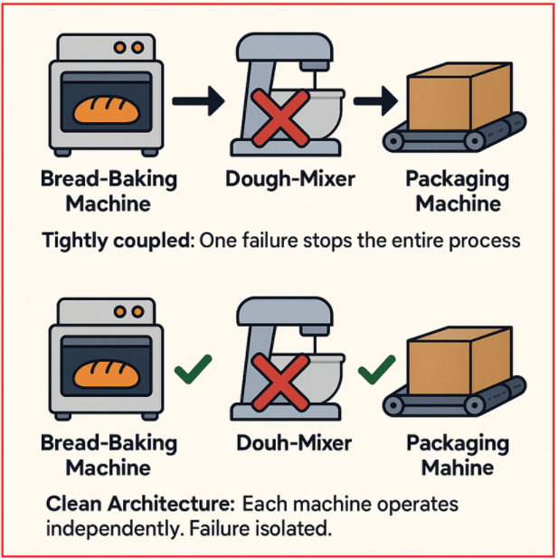
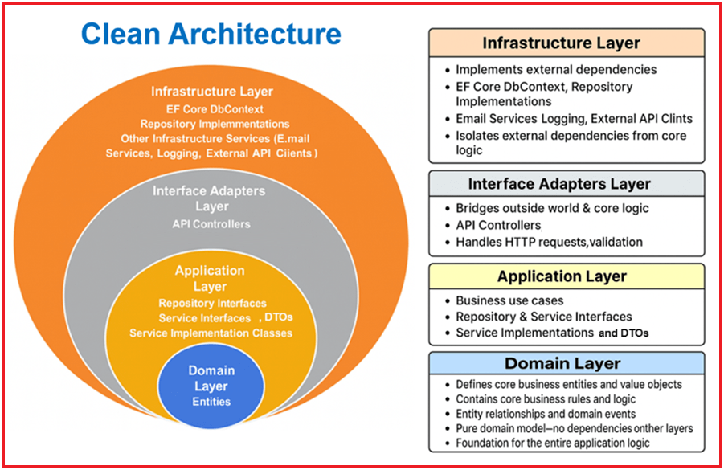
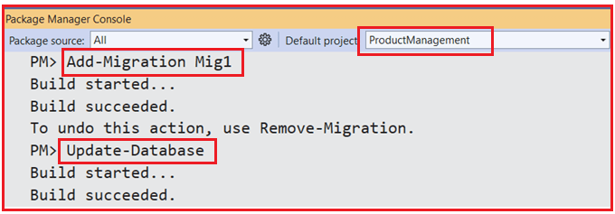
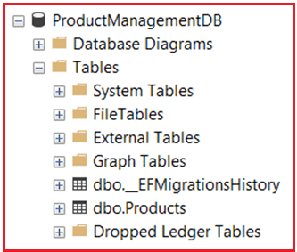
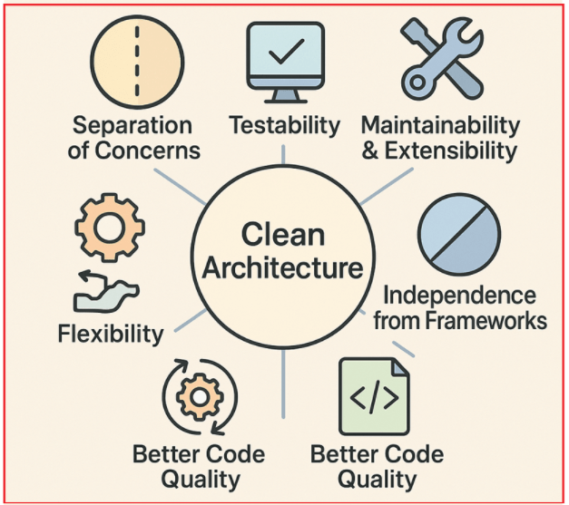

## **معماری تمیز در ASP.NET Core Web API با یک مثال بلادرنگ**

در این پست، بررسی خواهیم کرد که معماری پاک چیست، چرا اهمیت دارد، لایه‌های کلیدی آن چیست و سپس یک سیستم مدیریت محصول بلادرنگ ساخته شده با ASP.NET Core Web API را بررسی خواهیم کرد. برنامه‌های نرم‌افزاری مدرن به پایگاه‌های کدی نیاز دارند که قابل نگهداری، قابل آزمایش و مقیاس‌پذیر باشند. با رشد سیستم‌ها، کد نامرتب و وابستگی‌های کاملاً وابسته می‌توانند تحویل را کند کرده و باعث ایجاد اشکالات شوند. برای غلبه بر این مشکل، باید از معماری پاک استفاده کنیم.

##### **معماری پاک چیست؟**

معماری پاک یک فلسفه طراحی نرم‌افزار است که توسط رابرت سی. مارتین (که معمولاً با نام عمو باب شناخته می‌شود) معرفی شده است. این فلسفه کد را در لایه‌های مجزا با مسئولیت‌های مشخص سازماندهی می‌کند. ایده اصلی، جداسازی دغدغه‌ها به گونه‌ای است که هر لایه از برنامه مستقل از لایه‌های دیگر باشد. این بدان معناست که تغییرات یا به‌روزرسانی‌ها در یک بخش از سیستم، حداقل تأثیر را بر سایر بخش‌ها خواهد داشت یا هیچ تأثیری نخواهد داشت.

ایده اصلی این است که برنامه خود را به چندین لایه مجزا تقسیم کنید، که در آن:

- هر لایه مسئولیت مشخصی دارد.
- مهم‌ترین بخش، منطق کسب‌وکار یا قوانین اصلی شما، کاملاً مستقل از هرگونه عامل خارجی مانند پایگاه‌های داده، چارچوب‌های وب یا رابط‌های کاربری است.
- این جداسازی به این معنی است که اگر زمانی نیاز به تغییر پایگاه داده، طراحی مجدد رابط کاربری یا تغییر چارچوب‌ها داشته باشید، قوانین اصلی کسب‌وکار شما دست‌نخورده باقی می‌مانند.

##### **چرا معماری پاک مهم است؟**

بیایید یک مثال واقعی بزنیم: تصور کنید که شما صاحب یک نانوایی با چندین دستگاه هستید:

- دستگاه **نان‌پزی** که نان می‌پزد.
- دستگاه **خمیرزن** که مواد را با هم مخلوط می‌کند.
- دستگاه **بسته‌بندی** که نان آماده را بسته‌بندی می‌کند.

اگر همه این دستگاه‌ها به هم متصل باشند (برای مثال، عملکرد خمیرگیر مستقیماً به دستگاه پخت نان بستگی داشته باشد)، وقتی یکی از دستگاه‌ها خراب شود یا نیاز به ارتقاء داشته باشد، کل نانوایی ممکن است متوقف شود. تعمیر یا تعویض یک دستگاه بدون ایجاد اختلال در کل عملیات دشوار می‌شود. برای درک بهتر، لطفاً به تصویر زیر مراجعه کنید.



با **معماری پاک** ، هر دستگاه به طور مستقل عمل می‌کند. اگر میکسر خمیر خراب شود، فقط مرحله مخلوط کردن تحت تأثیر قرار می‌گیرد؛ دستگاه‌های پخت و بسته‌بندی همچنان می‌توانند کار کنند. می‌توانید هر دستگاهی را بدون ایجاد اختلال در عملکرد نانوایی ارتقا یا جایگزین کنید.

##### **درک لایه‌های معماری پاک:**

معماری پاک، سیستم را در ۴ لایه مجزا سازماندهی می‌کند. بیایید این لایه‌ها را درک کنیم. برای درک بهتر، لطفاً به تصویر زیر مراجعه کنید.



##### **لایه دامنه**

لایه دامنه قلب منطق کسب‌وکار است و شامل یک مدل دامنه خالص است که شامل قوانین کسب‌وکار و اعتبارسنجی‌ها، مستقل از زیرساخت و نگرانی‌های برنامه کاربردی است.

**شامل موارد زیر است:**

- **موجودیت‌ها:** اشیاء اصلی کسب‌وکار (مانند محصول، کارمند، پرداخت، سفارش و غیره) با ویژگی‌ها و اعتبارسنجی‌های قوانین کسب‌وکار. برای مثال، موجودیت محصول تضمین می‌کند که قیمت مثبت است و سهام منفی نیست.

##### **لایه زیرساخت**

لایه زیرساخت تمام وابستگی‌های خارجی، از جمله پایگاه‌های داده، APIهای خارجی و سیستم‌های فایل را پیاده‌سازی می‌کند. این لایه، کلاس‌های عینی را فراهم می‌کند که رابط‌های تعریف‌شده در لایه کاربرد را پیاده‌سازی می‌کنند.

**شامل موارد زیر است:**

- **EF Core DbContext:** کلاس واقعی مورد استفاده برای تعامل با پایگاه داده SQL Server شما (مثلاً ApplicationDbContext)، تعریف جداول و روابط.
- **پیاده‌سازی‌های مخزن:** کلاس‌های عینی که از EF Core DbContext برای انجام عملیات CRUD استفاده می‌کنند، همانطور که توسط رابط‌های مخزن در لایه برنامه تعریف شده‌اند.
- **سایر سرویس‌های زیرساختی (در صورت وجود):** به عنوان مثال، سرویس‌های ایمیل، ثبت وقایع، کلاینت‌های API خارجی.

این لایه وابستگی‌های خارجی را از منطق اصلی کسب‌وکار جدا می‌کند. لایه زیرساخت تماماً مربوط به جزئیات پیاده‌سازی است که می‌توانند بدون تأثیر بر منطق اصلی برنامه، جابجا یا تغییر داده شوند.

##### **لایه کاربرد**

لایه کاربرد، موارد استفاده تجاری و منطق خاص برنامه را تعریف می‌کند. این لایه نحوه تعامل بخش‌های مختلف سیستم را برای برآورده کردن الزامات تجاری، بدون نگرانی در مورد نحوه ذخیره یا ارائه داده‌ها در رابط کاربری، مدیریت می‌کند. این لایه مستقل از چارچوب است (هیچ وابستگی به EF Core، ASP.NET و غیره ندارد).

**شامل موارد زیر است:**

- **رابط‌های مخزن:** قرارداد عملیات دسترسی به داده‌ها را که توسط منطق کسب‌وکار مورد نیاز است، تعریف می‌کند، بدون اینکه نحوه ذخیره یا بازیابی داده‌ها را مشخص کند (این مسئولیت زیرساخت است). این امر باعث ایجاد اتصال سست بین دسترسی به داده‌ها و منطق کسب‌وکار می‌شود.
- **رابط‌های سرویس:** عملیات تجاری (موارد استفاده) مانند ایجاد، بازیابی، به‌روزرسانی و حذف منابع (مثلاً محصولات، کارمندان) را تعریف کنید.
- **پیاده‌سازی‌های سرویس:** رابط‌های سرویسی را پیاده‌سازی می‌کنند که گردش‌های کاری کسب‌وکار را کپسوله‌سازی می‌کنند. آن‌ها با فراخوانی مخازن و مدیریت موجودیت‌های دامنه، منطق کسب‌وکار را پیاده‌سازی می‌کنند و اغلب اعتبارسنجی و قوانین کسب‌وکار را مدیریت می‌کنند.
- **DTOها (اشیاء انتقال داده):** ساختارهای داده‌ای مورد استفاده برای انتقال داده‌ها بین لایه‌ها، شکل‌دهی و اعتبارسنجی داده‌های جاری بین لایه برنامه و لایه‌های خارجی را تعریف می‌کنند. با قرار دادن DTOها در اینجا، لایه برنامه نحوه تعریف و استفاده از قراردادهای داده را کنترل می‌کند و جداسازی قوی مسائل را تضمین می‌کند.

##### **لایه آداپتورهای رابط (لایه ارائه)**

لایه آداپتورهای رابط به عنوان پلی بین دنیای خارج (مانند کلاینت‌های HTTP، رابط کاربری یا APIهای خارجی) و منطق اصلی برنامه عمل می‌کند.

- داده‌های ورودی (درخواست‌های HTTP) را با مدل‌های داخلی برنامه تطبیق می‌دهد.
- داده‌های خروجی را به فرمت‌های مناسب (پاسخ‌های JSON) تطبیق می‌دهد.
- اعتبارسنجی‌های سطح API (مثلاً اعتبارسنجی مدل از طریق Data Annotations) را مدیریت می‌کند.
- مدیریت مسائل امنیتی در سطح API (احراز هویت، مجوز).

**شامل موارد زیر است:**

- **کنترل‌کننده‌های API:** درخواست‌های HTTP را مدیریت می‌کنند، ورودی‌ها را اعتبارسنجی می‌کنند، سرویس‌های برنامه را فراخوانی می‌کنند و پاسخ‌های مناسب را برمی‌گردانند.

##### **مثال بلادرنگ: سیستم مدیریت محصول با استفاده از معماری پاک در ASP.NET Core Web API**

ما یک سیستم مدیریت محصول ساده با استفاده از اصول معماری پاک با ASP.NET Core Web API، رویکرد Entity Framework Core (EF Core) Code-First و SQL Server به عنوان پایگاه داده خواهیم ساخت.

ابتدا، یک پروژه جدید ASP.NET Core Web API با نام **ProductManagement** ایجاد کنید . از آنجایی که ما از Entity Framework Core با SQL Server استفاده خواهیم کرد، باید بسته‌های لازم را نصب کنیم. بنابراین، لطفاً دستورات زیر را در Visual Studio Command Prompt اجرا کنید.

- **نصب بسته Microsoft.EntityFrameworkCore.SqlServer**
- **نصب بسته Microsoft.EntityFrameworkCore.Tools**

##### **ایجاد لایه دامنه**

لایه دامنه، موجودیت‌ها و قوانین ضروری کسب و کار را مستقل از چارچوب‌ها یا زیرساخت‌ها تعریف می‌کند. ابتدا، پوشه‌ای به نام **دامنه (Domain)** در دایرکتوری ریشه پروژه ایجاد کنید. ایجاد کنید **سپس، یک زیرپوشه به نام موجودیت‌ها (Entities)** در **پوشه دامنه (Domain)** . سپس، در داخل **پوشه دامنه/موجودیت‌ها (Domain/Entities** ایجاد کنید **)، یک فایل کلاس به نام محصول (Product.cs)** و کد زیر را کپی و جایگذاری کنید.

```csharp
using System.ComponentModel.DataAnnotations;
using System.ComponentModel.DataAnnotations.Schema;

namespace ProductManagement.Domain.Entities
{
    public class Product
    {
        public int Id { get; set; }

        [Required, StringLength(100, MinimumLength = 2)]
        public string Name { get; set; } = null!;

        [StringLength(500)]
        public string? Description { get; set; }

        [Column(TypeName = "decimal(18,2)")]
        [Range(0.01, 1000000, ErrorMessage = "Price must be positive and less than 10 lakh.")]
        public decimal Price { get; set; }

        [Range(0, int.MaxValue, ErrorMessage = "Stock cannot be negative.")]
        public int Stock { get; set; }

        // Business rule: Ensure Price is positive and Stock is not negative
        public void ValidateBusinessRules()
        {
            if (Price <= 0)
                throw new InvalidOperationException("Product price must be positive.");
            if (Stock < 0)
                throw new InvalidOperationException("Product stock cannot be negative.");
        }
    }
}
```

##### **ایجاد لایه کاربردی:**

لایه کاربرد، موارد استفاده (منطق کسب و کار)، قراردادهای سرویس و رابط‌های مخزن را تعریف می‌کند. این لایه، گردش‌های کاری و قوانین کسب و کار را مدیریت می‌کند، اما شامل کد مخصوص چارچوب یا کد پایگاه داده نمی‌شود. عناصر کلیدی زیر عبارتند از:

- DTOها (مثلاً ProductDTO)
- رابط‌های مخزن (مثلاً IProductRepository)
- رابط‌های سرویس (مثلاً IProductService)
- پیاده‌سازی خدمات (مثلاً ProductService)

ابتدا، یک پوشه با نام **Application** در دایرکتوری ریشه پروژه ایجاد کنید.

##### **ایجاد DTO ها:**

بیایید با لایه برنامه با ایجاد DTOها شروع کنیم. در داخل **پوشه برنامه** ، یک پوشه جدید به نام **DTOs ایجاد کنید،** ذخیره خواهیم کرد . جایی که تمام DTOهای خود را

##### **ایجاد DTO پاسخ محصول**

یک فایل کلاس با نام **ProductDTO.cs** در **پوشه Application/DTOs** ایجاد کنید و کد زیر را کپی و در آن جایگذاری کنید.

```csharp
namespace ProductManagement.Application.DTOs
{
    public class ProductDTO
    {
        public int Id { get; set; }
        public string Name { get; set; } = null!;
        public string? Description { get; set; }
        public decimal Price { get; set; }
        public int Stock { get; set; }
    }
}
```

##### **ایجاد محصول ایجاد DTO**

یک فایل کلاس با نام **CreateProductDTO.cs** در **پوشه Application/DTOs** ایجاد کنید و کد زیر را کپی و در آن جایگذاری کنید.

```csharp
using System.ComponentModel.DataAnnotations;

namespace ProductManagement.Application.DTOs
{
    public class CreateProductDTO
    {
        [Required(ErrorMessage = "Product name is required.")]
        [MaxLength(100, ErrorMessage = "Product name cannot exceed 100 characters.")]
        public string Name { get; set; } = null!;

        [StringLength(500)]
        public string? Description { get; set; }

        [Range(0.01, 1000000, ErrorMessage = "Price must be positive and less than 10 lakh.")]
        public decimal Price { get; set; }

        [Range(0, int.MaxValue, ErrorMessage = "Stock cannot be negative.")]
        public int Stock { get; set; }
    }
}
```

##### **ایجاد DTO به‌روزرسانی محصول**

یک فایل کلاس با نام **UpdateProductDTO.cs** در **پوشه Application/DTOs** ایجاد کنید و کد زیر را کپی و در آن جایگذاری کنید.

```csharp
using System.ComponentModel.DataAnnotations;

namespace ProductManagement.Application.DTOs
{
    public class UpdateProductDTO
    {
        [Required]
        public int Id { get; set; }

        [Required(ErrorMessage = "Product name is required.")]
        [MaxLength(100, ErrorMessage = "Product name cannot exceed 100 characters.")]
        public string Name { get; set; } = null!;

        [StringLength(500)]
        public string? Description { get; set; }

        [Range(0.01, 1000000, ErrorMessage = "Price must be positive and less than 10 lakh.")]
        public decimal Price { get; set; }

        [Range(0, int.MaxValue, ErrorMessage = "Stock cannot be negative.")]
        public int Stock { get; set; }
    }
}
```

##### **ایجاد رابط مخزن محصول**

یک پوشه به نام **Interfaces** در **پوشه Application** ایجاد کنید . دوباره، یک پوشه جدید به نام **Repositories** در **پوشه Application/Interfaces** ایجاد کنید . سپس، در داخل **پوشه Application/Interfaces/Repositories** ، یک رابط به نام **IProductRepository.cs** ایجاد کنید و کد زیر را کپی و جایگذاری کنید.

```csharp
using ProductManagement.Domain.Entities;

namespace ProductManagement.Application.Interfaces.Repositories
{
    public interface IProductRepository
    {
        Task<IEnumerable<Product>> GetAllAsync();
        Task<Product?> GetByIdAsync(int id);
        Task<Product?> AddAsync(Product product);
        Task UpdateAsync(Product product);
        Task DeleteAsync(int id);
    }
}
```

##### **ایجاد رابط کاربری خدمات محصول**

یک پوشه جدید به نام **Services** در **پوشه Application/Interfaces** ایجاد کنید . سپس، در داخل **پوشه Application/Interfaces/Services** ، یک فایل کلاس به نام **IProductService.cs** ایجاد کنید و کد زیر را کپی و جایگذاری کنید.

```csharp
using ProductManagement.Application.DTOs;

namespace ProductManagement.Application.Interfaces.Services
{
    public interface IProductService
    {
        Task<IEnumerable<ProductDTO>> GetAllProductsAsync();
        Task<ProductDTO?> GetProductByIdAsync(int id);
        Task<ProductDTO?> AddProductAsync(CreateProductDTO productDto);
        Task UpdateProductAsync(UpdateProductDTO productDto);
        Task DeleteProductAsync(int id);
    }
}
```

##### **ایجاد پیاده‌سازی‌های خدمات محصول**

یک پوشه به نام **Services** در **پوشه Application** ایجاد کنید . سپس، در داخل **پوشه Application/Services** ، یک فایل کلاس به نام **ProductService.cs** ایجاد کنید و کد زیر را کپی و جایگذاری کنید.

```csharp
using ProductManagement.Application.DTOs;
using ProductManagement.Application.Interfaces.Repositories;
using ProductManagement.Application.Interfaces.Services;
using ProductManagement.Domain.Entities;

namespace ProductManagement.Application.Services
{
    public class ProductService : IProductService
    {
        private readonly IProductRepository _repository;

        public ProductService(IProductRepository repository)
        {
            _repository = repository;
        }

        private ProductDTO MapToDTO(Product product)
        {
            return new ProductDTO
            {
                Id = product.Id,
                Name = product.Name,
                Description = product.Description,
                Price = product.Price,
                Stock = product.Stock
            };
        }

        public async Task<IEnumerable<ProductDTO>> GetAllProductsAsync()
        {
            var products = await _repository.GetAllAsync();
            var dtos = new List<ProductDTO>();
            foreach (var product in products)
            {
                dtos.Add(MapToDTO(product));
            }
            return dtos;
        }

        public async Task<ProductDTO?> GetProductByIdAsync(int id)
        {
            var product = await _repository.GetByIdAsync(id);
            if (product == null)
                return null;
            return MapToDTO(product);
        }

        public async Task<ProductDTO?> AddProductAsync(CreateProductDTO productDto)
        {
            var product = new Product
            {
                Name = productDto.Name,
                Description = productDto.Description,
                Price = productDto.Price,
                Stock = productDto.Stock
            };
            product.ValidateBusinessRules();

            var newProduct = await _repository.AddAsync(product);
            if (newProduct != null)
                return MapToDTO(newProduct);

            return null;
        }

        public async Task UpdateProductAsync(UpdateProductDTO productDto)
        {
            var product = await _repository.GetByIdAsync(productDto.Id);
            if (product == null) throw new Exception("Product not found.");
            product.Name = productDto.Name;
            product.Description = productDto.Description;
            product.Price = productDto.Price;
            product.Stock = productDto.Stock;
            product.ValidateBusinessRules();

            await _repository.UpdateAsync(product);
        }

        public async Task DeleteProductAsync(int id)
        {
            await _repository.DeleteAsync(id);
        }
    }
}
```

##### **ایجاد لایه زیرساخت**

لایه زیرساخت، دسترسی به داده‌ها و سایر موارد فنی (سیستم فایل، ایمیل و غیره) را که خارج از منطق کسب‌وکار شما هستند، پیاده‌سازی می‌کند. عناصر کلیدی زیر عبارتند از:

- DbContext (زمینه برنامه)
- پیاده‌سازی‌های مخزن (مخزن محصول)

ابتدا، پوشه‌ای به نام **Infrastructure** در دایرکتوری ریشه پروژه ایجاد کنید.

##### **ایجاد DbContext برنامه**

یک پوشه جدید به نام **Data** در **پوشه Infrastructure** ایجاد کنید . سپس، در داخل **پوشه Infrastructure/Data** ، یک فایل کلاس به نام **ApplicationDbContext.cs** ایجاد کنید و کد زیر را کپی و جایگذاری کنید.

```csharp
using Microsoft.EntityFrameworkCore;
using ProductManagement.Domain.Entities;

namespace ProductManagement.Infrastructure.Data
{
    public class ApplicationDbContext : DbContext
    {
        public ApplicationDbContext(DbContextOptions<ApplicationDbContext> options)
            : base(options)
        {
        }

        protected override void OnModelCreating(ModelBuilder modelBuilder)
        {
            base.OnModelCreating(modelBuilder);

            // Seed initial products
            modelBuilder.Entity<Product>().HasData(
                new Product { Id = 1, Name = "Laptop", Description = "High-end gaming laptop", Price = 1500.00m, Stock = 10 },
                new Product { Id = 2, Name = "Smartphone", Description = "Latest model smartphone", Price = 800.00m, Stock = 25 },
                new Product { Id = 3, Name = "Wireless Headphones", Description = "Noise cancelling headphones", Price = 200.00m, Stock = 40 }
            );
        }

        public DbSet<Product> Products { get; set; } = null!;
    }
}
```

##### **ایجاد مخزن محصول**

یک پوشه جدید به نام **Repositories** در **پوشه Infrastructure** ایجاد کنید . سپس، در داخل **پوشه Infrastructure/Repositories** ، یک فایل کلاس به نام **ProductRepository.cs** ایجاد کنید و کد زیر را کپی و جایگذاری کنید.

```csharp
using ProductManagement.Application.Interfaces.Repositories;
using ProductManagement.Domain.Entities;
using ProductManagement.Infrastructure.Data;
using Microsoft.EntityFrameworkCore;

namespace ProductManagement.Infrastructure.Repositories
{
    public class ProductRepository : IProductRepository
    {
        private readonly ApplicationDbContext _context;

        public ProductRepository(ApplicationDbContext context)
        {
            _context = context;
        }

        public async Task<IEnumerable<Product>> GetAllAsync()
        {
            return await _context.Products.AsNoTracking().ToListAsync();
        }

        public async Task<Product?> GetByIdAsync(int id)
        {
            return await _context.Products.AsNoTracking().FirstOrDefaultAsync(prd => prd.Id == id);
        }

        public async Task<Product?> AddAsync(Product product)
        {
            await _context.Products.AddAsync(product);
            await _context.SaveChangesAsync();
            return product;
        }

        public async Task UpdateAsync(Product product)
        {
            _context.Products.Update(product);
            await _context.SaveChangesAsync();
        }

        public async Task DeleteAsync(int id)
        {
            var product = await _context.Products.FindAsync(id);
            if (product != null)
            {
                _context.Products.Remove(product);
                await _context.SaveChangesAsync();
            }
        }
    }
}
```

##### **ایجاد لایه آداپتورهای رابط (لایه ارائه)**

لایه آداپتورهای رابط، درخواست‌های HTTP ورودی را مدیریت می‌کند، با لایه برنامه تعامل دارد و پاسخ‌های HTTP را به کلاینت برمی‌گرداند. عناصر کلیدی زیر عبارتند از:

- کنترل‌کننده‌های API (مثلاً ProductController)

##### **ایجاد کنترلر API محصول**

بنابراین، یک پوشه به نام **InterfaceAdapters** در دایرکتوری ریشه پروژه ایجاد کنید و سپس درون **پوشه InterfaceAdapters** ، پوشه دیگری به نام **Controllers** ایجاد کنید . سپس، درون **پوشه InterfaceAdapters/Controllers** ، یک کنترلر API خالی به نام **ProductController.cs** ایجاد کنید و کد زیر را کپی و جایگذاری کنید.

```csharp
using Microsoft.AspNetCore.Mvc;
using ProductManagement.Application.DTOs;
using ProductManagement.Application.Interfaces.Services;

namespace ProductManagement.InterfaceAdapters.Controllers
{
    [Route("api/[controller]")]
    [ApiController]
    public class ProductController : ControllerBase
    {
        private readonly IProductService _service;

        public ProductController(IProductService service)
        {
            _service = service;
        }

        [HttpGet]
        public async Task<IEnumerable<ProductDTO>> Get()
        {
            return await _service.GetAllProductsAsync();
        }

        [HttpGet("{id}")]
        public async Task<ActionResult<ProductDTO>> Get(int id)
        {
            var product = await _service.GetProductByIdAsync(id);
            if (product == null)
                return NotFound();
            return Ok(product);
        }

        [HttpPost]
        public async Task<IActionResult> Post(CreateProductDTO productDto)
        {
            var product = await _service.AddProductAsync(productDto);
            return Ok(product);
        }

        [HttpPut("{id}")]
        public async Task<IActionResult> Put(UpdateProductDTO productDto)
        {
            await _service.UpdateProductAsync(productDto);
            return NoContent();
        }

        [HttpDelete("{id}")]
        public async Task<IActionResult> Delete(int id)
        {
            await _service.DeleteProductAsync(id);
            return NoContent();
        }
    }
}
```

##### **فایل appsettings.json**

این فایل شامل تنظیمات برنامه، از جمله رشته اتصال پایگاه داده است. بنابراین، لطفاً فایل appsettings.json را به صورت زیر تغییر دهید:

```json
{
  "Logging": {
    "LogLevel": {
      "Default": "Information",
      "Microsoft.AspNetCore": "Warning"
    }
  },
  "AllowedHosts": "*",
  "ConnectionStrings": {
    "DefaultConnection": "Server=LAPTOP-6P5NK25R\\SQLSERVER2022DEV;Database=ProductManagementDB;Trusted_Connection=True;TrustServerCertificate=True;"
  }
}
```

##### **پیکربندی تزریق وابستگی:**

فایل کلاس Program.cs سرویس‌ها و اجزای میان‌افزار برنامه را پیکربندی می‌کند. بنابراین، لطفاً کلاس Program را به صورت زیر تغییر دهید:

```csharp
using Microsoft.EntityFrameworkCore;
using ProductManagement.Application.Interfaces.Repositories;
using ProductManagement.Application.Interfaces.Services;
using ProductManagement.Application.Services;
using ProductManagement.Infrastructure.Data;
using ProductManagement.Infrastructure.Repositories;

namespace ProductManagement
{
    public class Program
    {
        public static void Main(string[] args)
        {
            var builder = WebApplication.CreateBuilder(args);

            // Add services to the container.
            builder.Services.AddControllers()
            .AddJsonOptions(options =>
            {
                //Disable Camel case naming conventions for JSON Serialization and Deserialization
                options.JsonSerializerOptions.PropertyNamingPolicy = null;
            });

            // Add DbContext with SQL Server
            builder.Services.AddDbContext<ApplicationDbContext>(options =>
                options.UseSqlServer(builder.Configuration.GetConnectionString("DefaultConnection")));

            builder.Services.AddEndpointsApiExplorer();
            builder.Services.AddSwaggerGen();

            // Register services and repositories
            builder.Services.AddScoped<IProductRepository, ProductRepository>();
            builder.Services.AddScoped<IProductService, ProductService>();

            var app = builder.Build();

            // Configure the HTTP request pipeline.
            if (app.Environment.IsDevelopment())
            {
                app.UseSwagger();
                app.UseSwaggerUI();
            }

            app.UseHttpsRedirection();

            app.UseAuthorization();

            app.MapControllers();

            app.Run();
        }
    }
}
```

##### **ایجاد و اعمال مهاجرت پایگاه داده:**

در ویژوال استودیو، کنسول Package Manager را باز کنید و **دستورات Add-Migration** و **Update-Database** را به صورت زیر اجرا کنید تا فایل Migration ایجاد شود و سپس فایل Migration را برای ایجاد پایگاه داده ProductManagementDB و جدول Products مورد نیاز اعمال کنید:



پس از اجرای دستورات بالا، پایگاه داده را تأیید کنید و باید پایگاه داده ProductManagementDB را با جدول Products مورد نیاز، همانطور که در تصویر زیر نشان داده شده است، مشاهده کنید.



##### **مزایای معماری تمیز در ASP.NET Core Web API**

****

مزایای توسعه یک برنامه با پیروی از معماری تمیز به شرح زیر است **:**

- **تفکیک دغدغه‌ها:** هر لایه مسئولیت مشخصی دارد که درک، توسعه و نگهداری سیستم را آسان‌تر می‌کند.
- **قابلیت آزمایش:** از آنجایی که منطق کسب‌وکار از زیرساخت و رابط کاربری جدا شده است، آزمایش واحد ساده است و نیازی به پایگاه‌های داده واقعی یا رابط کاربری ندارد.
- **قابلیت نگهداری و توسعه‌پذیری:** تغییرات در یک لایه (مثلاً تغییر پایگاه‌های داده یا چارچوب‌های رابط کاربری) بر لایه‌های دیگر تأثیر نمی‌گذارد و خطر پسرفت را کاهش می‌دهد.
- **استقلال از چارچوب‌ها:** منطق اصلی کسب‌وکار و قوانین کاربردی به هیچ فناوری یا چارچوب خاصی وابسته نیستند.
- **انعطاف‌پذیری:** جزئیات زیرساخت، مانند ذخیره‌سازی داده‌ها، سرویس‌های شخص ثالث یا رابط کاربری، می‌توانند بدون تأثیر بر قوانین کسب‌وکار، تغییر یا به‌روزرسانی شوند.
- **کیفیت بهتر کد:** استفاده از رابط‌ها، وارونگی وابستگی و اصول طراحی مبتنی بر دامنه را تشویق می‌کند و در نتیجه کدی تمیزتر و قوی‌تر تولید می‌کند.

با ساختاردهی برنامه خود به لایه‌های مجزا مانند دامنه، برنامه، زیرساخت و آداپتورهای رابط، ما تضمین می‌کنیم که قوانین اصلی کسب و کار مستقل باقی بمانند و از نگرانی‌های خارجی محافظت شوند. اتخاذ معماری پاک در توسعه ASP.NET Core Web API نه تنها منجر به پایگاه‌های کد تمیزتر و قابل مدیریت‌تر می‌شود، بلکه سیستم شما را برای رشد آینده، تغییرات فناوری و الزامات تجاری در حال تحول با حداقل تأثیر آماده می‌کند.