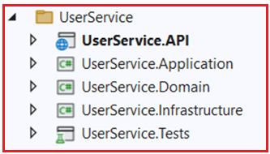
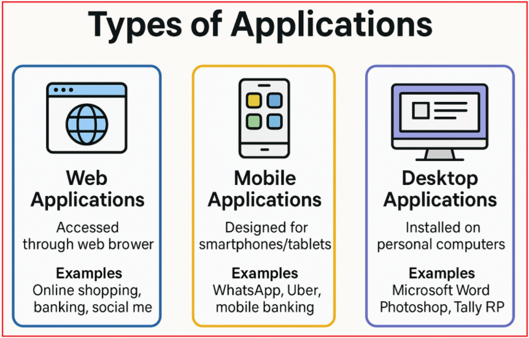

## **راه‌اندازی پروژه برای میکروسرویس‌ها در ASP.NET Core Web API**

توضیح خواهم داد **در این مقاله، تنظیمات پروژه برای میکروسرویس‌ها در ASP.NET Core Web API را** . پلتفرم‌های تجارت الکترونیک مدرن برای مدیریت میلیون‌ها کاربر و هزاران تراکنش روزانه ساخته شده‌اند. برای دستیابی به انعطاف‌پذیری، مقیاس‌پذیری و سهولت نگهداری، این سیستم‌ها با استفاده از معماری میکروسرویس‌ها توسعه داده می‌شوند.

در این پست، یک راهنمای گام به گام برای راه‌اندازی یک پروژه تجارت الکترونیک در ویژوال استودیو با استفاده از رویکرد میکروسرویس‌ها ارائه خواهم داد. هر میکروسرویس بر روی یک قابلیت تجاری خاص، مانند مدیریت کاربر، کاتالوگ محصولات، پردازش سفارش، پرداخت‌ها یا اعلان‌ها تمرکز دارد و امکان توسعه و استقرار مستقل را فراهم می‌کند. با پیروی از اصول معماری تمیز و طراحی دامنه‌محور، این تنظیمات پایه محکمی برای ساخت راه‌حل‌های تجارت الکترونیک قوی، قابل نگهداری و مقیاس‌پذیر تضمین می‌کند.

##### **اپلیکیشن تجارت الکترونیک چیست؟**

یک اپلیکیشن تجارت الکترونیک (مانند آمازون، فلیپ‌کارت یا مینترا) یک پلتفرم آنلاین است که کاربران می‌توانند در آن محصولات را مرور کنند، سفارش دهند، پرداخت انجام دهند و اعلان دریافت کنند. این اپلیکیشن تعاملات بین خریداران و فروشندگان را به صورت دیجیتالی مدیریت می‌کند و فرآیندهای کلیدی کسب و کار مانند مدیریت کاتالوگ محصولات، پردازش سفارش، تراکنش‌های پرداخت و ارتباطات را خودکار می‌کند. ویژگی‌های کلیدی عبارتند از:

- مرور و جستجوی محصول
- حساب‌های کاربری و پروفایل‌ها
- سبدهای خرید و ثبت سفارش
- پرداخت‌های امن
- پیگیری سفارشات و اعلان‌ها

در پشت صحنه، یک سیستم تجارت الکترونیک مدرن معمولاً با چندین سرویس مستقل (میکروسرویس) ساخته می‌شود که هر کدام یک قابلیت تجاری خاص را مدیریت می‌کنند. این جداسازی امکان انعطاف‌پذیری، مقیاس‌پذیری و نگهداری آسان‌تر را فراهم می‌کند. در ادامه، میکروسرویس‌های کلیدی موجود در یک برنامه تجارت الکترونیک آمده است.

##### **میکروسرویس کاربر**

این سرویس، عملکردهای مرتبط با کاربر، از جمله ثبت نام، احراز هویت، مدیریت پروفایل و مجوزها را مدیریت می‌کند. در زیر برخی از ویژگی‌های کلیدی میکروسرویس کاربر آمده است **:**

- ثبت نام کاربر (ثبت نام) و ورود (احراز هویت)
- مدیریت و تنظیم مجدد رمز عبور
- مدیریت نقش‌ها (مثلاً مدیر، مشتری، فروشنده)
- مدیریت آدرس (چندین آدرس ارسال/صورتحساب)
- امنیت با توکن‌های JWT یا OAuth2
- احراز هویت چند عاملی و ادغام ورود با شبکه‌های اجتماعی

**دلیل اهمیت:** هویت و امنیت کاربر، اساس هر پلتفرم تجارت الکترونیک است. این سرویس تضمین می‌کند که فقط کاربران احراز هویت شده می‌توانند اقداماتی مانند ثبت سفارش یا مدیریت پروفایل‌ها را انجام دهند.

##### **میکروسرویس محصول**

کاتالوگ محصول، شامل جزئیات محصول، دسته‌بندی‌ها، قیمت‌گذاری، موجودی و نظرات را مدیریت می‌کند. موارد زیر برخی از ویژگی‌های کلیدی میکروسرویس محصول هستند **:**

- عملیات CRUD برای محصولات (اضافه کردن، به‌روزرسانی، حذف، فهرست کردن)
- دسته‌بندی محصولات در دسته‌ها و زیردسته‌ها
- مدیریت موجودی کالا (سطح موجودی)
- تصاویر و توضیحات محصول
- جستجو و فیلتر بر اساس نام، دسته بندی، قیمت و موارد دیگر.
- مدیریت قیمت و تخفیف
- نظرات و رتبه‌بندی‌های مشتریان

**دلیل اهمیت:** این لایه داده، اطلاعاتی را در مورد آنچه کاربران جستجو و خریداری می‌کنند، فراهم می‌کند. داده‌های دقیق محصول و موجودی، مستقیماً بر تجربه مشتری و فروش تأثیر می‌گذارد.

##### **سفارش میکروسرویس**

چرخه حیات سفارشات مشتری را از زمان ثبت سفارش تا تحویل مدیریت می‌کند. در زیر برخی از ویژگی‌های کلیدی میکروسرویس سفارش آمده است **:**

- ایجاد سفارش (هنگام خروج مشتری)
- پیگیری وضعیت سفارش (ثبت‌شده، تأییدشده، ارسال‌شده، تحویل‌شده، لغوشده)
- مدیریت و اعتبارسنجی سبد خرید (بررسی موجودی/قیمت محصول)
- تاریخچه سفارشات برای کاربران
- مدیریت مرجوعی‌ها و لغو سفارش‌ها
- ادغام با سرویس‌های پرداخت و اعلان

**دلیل اهمیت:** قلب عملیات تجارت الکترونیک، خرید مشتریان را پیگیری می‌کند و پردازش و تکمیل روان سفارش را تضمین می‌کند.

##### **میکروسرویس پرداخت**

تمام پردازش‌های پرداخت و مدیریت تراکنش‌ها را مدیریت می‌کند. در زیر برخی از ویژگی‌های کلیدی میکروسرویس پرداخت آمده است **:**

- مدیریت روش‌های مختلف پرداخت (کارت، UPI، بانکداری اینترنتی، کیف پول و غیره)
- پردازش پرداخت و مدیریت تراکنش‌ها
- مجوز پرداخت، ضبط، بازپرداخت و مدیریت خرابی
- ذخیره سازی امن اطلاعات پرداخت حساس (انطباق با PCI)
- اطلاع رسانی نتایج پرداخت به سرویس سفارش

**دلیل اهمیت:** پردازش پرداخت امن، قابل اعتماد و انعطاف‌پذیر را تضمین می‌کند که برای جمع‌آوری درآمد و اعتماد مشتری بسیار مهم است.

##### **میکروسرویس اعلان**

اعلان‌ها را از طریق کانال‌های متعدد به کاربران ارسال می‌کند. در زیر برخی از ویژگی‌های کلیدی میکروسرویس اعلان آمده است **:**

- ایمیل، پیامک، اعلان‌های فوری
- پیام‌های قالب‌بندی‌شده برای تأیید سفارش، ارسال و رسیدهای پرداخت
- معماری رویداد محور که به رویدادهای سفارش و پرداخت گوش می‌دهد
- تلاش مجدد و مدیریت شکست
- تنظیمات برگزیده کاربر برای انواع اعلان‌ها

**دلیل اهمیت:** کاربران را در لحظه مطلع نگه می‌دارد و باعث بهبود تعامل و رضایت مشتری می‌شود.

##### **رویکرد توسعه پیشنهادی (ترتیب توسعه)**

1. **سرویس کاربر** (اول): با ثبت نام و احراز هویت کاربر شروع کنید. تقریباً تمام سرویس‌های دیگر به هویت کاربر بستگی دارند.
2. **خدمات محصول** (دوم): کاتالوگ خود را با محصولاتی برای نمایش و فروش پر کنید.
3. **سرویس سفارش** (سوم): پس از آماده‌سازی کاربران و محصولات، ثبت و مدیریت سفارش را فعال کنید.
4. **خدمات پرداخت** (چهارم): ادغام پرداخت پس از ثبت سفارش، و مرتبط کردن پرداخت‌ها با سفارش‌ها.
5. **سرویس اعلان** (آخرین): اعلان‌ها را در آخرین مرحله ایجاد کنید تا کاربران را در مورد فعالیت‌های سایر سرویس‌ها مطلع کنید.

##### **رویکردهای توسعه برای میکروسرویس‌ها**

هنگام ساخت میکروسرویس‌ها، نحوه سازماندهی کدبیس و پروژه‌های شما به طور قابل توجهی بر گردش کار توسعه، همکاری تیمی و فرآیندهای استقرار شما تأثیر می‌گذارد. دو رویکرد محبوب عبارتند از:

- راه حل مشترک واحد (سبک مونوروپو)
- راهکارهای جداگانه برای هر میکروسرویس (سبک Polyrepo)

##### **راه حل مشترک واحد (سبک مونوروپو)**

یک راهکار بزرگ ویژوال استودیو (.sln) شامل تمام میکروسرویس‌ها به عنوان پروژه است. هر میکروسرویس (مثلاً محصول، کاربر، سفارش) فقط یک پوشه یا پروژه در داخل همان راهکار است. هر میکروسرویس معمولاً از چندین پروژه (دامنه، برنامه، زیرساخت و API) در یک راهکار واحد تشکیل شده است. توسعه‌دهندگان کل کدبیس را کپی کرده و به طور همزمان روی آن کار می‌کنند.

مثل این است که تمام فروشگاه‌های مختلف شما (محصول، سفارش، کاربر) در یک ساختمان بزرگ قرار دارند. آنها می‌توانند به سرعت از یکدیگر چیزهایی قرض بگیرند زیرا همه چیز زیر یک سقف است.

###### **مزایا:**

- راه‌اندازی و پیمایش محلی آسان، همه میکروسرویس‌ها در یک مکان.
- اشکال‌زدایی و بازسازی بین سرویسی را ساده می‌کند.
- کتابخانه‌های مشترک یا کد مشترک را می‌توان به راحتی در پروژه‌ها بدون نیاز به انتشار بسته‌ها ارجاع داد.
- برای تیم‌های کوچک‌تر یا پروژه‌های اولیه که نیاز به توسعه سریع دارند، مناسب‌تر است.

###### **معایب:**

- با رشد پروژه، راه‌حل می‌تواند بزرگ و بارگذاری یا ساخت آن کند شود.
- احتمال تداخل در ادغام و سربار هماهنگی بین تیم‌هایی که روی میکروسرویس‌های مختلف کار می‌کنند.
- استقرار مستقل میکروسرویس‌ها در صورت عدم مدیریت صحیح می‌تواند پیچیده‌تر باشد.

##### **راهکارهای جداگانه برای هر میکروسرویس (سبک Polyrepo)**

خود **هر میکروسرویس در مخزن مستقل** با راهکار ویژوال استودیو مخصوص به خود توسعه داده می‌شود. پروژه‌های درون هر راهکار میکروسرویس به لایه‌های معماری پاک پایبند هستند اما مستقل هستند. میکروسرویس‌ها به طور مستقل ساخته، آزمایش و مستقر می‌شوند.

اکنون، هر فروشگاه (محصول، سفارش، کاربر) در ساختمان مخصوص به خود قرار دارد. آنها از طریق تلفن یا ایمیل (API، پیام‌رسانی) با یکدیگر در ارتباط هستند، اما هر کدام می‌توانند به طور مستقل قفل، بازسازی یا مقیاس‌بندی شوند. اگر یک فروشگاه از کار بیفتد، بقیه به کار خود ادامه می‌دهند.

###### **مزایا:**

- با مرزهای مشخص و مالکیت، هر تیم می‌تواند مستقل کار کند.
- راه‌حل‌های کوچک‌تر و سریع‌تر برای بارگذاری.
- امکان نسخه‌بندی مستقل و پیاده‌سازی پایپ‌لاین‌ها را برای هر میکروسرویس فراهم می‌کند.
- تداخلات ادغام بین تیمی را کاهش می‌دهد و امکان رشد مقیاس‌پذیرتر تیم را فراهم می‌کند.

###### **معایب:**

- اشتراک‌گذاری کد یا قراردادهای مشترک نیازمند بسته‌ها یا زیرماژول‌های جداگانه است که پیچیدگی را افزایش می‌دهد.
- اشکال‌زدایی و اصلاح کد بین میکروسرویس‌ها دشوارتر است.
- راه‌اندازی اولیه و زیرساخت برای چندین مخزن می‌تواند پیچیده‌تر باشد.

##### **روند صنعت و بهترین شیوه‌ها (با معماری پاک و DDD)**

**بهترین روش این است: *یک راهکار/مخزن برای هر میکروسرویس (پلی‌ریپو)***

- هر میکروسرویس (محصول، سفارش، کاربر، پرداخت و غیره) در مخزن گیت مخصوص به خود قرار دارد و فایل .sln مخصوص به خود را دارد.
- هر راهکار با استفاده از معماری پاک و DDD درون آن میکروسرویس سازماندهی شده است.
- هر میکروسرویس به طور مستقل ساخته، آزمایش و مستقر می‌شود.

**چرا؟**

- **با اصول میکروسرویس‌ها همسو است:** استقرار مستقل، داده‌های غیرمتمرکز، مالکیت تیمی.
- **معماری پاک و DDD:** هر میکروسرویس مدل دامنه، منطق و مرزهای خاص خود را دارد که با اصول DDD مطابقت دارد.
- **اتصال سست:** تمام ارتباطات بین سرویس‌ها را مجبور می‌کند از پروتکل‌های شبکه (مثلاً HTTP، gRPC، پیام‌رسانی) استفاده کنند، بدون هیچ میانبری.
- **مقیاس‌پذیری:** تیم‌ها و سرویس‌ها به طور طبیعی و بدون تداخل یا رقابت با یکدیگر، مقیاس‌پذیر می‌شوند.

**در مورد کد اشتراکی چطور؟**

- **از بسته‌های داخلی NuGet** (منتشر شده در رجیستری‌های خصوصی) برای ویژگی‌هایی مانند ثبت انتزاعات، موجودیت‌های پایه یا قراردادهای خطا استفاده کنید.
- از کتابخانه‌های بزرگ و اشتراکی «عمومی» اجتناب کنید؛ فقط چیزهایی را بسته‌بندی کنید که واقعاً عمومی و پایدار باشند.

##### **در دوره آموزشی خود از چه رویکردی استفاده خواهیم کرد؟**

ما با یک راهکار مشترک ویژوال استودیو شروع خواهیم کرد که شامل تمام پروژه‌های میکروسرویس ما (API + Domain + Application + Infrastructure به ازای هر میکروسرویس) می‌شود. ما از این راهکار مشترک در طول دوره و توسعه خود برای ساده‌سازی کدنویسی، اشکال‌زدایی و یادگیری معماری پاک و DDD استفاده خواهیم کرد.

با رشد پروژه ما، وقتی استقرار مستقل در اولویت قرار گیرد، هر میکروسرویس را در راهکار یا مخزن مخصوص به خود استخراج خواهیم کرد. برای محیط‌های عملیاتی یا سازمانی، بهترین روش این است که برای هر میکروسرویس، راهکارها یا مخازن جداگانه‌ای داشته باشیم تا استقلال عملیاتی تضمین شود.

##### **راه‌اندازی پروژه:**

ایجاد یک سیستم تجارت الکترونیک با استفاده از میکروسرویس‌ها. باز هم، هر میکروسرویس از ۵ پروژه به شرح زیر تشکیل شده است.

- دامنه (کتابخانه کلاس)
- برنامه (کتابخانه کلاس)
- زیرساخت (کتابخانه کلاس)
- API (ASP.NET Core Web API)
- تست‌ها (پروژه تست xUnit)

##### **مرحله ۱: ایجاد راه‌حل ریشه**

1. را باز کنید **ویژوال استودیو** .
2. کلیک کنید **روی فایل > جدید > پروژه** .
3. را جستجو کرده **عبارت Blank Solution** و آن را انتخاب کنید.
4. کلیک کنید **روی بعدی** .
5. نام راه‌حل را ECommerceSystem بگذارید.
6. مکانی را که می‌خواهید راه‌حل را در آن ذخیره کنید انتخاب کنید (مثلاً D:\\Projects\\ECommerceSystem).
7. کلیک کنید **روی ایجاد** .

##### **مرحله 2: ایجاد پوشه‌های راه‌حل برای میکروسرویس‌ها**

1. در **Solution Explorer** کلیک راست کنید **، روی Solution (ECommerceSystem)** .
2. انتخاب کنید **افزودن > پوشه راه‌حل جدید را** .
3. نام آن را UserService بگذارید.
4. مراحل ۱ تا ۳ را برای پوشه‌های دیگر میکروسرویس‌ها تکرار کنید:
	- خدمات محصول
		- سفارش خدمات
		- خدمات پرداخت
		- سرویس اعلان

اکنون باید همانطور که در تصویر زیر نشان داده شده است، راه‌حل خود را با ۵ پوشه راه‌حل ببینید.

##### **مرحله ۳: اضافه کردن پروژه‌ها برای UserService (برای بقیه پروژه‌ها تکرار کنید)**

بیایید یک میکروسرویس (UserService) را بررسی کنیم و سپس این فرآیند را برای بقیه تکرار کنیم.

##### **پروژه افزودن دامنه**

1. روی پوشه‌ی راهکار (مثلاً UserService) کلیک راست کنید.
2. انتخاب کنید **افزودن > پروژه جدید را** .
3. را انتخاب کنید **قالب کتابخانه کلاس (.NET Core)** و **نسخه چارچوب (.NET 8)** .
4. نام آن را **UserService.Domain** بگذارید .
5. کلیک کنید **روی ایجاد** .

##### **اضافه کردن پروژه زیرساخت**

1. روی پوشه‌ی راهکار (مثلاً UserService) کلیک راست کنید.
2. انتخاب کنید **افزودن > پروژه جدید را** .
3. را انتخاب کنید **قالب کتابخانه کلاس (.NET Core)** و **نسخه چارچوب (.NET 8)** .
4. نام آن را **UserService.Infrastructure** بگذارید .
5. کلیک کنید **روی ایجاد** .

**افزودن مرجع پروژه:** روی UserService.Infrastructure کلیک راست کنید → **Add → Project Reference** → UserService.Domain را تیک بزنید.

##### **اضافه کردن پروژه برنامه**

1. روی پوشه‌ی راهکار (مثلاً UserService) کلیک راست کنید.
2. انتخاب کنید **افزودن > پروژه جدید را** .
3. را انتخاب کنید **قالب کتابخانه کلاس (.NET Core)** و **نسخه چارچوب (.NET 8)** .
4. نام آن را **UserService.Application** بگذارید .
5. کلیک کنید **روی ایجاد** .

**افزودن مرجع پروژه:** روی UserService.Application کلیک راست کنید → **Add → Project Reference** → UserService.Domain و UserService.Application را بررسی کنید.

##### **اضافه کردن پروژه API**

1. روی پوشه‌ی راهکار (مثلاً UserService) کلیک راست کنید.
2. انتخاب کنید **افزودن > پروژه جدید را** .
3. را انتخاب کنید قالب ASP.NET **Core Web API** و نسخه .NET **8 Framework** .
4. نام آن را **UserService.API** بگذارید .
5. کلیک کنید **روی ایجاد** .

**افزودن منابع:** روی UserService.API کلیک راست کنید → **افزودن → مرجع پروژه** → گزینه های UserService.Application و UserService.Infrastructure را بررسی کنید.

##### **اضافه کردن پروژه تست (xUnit)**

- کلیک راست کنید **روی پوشه‌ی UserService** solution **→ Add → New Project** .
- را انتخاب کنید **نسخه xUnit Test Project (.NET Core)** و **(.NET 8) Framework** .
- نام: **UserService.Tests**
- کلیک کنید **روی ایجاد** .

**افزودن ارجاعات:** روی UserService.Tests کلیک راست کنید → **Add → Project Reference** → UserService.Domain و UserService.Application (و UserService.Infrastructure را در صورت تمایل به انجام تست‌های یکپارچه‌سازی) تیک بزنید.

با این کار، راه‌حل پروژه شما باید به شکل زیر باشد:

همین کار را برای سایر سرویس‌ها با قراردادهای نامگذاری زیر انجام دهید:

##### **خدمات محصول – پوشه راهکارها**

- دامنه محصول/سرویس
- خدمات محصول. زیرساخت
- محصول، خدمات. کاربرد
- رابط برنامه‌نویسی کاربردی محصول و خدمات
- خدمات محصول. تست‌ها

##### **پوشه‌ی راهکارها - OrderService**

- سفارش سرویس.دامنه
- سفارش سرویس.زیرساخت
- سفارش سرویس.اپلیکیشن
- OrderService.API
- سفارش سرویس.تست‌ها

##### **خدمات پرداخت – پوشه راهکارها**

- دامنه PaymentService
- زیرساخت خدمات پرداخت
- اپلیکیشن خدمات پرداخت
- سرویس پرداخت.API
- خدمات پرداخت. آزمون‌ها

##### **NotificationService – پوشه راهکارها**

- سرویس اعلان. دامنه
- زیرساخت سرویس اعلان
- سرویس اعلان.برنامه
- NotificationService.API
- NotificationService.Tests

در ادامه ساختار کامل پوشه‌ها به همراه تمام میکروسرویس‌ها آمده است.

با سازماندهی برنامه تجارت الکترونیک خود به میکروسرویس‌های اختصاصی در یک راهکار ویژوال استودیو، از مزایای تفکیک واضح مسائل، مدیریت آسان‌تر کد و همکاری تیمی مقیاس‌پذیر بهره‌مند می‌شویم.

این ساختار پروژه نه تنها فرآیند توسعه را ساده می‌کند، بلکه با استانداردهای صنعت برای ساخت سیستم‌های توزیع‌شده مدرن نیز همسو است. با تکامل پروژه ما، می‌توانیم با انتقال به راهکارها و مخازن جداگانه برای هر میکروسرویس، مقیاس‌پذیری و استقلال را بیشتر افزایش دهیم.