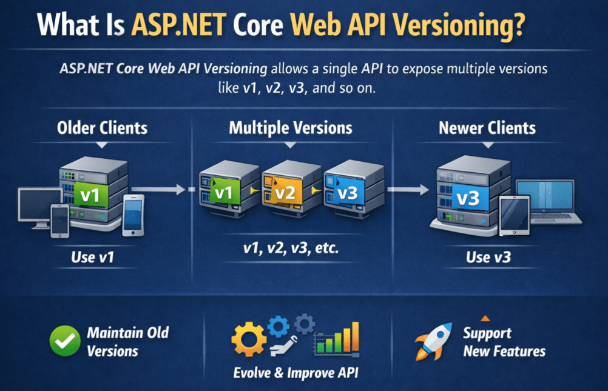
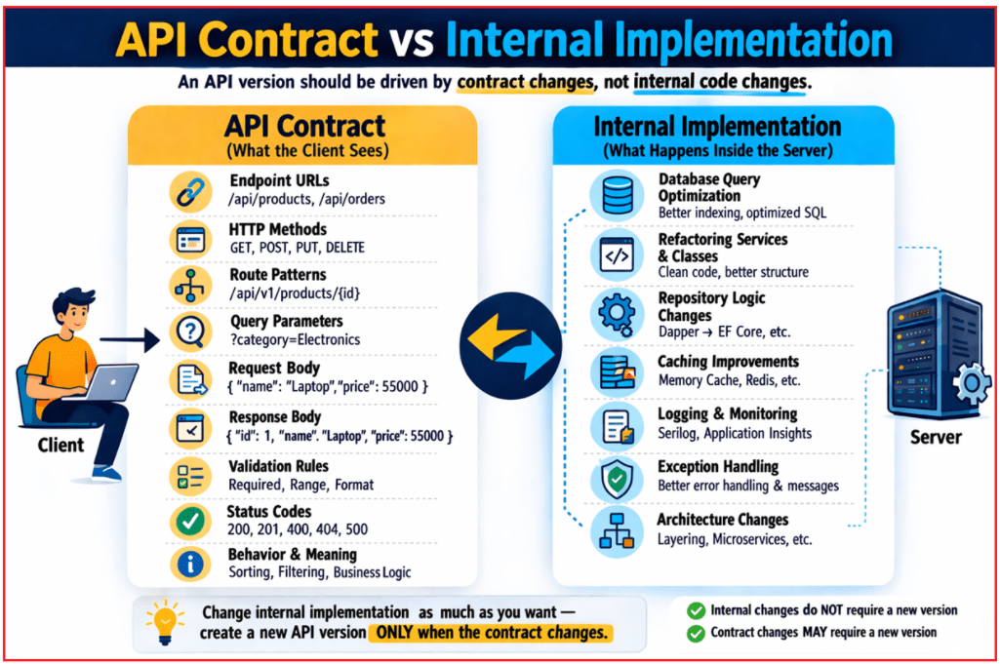
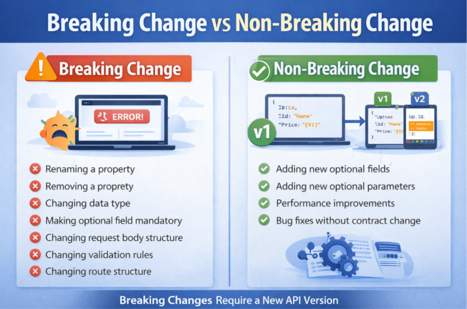
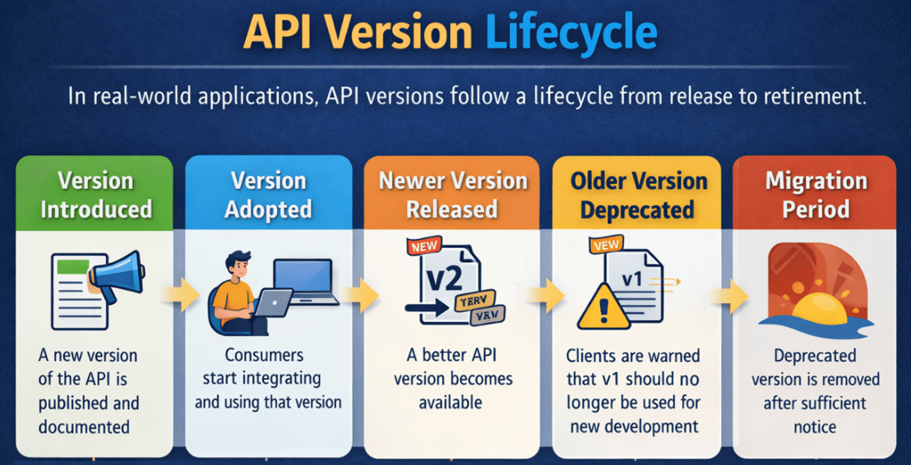
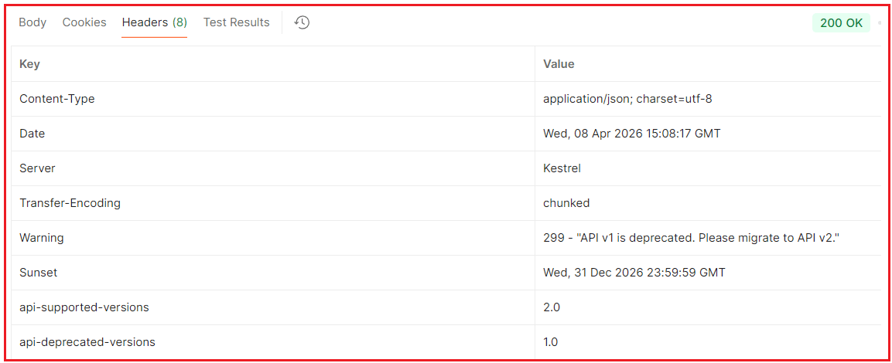

## **نسخه‌بندی API وب ASP.NET Core**

وقتی یک ASP.NET Core Web API می‌سازیم و منتشر می‌کنیم، کلاینت‌های مختلف شروع به استفاده از آن می‌کنند. این کلاینت‌ها ممکن است برنامه‌های Angular یا React، برنامه‌های موبایل، برنامه‌های دسکتاپ، سیستم‌های شخص ثالث یا میکروسرویس‌های داخلی باشند. هنگامی که این مصرف‌کنندگان شروع به تکیه بر قرارداد API می‌کنند، تغییر بی‌دقت آن خطرناک می‌شود زیرا کلاینت‌های موجود ممکن است از کار بیفتند یا رفتار غیرمنتظره‌ای داشته باشند.

دقیقاً همین جاست که **نسخه‌بندی API** اهمیت پیدا می‌کند. نسخه‌بندی API به ما این امکان را می‌دهد که API خود را به روشی کنترل‌شده تکامل دهیم. به جای تغییر قرارداد موجود و از کار انداختن کلاینت‌های موجود، می‌توانیم نسخه قدیمی‌تر را برای کلاینت‌های موجود در دسترس نگه داریم و نسخه جدیدتری را برای کلاینت‌های جدید معرفی کنیم. به عبارت دیگر، نسخه‌بندی به ما کمک می‌کند تا API را بدون مجبور کردن هر مصرف‌کننده به مهاجرت فوری بهبود بخشیم.

#### **نسخه‌بندی API وب ASP.NET Core چیست؟**

نسخه‌بندی ASP.NET Core Web API تکنیکی است که به یک API واحد اجازه می‌دهد نسخه‌های متعددی مانند v1، v2، v3 و غیره را در معرض نمایش قرار دهد. هر نسخه نشان‌دهنده قراردادی است که کلاینت‌ها می‌توانند به آن وابسته باشند. کلاینت‌های قدیمی‌تر ممکن است به استفاده از قرارداد قدیمی‌تر ادامه دهند، در حالی که کلاینت‌های جدیدتر می‌توانند از قرارداد بهبود یافته استفاده کنند. این بدان معناست که API می‌تواند بدون از کار انداختن همه مصرف‌کنندگان موجود، تکامل یابد.



به زبان ساده، نسخه‌بندی API به ما کمک می‌کند تا به سه هدف دست یابیم:

- مشتریان فعلی همچنان به کار خود ادامه می‌دهند
- مشتریان جدید می‌توانند از قابلیت‌ها و قراردادهای بهبود یافته استفاده کنند
- API می‌تواند با گذشت زمان و بدون ایجاد اختلال در یکپارچه‌سازی‌های موجود، با خیال راحت تکامل یابد.

به همین دلیل است که نسخه‌بندی در برنامه‌های سازمانی بلادرنگ، APIهای عمومی، بک‌اندهای موبایل و اکوسیستم‌های میکروسرویس بسیار مهم می‌شود.

#### **قرارداد API در مقابل پیاده‌سازی داخلی**

هدایت شود **یک نسخه API باید توسط تغییرات قرارداد** ، نه توسط تغییرات کد داخلی.

##### **قرارداد API چیست؟**

قرارداد API چیزی است که کلاینت می‌بیند و به آن وابسته است، مانند:

- URL های نقطه پایانی
- روش‌های HTTP
- الگوهای مسیر
- پارامترهای پرس و جو
- درخواست ساختار بدنه
- ساختار بدن پاسخ دهنده
- قوانین اعتبارسنجی
- کدهای وضعیت
- معنی و رفتار نقطه پایانی

##### **اجرای داخلی چیست؟**

پیاده‌سازی داخلی همان چیزی است که در داخل سرور اتفاق می‌افتد، مانند:

- بهینه‌سازی پرس‌وجو در پایگاه داده
- بازسازی کلاس‌های سرویس
- بهبود ثبت وقایع
- تغییر منطق مخزن
- بهبودهای ذخیره‌سازی
- مدیریت بهتر استثنائات
- تغییر معماری داخلی

این بهبودهای داخلی معمولاً **در صورتی که قرارداد سمت کلاینت سازگار باقی بماند، نیازی به نسخه جدید API ندارند** . بنابراین، ما فقط زمانی باید نسخه جدید ایجاد کنیم که قرارداد به گونه‌ای تغییر کند که بتواند بر مصرف‌کنندگان تأثیر بگذارد. برای درک بهتر، لطفاً به تصویر زیر نگاهی بیندازید.



#### **چرا به نسخه‌بندی API نیاز داریم؟**

بیایید این را با یک مثال عملی درک کنیم. فرض کنید امروز یک نقطه پایانی ساده Web API منتشر می‌کنید:

- **دریافت /api/products**

برمی‌گرداند:

```json
{
  "Id": 1,
  "Name": "Laptop"
}
```

پس از مدتی، کسب و کار درخواست تغییراتی مانند موارد زیر را می‌کند:

- قیمت را اضافه کنید
- افزودن دسته
- تغییر نام به نام محصول
- تغییر قوانین اعتبارسنجی
- اجباری کردن برخی از فیلدها
- حذف برخی از فیلدهای قدیمی

اگر قرارداد API موجود را مستقیماً تغییر دهید، ممکن است کلاینت‌های قدیمی‌تر از کار بیفتند.

برای مثال:

- یک برنامه تلفن همراه که قبلاً در فروشگاه Play منتشر شده است، ممکن است هنوز انتظار فرمت پاسخ قدیمی را داشته باشد.
- ادغام شخص ثالث ممکن است هنوز به نام بستگی داشته باشد
- یک برنامه داخلی قدیمی ممکن است همچنان بدنه درخواست قدیمی را ارسال کند
- ممکن است یک رابط کاربری که در محیط عملیاتی مستقر شده است، هنوز برای مدیریت قرارداد جدید به‌روزرسانی نشده باشد.

بنابراین، نسخه‌بندی به دلایل زیر مورد نیاز است:

- تغییر الزامات کسب و کار
- کلاینت‌ها با سرعت‌های مختلف به‌روزرسانی می‌شوند
- ممکن است ادغام‌ها تحت کنترل شما نباشند
- تغییر بی‌دقت قراردادها می‌تواند سیستم‌های تولید را از کار بیندازد.

به عبارت ساده، **نسخه‌بندی API به معنای نگهداری چندین نسخه از یک قرارداد API است تا کلاینت‌های قدیمی‌تر به کار خود ادامه دهند در حالی که کلاینت‌های جدیدتر می‌توانند نسخه بهبود یافته را اتخاذ کنند** .

#### **چه زمانی باید یک نسخه جدید API ایجاد کنیم؟**

ایجاد می‌کنیم، یک نسخه API جدید ایجاد می‌کنیم **ما معمولاً وقتی یک تغییر اساسی** . یک قانون بسیار کاربردی این است: **اگر یک کلاینت موجود برای ادامه کار صحیح باید کد خود را تغییر دهد، احتمالاً این تغییر به یک نسخه API جدید نیاز دارد.** برای درک بهتر، لطفاً به تصویر زیر نگاهی بیندازید.



##### **تغییر ناگهانی چیست؟**

تغییر بازدارنده، **هر تغییری است که ممکن است یک کلاینت موجود را مجبور به تغییر کد خود کند** .

###### **نمونه‌های رایج از تغییرات ناگهانی**

این تغییرات می‌تواند کلاینت‌های موجود را از کار بیندازد:

- تغییر نام یک ویژگی پاسخ
- حذف یک ویژگی پاسخ
- تغییر نوع داده یک فیلد
- تغییر ساختار بدنه درخواست
- اجباری کردن یک فیلد اختیاری
- تغییر قوانین اعتبارسنجی به گونه‌ای که درخواست‌های قدیمی‌تر را رد کند
- تغییر ساختار مسیر به گونه‌ای که کلاینت‌های قدیمی دیگر با آن مطابقت نداشته باشند
- تغییر رفتار کد وضعیت به نحوی که کلاینت‌ها به آن وابسته باشند
- بازگرداندن یک مدل پاسخ کاملاً متفاوت
- تغییر غیرمنتظره الزامات احراز هویت

###### **مثال**

فرض کنید نسخه ۱ خروجی زیر را می‌دهد:

```json
{
  "Id": 1,
  "Name": "Laptop"
}
```

اکنون در نسخه ۲، نام Name را به ProductName تغییر می‌دهید:

```json
{
  "Id": 1,
  "ProductName": "Laptop"
}
```

این یک تغییر اساسی است زیرا مشتریان قدیمی‌تر هنوز به دنبال نام هستند.

##### **تغییر بدون شکست چیست؟**

تغییر غیر مخرب، تغییری است که نیازی به به‌روزرسانی فوری کلاینت‌های فعلی ندارد.

###### **نمونه‌های رایج از تغییرات غیرقابل‌انکار**

اگر این موارد با دقت اجرا شوند، معمولاً نیازی به نسخه جدید ندارند:

- اضافه کردن یک فیلد پاسخ اختیاری جدید
- افزودن یک پارامتر پرس‌وجوی اختیاری جدید
- بهبود عملکرد داخلی
- رفع اشکالات داخلی بدون تغییر قرارداد
- بهبود ثبت وقایع، ردیابی یا ذخیره‌سازی موقت
- تغییر منطق داخلی پایگاه داده در عین حفظ رفتار API یکسان

مثلاً این را تغییر دهید:

```json
{
  "Id": 1,
  "Name": "Laptop"
}
```

به این:

```json
{
  "Id": 1,
  "Name": "Laptop",
  "Price": 55000
}
```

اگر کلاینت‌های موجود با خیال راحت فیلدهای ناشناخته را نادیده بگیرند، ممکن است غیرقابل شکستن باشد.

**نکته مهم:** حتی چیزی که به نظر می‌رسد بدون مشکل است، هنوز می‌تواند برخی از کلاینت‌های دقیق را خراب کند. به عنوان مثال، اضافه کردن یک فیلد پاسخ جدید معمولاً ایمن در نظر گرفته می‌شود، اما یک کلاینت با کد ضعیف که شکل پاسخ را به طور دقیق اعتبارسنجی می‌کند، ممکن است با شکست مواجه شود (به دلیل اعتبارسنجی دقیق طرحواره، deserialization دقیق JSON یا فرضیات دقیق قرارداد پاسخ). بنابراین، سازگاری با نسخه‌های قبلی همیشه باید با دقت ارزیابی شود.

#### **چرخه حیات نسخه API**

در سیستم‌های دنیای واقعی، نسخه‌های API از یک چرخه حیات عبور می‌کنند. درک این چرخه حیات مهم است زیرا نسخه‌بندی API نه تنها مربوط به انتشار نسخه‌های جدید است، بلکه به مدیریت صحیح نسخه‌های قدیمی‌تر نیز مربوط می‌شود تا کلاینت‌های موجود به طور ناگهانی تحت تأثیر قرار نگیرند. برای درک بهتر، لطفاً به تصویر زیر نگاهی بیندازید.



##### **مراحل:**

1. **نسخه معرفی شده** : یک نسخه جدید API منتشر و برای مصرف‌کنندگان مستندسازی می‌شود. در این مرحله، توسعه‌دهندگان قرارداد جدید را منتشر می‌کنند، نحوه استفاده از آن را توضیح می‌دهند و آن را در دسترس برنامه‌های کلاینت قرار می‌دهند.
2. **نسخه پذیرفته‌شده** : پس از انتشار نسخه، مشتریان شروع به ادغام آن در برنامه‌های خود می‌کنند. برخی از مصرف‌کنندگان ممکن است بلافاصله آن را بپذیرند، در حالی که برخی دیگر ممکن است تا زمانی که آماده ارتقا نباشند، به استفاده از نسخه قدیمی‌تر ادامه دهند.
3. **نسخه جدیدتر منتشر شد** : با تغییر نیازهای تجاری، ممکن است نسخه جدیدتری از API معرفی شود. این نسخه جدید ممکن است شامل مدل‌های پاسخ بهتر، ویژگی‌های اضافی، قوانین اعتبارسنجی بهبود یافته یا سایر تغییرات قرارداد باشد.
4. **نسخه قدیمی منسوخ شده** : وقتی نسخه بهتری در دسترس قرار می‌گیرد، نسخه قدیمی ممکن است به عنوان **منسوخ شده** علامت‌گذاری شود . منسوخ شدن به این معنی نیست که نسخه بلافاصله از کار می‌افتد. این فقط به این معنی است که نسخه هنوز برای کاربران موجود در دسترس است، اما دیگر برای توسعه جدید توصیه نمی‌شود. این به عنوان هشداری برای مصرف‌کنندگان است تا برای ارتقاء به نسخه جدیدتر برنامه‌ریزی کنند.
5. **دوره مهاجرت** : پس از منسوخ شدن یک نسخه API، معمولاً به مصرف‌کنندگان یک دوره گذار برای مهاجرت برنامه‌هایشان داده می‌شود. این موضوع در سیستم‌های دنیای واقعی بسیار مهم است زیرا ممکن است مشتریان برای به‌روزرسانی کد خود، آزمایش تغییرات و استقرار ایمن بدون ایجاد اختلال در سیستم‌های تولید، به زمان نیاز داشته باشند.
6. **پایان پشتیبانی یا بازنشستگی** : پس از اطلاع‌رسانی کافی و زمان مهاجرت کافی، نسخه منسوخ‌شده در نهایت بازنشسته یا حذف می‌شود. در این مرحله، انتظار می‌رود مشتریان از نسخه جدیدتر پشتیبانی‌شده استفاده کنند. پایان پشتیبانی به کاهش سربار نگهداری کمک می‌کند و به سیستم اجازه می‌دهد بدون نیاز به پشتیبانی دائمی از قراردادهای منسوخ‌شده، به جلو حرکت کند.

###### **چرا این چرخه حیات اهمیت دارد؟**

این چرخه حیات مهم است زیرا نسخه‌بندی API فقط مربوط به ایجاد نسخه‌های متعدد نیست. بلکه مربوط به مدیریت مسئولانه تغییرات نیز می‌شود. یک چرخه حیات API خوب به مشتریان زمان کافی برای سازگاری می‌دهد، خطر از بین رفتن ادغام‌های موجود را کاهش می‌دهد و به سازمان‌ها کمک می‌کند تا APIهای خود را به روشی کنترل‌شده، حرفه‌ای و قابل پیش‌بینی حفظ کنند.

#### **استراتژی‌های نسخه‌بندی موجود در ASP.NET Core Web API**

ASP.NET Core Web API از طریق کتابخانه نسخه‌بندی API از چندین مکانیسم نسخه‌بندی پشتیبانی می‌کند. این چارچوب می‌تواند نسخه درخواستی را از درخواست HTTP ورودی با استفاده از تکنیک‌های مختلف بخواند.

رایج‌ترین مکانیسم‌های نسخه‌بندی عبارتند از:

1. **نسخه‌بندی رشته پرس‌وجو.** مثال: /api/products?api-version=1.0
2. **نسخه‌بندی هدر (هدر سفارشی).** مثال: api-version: 1.0
3. **نسخه‌بندی نوع رسانه (مذاکره محتوا).** مثال: پذیرش: application/json;v=1.0
4. **نسخه‌بندی مسیر URL.** مثال: /api/v1.0/products

هیچ استراتژی نسخه‌بندی کاملاً بی‌نقصی وجود ندارد. رویکرد صحیح به موارد زیر بستگی دارد:

- چه کسی از API استفاده می‌کند؟
- اینکه آیا API عمومی است یا داخلی
- چقدر می‌خواهید نسخه قابل مشاهده باشد
- چقدر می‌خواهید آزمایش آسان باشد؟
- مصرف‌کنندگان API چقدر بالغ هستند؟

به طور کلی:

- نسخه‌بندی رشته‌های کوئری برای یادگیری و آزمایش ساده‌ترین روش است.
- نسخه‌بندی هدر، آدرس‌های اینترنتی (URL) را تمیز نگه می‌دارد اما کمتر قابل مشاهده است. در APIهای داخلی استفاده می‌شود.
- نسخه‌بندی نوع رسانه بیشتر به سبک HTTP است اما برای مبتدیان دشوارتر است. زمانی استفاده می‌شود که مذاکره محتوا را ترجیح می‌دهید.
- نسخه‌بندی مسیر URL برای APIهای عمومی ساده‌ترین روش است.

#### **ایجاد پروژه و نصب بسته**

یک پروژه جدید ASP.NET Core Web API با نام **APIVersioningDemo** ایجاد کنید .

در حین ایجاد پروژه:

- فعال کردن پشتیبانی OpenAPI/Swagger
- استفاده از کنترلرها
- فعال نگه داشتن HTTPS

سپس بسته‌های NuGet زیر را نصب کنید:

- **نصب بسته Asp.Versioning.Mvc**
- **نصب بسته Asp.Versioning.Mvc.ApiExplorer**

###### **چرا این بسته‌ها؟**

- **Asp.Versioning.Mvc:** این بسته پشتیبانی از نسخه‌بندی API را برای برنامه‌های ASP.NET Core MVC و Web API فراهم می‌کند.
- **Asp.Versioning.Mvc.ApiExplorer:** این بسته پشتیبانی از مرورگر API آگاه از نسخه را ارائه می‌دهد که برای ادغام Swagger/OpenAPI بسیار حیاتی است.

#### **ایجاد مدل‌ها:**

یک **پوشه Models** ایجاد کنید .

##### **مدل‌ها/محصولات.cs**

یک فایل کلاس با نام **Product.cs** در **پوشه Models** ایجاد کنید و کد زیر را در آن کپی و پیست کنید.

```csharp
namespace APIVersioningDemo.Models
{
    public class Product
    {
        public int Id { get; set; }

        // Common product name used by all API versions.
        public string Name { get; set; } = string.Empty;

        // Introduced for newer versions. V1 will ignore this field.
        public decimal? Price { get; set; }

        // Internal tracking field. Not exposed in V1 response.
        public DateTime CreatedOnUtc { get; set; } = DateTime.UtcNow;
    }
}
```

##### **مدل‌ها/فروشگاه محصول.cs**

یک فایل کلاس با نام **ProductStore.cs** در **پوشه Models** ایجاد کنید و کد زیر را کپی و در آن قرار دهید.

```csharp
namespace APIVersioningDemo.Models
{
    public static class ProductStore
    {
        // Lock object to make add operations safer in this in-memory example.
        private static readonly object _lock = new();

        // Shared in-memory data source used by both V1 and V2 controllers.
        private static readonly List<Product> _products = new()
        {
            new Product { Id = 1, Name = "Laptop", Price = 55000, CreatedOnUtc = DateTime.UtcNow },
            new Product { Id = 2, Name = "Smartphone", Price = 25000, CreatedOnUtc = DateTime.UtcNow }
        };

        public static List<Product> GetAll()
        {
            // Returning ordered data makes API output more predictable.
            return _products.OrderBy(p => p.Id).ToList();
        }

        public static Product? GetById(int id)
        {
            return _products.FirstOrDefault(p => p.Id == id);
        }

        public static Product Add(Product product)
        {
            lock (_lock)
            {
                // Generate the next ID manually because we are not using a database here.
                product.Id = _products.Any() ? _products.Max(p => p.Id) + 1 : 1;
                product.CreatedOnUtc = DateTime.UtcNow;

                _products.Add(product);
                return product;
            }
        }
    }
}
```

#### **ایجاد DTO ها**

در برنامه‌های واقعی، ما نباید مدل‌های دامنه یا موجودیت خود را مستقیماً در اختیار مصرف‌کنندگان API قرار دهیم. در عوض، از DTOها استفاده می‌کنیم.

DTO ها به ما کمک می‌کنند:

- کنترل آنچه در معرض دید است
- پاسخ‌های مختص نسخه شکل
- فیلدهای داخلی را مخفی کنید
- اعمال قوانین اعتبارسنجی بر اساس نسخه
- قراردادهای API را تمیز و پایدار نگه دارید

این امر به ویژه در نسخه‌بندی API مفید است زیرا نسخه ۱ و نسخه ۲ ممکن است اشکال قرارداد متفاوتی را ارائه دهند، حتی اگر از یک مدل داخلی استفاده کنند.

##### **ایجاد DTO های مخصوص نسخه**

یک پوشه به نام **DTOs** ایجاد کنید . درون آن، دو زیرپوشه ایجاد کنید:

- وی۱
- وی۲

##### **DTOها/V1/ProductCreateRequestV1Dto.cs**

یک فایل کلاس با نام **ProductCreateRequestV1Dto.cs** در **پوشه DTOs/V1** ایجاد کنید و کد زیر را در آن کپی و پیست کنید.

```csharp
using System.ComponentModel.DataAnnotations;

namespace APIVersioningDemo.DTOs.V1
{
    public class ProductCreateRequestV1Dto
    {
        [Required(ErrorMessage = "Product name is required.")]
        [StringLength(100, MinimumLength = 2, ErrorMessage = "Product name must be between 2 and 100 characters.")]
        public string Name { get; set; } = string.Empty;
    }
}
```

##### **DTOها/V1/ProductResponseV1Dto.cs**

یک فایل کلاس با نام **ProductResponseV1Dto.cs** در **پوشه DTOs/V1** ایجاد کنید و کد زیر را کپی و جایگذاری کنید.

```csharp
namespace APIVersioningDemo.DTOs.V1
{
    public class ProductResponseV1Dto
    {
        public int Id { get; set; }
        public string Name { get; set; } = string.Empty;
    }
}
```

##### **DTOها/V2/ProductCreateRequestV2Dto.cs**

یک فایل کلاس با نام **ProductCreateRequestV2Dto.cs** در **پوشه DTOs/V2** ایجاد کنید و کد زیر را در آن کپی و پیست کنید.

```csharp
using System.ComponentModel.DataAnnotations;

namespace APIVersioningDemo.DTOs.V2
{
    public class ProductCreateRequestV2Dto
    {
        [Required(ErrorMessage = "Product name is required.")]
        [StringLength(100, MinimumLength = 2, ErrorMessage = "Product name must be between 2 and 100 characters.")]
        public string Name { get; set; } = string.Empty;

        [Range(typeof(decimal), "0.01", "99999999", ErrorMessage = "Price must be greater than zero.")]
        public decimal Price { get; set; }
    }
}
```

##### **DTOها/V2/ProductResponseV2Dto.cs**

یک فایل کلاس با نام **ProductResponseV2Dto.cs** در **پوشه DTOs/V2** ایجاد کنید و کد زیر را کپی و در آن قرار دهید.

```csharp
namespace APIVersioningDemo.DTOs.V2
{
    public class ProductResponseV2Dto
    {
        public int Id { get; set; }
        public string Name { get; set; } = string.Empty;
        public decimal Price { get; set; }
    }
}
```

##### **ویژگی‌های مهم مورد استفاده در نسخه‌بندی API وب ASP.NET Core**

کتابخانه نسخه‌بندی API چندین ویژگی مهم ارائه می‌دهد.

- **\[ApiVersion(“1.0”)\]:** این به ASP.NET Core می‌گوید که کنترلر یا اکشن متعلق به API نسخه ۱.۰ است.
- **\[ApiVersion(“2.0”)\]:** این به ASP.NET Core می‌گوید که کنترلر یا اکشن متعلق به API نسخه ۲.۰ است.
- **\[MapToApiVersion(“1.0”)\]:** این مورد در یک متد اکشن برای نگاشت آن اکشن به طور خاص به نسخه ۱.۰ استفاده می‌شود.
- **\[MapToApiVersion(“2.0”)\]:** این مورد در یک متد اکشن برای نگاشت آن اکشن به طور خاص به نسخه ۲.۰ استفاده می‌شود.
- **\[ApiVersionNeutral\]:** این مورد زمانی استفاده می‌شود که یک نقطه پایانی نباید به هیچ نسخه‌ای وابسته باشد، مانند بررسی سلامت یا نقاط پایانی وضعیت.

##### **\[ApiVersion\] در مقابل \[MapToApiVersion\]**

به طور کلی:

- در سطح کنترلر استفاده کنید **از \[ApiVersion(…)\]** وقتی کل کنترلر به یک نسخه تعلق دارد،
- در سطح اکشن استفاده کنید . **از \[MapToApiVersion(…)\]** وقتی یک کنترلر شامل اکشن‌هایی برای چندین نسخه است،

**مثال:**

- **کنترلر جداگانه برای هر نسخه** : معمولاً وقتی نسخه‌ها تفاوت قابل توجهی دارند، آسان‌تر و تمیزتر است.
- **همان کنترلر با اکشن‌های نگاشت‌شده بر اساس نسخه** : زمانی مفید است که اکثر اکشن‌ها مشترک باشند و فقط تعداد کمی از اکشن‌ها بر اساس نسخه متفاوت باشند.

بنابراین، **\[MapToApiVersion\]** همیشه مورد نیاز نیست. در طرحی که هر کنترلر از قبل به یک نسخه اختصاص داده شده است، \[ApiVersion\] در سطح کنترلر معمولاً کافی است.

##### **نسخه‌بندی بر اساس کنترلر در مقابل نسخه‌بندی بر اساس عمل**

دو سبک طراحی رایج وجود دارد.

##### **کنترلر جداگانه برای هر نسخه**

مثال:

- محصولاتV1Controller
- محصولاتV2Controller

این رویکرد عبارت است از:

- درک آسان‌تر
- برای تفاوت‌های بزرگ نسخه‌ها واضح‌تر است

##### **همان کنترلر با نگاشت اکشن**

مثال:

- یک کنترل‌کننده محصولات
- برخی از اقدامات به V1 نگاشت شده‌اند
- برخی از اقدامات به V2 نگاشت شده‌اند

این رویکرد زمانی مفید است که:

- بیشتر منطق مشترک است
- فقط چند عمل متفاوت است
- شما می‌خواهید تعداد کنترلرهای تکراری کمتر شود

#### **کنترلر نسخه ۱**

یک پوشه با نام V1 درون پوشه Controllers ایجاد کنید.

##### **کنترلرها/V1/ProductsV1Controller.cs**

یک فایل کلاس با نام **ProductsV1Controller.cs** در **پوشه Controllers/V1** ایجاد کنید و کد زیر را کپی و در آن قرار دهید. کد زیر نیازی به توضیح ندارد، بنابراین لطفاً برای درک بهتر، خطوط توضیحات را مطالعه کنید. کنترلر زیر برای آزمایش نسخه‌بندی رشته‌های کوئری، هدر و نوع رسانه استفاده خواهد شد، نه نسخه‌بندی مسیر URL.

```csharp
using Asp.Versioning;
using APIVersioningDemo.DTOs.V1;
using APIVersioningDemo.Models;
using Microsoft.AspNetCore.Mvc;

namespace APIVersioningDemo.Controllers.V1
{
    [ApiController]
    // Declares that this controller serves API Version 1.0.
    // Deprecated = true means Version 1 is still available,
    // but clients should plan to move to a newer version.
    [ApiVersion("1.0", Deprecated = true)]

    // Base Route used by this controller.
    // Since this example is using non-URL versioning styles
    // such as Query String, Header, or Media Type versioning,
    // the version is not part of the URL path here.
    [Route("api/products")]
    public class ProductsV1Controller : ControllerBase
    {
        // Handles GET: /api/products for API Version 1.0
        [HttpGet(Name = "GetProductsV1")]

        // Documents that this action returns HTTP 200 OK
        // along with a collection of ProductResponseV1Dto objects.
        [ProducesResponseType(typeof(IEnumerable<ProductResponseV1Dto>), StatusCodes.Status200OK)]
        public ActionResult<IEnumerable<ProductResponseV1Dto>> GetAll()
        {
            // Add deprecation-related response headers so API consumers know that V1 is still available
            // but should be replaced with a newer version.
            AddVersionDeprecationHeaders();

            // Fetch all products from the shared in-memory store
            // and shape them into the Version 1 response contract.
            // V1 only exposes Id and Name.
            var response = ProductStore.GetAll()
                .Select(product => new ProductResponseV1Dto
                {
                    Id = product.Id,
                    Name = product.Name
                })
                .ToList();

            // Return the transformed list with HTTP 200 OK.
            return Ok(response);
        }

        // Handles GET: /api/products/{id} for API Version 1.0
        [HttpGet("{id:int}", Name = "GetProductByIdV1")]

        // Documents that this action returns HTTP 200 OK
        // with a single ProductResponseV1Dto when the product exists.
        [ProducesResponseType(typeof(ProductResponseV1Dto), StatusCodes.Status200OK)]

        // Documents that this action returns HTTP 404 Not Found
        // when no product matches the supplied id.
        [ProducesResponseType(StatusCodes.Status404NotFound)]
        public ActionResult<ProductResponseV1Dto> GetById(int id)
        {
            // Add deprecation headers to remind clients that V1 is outdated.
            AddVersionDeprecationHeaders();

            // Look for the requested product by its Id.
            var product = ProductStore.GetById(id);

            // If no product is found, return 404 with a meaningful message.
            if (product is null)
            {
                return NotFound($"Product with Id {id} was not found.");
            }

            // Convert the internal Product model into the V1 DTO.
            // Notice that V1 does not expose Price.
            var response = new ProductResponseV1Dto
            {
                Id = product.Id,
                Name = product.Name
            };

            // Return the V1-shaped response with HTTP 200 OK.
            return Ok(response);
        }

        // Handles POST: /api/products for API Version 1.0
        [HttpPost]

        // Documents that this action returns HTTP 201 Created
        // along with the created V1 resource representation.
        [ProducesResponseType(typeof(ProductResponseV1Dto), StatusCodes.Status201Created)]

        // Documents that this action may return HTTP 400 Bad Request
        // if the incoming model fails validation.
        [ProducesResponseType(StatusCodes.Status400BadRequest)]
        public ActionResult<ProductResponseV1Dto> Create(ProductCreateRequestV1Dto request)
        {
            // Add deprecation headers so clients know that new development should move to V2.
            AddVersionDeprecationHeaders();

            // Because [ApiController] is applied at the controller level,
            // ASP.NET Core automatically validates the incoming DTO.
            // If validation fails, the framework returns 400 automatically
            // before this method body is executed.
            // So here we focus only on mapping and creation logic.

            // Map the incoming V1 request DTO to the internal Product model.
            // V1 accepts only Name, so Price is intentionally kept null.
            var product = new Product
            {
                Name = request.Name.Trim(),
                Price = null
            };

            // Store the new product in the shared in-memory data source.
            var createdProduct = ProductStore.Add(product);

            // Convert the created Product entity back into the V1 response DTO.
            var response = new ProductResponseV1Dto
            {
                Id = createdProduct.Id,
                Name = createdProduct.Name
            };

            // Return HTTP 201 Created.
            // CreatedAtRoute generates the Location header pointing to
            // the GetById route for the newly created product.
            return CreatedAtRoute(
                routeName: "GetProductByIdV1",
                routeValues: new { version = "1.0", id = createdProduct.Id },
                value: response);
        }

        private void AddVersionDeprecationHeaders()
        {
            // Warning header informs API consumers that this version is deprecated.
            // Status code 299 is commonly used for miscellaneous persistent warnings.
            Response.Headers["Warning"] = "299 - \"API v1 is deprecated. Please migrate to API v2.\"";

            // Sunset header tells consumers the planned retirement date of this version.
            // This helps client teams plan migration before support is removed.
            Response.Headers["Sunset"] = "Wed, 31 Dec 2026 23:59:59 GMT";
        }
    }
}
```

#### **کنترلر نسخه ۲**

یک پوشه با نام **V2** درون **پوشه Controllers** ایجاد کنید .

##### **کنترلرها/V2/ProductsV2Controller.cs**

یک فایل کلاس با نام **ProductsV2Controller.cs** در **پوشه Controllers/V2** ایجاد کنید و کد زیر را کپی و در آن قرار دهید. کد زیر نیازی به توضیح ندارد، بنابراین لطفاً برای درک بهتر، خطوط توضیحات را مطالعه کنید. کنترلر زیر برای آزمایش نسخه‌بندی رشته‌های کوئری، هدر و نوع رسانه استفاده خواهد شد، نه نسخه‌بندی مسیر URL.

```csharp
using Asp.Versioning;
using APIVersioningDemo.DTOs.V2;
using APIVersioningDemo.Models;
using Microsoft.AspNetCore.Mvc;

namespace APIVersioningDemo.Controllers.V2
{
    [ApiController]

    // Declares that this controller belongs to API Version 2.0.
    // Requests resolved to version 2.0 will be handled by this controller.
    [ApiVersion("2.0")]

    // Defines the base route for all actions in this controller.
    // Since this example is using non-URL versioning styles
    // such as Query String, Header, or Media Type versioning,
    // the version value is not included in the route template.
    [Route("api/products")]
    public class ProductsV2Controller : ControllerBase
    {
        // Handles GET: /api/products for API Version 2.0

        // Handles HTTP GET requests for fetching all products.
        // The Name property assigns a unique route name to this endpoint.
        // Route names are useful when generating URLs programmatically
        // from other actions using methods like CreatedAtRoute or Url.RouteUrl.
        // Here, "GetProductsV2" identifies this specific GET-all endpoint of Version 2.
        [HttpGet(Name = "GetProductsV2")]

        // Documents that this action returns HTTP 200 OK
        // with a collection of ProductResponseV2Dto objects.
        [ProducesResponseType(typeof(IEnumerable<ProductResponseV2Dto>), StatusCodes.Status200OK)]
        public ActionResult<IEnumerable<ProductResponseV2Dto>> GetAll()
        {
            // Fetch all products from the shared in-memory store
            // and transform them into the Version 2 response contract.
            // Unlike V1, V2 exposes Id, Name, and Price.
            var response = ProductStore.GetAll()
                .Select(product => new ProductResponseV2Dto
                {
                    Id = product.Id,
                    Name = product.Name,

                    // If Price is null in the underlying model,
                    // return 0 so that the V2 response always contains a valid decimal value.
                    Price = product.Price ?? 0
                })
                .ToList();

            // Return the Version 2 product list with HTTP 200 OK.
            return Ok(response);
        }

        // Handles GET: /api/products/{id} for API Version 2.0
        // Handles HTTP GET requests for fetching a single product by its Id.
        // "{id:int}" means this route expects an integer id value.
        // The Name property assigns a route name that can later be used
        // by CreatedAtRoute when returning a newly created resource.
        [HttpGet("{id:int}", Name = "GetProductByIdV2")]

        // Documents that this action returns HTTP 200 OK
        // with a ProductResponseV2Dto when the product exists.
        [ProducesResponseType(typeof(ProductResponseV2Dto), StatusCodes.Status200OK)]

        // Documents that this action returns HTTP 404 Not Found
        // when no product matches the given Id.
        [ProducesResponseType(StatusCodes.Status404NotFound)]
        public ActionResult<ProductResponseV2Dto> GetById(int id)
        {
            // Try to find the requested product from the store.
            var product = ProductStore.GetById(id);

            // If no matching product exists, return 404 Not Found.
            if (product is null)
            {
                return NotFound($"Product with Id {id} was not found.");
            }

            // Convert the internal Product model into the Version 2 response DTO.
            // V2 includes the Price field in its contract.
            var response = new ProductResponseV2Dto
            {
                Id = product.Id,
                Name = product.Name,

                // Ensure the response always returns a numeric Price value.
                Price = product.Price ?? 0
            };

            // Return the Version 2 response with HTTP 200 OK.
            return Ok(response);
        }

        // Handles POST: /api/products for API Version 2.0
        [HttpPost]

        // Documents that this action returns HTTP 201 Created
        // with the newly created ProductResponseV2Dto.
        [ProducesResponseType(typeof(ProductResponseV2Dto), StatusCodes.Status201Created)]

        // Documents that this action may return HTTP 400 Bad Request
        // when the incoming request fails validation.
        [ProducesResponseType(StatusCodes.Status400BadRequest)]
        public ActionResult<ProductResponseV2Dto> Create(ProductCreateRequestV2Dto request)
        {
            // Because [ApiController] is applied at the controller level,
            // ASP.NET Core automatically validates the incoming DTO.
            // If the request is invalid, the framework returns 400 Bad Request
            // before this action method executes.

            // Map the incoming Version 2 request DTO to the internal Product model.
            // Unlike V1, V2 accepts both Name and Price.
            var product = new Product
            {
                // Trim the Name value to remove unwanted leading/trailing spaces.
                Name = request.Name.Trim(),

                // Store the client-provided price because V2 supports it.
                Price = request.Price
            };

            // Save the new product into the shared in-memory store.
            var createdProduct = ProductStore.Add(product);

            // Convert the stored Product entity into the Version 2 response DTO.
            var response = new ProductResponseV2Dto
            {
                Id = createdProduct.Id,
                Name = createdProduct.Name,
                Price = createdProduct.Price ?? 0
            };

            // Return HTTP 201 Created.
            // CreatedAtRoute automatically generates the Location header
            // pointing to the GetById endpoint of the newly created product.
            // This is a REST-friendly way to return newly created resources.
            return CreatedAtRoute(
                routeName: "GetProductByIdV2",
                routeValues: new { version = "2.0", id = createdProduct.Id },
                value: response);
        }
    }
}
```

#### **کنترل‌کننده‌ی بدون نسخه**

برخی از نقاط پایانی بخشی از داستان نسخه‌بندی قراردادهای تجاری نیستند. اینها اغلب نقاط پایانی مبتنی بر زیرساخت هستند. مثال‌ها عبارتند از:

- نقاط پایانی بررسی سلامت
- نقاط پایانی آمادگی
- نقاط پایانی پینگ/وضعیت
- نقاط پایانی فراداده

برای چنین نقاط پایانی، اغلب منطقی است که آنها را به عنوان نسخه خنثی علامت گذاری کنیم.

##### **کنترلرها/کنترل‌کننده‌های سلامت.cs**

یک فایل کلاس با نام **HealthController.cs** در **پوشه Controllers** ایجاد کنید و کد زیر را در آن کپی و پیست کنید.

```csharp
using Asp.Versioning;
using Microsoft.AspNetCore.Mvc;

namespace APIVersioningDemo.Controllers
{
    [ApiController]

    // Marks this controller as version-neutral.
    // That means this endpoint does not belong to V1, V2, or any other specific API version.
    // It can be accessed without worrying about version selection.
    // This is commonly used for infrastructure endpoints such as health checks,
    // status checks, liveness probes, and readiness probes.
    [ApiVersionNeutral]

    // Defines the route for this controller.
    [Route("api/health")]
    public class HealthController : ControllerBase
    {
        // Handles HTTP GET requests sent to /api/health.
        // This action is typically used by developers, monitoring tools,
        // load balancers, or orchestration platforms to verify that the API is running.
        [HttpGet]
        public IActionResult Get()
        {
            // Return HTTP 200 OK with a simple JSON response
            // indicating that the API is healthy and accessible.
            return Ok(new
            {
                // Shows the current health state of the API.
                Status = "Healthy",

                // Provides an additional human-readable message.
                Message = "API is running successfully."
            });
        }
    }
}
```

#### **پیاده‌سازی نسخه‌بندی رشته‌های کوئری در ASP.NET Core Web API:**

در Query String Versioning، کلاینت نسخه API را در query string ارسال می‌کند.

مثال‌ها:

- /api/products **?api-version=1.0**
- /api/products **?api-version=2.0**

در اینجا، مسیر ثابت می‌ماند و فقط پارامتر پرس‌وجو تغییر می‌کند. این رویکرد یکی از ساده‌ترین راه‌ها برای یادگیری نسخه‌بندی API است زیرا آزمایش آن در مرورگر یا با Postman آسان است.

##### **Program.cs برای نسخه‌بندی رشته‌های پرس‌وجو**

حالا، کلاس Program.cs را به صورت زیر تغییر دهید. کد زیر نیاز به توضیح ندارد، بنابراین لطفاً برای درک بهتر، خطوط توضیحات را مطالعه کنید.

```csharp
using Asp.Versioning;

namespace APIVersioningDemo
{
    public class Program
    {
        public static void Main(string[] args)
        {
            var builder = WebApplication.CreateBuilder(args);

            // Add controller support and keep JSON property names exactly as defined in C# models/DTOs.
            builder.Services.AddControllers()
                .AddJsonOptions(options =>
                {
                    options.JsonSerializerOptions.PropertyNamingPolicy = null;
                });

            // Register API versioning services.
            builder.Services.AddApiVersioning(options =>
            {
                // If the client does not send any version, the API will automatically use the default version.
                // This is helpful for backward compatibility.
                options.AssumeDefaultVersionWhenUnspecified = true;

                // Set the default API version to 1.0.
                options.DefaultApiVersion = new ApiVersion(1, 0);

                // Adds response headers such as:
                // api-supported-versions
                // api-deprecated-versions
                // These headers help clients know which versions are available and which are deprecated.
                options.ReportApiVersions = true;

                // Read the API version from the query string parameter named "api-version".
                // Example: /api/products?api-version=2.0
                options.ApiVersionReader = new QueryStringApiVersionReader("api-version");
            })
            .AddMvc();

            // Swagger/OpenAPI support
            builder.Services.AddEndpointsApiExplorer();
            builder.Services.AddSwaggerGen();

            var app = builder.Build();

            // Configure the HTTP request pipeline.
            if (app.Environment.IsDevelopment())
            {
                app.UseSwagger();
                app.UseSwaggerUI();
            }

            app.UseHttpsRedirection();

            app.UseAuthorization();

            app.MapControllers();

            app.Run();
        }
    }
}
```

##### **چرا فرض می‌شود نسخه پیش‌فرضوقتی نامشخص است؟**

ما باید این گزینه را خیلی واضح درک کنیم.

###### **وقتی روی درست تنظیم شده باشد:**

اگر کلاینت نسخه‌ای را مشخص نکند، ASP.NET Core به طور خودکار از نسخه پیش‌فرض پیکربندی شده استفاده می‌کند. این مورد در موارد زیر مفید است:

- شما سازگاری با نسخه‌های قبلی را می‌خواهید
- شما یک تجربه کاربری روان‌تر می‌خواهید
- شما نمی‌خواهید مصرف‌کنندگان مسن‌تر فوراً شکست بخورند

###### **وقتی روی false تنظیم شود:**

اگر کلاینت نسخه‌ای را مشخص نکند، درخواست رد می‌شود زیرا API انتظار یک نسخه صریح را دارد. این مورد زمانی مفید است که:

- You want strict version awareness
- You want to avoid ambiguity
- You want every consumer to be explicit

So, it is a design decision about how strict your API should be.

##### **نسخه‌بندی رشته کوئری چگونه کار می‌کند؟**

اینجا:

- هر دو کنترلر از یک مسیر یکسان استفاده می‌کنند: api/products
- هر دو کنترلر با ویژگی‌های \[ApiVersion(…)\] متفاوتی تزئین شده‌اند.
- کتابخانه‌ی نسخه‌بندی، نسخه را از رشته‌ی پرس‌وجو می‌خواند.
- بر اساس نسخه درخواستی، ASP.NET Core کنترلر صحیح را انتخاب می‌کند.

بنابراین:

- دستور GET /api/products?api-version=1.0 به ProductsV1Controller می‌رود.
- دستور GET /api/products?api-version=2.0 به ProductsV2Controller می‌رود.

##### **تست API Endpoint با استفاده از Postman:**

##### **دریافت نسخه ۱**

**دریافت /api/products?api-version=1.0**

**پاسخ: سرور لیستی از محصولات را که فقط شامل شناسه و نام هستند، برمی‌گرداند.**

از آنجایی که V1 منسوخ شده است، پاسخ ممکن است شامل هدرهایی مانند موارد زیر نیز باشد:

- نسخه‌های پشتیبانی‌شده توسط api
- نسخه‌های منسوخ‌شده‌ی api
- هشدار
- غروب خورشید

این روش عملی برای آگاه کردن مشتریان از لزوم مهاجرت است.



##### **دریافت نسخه ۲**

**دریافت /api/products?api-version=2.0**

**پاسخ: نسخه ۲ قرارداد بهبود یافته را به همراه فیلد قیمت برمی‌گرداند.**

##### **پست نسخه ۱ (ایجاد محصول فقط با نام)**

در V1، درخواست فقط Name را می‌پذیرد و پاسخ فقط Id و Name را برمی‌گرداند.

**درخواست:**

**پست /api/products?api-version=1.0**

**نوع محتوا: application/json**

```json
{
  "Name": "Tablet"
}
```

##### **پست نسخه ۲ (ایجاد محصول با نام و قیمت)**

در نسخه ۲، API هم نام و هم قیمت را می‌پذیرد، آنها را اعتبارسنجی می‌کند و قرارداد پاسخ کامل را برمی‌گرداند.

**درخواست:**

**پست /api/products?api-version=2.0**

**نوع محتوا: application/json**

```json
{
  "Name": "Monitor",
  "Price": 350.0
}
```

**پاسخ: سرور محصول را اعتبارسنجی می‌کند و آن را با قیمت داده شده جمع می‌کند و اطلاعات کامل را برمی‌گرداند.**

##### **چه زمانی از نسخه‌بندی رشته پرس‌وجو استفاده کنیم؟**

از این مورد زمانی استفاده کنید که:

- شما ساده‌ترین رویکرد را برای یادگیری و نمایش می‌خواهید
- شما تست Postman سریع و ساده‌ای می‌خواهید
- API شما عمدتاً داخلی است
- شما نمی‌خواهید قالب‌های مسیر را تغییر دهید
- شما می‌خواهید انتخاب نسخه برای تیم‌های تضمین کیفیت یا فرانت‌اند بسیار واضح باشد.

###### **معایب**

معایب آن عبارتند از:

- نسخه بخشی از مسیر مسیر نیست
- بعضی از تیم‌ها احساس می‌کنند که برای APIهای عمومی، ظاهر تمیزتری ندارد.
- ممکن است کلاینت‌ها فراموش کنند پارامتر کوئری را ارسال کنند
- نسبت به نسخه‌بندی مبتنی بر URL برای اسناد عمومی، وضوح کمتری دارد.

#### **پیاده‌سازی نسخه‌بندی هدر در ASP.NET Core Web API**

در Header Versioning، نسخه API از طریق یک HTTP Header سفارشی ارسال می‌شود.

برای مثال:

- **دریافت /api/products**
- **نسخه API: ۱.۰**

**یا**

- **دریافت /api/products**
- **نسخه API: ۲.۰**

در اینجا، URL دقیقاً یکسان باقی می‌ماند. فقط مقدار هدر درخواست تغییر می‌کند.

##### **تغییر Program.cs:**

حالا، کلاس Program.cs را به صورت زیر تغییر دهید:

```csharp
using Asp.Versioning;

namespace APIVersioningDemo
{
    public class Program
    {
        public static void Main(string[] args)
        {
            var builder = WebApplication.CreateBuilder(args);

            // Add controller support and keep JSON property names exactly as defined in C# models/DTOs.
            builder.Services.AddControllers()
                .AddJsonOptions(options =>
                {
                    options.JsonSerializerOptions.PropertyNamingPolicy = null;
                });

            // Register API versioning services.
            builder.Services.AddApiVersioning(options =>
            {
                // If the client does not provide any version, the request should not be assumed automatically.
                // This is a good choice for header versioning because it forces clients to be explicit.
                options.AssumeDefaultVersionWhenUnspecified = false;

                // Set the default API version value.
                // This is still required even when version is mandatory.
                options.DefaultApiVersion = new ApiVersion(1, 0);

                // Add version information in the response headers.
                // Example:
                // api-supported-versions
                // api-deprecated-versions
                options.ReportApiVersions = true;

                // Read the version from the custom request header named "api-version".
                // Example: api-version: 2.0
                options.ApiVersionReader = new HeaderApiVersionReader("api-version");
            })
            .AddMvc();

            // Swagger/OpenAPI support
            builder.Services.AddEndpointsApiExplorer();
            builder.Services.AddSwaggerGen();

            var app = builder.Build();

            // Configure the HTTP request pipeline.
            if (app.Environment.IsDevelopment())
            {
                app.UseSwagger();
                app.UseSwaggerUI();
            }

            app.UseHttpsRedirection();

            app.UseAuthorization();

            app.MapControllers();

            app.Run();
        }
    }
}
```

##### **نسخه‌بندی هدر چگونه کار می‌کند؟**

در این رویکرد:

- مسیر برای همه نسخه‌ها یکسان است
- نسخه API از طریق یک هدر ارسال می‌شود.
- ASP.NET Core هدر را می‌خواند و کنترلر صحیح را انتخاب می‌کند.

بنابراین:

- اگر کلاینت api-version: 1.0 را ارسال کند، درخواست به ProductsV1Controller می‌رود.
- اگر کلاینت api-version: 2.0 را ارسال کند، درخواست به ProductsV2Controller می‌رود.

##### **تست نسخه‌بندی هدر با Postman**

حالا، بیایید ببینیم چگونه این را در Postman آزمایش کنیم.

##### **دریافت نسخه ۱**

دریافت /api/products

هدر: api-version: 1.0

##### **دریافت نسخه ۲**

دریافت /api/products

هدر: api-version: 2.0

##### **پست نسخه ۱**

پست /api/products

هدر: api-version: 1.0

نوع محتوا: application/json

```json
{
  "Name": "Tablet"
}
```

##### **پست نسخه ۲**

پست /api/products

هدر: api-version: 2.0

نوع محتوا: application/json

```json
{
  "Name": "Monitor",
  "Price": 350.0
}
```

**توجه:** همه درخواست‌ها از یک URL یکسان استفاده می‌کنند؛ فقط هدر تغییر می‌کند!

##### **چه زمانی از نسخه‌بندی هدر استفاده کنیم؟**

از این مورد زمانی استفاده کنید که:

- شما URL های تمیز می خواهید
- شما اطلاعات نسخه را در مسیر نمی‌خواهید
- مصرف‌کنندگان شما به اندازه کافی فنی هستند که بتوانند هدرهای سفارشی ارسال کنند
- API شما عمدتاً داخلی است
- شما می‌خواهید اطلاعات نسخه و هویت منبع از هم جدا بمانند

##### **معایب**

اشکال اصلی این است که نسخه در URL قابل مشاهده نیست. به همین دلیل:

- تست دستی کمتر آشکار می‌شود
- توسعه‌دهندگان ممکن است فراموش کنند که هدر را ارسال کنند
- مبتدیان ممکن است فکر کنند که نقطه پایانی خراب است، در حالی که مشکل اصلی، نبود یک هدر است.

#### **پیاده‌سازی نسخه‌بندی نوع رسانه در ASP.NET Core Web API:**

در نسخه‌بندی نوع رسانه، نسخه API از طریق هدر Accept ارسال می‌شود.

برای مثال:

- **دریافت /api/products**
- **پذیرش: application/json;v=1.0**

**یا**

- **دریافت /api/products**
- **پذیرش: application/json;v=2.0**

در اینجا، مسیر یکسان باقی می‌ماند، اما کلاینت از طریق پارامتر نوع رسانه، یک نسخه API خاص را درخواست می‌کند. این رویکرد مبتنی بر **مذاکره محتوا** است که در آن کلاینت به سرور می‌گوید کدام نمایش پاسخ را می‌خواهد.

##### **تغییر Program.cs:**

حالا، کلاس Program.cs را به صورت زیر تغییر دهید:

```csharp
using Asp.Versioning;

namespace APIVersioningDemo
{
    public class Program
    {
        public static void Main(string[] args)
        {
            var builder = WebApplication.CreateBuilder(args);

            // Add controller support and keep JSON property names exactly as defined in C# models/DTOs.
            builder.Services.AddControllers()
                .AddJsonOptions(options =>
                {
                    options.JsonSerializerOptions.PropertyNamingPolicy = null;
                });

            // Register API versioning services.
            builder.Services.AddApiVersioning(options =>
            {
                // If the client does not provide any version, the request should not be assumed automatically.
                // This is a good choice for header versioning because it forces clients to be explicit.
                options.AssumeDefaultVersionWhenUnspecified = false;

                // Set the default API version value.
                // This is still required even when version is mandatory.
                options.DefaultApiVersion = new ApiVersion(1, 0);

                // Add version information in the response headers.
                // Example:
                // api-supported-versions
                // api-deprecated-versions
                options.ReportApiVersions = true;

                // Read the API version from the Accept header.
                // Example:
                // Accept: application/json;v=2.0
                options.ApiVersionReader = new MediaTypeApiVersionReader("v");
            })
            .AddMvc();

            // Swagger/OpenAPI support
            builder.Services.AddEndpointsApiExplorer();
            builder.Services.AddSwaggerGen();

            var app = builder.Build();

            // Configure the HTTP request pipeline.
            if (app.Environment.IsDevelopment())
            {
                app.UseSwagger();
                app.UseSwaggerUI();
            }

            app.UseHttpsRedirection();

            app.UseAuthorization();

            app.MapControllers();

            app.Run();
        }
    }
}
```

##### **نسخه‌بندی نوع رسانه چگونه کار می‌کند؟**

در این رویکرد:

- هر دو کنترلر از یک مسیر استفاده می‌کنند
- نسخه از سربرگ Accept خوانده می‌شود.
- ASP.NET Core بر اساس آن نسخه، کنترلر صحیح را انتخاب می‌کند.

بنابراین:

- قبول: application/json;v=1.0 به ProductsV1Controller می‌رود
- قبول: application/json;v=2.0 به ProductsV2Controller می‌رود

##### **تست نسخه‌بندی نوع رسانه با Postman**

###### **دریافت نسخه ۱:**

دریافت /api/products

هدر: قبول: application/json;v=1.0

###### **دریافت نسخه ۲:**

دریافت /api/products

هدر: قبول: application/json;v=2.0

##### **چه زمانی از نسخه‌بندی نوع رسانه استفاده کنیم؟**

از این مورد زمانی استفاده کنید که:

- شما یک رویکرد مذاکره محتوا به سبک HTTP می‌خواهید
- مصرف‌کنندگان API شما به اندازه کافی پیشرفته هستند که بتوانند به راحتی با هدرها کار کنند.
- تیم شما می‌خواهد اطلاعات نسخه را از مسیر و رشته پرس‌وجو دور نگه دارد.
- تیم شما با مفاهیم HTTP کمی پیشرفته‌تر راحت است.

###### **معایب**

بزرگترین عیب آن این است که سبکی است که برای مبتدیان کمترین سازگاری را دارد.

چرا؟

- بسیاری از توسعه‌دهندگان، Accept و Content-Type را با هم اشتباه می‌گیرند.
- نسخه در URL قابل مشاهده نیست
- تست دستی کمی سخت‌تر است
- اشکال‌زدایی هدرهای گم‌شده یا نادرست دشوارتر است

#### **پیاده‌سازی نسخه‌بندی مسیر URL در ASP.NET Core Web API**

در نسخه‌بندی مسیر URL، نسخه API بخشی از خود مسیر می‌شود.

مثال‌ها:

- **دریافت /api/v1.0/products**
- **دریافت /api/v2.0/products**

در اینجا، نسخه به وضوح در URL قابل مشاهده است. به همین دلیل است که این یکی از رایج‌ترین و کاربردی‌ترین رویکردهای نسخه‌بندی در APIهای دنیای واقعی، به ویژه APIهای عمومی، است.

بزرگترین مزیت، وضوح است. هر کسی که به URL نگاه کند، می‌تواند بلافاصله بفهمد که کدام نسخه فراخوانی می‌شود. به همین دلیل است که بسیاری از تیم‌ها، URL Path Versioning را برای موارد زیر ترجیح می‌دهند:

- API های عمومی
- ادغام شرکا
- مصرف‌کنندگان خارجی
- سیستم‌های شخص ثالث

##### **تغییر Program.cs:**

حالا، کلاس Program.cs را به صورت زیر تغییر دهید:

```csharp
using Asp.Versioning;

namespace APIVersioningDemo
{
    public class Program
    {
        public static void Main(string[] args)
        {
            var builder = WebApplication.CreateBuilder(args);

            // Add controller support and keep JSON property names exactly as defined in C# models/DTOs.
            builder.Services.AddControllers()
                .AddJsonOptions(options =>
                {
                    options.JsonSerializerOptions.PropertyNamingPolicy = null;
                });

            // Register API versioning services.
            builder.Services.AddApiVersioning(options =>
            {
                // If the client does not provide any version, the request should not be assumed automatically.
                // This is a good choice for header versioning because it forces clients to be explicit.
                options.AssumeDefaultVersionWhenUnspecified = false;

                // Set the default API version value.
                // This is still required even when version is mandatory.
                options.DefaultApiVersion = new ApiVersion(1, 0);

                // Add version information in the response headers.
                // Example:
                // api-supported-versions
                // api-deprecated-versions
                options.ReportApiVersions = true;

                // Read the API version from the URL segment.
                // Example: /api/v1.0/products or /api/v2.0/products
                options.ApiVersionReader = new UrlSegmentApiVersionReader();
            })
            .AddMvc();

            // Swagger/OpenAPI support
            builder.Services.AddEndpointsApiExplorer();
            builder.Services.AddSwaggerGen();

            var app = builder.Build();

            // Configure the HTTP request pipeline.
            if (app.Environment.IsDevelopment())
            {
                app.UseSwagger();
                app.UseSwaggerUI();
            }

            app.UseHttpsRedirection();

            app.UseAuthorization();

            app.MapControllers();

            app.Run();
        }
    }
}
```

##### **مسیر کنترلر برای نسخه‌بندی مسیر URL**

این نکته بسیار مهمی است. برای **نسخه‌بندی مسیر URL** ، مسیر باید شامل متغیر نسخه باشد:

- **\[Route(“api/v{version:apiVersion}/products”)\]**

این به ASP.NET Core می‌گوید که:

- v یک کاراکتر ثابت است
- {version:apiVersion} محل نگهداری نسخه است
- چارچوب باید نسخه API را از آن بخش URL بخواند.

###### **توضیح مهم**

لازم است **این تغییر مسیر فقط برای نسخه‌بندی مسیر URL** .

It is **not required** for:

- نسخه‌بندی رشته پرس‌وجو
- نسخه‌بندی هدر
- نسخه‌بندی نوع رسانه

##### **به‌روزرسانی مسیر برای کنترلرهای V1 و V2 در نسخه‌بندی مسیر URL**

برای نسخه‌بندی بخش URL، هر دو کنترلر را به این صورت به‌روزرسانی کنید:

- **\[Route(“api/v{version:apiVersion}/products”)\]**

##### **نسخه‌بندی مسیر URL چگونه کار می‌کند؟**

در این رویکرد:

- نسخه بخشی از مسیر است
- ASP.NET Core نسخه را از URL می‌خواند
- این چارچوب به طور خودکار کنترلر صحیح را انتخاب می‌کند.

بنابراین:

- ‎/api/v1.0/products به ProductsV1Controller می‌رود‎
- ‎/api/v2.0/products به ProductsV2Controller می‌رود‎

##### **تست نسخه‌بندی مسیر URL با Postman**

###### **دریافت نسخه ۱:**

دریافت /api/v1.0/products

###### **دریافت نسخه ۲:**

دریافت /api/v2.0/products

##### **چه زمانی از نسخه‌بندی مسیر URL استفاده کنیم؟**

از این مورد زمانی استفاده کنید که:

- شما یک طراحی API عمومی بسیار واضح می‌خواهید
- مشتریان یا شرکای شخص ثالث از API استفاده خواهند کرد
- شما می‌خواهید نسخه در مسیرها و مستندات قابل مشاهده باشد
- شما می‌خواهید تست آسان در Postman انجام دهید
- شما می‌خواهید بین قراردادهای API، جدایی مبتنی بر مسیر وجود داشته باشد

این یکی از رایج‌ترین انتخاب‌ها برای APIهای عمومی است زیرا ساده، قابل مشاهده و به راحتی قابل توضیح است.

##### **کدام استراتژی نسخه‌بندی را باید انتخاب کنید؟**

هیچ استراتژی نسخه‌بندی بی‌نقصی برای هر API وجود ندارد. بر اساس ماهیت API و مصرف‌کنندگان آن، انتخاب کنید.

###### **نسخه‌بندی رشته پرس‌وجو را زمانی انتخاب کنید که:**

- شما ساده‌ترین روش را برای یادگیری می‌خواهید.
- API عمدتاً داخلی است.
- شما تست سریع Postman را می‌خواهید.

###### **نسخه‌بندی مسیر URL را زمانی انتخاب کنید که:**

- API عمومی است.
- شما می‌خواهید نسخه در مستندات قابل مشاهده باشد.
- کلاینت‌های شخص ثالث از API استفاده خواهند کرد.

###### **نسخه‌بندی سربرگ را زمانی انتخاب کنید که:**

- شما URL های تمیز می خواهید.
- مصرف‌کنندگان شما کنترل‌شده و فنی هستند.
- API شما عمدتاً به صورت داخلی استفاده می‌شود.

###### **نسخه‌بندی نوع رسانه را زمانی انتخاب کنید که:**

- تیم شما سبک مذاکره محتوای HTTP را ترجیح می‌دهد.
- مصرف‌کنندگان پیشرفته هستند.
- شما می‌خواهید نسخه‌بندی از مسیر و رشته‌ی پرس‌وجو پنهان شود.

#### **چرا Swagger خطای «ترکیب متناقض روش/مسیر» را نشان می‌دهد؟**

گاهی اوقات نسخه‌بندی API در Postman کاملاً کار می‌کند، اما Swagger خطایی مانند زیر می‌دهد:

- **ترکیب متناقض روش/مسیر**

این معمولاً زمانی اتفاق می‌افتد که ما از یک مسیر یکسان برای چندین نسخه API استفاده می‌کنیم و Swagger سعی می‌کند همه نقاط پایانی را در یک سند OpenAPI واحد قرار دهد.

برای مثال:

- برای نسخه ۱، GET /api/products را اجرا کن.
- برای نسخه ۲، GET /api/products را اجرا کنید.

از نظر ما، اینها متفاوت هستند زیرا به نسخه‌های API متفاوتی تعلق دارند. اما از دیدگاه پیش‌فرض Swagger، آنها شبیه یک متد HTTP و یک مسیر مشابه به نظر می‌رسند. بنابراین، Swagger فکر می‌کند که یک تداخل وجود دارد.

##### **چرا پیکربندی معمولی Swagger کافی نیست؟**

اگر فقط Swagger را به این صورت ثبت کنیم:

- **builder.Services.AddSwaggerGen();**

Swagger می‌تواند مستندات API تولید کند، اما به طور خودکار موارد زیر را نمی‌داند:

- کدام نقطه پایانی متعلق به نسخه ۱ است؟
- کدام نقطه پایانی متعلق به نسخه ۲ است؟
- نحوه تولید اسناد جداگانه Swagger برای هر نسخه

در نتیجه، ممکن است سعی کند همه نسخه‌ها را در یک سند واحد ادغام کند، که باعث ایجاد مسیرهای تکراری و تداخل می‌شود.

بنابراین، در یک API نسخه‌بندی‌شده، معمولاً به سه چیز نیاز داریم:

- مرورگر API در ASP.VersioningMvc
- یک کلاس آپشن سفارشی Swagger
- تنظیم رابط کاربری Swagger با در نظر گرفتن نسخه

##### **اضافه کردن کلاس کمکی Swagger**

یک پوشه به نام **Swagger** ایجاد کنید ، سپس یک کلاس به نام **ConfigureSwaggerOptions.cs** اضافه کنید . این کلاس کمکی برای هر نسخه API کشف شده، یک سند Swagger جداگانه ایجاد می‌کند.

```csharp
using Asp.Versioning.ApiExplorer;
using Microsoft.Extensions.Options;
using Microsoft.OpenApi.Models;
using Swashbuckle.AspNetCore.SwaggerGen;

namespace APIVersioningDemo.Swagger
{
    // This class is used to configure Swagger generation dynamically
    // based on the API versions discovered by ASP.NET Core API Versioning.
    // Instead of creating only one Swagger document for the whole API,
    // this class creates a separate Swagger document for each API version.
    public class ConfigureSwaggerOptions : IConfigureOptions<SwaggerGenOptions>
    {
        // Provides metadata about all discovered API versions,
        // such as version number, group name, and deprecation status.
        private readonly IApiVersionDescriptionProvider _provider;

        public ConfigureSwaggerOptions(IApiVersionDescriptionProvider provider)
        {
            // Store the injected API version description provider.
            // This provider is later used to loop through all available API versions
            // and generate a Swagger document for each one.
            _provider = provider;
        }

        public void Configure(SwaggerGenOptions options)
        {
            // Loop through all API version descriptions discovered by the framework.
            // For example, this may include v1, v2, v3, etc.
            foreach (var description in _provider.ApiVersionDescriptions)
            {
                // Register a separate Swagger/OpenAPI document for the current API version.
                // description.GroupName is commonly something like "v1" or "v2".
                options.SwaggerDoc(description.GroupName, new OpenApiInfo
                {
                    // Title displayed in the Swagger UI for this API document.
                    Title = "Products API",

                    // Version value shown in the generated Swagger document.
                    // Example: "1.0" or "2.0"
                    Version = description.ApiVersion.ToString(),

                    // Optional contact information shown in the Swagger document.
                    // This is useful in real-world APIs so consumers know whom to contact
                    // for support, clarification, or issue reporting.
                    Contact = new OpenApiContact
                    {
                        Name = "API Support Team",
                        Email = "support@yourcompany.com"
                    }
                });
            }
        }
    }
}
```

##### **این کلاس کمکی چه کاری انجام می‌دهد؟**

این کلاس **برای هر نسخه API یک سند Swagger جداگانه** ایجاد می‌کند . بنابراین به جای ساخت یک سند OpenAPI ترکیبی، موارد زیر را می‌سازد:

- یک سند برای نسخه ۱
- یک سند برای نسخه ۲
- یک سند برای هر نسخه آینده

این همان چیزی است که به Swagger UI اجازه می‌دهد مستندات API نسخه‌بندی شده را به درستی نمایش دهد. برای مثال:

- /swagger/v1/swagger.json
- /swagger/v2/swagger.json

این جداسازی تمیز از تداخل جلوگیری می‌کند و درک مستندات را بسیار آسان‌تر می‌کند.

##### **Program.cs برای Swagger نسخه‌بندی‌شده**

حالا Program.cs را به صورت زیر تغییر دهید. این مثال **از URL Path Versioning** استفاده می‌کند که رایج‌ترین و آسان‌ترین رویکرد برای نمایش در Swagger است زیرا نسخه در خود مسیر قابل مشاهده است.

```csharp
using APIVersioningDemo.Swagger;
using Asp.Versioning;
using Asp.Versioning.ApiExplorer;
using Microsoft.Extensions.Options;
using Swashbuckle.AspNetCore.SwaggerGen;

namespace APIVersioningDemo
{
    public class Program
    {
        public static void Main(string[] args)
        {
            var builder = WebApplication.CreateBuilder(args);

            // Register controller support.
            // AddJsonOptions is used here to keep JSON property names exactly the same
            // as they are defined in the C# DTOs/models.
            // For example, "Id" stays "Id" instead of being converted to "id".
            builder.Services.AddControllers()
                .AddJsonOptions(options =>
                {
                    options.JsonSerializerOptions.PropertyNamingPolicy = null;
                });

            // Register API Versioning services.
            builder.Services.AddApiVersioning(options =>
            {
                // Force clients to explicitly provide an API version in the request.
                // If a version is not supplied, the request will not automatically
                // fall back to the default version.
                options.AssumeDefaultVersionWhenUnspecified = false;

                // Define the default API version.
                // Even when clients must explicitly specify a version,
                // setting a default version is still considered a good practice.
                options.DefaultApiVersion = new ApiVersion(1, 0);

                // Add helpful version-related headers in API responses, such as:
                // - api-supported-versions
                // - api-deprecated-versions
                // These headers help API consumers understand which versions exist
                // and whether any version is deprecated.
                options.ReportApiVersions = true;

                // Tell ASP.NET Core to read the API version from the URL segment.
                // Example:
                // /api/v1.0/products
                // /api/v2.0/products
                options.ApiVersionReader = new UrlSegmentApiVersionReader();
            })
            .AddMvc() // Adds MVC-specific services required by the versioning library.
            .AddApiExplorer(options =>
            {
                // Controls how API version group names are formatted for Swagger.
                // "'v'VVV" typically produces values such as:
                // v1
                // v1.0
                // v2
                // depending on the configured version format.
                options.GroupNameFormat = "'v'VVV";

                // Replaces the {version:apiVersion} placeholder in route templates
                // with the actual API version value.
                options.SubstituteApiVersionInUrl = true;
            });

            // Register the custom Swagger configuration class.
            // This class creates a separate Swagger document for each API version,
            // such as one for v1 and another for v2.
            builder.Services.AddTransient<IConfigureOptions<SwaggerGenOptions>, ConfigureSwaggerOptions>();

            // Register Swagger/OpenAPI generator services.
            builder.Services.AddSwaggerGen();

            // Build the application after all required services have been registered.
            var app = builder.Build();

            // Configure middleware for the HTTP request pipeline.

            // Swagger is enabled only in Development environment
            if (app.Environment.IsDevelopment())
            {
                // Generate Swagger JSON documents.
                app.UseSwagger();

                // Resolve the version description provider from the DI container.
                // This provider gives access to all discovered API versions
                // so we can create one Swagger UI endpoint per version.
                var provider = app.Services.GetRequiredService<IApiVersionDescriptionProvider>();

                // Configure Swagger UI to display a separate Swagger endpoint
                // for each discovered API version.
                app.UseSwaggerUI(options =>
                {
                    // Register a Swagger JSON endpoint for each API version.
                    // Example:
                    // /swagger/v1/swagger.json
                    // /swagger/v2/swagger.json

                    foreach (var description in provider.ApiVersionDescriptions)
                    {
                        options.SwaggerEndpoint(
                            $"/swagger/{description.GroupName}/swagger.json",
                            $"Products API {description.GroupName.ToUpperInvariant()}");
                    }
                });
            }

            app.UseHttpsRedirection();
            app.UseAuthorization();
            app.MapControllers();

            app.Run();
        }
    }
}
```

##### **نتیجه‌گیری**

نسخه‌بندی ASP.NET Core Web API یکی از مهمترین مباحث در طراحی API است زیرا یک مشکل واقعی در تولید را حل می‌کند: چگونه یک API را بدون از بین بردن مصرف‌کنندگان موجود بهبود بخشیم.

بدون نسخه‌بندی، تغییر قرارداد API می‌تواند باعث از کار افتادن برنامه‌های تلفن همراه، برنامه‌های frontend، سیستم‌های شخص ثالث و سرویس‌های داخلی شود. با نسخه‌بندی مناسب، می‌توانیم API را با خیال راحت تکامل دهیم، از مصرف‌کنندگان قدیمی و جدید پشتیبانی کنیم و به برنامه‌های کلاینت زمان لازم برای مهاجرت را بدهیم.

نسخه‌بندی فقط یک ویژگی فنی نیست. بلکه یک استراتژی ارتباطی، یک استراتژی مدیریت قرارداد و یک استراتژی قابلیت نگهداری بلندمدت نیز هست. یک API با نسخه‌بندی خوب، پشتیبانی آسان‌تر، مستندسازی آسان‌تر، تکامل ایمن‌تر و در توسعه سازمانی دنیای واقعی، حرفه‌ای‌تر است.