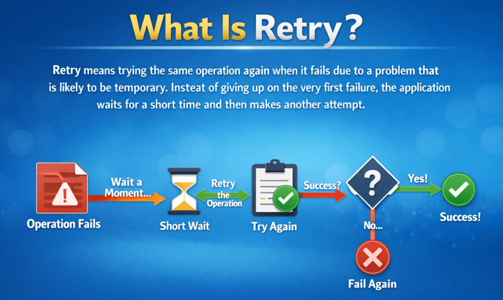
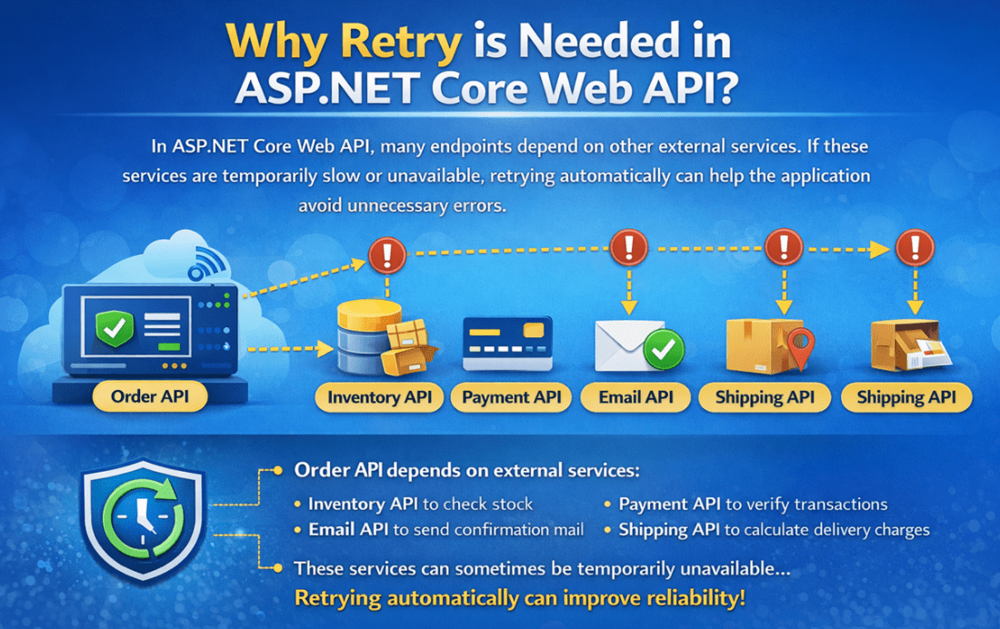
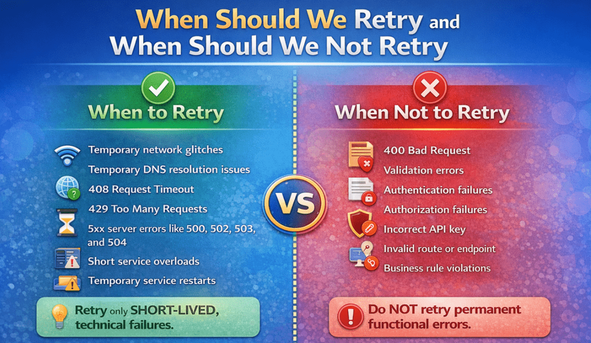

## **با استفاده از Polly در ASP.NET Core Web API دوباره امتحان کنید**

در یک برنامه ASP.NET Core Web API در دنیای واقعی، ما اغلب سیستم‌های خارجی مانند درگاه‌های پرداخت، سرویس‌های موجودی کالا، ارائه‌دهندگان ایمیل، APIهای شخص ثالث یا سایر میکروسرویس‌های داخلی را فراخوانی می‌کنیم. این فراخوانی‌های خارجی همیشه قابل اعتماد نیستند. گاهی اوقات آنها با شکست مواجه می‌شوند، نه به این دلیل که چیزی به طور دائم اشتباه است، بلکه به دلیل یک مشکل موقت مانند وقفه کوتاه شبکه، اتمام زمان، اضافه بار سرویس یا یک خطای مختصر سرور.

در چنین مواردی، اغلب شکست فوری بهترین انتخاب نیست. اگر مشکل فقط برای یک یا دو ثانیه ادامه داشته باشد، امتحان مجدد همان عملیات می‌تواند مشکل را به طور خودکار حل کند. اینجاست که **الگوی Retry** Resilience مفید واقع می‌شود. Retry به برنامه فرصت دیگری می‌دهد تا عملیات را با موفقیت انجام دهد، قبل از اینکه خطایی به کاربر برگرداند.

#### **تلاش مجدد چیست؟**

تلاش مجدد به معنای **تلاش مجدد برای انجام همان عملیات** است، زمانی که به دلیل مشکلی که احتمالاً موقتی است، با شکست مواجه می‌شود. برنامه به جای تسلیم شدن در اولین شکست، مدت کوتاهی منتظر می‌ماند و سپس تلاش دیگری انجام می‌دهد.



ایده اصلی بسیار ساده است:

- اولین تلاش ناموفق بود
- برای مدت کوتاهی صبر کنید
- دوباره امتحان کنید
- در صورت نیاز، چند بار دیگر امتحان کنید
- اگر هنوز ناموفق بود، نتیجه‌ی شکست را برگردانید

بنابراین، تلاش مجدد به معنای «تلاش تا ابد» نیست، بلکه به معنای **تلاش مجدد به روشی کنترل‌شده** برای تعداد محدودی تلاش است.

#### **چرا در ASP.NET Core Web API به Retry نیاز است؟**

در ASP.NET Core Web API، بسیاری از نقاط پایانی به سرویس‌های دیگر وابسته هستند. برای مثال، API شما ممکن است موارد زیر را فراخوانی کند:

- یک API موجودی برای بررسی موجودی
- یک API پرداخت برای تأیید تراکنش
- یک API ایمیل برای ارسال ایمیل تأیید
- یک API ارسال برای محاسبه هزینه‌های تحویل

حالا تصور کنید که API سفارش شما قبل از تأیید سفارش، API موجودی را فراخوانی می‌کند. اگر API موجودی موقتاً کند شود یا فقط برای ۱ یا ۲ ثانیه در دسترس نباشد و برنامه شما فوراً با شکست مواجه شود، کاربر ممکن است یک خطای غیرضروری ببیند، حتی اگر سرویس می‌توانست در تلاش بعدی به درستی کار کند.

این باعث ایجاد یک تجربه کاربری ضعیف می‌شود. یک مشکل فنی کوچک و موقت نباید همیشه به یک شکست قابل مشاهده برای کاربر نهایی تبدیل شود.



به همین دلیل است که تلاش مجدد مهم است. این به برنامه کمک می‌کند تا **به طور خودکار خطاهای گذرا را** مدیریت کند . خطای گذرا، یک خطای کوتاه مدت است که اگر همان درخواست پس از یک تأخیر کوچک دوباره امتحان شود، ممکن است ناپدید شود.

##### **مثال واقعی**

فرض کنید API وب شما نیاز به فراخوانی یک API تأیید پرداخت دارد.

در اینجا چیزی است که می‌تواند اتفاق بیفتد:

- اولین درخواست به دلیل وقفه موقت در شبکه با شکست مواجه می‌شود
- برنامه شما 2 ثانیه منتظر می‌ماند
- دوباره همان درخواست را ارسال می‌کند
- تلاش دوم با موفقیت انجام شد

###### **بدون تلاش مجدد:**

- API شما فوراً خطا برمی‌گرداند
- کاربر ممکن است فکر کند که تأیید پرداخت ناموفق بوده است
- مشکلات پشتیبانی ممکن است افزایش یابد

###### **با تلاش مجدد:**

- خرابی موقت به طور خودکار مدیریت می‌شود
- تلاش دوم با موفقیت انجام شد
- کاربر بدون اینکه حتی بداند یک مشکل کوچک وجود دارد، پاسخ موفقیت‌آمیزی دریافت می‌کند

به همین دلیل است که Retry یکی از رایج‌ترین الگوهای تاب‌آوری مورد استفاده در APIها و میکروسرویس‌های مدرن است.

#### **چه زمانی باید دوباره امتحان کنیم و چه زمانی نباید دوباره امتحان کنیم؟**

برای درک بهتر، لطفاً به تصویر زیر نگاهی بیندازید:



##### **چه زمانی باید دوباره امتحان کنید؟**

تلاش مجدد فقط زمانی باید استفاده شود که احتمال موقتی بودن شکست وجود داشته باشد. به عبارت دیگر، تلاش مجدد زمانی انتخاب خوبی است که احتمال معقولی برای موفقیت تلاش بعدی وجود داشته باشد.

کاندیداهای خوب برای Retry عبارتند از:

- اختلالات موقت شبکه
- مشکلات موقت در حل مشکل DNS
- ۴۰۸ درخواست مهلت زمانی
- 429 درخواست‌های بیش از حد
- خطاهای سرور 5xx، مانند 500، 502، 503 و 504
- اضافه بارهای سرویس کوتاه
- سرویس موقت پایین‌دستی دوباره راه‌اندازی شد

این خرابی‌ها اغلب کوتاه‌مدت هستند. اگر کمی صبر کنید و دوباره امتحان کنید، ممکن است درخواست موفقیت‌آمیز باشد.

##### **چه زمانی نباید دوباره امتحان کنید؟**

تلاش مجدد راه حل صحیحی برای هر خطایی نیست. اگر مشکل دائمی باشد، تلاش مجدد فقط زمان و منابع را هدر می‌دهد.

کاندیداهای نامناسب برای Retry عبارتند از:

- درخواست بد ۴۰۰
- خطاهای اعتبارسنجی
- خرابی‌های احراز هویت
- خرابی‌های مجوز
- کلید API نادرست
- مسیر یا نقطه پایانی نامعتبر است
- تخلفات قوانین کسب و کار
- سناریوهای ارسال تکراری

برای مثال، اگر کلاینت ورودی نامعتبر ارسال کند، تلاش مجدد برای همان درخواست نامعتبر چیزی را درست نمی‌کند. همین امر در مورد دسترسی غیرمجاز یا کلید API اشتباه نیز صادق است. در چنین مواردی، درخواست به همان دلیل دوباره با شکست مواجه می‌شود.

بنابراین:

- فقط در صورت بروز مشکلات فنی موقت، دوباره امتحان کنید.
- خطاهای عملکردی یا تجاری دائمی را دوباره امتحان نکنید.

##### **نکته مهم در مورد درخواست‌های POST**

مانند درخواست‌های POST می‌تواند خطرناک باشد **تلاش‌های مجدد برای عملیات غیر خودتوان (non-idempotent)** . عملیات غیر خودتوان به این معنی است که تکرار یک درخواست مشابه ممکن است هر بار نتیجه متفاوتی ایجاد کند. برای مثال:

- ایجاد سفارش‌های تکراری
- ایجاد پرداخت‌های تکراری
- درج دو باره‌ی یک رکورد مشابه

اگر یک درخواست POST کورکورانه دوباره امتحان شود، ممکن است برنامه به طور تصادفی یک عمل را بیش از یک بار انجام دهد.

به همین دلیل است که باید از Retry برای چنین عملیاتی با دقت استفاده شود. قبل از Retry کردن یک POST، باید مطمئن شویم که عملیات ایمن است، یا باید API را به گونه‌ای طراحی کنیم که پردازش تکراری اتفاق نیفتد.

بنابراین:

- امتحان مجدد GET معمولاً امن‌تر است.
- تلاش مجدد برای POST نیاز به دقت بیشتری دارد.

#### **چرا پالی؟**

Polly یک کتابخانه محبوب .NET است که برای مدیریت خطاهای گذرا به روشی تمیز و ساختاریافته استفاده می‌شود. به جای نوشتن منطق تلاش مجدد دستی بارها و بارها در بخش‌های مختلف برنامه، Polly به ما امکان می‌دهد استراتژی‌های انعطاف‌پذیری، مانند تلاش مجدد، را به شیوه‌ای سازگار و قابل استفاده مجدد تعریف کنیم.

بدون Polly، توسعه‌دهندگان ممکن است در نهایت کدهای سفارشی زیادی بنویسند که از بلوک‌های try-catch، شمارنده‌ها، تأخیرها و منطق تکراری استفاده می‌کند. مدیریت، آزمایش و نگهداری این رویکرد دشوار می‌شود.

با پالی، می‌توانیم:

- تعریف تعداد دفعات تکرار تلاش
- مدت زمان انتظار بین تلاش‌های مجدد را تعریف کنید
- تصمیم بگیرید که کدام شکست‌ها باید دوباره امتحان شوند
- متمرکز کردن رفتار تاب‌آوری
- کد کسب و کار را تمیز و خوانا نگه دارید

بنابراین، Polly به ما کمک می‌کند تا برنامه‌هایی بسازیم که قابل اعتمادتر، قابل نگهداری‌تر و آماده تولید باشند.

نامیده می‌شود **در Polly، تلاش مجدد، یک استراتژی تاب‌آوری واکنشی** . این ممکن است در ابتدا کمی پیچیده به نظر برسد، اما معنای آن ساده است. « **واکنشی** » به این معنی است که Polly **پس از وقوع یک شکست** واکنش نشان می‌دهد . اگر یک استثنا ایجاد شود یا نتیجه شکست بازگردانده شود، Polly می‌تواند عملیات را دوباره امتحان کند. این کار فقط تا زمانی ادامه می‌یابد که:

- عملیات با موفقیت انجام شود، یا
- به حداکثر تعداد دفعات تلاش مجدد رسیده باشد، یا
- این شکست از نوعی است که نباید دوباره امتحان شود.

بنابراین، می‌توانید آن را اینگونه تصور کنید:

- پالی عملیات را تماشا می‌کند.
- پالی می‌گوید اگر شکست موقتی به نظر می‌رسد، «کمی صبر کن و دوباره امتحان کن.»

#### **مثال Polly بلادرنگ در ASP.NET Core Web API:**

حال، بیایید Polly Retry را با یک مثال ساده در زمان واقعی درک کنیم. در این مثال، ما قصد داریم **دو پروژه ASP.NET Core Web API را** در یک راه‌حل واحد بسازیم. پروژه اول **InventoryServiceApi** و پروژه دوم **OrderServiceApi** است .

##### **پروژه ۱: API سرویس موجودی**

این مانند یک سرویس خارجی یا API پایین‌دستی عمل خواهد کرد.

وظیفه آن این است که:

- حفظ موجودی محصول با استفاده از داده‌های درون حافظه‌ای
- یک نقطه پایانی برای بررسی موجودی بر اساس ProductId ارائه دهید
- گاهی اوقات، عمداً در شبیه‌سازی یک مشکل موقت کوتاهی می‌کنند

این API مانند یک وابستگی خارجی واقعی رفتار خواهد کرد که همیشه پایدار نیست.

##### **پروژه ۲: API مربوط به OrderService**

این API نشان‌دهنده‌ی API اصلی کسب‌وکار ما است.

وظیفه آن این است که:

- دریافت درخواست‌های سفارش
- برای تأیید موجودی، API مربوط به InventoryService را فراخوانی کنید
- اگر موجودی انبار موجود باشد، بازگشت با موفقیت انجام می‌شود
- اگر InventoryService موقتاً از کار افتاد، **از تلاش مجدد مبتنی بر Polly برای تلاش مجدد استفاده کنید.** قبل از تسلیم شدن،

اینجاست که ما از Polly به روشی استاندارد در صنعت استفاده خواهیم کرد.

##### **سناریوی کسب و کار در لحظه**

این مورد دنیای واقعی را تصور کنید:

- مشتری از طریق API سفارش، سفارش لپ‌تاپ می‌دهد.
- قبل از تأیید سفارش، API سفارش باید API موجودی را برای بررسی موجودی کالا فراخوانی کند.

اما گاهی اوقات API موجودی:

- موقتاً بیش از حد بارگذاری شده است
- سرویس ۵۰۳ در دسترس نیست
- زمان‌ها تمام شدند
- یک قطعی کوتاه شبکه دارد

اینها خرابی‌های گذرا هستند. Polly Retry برای این موارد عالی است زیرا retry یک عملیات را هنگامی که به دلیل یک استثنای مدیریت‌شده یا نتیجه خرابی با شکست مواجه می‌شود، دوباره اجرا می‌کند و هنگامی که به حد مجاز تلاش مجدد برسد یا خرابی مدیریت نشود، متوقف می‌شود.

#### **مرحله ۱: ایجاد راهکار و پروژه‌ها**

ابتدا، یک **راه‌حل خالی** با نام **PollyRetryDemoSolution** ایجاد کنید . سپس دو پروژه ASP.NET Core Web API زیر را به راه‌حل اضافه کنید:

- **InventoryServiceApi**
- **OrderServiceApi**

پروژه InventoryServiceApi سرویس پایین‌دستی را شبیه‌سازی خواهد کرد، در حالی که پروژه OrderServiceApi به عنوان API سمت کلاینت عمل می‌کند که با سرویس موجودی ارتباط برقرار می‌کند.

در مرحله بعد، بسته NuGet زیر را فقط در پروژه OrderServiceApi نصب کنید زیرا این پروژه فراخوانی HTTP خروجی را انجام می‌دهد:

**نصب بسته Microsoft.Extensions.Http.Resilience**

این بسته پشتیبانی داخلی از ویژگی‌های انعطاف‌پذیری مانند Retry، Timeout، Circuit Breaker و موارد دیگر را ارائه می‌دهد. در این مثال، ما از آن برای پیکربندی استراتژی retry برای HttpClient استفاده خواهیم کرد.

#### **مرحله 2: ساخت API سرویس موجودی**

پروژه InventoryServiceApi در مثال ما به عنوان **سرویس پایین‌دستی** عمل می‌کند . وظیفه آن ارائه اطلاعات موجودی محصول در صورت درخواست توسط API دیگری مانند OrderServiceApi است.

در این دمو، سرویس موجودی (InventoryService) وظایف زیر را انجام می‌دهد:

- اطلاعات موجودی محصول را در حافظه نگه می‌دارد
- یک نقطه پایانی را برای دریافت جزئیات موجودی بر اساس ProductId در معرض نمایش قرار می‌دهد.
- عمداً دو درخواست اول یک محصول را با شکست مواجه می‌کند
- از درخواست سوم به بعد، پاسخ موفقیت‌آمیز را برمی‌گرداند

این رفتار به ما کمک می‌کند تا یک **سناریوی خطای گذرای قابل پیش‌بینی** ایجاد کنیم که برای آزمایش اینکه آیا Polly Retry در سرویس فراخوانی به درستی کار می‌کند یا خیر، لازم است.

##### **ایجاد مدل‌ها:**

ابتدا، یک پوشه با نام **Models** ایجاد کنید .

##### **مدل‌ها/محصولات.cs**

این مدل یک محصول واحد را در داخل سرویس موجودی نمایش می‌دهد. این مدل اطلاعات اولیه مربوط به موجودی، مانند موارد زیر را ذخیره می‌کند:

- شناسه محصول → شناسه منحصر به فرد محصول
- نام محصول → نام محصول
- موجودی → تعداد فعلی موجود در انبار

بنابراین، یک فایل کلاس با نام **Product.cs** در **پوشه Models** ایجاد کنید و کد زیر را کپی و پیست کنید.

```csharp
namespace InventoryServiceApi.Models
{
    public class Product
    {
        public int ProductId { get; set; }
        public string ProductName { get; set; } = string.Empty;
        public int AvailableStock { get; set; }
    }
}
```

##### **ایجاد رابط مخزن**

سپس، یک پوشه با نام **Repositories** ایجاد کنید .

##### **مخازن/IInventoryRepository.cs**

این رابط، قرارداد مربوط به عملیات مربوط به موجودی کالا را تعریف می‌کند. این رابط به برنامه می‌گوید **که چه عملیاتی در دسترس هستند** بیان نمی‌کند **، اما نحوه پیاده‌سازی این عملیات‌ها را** . این هدف اصلی یک رابط است. این رابط به ما کمک می‌کند تا **تعریف را** از **پیاده‌سازی** جدا کنیم و برنامه را سازمان‌یافته‌تر، انعطاف‌پذیرتر و نگهداری آن را آسان‌تر کنیم. ایجاد کنید **بنابراین، یک فایل کلاس به نام IInventoryRepository.cs** در **پوشه Repositories** و کد زیر را در آن کپی و پیست کنید.

```csharp
using InventoryServiceApi.Models;
namespace InventoryServiceApi.Repositories
{
    public interface IInventoryRepository
    {
        // Returns all inventory items stored in memory
        IEnumerable<Product> GetAll();

        // Returns the inventory record of a specific product.
        // If the product does not exist, it returns null
        Product? GetByProductId(int productId);

        // Tracks how many times a particular product has been requested.
        // This is the key method that helps us simulate temporary failures
        int RegisterRequestAttempt(int productId);

        // Resets the attempt count for one specific product
        void ResetAttempts(int productId);

        // Clears all request-attempt tracking data
        void ResetAllAttempts();
    }
}
```

##### **مخازن/InventoryRepository.cs**

حالا، بیایید مخزن را پیاده‌سازی کنیم. این کلاس، **پیاده‌سازی درون حافظه‌ای** IInventoryRepository است.

ذخیره می‌کند:

- فهرستی از اقلام موجودی نمونه
- یک دیکشنری thread-safe برای ردیابی تعداد دفعات درخواست هر محصول

مهم‌ترین نقش این کلاس پشتیبانی از **شبیه‌سازی خطای گذرا** است . هر زمان که درخواستی برای یک محصول می‌آید، تعداد درخواست‌های آن را افزایش می‌دهیم. سپس، در کنترلر، از آن تعداد برای تصمیم‌گیری در مورد اینکه آیا باید یک خطای موقت یا یک پاسخ موفق را برگردانیم، استفاده می‌کنیم. بنابراین، یک فایل کلاس به نام **InventoryRepository.cs** در **پوشه Repositories** ایجاد کنید و کد زیر را کپی و جایگذاری کنید.

```csharp
using InventoryServiceApi.Models;
using System.Collections.Concurrent;
namespace InventoryServiceApi.Repositories
{
    public class InventoryRepository : IInventoryRepository
    {
        // In-memory inventory data.
        // This list acts like a temporary database for our demo application.
        // Each InventoryItem object represents one product and its available stock.
        private readonly List<Product> _items = new List<Product>()
        {
            new Product { ProductId = 1, ProductName = "Laptop", AvailableStock = 10 },
            new Product { ProductId = 2, ProductName = "Keyboard", AvailableStock = 25 },
            new Product { ProductId = 3, ProductName = "Mouse", AvailableStock = 0 },
            new Product { ProductId = 4, ProductName = "Monitor", AvailableStock = 7 }
        };

        // Thread-safe dictionary used to track how many times each product has been requested.
        // ConcurrentDictionary<TKey, TValue> is a special dictionary designed for multi-threaded scenarios.
        // Here:
        //   Key   = ProductId (int)
        //   Value = Number of times that product has been requested (int)
        //
        // Example:
        //   ProductId 1 -> 1   means product 1 has been requested once
        //   ProductId 1 -> 2   means product 1 has been requested twice
        //
        // We use ConcurrentDictionary because multiple HTTP requests may come at the same time,
        // and this collection can safely handle concurrent read/write operations.
        private readonly ConcurrentDictionary<int, int> _requestAttempts = new();

        public IEnumerable<Product> GetAll()
        {
            // Return all in-memory inventory records.
            return _items;
        }

        public Product? GetByProductId(int productId)
        {
            // Search the in-memory list and return the matching product.
            // If no matching ProductId is found, FirstOrDefault returns null.
            return _items.FirstOrDefault(x => x.ProductId == productId);
        }

        // AddOrUpdate works like this:
        // 1. If the given ProductId does NOT already exist in the dictionary,
        //    it adds a new entry with value 1.
        // 2. If the given ProductId already exists,
        //    it updates the existing value by increasing the old value by 1.
        public int RegisterRequestAttempt(int productId)
        {
            // AddOrUpdate is used to either add a new entry or update an existing entry.
            // Syntax:
            return _requestAttempts.AddOrUpdate(
                productId,              // Key to search for in the dictionary
                1,                      // If the key does not exist, add it with value 1
                (_, oldValue) => oldValue + 1 // If the key already exists, increment its current value by 1
            );

            // Example:
            // First request for ProductId 1  -> stores 1
            // Second request for ProductId 1 -> updates to 2
            // Third request for ProductId 1  -> updates to 3
        }

        // TryRemove attempts to remove the entry for the given ProductId from the dictionary.
        public void ResetAttempts(int productId)
        {
            // Explanation:
            //   productId = the key we want to remove
            //   out _     = discard the removed value because we do not need it

            // If the key exists, it is removed successfully.
            // If the key does not exist, nothing happens.
            //
            // Example:
            //   If ProductId 1 has attempt count 3, this statement removes it completely.
            //   On the next request for ProductId 1, the count will start again from 1.
            _requestAttempts.TryRemove(productId, out _);

            // Note:
            //  - TryRemove normally returns the removed value through an out parameter
            //  - but we do not need that removed value here
            //  - so we discard it using _
        }

        // Clear removes all key-value pairs from the dictionary.
        public void ResetAllAttempts()
        {
            // After calling this method, the dictionary becomes empty.
            // That means all products will start again from attempt number 1
            // when they are requested next time.
            _requestAttempts.Clear();
        }
    }
}
```

###### **چرا ما اینجا از ConcurrentDictionary استفاده می‌کنیم؟**

ما از ConcurrentDictionary استفاده می‌کنیم زیرا **thread-safe** است . در برنامه‌های Web API، چندین درخواست می‌توانند همزمان برسند. اگر دو یا چند درخواست سعی کنند یک دیکشنری را همزمان به‌روزرسانی کنند، یک دیکشنری معمولی ممکن است مشکلاتی ایجاد کند. ConcurrentDictionary این مشکل را با خیال راحت مدیریت می‌کند، بنابراین انتخاب بهتری برای این نوع ردیابی مشترک در حافظه است.

##### **ایجاد کنترل‌کننده موجودی**

حالا، بیایید کنترلر را ایجاد کنیم. این کنترلر، نقاط پایانی سرویس موجودی کالا را نمایش می‌دهد. مسئولیت‌های آن عبارتند از:

- تمام سوابق موجودی را برگردانید
- یک رکورد موجودی را بر اساس ProductId برگردانید
- شبیه‌سازی خرابی‌های گذرا برای دو درخواست اول
- نقاط پایانی بازنشانی را فراهم کنید تا آزمایش آسان شود

بنابراین، یک فایل کلاس با نام **InventoryController.cs** در **پوشه Controllers** ایجاد کنید و کد زیر را کپی و پیست کنید.

```csharp
using InventoryServiceApi.Repositories;
using Microsoft.AspNetCore.Mvc;
namespace InventoryServiceApi.Controllers
{
    [ApiController]
    [Route("api/[controller]")]
    public class InventoryController : ControllerBase
    {
        // Repository used to access inventory data and request-attempt tracking logic
        private readonly IInventoryRepository _inventoryRepository;

        // Logger used to write informational and warning messages for debugging and monitoring
        private readonly ILogger<InventoryController> _logger;

        public InventoryController(
            IInventoryRepository inventoryRepository,
            ILogger<InventoryController> logger)
        {
            // Store the injected repository instance for later use inside action methods
            _inventoryRepository = inventoryRepository;

            // Store the injected logger instance for writing logs
            _logger = logger;
        }

        [HttpGet]
        public IActionResult GetAllInventory()
        {
            // Get all inventory records from the repository
            var items = _inventoryRepository.GetAll();

            // Return HTTP 200 OK with the complete inventory list
            return Ok(items);
        }

        [HttpGet("{productId}")]
        public IActionResult GetInventoryByProductId(int productId)
        {
            // Fetch the inventory item for the given ProductId
            var item = _inventoryRepository.GetByProductId(productId);

            // If no matching product is found, return HTTP 404 Not Found
            if (item is null)
            {
                return NotFound(new
                {
                    Message = $"No inventory record found for ProductId = {productId}."
                });
            }

            // Increase and get the current request-attempt count for this product
            // This is used to simulate transient failures for the first two requests
            int attemptNumber = _inventoryRepository.RegisterRequestAttempt(productId);

            // Write an informational log showing which product was requested
            // and how many times it has been requested so far
            _logger.LogInformation(
                "Inventory API called for ProductId {ProductId}. Attempt Number: {AttemptNumber}",
                productId,
                attemptNumber);

            // Intentionally simulate a temporary failure for the first two attempts
            // This helps us test whether Polly Retry in the calling API works correctly
            if (attemptNumber <= 2)
            {
                // Write a warning log because we are deliberately returning a temporary failure response
                _logger.LogWarning(
                    "Simulating temporary failure for ProductId {ProductId} on attempt {AttemptNumber}",
                    productId,
                    attemptNumber);

                // Return HTTP 503 Service Unavailable to represent a temporary downstream issue
                return StatusCode(StatusCodes.Status503ServiceUnavailable, new
                {
                    Message = "Temporary issue in InventoryService. Please retry.",
                    ProductId = productId,
                    AttemptNumber = attemptNumber
                });
            }

            // From the third attempt onward, return a successful response with stock details
            return Ok(new
            {
                ProductId = item.ProductId,
                ProductName = item.ProductName,
                AvailableStock = item.AvailableStock,

                // True if stock is greater than zero; otherwise false
                IsAvailable = item.AvailableStock > 0,

                // Current UTC time when the stock check was completed
                CheckedAtUtc = DateTime.UtcNow
            });
        }

        [HttpPost("reset/{productId}")]
        public IActionResult ResetAttempts(int productId)
        {
            // Reset the stored request-attempt count for the specified product
            // After reset, the next request for this product will again start from attempt 1
            _inventoryRepository.ResetAttempts(productId);

            // Return HTTP 200 OK with a confirmation message
            return Ok(new
            {
                Message = $"Request attempts reset successfully for ProductId = {productId}."
            });
        }

        [HttpPost("reset-all")]
        public IActionResult ResetAllAttempts()
        {
            // Reset request-attempt counts for all products
            // This is useful when we want to restart testing from a clean state
            _inventoryRepository.ResetAllAttempts();

            // Return HTTP 200 OK with a confirmation message
            return Ok(new
            {
                Message = "Request attempts reset successfully for all products."
            });
        }
    }
}
```

##### **Program.cs برای InventoryServiceApi**

این فایل سرویس‌ها و میان‌افزار مورد نیاز InventoryServiceApi را پیکربندی می‌کند. در اینجا، مخزن را در ظرف تزریق وابستگی ثبت می‌کنیم، پشتیبانی از کنترلر را فعال می‌کنیم، Swagger را برای آزمایش پیکربندی می‌کنیم و خط لوله درخواست HTTP را راه‌اندازی می‌کنیم. لطفاً **فایل کلاس Program.cs** را به شرح زیر به‌روزرسانی کنید:

```csharp
using InventoryServiceApi.Repositories;
namespace InventoryServiceApi
{
    public class Program
    {
        public static void Main(string[] args)
        {
            var builder = WebApplication.CreateBuilder(args);

            // Add controller support and keep JSON property names exactly as defined in C# models/DTOs.
            builder.Services.AddControllers()
                .AddJsonOptions(options =>
                {
                    options.JsonSerializerOptions.PropertyNamingPolicy = null;
                });

            builder.Services.AddEndpointsApiExplorer();
            builder.Services.AddSwaggerGen();

            // Register the repository as Singleton because we want one shared in-memory state
            builder.Services.AddSingleton<IInventoryRepository, InventoryRepository>();

            var app = builder.Build();

            // Configure the HTTP request pipeline.
            if (app.Environment.IsDevelopment())
            {
                app.UseSwagger();
                app.UseSwaggerUI();
            }

            app.UseHttpsRedirection();

            app.UseAuthorization();

            app.MapControllers();

            app.Run();
        }
    }
}
```

#### **مرحله ۳: ساخت API مربوط به OrderService**

حالا، بیایید **OrderServiceApi** ، API اصلی این مثال، را بسازیم. این API ای است که کلاینت برای ثبت سفارش فراخوانی می‌کند. اما قبل از تأیید سفارش، این API ابتدا باید با InventoryServiceApi ارتباط برقرار کند **تا** بررسی کند که آیا محصول درخواستی در انبار موجود است یا خیر. بنابراین، این پروژه مسئول موارد زیر است:

- دریافت درخواست سفارش از مشتری
- با خدمات موجودی تماس بگیرید
- موجودی و مقدار موجودی محصول را تأیید کنید
- استفاده کنید **از Polly Retry** اگر سرویس موجودی موقتاً از کار افتاد،
- پاسخ موفقیت یا شکست نهایی را به کلاینت برگردانید

این پروژه‌ای است که Polly در واقع در آن استفاده می‌شود. به زبان ساده، **InventoryServiceApi مشکل را شبیه‌سازی می‌کند** و **OrderServiceApi آن را** **با استفاده از Polly Retry** مدیریت می‌کند .

##### **ایجاد DTO ها:**

ابتدا، یک پوشه به نام **DTOs** ایجاد کنید . DTOها به ما کمک می‌کنند تا داده‌های ورودی و خروجی از API را ساختاردهی کنیم. در این مثال، به سه DTO نیاز داریم:

- یک DTO برای دریافت درخواست سفارش از مشتری
- یک DTO برای خواندن پاسخ دریافتی از InventoryService
- یک DTO برای ارسال نتیجه نهایی سفارش به مشتری

این جداسازی، برنامه را تمیز و قابل فهم نگه می‌دارد.

##### **DTOها/CreateOrderRequestDto.cs**

این DTO نشان دهنده درخواست سفارش ورودی ارسال شده توسط مشتری است و شامل موارد زیر است:

- شناسه محصول → مشتری می‌خواهد کدام محصول را سفارش دهد
- تعداد → مشتری چند واحد می‌خواهد

ما همچنین در اینجا از ویژگی‌های اعتبارسنجی استفاده می‌کنیم تا مطمئن شویم مقادیر نامعتبر به طور خودکار رد می‌شوند. بنابراین، یک فایل کلاس به نام **CreateOrderRequestDto.cs** در **پوشه DTOs** ایجاد کنید و کد زیر را کپی و پیست کنید.

```csharp
using System.ComponentModel.DataAnnotations;
namespace OrderServiceApi.DTOs
{
    public class CreateOrderRequestDto
    {
        // ProductId must be greater than zero
        [Range(1, int.MaxValue, ErrorMessage = "ProductId must be greater than 0.")]
        public int ProductId { get; set; }

        // Ordered quantity must be greater than zero
        [Range(1, int.MaxValue, ErrorMessage = "Quantity must be greater than 0.")]
        public int Quantity { get; set; }
    }
}
```

##### **DTOها/OrderResponseDto.cs**

این DTO از API مربوط به OrderService به کلاینت برگردانده می‌شود. این DTO شامل اطلاعات فنی و تجاری مانند موارد زیر است:

- اینکه آیا عملیات موفق بوده است یا خیر.
- چه پیامی باید نشان داده شود.
- آیا شناسه سفارش ایجاد شده است یا خیر.
- جزئیات محصول و تعداد.
- جزئیات موجودی کالا هنگام پردازش سفارش ثبت شد.

بنابراین، یک فایل کلاس با نام **OrderResponseDto.cs** در **پوشه DTOs** ایجاد کنید و کد زیر را کپی و پیست کنید.

```csharp
namespace OrderServiceApi.DTOs
{
    public class OrderResponseDto
    {
        public int StatusCode { get; set; }
        public bool IsSuccess { get; set; }
        public string Message { get; set; } = string.Empty;
        public string? OrderId { get; set; }
        public int ProductId { get; set; }
        public int OrderedQuantity { get; set; }
        public int AvailableStock { get; set; }
        public DateTime ProcessedAtUtc { get; set; }
    }
}
```

##### **DTOها/InventoryResponseDto.cs**

این DTO نشان دهنده پاسخی است که توسط **InventoryServiceApi** برگردانده می‌شود . از آنجایی که OrderService یک API دیگر را فراخوانی می‌کند، به کلاسی نیاز دارد که با ساختار پاسخ آن API مطابقت داشته باشد. هدف این DTO نیز همین است. ایجاد کنید **بنابراین، یک فایل کلاس به نام InventoryResponseDto.cs** در **پوشه DTOs** و کد زیر را در آن کپی و پیست کنید.

```csharp
namespace OrderServiceApi.DTOs
{
    public class InventoryResponseDto
    {
        // Product identifier returned by InventoryService
        public int ProductId { get; set; }

        // Product name returned by InventoryService
        public string ProductName { get; set; } = string.Empty;

        // Current stock available
        public int AvailableStock { get; set; }

        // Indicates whether the product is available
        public bool IsAvailable { get; set; }

        // Timestamp of stock verification
        public DateTime CheckedAtUtc { get; set; }
    }
}
```

##### **ایجاد Typed HttpClient**

یک پوشه با نام **Clients ایجاد کنید.**

##### **کلاینت‌ها/موجودیApiClient.cs**

این کلاینت HTTP تایپ شده‌ای است که **InventoryServiceApi** را فراخوانی می‌کند . به عبارت دیگر، این جایی است که OrderService یک فراخوانی HTTP به سرویس دیگری انجام می‌دهد.

Polly Retry حول این HttpClient اعمال خواهد شد، بنابراین هر زمان که این کلاینت با یک شکست موقت از InventoryService مواجه شود، استراتژی retry به طور خودکار فعال می‌شود. بنابراین، یک فایل کلاس به نام **InventoryApiClient.cs** در **پوشه Clients** ایجاد کنید و کد زیر را کپی و پیست کنید.

```csharp
using OrderServiceApi.DTOs;
using System.Net;
namespace OrderServiceApi.Clients
{
    public class InventoryApiClient
    {
        // HttpClient is used to send HTTP requests to the downstream InventoryService API
        private readonly HttpClient _httpClient;

        // Logger is used to record request flow, warnings, and failures for debugging and monitoring
        private readonly ILogger<InventoryApiClient> _logger;

        public InventoryApiClient(HttpClient httpClient, ILogger<InventoryApiClient> logger)
        {
            // Store the injected HttpClient instance.
            // This HttpClient is configured in Program.cs with the base URL of InventoryService
            // and the Polly retry pipeline.
            _httpClient = httpClient;

            // Store the injected logger instance for writing logs from this client
            _logger = logger;
        }

        public async Task<InventoryResponseDto?> GetInventoryByProductIdAsync(
            int productId)
        {
            // Write an informational log before calling the downstream InventoryService
            _logger.LogInformation(
                "Calling InventoryService for ProductId {ProductId}",
                productId);

            // Send an HTTP GET request to the InventoryService endpoint:
            // api/inventory/{productId}
            //
            // Example:
            // If productId = 1, the final request URL becomes:
            // https://localhost:7245/api/inventory/1
            //
            // The 'using' statement ensures the HttpResponseMessage object is disposed properly
            // after use, which helps release unmanaged resources.
            using HttpResponseMessage response =
                await _httpClient.GetAsync($"api/inventory/{productId}");

            // If InventoryService returns HTTP 404 Not Found,
            // it means the requested product does not exist in the inventory system.
            // This is treated as a normal business case, not as a temporary technical failure.
            // So, instead of throwing an exception, we simply return null.
            if (response.StatusCode == HttpStatusCode.NotFound)
            {
                _logger.LogWarning(
                    "InventoryService returned 404 for ProductId {ProductId}",
                    productId);

                return null;
            }

            // If the response status code is not successful (not in the 2xx range),
            // log the status code and response body for troubleshooting.
            //
            // Important:
            // Polly retry happens before the final response reaches this point.
            // So if the request failed temporarily, Polly may have already retried it.
            // If control reaches here with a failed response, it usually means:
            // - the response is still unsuccessful after retries, or
            // - the response is a non-success code that Polly does not retry.
            if (!response.IsSuccessStatusCode)
            {
                // Read the error response body as text so we can log the exact failure details
                string errorBody = await response.Content.ReadAsStringAsync();

                _logger.LogWarning(
                    "InventoryService returned status code {StatusCode} for ProductId {ProductId}. Body: {Body}",
                    (int)response.StatusCode,
                    productId,
                    errorBody);
            }

            // EnsureSuccessStatusCode throws an HttpRequestException if the response status code
            // is not successful (for example 400, 500, 503, etc.).
            //
            // In our example, if InventoryService keeps failing even after Polly retries,
            // this line throws the exception, which is then handled in OrderService.
            response.EnsureSuccessStatusCode();

            // Convert the successful JSON response body into an InventoryResponseDto object
            // and return it to the calling service.
            return await response.Content.ReadFromJsonAsync<InventoryResponseDto>();
        }
    }
}
```

##### **چرا این کلاس؟**

به جای نوشتن منطق فراخوانی HTTP به طور مستقیم درون سرویس یا کنترلر، آن را در یک کلاینت نوع‌بندی‌شده ایزوله می‌کنیم. این کار چندین مزیت برای ما دارد:

- کد تمیزتر
- جداسازی بهتر دغدغه‌ها
- آزمایش آسان‌تر
- نگهداری آسان‌تر
- منطق API خروجی متمرکز

از همه مهم‌تر، Polly Retry به این HttpClient متصل است، بنابراین انعطاف‌پذیری به طور خودکار در آنجا اعمال می‌شود.

##### **ایجاد سرویس‌ها**

حالا، یک پوشه به نام **Services** ایجاد کنید . لایه سرویس شامل منطق تجاری API مربوط به OrderService است. این یعنی کنترلر مستقیماً فراخوانی‌های HTTP انجام نمی‌دهد یا قوانین تجاری نمی‌نویسد. در عوض، این کار را به لایه سرویس واگذار می‌کند. این کار کنترلر را کوچک و منطق تجاری را به درستی سازماندهی می‌کند.

##### **Services/IOrderService.cs**

این رابط، قرارداد پردازش سفارش را تعریف می‌کند. بنابراین، یک فایل کلاس به نام **IOrderService.cs** در **پوشه Services** ایجاد کنید و کد زیر را در آن کپی و پیست کنید.

```csharp
using OrderServiceApi.DTOs;
namespace OrderServiceApi.Services
{
    public interface IOrderService
    {
        // Places an order after checking stock through InventoryService
        Task<OrderResponseDto> PlaceOrderAsync(CreateOrderRequestDto request);
    }
}
```

##### **سرویس‌ها/سفارش‌سرویس.cs**

این کلاس شامل منطق تجاری اصلی API مربوط به OrderService است و مسئولیت موارد زیر را بر عهده دارد:

- دریافت درخواست سفارش.
- فراخوانی InventoryService از طریق کلاینت تایپ‌شده.
- بررسی وجود محصول.
- بررسی اینکه آیا موجودی کافی موجود است یا خیر.
- بازگشت موفقیت یا شکست.
- مدیریت شکست نهایی در صورتی که سرویس پایین‌دستی حتی پس از تلاش‌های مجدد نیز در دسترس نباشد.

بنابراین، یک فایل کلاس به نام **OrderService.cs** در **پوشه Services** ایجاد کنید و کد زیر را کپی و پیست کنید.

```csharp
using OrderServiceApi.Clients;
using OrderServiceApi.DTOs;
namespace OrderServiceApi.Services
{
    public class OrderService : IOrderService
    {
        // Typed client used to call the downstream InventoryService API
        private readonly InventoryApiClient _inventoryApiClient;

        // Logger used to write success, warning, and error information for this service
        private readonly ILogger<OrderService> _logger;

        public OrderService(InventoryApiClient inventoryApiClient, ILogger<OrderService> logger)
        {
            // Store the injected InventoryApiClient instance
            _inventoryApiClient = inventoryApiClient;

            // Store the injected logger instance
            _logger = logger;
        }

        public async Task<OrderResponseDto> PlaceOrderAsync(CreateOrderRequestDto request)
        {
            try
            {
                // Call the downstream InventoryService to get stock details for the requested product.
                // Polly retry is already configured on the HttpClient used inside InventoryApiClient.
                // So if InventoryService fails temporarily, the HTTP call is retried automatically.
                var inventory = await _inventoryApiClient.GetInventoryByProductIdAsync(request.ProductId);

                // If the InventoryApiClient returns null, it means InventoryService responded with 404 Not Found.
                // In other words, the requested product does not exist in the inventory system.
                if (inventory is null)
                {
                    return new OrderResponseDto
                    {
                        // Return 404 because the requested product was not found
                        StatusCode = StatusCodes.Status404NotFound,

                        // Mark the operation as failed
                        IsSuccess = false,

                        // User-friendly message explaining the reason
                        Message = $"Product with ProductId {request.ProductId} was not found in InventoryService.",

                        // Include request details in the response
                        ProductId = request.ProductId,
                        OrderedQuantity = request.Quantity,

                        // Store the time when the order request was processed
                        ProcessedAtUtc = DateTime.UtcNow
                    };
                }

                // If the product exists but stock is not available, or available stock is less than
                // the requested quantity, then the order cannot be placed.
                if (!inventory.IsAvailable || inventory.AvailableStock < request.Quantity)
                {
                    return new OrderResponseDto
                    {
                        // Return 400 because the request is valid,
                        // but the business condition required to place the order is not satisfied
                        StatusCode = StatusCodes.Status400BadRequest,

                        // Mark the operation as failed
                        IsSuccess = false,

                        // User-friendly message explaining the reason
                        Message = "Order failed because sufficient stock is not available.",

                        // Include request and inventory details in the response
                        ProductId = request.ProductId,
                        OrderedQuantity = request.Quantity,
                        AvailableStock = inventory.AvailableStock,

                        // Store the time when the order request was processed
                        ProcessedAtUtc = DateTime.UtcNow
                    };
                }

                // Simulate successful order creation.
                // In a real application, this is where we would save the order into the database.
                // For demo purposes, we generate a sample order ID using a GUID.
                string orderId = $"ORD-{Guid.NewGuid().ToString("N")[..8].ToUpper()}";

                // Write a success log with order details
                _logger.LogInformation(
                    "Order placed successfully. OrderId: {OrderId}, ProductId: {ProductId}, Quantity: {Quantity}",
                    orderId,
                    request.ProductId,
                    request.Quantity);

                // Return a successful response with generated order details
                return new OrderResponseDto
                {
                    // Return 200 because the order was processed successfully
                    StatusCode = StatusCodes.Status200OK,

                    // Mark the operation as successful
                    IsSuccess = true,

                    // Success message
                    Message = "Order placed successfully.",

                    // Include generated order ID
                    OrderId = orderId,

                    // Include request and inventory details
                    ProductId = request.ProductId,
                    OrderedQuantity = request.Quantity,
                    AvailableStock = inventory.AvailableStock,

                    // Store the time when the order request was processed
                    ProcessedAtUtc = DateTime.UtcNow
                };
            }
            catch (HttpRequestException ex)
            {
                // This block executes when InventoryService still fails even after all Polly retry attempts are exhausted.
                // For example, if InventoryService keeps returning 503 Service Unavailable,
                // EnsureSuccessStatusCode() inside InventoryApiClient throws HttpRequestException.
                _logger.LogError(
                    ex,
                    "InventoryService could not be reached successfully after retry attempts for ProductId {ProductId}",
                    request.ProductId);

                return new OrderResponseDto
                {
                    // Return 503 because the downstream InventoryService is temporarily unavailable
                    StatusCode = StatusCodes.Status503ServiceUnavailable,

                    // Mark the operation as failed
                    IsSuccess = false,

                    // User-friendly message explaining the technical failure
                    Message = "Order could not be processed because InventoryService is temporarily unavailable.",

                    // Include request details in the response
                    ProductId = request.ProductId,
                    OrderedQuantity = request.Quantity,

                    // Store the time when the order request was processed
                    ProcessedAtUtc = DateTime.UtcNow
                };
            }
        }
    }
}
```

##### **ایجاد کنترل‌کننده سفارشات**

این کنترلر درخواست HTTP را از کلاینت دریافت می‌کند و پردازش واقعی را به لایه سرویس واگذار می‌کند. بنابراین، یک فایل کلاس به نام **OrdersController.cs** در **پوشه Controllers** ایجاد کنید و کد زیر را کپی و پیست کنید.

```csharp
using Microsoft.AspNetCore.Mvc;
using OrderServiceApi.DTOs;
using OrderServiceApi.Services;
namespace OrderServiceApi.Controllers
{
    [ApiController]
    [Route("api/[controller]")]
    public class OrdersController : ControllerBase
    {
        // Service layer dependency used to handle the actual order-processing logic
        private readonly IOrderService _orderService;

        public OrdersController(IOrderService orderService)
        {
            // Store the injected service instance so it can be used inside action methods
            _orderService = orderService;
        }

        [HttpPost]
        public async Task<IActionResult> CreateOrder([FromBody] CreateOrderRequestDto request)
        {
            // Pass the incoming order request to the service layer.
            // The service handles product validation, inventory check,
            // retry-enabled downstream API call, and final response creation.
            OrderResponseDto result = await _orderService.PlaceOrderAsync(request);

            // Return the response using the HTTP status code provided by the service.
            // Example:
            // 200 -> Order placed successfully
            // 400 -> Insufficient stock
            // 404 -> Product not found
            // 503 -> InventoryService temporarily unavailable
            return StatusCode(result.StatusCode, result);
        }
    }
}
```

##### **appsettings.json برای OrderServiceApi**

این فایل، آدرس اینترنتی (URL) پایه‌ی API مربوط به InventoryService را در خود ذخیره می‌کند. **فایل appsettings.json** را به‌روزرسانی کنید تا آدرس اینترنتی صحیح InventoryService، مطابق شکل زیر، در آن قرار گیرد.

```json
{
  "InventoryService": {
    "BaseUrl": "https://localhost:7082/"
  },
  "Logging": {
    "LogLevel": {
      "Default": "Information",
      "Microsoft.AspNetCore": "Error",
      "System.Net.Http.HttpClient": "Error",
      "Microsoft.Extensions.Http.Resilience": "Error",
      "Polly": "Error"
    }
  },
  "AllowedHosts": "\*"
}
```

##### **Program.cs برای OrderServiceApi**

این مهمترین فایل پیکربندی API مربوط به OrderService است. در اینجا پیکربندی می‌کنیم:

- تزریق وابستگی
- با تکبر و غرور
- نوع HttpClient
- خط لوله تلاش مجدد پالی

اینجاست که رفتار انعطاف‌پذیری در واقع به فراخوانی HTTP خروجی متصل می‌شود. بنابراین، **فایل Program.cs** را به صورت زیر به‌روزرسانی کنید:

```csharp
using Microsoft.Extensions.Http.Resilience;
using OrderServiceApi.Clients;
using OrderServiceApi.Services;
using Polly;
namespace OrderServiceApi
{
    public class Program
    {
        public static void Main(string[] args)
        {
            var builder = WebApplication.CreateBuilder(args);

            // Register controller support so the application can handle API requests.
            // Also, keep JSON property names exactly the same as defined in C# classes.
            // For example, ProductId will remain ProductId instead of becoming productId.
            builder.Services.AddControllers()
                .AddJsonOptions(options =>
                {
                    options.JsonSerializerOptions.PropertyNamingPolicy = null;
                });

            // Register services required for API metadata and Swagger/OpenAPI documentation.
            builder.Services.AddEndpointsApiExplorer();
            builder.Services.AddSwaggerGen();

            // Register the order service in the dependency injection container.
            // AddScoped means one service instance is created per HTTP request.
            builder.Services.AddScoped<IOrderService, OrderService>();

            // Register a typed HttpClient for InventoryApiClient.
            // This client will be used to call the downstream InventoryService API.
            builder.Services
                .AddHttpClient<InventoryApiClient>(client =>
                {
                    // Set the base URL of the downstream InventoryService.
                    // The value is read from appsettings.json:
                    // "InventoryService": { "BaseUrl": "https://localhost:7245/" }
                    client.BaseAddress = new Uri(builder.Configuration["InventoryService:BaseUrl"]!);
                })
                .AddResilienceHandler("inventory-retry-pipeline", pipeline =>
                {
                    // Add a retry strategy to the HttpClient pipeline.
                    // This means if the InventoryService fails temporarily,
                    // the same HTTP request can be retried automatically.
                    pipeline.AddRetry(new HttpRetryStrategyOptions
                    {
                        // Retry the failed request 2 more times after the initial attempt.
                        // So total attempts = 1 original attempt + 2 retries = 3 attempts.
                        MaxRetryAttempts = 2,

                        // Delay means how long Polly should wait before making the next retry attempt.
                        // Here, Polly waits for 2 seconds before retrying the failed request.
                        // Example:
                        // 1st call fails -> wait 2 seconds -> retry
                        Delay = TimeSpan.FromSeconds(2),

                        // BackoffType decides how the retry delay should behave when there are multiple retries.
                        //
                        // Exponential means the delay increases on each retry instead of staying the same.
                        // So, the first retry waits less time, and later retries may wait longer.
                        //
                        // Simple idea:
                        // Retry 1 -> small wait
                        // Retry 2 -> bigger wait
                        // Retry 3 -> even bigger wait
                        //
                        // This is useful because if the downstream service is temporarily overloaded,
                        // giving it a little more time on each retry increases the chance of recovery.
                        BackoffType = DelayBackoffType.Exponential,

                        // UseJitter adds a small random variation to the retry delay.
                        //
                        // Without jitter:
                        // If 100 requests fail at the same time, all 100 may retry after exactly 2 seconds.
                        // That can create another sudden spike of traffic on the downstream service.
                        //
                        // With jitter:
                        // Polly slightly randomizes the retry timing, so requests retry at slightly different moments.
                        // This reduces the chance of all failed requests hitting the server again together.
                        //
                        // In short:
                        // Delay = wait before retry
                        // BackoffType = how that wait changes over retries
                        // UseJitter = adds randomness to spread retries more safely
                        UseJitter = true,

                        // This callback runs each time Polly is about to perform a retry.
                        // We are using it here only for demo/debugging purpose so we can see
                        // retry activity in the console.
                        OnRetry = args =>
                        {
                            // Change console text color so retry messages are easy to identify.
                            Console.ForegroundColor = ConsoleColor.Yellow;

                            // Print the retry attempt number.
                            // args.AttemptNumber starts from 0, so we add 1 for human-readable output.
                            Console.WriteLine(
                                $"Polly retry executed in OrderService. Retry Attempt Number: {args.AttemptNumber + 1}");

                            // Reset the console color back to normal.
                            Console.ResetColor();
                            
                            // This callback only writes to the console and does not perform any asynchronous work,
                            // so we return a completed ValueTask
                            return default;
                        }
                    });
                });

            var app = builder.Build();

            // Enable Swagger middleware only in Development environment.
            if (app.Environment.IsDevelopment())
            {
                app.UseSwagger();
                app.UseSwaggerUI();
            }

            app.UseHttpsRedirection();
            app.UseAuthorization();
            app.MapControllers();
            app.Run();
        }
    }
}
```

##### **آزمایش نقطه پایانی ایجاد سفارش**

پس از تکمیل هر دو API، پروژه‌های InventoryServiceApi و OrderServiceApi را اجرا کنید. ابتدا، مطمئن شوید که I **nventoryService:BaseUrl** در OrderServiceApi به URL صحیح InventoryServiceApi در حال اجرا اشاره می‌کند. در مرحله بعد، شمارنده درخواست موجودی را مجدداً تنظیم کنید تا آزمایش از حالت پاک شروع شود. می‌توانید این کار را با فراخوانی نقطه پایانی تنظیم مجدد InventoryServiceApi انجام دهید.

سپس با استفاده از نقطه پایانی زیر، یک **درخواست POST** به OrderServiceApi ارسال کنید:

##### **/api/orders**

از بدنه درخواست زیر استفاده کنید:

```json
{
  "ProductId": 1,
  "Quantity": 2
}
```

وقتی این درخواست ارسال می‌شود، OrderServiceApi، InventoryServiceApi را برای بررسی موجودی انبار فراخوانی می‌کند.

از آنجایی که InventoryServiceApi عمداً طوری طراحی شده است که در دو درخواست اول با شکست مواجه شود، اولین فراخوانی پاسخ 503 Service Unavailable را برمی‌گرداند. Polly به طور خودکار همان درخواست را دوباره امتحان می‌کند. فراخوانی دوم نیز با شکست مواجه می‌شود و Polly دوباره امتحان می‌کند. در سومین تلاش، Inventory API پاسخی موفق را برمی‌گرداند.

پس از دریافت جزئیات موجودی، OrderServiceApi بررسی می‌کند که آیا موجودی کافی وجود دارد یا خیر. در صورت موجود بودن، سفارش پردازش شده و پاسخ موفقیت‌آمیز بازگردانده می‌شود.

یک پاسخ موفقیت‌آمیز به این شکل خواهد بود:

```json
{
  "StatusCode": 200,
  "IsSuccess": true,
  "Message": "Order placed successfully.",
  "OrderId": "ORD-9F2CD061",
  "ProductId": 1,
  "OrderedQuantity": 2,
  "AvailableStock": 10,
  "ProcessedAtUtc": "2026-04-09T09:52:36.3090965Z"
}
```

##### **نتیجه‌گیری**

در این مثال، ما دو API وب ASP.NET Core ساختیم که در آن‌ها API سفارش، API موجودی را فراخوانی می‌کند و از Polly Retry برای مدیریت خرابی‌های موقت استفاده می‌کند. نتیجه اصلی ساده است: اگر API موجودی موقتاً از کار بیفتد، API سفارش بلافاصله از کار نمی‌افتد. فراخوانی را دوباره امتحان می‌کند و همچنان می‌تواند سفارش را با موفقیت تکمیل کند. این امر باعث می‌شود برنامه قابل اعتمادتر، نگهداری آن تمیزتر و به نحوه رفتار APIهای تولید واقعی نزدیک‌تر شود.